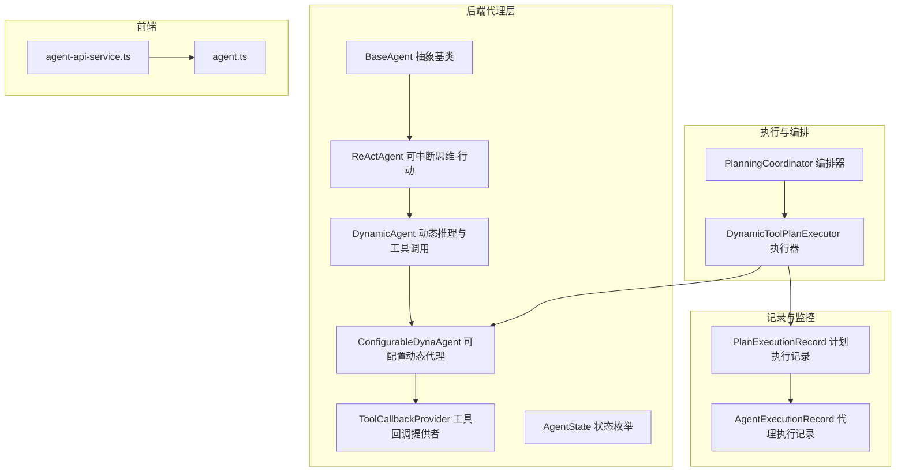
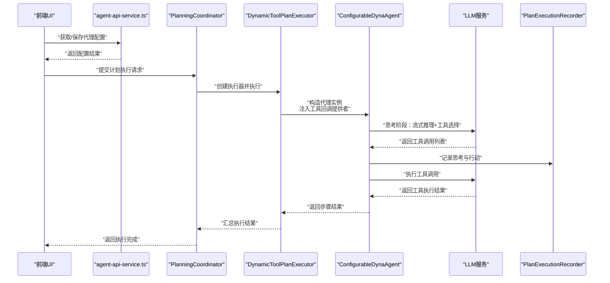
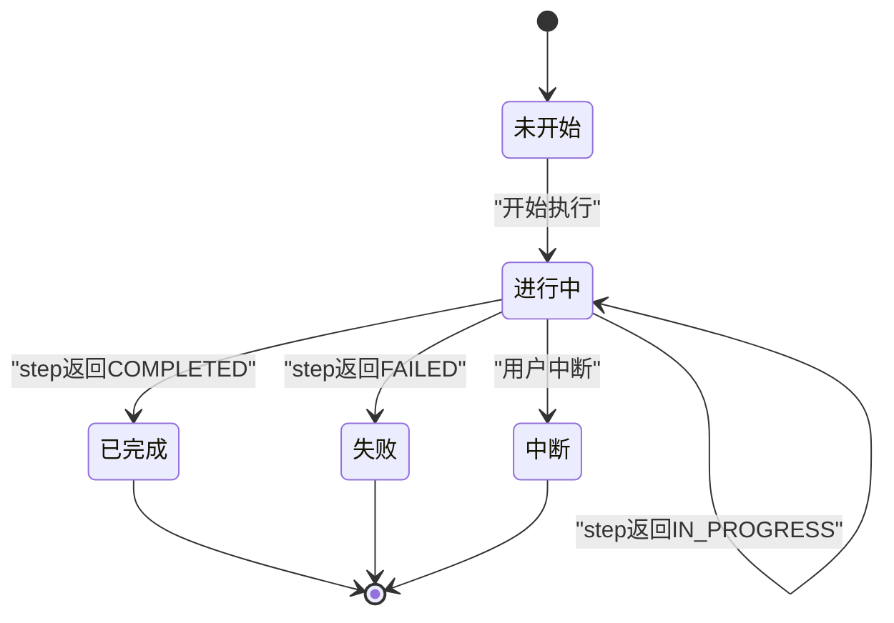
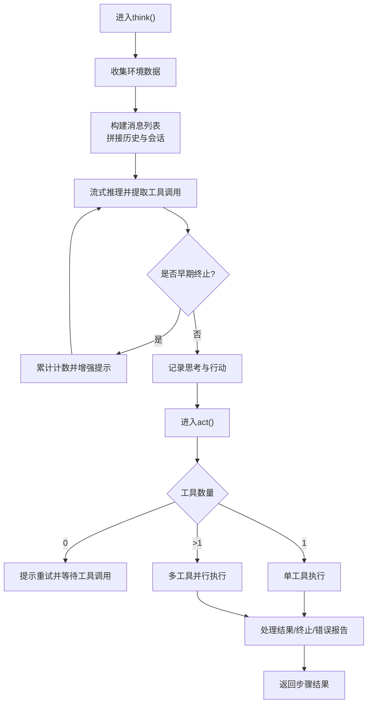
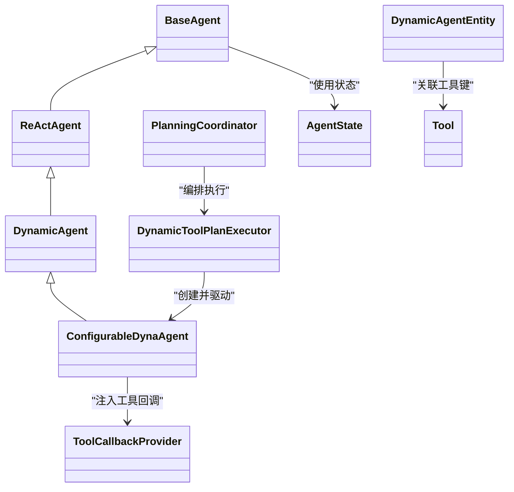

# AI代理管理

<cite>
**本文引用的文件列表**
- [BaseAgent.java](file://src/main/java/com/alibaba/cloud/ai/lynxe/agent/BaseAgent.java)
- [ReActAgent.java](file://src/main/java/com/alibaba/cloud/ai/lynxe/agent/ReActAgent.java)
- [DynamicAgent.java](file://src/main/java/com/alibaba/cloud/ai/lynxe/agent/DynamicAgent.java)
- [ConfigurableDynaAgent.java](file://src/main/java/com/alibaba/cloud/ai/lynxe/agent/ConfigurableDynaAgent.java)
- [AgentState.java](file://src/main/java/com/alibaba/cloud/ai/lynxe/agent/AgentState.java)
- [ToolCallbackProvider.java](file://src/main/java/com/alibaba/cloud/ai/lynxe/agent/ToolCallbackProvider.java)
- [DynamicAgentEntity.java](file://src/main/java/com/alibaba/cloud/ai/lynxe/agent/entity/DynamicAgentEntity.java)
- [Tool.java](file://src/main/java/com/alibaba/cloud/ai/lynxe/agent/model/Tool.java)
- [DynamicToolPlanExecutor.java](file://src/main/java/com/alibaba/cloud/ai/lynxe/runtime/executor/DynamicToolPlanExecutor.java)
- [PlanningCoordinator.java](file://src/main/java/com/alibaba/cloud/ai/lynxe/runtime/service/PlanningCoordinator.java)
- [PlanExecutionRecord.java](file://src/main/java/com/alibaba/cloud/ai/lynxe/recorder/entity/vo/PlanExecutionRecord.java)
- [AgentExecutionRecord.java](file://src/main/java/com/alibaba/cloud/ai/lynxe/recorder/entity/vo/AgentExecutionRecord.java)
- [agent-api-service.ts](file://ui-vue3/src/api/agent-api-service.ts)
- [agent.ts](file://ui-vue3/src/api/agent.ts)
</cite>

## 目录
1. [简介](#简介)
2. [项目结构](#项目结构)
3. [核心组件](#核心组件)
4. [架构总览](#架构总览)
5. [组件详解](#组件详解)
6. [依赖关系分析](#依赖关系分析)
7. [性能与资源管理](#性能与资源管理)
8. [故障排查指南](#故障排查指南)
9. [结论](#结论)
10. [附录](#附录)

## 简介
本文件系统性梳理了 JManus 项目中的 AI 代理管理体系，重点覆盖以下内容：
- 代理类型：DynamicAgent、BaseAgent、ConfigurableDynaAgent、ReActAgent 的职责、差异与适用场景
- 代理状态机（AgentState）的状态定义与流转规则
- 代理配置机制：动态配置加载、运行时工具选择与更新
- 代理执行流程：从创建、初始化、执行到销毁的全生命周期
- 代理间协作与通信：基于计划编排与工具回调的协同方式
- 性能监控与资源管理：内存、并发、重试与中断控制
- 自定义代理开发指南：接口实现、配置要求与最佳实践
- 实际示例路径与调试方法：通过代码片段路径定位关键实现

## 项目结构
代理管理位于后端模块的 agent 包中，围绕 ReAct 思维-行动范式构建，结合 LLM 推理与工具调用，支持动态工具集与可配置执行器。前端通过 UI 提供代理配置与管理能力。

图表来源
- [BaseAgent.java](file://src/main/java/com/alibaba/cloud/ai/lynxe/agent/BaseAgent.java#L1-L120)
- [ReActAgent.java](file://src/main/java/com/alibaba/cloud/ai/lynxe/agent/ReActAgent.java#L1-L97)
- [DynamicAgent.java](file://src/main/java/com/alibaba/cloud/ai/lynxe/agent/DynamicAgent.java#L1-L120)
- [ConfigurableDynaAgent.java](file://src/main/java/com/alibaba/cloud/ai/lynxe/agent/ConfigurableDynaAgent.java#L1-L120)
- [ToolCallbackProvider.java](file://src/main/java/com/alibaba/cloud/ai/lynxe/agent/ToolCallbackProvider.java#L1-L27)
- [DynamicToolPlanExecutor.java](file://src/main/java/com/alibaba/cloud/ai/lynxe/runtime/executor/DynamicToolPlanExecutor.java#L1-L183)
- [PlanningCoordinator.java](file://src/main/java/com/alibaba/cloud/ai/lynxe/runtime/service/PlanningCoordinator.java#L1-L182)
- [PlanExecutionRecord.java](file://src/main/java/com/alibaba/cloud/ai/lynxe/recorder/entity/vo/PlanExecutionRecord.java#L125-L164)
- [AgentExecutionRecord.java](file://src/main/java/com/alibaba/cloud/ai/lynxe/recorder/entity/vo/AgentExecutionRecord.java#L166-L244)
- [agent-api-service.ts](file://ui-vue3/src/api/agent-api-service.ts#L54-L142)
- [agent.ts](file://ui-vue3/src/api/agent.ts#L1-L95)

章节来源
- [BaseAgent.java](file://src/main/java/com/alibaba/cloud/ai/lynxe/agent/BaseAgent.java#L1-L120)
- [DynamicToolPlanExecutor.java](file://src/main/java/com/alibaba/cloud/ai/lynxe/runtime/executor/DynamicToolPlanExecutor.java#L1-L183)
- [PlanningCoordinator.java](file://src/main/java/com/alibaba/cloud/ai/lynxe/runtime/service/PlanningCoordinator.java#L1-L182)

## 核心组件
- BaseAgent：抽象基类，统一管理执行轮次、最大步数、记忆清理、异常包装与最终总结生成；定义 run() 主循环与 step() 抽象步骤。
- ReActAgent：在 BaseAgent 基础上引入 think()/act() 分离的思维-行动模式，支持可中断。
- DynamicAgent：ReActAgent 的具体实现，负责 LLM 思考、工具选择与执行、重试与早期终止检测、流式响应处理、错误报告与终止逻辑。
- ConfigurableDynaAgent：在 DynamicAgent 基础上增加“可配置工具集”，自动补齐终止工具，支持服务组索引与回退查找。
- ToolCallbackProvider：工具回调提供者接口，向代理暴露可用工具上下文。
- AgentState：代理状态枚举，涵盖未开始、进行中、已完成、阻塞、失败、中断。
- DynamicAgentEntity/Tool：持久化实体与工具模型，支撑前端配置与后端存储。

章节来源
- [BaseAgent.java](file://src/main/java/com/alibaba/cloud/ai/lynxe/agent/BaseAgent.java#L1-L200)
- [ReActAgent.java](file://src/main/java/com/alibaba/cloud/ai/lynxe/agent/ReActAgent.java#L1-L97)
- [DynamicAgent.java](file://src/main/java/com/alibaba/cloud/ai/lynxe/agent/DynamicAgent.java#L1-L200)
- [ConfigurableDynaAgent.java](file://src/main/java/com/alibaba/cloud/ai/lynxe/agent/ConfigurableDynaAgent.java#L1-L120)
- [ToolCallbackProvider.java](file://src/main/java/com/alibaba/cloud/ai/lynxe/agent/ToolCallbackProvider.java#L1-L27)
- [AgentState.java](file://src/main/java/com/alibaba/cloud/ai/lynxe/agent/AgentState.java#L1-L35)
- [DynamicAgentEntity.java](file://src/main/java/com/alibaba/cloud/ai/lynxe/agent/entity/DynamicAgentEntity.java#L1-L133)
- [Tool.java](file://src/main/java/com/alibaba/cloud/ai/lynxe/agent/model/Tool.java#L1-L82)

## 架构总览
代理生命周期由计划编排器触发，执行器根据步骤需求创建对应代理实例，代理在 think() 中进行 LLM 推理与工具选择，在 act() 中执行工具并处理结果，最终通过记录器落盘执行状态与结果。

图表来源
- [PlanningCoordinator.java](file://src/main/java/com/alibaba/cloud/ai/lynxe/runtime/service/PlanningCoordinator.java#L60-L182)
- [DynamicToolPlanExecutor.java](file://src/main/java/com/alibaba/cloud/ai/lynxe/runtime/executor/DynamicToolPlanExecutor.java#L119-L183)
- [ConfigurableDynaAgent.java](file://src/main/java/com/alibaba/cloud/ai/lynxe/agent/ConfigurableDynaAgent.java#L90-L160)
- [DynamicAgent.java](file://src/main/java/com/alibaba/cloud/ai/lynxe/agent/DynamicAgent.java#L200-L485)
- [PlanExecutionRecord.java](file://src/main/java/com/alibaba/cloud/ai/lynxe/recorder/entity/vo/PlanExecutionRecord.java#L125-L164)

## 组件详解

### 代理状态机与状态转换
- 状态枚举：未开始、进行中、已完成、阻塞、失败、中断
- 转换规则：
  - run() 循环内，每轮 step() 返回状态若为已完成/中断/失败则提前结束
  - 达到最大步数上限时，生成最终摘要并以终止工具收尾
  - 异常发生时通过 SystemErrorReportTool 包装并返回 IN_PROGRESS，同时记录错误信息
  - 成功完成后清理临时错误消息

图表来源
- [AgentState.java](file://src/main/java/com/alibaba/cloud/ai/lynxe/agent/AgentState.java#L1-L35)
- [BaseAgent.java](file://src/main/java/com/alibaba/cloud/ai/lynxe/agent/BaseAgent.java#L254-L332)

章节来源
- [AgentState.java](file://src/main/java/com/alibaba/cloud/ai/lynxe/agent/AgentState.java#L1-L35)
- [BaseAgent.java](file://src/main/java/com/alibaba/cloud/ai/lynxe/agent/BaseAgent.java#L254-L332)

### BaseAgent：抽象基类与执行主循环
- 关键职责
  - 统一管理当前计划ID、根计划ID、计划深度、会话ID
  - 最大步数限制与循环执行
  - 异常包装为工具输出，避免抛出原始异常
  - 生成最终摘要并终止
  - 清理 LLM 内存与记录执行完成
- AgentExecResult：封装单步结果与历史结果列表，便于回溯

章节来源
- [BaseAgent.java](file://src/main/java/com/alibaba/cloud/ai/lynxe/agent/BaseAgent.java#L1-L200)
- [BaseAgent.java](file://src/main/java/com/alibaba/cloud/ai/lynxe/agent/BaseAgent.java#L254-L332)
- [BaseAgent.java](file://src/main/java/com/alibaba/cloud/ai/lynxe/agent/BaseAgent.java#L334-L424)
- [BaseAgent.java](file://src/main/java/com/alibaba/cloud/ai/lynxe/agent/BaseAgent.java#L426-L603)

### ReActAgent：思维-行动分离
- think()：决策是否需要行动（由子类实现）
- act()：执行具体动作（由子类实现）
- step()：统一入口，捕获中断异常并返回相应状态

章节来源
- [ReActAgent.java](file://src/main/java/com/alibaba/cloud/ai/lynxe/agent/ReActAgent.java#L1-L97)

### DynamicAgent：动态推理与工具调用
- 思考阶段
  - 收集环境数据、拼装提示词、读取对话历史与会话历史
  - 流式响应处理，统计输入/输出字符数
  - 早期终止检测：连续多次仅返回文本无工具调用时，触发阈值失败
  - 重试机制：指数退避，区分可重试与不可重试异常
- 行动阶段
  - 单工具执行：校验回调上下文、处理表单输入、终止工具、错误报告工具
  - 多工具执行：并行执行，禁止包含可终止/表单工具
  - 结果压缩与重复检测，防止循环
- 清理与中断
  - 清理表单输入工具
  - 响应中断检查，及时退出

图表来源
- [DynamicAgent.java](file://src/main/java/com/alibaba/cloud/ai/lynxe/agent/DynamicAgent.java#L200-L485)
- [DynamicAgent.java](file://src/main/java/com/alibaba/cloud/ai/lynxe/agent/DynamicAgent.java#L606-L767)

章节来源
- [DynamicAgent.java](file://src/main/java/com/alibaba/cloud/ai/lynxe/agent/DynamicAgent.java#L1-L200)
- [DynamicAgent.java](file://src/main/java/com/alibaba/cloud/ai/lynxe/agent/DynamicAgent.java#L200-L485)
- [DynamicAgent.java](file://src/main/java/com/alibaba/cloud/ai/lynxe/agent/DynamicAgent.java#L606-L767)

### ConfigurableDynaAgent：可配置动态代理
- 工具集动态化
  - 若未指定工具集，则自动填充所有可用工具
  - 自动补齐终止工具（TerminableTool），确保可安全结束
  - 支持服务组工具名转换与回退查找，兼容旧格式
- 与 PlanningFactory 的集成
  - 通过 ToolCallbackProvider 注入工具回调上下文

章节来源
- [ConfigurableDynaAgent.java](file://src/main/java/com/alibaba/cloud/ai/lynxe/agent/ConfigurableDynaAgent.java#L1-L120)
- [ConfigurableDynaAgent.java](file://src/main/java/com/alibaba/cloud/ai/lynxe/agent/ConfigurableDynaAgent.java#L120-L220)
- [ConfigurableDynaAgent.java](file://src/main/java/com/alibaba/cloud/ai/lynxe/agent/ConfigurableDynaAgent.java#L220-L342)

### 执行器与编排：DynamicToolPlanExecutor 与 PlanningCoordinator
- DynamicToolPlanExecutor
  - 根据步骤需求创建 ConfigurableDynaAgent
  - 注入工具回调提供者与执行上下文（计划ID、根计划ID、会话ID、计划深度）
- PlanningCoordinator
  - 创建执行上下文，设置会话ID与摘要生成策略
  - 通过 PlanExecutorFactory 获取执行器并异步执行
  - 执行后进行收尾处理

章节来源
- [DynamicToolPlanExecutor.java](file://src/main/java/com/alibaba/cloud/ai/lynxe/runtime/executor/DynamicToolPlanExecutor.java#L119-L183)
- [PlanningCoordinator.java](file://src/main/java/com/alibaba/cloud/ai/lynxe/runtime/service/PlanningCoordinator.java#L60-L182)

### 配置与持久化：DynamicAgentEntity 与 Tool
- DynamicAgentEntity：存储代理名称、描述、下一步提示、可用工具键、类名、所属模型、命名空间、内置标记等
- Tool：工具元数据（键、名称、描述、启用状态、服务组、可选）

章节来源
- [DynamicAgentEntity.java](file://src/main/java/com/alibaba/cloud/ai/lynxe/agent/entity/DynamicAgentEntity.java#L1-L133)
- [Tool.java](file://src/main/java/com/alibaba/cloud/ai/lynxe/agent/model/Tool.java#L1-L82)

### 前端交互：代理配置与管理
- agent-api-service.ts：提供代理列表、详情、创建、更新、删除、可用工具查询等 API
- agent.ts：提供语言重置/初始化、统计查询等管理接口

章节来源
- [agent-api-service.ts](file://ui-vue3/src/api/agent-api-service.ts#L54-L142)
- [agent-api-service.ts](file://ui-vue3/src/api/agent-api-service.ts#L104-L175)
- [agent.ts](file://ui-vue3/src/api/agent.ts#L1-L95)

## 依赖关系分析

图表来源
- [BaseAgent.java](file://src/main/java/com/alibaba/cloud/ai/lynxe/agent/BaseAgent.java#L1-L120)
- [ReActAgent.java](file://src/main/java/com/alibaba/cloud/ai/lynxe/agent/ReActAgent.java#L1-L97)
- [DynamicAgent.java](file://src/main/java/com/alibaba/cloud/ai/lynxe/agent/DynamicAgent.java#L1-L120)
- [ConfigurableDynaAgent.java](file://src/main/java/com/alibaba/cloud/ai/lynxe/agent/ConfigurableDynaAgent.java#L1-L120)
- [ToolCallbackProvider.java](file://src/main/java/com/alibaba/cloud/ai/lynxe/agent/ToolCallbackProvider.java#L1-L27)
- [DynamicToolPlanExecutor.java](file://src/main/java/com/alibaba/cloud/ai/lynxe/runtime/executor/DynamicToolPlanExecutor.java#L119-L183)
- [PlanningCoordinator.java](file://src/main/java/com/alibaba/cloud/ai/lynxe/runtime/service/PlanningCoordinator.java#L60-L182)
- [AgentState.java](file://src/main/java/com/alibaba/cloud/ai/lynxe/agent/AgentState.java#L1-L35)
- [DynamicAgentEntity.java](file://src/main/java/com/alibaba/cloud/ai/lynxe/agent/entity/DynamicAgentEntity.java#L1-L133)
- [Tool.java](file://src/main/java/com/alibaba/cloud/ai/lynxe/agent/model/Tool.java#L1-L82)

## 性能与资源管理
- 流式响应与字符统计：在推理阶段统计输入/输出字符数，优化用户体验与成本控制
- 重试与退避：对网络类异常采用指数退避重试，降低瞬时故障影响
- 早期终止检测：连续多次仅文本无工具调用时，快速失败并提示调整模型配置
- 并行工具执行：多工具场景下并行执行，但排除可终止/表单工具
- 内存与会话：按计划ID维护代理记忆，按会话ID维护会话历史，支持禁用会话记忆时生成新会话ID
- 中断与清理：在每个关键阶段检查中断，失败/完成时清理临时状态与表单输入

章节来源
- [DynamicAgent.java](file://src/main/java/com/alibaba/cloud/ai/lynxe/agent/DynamicAgent.java#L320-L420)
- [DynamicAgent.java](file://src/main/java/com/alibaba/cloud/ai/lynxe/agent/DynamicAgent.java#L486-L571)
- [DynamicAgent.java](file://src/main/java/com/alibaba/cloud/ai/lynxe/agent/DynamicAgent.java#L606-L767)
- [PlanningCoordinator.java](file://src/main/java/com/alibaba/cloud/ai/lynxe/runtime/service/PlanningCoordinator.java#L100-L140)

## 故障排查指南
- 异常包装与错误上报
  - 使用 SystemErrorReportTool 将异常包装为工具输出，便于统一记录与展示
  - 解析工具输出中的错误信息，若无法解析则回退到通用错误消息
- 早期终止与工具调用失败
  - 当模型仅返回文本而未调用工具时，累计计数并增强提示；达到阈值后直接失败
  - 重试机制仅对可重试异常生效，非可重试异常立即抛出
- 中断处理
  - 在思考/行动/工具执行前检查中断，收到中断后返回中断状态并停止后续执行
- 记录与回溯
  - 通过 PlanExecutionRecord 与 AgentExecutionRecord 记录执行序列、时间戳、状态与错误信息，便于定位问题

章节来源
- [BaseAgent.java](file://src/main/java/com/alibaba/cloud/ai/lynxe/agent/BaseAgent.java#L334-L424)
- [DynamicAgent.java](file://src/main/java/com/alibaba/cloud/ai/lynxe/agent/DynamicAgent.java#L232-L320)
- [DynamicAgent.java](file://src/main/java/com/alibaba/cloud/ai/lynxe/agent/DynamicAgent.java#L320-L420)
- [PlanExecutionRecord.java](file://src/main/java/com/alibaba/cloud/ai/lynxe/recorder/entity/vo/PlanExecutionRecord.java#L125-L164)
- [AgentExecutionRecord.java](file://src/main/java/com/alibaba/cloud/ai/lynxe/recorder/entity/vo/AgentExecutionRecord.java#L166-L244)

## 结论
该代理体系以 ReAct 为核心范式，结合动态工具选择与可配置代理，实现了灵活、可观测且具备中断/重试/并行能力的执行框架。通过执行器与编排器解耦，配合前端配置与记录系统，能够满足复杂业务场景下的代理管理需求。

## 附录

### 代理生命周期与关键流程
- 创建与初始化
  - 通过 DynamicToolPlanExecutor 根据步骤需求创建 ConfigurableDynaAgent
  - 注入工具回调提供者、计划ID、根计划ID、会话ID、计划深度
- 执行
  - think()：流式推理、工具选择、早期终止检测、重试
  - act()：单/多工具执行、结果处理、终止/错误报告
- 销毁与清理
  - 清理表单输入工具、清空代理记忆、记录执行完成

章节来源
- [DynamicToolPlanExecutor.java](file://src/main/java/com/alibaba/cloud/ai/lynxe/runtime/executor/DynamicToolPlanExecutor.java#L119-L183)
- [DynamicAgent.java](file://src/main/java/com/alibaba/cloud/ai/lynxe/agent/DynamicAgent.java#L606-L767)
- [BaseAgent.java](file://src/main/java/com/alibaba/cloud/ai/lynxe/agent/BaseAgent.java#L309-L332)

### 自定义代理开发指南
- 必要接口与实现
  - 继承 ReActAgent 或 BaseAgent，实现 think()/act() 或 step()
  - 实现 getName()/getDescription() 以标识代理
  - 实现 getToolCallList()/getToolCallBackContext() 以提供工具回调
- 配置要求
  - 通过 ToolCallbackProvider 注入工具回调上下文
  - 在执行器中设置计划ID、根计划ID、会话ID、计划深度
  - 如需动态工具集，参考 ConfigurableDynaAgent 的工具集补全逻辑
- 最佳实践
  - 在 think() 中尽早检查中断
  - 对工具调用结果进行压缩与去重，避免循环
  - 使用 SystemErrorReportTool 包装异常，保持输出一致性
  - 记录思考与行动参数，便于审计与回溯

章节来源
- [ReActAgent.java](file://src/main/java/com/alibaba/cloud/ai/lynxe/agent/ReActAgent.java#L46-L97)
- [ConfigurableDynaAgent.java](file://src/main/java/com/alibaba/cloud/ai/lynxe/agent/ConfigurableDynaAgent.java#L90-L160)
- [DynamicToolPlanExecutor.java](file://src/main/java/com/alibaba/cloud/ai/lynxe/runtime/executor/DynamicToolPlanExecutor.java#L149-L183)

### 前端配置与管理示例路径
- 获取代理列表与详情
  - [agent-api-service.ts](file://ui-vue3/src/api/agent-api-service.ts#L72-L102)
  - [agent.ts](file://ui-vue3/src/api/agent.ts#L48-L55)
- 创建/更新/删除代理
  - [agent-api-service.ts](file://ui-vue3/src/api/agent-api-service.ts#L104-L142)
- 导入/导出代理配置
  - [agent-api-service.ts](file://ui-vue3/src/api/agent-api-service.ts#L225-L338)