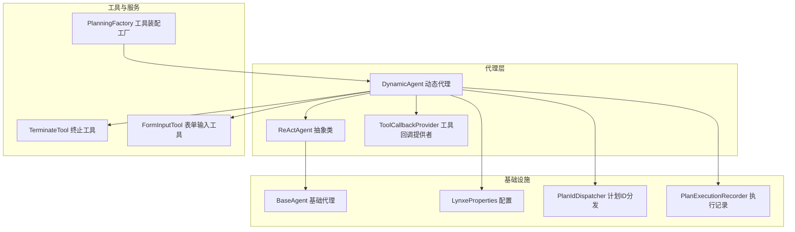
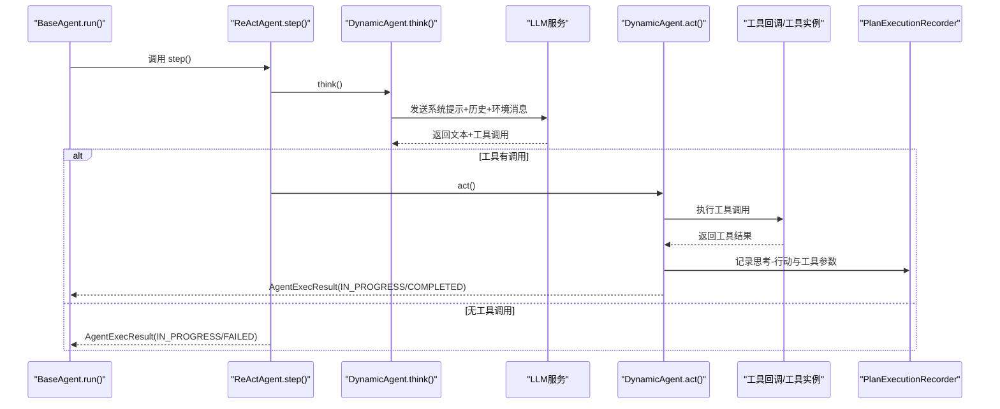
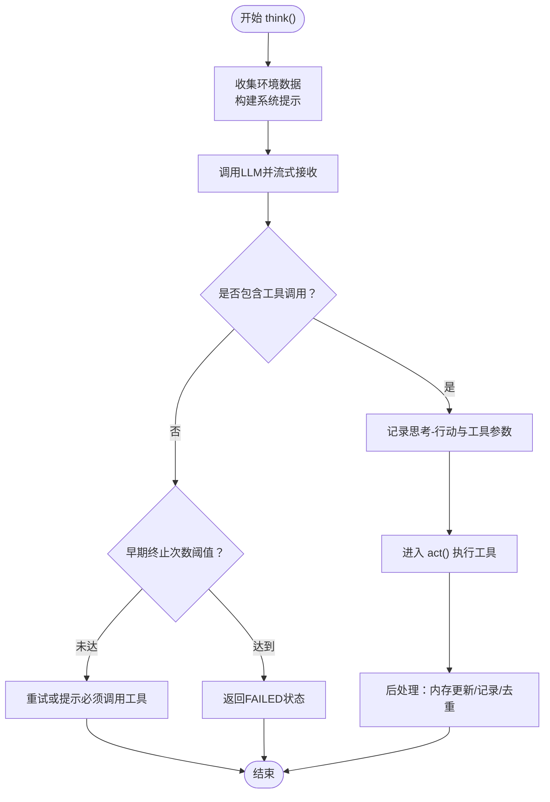
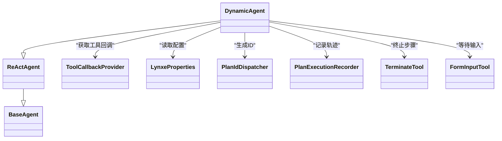

# ReAct代理

<cite>
**本文引用的文件**
- [ReActAgent.java](file://src/main/java/com/alibaba/cloud/ai/lynxe/agent/ReActAgent.java)
- [BaseAgent.java](file://src/main/java/com/alibaba/cloud/ai/lynxe/agent/BaseAgent.java)
- [DynamicAgent.java](file://src/main/java/com/alibaba/cloud/ai/lynxe/agent/DynamicAgent.java)
- [ToolCallbackProvider.java](file://src/main/java/com/alibaba/cloud/ai/lynxe/agent/ToolCallbackProvider.java)
- [AgentState.java](file://src/main/java/com/alibaba/cloud/ai/lynxe/agent/AgentState.java)
- [PlanningFactory.java](file://src/main/java/com/alibaba/cloud/ai/lynxe/planning/PlanningFactory.java)
- [LynxeProperties.java](file://src/main/java/com/alibaba/cloud/ai/lynxe/config/LynxeProperties.java)
- [PlanIdDispatcher.java](file://src/main/java/com/alibaba/cloud/ai/lynxe/runtime/service/PlanIdDispatcher.java)
- [TerminateTool.java](file://src/main/java/com/alibaba/cloud/ai/lynxe/tool/TerminateTool.java)
- [FormInputTool.java](file://src/main/java/com/alibaba/cloud/ai/lynxe/tool/FormInputTool.java)
- [NewRepoPlanExecutionRecorder.java](file://src/main/java/com/alibaba/cloud/ai/lynxe/recorder/service/NewRepoPlanExecutionRecorder.java)
- [ThinkActRecord.java](file://src/main/java/com/alibaba/cloud/ai/lynxe/recorder/entity/vo/ThinkActRecord.java)
- [AgentExecutionRecord.java](file://src/main/java/com/alibaba/cloud/ai/lynxe/recorder/entity/vo/AgentExecutionRecord.java)
</cite>

## 目录
1. [简介](#简介)
2. [项目结构](#项目结构)
3. [核心组件](#核心组件)
4. [架构总览](#架构总览)
5. [详细组件分析](#详细组件分析)
6. [依赖关系分析](#依赖关系分析)
7. [性能与可扩展性](#性能与可扩展性)
8. [故障排查指南](#故障排查指南)
9. [结论](#结论)
10. [附录：自定义与扩展指南](#附录自定义与扩展指南)

## 简介
本文件系统性地解析ReAct代理在该代码库中的实现与工作机制，围绕“推理-行动”（Reasoning-Acting）模式展开，重点覆盖：
- 思维链（Chain-of-Thought）提示模板的构造与注入
- LLM输出中行动指令的解析与路由
- 执行流程：观察→思考→行动→观察的迭代闭环
- 工具调用的特殊处理：参数提取、执行结果格式化、错误恢复
- 使用场景与最佳实践：复杂问题求解、多步骤任务执行
- 自定义ReAct提示模板与扩展行动类型的方法

## 项目结构
ReAct代理位于agent模块，配合基础框架（BaseAgent）、动态执行器（DynamicAgent）、工具回调提供者（ToolCallbackProvider）、配置（LynxeProperties）、计划ID分发（PlanIdDispatcher）、记录器（PlanExecutionRecorder）与工具集（TerminateTool、FormInputTool等）共同构成完整的ReAct执行闭环。

图表来源
- [ReActAgent.java](file://src/main/java/com/alibaba/cloud/ai/lynxe/agent/ReActAgent.java#L1-L97)
- [BaseAgent.java](file://src/main/java/com/alibaba/cloud/ai/lynxe/agent/BaseAgent.java#L1-L120)
- [DynamicAgent.java](file://src/main/java/com/alibaba/cloud/ai/lynxe/agent/DynamicAgent.java#L79-L123)
- [ToolCallbackProvider.java](file://src/main/java/com/alibaba/cloud/ai/lynxe/agent/ToolCallbackProvider.java#L1-L27)
- [PlanningFactory.java](file://src/main/java/com/alibaba/cloud/ai/lynxe/planning/PlanningFactory.java#L1-L120)
- [LynxeProperties.java](file://src/main/java/com/alibaba/cloud/ai/lynxe/config/LynxeProperties.java#L150-L200)
- [PlanIdDispatcher.java](file://src/main/java/com/alibaba/cloud/ai/lynxe/runtime/service/PlanIdDispatcher.java#L238-L273)
- [TerminateTool.java](file://src/main/java/com/alibaba/cloud/ai/lynxe/tool/TerminateTool.java#L1-L60)
- [FormInputTool.java](file://src/main/java/com/alibaba/cloud/ai/lynxe/tool/FormInputTool.java#L1-L60)

章节来源
- [ReActAgent.java](file://src/main/java/com/alibaba/cloud/ai/lynxe/agent/ReActAgent.java#L1-L97)
- [BaseAgent.java](file://src/main/java/com/alibaba/cloud/ai/lynxe/agent/BaseAgent.java#L1-L120)
- [DynamicAgent.java](file://src/main/java/com/alibaba/cloud/ai/lynxe/agent/DynamicAgent.java#L79-L123)

## 核心组件
- ReActAgent：抽象基类，定义“思考（think）→行动（act）”的交替执行接口，封装step()的统一入口与中断处理。
- BaseAgent：通用代理基类，提供运行时循环、最大步数限制、异常包装、记忆清理、最终总结与终止逻辑。
- DynamicAgent：ReActAgent的具体实现，负责构建思维链提示、调用LLM进行思考、解析工具调用、执行工具、记录执行轨迹。
- ToolCallbackProvider：提供工具回调上下文映射，供DynamicAgent在执行阶段按工具名路由到具体函数实现。
- LynxeProperties：全局配置项，影响思维链提示规则（是否并行工具调用、调试细节、最大步数、最大记忆等）。
- PlanIdDispatcher：生成唯一ID（工具调用ID、思考-行动ID），用于记录与追踪。
- PlanExecutionRecorder：记录每次思考-行动输入输出、工具调用参数、字符计数等，支撑可观测性与回放。
- TerminateTool/FormInputTool：特殊工具，分别用于显式结束当前步骤或等待用户输入，影响状态流转。

章节来源
- [ReActAgent.java](file://src/main/java/com/alibaba/cloud/ai/lynxe/agent/ReActAgent.java#L46-L96)
- [BaseAgent.java](file://src/main/java/com/alibaba/cloud/ai/lynxe/agent/BaseAgent.java#L254-L332)
- [DynamicAgent.java](file://src/main/java/com/alibaba/cloud/ai/lynxe/agent/DynamicAgent.java#L200-L230)
- [ToolCallbackProvider.java](file://src/main/java/com/alibaba/cloud/ai/lynxe/agent/ToolCallbackProvider.java#L1-L27)
- [LynxeProperties.java](file://src/main/java/com/alibaba/cloud/ai/lynxe/config/LynxeProperties.java#L150-L200)
- [PlanIdDispatcher.java](file://src/main/java/com/alibaba/cloud/ai/lynxe/runtime/service/PlanIdDispatcher.java#L238-L273)
- [TerminateTool.java](file://src/main/java/com/alibaba/cloud/ai/lynxe/tool/TerminateTool.java#L1-L60)
- [FormInputTool.java](file://src/main/java/com/alibaba/cloud/ai/lynxe/tool/FormInputTool.java#L1-L60)

## 架构总览
ReAct代理的执行由BaseAgent.run()驱动，每轮通过ReActAgent.step()完成一次“思考→行动”的循环；DynamicAgent在think()中构建思维链提示并调用LLM，解析工具调用后在act()中执行工具，再通过记录器持久化轨迹。

图表来源
- [BaseAgent.java](file://src/main/java/com/alibaba/cloud/ai/lynxe/agent/BaseAgent.java#L254-L332)
- [ReActAgent.java](file://src/main/java/com/alibaba/cloud/ai/lynxe/agent/ReActAgent.java#L78-L96)
- [DynamicAgent.java](file://src/main/java/com/alibaba/cloud/ai/lynxe/agent/DynamicAgent.java#L200-L230)
- [DynamicAgent.java](file://src/main/java/com/alibaba/cloud/ai/lynxe/agent/DynamicAgent.java#L606-L767)
- [NewRepoPlanExecutionRecorder.java](file://src/main/java/com/alibaba/cloud/ai/lynxe/recorder/service/NewRepoPlanExecutionRecorder.java#L411-L440)

## 详细组件分析

### ReActAgent：抽象的“思考-行动”循环
- 定义两个抽象方法：think()决定是否需要行动；act()执行具体行动并返回结果。
- step()统一捕获TaskInterruptedException，返回INTERRUPTED状态，确保可中断执行。
- 作为DynamicAgent的父类，承接通用的AgentExecResult封装与状态管理。

章节来源
- [ReActAgent.java](file://src/main/java/com/alibaba/cloud/ai/lynxe/agent/ReActAgent.java#L46-L96)

### BaseAgent：运行时生命周期与异常处理
- run()循环执行step()，根据AgentState判断终止条件（COMPLETED/INTERRUPTED/FAILED）。
- handleExceptionWithSystemErrorReport()将异常包装为工具结果，模拟正常后处理流程，便于统一记录与展示。
- generateFinalSummary()/terminateWithSummary()在达到最大步数时生成摘要并终止。
- 清理对话记忆、记录完整执行结果。

章节来源
- [BaseAgent.java](file://src/main/java/com/alibaba/cloud/ai/lynxe/agent/BaseAgent.java#L254-L332)
- [BaseAgent.java](file://src/main/java/com/alibaba/cloud/ai/lynxe/agent/BaseAgent.java#L334-L424)
- [BaseAgent.java](file://src/main/java/com/alibaba/cloud/ai/lynxe/agent/BaseAgent.java#L538-L601)

### DynamicAgent：思维链提示与工具调用解析
- think()阶段：
  - 收集环境数据，构建系统提示（getThinkMessage），拼接历史记忆与当前环境消息。
  - 通过StreamingResponseHandler流式接收响应，提取有效工具调用列表与文本内容。
  - 若多次尝试仍仅返回文本（早期终止阈值），则判定失败并返回FAILED状态。
  - 记录思考-行动输入输出、工具调用参数、字符计数。
- act()阶段：
  - 单工具：直接执行工具回调，处理FormInputTool、TerminableTool、TerminateTool、ErrorReportTool、SystemErrorReportTool等特殊分支。
  - 多工具：通过并行执行服务执行，禁止包含FormInputTool与TerminableTool。
  - 执行后统一进入executePostToolFlow()，更新内存、记录轨迹、检测重复结果并压缩。

图表来源
- [DynamicAgent.java](file://src/main/java/com/alibaba/cloud/ai/lynxe/agent/DynamicAgent.java#L200-L230)
- [DynamicAgent.java](file://src/main/java/com/alibaba/cloud/ai/lynxe/agent/DynamicAgent.java#L321-L429)
- [DynamicAgent.java](file://src/main/java/com/alibaba/cloud/ai/lynxe/agent/DynamicAgent.java#L606-L767)
- [NewRepoPlanExecutionRecorder.java](file://src/main/java/com/alibaba/cloud/ai/lynxe/recorder/service/NewRepoPlanExecutionRecorder.java#L411-L440)

章节来源
- [DynamicAgent.java](file://src/main/java/com/alibaba/cloud/ai/lynxe/agent/DynamicAgent.java#L200-L230)
- [DynamicAgent.java](file://src/main/java/com/alibaba/cloud/ai/lynxe/agent/DynamicAgent.java#L321-L429)
- [DynamicAgent.java](file://src/main/java/com/alibaba/cloud/ai/lynxe/agent/DynamicAgent.java#L606-L767)

### 思维链提示模板与“观察→思考→行动→观察”的迭代
- 观察：从历史记忆、对话历史、当前环境消息中构建上下文。
- 思考：getThinkMessage()根据LynxeProperties生成系统提示，包含操作系统信息、日期、当前步骤要求、额外参数、调试规则、并行工具调用规则等。
- 行动：解析工具调用列表，执行工具，得到工具响应。
- 观察：将工具结果写入对话记忆，作为下一轮的“观察”输入。

章节来源
- [BaseAgent.java](file://src/main/java/com/alibaba/cloud/ai/lynxe/agent/BaseAgent.java#L148-L222)
- [DynamicAgent.java](file://src/main/java/com/alibaba/cloud/ai/lynxe/agent/DynamicAgent.java#L281-L320)
- [DynamicAgent.java](file://src/main/java/com/alibaba/cloud/ai/lynxe/agent/DynamicAgent.java#L665-L676)

### 工具调用的特殊处理
- 参数提取：从流式响应中提取ToolCall列表，转换为ActToolParam集合，记录到执行记录。
- 执行结果格式化：统一通过ToolResponseMessage读取响应，支持JSON结构化输出。
- 错误恢复：当工具回调上下文缺失、工具异常、或用户中断时，统一走handleExceptionWithSystemErrorReport()或返回对应状态（INTERRUPTED/FAILED/IN_PROGRESS）。
- 特殊工具：
  - TerminateTool：标记COMPLETED，结束当前步骤。
  - FormInputTool：等待用户输入，结束后移除表单工具。
  - ErrorReportTool/SystemErrorReportTool：提取errorMessage并记录。

章节来源
- [DynamicAgent.java](file://src/main/java/com/alibaba/cloud/ai/lynxe/agent/DynamicAgent.java#L410-L429)
- [DynamicAgent.java](file://src/main/java/com/alibaba/cloud/ai/lynxe/agent/DynamicAgent.java#L683-L758)
- [TerminateTool.java](file://src/main/java/com/alibaba/cloud/ai/lynxe/tool/TerminateTool.java#L1-L60)
- [FormInputTool.java](file://src/main/java/com/alibaba/cloud/ai/lynxe/tool/FormInputTool.java#L1-L60)

### 执行记录与可观测性
- ThinkActRecord：记录思考输入/输出、工具调用列表、字符计数等。
- AgentExecutionRecord：聚合think-act步骤，维护子计划执行记录。
- NewRepoPlanExecutionRecorder：将think-act实体持久化并挂接到AgentExecutionRecord。

章节来源
- [ThinkActRecord.java](file://src/main/java/com/alibaba/cloud/ai/lynxe/recorder/entity/vo/ThinkActRecord.java#L106-L157)
- [AgentExecutionRecord.java](file://src/main/java/com/alibaba/cloud/ai/lynxe/recorder/entity/vo/AgentExecutionRecord.java#L242-L300)
- [NewRepoPlanExecutionRecorder.java](file://src/main/java/com/alibaba/cloud/ai/lynxe/recorder/service/NewRepoPlanExecutionRecorder.java#L411-L440)

## 依赖关系分析
- DynamicAgent依赖：
  - ToolCallbackProvider：按工具名查找回调上下文，驱动工具执行。
  - LynxeProperties：控制调试细节、并行工具调用、最大步数、最大记忆等。
  - PlanIdDispatcher：生成工具调用ID与思考-行动ID，保证记录唯一性。
  - PlanExecutionRecorder：记录思考-行动与工具参数。
  - 工具集：TerminateTool、FormInputTool等特殊工具影响状态流转。
- BaseAgent依赖：
  - LlmService：获取对话记忆、发送对话请求。
  - PlanExecutionRecorder：最终记录执行完成。

图表来源
- [ReActAgent.java](file://src/main/java/com/alibaba/cloud/ai/lynxe/agent/ReActAgent.java#L1-L97)
- [BaseAgent.java](file://src/main/java/com/alibaba/cloud/ai/lynxe/agent/BaseAgent.java#L1-L120)
- [DynamicAgent.java](file://src/main/java/com/alibaba/cloud/ai/lynxe/agent/DynamicAgent.java#L79-L123)
- [ToolCallbackProvider.java](file://src/main/java/com/alibaba/cloud/ai/lynxe/agent/ToolCallbackProvider.java#L1-L27)
- [LynxeProperties.java](file://src/main/java/com/alibaba/cloud/ai/lynxe/config/LynxeProperties.java#L150-L200)
- [PlanIdDispatcher.java](file://src/main/java/com/alibaba/cloud/ai/lynxe/runtime/service/PlanIdDispatcher.java#L238-L273)
- [TerminateTool.java](file://src/main/java/com/alibaba/cloud/ai/lynxe/tool/TerminateTool.java#L1-L60)
- [FormInputTool.java](file://src/main/java/com/alibaba/cloud/ai/lynxe/tool/FormInputTool.java#L1-L60)

## 性能与可扩展性
- 流式响应与字符计数：通过StreamingResponseHandler统计输入/输出字符数，有助于成本与性能监控。
- 早期终止检测：若多次尝试仅返回文本而无工具调用，触发失败保护，避免无限循环。
- 并行工具调用：受LynxeProperties控制，DynamicAgent在配置允许时支持多工具并行执行，但对特定工具（FormInputTool、TerminableTool）有禁用策略。
- 记忆与历史：通过ConversationMemoryLimitService与LlmService的对话记忆，平衡上下文长度与效果。

章节来源
- [DynamicAgent.java](file://src/main/java/com/alibaba/cloud/ai/lynxe/agent/DynamicAgent.java#L356-L378)
- [DynamicAgent.java](file://src/main/java/com/alibaba/cloud/ai/lynxe/agent/DynamicAgent.java#L380-L400)
- [DynamicAgent.java](file://src/main/java/com/alibaba/cloud/ai/lynxe/agent/DynamicAgent.java#L776-L800)

## 故障排查指南
- 无工具调用：
  - 检查getThinkMessage()中的并行工具调用规则与调试开关。
  - 查看DynamicAgent的重试与早期终止逻辑，确认是否因模型未调用工具导致。
- 工具回调缺失：
  - 确认ToolCallbackProvider是否正确注册了工具回调上下文。
  - 若缺失，会记录错误并返回IN_PROGRESS，同时保留工具结果以便后续处理。
- 用户中断：
  - TaskInterruptionCheckerService抛出TaskInterruptedException，step()捕获并返回INTERRUPTED。
- 异常处理：
  - 使用handleExceptionWithSystemErrorReport()将异常包装为工具结果，便于统一记录与展示。
- 最大步数：
  - 达到maxSteps后，generateFinalSummary()生成摘要并通过TerminateTool终止。

章节来源
- [DynamicAgent.java](file://src/main/java/com/alibaba/cloud/ai/lynxe/agent/DynamicAgent.java#L200-L230)
- [DynamicAgent.java](file://src/main/java/com/alibaba/cloud/ai/lynxe/agent/DynamicAgent.java#L510-L553)
- [BaseAgent.java](file://src/main/java/com/alibaba/cloud/ai/lynxe/agent/BaseAgent.java#L334-L424)
- [BaseAgent.java](file://src/main/java/com/alibaba/cloud/ai/lynxe/agent/BaseAgent.java#L538-L601)

## 结论
ReAct代理通过“思考-行动”的交替循环，结合可配置的思维链提示模板与严格的工具调用解析与执行流程，实现了复杂问题求解与多步骤任务的稳健执行。DynamicAgent在think()中构建高质量提示并在act()中严格处理工具回调与异常，配合PlanExecutionRecorder提供完整的可观测性。开发者可通过自定义提示模板与扩展工具类型，灵活适配不同业务场景。

## 附录：自定义与扩展指南

### 自定义ReAct提示模板
- 修改系统提示变量：
  - 在BaseAgent.getThinkMessage()中调整系统信息、当前日期、步骤要求、额外参数、调试规则、并行工具调用规则等变量，以适配不同模型与业务需求。
- 控制行为规则：
  - 通过LynxeProperties.getDebugDetail()控制是否要求工具调用前的解释说明。
  - 通过LynxeProperties.getParallelToolCalls()控制是否允许并行工具调用。
- 环境注入：
  - 在DynamicAgent.think()中收集环境数据，拼接到当前步骤消息，增强上下文感知。

章节来源
- [BaseAgent.java](file://src/main/java/com/alibaba/cloud/ai/lynxe/agent/BaseAgent.java#L148-L222)
- [LynxeProperties.java](file://src/main/java/com/alibaba/cloud/ai/lynxe/config/LynxeProperties.java#L150-L200)
- [DynamicAgent.java](file://src/main/java/com/alibaba/cloud/ai/lynxe/agent/DynamicAgent.java#L321-L320)

### 扩展行动类型（工具）
- 注册工具回调：
  - 通过ToolCallbackProvider提供工具回调上下文映射，DynamicAgent按工具名查找并执行。
- 特殊工具处理：
  - 终止：使用TerminateTool，设置AgentState.COMPLETED。
  - 等待输入：使用FormInputTool，结束后移除表单工具。
  - 错误上报：使用ErrorReportTool/SystemErrorReportTool，提取errorMessage并记录。
- 并行执行：
  - 当启用并行工具调用时，DynamicAgent.processMultipleTools()负责调度；注意对受限工具的禁用策略。

章节来源
- [ToolCallbackProvider.java](file://src/main/java/com/alibaba/cloud/ai/lynxe/agent/ToolCallbackProvider.java#L1-L27)
- [DynamicAgent.java](file://src/main/java/com/alibaba/cloud/ai/lynxe/agent/DynamicAgent.java#L683-L758)
- [TerminateTool.java](file://src/main/java/com/alibaba/cloud/ai/lynxe/tool/TerminateTool.java#L1-L60)
- [FormInputTool.java](file://src/main/java/com/alibaba/cloud/ai/lynxe/tool/FormInputTool.java#L1-L60)

### 使用场景示例
- 复杂问题求解：通过getThinkMessage()构建强提示，逐步拆解问题，使用工具获取外部信息，最终通过TerminateTool汇总输出。
- 多步骤任务执行：利用PlanIdDispatcher生成唯一ID，记录每次think-act，便于回溯与审计。
- 交互式流程：借助FormInputTool等待用户输入，完成后继续执行下一步。

章节来源
- [PlanIdDispatcher.java](file://src/main/java/com/alibaba/cloud/ai/lynxe/runtime/service/PlanIdDispatcher.java#L238-L273)
- [NewRepoPlanExecutionRecorder.java](file://src/main/java/com/alibaba/cloud/ai/lynxe/recorder/service/NewRepoPlanExecutionRecorder.java#L411-L440)
- [FormInputTool.java](file://src/main/java/com/alibaba/cloud/ai/lynxe/tool/FormInputTool.java#L1-L60)