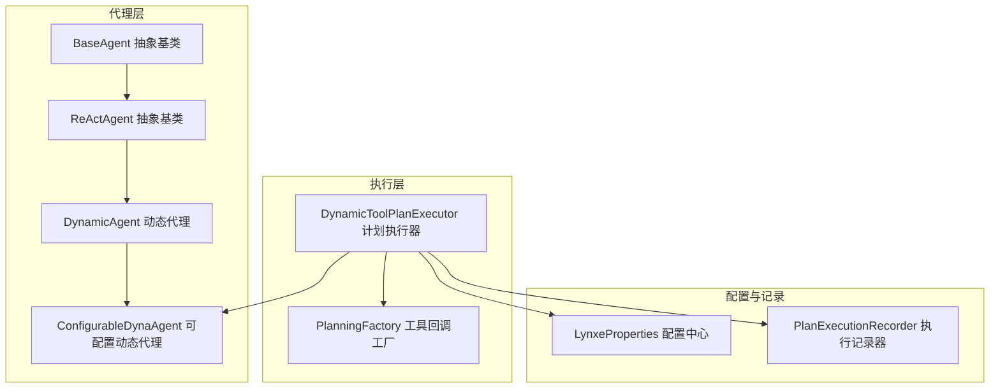
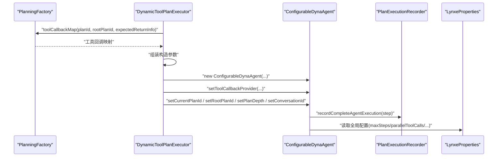
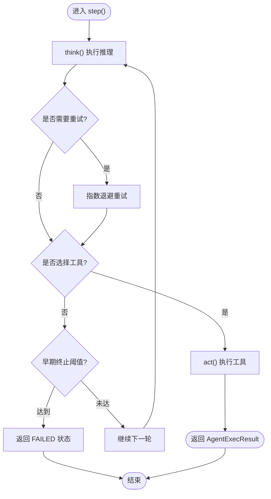

# 代理创建

<cite>
**本文引用的文件列表**
- [BaseAgent.java](file://src/main/java/com/alibaba/cloud/ai/lynxe/agent/BaseAgent.java)
- [ReActAgent.java](file://src/main/java/com/alibaba/cloud/ai/lynxe/agent/ReActAgent.java)
- [DynamicAgent.java](file://src/main/java/com/alibaba/cloud/ai/lynxe/agent/DynamicAgent.java)
- [ConfigurableDynaAgent.java](file://src/main/java/com/alibaba/cloud/ai/lynxe/agent/ConfigurableDynaAgent.java)
- [ToolCallbackProvider.java](file://src/main/java/com/alibaba/cloud/ai/lynxe/agent/ToolCallbackProvider.java)
- [DynamicAgentDefinition.java](file://src/main/java/com/alibaba/cloud/ai/lynxe/agent/annotation/DynamicAgentDefinition.java)
- [DynamicAgentEntity.java](file://src/main/java/com/alibaba/cloud/ai/lynxe/agent/entity/DynamicAgentEntity.java)
- [DynamicToolPlanExecutor.java](file://src/main/java/com/alibaba/cloud/ai/lynxe/runtime/executor/DynamicToolPlanExecutor.java)
- [PlanningFactory.java](file://src/main/java/com/alibaba/cloud/ai/lynxe/planning/PlanningFactory.java)
- [LynxeProperties.java](file://src/main/java/com/alibaba/cloud/ai/lynxe/config/LynxeProperties.java)
- [PlanExecutionRecorder.java](file://src/main/java/com/alibaba/cloud/ai/lynxe/recorder/service/PlanExecutionRecorder.java)
- [PlanExecutorFactory.java](file://src/main/java/com/alibaba/cloud/ai/lynxe/runtime/executor/factory/PlanExecutorFactory.java)
</cite>

## 目录
1. [引言](#引言)
2. [项目结构与总体架构](#项目结构与总体架构)
3. [核心组件与职责](#核心组件与职责)
4. [代理类型与创建流程](#代理类型与创建流程)
5. [依赖注入与初始化机制](#依赖注入与初始化机制)
6. [配置参数与可用工具键处理](#配置参数与可用工具键处理)
7. [代理命名、描述与提示模板配置](#代理命名描述与提示模板配置)
8. [代码示例：构造函数注入与实例化](#代码示例构造函数注入与实例化)
9. [异常处理与日志记录](#异常处理与日志记录)
10. [自定义代理开发指南](#自定义代理开发指南)
11. [性能与可靠性考量](#性能与可靠性考量)
12. [故障排查](#故障排查)
13. [结论](#结论)

## 引言
本文件面向开发者，系统性地讲解“动态代理”（DynamicAgent、ConfigurableDynaAgent、ReActAgent、BaseAgent）的创建与运行机制，涵盖依赖注入、配置参数传递、可用工具键处理差异、命名与提示模板配置、异常与日志处理，以及如何基于现有框架扩展自定义代理类型。文档同时给出关键流程图与时序图，帮助快速理解代理从“计划执行器”到“具体代理”的装配过程。

## 项目结构与总体架构
代理体系位于 agent 包，围绕 ReAct 思想构建，以 BaseAgent 为抽象基类，DynamicAgent 扩展 ReActAgent 实现思考-行动循环；ConfigurableDynaAgent 在 DynamicAgent 基础上支持运行时可选工具集。执行器层由 DynamicToolPlanExecutor 负责根据计划步骤选择合适的代理类型并完成依赖注入与实例化；PlanningFactory 提供工具回调映射；LynxeProperties 提供全局配置；PlanExecutionRecorder 记录执行轨迹。

图表来源
- [BaseAgent.java](file://src/main/java/com/alibaba/cloud/ai/lynxe/agent/BaseAgent.java#L1-L120)
- [ReActAgent.java](file://src/main/java/com/alibaba/cloud/ai/lynxe/agent/ReActAgent.java#L1-L97)
- [DynamicAgent.java](file://src/main/java/com/alibaba/cloud/ai/lynxe/agent/DynamicAgent.java#L1-L120)
- [ConfigurableDynaAgent.java](file://src/main/java/com/alibaba/cloud/ai/lynxe/agent/ConfigurableDynaAgent.java#L1-L120)
- [DynamicToolPlanExecutor.java](file://src/main/java/com/alibaba/cloud/ai/lynxe/runtime/executor/DynamicToolPlanExecutor.java#L119-L180)
- [PlanningFactory.java](file://src/main/java/com/alibaba/cloud/ai/lynxe/planning/PlanningFactory.java#L106-L200)
- [LynxeProperties.java](file://src/main/java/com/alibaba/cloud/ai/lynxe/config/LynxeProperties.java#L150-L220)
- [PlanExecutionRecorder.java](file://src/main/java/com/alibaba/cloud/ai/lynxe/recorder/service/PlanExecutionRecorder.java#L1-L120)

章节来源
- [BaseAgent.java](file://src/main/java/com/alibaba/cloud/ai/lynxe/agent/BaseAgent.java#L1-L120)
- [DynamicToolPlanExecutor.java](file://src/main/java/com/alibaba/cloud/ai/lynxe/runtime/executor/DynamicToolPlanExecutor.java#L119-L180)

## 核心组件与职责
- BaseAgent：提供统一的执行循环、状态管理、异常包装、内存清理与最终总结生成能力。
- ReActAgent：定义 think()/act() 的抽象，形成“思考-行动”交替的执行模式。
- DynamicAgent：实现思考阶段的 LLM 推理、工具调用收集、重试与早期终止检测、单/多工具执行、结果后处理与重复结果检测。
- ConfigurableDynaAgent：在 DynamicAgent 基础上，支持运行时传入 availableToolKeys，自动补齐 TerminateTool 并兼容服务组工具键格式。
- DynamicToolPlanExecutor：根据 ExecutionStep 的需求创建 ConfigurableDynaAgent，注入工具回调映射与上下文。
- PlanningFactory：提供工具回调映射（ToolCallBackContext），作为工具选择与调用的桥梁。
- LynxeProperties：集中管理最大步数、并发工具调用、对话记忆开关、读超时等全局配置。
- PlanExecutionRecorder：记录 Think-Act 流程、动作结果、代理执行完成等信息。

章节来源
- [BaseAgent.java](file://src/main/java/com/alibaba/cloud/ai/lynxe/agent/BaseAgent.java#L120-L220)
- [ReActAgent.java](file://src/main/java/com/alibaba/cloud/ai/lynxe/agent/ReActAgent.java#L27-L97)
- [DynamicAgent.java](file://src/main/java/com/alibaba/cloud/ai/lynxe/agent/DynamicAgent.java#L167-L220)
- [ConfigurableDynaAgent.java](file://src/main/java/com/alibaba/cloud/ai/lynxe/agent/ConfigurableDynaAgent.java#L57-L120)
- [DynamicToolPlanExecutor.java](file://src/main/java/com/alibaba/cloud/ai/lynxe/runtime/executor/DynamicToolPlanExecutor.java#L149-L180)
- [PlanningFactory.java](file://src/main/java/com/alibaba/cloud/ai/lynxe/planning/PlanningFactory.java#L106-L200)
- [LynxeProperties.java](file://src/main/java/com/alibaba/cloud/ai/lynxe/config/LynxeProperties.java#L150-L220)
- [PlanExecutionRecorder.java](file://src/main/java/com/alibaba/cloud/ai/lynxe/recorder/service/PlanExecutionRecorder.java#L1-L120)

## 代理类型与创建流程
- 类型关系
  - BaseAgent 是所有代理的抽象基类，负责执行循环与异常处理。
  - ReActAgent 继承 BaseAgent，定义 think()/act() 的抽象。
  - DynamicAgent 继承 ReActAgent，实现思考-行动的具体逻辑。
  - ConfigurableDynaAgent 继承 DynamicAgent，增加运行时工具集可配置能力。

- 创建流程（计划驱动）
  1) PlanExecutorFactory 根据计划类型选择 DynamicToolPlanExecutor。
  2) DynamicToolPlanExecutor 依据 ExecutionStep 的 stepRequirement 决定代理类型（默认返回 ConfigurableDynaAgent）。
  3) 构造 ConfigurableDynaAgent，注入 LlmService、PlanExecutionRecorder、LynxeProperties、工具回调映射、模型名、用户输入服务、流式响应处理器、执行步骤、计划分发器、事件发布器、中断助手、对象映射、并行工具执行服务、内存服务、对话记忆限制服务、服务组索引服务等。
  4) 设置当前计划 ID、根计划 ID、计划深度、会话 ID 等上下文。
  5) 通过 PlanningFactory 的 toolCallbackMap 获取工具回调映射，注入到代理中。

图表来源
- [DynamicToolPlanExecutor.java](file://src/main/java/com/alibaba/cloud/ai/lynxe/runtime/executor/DynamicToolPlanExecutor.java#L119-L180)
- [PlanningFactory.java](file://src/main/java/com/alibaba/cloud/ai/lynxe/planning/PlanningFactory.java#L106-L200)
- [PlanExecutionRecorder.java](file://src/main/java/com/alibaba/cloud/ai/lynxe/recorder/service/PlanExecutionRecorder.java#L1-L120)
- [LynxeProperties.java](file://src/main/java/com/alibaba/cloud/ai/lynxe/config/LynxeProperties.java#L150-L220)

章节来源
- [PlanExecutorFactory.java](file://src/main/java/com/alibaba/cloud/ai/lynxe/runtime/executor/factory/PlanExecutorFactory.java#L153-L180)
- [DynamicToolPlanExecutor.java](file://src/main/java/com/alibaba/cloud/ai/lynxe/runtime/executor/DynamicToolPlanExecutor.java#L119-L180)

## 依赖注入与初始化机制
- 关键注入点
  - LlmService：用于构建 ChatClient、获取对话记忆、生成最终摘要。
  - PlanExecutionRecorder：记录 Think-Act、动作结果、代理执行完成。
  - LynxeProperties：读取全局配置（如最大步数、是否启用并行工具调用、对话记忆开关等）。
  - ToolCallbackProvider：提供工具回调映射，DynamicAgent 通过它获取 ToolCallback 列表。
  - PlanningFactory：提供工具回调映射（ToolCallBackContext），包含工具实例与回调。
  - 其他：UserInputService、StreamingResponseHandler、PlanIdDispatcher、LynxeEventPublisher、AgentInterruptionHelper、ObjectMapper、ParallelToolExecutionService、MemoryService、ConversationMemoryLimitService、ServiceGroupIndexService。

- 初始化要点
  - DynamicToolPlanExecutor 在创建 ConfigurableDynaAgent 后，设置计划 ID、根计划 ID、计划深度、会话 ID。
  - 将 PlanningFactory 的工具回调映射注入到代理的 ToolCallbackProvider 中，使代理能按需筛选工具。
  - 代理内部通过 LynxeProperties 控制行为（如是否允许并行工具调用、调试详情、最大记忆条数等）。

章节来源
- [DynamicToolPlanExecutor.java](file://src/main/java/com/alibaba/cloud/ai/lynxe/runtime/executor/DynamicToolPlanExecutor.java#L149-L180)
- [PlanningFactory.java](file://src/main/java/com/alibaba/cloud/ai/lynxe/planning/PlanningFactory.java#L106-L200)
- [LynxeProperties.java](file://src/main/java/com/alibaba/cloud/ai/lynxe/config/LynxeProperties.java#L150-L220)
- [PlanExecutionRecorder.java](file://src/main/java/com/alibaba/cloud/ai/lynxe/recorder/service/PlanExecutionRecorder.java#L1-L120)

## 配置参数与可用工具键处理
- 全局配置（LynxeProperties）
  - 最大步数、用户输入超时、最大记忆条数、是否启用对话记忆、是否允许并行工具调用、读超时等。
  - 这些配置影响代理的思考-行动循环、记忆长度、工具调用策略与错误处理策略。

- 可用工具键（availableToolKeys）在不同代理中的处理差异
  - DynamicAgent
    - 构造函数接收 availableToolKeys 列表，若为空则使用空列表。
    - 在思考阶段，通过 ToolCallbackProvider 获取 ToolCallback 列表，结合 availableToolKeys 过滤。
  - ConfigurableDynaAgent
    - 若 availableToolKeys 为空或 null，则自动收集所有可用工具键（来自 ToolCallbackProvider 映射）。
    - 自动确保存在 TerminableTool 或 TerminateTool，否则会尝试补齐 TerminateTool。
    - 支持服务组工具键格式转换（serviceGroup.toolName → toolName*index*），兼容旧版未加索引的工具键。

- 工具回调映射（ToolCallbackProvider）
  - 通过 PlanningFactory 的 toolCallbackMap 提供工具回调映射，键为工具名称（可能含服务组索引），值为 ToolCallBackContext，包含工具实例与回调。

章节来源
- [LynxeProperties.java](file://src/main/java/com/alibaba/cloud/ai/lynxe/config/LynxeProperties.java#L150-L220)
- [DynamicAgent.java](file://src/main/java/com/alibaba/cloud/ai/lynxe/agent/DynamicAgent.java#L167-L220)
- [ConfigurableDynaAgent.java](file://src/main/java/com/alibaba/cloud/ai/lynxe/agent/ConfigurableDynaAgent.java#L97-L165)
- [PlanningFactory.java](file://src/main/java/com/alibaba/cloud/ai/lynxe/planning/PlanningFactory.java#L106-L200)
- [ToolCallbackProvider.java](file://src/main/java/com/alibaba/cloud/ai/lynxe/agent/ToolCallbackProvider.java#L18-L27)

## 代理命名、描述与提示模板配置
- 命名与描述
  - DynamicToolPlanExecutor 在创建 ConfigurableDynaAgent 时，显式传入 name 与 description 字符串，用于标识代理身份。
  - DynamicAgentDefinition 注解提供了 agentName、agentDescription、nextStepPrompt、availableToolKeys 的声明式入口，便于外部配置或扫描注册。

- 提示模板
  - BaseAgent 的 getThinkMessage() 会根据 LynxeProperties 的 debugDetail、parallelToolCalls 等配置生成系统提示，包含操作系统信息、当前日期、步骤要求、额外参数、并行工具调用规则等。
  - DynamicAgent 在思考阶段会将当前环境信息与历史记忆拼接为 Prompt，再通过 LlmService 的 ChatClient 发送推理请求。
  - nextStepPrompt 可在创建代理时传入，作为下一步决策的引导语。

章节来源
- [DynamicToolPlanExecutor.java](file://src/main/java/com/alibaba/cloud/ai/lynxe/runtime/executor/DynamicToolPlanExecutor.java#L149-L180)
- [DynamicAgentDefinition.java](file://src/main/java/com/alibaba/cloud/ai/lynxe/agent/annotation/DynamicAgentDefinition.java#L18-L36)
- [BaseAgent.java](file://src/main/java/com/alibaba/cloud/ai/lynxe/agent/BaseAgent.java#L136-L222)
- [DynamicAgent.java](file://src/main/java/com/alibaba/cloud/ai/lynxe/agent/DynamicAgent.java#L286-L378)

## 代码示例：构造函数注入与实例化
以下示例展示如何通过构造函数注入必要依赖并初始化代理实例（路径引用，不直接粘贴代码）：
- 构造 ConfigurableDynaAgent 的关键参数与注入顺序参考：
  - [DynamicToolPlanExecutor.java](file://src/main/java/com/alibaba/cloud/ai/lynxe/runtime/executor/DynamicToolPlanExecutor.java#L149-L180)
  - [ConfigurableDynaAgent.java](file://src/main/java/com/alibaba/cloud/ai/lynxe/agent/ConfigurableDynaAgent.java#L57-L120)
- 代理运行入口与状态管理：
  - [BaseAgent.java](file://src/main/java/com/alibaba/cloud/ai/lynxe/agent/BaseAgent.java#L254-L332)
- 工具回调映射注入：
  - [DynamicToolPlanExecutor.java](file://src/main/java/com/alibaba/cloud/ai/lynxe/runtime/executor/DynamicToolPlanExecutor.java#L171-L179)
  - [PlanningFactory.java](file://src/main/java/com/alibaba/cloud/ai/lynxe/planning/PlanningFactory.java#L106-L200)

章节来源
- [DynamicToolPlanExecutor.java](file://src/main/java/com/alibaba/cloud/ai/lynxe/runtime/executor/DynamicToolPlanExecutor.java#L149-L180)
- [ConfigurableDynaAgent.java](file://src/main/java/com/alibaba/cloud/ai/lynxe/agent/ConfigurableDynaAgent.java#L57-L120)
- [BaseAgent.java](file://src/main/java/com/alibaba/cloud/ai/lynxe/agent/BaseAgent.java#L254-L332)

## 异常处理与日志记录
- 异常包装
  - BaseAgent 在 run() 捕获异常后，通过 SystemErrorReportTool 包装错误信息，模拟一次正常工具调用流程，以便统一记录与展示。
- 日志记录
  - 代理在思考、行动、重试、早期终止、异常、完成等关键节点输出日志，便于定位问题。
- 重试与早期终止
  - DynamicAgent 在思考阶段支持最多 3 次重试，指数退避延迟；若多次仅返回文本而无工具调用（早期终止），将触发失败处理并返回 FAILED 状态。
- 执行记录
  - 代理结束时通过 PlanExecutionRecorder.recordCompleteAgentExecution(step) 记录完整执行结果。

图表来源
- [DynamicAgent.java](file://src/main/java/com/alibaba/cloud/ai/lynxe/agent/DynamicAgent.java#L232-L485)
- [DynamicAgent.java](file://src/main/java/com/alibaba/cloud/ai/lynxe/agent/DynamicAgent.java#L510-L553)
- [BaseAgent.java](file://src/main/java/com/alibaba/cloud/ai/lynxe/agent/BaseAgent.java#L309-L332)

章节来源
- [BaseAgent.java](file://src/main/java/com/alibaba/cloud/ai/lynxe/agent/BaseAgent.java#L309-L332)
- [DynamicAgent.java](file://src/main/java/com/alibaba/cloud/ai/lynxe/agent/DynamicAgent.java#L232-L485)

## 自定义代理开发指南
- 继承关系
  - 若遵循 ReAct 模式：建议继承 ReActAgent，实现 think()/act()。
  - 若需要完整的执行循环与异常处理：建议继承 BaseAgent，实现 getName()/getDescription()/getThinkMessage()/getNextStepWithEnvMessage()/getToolCallList()/getToolCallBackContext()/step()。
- 必要接口与依赖
  - ToolCallbackProvider：提供工具回调映射。
  - LlmService：用于推理与记忆管理。
  - PlanExecutionRecorder：记录执行过程。
  - LynxeProperties：读取全局配置。
  - 其他：UserInputService、StreamingResponseHandler、PlanIdDispatcher、LynxeEventPublisher、AgentInterruptionHelper、ObjectMapper、ParallelToolExecutionService、MemoryService、ConversationMemoryLimitService、ServiceGroupIndexService。
- 命名与描述
  - 通过构造函数或注解提供 agentName、agentDescription、nextStepPrompt。
- 工具键处理
  - 若需要运行时可选工具集，参考 ConfigurableDynaAgent 的 availableToolKeys 处理逻辑，确保包含 TerminateTool 或 TerminableTool。
- 提示模板
  - 通过 BaseAgent 的 getThinkMessage() 或自定义 PromptTemplate 生成系统提示，结合 LynxeProperties 的配置项。

章节来源
- [ReActAgent.java](file://src/main/java/com/alibaba/cloud/ai/lynxe/agent/ReActAgent.java#L27-L97)
- [BaseAgent.java](file://src/main/java/com/alibaba/cloud/ai/lynxe/agent/BaseAgent.java#L120-L222)
- [ConfigurableDynaAgent.java](file://src/main/java/com/alibaba/cloud/ai/lynxe/agent/ConfigurableDynaAgent.java#L97-L165)
- [DynamicAgentDefinition.java](file://src/main/java/com/alibaba/cloud/ai/lynxe/agent/annotation/DynamicAgentDefinition.java#L18-L36)

## 性能与可靠性考量
- 并行工具调用
  - 通过 LynxeProperties.getParallelToolCalls() 控制是否允许并行工具调用，ConfigurableDynaAgent 在工具选择与执行时会据此调整策略。
- 重试与退避
  - DynamicAgent 的 executeWithRetry() 使用指数退避，避免频繁重试导致资源浪费。
- 早期终止检测
  - 当多次仅返回文本而无工具调用时，代理会提前失败，防止无限循环。
- 记忆与字符统计
  - 代理在思考阶段统计输入/输出字符数，有助于监控与优化提示长度。

章节来源
- [LynxeProperties.java](file://src/main/java/com/alibaba/cloud/ai/lynxe/config/LynxeProperties.java#L264-L285)
- [DynamicAgent.java](file://src/main/java/com/alibaba/cloud/ai/lynxe/agent/DynamicAgent.java#L338-L409)
- [DynamicAgent.java](file://src/main/java/com/alibaba/cloud/ai/lynxe/agent/DynamicAgent.java#L486-L509)

## 故障排查
- 代理未选择工具
  - 检查 availableToolKeys 是否为空或被过滤为空；确认 PlanningFactory 的工具回调映射是否正确加载。
  - 参考：[ConfigurableDynaAgent.java](file://src/main/java/com/alibaba/cloud/ai/lynxe/agent/ConfigurableDynaAgent.java#L97-L165)、[PlanningFactory.java](file://src/main/java/com/alibaba/cloud/ai/lynxe/planning/PlanningFactory.java#L106-L200)
- 代理陷入早期终止
  - 观察日志中“Early termination threshold reached”提示；检查模型是否被配置为必须调用工具。
  - 参考：[DynamicAgent.java](file://src/main/java/com/alibaba/cloud/ai/lynxe/agent/DynamicAgent.java#L388-L399)
- LLM 调用异常
  - 查看重试次数与最新异常信息；确认网络/超时/DNS 等可重试异常是否被正确识别。
  - 参考：[DynamicAgent.java](file://src/main/java/com/alibaba/cloud/ai/lynxe/agent/DynamicAgent.java#L488-L509)
- 执行记录缺失
  - 确认 PlanExecutionRecorder 是否被正确注入并在代理结束时调用 recordCompleteAgentExecution。
  - 参考：[PlanExecutionRecorder.java](file://src/main/java/com/alibaba/cloud/ai/lynxe/recorder/service/PlanExecutionRecorder.java#L1-L120)、[BaseAgent.java](file://src/main/java/com/alibaba/cloud/ai/lynxe/agent/BaseAgent.java#L316-L322)

章节来源
- [ConfigurableDynaAgent.java](file://src/main/java/com/alibaba/cloud/ai/lynxe/agent/ConfigurableDynaAgent.java#L97-L165)
- [PlanningFactory.java](file://src/main/java/com/alibaba/cloud/ai/lynxe/planning/PlanningFactory.java#L106-L200)
- [DynamicAgent.java](file://src/main/java/com/alibaba/cloud/ai/lynxe/agent/DynamicAgent.java#L388-L509)
- [PlanExecutionRecorder.java](file://src/main/java/com/alibaba/cloud/ai/lynxe/recorder/service/PlanExecutionRecorder.java#L1-L120)
- [BaseAgent.java](file://src/main/java/com/alibaba/cloud/ai/lynxe/agent/BaseAgent.java#L316-L322)

## 结论
本文系统梳理了 DynamicAgent、ConfigurableDynaAgent、ReActAgent、BaseAgent 的创建与运行机制，重点阐述了依赖注入、配置参数传递、availableToolKeys 的差异化处理、命名与提示模板配置、异常处理与日志记录，以及扩展自定义代理的实践建议。通过 DynamicToolPlanExecutor 与 PlanningFactory 的协作，代理能够在运行时灵活选择工具并稳定执行，满足复杂任务场景下的可配置与可扩展需求。