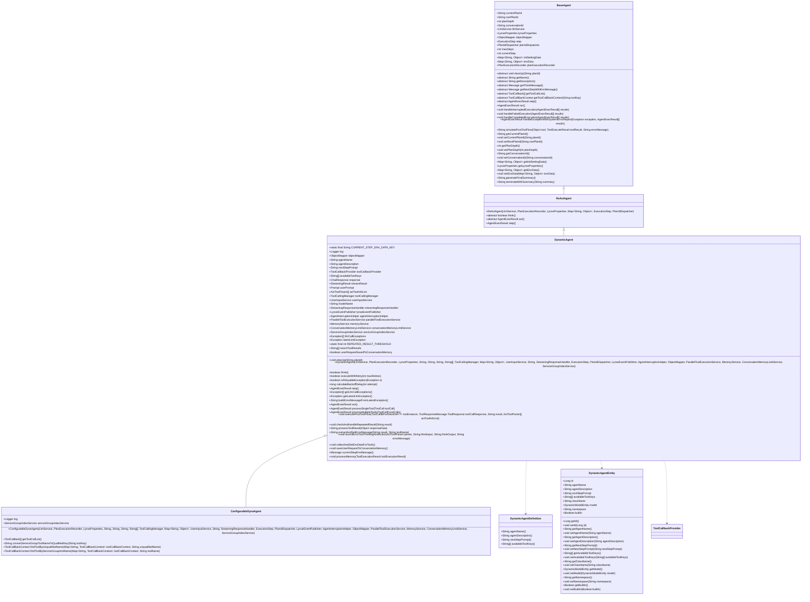
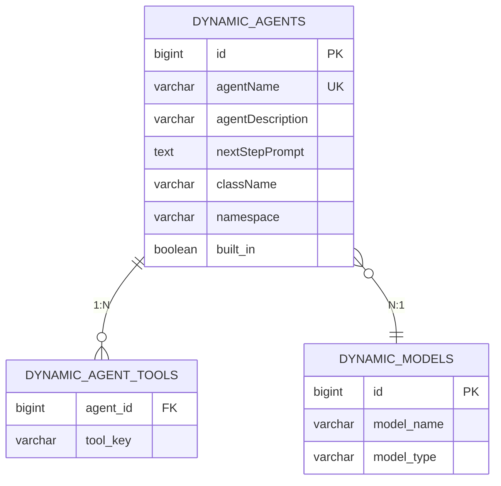
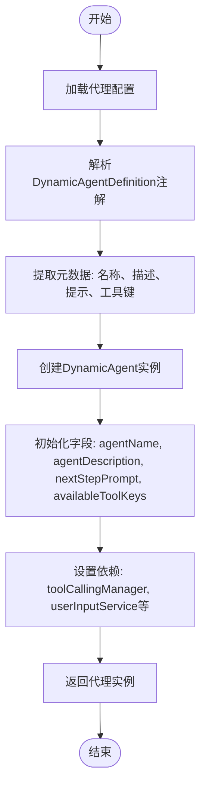
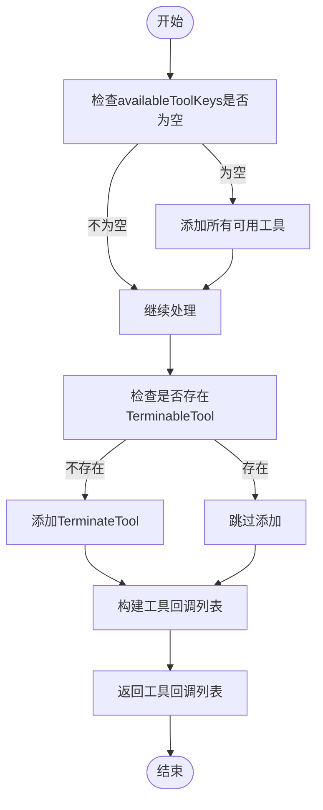
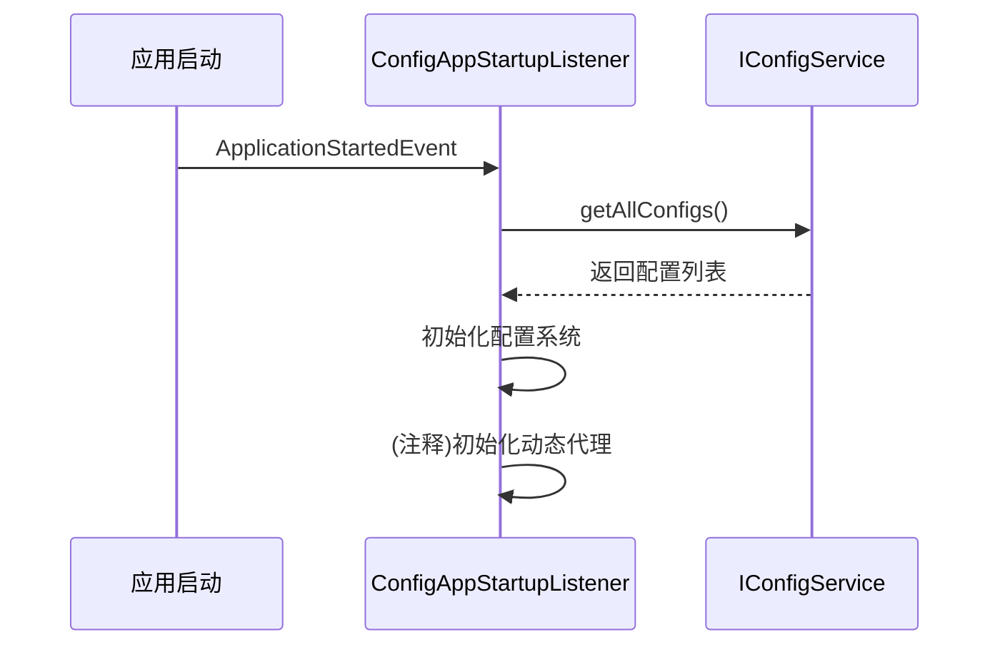
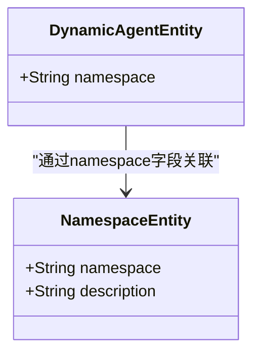

# 动态代理 (DynamicAgent)

<cite>
**本文档引用文件**   
- [DynamicAgent.java](file://src/main/java/com/alibaba/cloud/ai/lynxe/agent/DynamicAgent.java)
- [DynamicAgentDefinition.java](file://src/main/java/com/alibaba/cloud/ai/lynxe/agent/annotation/DynamicAgentDefinition.java)
- [DynamicAgentEntity.java](file://src/main/java/com/alibaba/cloud/ai/lynxe/agent/entity/DynamicAgentEntity.java)
- [BaseAgent.java](file://src/main/java/com/alibaba/cloud/ai/lynxe/agent/BaseAgent.java)
- [ReActAgent.java](file://src/main/java/com/alibaba/cloud/ai/lynxe/agent/ReActAgent.java)
- [ConfigurableDynaAgent.java](file://src/main/java/com/alibaba/cloud/ai/lynxe/agent/ConfigurableDynaAgent.java)
- [ToolCallbackProvider.java](file://src/main/java/com/alibaba/cloud/ai/lynxe/agent/ToolCallbackProvider.java)
- [ConfigAppStartupListener.java](file://src/main/java/com/alibaba/cloud/ai/lynxe/config/startUp/ConfigAppStartupListener.java)
- [agent-api-service.ts](file://ui-vue3/src/api/agent-api-service.ts)
</cite>

## 目录
1. [简介](#简介)
2. [核心组件](#核心组件)
3. [架构概览](#架构概览)
4. [详细组件分析](#详细组件分析)
5. [依赖关系分析](#依赖关系分析)
6. [使用示例](#使用示例)
7. [集成方式](#集成方式)
8. [结论](#结论)

## 简介
动态代理（DynamicAgent）是系统中的核心组件，用于实现基于大语言模型的智能代理功能。它通过注解驱动的方式实现动态配置和元数据管理，支持灵活的代理定义和运行时工具绑定。该代理继承自ReActAgent，实现了"思考-行动"（Think-Act）的执行模式，能够根据配置动态加载工具集并执行复杂任务。

**Section sources**
- [DynamicAgent.java](file://src/main/java/com/alibaba/cloud/ai/lynxe/agent/DynamicAgent.java#L79-L198)
- [ReActAgent.java](file://src/main/java/com/alibaba/cloud/ai/lynxe/agent/ReActAgent.java#L30-L96)

## 核心组件

动态代理的核心实现基于`DynamicAgent`类，该类继承自`ReActAgent`，并实现了`BaseAgent`的抽象方法。`DynamicAgent`通过`DynamicAgentDefinition`注解实现元数据配置，通过`DynamicAgentEntity`实现持久化存储。代理的执行流程包括配置加载、参数解析、实例化和执行等阶段。

`DynamicAgent`的关键字段包括`agentName`、`agentDescription`、`nextStepPrompt`和`availableToolKeys`，这些字段在构造函数中初始化，并在执行过程中使用。代理通过`toolCallingManager`管理工具调用，通过`userInputService`处理用户输入。

**Section sources**
- [DynamicAgent.java](file://src/main/java/com/alibaba/cloud/ai/lynxe/agent/DynamicAgent.java#L87-L124)
- [DynamicAgentDefinition.java](file://src/main/java/com/alibaba/cloud/ai/lynxe/agent/annotation/DynamicAgentDefinition.java#L25-L35)

## 架构概览



**Diagram sources **
- [BaseAgent.java](file://src/main/java/com/alibaba/cloud/ai/lynxe/agent/BaseAgent.java#L74-L602)
- [ReActAgent.java](file://src/main/java/com/alibaba/cloud/ai/lynxe/agent/ReActAgent.java#L30-L96)
- [DynamicAgent.java](file://src/main/java/com/alibaba/cloud/ai/lynxe/agent/DynamicAgent.java#L79-L198)
- [ConfigurableDynaAgent.java](file://src/main/java/com/alibaba/cloud/ai/lynxe/agent/ConfigurableDynaAgent.java#L51-L341)
- [DynamicAgentDefinition.java](file://src/main/java/com/alibaba/cloud/ai/lynxe/agent/annotation/DynamicAgentDefinition.java#L25-L35)
- [DynamicAgentEntity.java](file://src/main/java/com/alibaba/cloud/ai/lynxe/agent/entity/DynamicAgentEntity.java#L26-L132)

**Section sources**
- [BaseAgent.java](file://src/main/java/com/alibaba/cloud/ai/lynxe/agent/BaseAgent.java#L74-L602)
- [ReActAgent.java](file://src/main/java/com/alibaba/cloud/ai/lynxe/agent/ReActAgent.java#L30-L96)
- [DynamicAgent.java](file://src/main/java/com/alibaba/cloud/ai/lynxe/agent/DynamicAgent.java#L79-L198)
- [ConfigurableDynaAgent.java](file://src/main/java/com/alibaba/cloud/ai/lynxe/agent/ConfigurableDynaAgent.java#L51-L341)
- [DynamicAgentDefinition.java](file://src/main/java/com/alibaba/cloud/ai/lynxe/agent/annotation/DynamicAgentDefinition.java#L25-L35)
- [DynamicAgentEntity.java](file://src/main/java/com/alibaba/cloud/ai/lynxe/agent/entity/DynamicAgentEntity.java#L26-L132)

## 详细组件分析

### DynamicAgentDefinition 注解分析
`DynamicAgentDefinition`注解用于定义动态代理的元数据，包括代理名称、描述、下一步提示和可用工具键。该注解在运行时保留，可以被反射机制读取，用于动态创建代理实例。

```mermaid
classDiagram
class DynamicAgentDefinition {
+String agentName()
+String agentDescription()
+String nextStepPrompt()
+String[] availableToolKeys()
}
note right of DynamicAgentDefinition
用于定义动态代理的元数据配置
agentName : 代理名称
agentDescription : 代理描述
nextStepPrompt : 下一步提示
availableToolKeys : 可用工具键数组
end note
```

**Diagram sources **
- [DynamicAgentDefinition.java](file://src/main/java/com/alibaba/cloud/ai/lynxe/agent/annotation/DynamicAgentDefinition.java#L25-L35)

**Section sources**
- [DynamicAgentDefinition.java](file://src/main/java/com/alibaba/cloud/ai/lynxe/agent/annotation/DynamicAgentDefinition.java#L25-L35)

### DynamicAgentEntity 实体分析
`DynamicAgentEntity`实体类用于持久化存储动态代理的配置信息。该实体映射到数据库表`dynamic_agents`，包含代理的基本信息、工具配置和模型关联。



**Diagram sources **
- [DynamicAgentEntity.java](file://src/main/java/com/alibaba/cloud/ai/lynxe/agent/entity/DynamicAgentEntity.java#L26-L132)

**Section sources**
- [DynamicAgentEntity.java](file://src/main/java/com/alibaba/cloud/ai/lynxe/agent/entity/DynamicAgentEntity.java#L26-L132)

### 动态代理创建流程分析
动态代理的创建流程包括配置加载、参数解析和实例化三个主要阶段。首先从配置服务加载代理定义，然后解析注解中的元数据，最后通过构造函数创建代理实例。



**Diagram sources **
- [DynamicAgent.java](file://src/main/java/com/alibaba/cloud/ai/lynxe/agent/DynamicAgent.java#L167-L198)
- [ConfigurableDynaAgent.java](file://src/main/java/com/alibaba/cloud/ai/lynxe/agent/ConfigurableDynaAgent.java#L75-L87)

**Section sources**
- [DynamicAgent.java](file://src/main/java/com/alibaba/cloud/ai/lynxe/agent/DynamicAgent.java#L167-L198)
- [ConfigurableDynaAgent.java](file://src/main/java/com/alibaba/cloud/ai/lynxe/agent/ConfigurableDynaAgent.java#L75-L87)

### availableToolKeys 处理逻辑分析
`availableToolKeys`字段用于管理代理可用的工具集。在`getToolCallList`方法中，系统会根据`availableToolKeys`从`toolCallbackProvider`中获取对应的工具回调，并确保`TerminateTool`始终包含在工具列表中。



**Diagram sources **
- [ConfigurableDynaAgent.java](file://src/main/java/com/alibaba/cloud/ai/lynxe/agent/ConfigurableDynaAgent.java#L98-L198)

**Section sources**
- [ConfigurableDynaAgent.java](file://src/main/java/com/alibaba/cloud/ai/lynxe/agent/ConfigurableDynaAgent.java#L98-L198)

## 依赖关系分析

```mermaid
graph TD
DynamicAgent --> BaseAgent
DynamicAgent --> ReActAgent
DynamicAgent --> DynamicAgentDefinition
DynamicAgent --> DynamicAgentEntity
DynamicAgent --> ToolCallbackProvider
DynamicAgent --> LlmService
DynamicAgent --> PlanExecutionRecorder
DynamicAgent --> LynxeProperties
DynamicAgent --> ObjectMapper
DynamicAgent --> ExecutionStep
DynamicAgent --> PlanIdDispatcher
DynamicAgent --> ToolCallingManager
DynamicAgent --> UserInputService
DynamicAgent --> StreamingResponseHandler
DynamicAgent --> LynxeEventPublisher
DynamicAgent --> AgentInterruptionHelper
DynamicAgent --> ParallelToolExecutionService
DynamicAgent --> MemoryService
DynamicAgent --> ConversationMemoryLimitService
DynamicAgent --> ServiceGroupIndexService
ConfigurableDynaAgent --> DynamicAgent
ConfigurableDynaAgent --> ServiceGroupIndexService
```



**Diagram sources **
- [DynamicAgent.java](file://src/main/java/com/alibaba/cloud/ai/lynxe/agent/DynamicAgent.java#L79-L198)
- [ConfigurableDynaAgent.java](file://src/main/java/com/alibaba/cloud/ai/lynxe/agent/ConfigurableDynaAgent.java#L51-L341)

**Section sources**
- [DynamicAgent.java](file://src/main/java/com/alibaba/cloud/ai/lynxe/agent/DynamicAgent.java#L79-L198)
- [ConfigurableDynaAgent.java](file://src/main/java/com/alibaba/cloud/ai/lynxe/agent/ConfigurableDynaAgent.java#L51-L341)

## 使用示例

### 代理定义示例
通过`@DynamicAgentDefinition`注解定义一个动态代理：

```java
@DynamicAgentDefinition(
    agentName = "数据处理代理",
    agentDescription = "用于处理和分析数据的智能代理",
    nextStepPrompt = "请根据当前数据状态决定下一步操作",
    availableToolKeys = {"data-analysis-tool", "data-visualization-tool", "data-export-tool"}
)
public class DataProcessingAgent extends DynamicAgent {
    // 代理实现
}
```

### 代理注册示例
通过API服务注册动态代理：

```typescript
// 创建代理配置
const agentConfig = {
    name: "数据处理代理",
    description: "用于处理和分析数据的智能代理",
    nextStepPrompt: "请根据当前数据状态决定下一步操作",
    availableToolKeys: ["data-analysis-tool", "data-visualization-tool", "data-export-tool"],
    className: "com.example.DataProcessingAgent"
};

// 调用API创建代理
AgentApiService.createAgent(agentConfig)
    .then(agent => {
        console.log('代理创建成功:', agent);
    })
    .catch(error => {
        console.error('代理创建失败:', error);
    });
```

**Section sources**
- [DynamicAgentDefinition.java](file://src/main/java/com/alibaba/cloud/ai/lynxe/agent/annotation/DynamicAgentDefinition.java#L25-L35)
- [agent-api-service.ts](file://ui-vue3/src/api/agent-api-service.ts#L107-L118)

## 集成方式

动态代理与其他系统组件的集成主要通过以下方式实现：

### 与ConfigService集成
动态代理通过`ConfigAppStartupListener`在应用启动时初始化，从`ConfigService`加载配置信息。虽然相关代码被注释，但保留了集成的框架。



**Diagram sources **
- [ConfigAppStartupListener.java](file://src/main/java/com/alibaba/cloud/ai/lynxe/config/startUp/ConfigAppStartupListener.java#L42-L44)

**Section sources**
- [ConfigAppStartupListener.java](file://src/main/java/com/alibaba/cloud/ai/lynxe/config/startUp/ConfigAppStartupListener.java#L42-L44)

### 与NamespaceService集成
动态代理通过`namespace`字段与命名空间服务集成，实现多租户支持。代理配置可以关联到特定的命名空间，实现配置隔离。



**Diagram sources **
- [DynamicAgentEntity.java](file://src/main/java/com/alibaba/cloud/ai/lynxe/agent/entity/DynamicAgentEntity.java#L54-L55)
- [NamespaceEntity.java](file://src/main/java/com/alibaba/cloud/ai/lynxe/namespace/entity/NamespaceEntity.java)

**Section sources**
- [DynamicAgentEntity.java](file://src/main/java/com/alibaba/cloud/ai/lynxe/agent/entity/DynamicAgentEntity.java#L54-L55)

## 结论
动态代理（DynamicAgent）是系统中实现智能代理功能的核心组件。通过`DynamicAgentDefinition`注解实现元数据驱动的配置管理，通过`DynamicAgentEntity`实现持久化存储，通过`availableToolKeys`实现灵活的工具绑定。代理的创建流程清晰，从配置加载到实例化都有明确的实现。与其他系统组件如`ConfigService`和`NamespaceService`的集成方式合理，支持系统的可扩展性和多租户需求。整体设计体现了高内聚、低耦合的原则，为系统的智能化功能提供了坚实的基础。