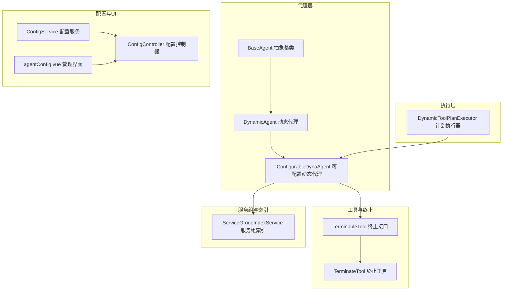
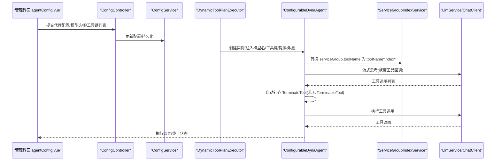
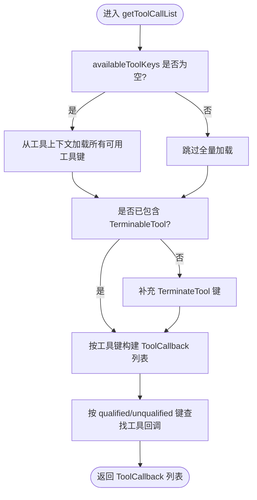
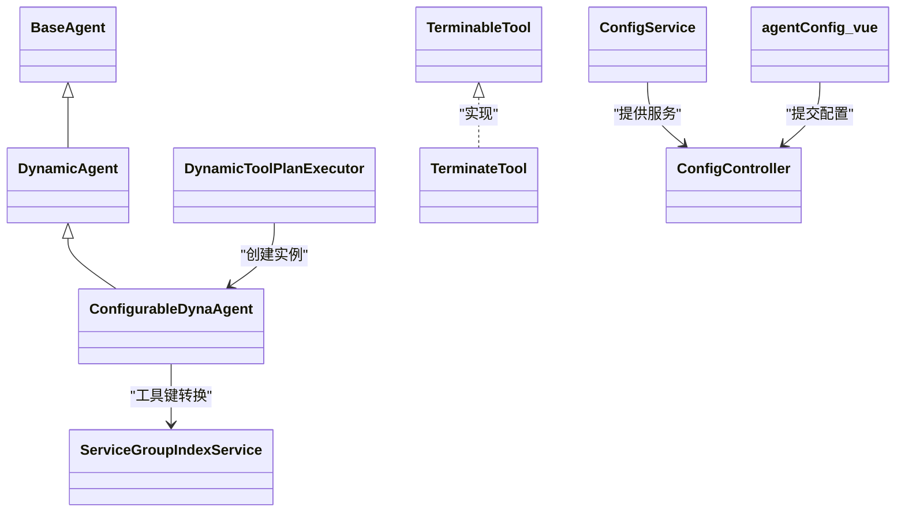

# 可配置动态代理 (ConfigurableDynaAgent)

<cite>
**本文引用的文件列表**
- [ConfigurableDynaAgent.java](file://src/main/java/com/alibaba/cloud/ai/lynxe/agent/ConfigurableDynaAgent.java)
- [DynamicAgent.java](file://src/main/java/com/alibaba/cloud/ai/lynxe/agent/DynamicAgent.java)
- [BaseAgent.java](file://src/main/java/com/alibaba/cloud/ai/lynxe/agent/BaseAgent.java)
- [DynamicToolPlanExecutor.java](file://src/main/java/com/alibaba/cloud/ai/lynxe/runtime/executor/DynamicToolPlanExecutor.java)
- [ServiceGroupIndexService.java](file://src/main/java/com/alibaba/cloud/ai/lynxe/runtime/service/ServiceGroupIndexService.java)
- [TerminableTool.java](file://src/main/java/com/alibaba/cloud/ai/lynxe/tool/TerminableTool.java)
- [TerminateTool.java](file://src/main/java/com/alibaba/cloud/ai/lynxe/tool/TerminateTool.java)
- [DynamicAgentEntity.java](file://src/main/java/com/alibaba/cloud/ai/lynxe/agent/entity/DynamicAgentEntity.java)
- [ConfigService.java](file://src/main/java/com/alibaba/cloud/ai/lynxe/config/ConfigService.java)
- [ConfigController.java](file://src/main/java/com/alibaba/cloud/ai/lynxe/config/ConfigController.java)
- [agentConfig.vue](file://ui-vue3/src/views/configs/agentConfig.vue)
</cite>

## 目录
1. [简介](#简介)
2. [项目结构](#项目结构)
3. [核心组件](#核心组件)
4. [架构总览](#架构总览)
5. [详细组件分析](#详细组件分析)
6. [依赖关系分析](#依赖关系分析)
7. [性能考量](#性能考量)
8. [故障排查指南](#故障排查指南)
9. [结论](#结论)
10. [附录：配置示例与最佳实践](#附录配置示例与最佳实践)

## 简介
本文件面向开发者与运维人员，系统化阐述 ConfigurableDynaAgent 的设计目标、与基础 DynamicAgent 的差异与增强点，并深入解析其“可配置”的能力边界与实现方式。重点覆盖：
- 运行时可调整的提示模板、模型参数与工具集配置
- 配置继承与默认值来源（系统配置/命名空间配置）
- 配置变更时的动态更新机制与实现原理
- 通过 API 或管理界面调整代理行为的实践路径
- 扩展配置项的指导（验证、默认值、缓存与回写）

## 项目结构
ConfigurableDynaAgent 位于 agent 层，是 DynamicAgent 的子类；其执行由计划执行器驱动，工具键名解析依赖服务组索引服务；配置能力由后端配置服务与前端管理界面共同支撑。

图表来源
- [ConfigurableDynaAgent.java](file://src/main/java/com/alibaba/cloud/ai/lynxe/agent/ConfigurableDynaAgent.java#L1-L120)
- [DynamicAgent.java](file://src/main/java/com/alibaba/cloud/ai/lynxe/agent/DynamicAgent.java#L1-L120)
- [BaseAgent.java](file://src/main/java/com/alibaba/cloud/ai/lynxe/agent/BaseAgent.java#L1-L120)
- [DynamicToolPlanExecutor.java](file://src/main/java/com/alibaba/cloud/ai/lynxe/runtime/executor/DynamicToolPlanExecutor.java#L111-L162)
- [ServiceGroupIndexService.java](file://src/main/java/com/alibaba/cloud/ai/lynxe/runtime/service/ServiceGroupIndexService.java#L1-L133)
- [TerminableTool.java](file://src/main/java/com/alibaba/cloud/ai/lynxe/tool/TerminableTool.java#L1-L31)
- [TerminateTool.java](file://src/main/java/com/alibaba/cloud/ai/lynxe/tool/TerminateTool.java#L1-L120)
- [ConfigService.java](file://src/main/java/com/alibaba/cloud/ai/lynxe/config/ConfigService.java#L1-L120)
- [ConfigController.java](file://src/main/java/com/alibaba/cloud/ai/lynxe/config/ConfigController.java#L1-L82)
- [agentConfig.vue](file://ui-vue3/src/views/configs/agentConfig.vue#L1-L120)

章节来源
- [ConfigurableDynaAgent.java](file://src/main/java/com/alibaba/cloud/ai/lynxe/agent/ConfigurableDynaAgent.java#L1-L120)
- [DynamicAgent.java](file://src/main/java/com/alibaba/cloud/ai/lynxe/agent/DynamicAgent.java#L1-L120)
- [BaseAgent.java](file://src/main/java/com/alibaba/cloud/ai/lynxe/agent/BaseAgent.java#L1-L120)
- [DynamicToolPlanExecutor.java](file://src/main/java/com/alibaba/cloud/ai/lynxe/runtime/executor/DynamicToolPlanExecutor.java#L111-L162)
- [ServiceGroupIndexService.java](file://src/main/java/com/alibaba/cloud/ai/lynxe/runtime/service/ServiceGroupIndexService.java#L1-L133)
- [TerminableTool.java](file://src/main/java/com/alibaba/cloud/ai/lynxe/tool/TerminableTool.java#L1-L31)
- [TerminateTool.java](file://src/main/java/com/alibaba/cloud/ai/lynxe/tool/TerminateTool.java#L1-L120)
- [ConfigService.java](file://src/main/java/com/alibaba/cloud/ai/lynxe/config/ConfigService.java#L1-L120)
- [ConfigController.java](file://src/main/java/com/alibaba/cloud/ai/lynxe/config/ConfigController.java#L1-L82)
- [agentConfig.vue](file://ui-vue3/src/views/configs/agentConfig.vue#L1-L120)

## 核心组件
- ConfigurableDynaAgent：在 DynamicAgent 基础上，允许运行时传入工具集合与提示模板等参数，支持按需选择工具集、自动补齐终止工具、兼容服务组工具键格式。
- DynamicAgent：实现 ReAct 思考-行动循环、流式响应处理、重试与早退检测、工具执行与结果记录。
- BaseAgent：抽象基类，定义执行生命周期、状态机、异常包装与最终总结。
- DynamicToolPlanExecutor：根据计划步骤动态创建 ConfigurableDynaAgent 实例，注入模型名与所选工具键列表。
- ServiceGroupIndexService：负责服务组到索引的映射与工具键格式转换，支持 serviceGroup.toolName 到 toolName*index* 的转换。
- TerminableTool/TerminateTool：终止能力接口与终止工具，确保代理在合适时机结束执行。
- ConfigService/ConfigController：后端配置服务与控制器，提供配置项的持久化、批量更新、重置默认值与模型选项查询。
- agentConfig.vue：前端代理配置管理界面，支持新增、编辑、删除代理，配置名称、描述、下一步提示、可用工具与模型分配。

章节来源
- [ConfigurableDynaAgent.java](file://src/main/java/com/alibaba/cloud/ai/lynxe/agent/ConfigurableDynaAgent.java#L1-L120)
- [DynamicAgent.java](file://src/main/java/com/alibaba/cloud/ai/lynxe/agent/DynamicAgent.java#L1-L120)
- [BaseAgent.java](file://src/main/java/com/alibaba/cloud/ai/lynxe/agent/BaseAgent.java#L1-L120)
- [DynamicToolPlanExecutor.java](file://src/main/java/com/alibaba/cloud/ai/lynxe/runtime/executor/DynamicToolPlanExecutor.java#L111-L162)
- [ServiceGroupIndexService.java](file://src/main/java/com/alibaba/cloud/ai/lynxe/runtime/service/ServiceGroupIndexService.java#L1-L133)
- [TerminableTool.java](file://src/main/java/com/alibaba/cloud/ai/lynxe/tool/TerminableTool.java#L1-L31)
- [TerminateTool.java](file://src/main/java/com/alibaba/cloud/ai/lynxe/tool/TerminateTool.java#L1-L120)
- [ConfigService.java](file://src/main/java/com/alibaba/cloud/ai/lynxe/config/ConfigService.java#L1-L120)
- [ConfigController.java](file://src/main/java/com/alibaba/cloud/ai/lynxe/config/ConfigController.java#L1-L82)
- [agentConfig.vue](file://ui-vue3/src/views/configs/agentConfig.vue#L1-L120)

## 架构总览
ConfigurableDynaAgent 的关键增强在于“可配置工具集”与“提示模板可调”。其工作流如下：

图表来源
- [agentConfig.vue](file://ui-vue3/src/views/configs/agentConfig.vue#L1-L120)
- [ConfigController.java](file://src/main/java/com/alibaba/cloud/ai/lynxe/config/ConfigController.java#L1-L82)
- [ConfigService.java](file://src/main/java/com/alibaba/cloud/ai/lynxe/config/ConfigService.java#L1-L120)
- [DynamicToolPlanExecutor.java](file://src/main/java/com/alibaba/cloud/ai/lynxe/runtime/executor/DynamicToolPlanExecutor.java#L111-L162)
- [ConfigurableDynaAgent.java](file://src/main/java/com/alibaba/cloud/ai/lynxe/agent/ConfigurableDynaAgent.java#L90-L200)
- [ServiceGroupIndexService.java](file://src/main/java/com/alibaba/cloud/ai/lynxe/runtime/service/ServiceGroupIndexService.java#L97-L133)

## 详细组件分析

### ConfigurableDynaAgent：可配置工具集与提示模板
- 设计目标
  - 在不改变核心推理与工具执行流程的前提下，允许运行时指定可用工具集合、提示模板与模型名。
  - 自动保证至少存在一个可终止工具（TerminateTool），避免代理无法结束。
  - 兼容服务组工具键格式，支持 serviceGroup.toolName 到 toolName*index* 的转换。
- 关键差异与增强
  - getToolCallList：当 availableToolKeys 为空或未指定时，自动从工具上下文全量加载；同时检查是否存在 TerminableTool，若无则补充 TerminateTool。
  - convertServiceGroupToolNameToQualifiedKey/findToolByUnqualifiedName：支持服务组工具键格式转换与向后兼容查找。
  - 保留 DynamicAgent 的思考-行动循环、流式响应、重试与早退检测、工具执行与记录等全部能力。
- 参数灵活性
  - 提示模板：nextStepPrompt 可在构造时注入，用于引导下一步决策。
  - 模型参数：通过 modelName 注入，DynamicAgent 决定使用哪个模型客户端。
  - 工具集：availableToolKeys 支持空/未指定场景下的全量工具加载，也支持按需限制工具集合。
- 继承与默认值
  - 继承自 DynamicAgent，复用其提示构建、对话记忆、并发工具执行、中断与清理等机制。
  - 默认值来源：DynamicAgent 的构造参数与 LynxeProperties 中的全局配置（如最大步数、并行工具开关等）。
- 动态更新能力
  - 通过计划执行器在每一步创建新的 ConfigurableDynaAgent 实例，传入当前步骤的 selectedToolKeys 与 modelName，从而实现“配置变更即生效”。

图表来源
- [ConfigurableDynaAgent.java](file://src/main/java/com/alibaba/cloud/ai/lynxe/agent/ConfigurableDynaAgent.java#L90-L200)

章节来源
- [ConfigurableDynaAgent.java](file://src/main/java/com/alibaba/cloud/ai/lynxe/agent/ConfigurableDynaAgent.java#L90-L200)
- [DynamicAgent.java](file://src/main/java/com/alibaba/cloud/ai/lynxe/agent/DynamicAgent.java#L320-L420)
- [DynamicToolPlanExecutor.java](file://src/main/java/com/alibaba/cloud/ai/lynxe/runtime/executor/DynamicToolPlanExecutor.java#L111-L162)

### DynamicAgent：思考-行动循环与工具执行
- 思考阶段
  - 构建系统消息与当前环境消息，合并历史记忆与会话记忆，流式调用 LLM 并提取工具调用列表。
  - 重试与早退检测：对网络/超时等可重试异常进行指数退避重试；若多次仅返回文本而无工具调用，则强制要求工具调用。
- 行动阶段
  - 单工具与多工具执行分支；对 FormInputTool、TerminableTool、ErrorReportTool、SystemErrorReportTool 等特殊工具进行专门处理。
  - 记录思考与行动、内存处理、重复结果检测与压缩。
- 异常与中断
  - 对用户中断、LLM 超时、工具执行错误等进行统一处理与包装，必要时通过 SystemErrorReportTool 输出错误摘要。

章节来源
- [DynamicAgent.java](file://src/main/java/com/alibaba/cloud/ai/lynxe/agent/DynamicAgent.java#L200-L485)
- [DynamicAgent.java](file://src/main/java/com/alibaba/cloud/ai/lynxe/agent/DynamicAgent.java#L510-L760)
- [DynamicAgent.java](file://src/main/java/com/alibaba/cloud/ai/lynxe/agent/DynamicAgent.java#L760-L800)

### BaseAgent：生命周期与状态机
- 定义了 run/step 的生命周期，维护当前/根计划 ID、会话 ID、计划深度、环境数据等。
- 提供异常包装与最终总结逻辑，支持最大步数到达后的终止与摘要生成。

章节来源
- [BaseAgent.java](file://src/main/java/com/alibaba/cloud/ai/lynxe/agent/BaseAgent.java#L240-L332)
- [BaseAgent.java](file://src/main/java/com/alibaba/cloud/ai/lynxe/agent/BaseAgent.java#L332-L420)
- [BaseAgent.java](file://src/main/java/com/alibaba/cloud/ai/lynxe/agent/BaseAgent.java#L520-L603)

### ServiceGroupIndexService：服务组工具键转换
- 将 serviceGroup.toolName 转换为 toolName*index* 的合格键，保证工具键唯一且可定位。
- 提供线程安全的缓存与索引分配，支持清空缓存与查询缓存大小。

章节来源
- [ServiceGroupIndexService.java](file://src/main/java/com/alibaba/cloud/ai/lynxe/runtime/service/ServiceGroupIndexService.java#L97-L133)

### TerminableTool 与 TerminateTool：终止能力
- TerminableTool 接口提供 canTerminate 能力判断。
- TerminateTool 实现 TerminableTool，确保代理在需要时能主动结束执行。

章节来源
- [TerminableTool.java](file://src/main/java/com/alibaba/cloud/ai/lynxe/tool/TerminableTool.java#L1-L31)
- [TerminateTool.java](file://src/main/java/com/alibaba/cloud/ai/lynxe/tool/TerminateTool.java#L400-L455)

### 配置与管理界面
- ConfigService/ConfigController：提供配置项的持久化、批量更新、重置默认值、查询可用模型等能力。
- agentConfig.vue：前端代理配置界面，支持新增/编辑/删除代理，配置名称、描述、下一步提示、可用工具与模型分配。

章节来源
- [ConfigService.java](file://src/main/java/com/alibaba/cloud/ai/lynxe/config/ConfigService.java#L160-L220)
- [ConfigController.java](file://src/main/java/com/alibaba/cloud/ai/lynxe/config/ConfigController.java#L46-L82)
- [agentConfig.vue](file://ui-vue3/src/views/configs/agentConfig.vue#L1-L120)

## 依赖关系分析
- ConfigurableDynaAgent 与 DynamicAgent 的继承关系清晰，前者仅在工具回调构建环节引入“可配置工具集”与“终止工具补齐”。
- DynamicToolPlanExecutor 在每一步创建 ConfigurableDynaAgent 实例，注入 selectedToolKeys 与 modelName，实现“按步配置变更即时生效”。
- ServiceGroupIndexService 为工具键转换提供基础设施，确保跨服务组工具键的稳定解析。
- ConfigService/ConfigController 与前端 agentConfig.vue 形成闭环，支持代理配置的持久化与批量更新。

图表来源
- [ConfigurableDynaAgent.java](file://src/main/java/com/alibaba/cloud/ai/lynxe/agent/ConfigurableDynaAgent.java#L1-L120)
- [DynamicAgent.java](file://src/main/java/com/alibaba/cloud/ai/lynxe/agent/DynamicAgent.java#L1-L120)
- [BaseAgent.java](file://src/main/java/com/alibaba/cloud/ai/lynxe/agent/BaseAgent.java#L1-L120)
- [DynamicToolPlanExecutor.java](file://src/main/java/com/alibaba/cloud/ai/lynxe/runtime/executor/DynamicToolPlanExecutor.java#L111-L162)
- [ServiceGroupIndexService.java](file://src/main/java/com/alibaba/cloud/ai/lynxe/runtime/service/ServiceGroupIndexService.java#L1-L133)
- [TerminableTool.java](file://src/main/java/com/alibaba/cloud/ai/lynxe/tool/TerminableTool.java#L1-L31)
- [TerminateTool.java](file://src/main/java/com/alibaba/cloud/ai/lynxe/tool/TerminateTool.java#L1-L120)
- [ConfigService.java](file://src/main/java/com/alibaba/cloud/ai/lynxe/config/ConfigService.java#L1-L120)
- [ConfigController.java](file://src/main/java/com/alibaba/cloud/ai/lynxe/config/ConfigController.java#L1-L82)
- [agentConfig.vue](file://ui-vue3/src/views/configs/agentConfig.vue#L1-L120)

## 性能考量
- 工具键查找与转换
  - 使用 ServiceGroupIndexService 缓存服务组索引，避免重复计算；在工具键转换失败时回退到全量扫描，建议尽量使用合格键以减少遍历成本。
- 流式响应与重试
  - 流式处理提升用户体验；对可重试异常采用指数退避，降低抖动与资源消耗。
- 工具执行
  - 多工具执行时避免使用 TerminableTool/FormInputTool，以免触发错误路径；单工具执行路径更稳定。
- 配置读取
  - ConfigService 使用内存缓存，减少数据库访问；批量更新与重置默认值操作建议在低峰期执行。

[本节为通用性能讨论，无需列出具体文件来源]

## 故障排查指南
- 代理未选择任何工具
  - 检查 selectedToolKeys 是否为空或被误清空；确认 DynamicToolPlanExecutor 是否正确传入 selectedToolKeys。
  - 若出现“早退阈值”错误，说明 LLM 多次仅返回文本而无工具调用，需调整提示或启用强制工具调用策略。
- 工具不可用或找不到
  - 确认工具键格式是否为 serviceGroup.toolName 或 toolName*index*；使用 ServiceGroupIndexService 进行转换。
  - 检查 TerminableTool 是否存在，若不存在将自动补齐 TerminateTool。
- 配置未生效
  - 确认 ConfigService 是否成功回写到配置 Bean；前端 agentConfig.vue 是否正确提交。
  - 如需全局重置，可通过 ConfigController 的重置接口恢复默认值。

章节来源
- [DynamicAgent.java](file://src/main/java/com/alibaba/cloud/ai/lynxe/agent/DynamicAgent.java#L320-L420)
- [DynamicToolPlanExecutor.java](file://src/main/java/com/alibaba/cloud/ai/lynxe/runtime/executor/DynamicToolPlanExecutor.java#L111-L162)
- [ServiceGroupIndexService.java](file://src/main/java/com/alibaba/cloud/ai/lynxe/runtime/service/ServiceGroupIndexService.java#L97-L133)
- [ConfigService.java](file://src/main/java/com/alibaba/cloud/ai/lynxe/config/ConfigService.java#L180-L220)
- [ConfigController.java](file://src/main/java/com/alibaba/cloud/ai/lynxe/config/ConfigController.java#L46-L82)

## 结论
ConfigurableDynaAgent 在保持 DynamicAgent 核心能力不变的前提下，提供了“运行时可配置工具集、提示模板与模型参数”的增强能力。通过计划执行器按步创建实例、ServiceGroupIndexService 的工具键转换、以及 ConfigService/ConfigController 的配置持久化，实现了“配置即刻生效”的动态代理模式。开发者可在不修改核心代码的情况下，灵活调整代理行为，满足不同业务场景的工具选择与提示需求。

[本节为总结性内容，无需列出具体文件来源]

## 附录：配置示例与最佳实践

### 配置继承与默认值
- 继承链
  - ConfigurableDynaAgent 继承 DynamicAgent，后者继承 BaseAgent。
  - 全局默认值来自 LynxeProperties 与 DynamicAgent 构造参数（如最大步数、并行工具开关等）。
- 命名空间与实体
  - DynamicAgentEntity 提供 agentName、agentDescription、nextStepPrompt、availableToolKeys、className、namespace 等字段，便于在命名空间维度进行配置与持久化。

章节来源
- [DynamicAgent.java](file://src/main/java/com/alibaba/cloud/ai/lynxe/agent/DynamicAgent.java#L167-L198)
- [BaseAgent.java](file://src/main/java/com/alibaba/cloud/ai/lynxe/agent/BaseAgent.java#L240-L332)
- [DynamicAgentEntity.java](file://src/main/java/com/alibaba/cloud/ai/lynxe/agent/entity/DynamicAgentEntity.java#L46-L132)

### 运行时可调整的参数
- 提示模板
  - nextStepPrompt 可在构造 ConfigurableDynaAgent 时注入，用于引导下一步决策。
- 模型参数
  - modelName 通过 DynamicToolPlanExecutor 注入，DynamicAgent 决定使用哪个模型客户端。
- 工具集配置
  - availableToolKeys 支持空/未指定场景下的全量工具加载；也可按需限制工具集合。

章节来源
- [ConfigurableDynaAgent.java](file://src/main/java/com/alibaba/cloud/ai/lynxe/agent/ConfigurableDynaAgent.java#L75-L88)
- [DynamicToolPlanExecutor.java](file://src/main/java/com/alibaba/cloud/ai/lynxe/runtime/executor/DynamicToolPlanExecutor.java#L140-L162)

### 配置变更的动态更新机制
- 每一步执行前由 DynamicToolPlanExecutor 创建新的 ConfigurableDynaAgent 实例，传入当前步骤的 selectedToolKeys 与 modelName，从而实现“配置变更即生效”。
- ServiceGroupIndexService 负责工具键转换，确保跨服务组工具键的稳定解析。

章节来源
- [DynamicToolPlanExecutor.java](file://src/main/java/com/alibaba/cloud/ai/lynxe/runtime/executor/DynamicToolPlanExecutor.java#L111-L162)
- [ServiceGroupIndexService.java](file://src/main/java/com/alibaba/cloud/ai/lynxe/runtime/service/ServiceGroupIndexService.java#L97-L133)

### 通过 API 或管理界面调整代理行为
- 后端 API
  - ConfigController 提供按组查询配置、批量更新配置、重置默认值、查询可用模型等接口。
- 前端界面
  - agentConfig.vue 支持新增/编辑/删除代理，配置名称、描述、下一步提示、可用工具与模型分配。

章节来源
- [ConfigController.java](file://src/main/java/com/alibaba/cloud/ai/lynxe/config/ConfigController.java#L46-L82)
- [agentConfig.vue](file://ui-vue3/src/views/configs/agentConfig.vue#L1-L120)

### 扩展配置项的指导（验证与默认值）
- 配置验证
  - 使用 ConfigProperty 注解声明配置路径、分组、子组、键、描述、默认值与输入类型；ConfigService 在初始化时校验并清理过时配置。
- 默认值设置
  - ConfigService 优先从 Environment 获取配置值，否则使用注解默认值；支持重置默认值与批量更新。
- 最佳实践
  - 为每个可变参数提供明确的默认值与输入类型，避免运行时类型转换异常。
  - 对于工具键等复杂参数，优先使用合格键格式，减少查找与转换开销。
  - 对于提示模板与模型参数，建议在命名空间维度进行分组管理，便于按租户/项目隔离。

章节来源
- [ConfigService.java](file://src/main/java/com/alibaba/cloud/ai/lynxe/config/ConfigService.java#L60-L120)
- [ConfigService.java](file://src/main/java/com/alibaba/cloud/ai/lynxe/config/ConfigService.java#L180-L220)
- [ConfigService.java](file://src/main/java/com/alibaba/cloud/ai/lynxe/config/ConfigService.java#L255-L320)