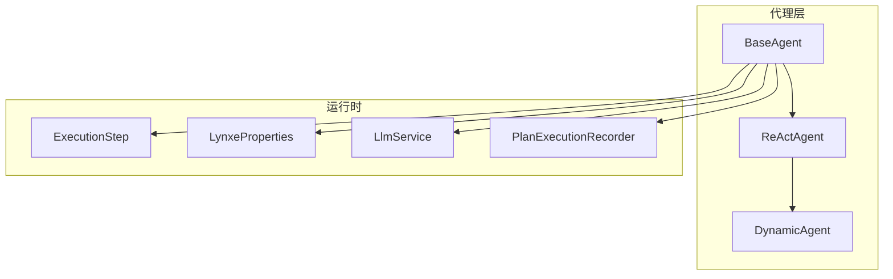
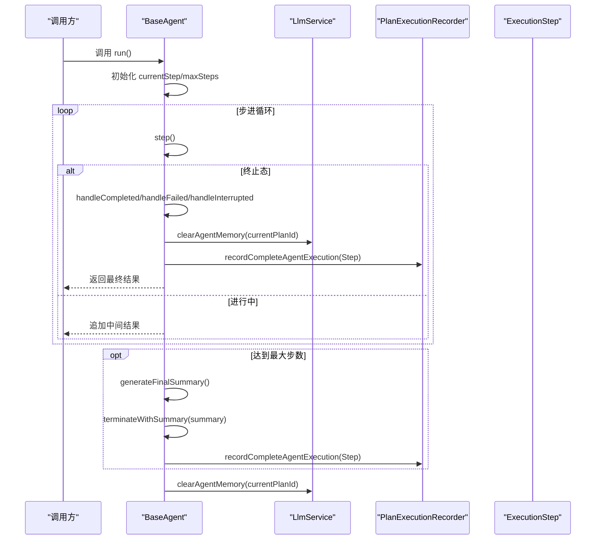
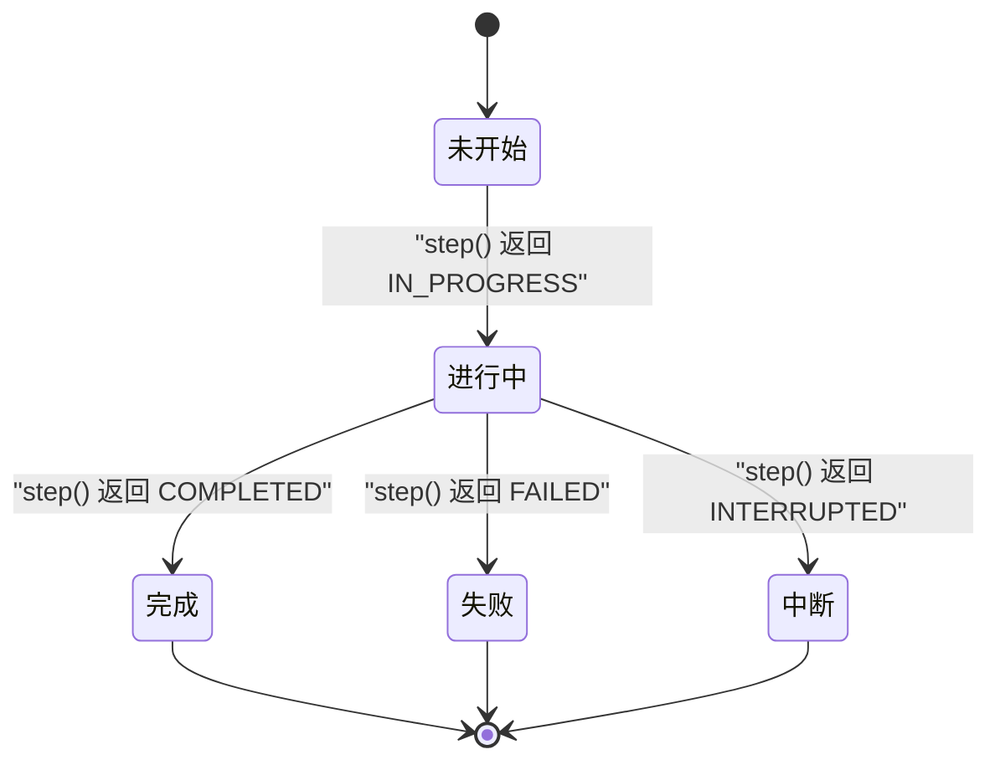
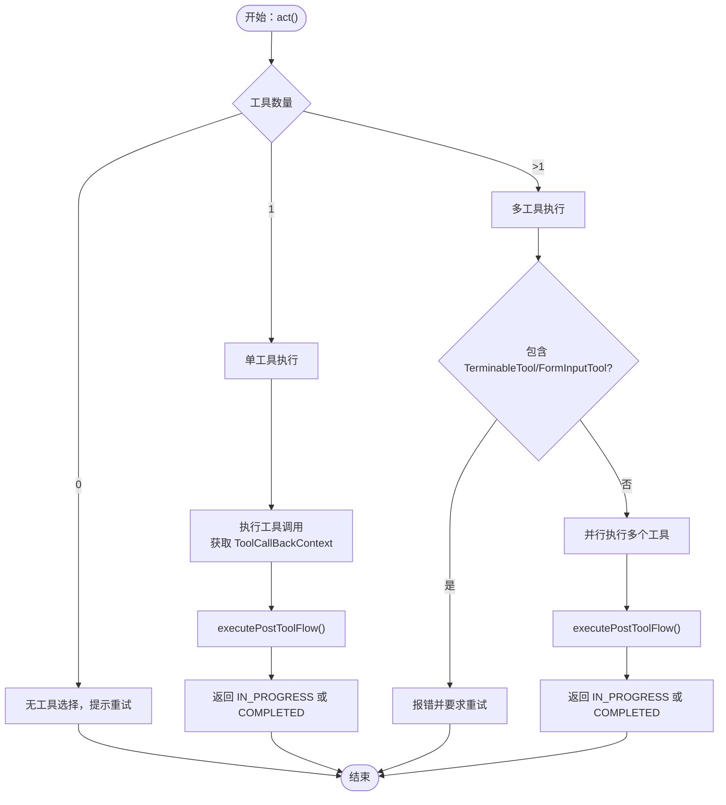
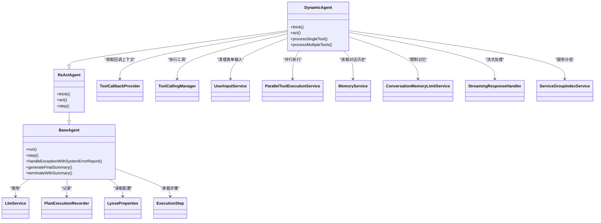

# 基础代理 (BaseAgent)

<cite>
**本文引用的文件列表**
- [BaseAgent.java](file://src/main/java/com/alibaba/cloud/ai/lynxe/agent/BaseAgent.java)
- [AgentState.java](file://src/main/java/com/alibaba/cloud/ai/lynxe/agent/AgentState.java)
- [ToolCallbackProvider.java](file://src/main/java/com/alibaba/cloud/ai/lynxe/agent/ToolCallbackProvider.java)
- [ReActAgent.java](file://src/main/java/com/alibaba/cloud/ai/lynxe/agent/ReActAgent.java)
- [DynamicAgent.java](file://src/main/java/com/alibaba/cloud/ai/lynxe/agent/DynamicAgent.java)
- [LlmService.java](file://src/main/java/com/alibaba/cloud/ai/lynxe/llm/LlmService.java)
- [PlanExecutionRecorder.java](file://src/main/java/com/alibaba/cloud/ai/lynxe/recorder/service/PlanExecutionRecorder.java)
- [ExecutionStep.java](file://src/main/java/com/alibaba/cloud/ai/lynxe/runtime/entity/vo/ExecutionStep.java)
- [LynxeProperties.java](file://src/main/java/com/alibaba/cloud/ai/lynxe/config/LynxeProperties.java)
- [TerminateTool.java](file://src/main/java/com/alibaba/cloud/ai/lynxe/tool/TerminateTool.java)
- [SystemErrorReportTool.java](file://src/main/java/com/alibaba/cloud/ai/lynxe/tool/SystemErrorReportTool.java)
</cite>

## 目录
1. [简介](#简介)
2. [项目结构与定位](#项目结构与定位)
3. [核心组件总览](#核心组件总览)
4. [架构概览](#架构概览)
5. [详细组件分析](#详细组件分析)
6. [依赖关系分析](#依赖关系分析)
7. [性能与可扩展性](#性能与可扩展性)
8. [故障排查指南](#故障排查指南)
9. [结论](#结论)
10. [附录：最佳实践与重写指南](#附录最佳实践与重写指南)

## 简介
本文件面向开发者，系统化阐述 BaseAgent 作为所有代理类型的抽象基类的设计目标、职责边界与实现要点。重点覆盖：
- 代理状态管理（AgentState）与生命周期流转
- 工具回调机制（ToolCallbackProvider）与回调执行流程
- 执行上下文初始化（LynxeProperties、LlmService、PlanExecutionRecorder、ExecutionStep、PlanIdDispatcher）
- 构造函数参数注入与作用
- 继承示例与最佳实践

## 项目结构与定位
BaseAgent 位于 agent 包中，是 ReActAgent 的父类，DynamicAgent 等具体代理在此之上进一步实现“思考-行动”循环与工具调用。其职责包括：
- 生命周期驱动：run() 循环执行 step()，直至达到最大步数或终止态
- 状态机：通过 AgentState 表达执行状态（未开始、进行中、完成、阻塞、失败、中断）
- 记录与清理：在 finally 中清理内存并记录完整代理执行结果
- 异常兜底：使用 SystemErrorReportTool 包装异常，保持工具流一致性

图表来源
- [BaseAgent.java](file://src/main/java/com/alibaba/cloud/ai/lynxe/agent/BaseAgent.java#L1-L120)
- [ReActAgent.java](file://src/main/java/com/alibaba/cloud/ai/lynxe/agent/ReActAgent.java#L1-L97)
- [DynamicAgent.java](file://src/main/java/com/alibaba/cloud/ai/lynxe/agent/DynamicAgent.java#L1-L120)
- [ExecutionStep.java](file://src/main/java/com/alibaba/cloud/ai/lynxe/runtime/entity/vo/ExecutionStep.java#L1-L120)
- [LynxeProperties.java](file://src/main/java/com/alibaba/cloud/ai/lynxe/config/LynxeProperties.java#L150-L220)
- [LlmService.java](file://src/main/java/com/alibaba/cloud/ai/lynxe/llm/LlmService.java#L200-L240)
- [PlanExecutionRecorder.java](file://src/main/java/com/alibaba/cloud/ai/lynxe/recorder/service/PlanExecutionRecorder.java#L1-L120)

章节来源
- [BaseAgent.java](file://src/main/java/com/alibaba/cloud/ai/lynxe/agent/BaseAgent.java#L1-L120)
- [ReActAgent.java](file://src/main/java/com/alibaba/cloud/ai/lynxe/agent/ReActAgent.java#L1-L97)
- [DynamicAgent.java](file://src/main/java/com/alibaba/cloud/ai/lynxe/agent/DynamicAgent.java#L1-L120)

## 核心组件总览
- BaseAgent：抽象基类，定义代理通用能力与生命周期
- AgentState：代理状态枚举，统一状态表达
- ToolCallbackProvider：工具回调上下文提供者接口
- ReActAgent：基于“思考-行动”的代理抽象
- DynamicAgent：具体实现 ReActAgent 的动态代理
- LlmService：大模型服务封装，负责对话客户端、记忆与追踪
- PlanExecutionRecorder：计划/步骤/思考-行动记录器接口
- ExecutionStep：执行步骤数据载体
- LynxeProperties：全局配置项（最大步数、并行工具调用、对话记忆上限等）

章节来源
- [AgentState.java](file://src/main/java/com/alibaba/cloud/ai/lynxe/agent/AgentState.java#L1-L35)
- [ToolCallbackProvider.java](file://src/main/java/com/alibaba/cloud/ai/lynxe/agent/ToolCallbackProvider.java#L1-L27)
- [ReActAgent.java](file://src/main/java/com/alibaba/cloud/ai/lynxe/agent/ReActAgent.java#L1-L97)
- [DynamicAgent.java](file://src/main/java/com/alibaba/cloud/ai/lynxe/agent/DynamicAgent.java#L1-L120)
- [LlmService.java](file://src/main/java/com/alibaba/cloud/ai/lynxe/llm/LlmService.java#L200-L240)
- [PlanExecutionRecorder.java](file://src/main/java/com/alibaba/cloud/ai/lynxe/recorder/service/PlanExecutionRecorder.java#L1-L120)
- [ExecutionStep.java](file://src/main/java/com/alibaba/cloud/ai/lynxe/runtime/entity/vo/ExecutionStep.java#L1-L120)
- [LynxeProperties.java](file://src/main/java/com/alibaba/cloud/ai/lynxe/config/LynxeProperties.java#L150-L220)

## 架构概览
BaseAgent 将“状态机 + 工具回调 + 上下文注入 + 记录清理”整合为统一的执行框架。其核心流程如下：

图表来源
- [BaseAgent.java](file://src/main/java/com/alibaba/cloud/ai/lynxe/agent/BaseAgent.java#L254-L332)
- [BaseAgent.java](file://src/main/java/com/alibaba/cloud/ai/lynxe/agent/BaseAgent.java#L334-L424)
- [BaseAgent.java](file://src/main/java/com/alibaba/cloud/ai/lynxe/agent/BaseAgent.java#L538-L600)
- [LlmService.java](file://src/main/java/com/alibaba/cloud/ai/lynxe/llm/LlmService.java#L214-L218)
- [PlanExecutionRecorder.java](file://src/main/java/com/alibaba/cloud/ai/lynxe/recorder/service/PlanExecutionRecorder.java#L70-L81)
- [ExecutionStep.java](file://src/main/java/com/alibaba/cloud/ai/lynxe/runtime/entity/vo/ExecutionStep.java#L1-L120)

## 详细组件分析

### BaseAgent：抽象基类与生命周期
- 设计目标
  - 提供统一的代理生命周期管理：run() 驱动 step() 循环，直到终止态或达到最大步数
  - 统一状态机：通过 AgentState 表达执行状态，并在不同终止态执行差异化处理
  - 异常兜底：当发生异常时，使用 SystemErrorReportTool 包装错误，模拟一次工具调用流程，保证记录与 UI 展示一致
  - 清理与记录：finally 中清理 LLM 内存并记录完整代理执行结果
- 关键字段与注入
  - llmService：大模型服务，用于构建对话客户端、读取/清理记忆
  - planExecutionRecorder：执行记录器，记录思考-行动、步骤结束、代理完成等
  - lynxeProperties：全局配置，决定最大步数、并行工具调用、对话记忆上限等
  - step：当前执行步骤的数据载体
  - planIdDispatcher：计划/工具调用 ID 分配器
  - initSettingData：不可变的初始设置数据（由子类传入）
  - envData：环境数据（由子类设置）
- 生命周期方法
  - run()：主循环，控制步进与终止态判断
  - step()：抽象方法，由子类实现具体“思考-行动”逻辑
  - handleCompletedExecution()/handleFailedExecution()/handleInterruptedExecution()：终止态后的清理与收尾
  - handleExceptionWithSystemErrorReport()：异常包装与错误消息提取
  - simulatePostToolFlow()：工具后置流程（默认返回工具输出，子类可扩展）
  - generateFinalSummary()/terminateWithSummary()：达到最大步数时生成摘要并终止
- 状态机 AgentState
  - NOT_STARTED、IN_PROGRESS、COMPLETED、BLOCKED、FAILED、INTERRUPTED
  - BaseAgent 在 run() 中根据 stepResult.getState() 判断是否退出循环

图表来源
- [AgentState.java](file://src/main/java/com/alibaba/cloud/ai/lynxe/agent/AgentState.java#L18-L35)
- [BaseAgent.java](file://src/main/java/com/alibaba/cloud/ai/lynxe/agent/BaseAgent.java#L254-L332)

章节来源
- [BaseAgent.java](file://src/main/java/com/alibaba/cloud/ai/lynxe/agent/BaseAgent.java#L242-L332)
- [AgentState.java](file://src/main/java/com/alibaba/cloud/ai/lynxe/agent/AgentState.java#L18-L35)

### 构造函数参数与注入说明
- 参数列表
  - LlmService llmService：大模型服务实例
  - PlanExecutionRecorder planExecutionRecorder：执行记录器
  - LynxeProperties lynxeProperties：全局配置
  - Map<String,Object> initialAgentSetting：初始设置数据（不可变副本）
  - ExecutionStep step：当前执行步骤
  - PlanIdDispatcher planIdDispatcher：ID 分配器
- 注入与作用
  - llmService：用于获取/清理代理记忆、构建对话客户端
  - planExecutionRecorder：记录思考-行动、步骤结束、代理完成
  - lynxeProperties：决定最大步数、并行工具调用策略、对话记忆上限等
  - step：承载步骤信息、错误消息、状态等
  - planIdDispatcher：生成工具调用 ID、思考-行动 ID 等
  - initSettingData：子类可据此构建提示词模板与环境变量

章节来源
- [BaseAgent.java](file://src/main/java/com/alibaba/cloud/ai/lynxe/agent/BaseAgent.java#L242-L252)
- [LynxeProperties.java](file://src/main/java/com/alibaba/cloud/ai/lynxe/config/LynxeProperties.java#L150-L220)
- [LlmService.java](file://src/main/java/com/alibaba/cloud/ai/lynxe/llm/LlmService.java#L200-L240)
- [PlanExecutionRecorder.java](file://src/main/java/com/alibaba/cloud/ai/lynxe/recorder/service/PlanExecutionRecorder.java#L1-L120)
- [ExecutionStep.java](file://src/main/java/com/alibaba/cloud/ai/lynxe/runtime/entity/vo/ExecutionStep.java#L1-L120)

### AgentState 状态机与生命周期规则
- 规则
  - run() 每次迭代调用 step()，读取返回的 AgentState
  - 若为 COMPLETED/FAILED/INTERRUPTED，则进入对应处理分支并退出循环
  - 若达到最大步数且未处于终止态，则生成摘要并调用 TerminateTool 结束
  - finally 中清理代理记忆并记录完整代理执行
- 典型流转
  - IN_PROGRESS → COMPLETED/FAILED/INTERRUPTED：由子类 step() 决定
  - IN_PROGRESS → IN_PROGRESS：继续循环

章节来源
- [BaseAgent.java](file://src/main/java/com/alibaba/cloud/ai/lynxe/agent/BaseAgent.java#L254-L332)
- [AgentState.java](file://src/main/java/com/alibaba/cloud/ai/lynxe/agent/AgentState.java#L18-L35)

### 工具回调机制与执行流程
- ToolCallbackProvider 接口
  - 提供工具回调上下文映射：Map<String, ToolCallBackContext>
  - 子类可通过该接口注册/查询工具回调上下文
- 回调执行流程（以 DynamicAgent 为例）
  - DynamicAgent 在 think() 中收集环境数据、构建提示词、调用 LLM 并获取工具调用列表
  - act() 中根据工具数量选择单工具或多工具执行路径
  - 对每个工具调用，通过 ToolCallbackProvider 获取 ToolCallBackContext，再执行工具
  - 执行后调用 executePostToolFlow() 进行共享后置处理（如记录、清理、去重等）
- 关键点
  - 工具调用前需确保 ToolCallBackContext 可用；若缺失，会记录错误但继续执行
  - 支持 TerminableTool 与 TerminateTool：前者可主动终止，后者直接生成终止结果并标记 COMPLETED

图表来源
- [DynamicAgent.java](file://src/main/java/com/alibaba/cloud/ai/lynxe/agent/DynamicAgent.java#L606-L767)
- [DynamicAgent.java](file://src/main/java/com/alibaba/cloud/ai/lynxe/agent/DynamicAgent.java#L776-L800)
- [ToolCallbackProvider.java](file://src/main/java/com/alibaba/cloud/ai/lynxe/agent/ToolCallbackProvider.java#L1-L27)

章节来源
- [ToolCallbackProvider.java](file://src/main/java/com/alibaba/cloud/ai/lynxe/agent/ToolCallbackProvider.java#L1-L27)
- [DynamicAgent.java](file://src/main/java/com/alibaba/cloud/ai/lynxe/agent/DynamicAgent.java#L606-L767)
- [DynamicAgent.java](file://src/main/java/com/alibaba/cloud/ai/lynxe/agent/DynamicAgent.java#L776-L800)

### 继承示例与最佳实践
- 继承关系
  - ReActAgent 继承 BaseAgent，定义 think()/act() 抽象方法
  - DynamicAgent 继承 ReActAgent，实现具体的 think()/act() 逻辑
- 继承示例（以 DynamicAgent 为例）
  - 构造函数中先调用 super(...) 完成 BaseAgent 注入，再设置自身字段（如 ObjectMapper、工具调用管理器、用户输入服务等）
  - 重写 think()/act()：在 think() 中构建提示词、调用 LLM、记录思考-行动；在 act() 中执行工具、处理结果、记录动作
  - 使用 ToolCallbackProvider 获取 ToolCallBackContext，按工具类型分别处理（表单输入、可终止工具、系统错误报告等）
- 最佳实践
  - 明确 step() 的返回值：IN_PROGRESS 表示继续循环，COMPLETED/FAILED/INTERRUPTED 表示终止
  - 在 finally 中确保清理代理记忆与记录完成
  - 对异常场景使用 handleExceptionWithSystemErrorReport() 包装，保证 UI 与记录一致
  - 对工具调用结果进行去重检测与压缩，避免无效循环
  - 合理使用 LynxeProperties 控制并行工具调用、最大步数、对话记忆上限等

章节来源
- [ReActAgent.java](file://src/main/java/com/alibaba/cloud/ai/lynxe/agent/ReActAgent.java#L1-L97)
- [DynamicAgent.java](file://src/main/java/com/alibaba/cloud/ai/lynxe/agent/DynamicAgent.java#L167-L198)
- [DynamicAgent.java](file://src/main/java/com/alibaba/cloud/ai/lynxe/agent/DynamicAgent.java#L200-L230)
- [DynamicAgent.java](file://src/main/java/com/alibaba/cloud/ai/lynxe/agent/DynamicAgent.java#L510-L553)

## 依赖关系分析
- BaseAgent 依赖
  - LlmService：获取/清理代理记忆、构建对话客户端
  - PlanExecutionRecorder：记录思考-行动、步骤结束、代理完成
  - LynxeProperties：最大步数、并行工具调用、对话记忆上限
  - ExecutionStep：承载步骤信息与状态
  - PlanIdDispatcher：生成工具调用 ID、思考-行动 ID
- 动态代理（DynamicAgent）额外依赖
  - ToolCallbackProvider：工具回调上下文
  - ToolCallingManager：工具调用执行
  - UserInputService：表单输入工具清理
  - ParallelToolExecutionService：并行工具执行
  - MemoryService/ConversationMemoryLimitService：对话记忆与限制
  - StreamingResponseHandler：流式响应处理
  - ServiceGroupIndexService：服务分组索引

图表来源
- [BaseAgent.java](file://src/main/java/com/alibaba/cloud/ai/lynxe/agent/BaseAgent.java#L242-L332)
- [ReActAgent.java](file://src/main/java/com/alibaba/cloud/ai/lynxe/agent/ReActAgent.java#L1-L97)
- [DynamicAgent.java](file://src/main/java/com/alibaba/cloud/ai/lynxe/agent/DynamicAgent.java#L1-L120)
- [LlmService.java](file://src/main/java/com/alibaba/cloud/ai/lynxe/llm/LlmService.java#L200-L240)
- [PlanExecutionRecorder.java](file://src/main/java/com/alibaba/cloud/ai/lynxe/recorder/service/PlanExecutionRecorder.java#L1-L120)
- [LynxeProperties.java](file://src/main/java/com/alibaba/cloud/ai/lynxe/config/LynxeProperties.java#L150-L220)
- [ExecutionStep.java](file://src/main/java/com/alibaba/cloud/ai/lynxe/runtime/entity/vo/ExecutionStep.java#L1-L120)

章节来源
- [BaseAgent.java](file://src/main/java/com/alibaba/cloud/ai/lynxe/agent/BaseAgent.java#L242-L332)
- [DynamicAgent.java](file://src/main/java/com/alibaba/cloud/ai/lynxe/agent/DynamicAgent.java#L1-L120)

## 性能与可扩展性
- 性能特性
  - 流式响应处理：DynamicAgent 使用 StreamingResponseHandler 合并流式文本与工具调用，降低等待时间
  - 记忆窗口限制：LlmService 通过 MessageWindowChatMemory 控制代理记忆大小，避免 OOM
  - 缓存与复用：LlmService 对 ChatClient 进行缓存，减少重复初始化开销
- 可扩展性
  - ToolCallbackProvider：支持按工具键注册回调上下文，便于扩展新工具
  - 多工具并行：ParallelToolExecutionService 支持并行工具执行（受 LynxeProperties 控制）
  - 配置驱动：LynxeProperties 提供最大步数、并行工具调用、对话记忆上限等可配置项

章节来源
- [DynamicAgent.java](file://src/main/java/com/alibaba/cloud/ai/lynxe/agent/DynamicAgent.java#L356-L409)
- [LlmService.java](file://src/main/java/com/alibaba/cloud/ai/lynxe/llm/LlmService.java#L200-L240)
- [LynxeProperties.java](file://src/main/java/com/alibaba/cloud/ai/lynxe/config/LynxeProperties.java#L150-L220)

## 故障排查指南
- 常见问题
  - 代理卡在 IN_PROGRESS：检查 step() 是否正确返回终止态；确认工具调用是否成功
  - 达到最大步数仍未完成：查看 generateFinalSummary() 与 terminateWithSummary() 的行为；确认是否需要增加最大步数
  - 异常未被捕获：确认是否使用 handleExceptionWithSystemErrorReport() 包装；检查 SystemErrorReportTool 输出是否被正确解析
  - 工具回调缺失：检查 ToolCallbackProvider 是否正确注册；必要时降级处理但仍记录错误
- 关键定位点
  - BaseAgent.run() 的循环与终止态判断
  - BaseAgent.handleExceptionWithSystemErrorReport() 的异常包装与错误消息提取
  - DynamicAgent.processSingleTool()/processMultipleTools() 的工具执行与后置处理
  - LlmService.clearAgentMemory() 的清理时机

章节来源
- [BaseAgent.java](file://src/main/java/com/alibaba/cloud/ai/lynxe/agent/BaseAgent.java#L254-L332)
- [BaseAgent.java](file://src/main/java/com/alibaba/cloud/ai/lynxe/agent/BaseAgent.java#L334-L424)
- [DynamicAgent.java](file://src/main/java/com/alibaba/cloud/ai/lynxe/agent/DynamicAgent.java#L606-L767)
- [LlmService.java](file://src/main/java/com/alibaba/cloud/ai/lynxe/llm/LlmService.java#L214-L218)

## 结论
BaseAgent 通过统一的状态机、工具回调机制与执行上下文注入，为各类代理提供了稳定可靠的生命周期框架。ReActAgent 与 DynamicAgent 在此基础上实现了“思考-行动”的闭环与工具调用的多样化处理。遵循本文的最佳实践与重写指南，可在保证一致性的同时灵活扩展新的代理类型与工具能力。

## 附录：最佳实践与重写指南
- 重写基类方法
  - step()：明确返回 IN_PROGRESS/COMPLETED/FAILED/INTERRUPTED；在 finally 中清理资源
  - handleExceptionWithSystemErrorReport()：自定义错误消息格式与记录策略
  - simulatePostToolFlow()：在工具执行后统一处理记忆、记录与 UI 更新
- 工具回调
  - 通过 ToolCallbackProvider 注册工具回调上下文；对 TerminableTool 与 TerminateTool 特殊处理
  - 多工具执行时避免使用受限工具（表单输入、可终止），必要时引导 LLM 重新选择
- 配置与性能
  - 合理设置 LynxeProperties.maxSteps、parallelToolCalls、maxMemory
  - 使用 LlmService 的缓存与流式处理优化响应速度
- 终止与清理
  - 使用 TerminateTool 生成终止结果；在 finally 中调用 LlmService.clearAgentMemory()
  - 通过 PlanExecutionRecorder 记录完整执行过程，便于回溯与审计

章节来源
- [BaseAgent.java](file://src/main/java/com/alibaba/cloud/ai/lynxe/agent/BaseAgent.java#L242-L332)
- [DynamicAgent.java](file://src/main/java/com/alibaba/cloud/ai/lynxe/agent/DynamicAgent.java#L606-L767)
- [TerminateTool.java](file://src/main/java/com/alibaba/cloud/ai/lynxe/tool/TerminateTool.java#L150-L210)
- [SystemErrorReportTool.java](file://src/main/java/com/alibaba/cloud/ai/lynxe/tool/SystemErrorReportTool.java#L100-L131)
- [LynxeProperties.java](file://src/main/java/com/alibaba/cloud/ai/lynxe/config/LynxeProperties.java#L150-L220)
- [LlmService.java](file://src/main/java/com/alibaba/cloud/ai/lynxe/llm/LlmService.java#L214-L218)
- [PlanExecutionRecorder.java](file://src/main/java/com/alibaba/cloud/ai/lynxe/recorder/service/PlanExecutionRecorder.java#L70-L81)