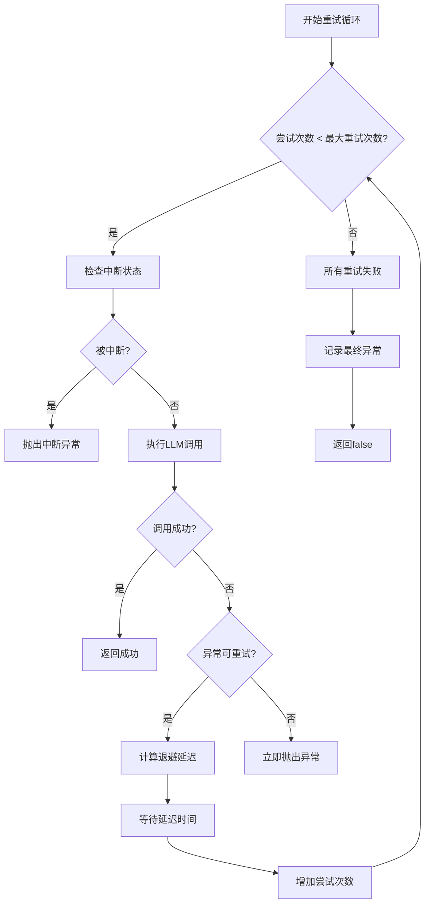
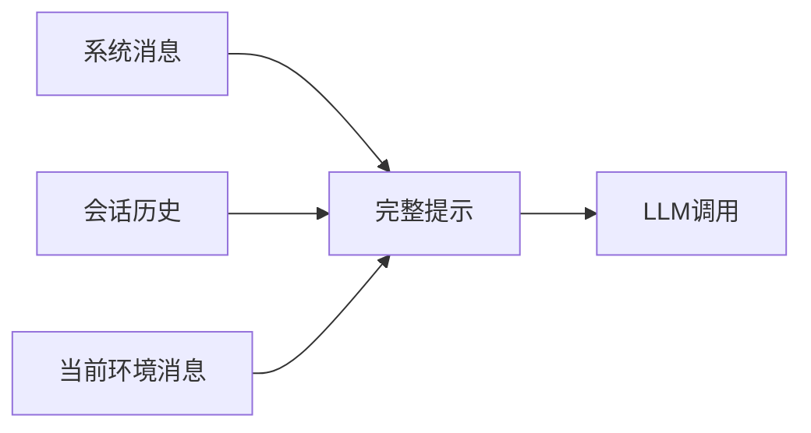
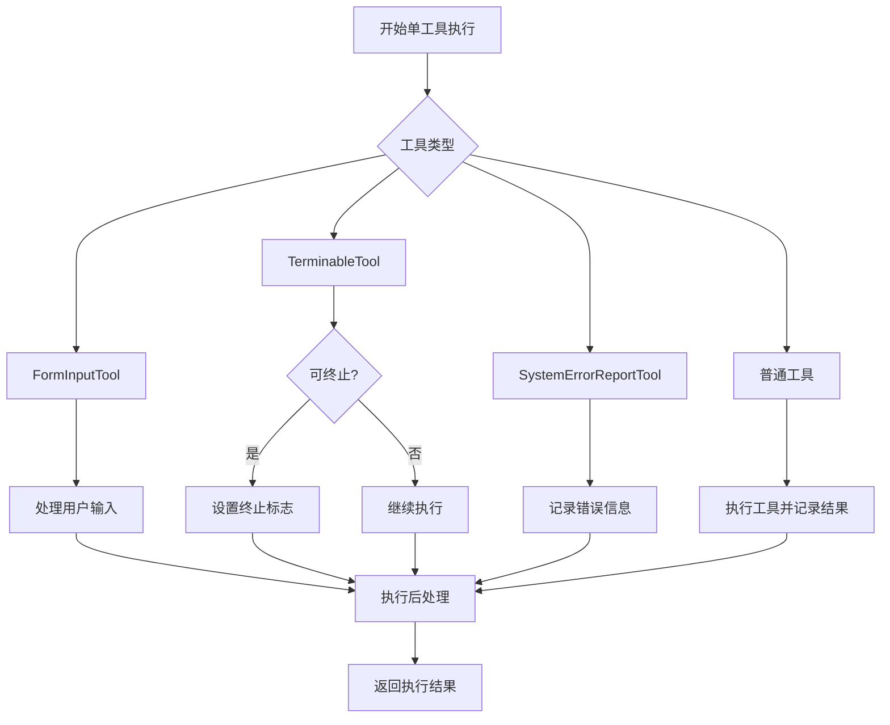

# 代理执行

<cite>
**本文档引用的文件**   
- [DynamicAgent.java](file://src/main/java/com/alibaba/cloud/ai/lynxe/agent/DynamicAgent.java)
- [BaseAgent.java](file://src/main/java/com/alibaba/cloud/ai/lynxe/agent/BaseAgent.java)
- [ReActAgent.java](file://src/main/java/com/alibaba/cloud/ai/lynxe/agent/ReActAgent.java)
- [PlanExecutionRecorder.java](file://src/main/java/com/alibaba/cloud/ai/lynxe/recorder/service/PlanExecutionRecorder.java)
- [StreamingResponseHandler.java](file://src/main/java/com/alibaba/cloud/ai/lynxe/llm/StreamingResponseHandler.java)
</cite>

## 目录
1. [引言](#引言)
2. [代理执行生命周期](#代理执行生命周期)
3. [重试机制与错误处理](#重试机制与错误处理)
4. [思考过程实现](#思考过程实现)
5. [行动过程实现](#行动过程实现)
6. [内存与会话管理](#内存与会话管理)
7. [性能监控与优化](#性能监控与优化)
8. [开发者指南](#开发者指南)

## 引言

DynamicAgent是AI代理系统的核心组件，实现了ReAct（思考-行动）模式的完整生命周期。该代理通过与大型语言模型（LLM）的交互，执行复杂的多步骤任务，支持工具调用、会话记忆和错误恢复。本文档详细阐述了代理从think()到act()的完整执行流程，包括重试策略、中断处理、内存管理和性能监控等关键机制。

**Section sources**
- [DynamicAgent.java](file://src/main/java/com/alibaba/cloud/ai/lynxe/agent/DynamicAgent.java#L78-L1581)
- [ReActAgent.java](file://src/main/java/com/alibaba/cloud/ai/lynxe/agent/ReActAgent.java#L29-L95)

## 代理执行生命周期

DynamicAgent的执行遵循ReActAgent定义的思考-行动循环。代理的执行入口是`run()`方法，它继承自BaseAgent类，并在每个执行步骤中调用`step()`方法。

```mermaid
sequenceDiagram
participant 开发者
participant BaseAgent
participant DynamicAgent
participant LLM
开发者->>BaseAgent : 调用run()
BaseAgent->>BaseAgent : 初始化执行循环
loop 每个执行步骤
BaseAgent->>DynamicAgent : 调用step()
DynamicAgent->>DynamicAgent : 执行think()
alt 思考需要行动
DynamicAgent->>DynamicAgent : 执行act()
DynamicAgent->>LLM : 工具调用
LLM-->>DynamicAgent : 返回结果
DynamicAgent-->>BaseAgent : 返回执行结果
else 思考完成
DynamicAgent-->>BaseAgent : 返回"思考完成"
end
BaseAgent->>BaseAgent : 检查执行状态
alt 执行完成/中断/失败
BaseAgent->>BaseAgent : 处理最终状态
BaseAgent-->>开发者 : 返回最终结果
break
end
end
```

**Diagram sources**
- [BaseAgent.java](file://src/main/java/com/alibaba/cloud/ai/lynxe/agent/BaseAgent.java#L253-L331)
- [DynamicAgent.java](file://src/main/java/com/alibaba/cloud/ai/lynxe/agent/DynamicAgent.java#L509-L552)

**Section sources**
- [BaseAgent.java](file://src/main/java/com/alibaba/cloud/ai/lynxe/agent/BaseAgent.java#L253-L331)
- [DynamicAgent.java](file://src/main/java/com/alibaba/cloud/ai/lynxe/agent/DynamicAgent.java#L509-L552)

## 重试机制与错误处理

DynamicAgent实现了健壮的重试机制，以应对网络波动、LLM超时等临时性故障。核心方法`executeWithRetry()`实现了指数退避算法和中断处理。

### 重试策略

`executeWithRetry()`方法在LLM调用失败时自动重试，最多尝试3次。重试策略包括：

- **指数退避**: 重试间隔时间呈指数增长，计算公式为 `2^(attempt-1) * 2000ms`，最大不超过60秒。
- **可重试异常**: 仅对网络相关的异常进行重试，如连接超时、DNS解析失败等。
- **中断处理**: 在每次重试前检查中断状态，允许用户或系统中断代理执行。



**Diagram sources**
- [DynamicAgent.java](file://src/main/java/com/alibaba/cloud/ai/lynxe/agent/DynamicAgent.java#L232-L484)

### 早期终止检测

系统还实现了早期终止检测机制，防止LLM反复返回纯文本响应而不调用工具。当连续3次检测到早期终止时，代理将失败并返回错误信息。

**Section sources**
- [DynamicAgent.java](file://src/main/java/com/alibaba/cloud/ai/lynxe/agent/DynamicAgent.java#L232-L484)

## 思考过程实现

`think()`方法是代理决策的核心，负责与LLM交互以确定下一步行动。该过程涉及消息构建、流式响应处理和会话历史记录。

### 消息构建

思考过程的消息由三部分组成：
1. **系统消息**: 通过`getThinkMessage()`生成，包含系统信息、执行规则和上下文。
2. **会话历史**: 从`llmService.getAgentMemory()`获取的代理记忆。
3. **当前环境消息**: 通过`currentStepEnvMessage()`生成，包含当前步骤的环境信息。



### 流式响应处理

系统使用`StreamingResponseHandler`处理LLM的流式响应，实现内容合并和早期终止检测。流式处理的优势包括：
- 实时显示LLM的思考过程
- 及时检测和处理错误
- 支持大响应内容的高效处理

**Section sources**
- [DynamicAgent.java](file://src/main/java/com/alibaba/cloud/ai/lynxe/agent/DynamicAgent.java#L199-L229)
- [StreamingResponseHandler.java](file://src/main/java/com/alibaba/cloud/ai/lynxe/llm/StreamingResponseHandler.java)

## 行动过程实现

`act()`方法负责执行LLM选择的工具调用，根据工具数量路由到不同的处理逻辑。

### 单工具执行

`processSingleTool()`方法处理单个工具调用，其核心流程包括：
1. 检查中断状态
2. 执行工具调用
3. 处理内存和会话
4. 根据工具类型执行特定逻辑

#### 特殊工具处理

- **FormInputTool**: 处理用户输入，支持等待用户响应或超时。
- **TerminableTool**: 可终止工具，执行后可能结束代理执行。
- **ErrorReportTool**: 错误报告工具，用于记录和报告执行错误。



**Diagram sources**
- [DynamicAgent.java](file://src/main/java/com/alibaba/cloud/ai/lynxe/agent/DynamicAgent.java#L654-L766)

### 多工具执行

`processMultipleTools()`方法处理多个工具调用，使用`ParallelToolExecutionService`进行并行执行。需要注意的是，多工具执行不支持`TerminableTool`和`FormInputTool`。

**Section sources**
- [DynamicAgent.java](file://src/main/java/com/alibaba/cloud/ai/lynxe/agent/DynamicAgent.java#L605-L647)
- [DynamicAgent.java](file://src/main/java/com/alibaba/cloud/ai/lynxe/agent/DynamicAgent.java#L654-L766)
- [DynamicAgent.java](file://src/main/java/com/alibaba/cloud/ai/lynxe/agent/DynamicAgent.java#L775-L874)

## 内存与会话管理

代理系统实现了多层次的内存管理机制，确保上下文信息的持久化和共享。

### 代理内存

每个代理实例拥有独立的内存空间，通过`llmService.getAgentMemory()`管理。内存存储了代理的会话历史，包括系统消息、用户消息和工具响应。

### 会话内存

当启用会话记忆时，系统通过`MemoryService`在不同代理实例间共享会话历史。这允许跨步骤和跨代理的上下文延续。

### 内存清理

在代理执行结束时，系统自动清理相关内存，防止内存泄漏。`clearUp()`方法负责清理工具相关的资源。

**Section sources**
- [DynamicAgent.java](file://src/main/java/com/alibaba/cloud/ai/lynxe/agent/DynamicAgent.java#L1285-L1309)
- [BaseAgent.java](file://src/main/java/com/alibaba/cloud/ai/lynxe/agent/BaseAgent.java#L315-L316)

## 性能监控与优化

系统提供了全面的性能监控和优化机制。

### 执行记录

`PlanExecutionRecorder`服务记录每个思考-行动步骤的详细信息，包括：
- 输入和输出字符数
- 工具调用参数和结果
- 执行时间和状态

### 性能指标

关键性能指标包括：
- **输入字符数**: 提示的总字符数
- **输出字符数**: LLM响应的总字符数
- **执行时间**: 每个步骤的耗时

### 优化建议

- **调整重试次数**: 根据网络稳定性调整`maxRetries`参数。
- **优化提示大小**: 控制会话历史长度，避免过长的提示。
- **并行执行**: 对于独立的工具调用，使用并行执行提高效率。

**Section sources**
- [PlanExecutionRecorder.java](file://src/main/java/com/alibaba/cloud/ai/lynxe/recorder/service/PlanExecutionRecorder.java#L62-L89)
- [DynamicAgent.java](file://src/main/java/com/alibaba/cloud/ai/lynxe/agent/DynamicAgent.java#L346-L353)

## 开发者指南

### 启动代理执行

```java
// 创建代理实例
DynamicAgent agent = new DynamicAgent(
    llmService, 
    planExecutionRecorder,
    lynxeProperties,
    "MyAgent",
    "An example agent",
    "Next step prompt",
    availableToolKeys,
    toolCallingManager,
    initialAgentSetting,
    userInputService,
    modelName,
    streamingResponseHandler,
    executionStep,
    planIdDispatcher,
    lynxeEventPublisher,
    agentInterruptionHelper,
    objectMapper,
    parallelToolExecutionService,
    memoryService,
    conversationMemoryLimitService,
    serviceGroupIndexService
);

// 设置计划ID
agent.setCurrentPlanId("plan-123");
agent.setRootPlanId("root-123");

// 执行代理
AgentExecResult result = agent.run();
```

### 监控代理执行

开发者可以通过以下方式监控代理执行：

- **日志**: 查看`log.info()`输出的执行信息
- **执行结果**: 分析`AgentExecResult`的状态和结果
- **执行记录**: 查询`PlanExecutionRecorder`中的详细记录

### 性能优化

- **调整重试策略**: 根据应用场景调整重试次数和超时设置
- **优化工具调用**: 减少不必要的工具调用，提高执行效率
- **管理会话长度**: 控制会话历史长度，避免性能下降

**Section sources**
- [DynamicAgent.java](file://src/main/java/com/alibaba/cloud/ai/lynxe/agent/DynamicAgent.java#L166-L198)
- [BaseAgent.java](file://src/main/java/com/alibaba/cloud/ai/lynxe/agent/BaseAgent.java#L253-L331)