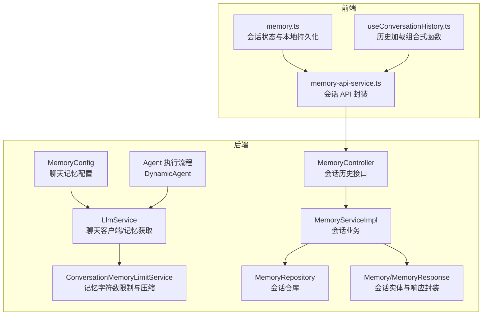
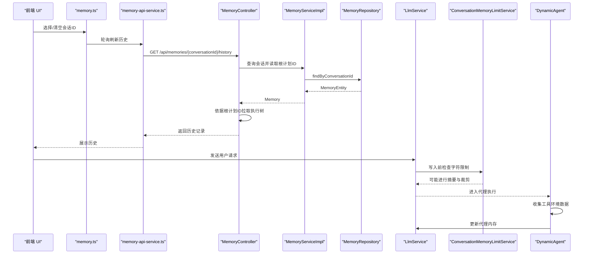
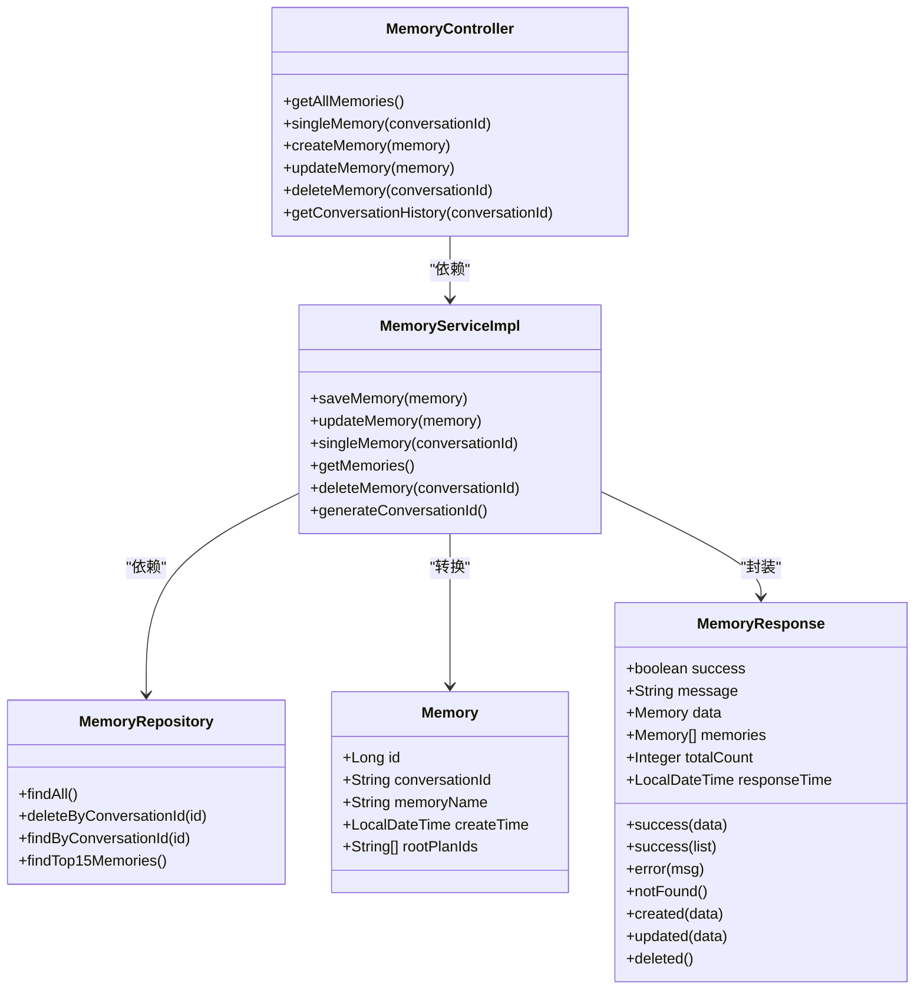
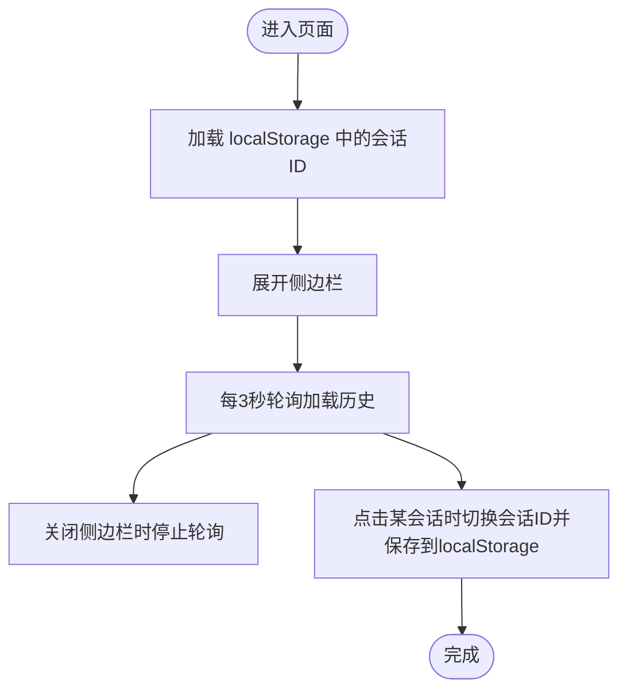
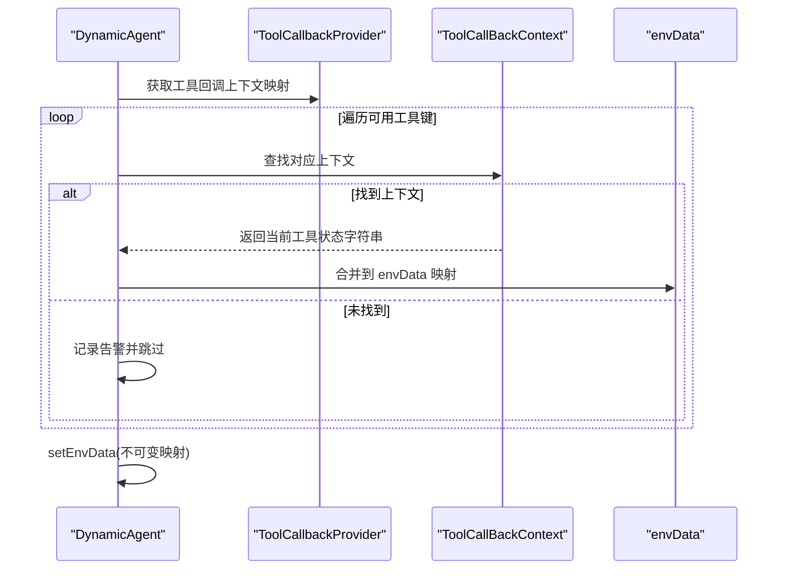
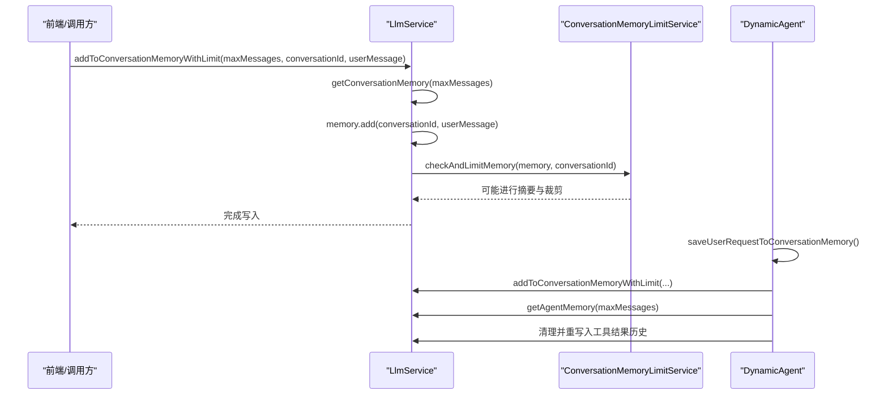
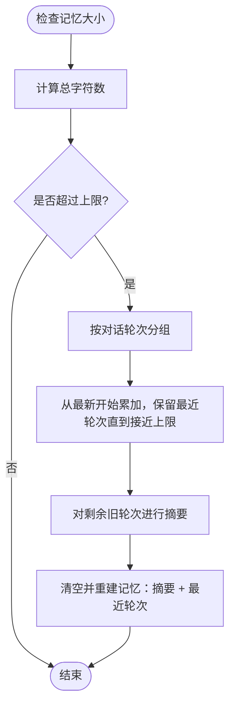
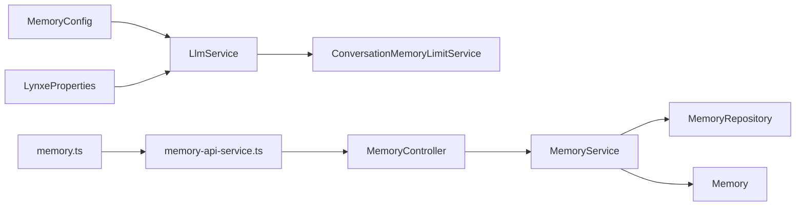

# 内存管理

<cite>
**本文引用的文件**
- [MemoryConfig.java](file://src/main/java/com/alibaba/cloud/ai/lynxe/config/MemoryConfig.java)
- [LynxeProperties.java](file://src/main/java/com/alibaba/cloud/ai/lynxe/config/LynxeProperties.java)
- [LlmService.java](file://src/main/java/com/alibaba/cloud/ai/lynxe/llm/LlmService.java)
- [ConversationMemoryLimitService.java](file://src/main/java/com/alibaba/cloud/ai/lynxe/llm/ConversationMemoryLimitService.java)
- [MemoryController.java](file://src/main/java/com/alibaba/cloud/ai/lynxe/workspace/conversation/controller/MemoryController.java)
- [MemoryServiceImpl.java](file://src/main/java/com/alibaba/cloud/ai/lynxe/workspace/conversation/service/MemoryServiceImpl.java)
- [MemoryRepository.java](file://src/main/java/com/alibaba/cloud/ai/lynxe/workspace/conversation/repository/MemoryRepository.java)
- [Memory.java](file://src/main/java/com/alibaba/cloud/ai/lynxe/workspace/conversation/entity/vo/Memory.java)
- [MemoryResponse.java](file://src/main/java/com/alibaba/cloud/ai/lynxe/workspace/conversation/entity/vo/MemoryResponse.java)
- [memory.ts](file://ui-vue3/src/stores/memory.ts)
- [memory-api-service.ts](file://ui-vue3/src/api/memory-api-service.ts)
- [useConversationHistory.ts](file://ui-vue3/src/composables/useConversationHistory.ts)
- [DynamicAgent.java](file://src/main/java/com/alibaba/cloud/ai/lynxe/agent/DynamicAgent.java)
- [ExcelProcessingService.java](file://src/main/java/com/alibaba/cloud/ai/lynxe/tool/excelProcessor/ExcelProcessingService.java)
</cite>

## 目录
1. [简介](#简介)
2. [项目结构](#项目结构)
3. [核心组件](#核心组件)
4. [架构总览](#架构总览)
5. [详细组件分析](#详细组件分析)
6. [依赖关系分析](#依赖关系分析)
7. [性能考量](#性能考量)
8. [故障排查指南](#故障排查指南)
9. [结论](#结论)
10. [附录](#附录)

## 简介
本文件系统化梳理 JManus 在 AI 代理执行过程中对“内存”的管理机制，覆盖会话历史记录与性能监控两大方面。重点说明：
- 如何收集与设置工具环境数据（用于上下文增强）
- 用户输入到内存的处理路径
- 代理内存的更新与压缩策略
- 会话历史记录的持久化与查询
- 性能监控与内存限制策略
- 配置项与调优建议

## 项目结构
围绕“内存管理”，后端主要涉及配置、LLM 服务、对话记忆限制、会话历史控制器与仓库；前端提供会话选择、轮询刷新与 API 交互。

图表来源
- [MemoryConfig.java](file://src/main/java/com/alibaba/cloud/ai/lynxe/config/MemoryConfig.java#L35-L72)
- [LlmService.java](file://src/main/java/com/alibaba/cloud/ai/lynxe/llm/LlmService.java#L203-L285)
- [ConversationMemoryLimitService.java](file://src/main/java/com/alibaba/cloud/ai/lynxe/llm/ConversationMemoryLimitService.java#L65-L95)
- [DynamicAgent.java](file://src/main/java/com/alibaba/cloud/ai/lynxe/agent/DynamicAgent.java#L1483-L1530)
- [MemoryController.java](file://src/main/java/com/alibaba/cloud/ai/lynxe/workspace/conversation/controller/MemoryController.java#L61-L119)
- [MemoryServiceImpl.java](file://src/main/java/com/alibaba/cloud/ai/lynxe/workspace/conversation/service/MemoryServiceImpl.java#L43-L96)
- [MemoryRepository.java](file://src/main/java/com/alibaba/cloud/ai/lynxe/workspace/conversation/repository/MemoryRepository.java#L31-L49)
- [Memory.java](file://src/main/java/com/alibaba/cloud/ai/lynxe/workspace/conversation/entity/vo/Memory.java#L37-L140)
- [MemoryResponse.java](file://src/main/java/com/alibaba/cloud/ai/lynxe/workspace/conversation/entity/vo/MemoryResponse.java#L47-L143)
- [memory.ts](file://ui-vue3/src/stores/memory.ts#L1-L128)
- [memory-api-service.ts](file://ui-vue3/src/api/memory-api-service.ts#L40-L128)
- [useConversationHistory.ts](file://ui-vue3/src/composables/useConversationHistory.ts#L1-L33)

章节来源
- [MemoryConfig.java](file://src/main/java/com/alibaba/cloud/ai/lynxe/config/MemoryConfig.java#L35-L72)
- [LynxeProperties.java](file://src/main/java/com/alibaba/cloud/ai/lynxe/config/LynxeProperties.java#L196-L262)
- [LlmService.java](file://src/main/java/com/alibaba/cloud/ai/lynxe/llm/LlmService.java#L203-L285)
- [ConversationMemoryLimitService.java](file://src/main/java/com/alibaba/cloud/ai/lynxe/llm/ConversationMemoryLimitService.java#L65-L95)
- [MemoryController.java](file://src/main/java/com/alibaba/cloud/ai/lynxe/workspace/conversation/controller/MemoryController.java#L61-L119)
- [MemoryServiceImpl.java](file://src/main/java/com/alibaba/cloud/ai/lynxe/workspace/conversation/service/MemoryServiceImpl.java#L43-L96)
- [MemoryRepository.java](file://src/main/java/com/alibaba/cloud/ai/lynxe/workspace/conversation/repository/MemoryRepository.java#L31-L49)
- [Memory.java](file://src/main/java/com/alibaba/cloud/ai/lynxe/workspace/conversation/entity/vo/Memory.java#L37-L140)
- [MemoryResponse.java](file://src/main/java/com/alibaba/cloud/ai/lynxe/workspace/conversation/entity/vo/MemoryResponse.java#L47-L143)
- [memory.ts](file://ui-vue3/src/stores/memory.ts#L1-L128)
- [memory-api-service.ts](file://ui-vue3/src/api/memory-api-service.ts#L40-L128)
- [useConversationHistory.ts](file://ui-vue3/src/composables/useConversationHistory.ts#L1-L33)

## 核心组件
- 记忆配置与注入：通过 MemoryConfig 注入 MessageWindowChatMemory，并根据数据库类型选择 ChatMemoryRepository 实现。
- LLM 服务：统一管理 ChatClient 缓存、会话记忆与代理记忆的获取与清理；提供带字符限制检查的记忆写入方法。
- 记忆限制与压缩：ConversationMemoryLimitService 基于字符上限与最近保留策略，自动对旧对话进行摘要并裁剪。
- 会话历史：MemoryController 提供会话列表、单个会话、创建/更新/删除接口；通过 MemoryServiceImpl 与 MemoryRepository 持久化；会话包含根计划 ID 列表以回溯执行记录。
- 工具环境数据：DynamicAgent 收集各工具当前状态字符串，合并到代理环境数据中，作为后续推理上下文的一部分。
- 前端会话状态：memory.ts 负责会话 ID 的本地持久化与侧边栏轮询刷新；memory-api-service.ts 提供统一 API 封装；useConversationHistory.ts 负责历史加载与恢复。

章节来源
- [MemoryConfig.java](file://src/main/java/com/alibaba/cloud/ai/lynxe/config/MemoryConfig.java#L35-L72)
- [LlmService.java](file://src/main/java/com/alibaba/cloud/ai/lynxe/llm/LlmService.java#L203-L285)
- [ConversationMemoryLimitService.java](file://src/main/java/com/alibaba/cloud/ai/lynxe/llm/ConversationMemoryLimitService.java#L65-L95)
- [MemoryController.java](file://src/main/java/com/alibaba/cloud/ai/lynxe/workspace/conversation/controller/MemoryController.java#L61-L119)
- [MemoryServiceImpl.java](file://src/main/java/com/alibaba/cloud/ai/lynxe/workspace/conversation/service/MemoryServiceImpl.java#L43-L96)
- [MemoryRepository.java](file://src/main/java/com/alibaba/cloud/ai/lynxe/workspace/conversation/repository/MemoryRepository.java#L31-L49)
- [Memory.java](file://src/main/java/com/alibaba/cloud/ai/lynxe/workspace/conversation/entity/vo/Memory.java#L37-L140)
- [MemoryResponse.java](file://src/main/java/com/alibaba/cloud/ai/lynxe/workspace/conversation/entity/vo/MemoryResponse.java#L47-L143)
- [DynamicAgent.java](file://src/main/java/com/alibaba/cloud/ai/lynxe/agent/DynamicAgent.java#L1424-L1466)
- [memory.ts](file://ui-vue3/src/stores/memory.ts#L1-L128)
- [memory-api-service.ts](file://ui-vue3/src/api/memory-api-service.ts#L40-L128)
- [useConversationHistory.ts](file://ui-vue3/src/composables/useConversationHistory.ts#L1-L33)

## 架构总览
下图展示从用户输入到代理执行再到记忆更新与历史查询的整体流程。

图表来源
- [memory.ts](file://ui-vue3/src/stores/memory.ts#L69-L109)
- [memory-api-service.ts](file://ui-vue3/src/api/memory-api-service.ts#L40-L128)
- [MemoryController.java](file://src/main/java/com/alibaba/cloud/ai/lynxe/workspace/conversation/controller/MemoryController.java#L147-L197)
- [MemoryServiceImpl.java](file://src/main/java/com/alibaba/cloud/ai/lynxe/workspace/conversation/service/MemoryServiceImpl.java#L131-L165)
- [MemoryRepository.java](file://src/main/java/com/alibaba/cloud/ai/lynxe/workspace/conversation/repository/MemoryRepository.java#L31-L49)
- [LlmService.java](file://src/main/java/com/alibaba/cloud/ai/lynxe/llm/LlmService.java#L254-L285)
- [ConversationMemoryLimitService.java](file://src/main/java/com/alibaba/cloud/ai/lynxe/llm/ConversationMemoryLimitService.java#L65-L95)
- [DynamicAgent.java](file://src/main/java/com/alibaba/cloud/ai/lynxe/agent/DynamicAgent.java#L1483-L1530)

## 详细组件分析

### 会话历史记录与持久化
- 控制器层：提供会话列表、单个会话、创建/更新/删除接口；新增历史查询接口，基于会话内的根计划 ID 列表回溯执行树。
- 服务层：负责实体转换、生成会话 ID、与仓库交互。
- 仓库层：提供按会话 ID 查询、删除、分页查询最新会话等能力。
- 实体与响应：Memory 包含会话名、创建时间、根计划 ID 列表；MemoryResponse 统一封装成功/失败/未找到/已创建/已更新/已删除等语义。

图表来源
- [Memory.java](file://src/main/java/com/alibaba/cloud/ai/lynxe/workspace/conversation/entity/vo/Memory.java#L37-L140)
- [MemoryResponse.java](file://src/main/java/com/alibaba/cloud/ai/lynxe/workspace/conversation/entity/vo/MemoryResponse.java#L47-L143)
- [MemoryRepository.java](file://src/main/java/com/alibaba/cloud/ai/lynxe/workspace/conversation/repository/MemoryRepository.java#L31-L49)
- [MemoryServiceImpl.java](file://src/main/java/com/alibaba/cloud/ai/lynxe/workspace/conversation/service/MemoryServiceImpl.java#L43-L96)
- [MemoryController.java](file://src/main/java/com/alibaba/cloud/ai/lynxe/workspace/conversation/controller/MemoryController.java#L61-L119)

章节来源
- [MemoryController.java](file://src/main/java/com/alibaba/cloud/ai/lynxe/workspace/conversation/controller/MemoryController.java#L61-L119)
- [MemoryServiceImpl.java](file://src/main/java/com/alibaba/cloud/ai/lynxe/workspace/conversation/service/MemoryServiceImpl.java#L43-L96)
- [MemoryRepository.java](file://src/main/java/com/alibaba/cloud/ai/lynxe/workspace/conversation/repository/MemoryRepository.java#L31-L49)
- [Memory.java](file://src/main/java/com/alibaba/cloud/ai/lynxe/workspace/conversation/entity/vo/Memory.java#L37-L140)
- [MemoryResponse.java](file://src/main/java/com/alibaba/cloud/ai/lynxe/workspace/conversation/entity/vo/MemoryResponse.java#L47-L143)

### 会话历史加载与前端交互
- memory.ts：维护当前会话 ID，支持本地持久化与侧边栏轮询刷新。
- memory-api-service.ts：封装会话列表、单个会话、创建/更新/删除与历史查询 API。
- useConversationHistory.ts：组合式函数，负责加载与恢复会话历史。

图表来源
- [memory.ts](file://ui-vue3/src/stores/memory.ts#L32-L109)
- [memory-api-service.ts](file://ui-vue3/src/api/memory-api-service.ts#L40-L128)
- [useConversationHistory.ts](file://ui-vue3/src/composables/useConversationHistory.ts#L1-L33)

章节来源
- [memory.ts](file://ui-vue3/src/stores/memory.ts#L1-L128)
- [memory-api-service.ts](file://ui-vue3/src/api/memory-api-service.ts#L40-L128)
- [useConversationHistory.ts](file://ui-vue3/src/composables/useConversationHistory.ts#L1-L33)

### 工具环境数据收集与设置
- DynamicAgent 收集每个可用工具的当前状态字符串，合并到代理环境数据中，形成可用于推理的上下文信息。
- 收集逻辑会尝试将 serviceGroup.toolName 转换为内部索引格式，再查找回调上下文，最终拼接为字符串。

图表来源
- [DynamicAgent.java](file://src/main/java/com/alibaba/cloud/ai/lynxe/agent/DynamicAgent.java#L1424-L1466)

章节来源
- [DynamicAgent.java](file://src/main/java/com/alibaba/cloud/ai/lynxe/agent/DynamicAgent.java#L1424-L1466)

### 用户输入到内存与代理内存更新
- 用户请求保存：当启用会话记忆且存在 conversationId 时，将用户请求写入会话记忆；若超出字符限制则触发限制服务进行摘要与裁剪。
- 代理内存更新：代理执行过程中，针对工具结果的历史消息进行清洗与重写入，排除系统消息与环境数据消息，仅保留关键消息序列。

图表来源
- [LlmService.java](file://src/main/java/com/alibaba/cloud/ai/lynxe/llm/LlmService.java#L254-L285)
- [ConversationMemoryLimitService.java](file://src/main/java/com/alibaba/cloud/ai/lynxe/llm/ConversationMemoryLimitService.java#L65-L95)
- [DynamicAgent.java](file://src/main/java/com/alibaba/cloud/ai/lynxe/agent/DynamicAgent.java#L1483-L1530)
- [DynamicAgent.java](file://src/main/java/com/alibaba/cloud/ai/lynxe/agent/DynamicAgent.java#L1272-L1310)

章节来源
- [LlmService.java](file://src/main/java/com/alibaba/cloud/ai/lynxe/llm/LlmService.java#L254-L285)
- [ConversationMemoryLimitService.java](file://src/main/java/com/alibaba/cloud/ai/lynxe/llm/ConversationMemoryLimitService.java#L65-L95)
- [DynamicAgent.java](file://src/main/java/com/alibaba/cloud/ai/lynxe/agent/DynamicAgent.java#L1483-L1530)
- [DynamicAgent.java](file://src/main/java/com/alibaba/cloud/ai/lynxe/agent/DynamicAgent.java#L1272-L1310)

### 记忆限制与压缩算法
- 字符上限：由 LynxeProperties 提供默认值与可配置项。
- 最近保留策略：至少保留最近一轮对话的全部内容，其余旧对话按字符累计，超过阈值时进行摘要。
- 摘要生成：将多轮对话文本拼接后交由 LLM 生成摘要，长度控制在目标范围内。
- 强制压缩：检测到重复工具结果达到阈值时，强制压缩代理内存，仅保留最新一轮并摘要旧轮。

图表来源
- [ConversationMemoryLimitService.java](file://src/main/java/com/alibaba/cloud/ai/lynxe/llm/ConversationMemoryLimitService.java#L182-L295)
- [LynxeProperties.java](file://src/main/java/com/alibaba/cloud/ai/lynxe/config/LynxeProperties.java#L242-L262)

章节来源
- [ConversationMemoryLimitService.java](file://src/main/java/com/alibaba/cloud/ai/lynxe/llm/ConversationMemoryLimitService.java#L182-L295)
- [LynxeProperties.java](file://src/main/java/com/alibaba/cloud/ai/lynxe/config/LynxeProperties.java#L242-L262)

### 性能监控与内存使用
- Excel 处理服务提供性能指标采集：记录开始时间、操作明细、内存占用（MB）、吞吐量等。
- 内存压力回调：提供内存优化处理接口，允许在内存压力模式下调整批处理策略。

章节来源
- [ExcelProcessingService.java](file://src/main/java/com/alibaba/cloud/ai/lynxe/tool/excelProcessor/ExcelProcessingService.java#L818-L871)

## 依赖关系分析
- 记忆配置依赖数据库类型选择对应的 ChatMemoryRepository；LlmService 依赖 MemoryConfig 注入的 ChatMemory 与 ChatMemoryRepository。
- ConversationMemoryLimitService 依赖 LlmService 的 ChatClient 与 LynxeProperties 的配置项。
- MemoryController 依赖 MemoryService；MemoryService 依赖 MemoryRepository 与 ChatMemory。
- 前端通过 memory-api-service.ts 与后端控制器交互，使用 memory.ts 维护会话状态。

图表来源
- [MemoryConfig.java](file://src/main/java/com/alibaba/cloud/ai/lynxe/config/MemoryConfig.java#L35-L72)
- [LynxeProperties.java](file://src/main/java/com/alibaba/cloud/ai/lynxe/config/LynxeProperties.java#L196-L262)
- [LlmService.java](file://src/main/java/com/alibaba/cloud/ai/lynxe/llm/LlmService.java#L203-L285)
- [ConversationMemoryLimitService.java](file://src/main/java/com/alibaba/cloud/ai/lynxe/llm/ConversationMemoryLimitService.java#L65-L95)
- [MemoryController.java](file://src/main/java/com/alibaba/cloud/ai/lynxe/workspace/conversation/controller/MemoryController.java#L61-L119)
- [MemoryServiceImpl.java](file://src/main/java/com/alibaba/cloud/ai/lynxe/workspace/conversation/service/MemoryServiceImpl.java#L43-L96)
- [MemoryRepository.java](file://src/main/java/com/alibaba/cloud/ai/lynxe/workspace/conversation/repository/MemoryRepository.java#L31-L49)
- [Memory.java](file://src/main/java/com/alibaba/cloud/ai/lynxe/workspace/conversation/entity/vo/Memory.java#L37-L140)
- [memory-api-service.ts](file://ui-vue3/src/api/memory-api-service.ts#L40-L128)
- [memory.ts](file://ui-vue3/src/stores/memory.ts#L1-L128)

章节来源
- [MemoryConfig.java](file://src/main/java/com/alibaba/cloud/ai/lynxe/config/MemoryConfig.java#L35-L72)
- [LynxeProperties.java](file://src/main/java/com/alibaba/cloud/ai/lynxe/config/LynxeProperties.java#L196-L262)
- [LlmService.java](file://src/main/java/com/alibaba/cloud/ai/lynxe/llm/LlmService.java#L203-L285)
- [ConversationMemoryLimitService.java](file://src/main/java/com/alibaba/cloud/ai/lynxe/llm/ConversationMemoryLimitService.java#L65-L95)
- [MemoryController.java](file://src/main/java/com/alibaba/cloud/ai/lynxe/workspace/conversation/controller/MemoryController.java#L61-L119)
- [MemoryServiceImpl.java](file://src/main/java/com/alibaba/cloud/ai/lynxe/workspace/conversation/service/MemoryServiceImpl.java#L43-L96)
- [MemoryRepository.java](file://src/main/java/com/alibaba/cloud/ai/lynxe/workspace/conversation/repository/MemoryRepository.java#L31-L49)
- [Memory.java](file://src/main/java/com/alibaba/cloud/ai/lynxe/workspace/conversation/entity/vo/Memory.java#L37-L140)
- [memory-api-service.ts](file://ui-vue3/src/api/memory-api-service.ts#L40-L128)
- [memory.ts](file://ui-vue3/src/stores/memory.ts#L1-L128)

## 性能考量
- 记忆字符上限与最近保留策略：通过 ConversationMemoryLimitService 控制会话记忆大小，避免超长上下文导致延迟与成本上升。
- 代理内存压缩：在检测到重复工具结果时强制压缩，打破潜在循环，减少无效重复。
- LLM 客户端缓存：LlmService 对 ChatClient 进行缓存，降低模型切换与初始化开销。
- 前端轮询频率：memory.ts 默认每 3 秒轮询一次，可根据网络与性能情况调整。
- 数据库与仓库：MemoryRepository 使用原生 SQL 限制查询条目数量，提升历史查询性能。

章节来源
- [ConversationMemoryLimitService.java](file://src/main/java/com/alibaba/cloud/ai/lynxe/llm/ConversationMemoryLimitService.java#L454-L539)
- [LlmService.java](file://src/main/java/com/alibaba/cloud/ai/lynxe/llm/LlmService.java#L164-L201)
- [memory.ts](file://ui-vue3/src/stores/memory.ts#L69-L79)
- [MemoryRepository.java](file://src/main/java/com/alibaba/cloud/ai/lynxe/workspace/conversation/repository/MemoryRepository.java#L40-L49)

## 故障排查指南
- 会话历史为空或缺失
  - 检查 MemoryController 的历史接口是否正确返回根计划 ID 列表；确认 MemoryServiceImpl 的单个会话查询是否成功。
  - 章节来源
    - [MemoryController.java](file://src/main/java/com/alibaba/cloud/ai/lynxe/workspace/conversation/controller/MemoryController.java#L147-L197)
    - [MemoryServiceImpl.java](file://src/main/java/com/alibaba/cloud/ai/lynxe/workspace/conversation/service/MemoryServiceImpl.java#L131-L165)
- 写入会话记忆失败
  - 检查 conversationId 是否为空；确认 LlmService 的写入方法是否被调用；查看 ConversationMemoryLimitService 是否抛出异常。
  - 章节来源
    - [LlmService.java](file://src/main/java/com/alibaba/cloud/ai/lynxe/llm/LlmService.java#L277-L285)
    - [ConversationMemoryLimitService.java](file://src/main/java/com/alibaba/cloud/ai/lynxe/llm/ConversationMemoryLimitService.java#L65-L95)
- 工具环境数据为空
  - 检查 DynamicAgent 的 collectEnvData 与 collectAndSetEnvDataForTools 是否被正确调用；确认 ToolCallbackProvider 的上下文是否存在。
  - 章节来源
    - [DynamicAgent.java](file://src/main/java/com/alibaba/cloud/ai/lynxe/agent/DynamicAgent.java#L1424-L1466)
- 前端无法加载历史
  - 检查 memory.ts 的轮询逻辑与 localStorage 存取；确认 memory-api-service.ts 的响应处理。
  - 章节来源
    - [memory.ts](file://ui-vue3/src/stores/memory.ts#L32-L109)
    - [memory-api-service.ts](file://ui-vue3/src/api/memory-api-service.ts#L40-L128)

## 结论
JManus 的内存管理围绕“会话记忆”和“代理记忆”两条主线展开：前者通过 MemoryController 与 MemoryServiceImpl 提供会话历史持久化与查询；后者通过 LlmService 与 ConversationMemoryLimitService 实现自动字符限制与摘要压缩。前端通过 memory.ts 与 memory-api-service.ts 提供会话选择与历史轮询体验。工具环境数据通过 DynamicAgent 收集并注入推理上下文，进一步提升代理决策质量。整体设计兼顾了可扩展性与性能，适合在复杂多轮对话场景中稳定运行。

## 附录
- 配置项参考
  - 会话记忆开关与字符上限：见 LynxeProperties 的 enableConversationMemory 与 conversationMemoryMaxChars。
  - 代理最大记忆轮次：见 LynxeProperties 的 maxMemory。
  - 记忆配置：见 MemoryConfig 的数据库类型选择与 ChatMemory 注入。
- 代码示例路径（不展示具体代码内容）
  - 会话历史查询接口：[MemoryController.java](file://src/main/java/com/alibaba/cloud/ai/lynxe/workspace/conversation/controller/MemoryController.java#L147-L197)
  - 写入会话记忆并检查限制：[LlmService.java](file://src/main/java/com/alibaba/cloud/ai/lynxe/llm/LlmService.java#L277-L285)
  - 自动摘要与裁剪：[ConversationMemoryLimitService.java](file://src/main/java/com/alibaba/cloud/ai/lynxe/llm/ConversationMemoryLimitService.java#L182-L295)
  - 工具环境数据收集：[DynamicAgent.java](file://src/main/java/com/alibaba/cloud/ai/lynxe/agent/DynamicAgent.java#L1424-L1466)
  - 前端会话状态与轮询：[memory.ts](file://ui-vue3/src/stores/memory.ts#L69-L109)
  - 前端 API 封装：[memory-api-service.ts](file://ui-vue3/src/api/memory-api-service.ts#L40-L128)