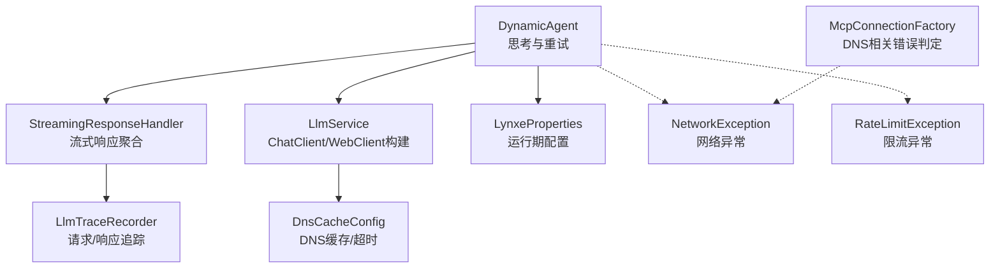
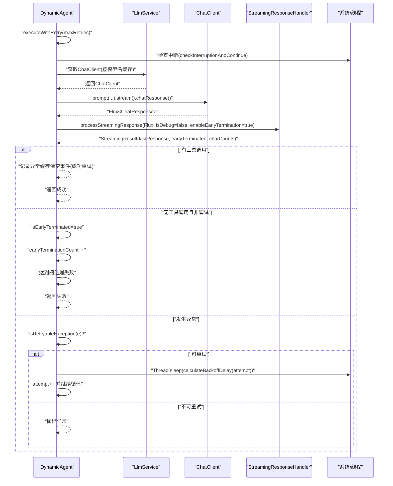
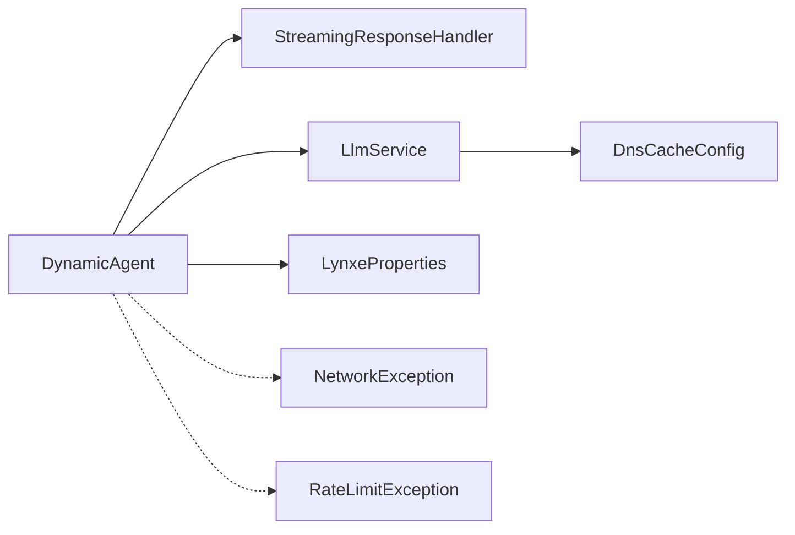

# LLM调用与重试机制

<cite>
**本文引用的文件列表**
- [DynamicAgent.java](file://src/main/java/com/alibaba/cloud/ai/lynxe/agent/DynamicAgent.java)
- [LlmService.java](file://src/main/java/com/alibaba/cloud/ai/lynxe/llm/LlmService.java)
- [StreamingResponseHandler.java](file://src/main/java/com/alibaba/cloud/ai/lynxe/llm/StreamingResponseHandler.java)
- [LynxeProperties.java](file://src/main/java/com/alibaba/cloud/ai/lynxe/config/LynxeProperties.java)
- [DnsCacheConfig.java](file://src/main/java/com/alibaba/cloud/ai/lynxe/config/DnsCacheConfig.java)
- [application-polling.yml](file://src/main/resources/application-polling.yml)
- [RateLimitException.java](file://src/main/java/com/alibaba/cloud/ai/lynxe/model/exception/RateLimitException.java)
- [NetworkException.java](file://src/main/java/com/alibaba/cloud/ai/lynxe/model/exception/NetworkException.java)
- [McpConnectionFactory.java](file://src/main/java/com/alibaba/cloud/ai/lynxe/mcp/service/McpConnectionFactory.java)
</cite>

## 目录
1. [引言](#引言)
2. [项目结构](#项目结构)
3. [核心组件](#核心组件)
4. [架构总览](#架构总览)
5. [详细组件分析](#详细组件分析)
6. [依赖关系分析](#依赖关系分析)
7. [性能考量](#性能考量)
8. [故障排查指南](#故障排查指南)
9. [结论](#结论)
10. [附录：使用示例与最佳实践](#附录使用示例与最佳实践)

## 引言
本文件系统性梳理并说明本仓库中LLM调用与重试机制的设计与实现，重点围绕以下目标展开：
- 全面介绍executeWithRetry()方法的执行流程，包括重试策略、指数退避算法和中断处理。
- 详解isRetryableException()方法的工作原理，以及如何判断异常是否可重试。
- 解释calculateBackoffDelay()方法的实现细节，以及如何计算退避延迟。
- 说明如何处理网络相关错误和超时错误，并给出监控与日志要点。
- 提供LLM调用与重试机制的代码示例路径，展示如何启动和监控LLM调用过程。
- 给出优化LLM调用性能的指导，包括如何调整重试次数、超时设置和并行执行策略。

## 项目结构
本项目的LLM调用与重试机制主要分布在以下模块：
- 代理层：DynamicAgent负责思考阶段的LLM调用、重试与早期终止检测。
- LLM服务层：LlmService负责构建ChatClient、增强WebClient（含DNS缓存与超时）、封装OpenAI API。
- 流式响应处理：StreamingResponseHandler负责流式响应聚合、进度日志、早期终止与错误记录。
- 配置层：LynxeProperties提供运行期配置项；DnsCacheConfig提供DNS缓存与超时配置；application-polling.yml提供轮询相关超时与退避参数。
- 异常类型：NetworkException、RateLimitException等用于区分不同类型的错误场景。
- MCP连接：McpConnectionFactory包含DNS相关错误识别逻辑，辅助理解网络类错误的判定。



图表来源
- [DynamicAgent.java](file://src/main/java/com/alibaba/cloud/ai/lynxe/agent/DynamicAgent.java#L232-L508)
- [StreamingResponseHandler.java](file://src/main/java/com/alibaba/cloud/ai/lynxe/llm/StreamingResponseHandler.java#L167-L449)
- [LlmService.java](file://src/main/java/com/alibaba/cloud/ai/lynxe/llm/LlmService.java#L387-L449)
- [DnsCacheConfig.java](file://src/main/java/com/alibaba/cloud/ai/lynxe/config/DnsCacheConfig.java#L79-L140)
- [LynxeProperties.java](file://src/main/java/com/alibaba/cloud/ai/lynxe/config/LynxeProperties.java#L309-L329)
- [application-polling.yml](file://src/main/resources/application-polling.yml#L1-L18)
- [NetworkException.java](file://src/main/java/com/alibaba/cloud/ai/lynxe/model/exception/NetworkException.java#L1-L31)
- [RateLimitException.java](file://src/main/java/com/alibaba/cloud/ai/lynxe/model/exception/RateLimitException.java#L1-L31)
- [McpConnectionFactory.java](file://src/main/java/com/alibaba/cloud/ai/lynxe/mcp/service/McpConnectionFactory.java#L184-L205)

章节来源
- [DynamicAgent.java](file://src/main/java/com/alibaba/cloud/ai/lynxe/agent/DynamicAgent.java#L232-L508)
- [LlmService.java](file://src/main/java/com/alibaba/cloud/ai/lynxe/llm/LlmService.java#L387-L449)
- [StreamingResponseHandler.java](file://src/main/java/com/alibaba/cloud/ai/lynxe/llm/StreamingResponseHandler.java#L167-L449)
- [LynxeProperties.java](file://src/main/java/com/alibaba/cloud/ai/lynxe/config/LynxeProperties.java#L309-L329)
- [DnsCacheConfig.java](file://src/main/java/com/alibaba/cloud/ai/lynxe/config/DnsCacheConfig.java#L79-L140)
- [application-polling.yml](file://src/main/resources/application-polling.yml#L1-L18)
- [NetworkException.java](file://src/main/java/com/alibaba/cloud/ai/lynxe/model/exception/NetworkException.java#L1-L31)
- [RateLimitException.java](file://src/main/java/com/alibaba/cloud/ai/lynxe/model/exception/RateLimitException.java#L1-L31)
- [McpConnectionFactory.java](file://src/main/java/com/alibaba/cloud/ai/lynxe/mcp/service/McpConnectionFactory.java#L184-L205)

## 核心组件
- DynamicAgent.executeWithRetry()：在思考阶段发起LLM调用，支持重试、指数退避、早期终止检测与中断检查。
- DynamicAgent.isRetryableException()：基于异常消息关键字判断是否可重试（网络/超时/DNS）。
- DynamicAgent.calculateBackoffDelay()：指数退避延迟计算，带最大上限。
- LlmService：构建ChatClient与OpenAI API，增强WebClient（DNS缓存、超时），并注入追踪器。
- StreamingResponseHandler：流式响应聚合、进度日志、早期终止（非调试模式下仅文本无工具调用时提前结束）、错误事件发布。
- LynxeProperties：提供llmReadTimeout等关键配置项。
- DnsCacheConfig：提供DNS缓存与超时配置，减少DNS抖动带来的网络问题。
- application-polling.yml：提供轮询超时、退避参数，便于理解整体超时与退避策略。
- 异常类型：NetworkException、RateLimitException用于区分网络与限流错误。
- McpConnectionFactory：DNS相关错误识别，辅助理解网络类错误的判定边界。

章节来源
- [DynamicAgent.java](file://src/main/java/com/alibaba/cloud/ai/lynxe/agent/DynamicAgent.java#L232-L508)
- [LlmService.java](file://src/main/java/com/alibaba/cloud/ai/lynxe/llm/LlmService.java#L387-L449)
- [StreamingResponseHandler.java](file://src/main/java/com/alibaba/cloud/ai/lynxe/llm/StreamingResponseHandler.java#L167-L449)
- [LynxeProperties.java](file://src/main/java/com/alibaba/cloud/ai/lynxe/config/LynxeProperties.java#L309-L329)
- [DnsCacheConfig.java](file://src/main/java/com/alibaba/cloud/ai/lynxe/config/DnsCacheConfig.java#L79-L140)
- [application-polling.yml](file://src/main/resources/application-polling.yml#L1-L18)
- [NetworkException.java](file://src/main/java/com/alibaba/cloud/ai/lynxe/model/exception/NetworkException.java#L1-L31)
- [RateLimitException.java](file://src/main/java/com/alibaba/cloud/ai/lynxe/model/exception/RateLimitException.java#L1-L31)
- [McpConnectionFactory.java](file://src/main/java/com/alibaba/cloud/ai/lynxe/mcp/service/McpConnectionFactory.java#L184-L205)

## 架构总览
下面的序列图展示了从代理发起一次LLM调用到最终返回工具调用或失败的整体流程，包括重试、指数退避、早期终止与中断检查。



图表来源
- [DynamicAgent.java](file://src/main/java/com/alibaba/cloud/ai/lynxe/agent/DynamicAgent.java#L232-L508)
- [StreamingResponseHandler.java](file://src/main/java/com/alibaba/cloud/ai/lynxe/llm/StreamingResponseHandler.java#L167-L449)
- [LlmService.java](file://src/main/java/com/alibaba/cloud/ai/lynxe/llm/LlmService.java#L164-L201)

## 详细组件分析

### DynamicAgent.executeWithRetry() 执行流程
- 重试策略
  - 支持固定最大重试次数，每次重试前检查中断状态。
  - 若上一轮出现“仅思考无工具调用”的早期终止，会向提示中追加强制调用工具的要求，避免模型反复只输出文本。
  - 成功后清除异常缓存并发布异常清理事件。
- 指数退避
  - 使用指数退避公式计算等待时间，带最大上限，避免无限增长。
- 中断处理
  - 在每次重试前检查中断状态，若被中断则抛出任务中断异常。
- 早期终止检测
  - 非调试模式下，若累积文本长度超过一定阈值且未产生工具调用，则提前终止流并标记“早期终止”。
- 失败处理
  - 达到最大重试次数仍未成功时，记录最后一次异常并返回失败，由step()方法统一处理。

章节来源
- [DynamicAgent.java](file://src/main/java/com/alibaba/cloud/ai/lynxe/agent/DynamicAgent.java#L232-L508)

#### isRetryableException() 工作原理
- 判断依据
  - 基于异常消息字符串包含特定关键词（如“Failed to resolve”、“timeout”、“connection”、“DNS”、“WebClientRequestException”、“DnsNameResolverTimeoutException”等）来判定是否为网络相关错误。
- 不可重试场景
  - 对于运行时异常或受检异常包装，直接视为不可重试并立即抛出。
- DNS相关错误
  - MCP连接工厂中提供了更严格的DNS相关错误识别，可用于区分DNS解析失败等不可重试情形。

章节来源
- [DynamicAgent.java](file://src/main/java/com/alibaba/cloud/ai/lynxe/agent/DynamicAgent.java#L487-L508)
- [McpConnectionFactory.java](file://src/main/java/com/alibaba/cloud/ai/lynxe/mcp/service/McpConnectionFactory.java#L184-L205)

#### calculateBackoffDelay() 实现细节
- 算法
  - 指数退避：2^(attempt-1) × 基础延迟，上限为最大延迟。
  - 在当前实现中，基础延迟与上限分别对应具体数值，确保不会过长阻塞。
- 作用
  - 在可重试异常发生时，计算下一次重试前的等待时间，降低对上游系统的压力。

章节来源
- [DynamicAgent.java](file://src/main/java/com/alibaba/cloud/ai/lynxe/agent/DynamicAgent.java#L501-L508)

#### 流式响应与早期终止
- 流式聚合
  - 将多个片段合并为最终响应，同时统计输入/输出字符数。
- 早期终止
  - 非调试模式下，当累积文本长度达到阈值且未检测到工具调用时，提前停止流，避免无效等待。
- 错误处理
  - 对API错误进行增强日志记录，并发布异常事件，便于监控与告警。

章节来源
- [StreamingResponseHandler.java](file://src/main/java/com/alibaba/cloud/ai/lynxe/llm/StreamingResponseHandler.java#L167-L449)

#### LLM客户端与超时配置
- ChatClient构建
  - LlmService负责构建ChatClient与OpenAI API，内部通过增强WebClient注入DNS缓存与超时。
- 超时设置
  - 默认超时为10分钟，可通过配置扩展。
- DNS缓存
  - DnsCacheConfig提供系统级DNS缓存与超时设置，减少DNS抖动导致的网络不稳定。

章节来源
- [LlmService.java](file://src/main/java/com/alibaba/cloud/ai/lynxe/llm/LlmService.java#L387-L449)
- [DnsCacheConfig.java](file://src/main/java/com/alibaba/cloud/ai/lynxe/config/DnsCacheConfig.java#L79-L140)

#### 配置项与轮询策略
- LLM读超时
  - 通过LynxeProperties.llmReadTimeout提供默认读超时配置。
- 轮询超时与退避
  - application-polling.yml提供轮询最大尝试次数、轮询间隔、连接/读超时、指数退避的基础与最大延迟，有助于理解整体超时与退避策略。

章节来源
- [LynxeProperties.java](file://src/main/java/com/alibaba/cloud/ai/lynxe/config/LynxeProperties.java#L309-L329)
- [application-polling.yml](file://src/main/resources/application-polling.yml#L1-L18)

### 类关系图（代码级）
```mermaid
classDiagram
class DynamicAgent {
+think() boolean
+step() AgentExecResult
-executeWithRetry(maxRetries) boolean
-isRetryableException(e) boolean
-calculateBackoffDelay(attempt) long
-llmCallExceptions : List<Exception>
-latestLlmException : Exception
}
class StreamingResponseHandler {
+processStreamingResponse(...)
+processStreamingTextResponse(...)
class StreamingResult {
+getLastResponse()
+isEarlyTerminated()
+getEffectiveText()
+getEffectiveToolCalls()
+getInputCharCount()
+getOutputCharCount()
}
}
class LlmService {
+getDefaultDynamicAgentChatClient()
+getDynamicAgentChatClient(modelName)
+openAiApi(...)
}
class LynxeProperties {
+getLlmReadTimeout() Integer
}
class DnsCacheConfig {
+webClientBuilder(...)
}
DynamicAgent --> StreamingResponseHandler : "使用"
DynamicAgent --> LlmService : "使用"
LlmService --> DnsCacheConfig : "构建WebClient"
DynamicAgent --> LynxeProperties : "读取配置"
```

图表来源
- [DynamicAgent.java](file://src/main/java/com/alibaba/cloud/ai/lynxe/agent/DynamicAgent.java#L232-L508)
- [StreamingResponseHandler.java](file://src/main/java/com/alibaba/cloud/ai/lynxe/llm/StreamingResponseHandler.java#L167-L449)
- [LlmService.java](file://src/main/java/com/alibaba/cloud/ai/lynxe/llm/LlmService.java#L164-L201)
- [LynxeProperties.java](file://src/main/java/com/alibaba/cloud/ai/lynxe/config/LynxeProperties.java#L309-L329)
- [DnsCacheConfig.java](file://src/main/java/com/alibaba/cloud/ai/lynxe/config/DnsCacheConfig.java#L79-L140)

## 依赖关系分析
- 组件耦合
  - DynamicAgent强依赖StreamingResponseHandler进行流式聚合与早期终止；依赖LlmService获取ChatClient；依赖LynxeProperties读取超时配置。
  - LlmService依赖DnsCacheConfig提供的WebClient以启用DNS缓存与超时。
- 可能的循环依赖
  - 当前结构清晰，未发现循环依赖迹象。
- 外部依赖与集成点
  - Spring AI ChatClient/WebClient、Reactor流式处理、OpenAI API、Micrometer观测与日志系统。



图表来源
- [DynamicAgent.java](file://src/main/java/com/alibaba/cloud/ai/lynxe/agent/DynamicAgent.java#L232-L508)
- [StreamingResponseHandler.java](file://src/main/java/com/alibaba/cloud/ai/lynxe/llm/StreamingResponseHandler.java#L167-L449)
- [LlmService.java](file://src/main/java/com/alibaba/cloud/ai/lynxe/llm/LlmService.java#L387-L449)
- [DnsCacheConfig.java](file://src/main/java/com/alibaba/cloud/ai/lynxe/config/DnsCacheConfig.java#L79-L140)
- [LynxeProperties.java](file://src/main/java/com/alibaba/cloud/ai/lynxe/config/LynxeProperties.java#L309-L329)
- [NetworkException.java](file://src/main/java/com/alibaba/cloud/ai/lynxe/model/exception/NetworkException.java#L1-L31)
- [RateLimitException.java](file://src/main/java/com/alibaba/cloud/ai/lynxe/model/exception/RateLimitException.java#L1-L31)

## 性能考量
- 指数退避上限
  - 通过最大延迟限制避免长时间阻塞，建议根据上游SLA与业务容忍度调整。
- 早期终止
  - 非调试模式下的早期终止可显著缩短无效等待，但需确保模型具备正确工具调用能力。
- DNS缓存与超时
  - 启用DNS缓存与合理的超时设置可降低DNS抖动与网络波动对性能的影响。
- 并行执行策略
  - 代理层支持多工具并行执行（见DynamicAgent中的多工具处理分支），但受限工具（如TerminableTool、FormInputTool）不支持并行，需在提示中引导模型一次性选择合适工具。
- 字符计数与内存
  - 流式聚合会累计文本内容，注意控制消息规模与内存占用，必要时开启对话记忆限制。

[本节为通用指导，无需列出章节来源]

## 故障排查指南
- 网络相关错误
  - 若异常消息包含“Failed to resolve”、“timeout”、“connection”、“DNS”、“WebClientRequestException”等关键字，将被视为可重试错误；若包含DNS相关错误，应优先检查DNS配置与网络连通性。
- 限流错误
  - RateLimitException表示上游限流，应降低并发或等待配额恢复。
- 早期终止
  - 若多次出现“仅思考无工具调用”，检查提示工程与工具可用性，确保模型具备调用工具的能力。
- 日志定位
  - LLM_REQUEST_LOGGER记录请求与响应详情；STREAMING_PROGRESS_LOGGER记录流式进度；API错误会在流式处理器中增强日志并发布异常事件。
- 中断与清理
  - 发生中断时，动态代理会抛出任务中断异常；成功重试后会清理异常缓存并发布事件。

章节来源
- [DynamicAgent.java](file://src/main/java/com/alibaba/cloud/ai/lynxe/agent/DynamicAgent.java#L487-L508)
- [StreamingResponseHandler.java](file://src/main/java/com/alibaba/cloud/ai/lynxe/llm/StreamingResponseHandler.java#L347-L449)
- [RateLimitException.java](file://src/main/java/com/alibaba/cloud/ai/lynxe/model/exception/RateLimitException.java#L1-L31)
- [NetworkException.java](file://src/main/java/com/alibaba/cloud/ai/lynxe/model/exception/NetworkException.java#L1-L31)
- [McpConnectionFactory.java](file://src/main/java/com/alibaba/cloud/ai/lynxe/mcp/service/McpConnectionFactory.java#L184-L205)

## 结论
本项目的LLM调用与重试机制通过“代理层重试+指数退避+流式早期终止+DNS缓存与超时配置”的组合，实现了稳健的容错与可观测性。开发者可在不破坏现有流程的前提下，通过调整重试次数、超时与并行策略，进一步优化性能与稳定性。

[本节为总结性内容，无需列出章节来源]

## 附录：使用示例与最佳实践
- 启动与监控LLM调用过程
  - 代理层入口：参考DynamicAgent.think()与step()，观察重试次数、异常缓存与早期终止标志。
  - 流式监控：关注STREAMING_PROGRESS_LOGGER与LLM_REQUEST_LOGGER，定位卡顿与错误。
  - 代码示例路径
    - [DynamicAgent.think()](file://src/main/java/com/alibaba/cloud/ai/lynxe/agent/DynamicAgent.java#L200-L231)
    - [DynamicAgent.executeWithRetry()](file://src/main/java/com/alibaba/cloud/ai/lynxe/agent/DynamicAgent.java#L232-L508)
    - [StreamingResponseHandler.processStreamingResponse()](file://src/main/java/com/alibaba/cloud/ai/lynxe/llm/StreamingResponseHandler.java#L167-L449)
    - [LlmService.getDynamicAgentChatClient()](file://src/main/java/com/alibaba/cloud/ai/lynxe/llm/LlmService.java#L169-L201)
- 优化LLM调用性能的建议
  - 调整重试次数：根据上游稳定性与SLA设定最大重试次数。
  - 调整超时设置：通过LynxeProperties.llmReadTimeout与DnsCacheConfig的超时配置平衡吞吐与稳定性。
  - 并行执行策略：在代理层多工具场景下，合理设计提示以减少受限工具的使用，提升并行效率。
  - DNS缓存：启用DnsCacheConfig以降低DNS抖动影响。
  - 代码示例路径
    - [LynxeProperties.llmReadTimeout](file://src/main/java/com/alibaba/cloud/ai/lynxe/config/LynxeProperties.java#L309-L329)
    - [DnsCacheConfig.webClientBuilder()](file://src/main/java/com/alibaba/cloud/ai/lynxe/config/DnsCacheConfig.java#L79-L140)
    - [application-polling.yml 轮询超时与退避](file://src/main/resources/application-polling.yml#L1-L18)