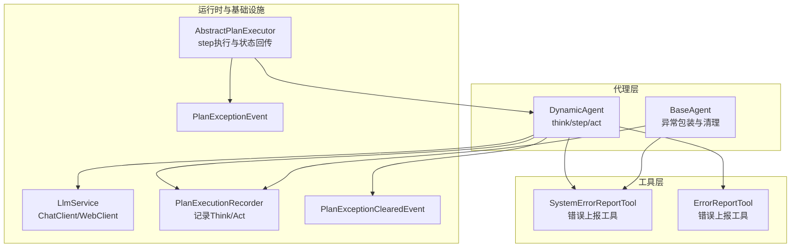
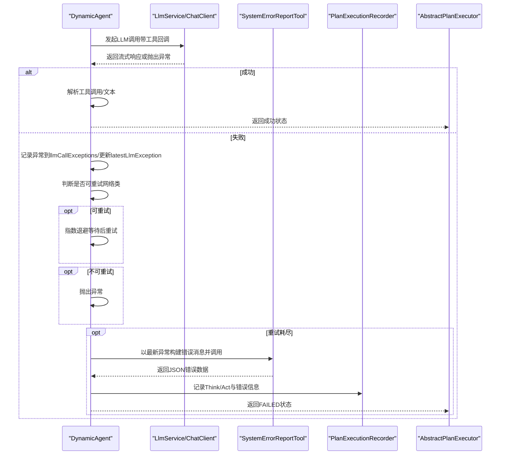
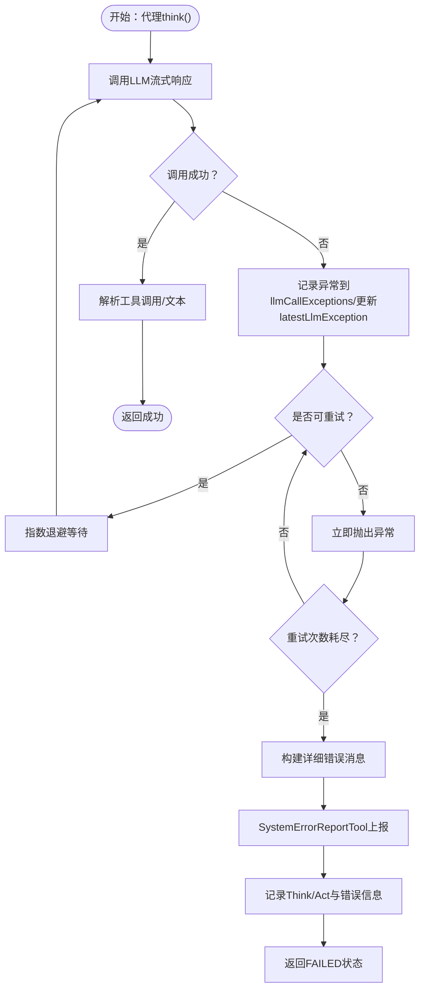
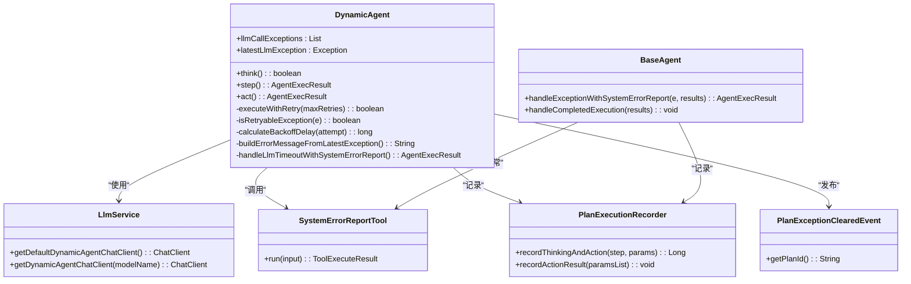

# LLM调用异常处理

<cite>
**本文引用的文件**
- [DynamicAgent.java](file://src/main/java/com/alibaba/cloud/ai/lynxe/agent/DynamicAgent.java)
- [BaseAgent.java](file://src/main/java/com/alibaba/cloud/ai/lynxe/agent/BaseAgent.java)
- [LlmService.java](file://src/main/java/com/alibaba/cloud/ai/lynxe/llm/LlmService.java)
- [SystemErrorReportTool.java](file://src/main/java/com/alibaba/cloud/ai/lynxe/tool/SystemErrorReportTool.java)
- [ErrorReportTool.java](file://src/main/java/com/alibaba/cloud/ai/lynxe/tool/ErrorReportTool.java)
- [PlanExecutionRecorder.java](file://src/main/java/com/alibaba/cloud/ai/lynxe/recorder/service/PlanExecutionRecorder.java)
- [PlanExceptionClearedEvent.java](file://src/main/java/com/alibaba/cloud/ai/lynxe/event/PlanExceptionClearedEvent.java)
- [PlanExceptionEvent.java](file://src/main/java/com/alibaba/cloud/ai/lynxe/event/PlanExceptionEvent.java)
- [AuthenticationException.java](file://src/main/java/com/alibaba/cloud/ai/lynxe/model/exception/AuthenticationException.java)
- [NetworkException.java](file://src/main/java/com/alibaba/cloud/ai/lynxe/model/exception/NetworkException.java)
- [RateLimitException.java](file://src/main/java/com/alibaba/cloud/ai/lynxe/model/exception/RateLimitException.java)
- [AbstractPlanExecutor.java](file://src/main/java/com/alibaba/cloud/ai/lynxe/runtime/executor/AbstractPlanExecutor.java)
</cite>

## 目录
1. [简介](#简介)
2. [项目结构与定位](#项目结构与定位)
3. [核心组件](#核心组件)
4. [架构总览](#架构总览)
5. [详细组件分析](#详细组件分析)
6. [依赖关系分析](#依赖关系分析)
7. [性能与可靠性考量](#性能与可靠性考量)
8. [故障排查指南](#故障排查指南)
9. [结论](#结论)

## 简介
本文件面向开发者与运维人员，系统化梳理本项目中LLM调用异常处理机制，重点覆盖以下方面：
- 在LLM调用失败后如何记录异常到llmCallExceptions列表与latestLlmException引用
- 异常处理流程中对可重试与不可重试异常的区分策略
- 在所有重试尝试失败后构建详细的错误消息（包含异常类型、消息内容、API响应体）
- 异常信息在代理执行流程中的传递路径与最终落盘方式
- 提供可直接定位到源码位置的参考路径，便于快速复现与调试

## 项目结构与定位
本机制主要位于代理层（DynamicAgent）与工具层（SystemErrorReportTool），并通过执行器（AbstractPlanExecutor）与记录器（PlanExecutionRecorder）完成异常状态的持久化与前端展示。

图表来源
- [DynamicAgent.java](file://src/main/java/com/alibaba/cloud/ai/lynxe/agent/DynamicAgent.java#L232-L604)
- [BaseAgent.java](file://src/main/java/com/alibaba/cloud/ai/lynxe/agent/BaseAgent.java#L353-L424)
- [LlmService.java](file://src/main/java/com/alibaba/cloud/ai/lynxe/llm/LlmService.java#L164-L201)
- [SystemErrorReportTool.java](file://src/main/java/com/alibaba/cloud/ai/lynxe/tool/SystemErrorReportTool.java#L101-L131)
- [PlanExecutionRecorder.java](file://src/main/java/com/alibaba/cloud/ai/lynxe/recorder/service/PlanExecutionRecorder.java#L82-L108)
- [PlanExceptionClearedEvent.java](file://src/main/java/com/alibaba/cloud/ai/lynxe/event/PlanExceptionClearedEvent.java#L1-L43)
- [AbstractPlanExecutor.java](file://src/main/java/com/alibaba/cloud/ai/lynxe/runtime/executor/AbstractPlanExecutor.java#L91-L132)

章节来源
- [DynamicAgent.java](file://src/main/java/com/alibaba/cloud/ai/lynxe/agent/DynamicAgent.java#L232-L604)
- [LlmService.java](file://src/main/java/com/alibaba/cloud/ai/lynxe/llm/LlmService.java#L164-L201)

## 核心组件
- 动态代理（DynamicAgent）：负责LLM调用、重试控制、异常记录与错误消息构建；在重试耗尽后通过SystemErrorReportTool模拟完整工具流并落盘。
- 基础代理（BaseAgent）：提供通用异常包装能力，将任意异常转为“系统错误”工具输出，确保执行记录与前端展示一致。
- LLM服务（LlmService）：统一管理ChatClient/WebClient，提供超时与DNS缓存增强配置，支撑代理层的网络请求。
- 错误上报工具（SystemErrorReportTool/ErrorReportTool）：将错误信息以JSON格式输出，供记录器与前端展示使用。
- 执行记录器（PlanExecutionRecorder）：记录思考与动作阶段（Think/Act），并将错误信息持久化。
- 事件（PlanExceptionClearedEvent/PlanExceptionEvent）：用于异常状态的事件化传播与清理。
- 运行时执行器（AbstractPlanExecutor）：将代理执行结果（含FAILED/INTERRUPTED/COMPLETED）回传给上层计划调度。

章节来源
- [DynamicAgent.java](file://src/main/java/com/alibaba/cloud/ai/lynxe/agent/DynamicAgent.java#L126-L134)
- [BaseAgent.java](file://src/main/java/com/alibaba/cloud/ai/lynxe/agent/BaseAgent.java#L353-L424)
- [LlmService.java](file://src/main/java/com/alibaba/cloud/ai/lynxe/llm/LlmService.java#L387-L449)
- [SystemErrorReportTool.java](file://src/main/java/com/alibaba/cloud/ai/lynxe/tool/SystemErrorReportTool.java#L101-L131)
- [PlanExecutionRecorder.java](file://src/main/java/com/alibaba/cloud/ai/lynxe/recorder/service/PlanExecutionRecorder.java#L82-L108)
- [PlanExceptionClearedEvent.java](file://src/main/java/com/alibaba/cloud/ai/lynxe/event/PlanExceptionClearedEvent.java#L1-L43)
- [AbstractPlanExecutor.java](file://src/main/java/com/alibaba/cloud/ai/lynxe/runtime/executor/AbstractPlanExecutor.java#L91-L132)

## 架构总览
下图展示了从代理层发起LLM调用，到异常被记录、错误消息构建、工具上报与最终落盘的全链路。

图表来源
- [DynamicAgent.java](file://src/main/java/com/alibaba/cloud/ai/lynxe/agent/DynamicAgent.java#L232-L604)
- [SystemErrorReportTool.java](file://src/main/java/com/alibaba/cloud/ai/lynxe/tool/SystemErrorReportTool.java#L101-L131)
- [PlanExecutionRecorder.java](file://src/main/java/com/alibaba/cloud/ai/lynxe/recorder/service/PlanExecutionRecorder.java#L82-L108)
- [AbstractPlanExecutor.java](file://src/main/java/com/alibaba/cloud/ai/lynxe/runtime/executor/AbstractPlanExecutor.java#L91-L132)

## 详细组件分析

### 动态代理（DynamicAgent）异常处理主流程
- 异常记录
  - 在每次尝试失败时，将异常同时写入llmCallExceptions列表与latestLlmException引用，确保后续可追溯。
  - 参考路径：[异常捕获与记录](file://src/main/java/com/alibaba/cloud/ai/lynxe/agent/DynamicAgent.java#L443-L473)
- 可重试与不可重试区分
  - 仅当异常消息包含特定关键词（如DNS解析失败、超时、连接异常等）时判定为可重试。
  - 参考路径：[可重试判断](file://src/main/java/com/alibaba/cloud/ai/lynxe/agent/DynamicAgent.java#L487-L499)
- 指数退避与中断检测
  - 使用指数退避延迟（最大上限）并在每次重试前检查中断信号。
  - 参考路径：[退避与中断](file://src/main/java/com/alibaba/cloud/ai/lynxe/agent/DynamicAgent.java#L501-L508)
- 重试耗尽后的错误消息构建
  - 构建包含异常类型、消息、总尝试次数，以及WebClientResponseException的响应体（若存在）的详细错误消息。
  - 参考路径：[错误消息构建](file://src/main/java/com/alibaba/cloud/ai/lynxe/agent/DynamicAgent.java#L572-L604)
- 重试耗尽后的工具上报与落盘
  - 调用SystemErrorReportTool生成JSON错误数据，再通过记录器记录Think/Act，最后返回FAILED状态。
  - 参考路径：[工具上报与落盘](file://src/main/java/com/alibaba/cloud/ai/lynxe/agent/DynamicAgent.java#L1140-L1196)

图表来源
- [DynamicAgent.java](file://src/main/java/com/alibaba/cloud/ai/lynxe/agent/DynamicAgent.java#L232-L604)
- [SystemErrorReportTool.java](file://src/main/java/com/alibaba/cloud/ai/lynxe/tool/SystemErrorReportTool.java#L101-L131)
- [PlanExecutionRecorder.java](file://src/main/java/com/alibaba/cloud/ai/lynxe/recorder/service/PlanExecutionRecorder.java#L82-L108)

章节来源
- [DynamicAgent.java](file://src/main/java/com/alibaba/cloud/ai/lynxe/agent/DynamicAgent.java#L232-L604)
- [DynamicAgent.java](file://src/main/java/com/alibaba/cloud/ai/lynxe/agent/DynamicAgent.java#L1140-L1196)

### 基础代理（BaseAgent）异常包装
- 将任意异常转换为“系统错误”工具输出，保证执行记录与前端展示一致性。
- 若解析工具输出失败，回退为原始异常消息。
- 参考路径：[异常包装与回退](file://src/main/java/com/alibaba/cloud/ai/lynxe/agent/BaseAgent.java#L353-L424)

章节来源
- [BaseAgent.java](file://src/main/java/com/alibaba/cloud/ai/lynxe/agent/BaseAgent.java#L353-L424)

### LLM服务（LlmService）网络与客户端
- 统一构建ChatClient/WebClient，支持DNS缓存与超时配置，减少网络抖动对LLM调用的影响。
- 参考路径：[客户端构建与增强](file://src/main/java/com/alibaba/cloud/ai/lynxe/llm/LlmService.java#L387-L449)

章节来源
- [LlmService.java](file://src/main/java/com/alibaba/cloud/ai/lynxe/llm/LlmService.java#L387-L449)

### 错误上报工具（SystemErrorReportTool/ErrorReportTool）
- 将错误消息封装为JSON字符串，包含时间戳与错误文本，便于前端展示与检索。
- 参考路径：[SystemErrorReportTool输出](file://src/main/java/com/alibaba/cloud/ai/lynxe/tool/SystemErrorReportTool.java#L101-L131)

章节来源
- [SystemErrorReportTool.java](file://src/main/java/com/alibaba/cloud/ai/lynxe/tool/SystemErrorReportTool.java#L101-L131)
- [ErrorReportTool.java](file://src/main/java/com/alibaba/cloud/ai/lynxe/tool/ErrorReportTool.java#L99-L128)

### 执行记录器（PlanExecutionRecorder）与事件
- 记录Think/Act阶段与错误信息，确保异常在执行记录中可见。
- 清理异常缓存事件（PlanExceptionClearedEvent）用于在重试成功时清除异常状态。
- 参考路径：[记录接口](file://src/main/java/com/alibaba/cloud/ai/lynxe/recorder/service/PlanExecutionRecorder.java#L82-L108)，[清理事件](file://src/main/java/com/alibaba/cloud/ai/lynxe/event/PlanExceptionClearedEvent.java#L1-L43)

章节来源
- [PlanExecutionRecorder.java](file://src/main/java/com/alibaba/cloud/ai/lynxe/recorder/service/PlanExecutionRecorder.java#L82-L108)
- [PlanExceptionClearedEvent.java](file://src/main/java/com/alibaba/cloud/ai/lynxe/event/PlanExceptionClearedEvent.java#L1-L43)

### 运行时执行器（AbstractPlanExecutor）的状态回传
- 将代理执行结果（FAILED/INTERRUPTED/COMPLETED）回传给上层，驱动计划级状态变更。
- 参考路径：[步骤执行与状态回传](file://src/main/java/com/alibaba/cloud/ai/lynxe/runtime/executor/AbstractPlanExecutor.java#L91-L132)

章节来源
- [AbstractPlanExecutor.java](file://src/main/java/com/alibaba/cloud/ai/lynxe/runtime/executor/AbstractPlanExecutor.java#L91-L132)

## 依赖关系分析
- DynamicAgent依赖LlmService进行LLM调用，依赖SystemErrorReportTool进行错误上报，依赖PlanExecutionRecorder进行记录，依赖PlanExceptionClearedEvent进行异常清理事件发布。
- BaseAgent提供通用异常包装能力，向上游代理与执行器提供一致的错误呈现。
- LlmService通过增强WebClient提升网络稳定性，降低因DNS与超时导致的异常概率。

图表来源
- [DynamicAgent.java](file://src/main/java/com/alibaba/cloud/ai/lynxe/agent/DynamicAgent.java#L126-L134)
- [DynamicAgent.java](file://src/main/java/com/alibaba/cloud/ai/lynxe/agent/DynamicAgent.java#L232-L604)
- [BaseAgent.java](file://src/main/java/com/alibaba/cloud/ai/lynxe/agent/BaseAgent.java#L353-L424)
- [LlmService.java](file://src/main/java/com/alibaba/cloud/ai/lynxe/llm/LlmService.java#L164-L201)
- [SystemErrorReportTool.java](file://src/main/java/com/alibaba/cloud/ai/lynxe/tool/SystemErrorReportTool.java#L101-L131)
- [PlanExecutionRecorder.java](file://src/main/java/com/alibaba/cloud/ai/lynxe/recorder/service/PlanExecutionRecorder.java#L82-L108)
- [PlanExceptionClearedEvent.java](file://src/main/java/com/alibaba/cloud/ai/lynxe/event/PlanExceptionClearedEvent.java#L1-L43)

## 性能与可靠性考量
- 指数退避：避免频繁重试放大下游压力，最大延迟限制防止雪崩。
- 中断检测：在每次重试前检查中断信号，保障用户可控性。
- 早期终止阈值：当模型持续仅返回文本而不调用工具时，触发失败保护，避免无限循环。
- 记忆压缩：检测重复结果后强制压缩对话记忆，缓解上下文膨胀风险。
- 网络增强：DNS缓存与超时配置降低网络抖动影响。

章节来源
- [DynamicAgent.java](file://src/main/java/com/alibaba/cloud/ai/lynxe/agent/DynamicAgent.java#L501-L508)
- [DynamicAgent.java](file://src/main/java/com/alibaba/cloud/ai/lynxe/agent/DynamicAgent.java#L387-L399)
- [DynamicAgent.java](file://src/main/java/com/alibaba/cloud/ai/lynxe/agent/DynamicAgent.java#L1224-L1271)
- [LlmService.java](file://src/main/java/com/alibaba/cloud/ai/lynxe/llm/LlmService.java#L387-L449)

## 故障排查指南
- 如何查看已记录的异常
  - 获取llmCallExceptions列表与latestLlmException引用，用于诊断重试历史与最后一次异常详情。
  - 参考路径：[异常列表与引用](file://src/main/java/com/alibaba/cloud/ai/lynxe/agent/DynamicAgent.java#L126-L134)
- 如何确认是否为可重试异常
  - 查看异常消息是否包含网络相关关键词（DNS解析、超时、连接等）。
  - 参考路径：[可重试判断](file://src/main/java/com/alibaba/cloud/ai/lynxe/agent/DynamicAgent.java#L487-L499)
- 如何验证错误消息构建
  - 检查最新异常类型、消息与总尝试次数；若为WebClientResponseException，应包含API响应体。
  - 参考路径：[错误消息构建](file://src/main/java/com/alibaba/cloud/ai/lynxe/agent/DynamicAgent.java#L572-L604)
- 如何确认异常已被正确上报与落盘
  - 检查PlanExecutionRecorder是否记录了Think/Act与错误信息；确认SystemErrorReportTool输出的JSON中包含错误文本与时间戳。
  - 参考路径：[记录接口](file://src/main/java/com/alibaba/cloud/ai/lynxe/recorder/service/PlanExecutionRecorder.java#L82-L108)，[工具输出](file://src/main/java/com/alibaba/cloud/ai/lynxe/tool/SystemErrorReportTool.java#L101-L131)
- 如何判断重试是否生效
  - 观察PlanExceptionClearedEvent是否在重试成功后被发布，以确认异常缓存被清理。
  - 参考路径：[清理事件](file://src/main/java/com/alibaba/cloud/ai/lynxe/event/PlanExceptionClearedEvent.java#L1-L43)
- 如何定位模型未调用工具的问题
  - 关注早期终止阈值触发逻辑，必要时调整提示词或模型参数，确保模型必须调用工具。
  - 参考路径：[早期终止保护](file://src/main/java/com/alibaba/cloud/ai/lynxe/agent/DynamicAgent.java#L387-L399)

章节来源
- [DynamicAgent.java](file://src/main/java/com/alibaba/cloud/ai/lynxe/agent/DynamicAgent.java#L126-L134)
- [DynamicAgent.java](file://src/main/java/com/alibaba/cloud/ai/lynxe/agent/DynamicAgent.java#L487-L499)
- [DynamicAgent.java](file://src/main/java/com/alibaba/cloud/ai/lynxe/agent/DynamicAgent.java#L572-L604)
- [PlanExecutionRecorder.java](file://src/main/java/com/alibaba/cloud/ai/lynxe/recorder/service/PlanExecutionRecorder.java#L82-L108)
- [SystemErrorReportTool.java](file://src/main/java/com/alibaba/cloud/ai/lynxe/tool/SystemErrorReportTool.java#L101-L131)
- [PlanExceptionClearedEvent.java](file://src/main/java/com/alibaba/cloud/ai/lynxe/event/PlanExceptionClearedEvent.java#L1-L43)

## 结论
本机制通过“异常记录—可重试判定—指数退避—错误消息构建—工具上报—记录落盘”的闭环，实现了对LLM调用失败的稳健处理。开发者可依据本文提供的路径快速定位问题，并结合事件与记录器实现异常监控与诊断。建议在生产环境中配合日志与指标系统，持续观察重试率、早期终止触发率与错误消息构成，以优化模型提示与网络配置。