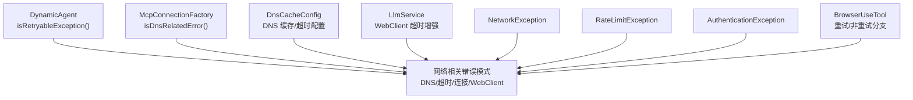
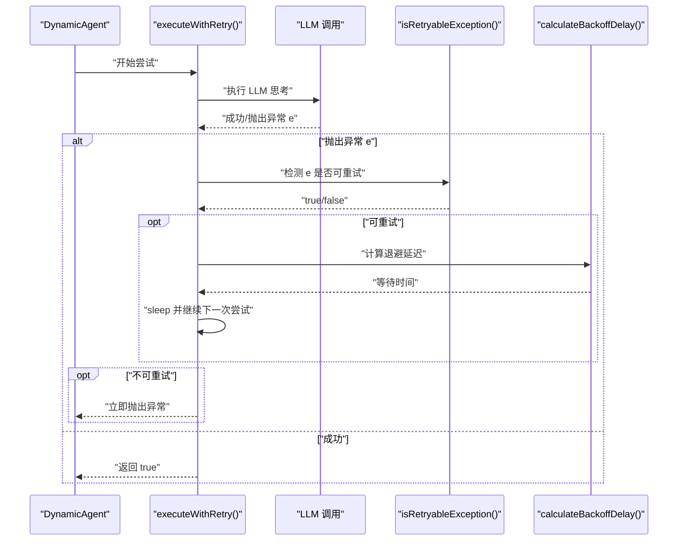
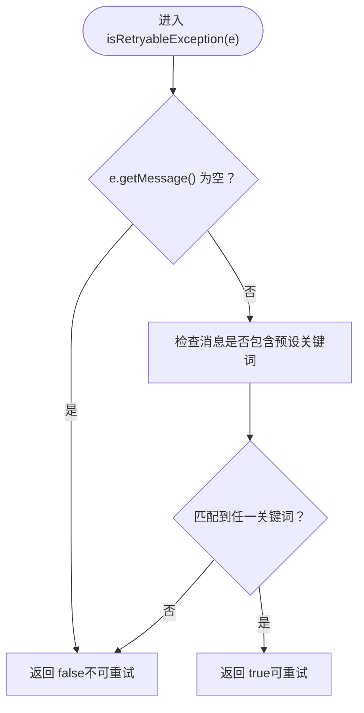
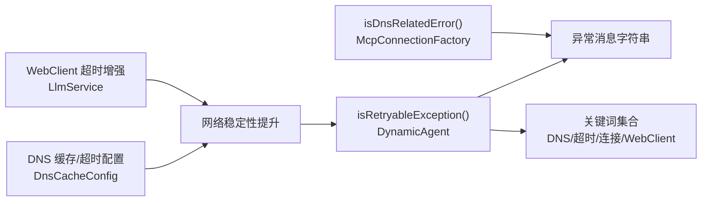

# 可重试异常检测

<cite>
**本文引用的文件**
- [DynamicAgent.java](file://src/main/java/com/alibaba/cloud/ai/lynxe/agent/DynamicAgent.java)
- [McpConnectionFactory.java](file://src/main/java/com/alibaba/cloud/ai/lynxe/mcp/service/McpConnectionFactory.java)
- [DnsCacheConfig.java](file://src/main/java/com/alibaba/cloud/ai/lynxe/config/DnsCacheConfig.java)
- [LlmService.java](file://src/main/java/com/alibaba/cloud/ai/lynxe/llm/LlmService.java)
- [NetworkException.java](file://src/main/java/com/alibaba/cloud/ai/lynxe/model/exception/NetworkException.java)
- [RateLimitException.java](file://src/main/java/com/alibaba/cloud/ai/lynxe/model/exception/RateLimitException.java)
- [AuthenticationException.java](file://src/main/java/com/alibaba/cloud/ai/lynxe/model/exception/AuthenticationException.java)
- [BrowserUseTool.java](file://src/main/java/com/alibaba/cloud/ai/lynxe/tool/browser/BrowserUseTool.java)
</cite>

## 目录
1. [简介](#简介)
2. [项目结构](#项目结构)
3. [核心组件](#核心组件)
4. [架构总览](#架构总览)
5. [详细组件分析](#详细组件分析)
6. [依赖关系分析](#依赖关系分析)
7. [性能考量](#性能考量)
8. [故障排查指南](#故障排查指南)
9. [结论](#结论)
10. [附录：扩展与最佳实践](#附录扩展与最佳实践)

## 简介
本文件聚焦于系统中的“可重试异常检测”机制，围绕 DynamicAgent 中的 isRetryableException() 方法展开，系统性说明其工作原理、判定策略、边界条件（如空消息）、以及与网络相关错误类型的匹配范围（DNS 解析失败、超时、连接问题等）。同时提供扩展指导，帮助开发者在不破坏现有行为的前提下，安全地增加新的可重试错误模式或自定义判断规则。

## 项目结构
与可重试异常检测直接相关的核心位置：
- 动态代理思考流程与重试控制：DynamicAgent.java
- DNS 相关错误识别与网络配置：McpConnectionFactory.java、DnsCacheConfig.java、LlmService.java
- 异常模型：NetworkException.java、RateLimitException.java、AuthenticationException.java
- 工具层重试策略示例：BrowserUseTool.java

图表来源
- [DynamicAgent.java](file://src/main/java/com/alibaba/cloud/ai/lynxe/agent/DynamicAgent.java#L488-L508)
- [McpConnectionFactory.java](file://src/main/java/com/alibaba/cloud/ai/lynxe/mcp/service/McpConnectionFactory.java#L194-L205)
- [DnsCacheConfig.java](file://src/main/java/com/alibaba/cloud/ai/lynxe/config/DnsCacheConfig.java#L64-L96)
- [LlmService.java](file://src/main/java/com/alibaba/cloud/ai/lynxe/llm/LlmService.java#L387-L409)
- [NetworkException.java](file://src/main/java/com/alibaba/cloud/ai/lynxe/model/exception/NetworkException.java#L1-L32)
- [RateLimitException.java](file://src/main/java/com/alibaba/cloud/ai/lynxe/model/exception/RateLimitException.java#L1-L32)
- [AuthenticationException.java](file://src/main/java/com/alibaba/cloud/ai/lynxe/model/exception/AuthenticationException.java#L1-L32)
- [BrowserUseTool.java](file://src/main/java/com/alibaba/cloud/ai/lynxe/tool/browser/BrowserUseTool.java#L320-L359)

章节来源
- [DynamicAgent.java](file://src/main/java/com/alibaba/cloud/ai/lynxe/agent/DynamicAgent.java#L488-L508)
- [McpConnectionFactory.java](file://src/main/java/com/alibaba/cloud/ai/lynxe/mcp/service/McpConnectionFactory.java#L194-L205)
- [DnsCacheConfig.java](file://src/main/java/com/alibaba/cloud/ai/lynxe/config/DnsCacheConfig.java#L64-L96)
- [LlmService.java](file://src/main/java/com/alibaba/cloud/ai/lynxe/llm/LlmService.java#L387-L409)

## 核心组件
- DynamicAgent 的 isRetryableException()：基于异常消息字符串包含性匹配，判定是否为网络相关错误（DNS、超时、连接、WebClient 请求异常等），并返回布尔值用于决定是否重试。
- DynamicAgent 的 executeWithRetry()：在 LLM 思考阶段对异常进行捕获与重试控制，结合指数退避延迟，达到最大重试次数后记录最新异常并交由上层 step() 处理。
- McpConnectionFactory 的 isDnsRelatedError()：与 isRetryableException() 类似的 DNS 相关错误识别，但更严格地覆盖了多种 DNS 异常类型，用于 MCP 连接初始化场景。
- DnsCacheConfig 与 LlmService：通过 DNS 缓存与超时配置降低 DNS 解析失败与网络超时的概率，间接提升 isRetryableException() 的命中率与整体稳定性。

章节来源
- [DynamicAgent.java](file://src/main/java/com/alibaba/cloud/ai/lynxe/agent/DynamicAgent.java#L452-L475)
- [DynamicAgent.java](file://src/main/java/com/alibaba/cloud/ai/lynxe/agent/DynamicAgent.java#L488-L508)
- [McpConnectionFactory.java](file://src/main/java/com/alibaba/cloud/ai/lynxe/mcp/service/McpConnectionFactory.java#L194-L205)
- [DnsCacheConfig.java](file://src/main/java/com/alibaba/cloud/ai/lynxe/config/DnsCacheConfig.java#L64-L96)
- [LlmService.java](file://src/main/java/com/alibaba/cloud/ai/lynxe/llm/LlmService.java#L387-L409)

## 架构总览
下图展示了异常检测在动态代理思考流程中的位置与调用链：

图表来源
- [DynamicAgent.java](file://src/main/java/com/alibaba/cloud/ai/lynxe/agent/DynamicAgent.java#L452-L475)
- [DynamicAgent.java](file://src/main/java/com/alibaba/cloud/ai/lynxe/agent/DynamicAgent.java#L488-L508)

## 详细组件分析

### isRetryableException() 方法详解
- 输入：任意 Exception 实例
- 输出：布尔值，指示该异常是否应被重试
- 判定逻辑：
  - 若异常消息为空，则直接返回 false（避免空指针与误判）
  - 否则，若异常消息包含以下关键词之一，则判定为可重试：
    - “Failed to resolve”（DNS 解析失败）
    - “timeout”（超时）
    - “connection”（连接问题）
    - “DNS”（DNS 相关）
    - “WebClientRequestException”（WebClient 请求异常）
    - “DnsNameResolverTimeoutException”（DNS 名称解析超时）
- 作用域：仅基于异常消息字符串的包含性匹配，不依赖异常类型本身；因此对第三方库抛出的异常同样适用。

图表来源
- [DynamicAgent.java](file://src/main/java/com/alibaba/cloud/ai/lynxe/agent/DynamicAgent.java#L488-L508)

章节来源
- [DynamicAgent.java](file://src/main/java/com/alibaba/cloud/ai/lynxe/agent/DynamicAgent.java#L488-L508)

### 网络相关错误类型与匹配范围
- DNS 解析失败
  - 关键词：Failed to resolve、DnsNameResolverTimeoutException、SearchDomainUnknownHostException、UnknownHostException、dns（大小写不敏感）
  - 来源：McpConnectionFactory 的 isDnsRelatedError() 与 DnsCacheConfig 的 DNS 缓存与超时设置
- 超时
  - 关键词：timeout（通用超时）
  - 来源：LlmService 对 WebClient 的超时增强（默认 10 分钟）
- 连接问题
  - 关键词：connection（连接异常）
- WebClient 请求异常
  - 关键词：WebClientRequestException（WebClient 请求异常）

章节来源
- [McpConnectionFactory.java](file://src/main/java/com/alibaba/cloud/ai/lynxe/mcp/service/McpConnectionFactory.java#L194-L205)
- [DnsCacheConfig.java](file://src/main/java/com/alibaba/cloud/ai/lynxe/config/DnsCacheConfig.java#L64-L96)
- [LlmService.java](file://src/main/java/com/alibaba/cloud/ai/lynxe/llm/LlmService.java#L387-L409)
- [DynamicAgent.java](file://src/main/java/com/alibaba/cloud/ai/lynxe/agent/DynamicAgent.java#L488-L508)

### 空异常消息的边界情况
- 当异常消息为 null 时，isRetryableException() 直接返回 false，避免误判与潜在的空指针风险。
- 建议：在上游捕获异常时尽量保留有意义的消息文本，以便 isRetryableException() 正确识别。

章节来源
- [DynamicAgent.java](file://src/main/java/com/alibaba/cloud/ai/lynxe/agent/DynamicAgent.java#L490-L494)

### 为什么某些异常类型被认定为可重试，而其他类型不是
- 可重试：网络瞬时故障（DNS 解析失败、超时、连接中断、WebClient 请求异常）通常具备可恢复性，通过重试与指数退避可显著提升成功率。
- 不可重试：运行时异常（如工具层的 RuntimeException）与受检异常（Checked Exception）在当前实现中不进行重试，以避免重复执行无意义或可能产生副作用的操作。
- 特殊说明：RateLimitException 与 AuthenticationException 属于业务层面的限流与鉴权错误，当前 isRetryableException() 未将其纳入网络相关错误集合，因此不会被自动判定为可重试。这类错误更适合通过上层策略（如退避、降级、提示用户）处理。

章节来源
- [BrowserUseTool.java](file://src/main/java/com/alibaba/cloud/ai/lynxe/tool/browser/BrowserUseTool.java#L326-L335)
- [DynamicAgent.java](file://src/main/java/com/alibaba/cloud/ai/lynxe/agent/DynamicAgent.java#L488-L508)
- [RateLimitException.java](file://src/main/java/com/alibaba/cloud/ai/lynxe/model/exception/RateLimitException.java#L1-L32)
- [AuthenticationException.java](file://src/main/java/com/alibaba/cloud/ai/lynxe/model/exception/AuthenticationException.java#L1-L32)

### 可重试异常检测的代码示例（路径引用）
以下为与 isRetryableException() 使用相关的调用路径与上下文，便于定位与验证行为：
- 在 LLM 思考过程中捕获异常并调用 isRetryableException() 判断是否重试：
  - [DynamicAgent.java](file://src/main/java/com/alibaba/cloud/ai/lynxe/agent/DynamicAgent.java#L452-L475)
- isRetryableException() 定义与实现：
  - [DynamicAgent.java](file://src/main/java/com/alibaba/cloud/ai/lynxe/agent/DynamicAgent.java#L488-L508)
- 指数退避延迟计算：
  - [DynamicAgent.java](file://src/main/java/com/alibaba/cloud/ai/lynxe/agent/DynamicAgent.java#L504-L508)
- 工具层重试/非重试分支示例（对比理解）：
  - [BrowserUseTool.java](file://src/main/java/com/alibaba/cloud/ai/lynxe/tool/browser/BrowserUseTool.java#L320-L359)

章节来源
- [DynamicAgent.java](file://src/main/java/com/alibaba/cloud/ai/lynxe/agent/DynamicAgent.java#L452-L508)
- [BrowserUseTool.java](file://src/main/java/com/alibaba/cloud/ai/lynxe/tool/browser/BrowserUseTool.java#L320-L359)

## 依赖关系分析
- isRetryableException() 依赖异常消息字符串的包含性匹配，不依赖具体异常类型，因此具备良好的兼容性。
- 与 DNS 相关的错误识别在多个组件中体现：
  - McpConnectionFactory 的 isDnsRelatedError() 提供更严格的 DNS 错误识别
  - DnsCacheConfig 与 LlmService 通过 DNS 缓存与超时配置降低 DNS/超时类错误发生概率
- 与工具层重试策略形成互补：工具层对 RuntimeException 与 Checked Exception 的处理方式与 isRetryableException() 的网络错误判定共同构成完整的异常处理闭环。

图表来源
- [DynamicAgent.java](file://src/main/java/com/alibaba/cloud/ai/lynxe/agent/DynamicAgent.java#L488-L508)
- [McpConnectionFactory.java](file://src/main/java/com/alibaba/cloud/ai/lynxe/mcp/service/McpConnectionFactory.java#L194-L205)
- [DnsCacheConfig.java](file://src/main/java/com/alibaba/cloud/ai/lynxe/config/DnsCacheConfig.java#L64-L96)
- [LlmService.java](file://src/main/java/com/alibaba/cloud/ai/lynxe/llm/LlmService.java#L387-L409)

章节来源
- [DynamicAgent.java](file://src/main/java/com/alibaba/cloud/ai/lynxe/agent/DynamicAgent.java#L488-L508)
- [McpConnectionFactory.java](file://src/main/java/com/alibaba/cloud/ai/lynxe/mcp/service/McpConnectionFactory.java#L194-L205)
- [DnsCacheConfig.java](file://src/main/java/com/alibaba/cloud/ai/lynxe/config/DnsCacheConfig.java#L64-L96)
- [LlmService.java](file://src/main/java/com/alibaba/cloud/ai/lynxe/llm/LlmService.java#L387-L409)

## 性能考量
- 指数退避：每次重试等待时间为 2^(attempt-1) × 2 秒，上限 60 秒，有助于缓解瞬时网络压力。
- 最大重试次数：当前在 think() 中固定为 3 次，避免无限重试导致资源占用。
- DNS 缓存与超时：通过 DnsCacheConfig 与 LlmService 的 WebClient 配置减少 DNS 解析失败与超时概率，间接降低 isRetryableException() 的触发频率。

章节来源
- [DynamicAgent.java](file://src/main/java/com/alibaba/cloud/ai/lynxe/agent/DynamicAgent.java#L504-L508)
- [DnsCacheConfig.java](file://src/main/java/com/alibaba/cloud/ai/lynxe/config/DnsCacheConfig.java#L64-L96)
- [LlmService.java](file://src/main/java/com/alibaba/cloud/ai/lynxe/llm/LlmService.java#L387-L409)

## 故障排查指南
- 现象：异常未被判定为可重试
  - 排查要点：
    - 异常消息是否为空（null）——若是，将直接返回 false
    - 异常消息是否包含关键词集合（DNS/超时/连接/WebClient）
    - 是否属于工具层 RuntimeException 或 Checked Exception（当前不重试）
  - 参考路径：
    - [DynamicAgent.java](file://src/main/java/com/alibaba/cloud/ai/lynxe/agent/DynamicAgent.java#L488-L508)
    - [BrowserUseTool.java](file://src/main/java/com/alibaba/cloud/ai/lynxe/tool/browser/BrowserUseTool.java#L326-L335)
- 现象：DNS 解析失败频繁
  - 建议：
    - 检查 DNS 缓存与超时配置是否生效
    - 使用 isDnsRelatedError() 的识别逻辑辅助定位
  - 参考路径：
    - [McpConnectionFactory.java](file://src/main/java/com/alibaba/cloud/ai/lynxe/mcp/service/McpConnectionFactory.java#L194-L205)
    - [DnsCacheConfig.java](file://src/main/java/com/alibaba/cloud/ai/lynxe/config/DnsCacheConfig.java#L64-L96)
- 现象：超时频繁
  - 建议：
    - 检查 LlmService 的 WebClient 超时配置
    - 结合指数退避策略评估是否需要调整最大重试次数
  - 参考路径：
    - [LlmService.java](file://src/main/java/com/alibaba/cloud/ai/lynxe/llm/LlmService.java#L387-L409)
    - [DynamicAgent.java](file://src/main/java/com/alibaba/cloud/ai/lynxe/agent/DynamicAgent.java#L504-L508)

章节来源
- [DynamicAgent.java](file://src/main/java/com/alibaba/cloud/ai/lynxe/agent/DynamicAgent.java#L488-L508)
- [BrowserUseTool.java](file://src/main/java/com/alibaba/cloud/ai/lynxe/tool/browser/BrowserUseTool.java#L326-L335)
- [McpConnectionFactory.java](file://src/main/java/com/alibaba/cloud/ai/lynxe/mcp/service/McpConnectionFactory.java#L194-L205)
- [DnsCacheConfig.java](file://src/main/java/com/alibaba/cloud/ai/lynxe/config/DnsCacheConfig.java#L64-L96)
- [LlmService.java](file://src/main/java/com/alibaba/cloud/ai/lynxe/llm/LlmService.java#L387-L409)

## 结论
isRetryableException() 通过异常消息的包含性匹配，将 DNS 解析失败、超时、连接问题、WebClient 请求异常等网络相关错误识别为可重试，配合指数退避与最大重试次数，有效提升了系统的鲁棒性。对于非网络类错误（如工具层 RuntimeException/Checked Exception）与业务类错误（限流、鉴权），当前实现采用不重试策略，建议通过上层策略处理。通过 DNS 缓存与超时配置，可进一步降低网络错误的发生概率。

## 附录：扩展与最佳实践
- 扩展可重试错误模式
  - 在保持“基于消息包含性匹配”的前提下，可在 isRetryableException() 中新增关键词，确保与现有 DNS/超时/连接/WebClient 的语义一致。
  - 新增前建议：
    - 明确错误语义是否属于“瞬时网络错误”
    - 验证异常消息文本是否稳定且可预期
    - 评估对最大重试次数与退避策略的影响
  - 参考路径：
    - [DynamicAgent.java](file://src/main/java/com/alibaba/cloud/ai/lynxe/agent/DynamicAgent.java#L488-L508)
- 自定义异常判断规则
  - 若需基于异常类型或更复杂的上下文判断，可在 isRetryableException() 内部加入类型检查与上下文提取逻辑，但需注意：
    - 保持与现有 DNS/超时/连接/WebClient 逻辑的兼容
    - 优先通过消息关键字保证跨库一致性
- 与 DNS/超时配置协同
  - 通过 DnsCacheConfig 与 LlmService 的 WebClient 配置降低 DNS/超时类错误发生概率，从而减少 isRetryableException() 的触发频率。
  - 参考路径：
    - [DnsCacheConfig.java](file://src/main/java/com/alibaba/cloud/ai/lynxe/config/DnsCacheConfig.java#L64-L96)
    - [LlmService.java](file://src/main/java/com/alibaba/cloud/ai/lynxe/llm/LlmService.java#L387-L409)
- 与工具层重试策略协作
  - 工具层对 RuntimeException/Checked Exception 的处理与 isRetryableException() 的网络错误判定共同构成完整的异常处理闭环，避免重复执行与副作用。
  - 参考路径：
    - [BrowserUseTool.java](file://src/main/java/com/alibaba/cloud/ai/lynxe/tool/browser/BrowserUseTool.java#L320-L359)