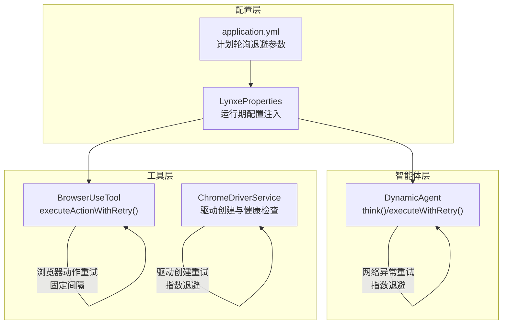
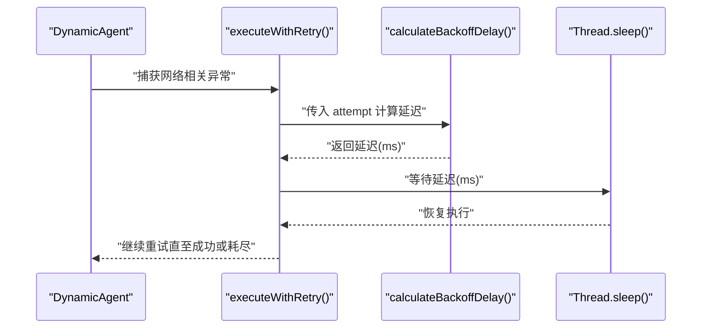
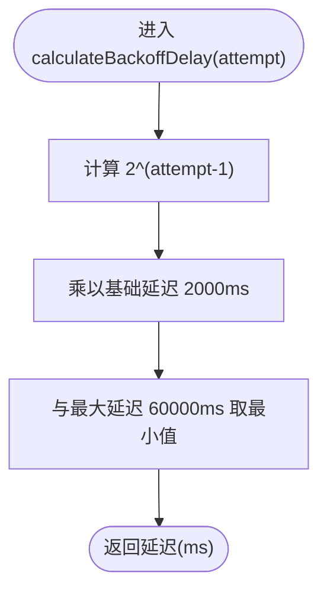
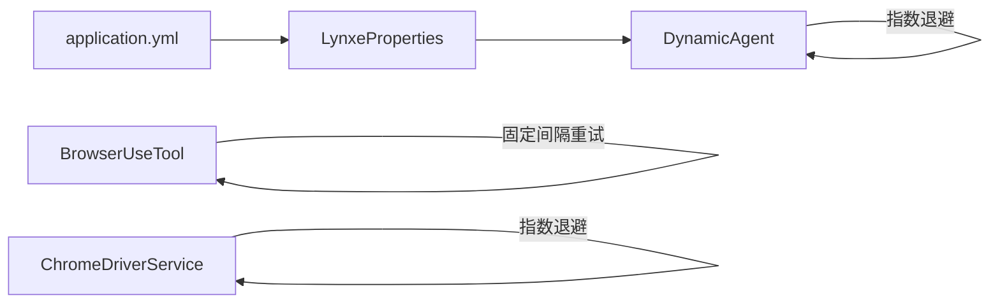

# 指数退避策略

<cite>
**本文引用的文件列表**
- [DynamicAgent.java](file://src/main/java/com/alibaba/cloud/ai/lynxe/agent/DynamicAgent.java)
- [BrowserUseTool.java](file://src/main/java/com/alibaba/cloud/ai/lynxe/tool/browser/BrowserUseTool.java)
- [ChromeDriverService.java](file://src/main/java/com/alibaba/cloud/ai/lynxe/tool/browser/ChromeDriverService.java)
- [application.yml](file://src/main/resources/application.yml)
- [LynxeProperties.java](file://src/main/java/com/alibaba/cloud/ai/lynxe/config/LynxeProperties.java)
</cite>

## 目录
1. [简介](#简介)
2. [项目结构与定位](#项目结构与定位)
3. [核心组件与职责](#核心组件与职责)
4. [架构总览](#架构总览)
5. [详细组件分析](#详细组件分析)
6. [依赖关系分析](#依赖关系分析)
7. [性能与资源特性](#性能与资源特性)
8. [故障排查指南](#故障排查指南)
9. [结论](#结论)
10. [附录：调整与最佳实践](#附录调整与最佳实践)

## 简介
本文件系统性梳理并讲解项目中的指数退避策略，重点围绕 DynamicAgent 中的 calculateBackoffDelay() 方法展开，解释其指数增长公式 2^attempt × 基础延迟、最大延迟限制、位移运算优化，以及为何采用指数退避而非固定间隔重试。同时提供不同尝试次数下的延迟对照表，并给出可调整的参数建议与最佳实践，帮助开发者在不同场景下安全、可控地应用该策略。

## 项目结构与定位
- 指数退避策略主要出现在智能体执行链路中，用于对网络类异常进行带退避的重试，避免雪崩式重试导致服务端压力持续放大。
- 该策略与浏览器工具链路中的固定间隔重试形成对比，体现不同模块针对不同风险面采取差异化退避策略。

图表来源
- [DynamicAgent.java](file://src/main/java/com/alibaba/cloud/ai/lynxe/agent/DynamicAgent.java#L452-L466)
- [BrowserUseTool.java](file://src/main/java/com/alibaba/cloud/ai/lynxe/tool/browser/BrowserUseTool.java#L296-L349)
- [ChromeDriverService.java](file://src/main/java/com/alibaba/cloud/ai/lynxe/tool/browser/ChromeDriverService.java#L270-L279)
- [application.yml](file://src/main/resources/application.yml#L70-L78)
- [LynxeProperties.java](file://src/main/java/com/alibaba/cloud/ai/lynxe/config/LynxeProperties.java#L1-L552)

章节来源
- [DynamicAgent.java](file://src/main/java/com/alibaba/cloud/ai/lynxe/agent/DynamicAgent.java#L452-L466)
- [BrowserUseTool.java](file://src/main/java/com/alibaba/cloud/ai/lynxe/tool/browser/BrowserUseTool.java#L296-L349)
- [ChromeDriverService.java](file://src/main/java/com/alibaba/cloud/ai/lynxe/tool/browser/ChromeDriverService.java#L270-L279)
- [application.yml](file://src/main/resources/application.yml#L70-L78)
- [LynxeProperties.java](file://src/main/java/com/alibaba/cloud/ai/lynxe/config/LynxeProperties.java#L1-L552)

## 核心组件与职责
- DynamicAgent：负责 LLM 思考阶段的重试与指数退避，通过 calculateBackoffDelay() 计算每次重试的等待时间；仅在网络相关异常时触发重试。
- BrowserUseTool：负责浏览器动作的重试，采用固定间隔重试策略，不使用指数退避。
- ChromeDriverService：负责浏览器驱动创建与健康检查，内部使用指数退避策略逐步增大等待时间，避免频繁失败导致资源浪费。
- application.yml：提供计划轮询的指数退避基础延迟与最大延迟配置，供通用轮询逻辑使用。
- LynxeProperties：将配置注入到运行时，便于按需覆盖默认值。

章节来源
- [DynamicAgent.java](file://src/main/java/com/alibaba/cloud/ai/lynxe/agent/DynamicAgent.java#L452-L466)
- [BrowserUseTool.java](file://src/main/java/com/alibaba/cloud/ai/lynxe/tool/browser/BrowserUseTool.java#L296-L349)
- [ChromeDriverService.java](file://src/main/java/com/alibaba/cloud/ai/lynxe/tool/browser/ChromeDriverService.java#L270-L279)
- [application.yml](file://src/main/resources/application.yml#L70-L78)
- [LynxeProperties.java](file://src/main/java/com/alibaba/cloud/ai/lynxe/config/LynxeProperties.java#L1-L552)

## 架构总览
指数退避策略在不同模块的落地方式如下：
- 智能体 LLM 思考阶段：根据网络异常类型动态计算退避延迟，避免集中重试造成下游压力。
- 浏览器动作执行：对超时等可重试异常采用固定间隔重试，降低复杂度。
- 浏览器驱动创建：对初始化失败采用指数退避，逐步降低失败概率并释放资源。

图表来源
- [DynamicAgent.java](file://src/main/java/com/alibaba/cloud/ai/lynxe/agent/DynamicAgent.java#L452-L466)
- [DynamicAgent.java](file://src/main/java/com/alibaba/cloud/ai/lynxe/agent/DynamicAgent.java#L504-L508)

## 详细组件分析

### DynamicAgent 中的指数退避实现
- 计算入口：calculateBackoffDelay(int attempt)
- 公式要点：
  - 指数增长：2^(attempt - 1) × 基础延迟
  - 基础延迟：2000ms（见注释说明）
  - 最大延迟：60000ms（1分钟）
- 适用条件：仅当异常属于“网络相关”时才触发重试与退避。
- 实现位置参考：
  - [calculateBackoffDelay() 定义](file://src/main/java/com/alibaba/cloud/ai/lynxe/agent/DynamicAgent.java#L504-L508)
  - [isRetryableException() 判定网络相关异常](file://src/main/java/com/alibaba/cloud/ai/lynxe/agent/DynamicAgent.java#L490-L499)
  - [executeWithRetry() 中调用与等待](file://src/main/java/com/alibaba/cloud/ai/lynxe/agent/DynamicAgent.java#L452-L466)

图表来源
- [DynamicAgent.java](file://src/main/java/com/alibaba/cloud/ai/lynxe/agent/DynamicAgent.java#L504-L508)

章节来源
- [DynamicAgent.java](file://src/main/java/com/alibaba/cloud/ai/lynxe/agent/DynamicAgent.java#L452-L466)
- [DynamicAgent.java](file://src/main/java/com/alibaba/cloud/ai/lynxe/agent/DynamicAgent.java#L490-L499)
- [DynamicAgent.java](file://src/main/java/com/alibaba/cloud/ai/lynxe/agent/DynamicAgent.java#L504-L508)

### 为什么采用指数退避而非固定间隔重试？
- 指数退避的优势：
  - 平滑缓解瞬时高峰：首次失败快速重试，随后逐步延长间隔，避免集中重试冲击下游。
  - 自适应恢复：当服务端压力缓解后，延迟逐步减小，提升吞吐。
  - 防止无限循环：配合最大重试次数与最大延迟上限，避免长时间占用资源。
- 固定间隔重试的局限：
  - 在高并发场景下容易引发“重试风暴”，放大抖动。
  - 对于偶发性故障，固定间隔可能过短或过长，无法自适应。

章节来源
- [DynamicAgent.java](file://src/main/java/com/alibaba/cloud/ai/lynxe/agent/DynamicAgent.java#L452-L466)
- [DynamicAgent.java](file://src/main/java/com/alibaba/cloud/ai/lynxe/agent/DynamicAgent.java#L490-L499)
- [DynamicAgent.java](file://src/main/java/com/alibaba/cloud/ai/lynxe/agent/DynamicAgent.java#L504-L508)

### 位移运算优化说明
- 实现中使用位移运算 1L << (attempt - 1) 替代 Math.pow(2, attempt - 1)，以获得更高效的整数幂计算。
- 位移运算优势：
  - 位移是 CPU 原生指令，速度远快于浮点幂运算。
  - 在 Java 中，左移一位相当于乘以 2，左移 n 位相当于乘以 2^n。
- 注意事项：
  - 位移结果仍需与最大延迟进行比较，确保不会超过上限。

章节来源
- [DynamicAgent.java](file://src/main/java/com/alibaba/cloud/ai/lynxe/agent/DynamicAgent.java#L504-L508)

### 不同尝试次数下的延迟对照（基于 2^attempt × 2000ms，上限 60000ms）
- 尝试次数 1：2^0 × 2000 = 1 × 2000 = 2000ms
- 尝试次数 2：2^1 × 2000 = 2 × 2000 = 4000ms
- 尝试次数 3：2^2 × 2000 = 4 × 2000 = 8000ms
- 尝试次数 4：2^3 × 2000 = 8 × 2000 = 16000ms
- 尝试次数 5：2^4 × 2000 = 16 × 2000 = 32000ms
- 尝试次数 6：2^5 × 2000 = 32 × 2000 = 64000ms → 上限 60000ms
- 尝试次数 7：2^6 × 2000 = 64 × 2000 = 128000ms → 上限 60000ms
- ……后续均被上限截断为 60000ms

章节来源
- [DynamicAgent.java](file://src/main/java/com/alibaba/cloud/ai/lynxe/agent/DynamicAgent.java#L504-L508)

### 浏览器动作重试（固定间隔）
- BrowserUseTool 使用固定间隔 1000ms 进行最多 2 次重试，适用于浏览器动作的超时或可重试异常。
- 与指数退避的区别：简单稳定，适合对时延敏感且失败概率较低的动作。

章节来源
- [BrowserUseTool.java](file://src/main/java/com/alibaba/cloud/ai/lynxe/tool/browser/BrowserUseTool.java#L296-L349)

### 浏览器驱动创建重试（指数退避）
- ChromeDriverService 在创建驱动失败时采用指数退避，逐步增大等待时间，避免频繁失败导致资源浪费。
- 与浏览器动作重试不同，驱动创建失败通常需要更谨慎的退避策略。

章节来源
- [ChromeDriverService.java](file://src/main/java/com/alibaba/cloud/ai/lynxe/tool/browser/ChromeDriverService.java#L270-L279)

### 计划轮询退避配置（application.yml）
- 提供了计划轮询的指数退避基础延迟与最大延迟配置项，便于统一管理轮询重试节奏。
- 与智能体 LLM 思考阶段的退避策略相互独立，分别服务于不同子系统。

章节来源
- [application.yml](file://src/main/resources/application.yml#L70-L78)

## 依赖关系分析
- DynamicAgent 依赖 LynxeProperties 获取运行期配置（如对话超时、内存限制等），但指数退避的核心参数在代码中硬编码为 2000ms 基础延迟与 60000ms 上限。
- BrowserUseTool 与 ChromeDriverService 分别在各自领域内实现重试策略，彼此解耦。
- application.yml 的计划轮询退避参数与智能体 LLM 思考阶段的退避策略无直接耦合。

图表来源
- [LynxeProperties.java](file://src/main/java/com/alibaba/cloud/ai/lynxe/config/LynxeProperties.java#L1-L552)
- [application.yml](file://src/main/resources/application.yml#L70-L78)
- [DynamicAgent.java](file://src/main/java/com/alibaba/cloud/ai/lynxe/agent/DynamicAgent.java#L452-L466)
- [BrowserUseTool.java](file://src/main/java/com/alibaba/cloud/ai/lynxe/tool/browser/BrowserUseTool.java#L296-L349)
- [ChromeDriverService.java](file://src/main/java/com/alibaba/cloud/ai/lynxe/tool/browser/ChromeDriverService.java#L270-L279)

## 性能与资源特性
- 计算复杂度：O(1)，仅包含位移与乘法、取最小值操作，开销极低。
- 内存占用：无额外缓存，仅在重试循环中持有少量状态。
- 资源保护：通过最大延迟上限防止长时间阻塞线程，避免资源枯竭。
- 适用场景：网络抖动、下游限流、临时性超时等可恢复性错误。

章节来源
- [DynamicAgent.java](file://src/main/java/com/alibaba/cloud/ai/lynxe/agent/DynamicAgent.java#L504-L508)

## 故障排查指南
- 症状：重试频繁且延迟增长缓慢
  - 排查：确认是否误将非网络异常当作可重试异常处理。
  - 参考：[isRetryableException()](file://src/main/java/com/alibaba/cloud/ai/lynxe/agent/DynamicAgent.java#L490-L499)
- 症状：延迟达到上限后仍持续重试
  - 排查：确认最大重试次数与上限是否合理；检查是否仍有未捕获的异常类型。
  - 参考：[executeWithRetry() 循环与上限判断](file://src/main/java/com/alibaba/cloud/ai/lynxe/agent/DynamicAgent.java#L452-L466)
- 症状：浏览器动作重试无效
  - 排查：确认异常类型是否属于可重试范围；固定间隔重试仅对特定异常生效。
  - 参考：[BrowserUseTool.executeActionWithRetry()](file://src/main/java/com/alibaba/cloud/ai/lynxe/tool/browser/BrowserUseTool.java#L296-L349)
- 症状：驱动创建失败反复重试
  - 排查：指数退避是否导致等待过长；适当降低最大重试次数或调整基础延迟。
  - 参考：[ChromeDriverService 驱动创建重试](file://src/main/java/com/alibaba/cloud/ai/lynxe/tool/browser/ChromeDriverService.java#L270-L279)

章节来源
- [DynamicAgent.java](file://src/main/java/com/alibaba/cloud/ai/lynxe/agent/DynamicAgent.java#L452-L466)
- [DynamicAgent.java](file://src/main/java/com/alibaba/cloud/ai/lynxe/agent/DynamicAgent.java#L490-L499)
- [BrowserUseTool.java](file://src/main/java/com/alibaba/cloud/ai/lynxe/tool/browser/BrowserUseTool.java#L296-L349)
- [ChromeDriverService.java](file://src/main/java/com/alibaba/cloud/ai/lynxe/tool/browser/ChromeDriverService.java#L270-L279)

## 结论
本项目的指数退避策略在智能体 LLM 思考阶段实现了稳健的自适应重试机制：以 2^attempt × 2000ms 的指数增长与 60000ms 的上限控制，结合网络相关异常判定，有效缓解瞬时压力并提升整体稳定性。浏览器动作与驱动创建分别采用固定间隔与指数退避策略，体现了对不同风险面的差异化治理。开发者可根据业务场景调整最大重试次数、基础延迟与上限，以达到性能与可靠性的平衡。

## 附录：调整与最佳实践
- 如何调整基础延迟（当前代码中为 2000ms）：
  - 当前实现为硬编码常量，若需从配置注入，请在 calculateBackoffDelay() 中读取运行期配置并替换硬编码值。
  - 参考：[calculateBackoffDelay()](file://src/main/java/com/alibaba/cloud/ai/lynxe/agent/DynamicAgent.java#L504-L508)
- 如何调整增长因子与最大延迟：
  - 增长因子：可通过位移运算的指数幂参数进行调整；例如改为 2^(attempt-1) × 基础延迟。
  - 最大延迟：当前为 60000ms，可根据下游 SLA 调整。
  - 参考：[calculateBackoffDelay()](file://src/main/java/com/alibaba/cloud/ai/lynxe/agent/DynamicAgent.java#L504-L508)
- 如何调整最大重试次数：
  - 在调用 executeWithRetry(maxRetries) 处设置合适的重试上限，避免过长等待。
  - 参考：[executeWithRetry() 调用处](file://src/main/java/com/alibaba/cloud/ai/lynxe/agent/DynamicAgent.java#L213-L217)
- 何时使用指数退避 vs 固定间隔：
  - 指数退避：网络抖动、下游限流、临时性超时等可恢复性错误。
  - 固定间隔：动作执行超时、可预期的短暂阻塞，且失败概率较低。
  - 参考：
    - [DynamicAgent 指数退避](file://src/main/java/com/alibaba/cloud/ai/lynxe/agent/DynamicAgent.java#L452-L466)
    - [BrowserUseTool 固定间隔](file://src/main/java/com/alibaba/cloud/ai/lynxe/tool/browser/BrowserUseTool.java#L296-L349)
- 计划轮询退避参数（application.yml）：
  - 可通过 base-backoff-delay 与 max-backoff-delay 控制轮询节奏，避免对上游造成压力。
  - 参考：[application.yml](file://src/main/resources/application.yml#L70-L78)

章节来源
- [DynamicAgent.java](file://src/main/java/com/alibaba/cloud/ai/lynxe/agent/DynamicAgent.java#L504-L508)
- [BrowserUseTool.java](file://src/main/java/com/alibaba/cloud/ai/lynxe/tool/browser/BrowserUseTool.java#L296-L349)
- [application.yml](file://src/main/resources/application.yml#L70-L78)