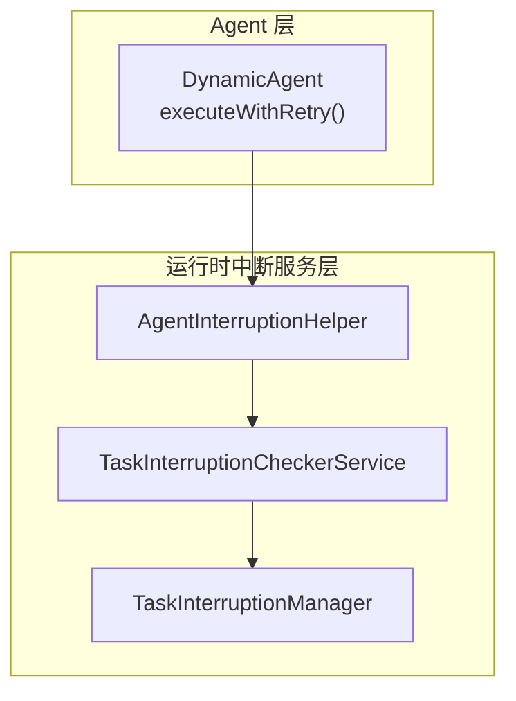
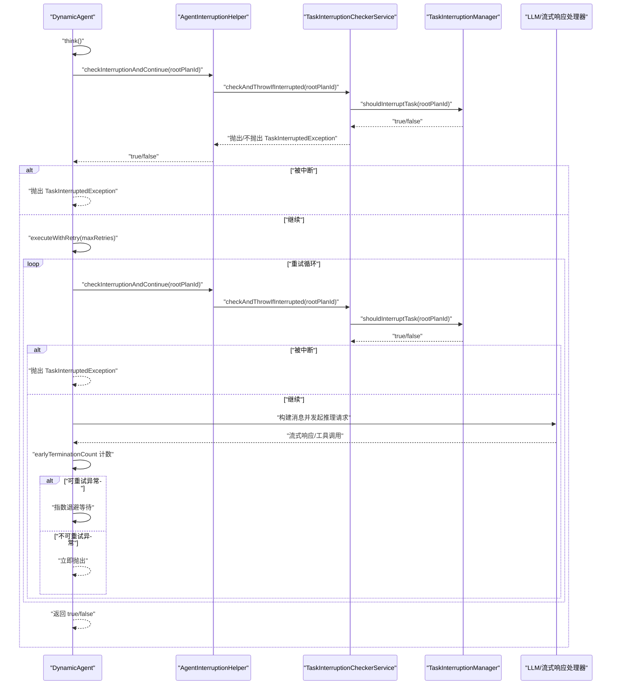
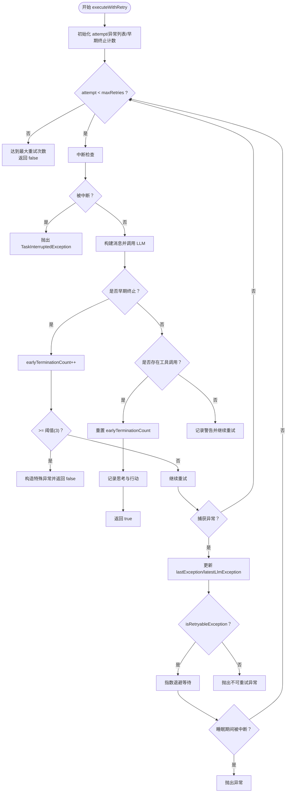
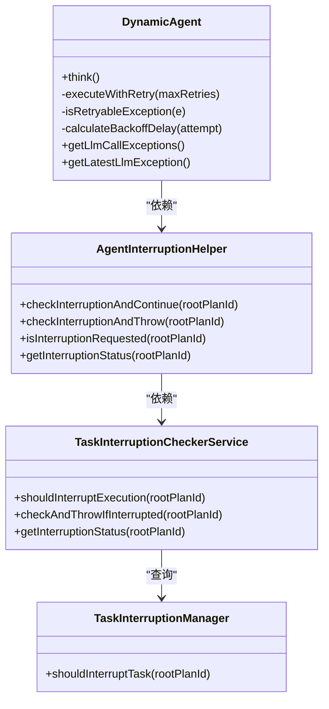

# 重试执行机制

<cite>
**本文引用的文件**
- [DynamicAgent.java](file://src/main/java/com/alibaba/cloud/ai/lynxe/agent/DynamicAgent.java)
- [AgentInterruptionHelper.java](file://src/main/java/com/alibaba/cloud/ai/lynxe/runtime/service/AgentInterruptionHelper.java)
- [TaskInterruptionCheckerService.java](file://src/main/java/com/alibaba/cloud/ai/lynxe/runtime/service/TaskInterruptionCheckerService.java)
- [TaskInterruptionManager.java](file://src/main/java/com/alibaba/cloud/ai/lynxe/runtime/service/TaskInterruptionManager.java)
- [BrowserUseTool.java](file://src/main/java/com/alibaba/cloud/ai/lynxe/tool/browser/BrowserUseTool.java)
</cite>

## 目录
1. [简介](#简介)
2. [项目结构](#项目结构)
3. [核心组件](#核心组件)
4. [架构总览](#架构总览)
5. [详细组件分析](#详细组件分析)
6. [依赖关系分析](#依赖关系分析)
7. [性能考量](#性能考量)
8. [故障排查指南](#故障排查指南)
9. [结论](#结论)
10. [附录](#附录)

## 简介
本文件系统性梳理并说明项目中的“重试执行机制”，重点围绕 DynamicAgent 的 executeWithRetry() 方法展开，覆盖以下关键点：
- 重试次数控制：最大重试次数参数化，循环内按次序递增。
- 中断检查：在每次重试前调用中断检查服务，支持用户或外部系统触发的即时中止。
- 早期终止检测：对 LLM 思考阶段仅返回文本而未调用工具的情况进行计数与阈值判定，超过阈值直接失败。
- 重试间隔等待：对可重试异常采用指数退避策略，避免频繁重试造成资源压力。
- 异常记录与最新异常引用：维护异常列表与最新异常，便于上层 step() 统一处理。
- 终止条件：成功执行、达到最大重试次数、遇到不可重试异常、被中断。
- 使用示例：给出正常重试流程与早期终止处理流程的参考路径。
- 优化建议：如何调整最大重试次数与早期终止阈值以平衡稳定性与响应速度。

## 项目结构
与重试执行机制相关的核心代码集中在 agent 层与 runtime 中断服务层，如下图所示：

图表来源
- [DynamicAgent.java](file://src/main/java/com/alibaba/cloud/ai/lynxe/agent/DynamicAgent.java#L200-L230)
- [AgentInterruptionHelper.java](file://src/main/java/com/alibaba/cloud/ai/lynxe/runtime/service/AgentInterruptionHelper.java#L35-L64)
- [TaskInterruptionCheckerService.java](file://src/main/java/com/alibaba/cloud/ai/lynxe/runtime/service/TaskInterruptionCheckerService.java#L40-L82)
- [TaskInterruptionManager.java](file://src/main/java/com/alibaba/cloud/ai/lynxe/runtime/service/TaskInterruptionManager.java#L49-L67)

章节来源
- [DynamicAgent.java](file://src/main/java/com/alibaba/cloud/ai/lynxe/agent/DynamicAgent.java#L200-L230)
- [AgentInterruptionHelper.java](file://src/main/java/com/alibaba/cloud/ai/lynxe/runtime/service/AgentInterruptionHelper.java#L35-L64)
- [TaskInterruptionCheckerService.java](file://src/main/java/com/alibaba/cloud/ai/lynxe/runtime/service/TaskInterruptionCheckerService.java#L40-L82)
- [TaskInterruptionManager.java](file://src/main/java/com/alibaba/cloud/ai/lynxe/runtime/service/TaskInterruptionManager.java#L49-L67)

## 核心组件
- DynamicAgent.executeWithRetry(maxRetries)
  - 负责思考阶段（LLM 推理）的重试循环，包含中断检查、早期终止检测、异常分类与指数退避等待。
  - 维护 llmCallExceptions 列表与 latestLlmException 引用，供 step() 统一处理。
- AgentInterruptionHelper
  - 在关键节点调用中断检查服务，返回是否继续执行。
- TaskInterruptionCheckerService
  - 委托 TaskInterruptionManager 查询数据库状态，决定是否应中断当前任务。
- TaskInterruptionManager
  - 依据根任务状态枚举判断是否应停止/取消/暂停任务。
- BrowserUseTool（对比参考）
  - 展示了另一种重试模式：对可重试异常进行指数退避等待，对运行时异常不重试，对受检异常包装后不重试。

章节来源
- [DynamicAgent.java](file://src/main/java/com/alibaba/cloud/ai/lynxe/agent/DynamicAgent.java#L232-L508)
- [AgentInterruptionHelper.java](file://src/main/java/com/alibaba/cloud/ai/lynxe/runtime/service/AgentInterruptionHelper.java#L35-L64)
- [TaskInterruptionCheckerService.java](file://src/main/java/com/alibaba/cloud/ai/lynxe/runtime/service/TaskInterruptionCheckerService.java#L40-L82)
- [TaskInterruptionManager.java](file://src/main/java/com/alibaba/cloud/ai/lynxe/runtime/service/TaskInterruptionManager.java#L49-L67)
- [BrowserUseTool.java](file://src/main/java/com/alibaba/cloud/ai/lynxe/tool/browser/BrowserUseTool.java#L320-L359)

## 架构总览
下图展示了从 DynamicAgent 的 think() 到 executeWithRetry() 的完整调用链路，以及中断检查与异常处理的关键节点。

图表来源
- [DynamicAgent.java](file://src/main/java/com/alibaba/cloud/ai/lynxe/agent/DynamicAgent.java#L200-L230)
- [DynamicAgent.java](file://src/main/java/com/alibaba/cloud/ai/lynxe/agent/DynamicAgent.java#L232-L508)
- [AgentInterruptionHelper.java](file://src/main/java/com/alibaba/cloud/ai/lynxe/runtime/service/AgentInterruptionHelper.java#L35-L64)
- [TaskInterruptionCheckerService.java](file://src/main/java/com/alibaba/cloud/ai/lynxe/runtime/service/TaskInterruptionCheckerService.java#L40-L82)
- [TaskInterruptionManager.java](file://src/main/java/com/alibaba/cloud/ai/lynxe/runtime/service/TaskInterruptionManager.java#L49-L67)

## 详细组件分析

### DynamicAgent.executeWithRetry(maxRetries) 执行流程
- 入口与初始化
  - 初始化 attempt、lastException、earlyTerminationCount、EARLY_TERMINATION_THRESHOLD，并清空 llmCallExceptions、latestLlmException。
- 循环重试
  - 每次进入循环前进行中断检查；若被中断则抛出 TaskInterruptedException，由上层捕获并处理。
  - 构建思考消息与历史上下文，调用 LLM 并通过流式处理器获取最终响应与工具调用列表。
  - 早期终止检测：若响应仅包含文本且无工具调用，earlyTerminationCount 自增；当超过阈值（默认 3）时，构造特殊异常并返回 false，交由 step() 处理。
  - 若存在工具调用，则重置 earlyTerminationCount，记录思考与行动，成功返回 true。
  - 若无工具调用但属于早期终止场景，记录日志并继续重试。
- 异常处理与指数退避
  - 捕获异常后更新 lastException、latestLlmException，并将异常加入 llmCallExceptions。
  - isRetryableException() 对网络类错误（如解析失败、超时、连接问题、DNS、WebClientRequestException、DnsNameResolverTimeoutException）判定为可重试。
  - 对可重试异常：计算指数退避延迟（最多 60 秒），sleep 后继续下一次尝试；若被中断则恢复中断状态。
  - 对不可重试异常：立即抛出，不再重试。
- 结束条件
  - 成功：返回 true。
  - 达到最大重试次数：返回 false，latestLlmException 保留最后一次异常，供 step() 统一处理。
  - 被中断：抛出 TaskInterruptedException，由上层 step() 捕获并返回中断状态。

图表来源
- [DynamicAgent.java](file://src/main/java/com/alibaba/cloud/ai/lynxe/agent/DynamicAgent.java#L232-L508)

章节来源
- [DynamicAgent.java](file://src/main/java/com/alibaba/cloud/ai/lynxe/agent/DynamicAgent.java#L232-L508)

### 中断检查与早期终止检测
- 中断检查
  - AgentInterruptionHelper 在关键节点调用 TaskInterruptionCheckerService.checkAndThrowIfInterrupted(rootPlanId)，若数据库状态指示应中断，则抛出 TaskInterruptedException。
  - TaskInterruptionCheckerService.shouldInterruptExecution(rootPlanId) 委托 TaskInterruptionManager 判断 DesiredTaskState 是否为 STOP/CANCEL/PAUSE。
- 早期终止检测
  - executeWithRetry() 通过流式响应处理器的 earlyTermination 标记统计连续“仅文本无工具调用”的次数。
  - 当 earlyTerminationCount 达到阈值（默认 3）时，构造特殊异常并返回 false，step() 将其识别为失败状态，避免无限重试。

章节来源
- [AgentInterruptionHelper.java](file://src/main/java/com/alibaba/cloud/ai/lynxe/runtime/service/AgentInterruptionHelper.java#L35-L64)
- [TaskInterruptionCheckerService.java](file://src/main/java/com/alibaba/cloud/ai/lynxe/runtime/service/TaskInterruptionCheckerService.java#L40-L82)
- [TaskInterruptionManager.java](file://src/main/java/com/alibaba/cloud/ai/lynxe/runtime/service/TaskInterruptionManager.java#L49-L67)
- [DynamicAgent.java](file://src/main/java/com/alibaba/cloud/ai/lynxe/agent/DynamicAgent.java#L232-L508)

### 异常记录与最新异常引用
- llmCallExceptions：记录所有尝试过程中的异常，便于后续统一展示与审计。
- latestLlmException：始终指向最近一次异常，用于 step() 的分支处理与错误报告。
- 返回 false 的场景下，latestLlmException 由 step() 识别为“达到最大重试次数”或“早期终止阈值触发”。

章节来源
- [DynamicAgent.java](file://src/main/java/com/alibaba/cloud/ai/lynxe/agent/DynamicAgent.java#L120-L140)
- [DynamicAgent.java](file://src/main/java/com/alibaba/cloud/ai/lynxe/agent/DynamicAgent.java#L476-L508)
- [DynamicAgent.java](file://src/main/java/com/alibaba/cloud/ai/lynxe/agent/DynamicAgent.java#L510-L542)

### 重试间隔等待与指数退避
- 可重试异常判定：基于异常消息关键字匹配网络相关错误。
- 指数退避：delay = min(2^(attempt-1) * 2000ms, 60000ms)，避免频繁重试导致资源紧张。
- 睡眠期间中断：Thread.currentThread().interrupt() 并抛出异常，确保及时退出。

章节来源
- [DynamicAgent.java](file://src/main/java/com/alibaba/cloud/ai/lynxe/agent/DynamicAgent.java#L487-L508)

### 与 BrowserUseTool 的对比参考
- BrowserUseTool 的重试逻辑同样区分运行时异常（不重试）、受检异常（包装后不重试）与可重试异常（指数退避等待）。
- 该对比有助于理解不同模块在重试策略上的共性与差异。

章节来源
- [BrowserUseTool.java](file://src/main/java/com/alibaba/cloud/ai/lynxe/tool/browser/BrowserUseTool.java#L320-L359)

## 依赖关系分析
- DynamicAgent 依赖 AgentInterruptionHelper 进行中断检查。
- AgentInterruptionHelper 依赖 TaskInterruptionCheckerService。
- TaskInterruptionCheckerService 依赖 TaskInterruptionManager 访问数据库状态。
- DynamicAgent 内部维护异常列表与最新异常，供 step() 统一处理。

图表来源
- [DynamicAgent.java](file://src/main/java/com/alibaba/cloud/ai/lynxe/agent/DynamicAgent.java#L200-L230)
- [AgentInterruptionHelper.java](file://src/main/java/com/alibaba/cloud/ai/lynxe/runtime/service/AgentInterruptionHelper.java#L35-L84)
- [TaskInterruptionCheckerService.java](file://src/main/java/com/alibaba/cloud/ai/lynxe/runtime/service/TaskInterruptionCheckerService.java#L40-L114)
- [TaskInterruptionManager.java](file://src/main/java/com/alibaba/cloud/ai/lynxe/runtime/service/TaskInterruptionManager.java#L49-L67)

## 性能考量
- 指数退避上限：最大延迟限制为 60 秒，防止重试风暴。
- 早期终止阈值：默认 3 次连续“仅文本无工具调用”即失败，避免无效重试循环。
- 中断检查频率：在每次重试前执行，确保快速响应外部中断信号。
- 流式响应合并：通过流式处理器减少等待时间，提升用户体验。

## 故障排查指南
- 重试次数耗尽
  - 现象：step() 返回失败，latestLlmException 指向最后一次异常。
  - 排查：查看 llmCallExceptions 列表，定位异常类型与发生时间。
  - 参考路径：[DynamicAgent.java](file://src/main/java/com/alibaba/cloud/ai/lynxe/agent/DynamicAgent.java#L476-L508)
- 早期终止阈值触发
  - 现象：step() 返回失败，提示模型需调用工具。
  - 排查：确认模型配置是否要求必须调用工具；适当提高阈值或优化提示词。
  - 参考路径：[DynamicAgent.java](file://src/main/java/com/alibaba/cloud/ai/lynxe/agent/DynamicAgent.java#L380-L400)
- 中断导致提前结束
  - 现象：抛出 TaskInterruptedException，step() 返回中断状态。
  - 排查：检查数据库中对应 rootPlanId 的 DesiredTaskState 是否为 STOP/CANCEL/PAUSE。
  - 参考路径：[TaskInterruptionCheckerService.java](file://src/main/java/com/alibaba/cloud/ai/lynxe/runtime/service/TaskInterruptionCheckerService.java#L70-L82), [TaskInterruptionManager.java](file://src/main/java/com/alibaba/cloud/ai/lynxe/runtime/service/TaskInterruptionManager.java#L49-L67)
- 不可重试异常
  - 现象：立即抛出，不进行重试。
  - 排查：确认异常消息是否命中网络相关关键字；若非网络类，应按业务逻辑处理。
  - 参考路径：[DynamicAgent.java](file://src/main/java/com/alibaba/cloud/ai/lynxe/agent/DynamicAgent.java#L487-L508)

章节来源
- [DynamicAgent.java](file://src/main/java/com/alibaba/cloud/ai/lynxe/agent/DynamicAgent.java#L476-L508)
- [TaskInterruptionCheckerService.java](file://src/main/java/com/alibaba/cloud/ai/lynxe/runtime/service/TaskInterruptionCheckerService.java#L70-L82)
- [TaskInterruptionManager.java](file://src/main/java/com/alibaba/cloud/ai/lynxe/runtime/service/TaskInterruptionManager.java#L49-L67)

## 结论
DynamicAgent 的 executeWithRetry() 提供了稳健的重试执行机制，结合中断检查与早期终止检测，有效平衡了稳定性与响应性。通过指数退避与异常分类，系统能够在网络波动等瞬时故障下自动恢复，同时避免无效重试与无限循环。开发者可根据业务场景调整最大重试次数与早期终止阈值，以获得更优的执行体验。

## 附录
- 正常重试流程参考路径
  - [DynamicAgent.java](file://src/main/java/com/alibaba/cloud/ai/lynxe/agent/DynamicAgent.java#L232-L508)
- 早期终止处理流程参考路径
  - [DynamicAgent.java](file://src/main/java/com/alibaba/cloud/ai/lynxe/agent/DynamicAgent.java#L380-L400)
- 中断检查流程参考路径
  - [AgentInterruptionHelper.java](file://src/main/java/com/alibaba/cloud/ai/lynxe/runtime/service/AgentInterruptionHelper.java#L35-L64)
  - [TaskInterruptionCheckerService.java](file://src/main/java/com/alibaba/cloud/ai/lynxe/runtime/service/TaskInterruptionCheckerService.java#L40-L82)
  - [TaskInterruptionManager.java](file://src/main/java/com/alibaba/cloud/ai/lynxe/runtime/service/TaskInterruptionManager.java#L49-L67)
- 指数退避与异常分类参考路径
  - [DynamicAgent.java](file://src/main/java/com/alibaba/cloud/ai/lynxe/agent/DynamicAgent.java#L487-L508)
- 对比参考：BrowserUseTool 的重试模式
  - [BrowserUseTool.java](file://src/main/java/com/alibaba/cloud/ai/lynxe/tool/browser/BrowserUseTool.java#L320-L359)