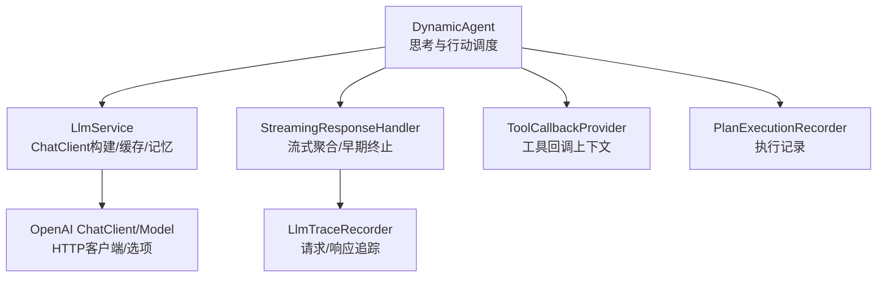
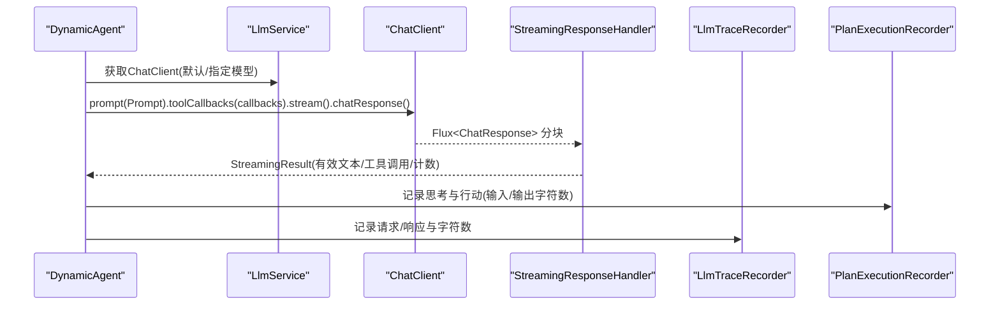
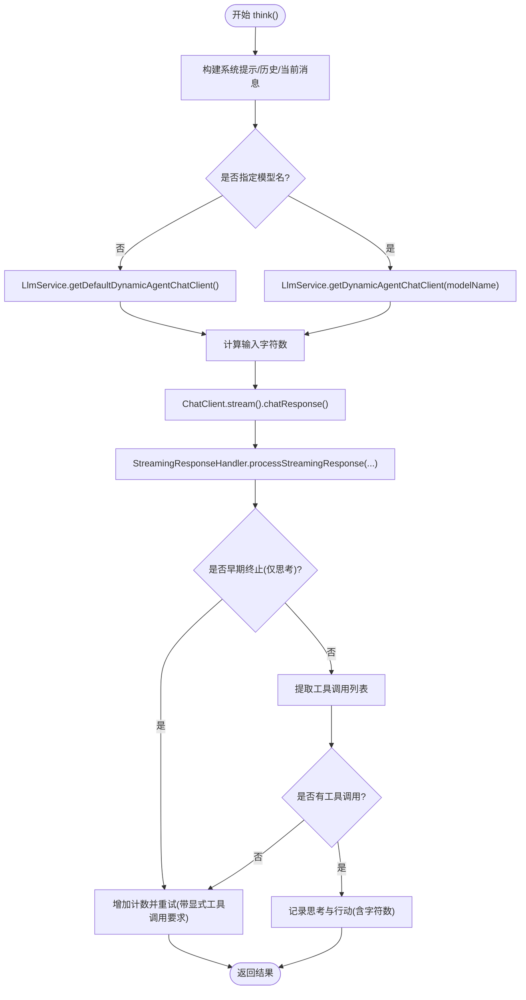
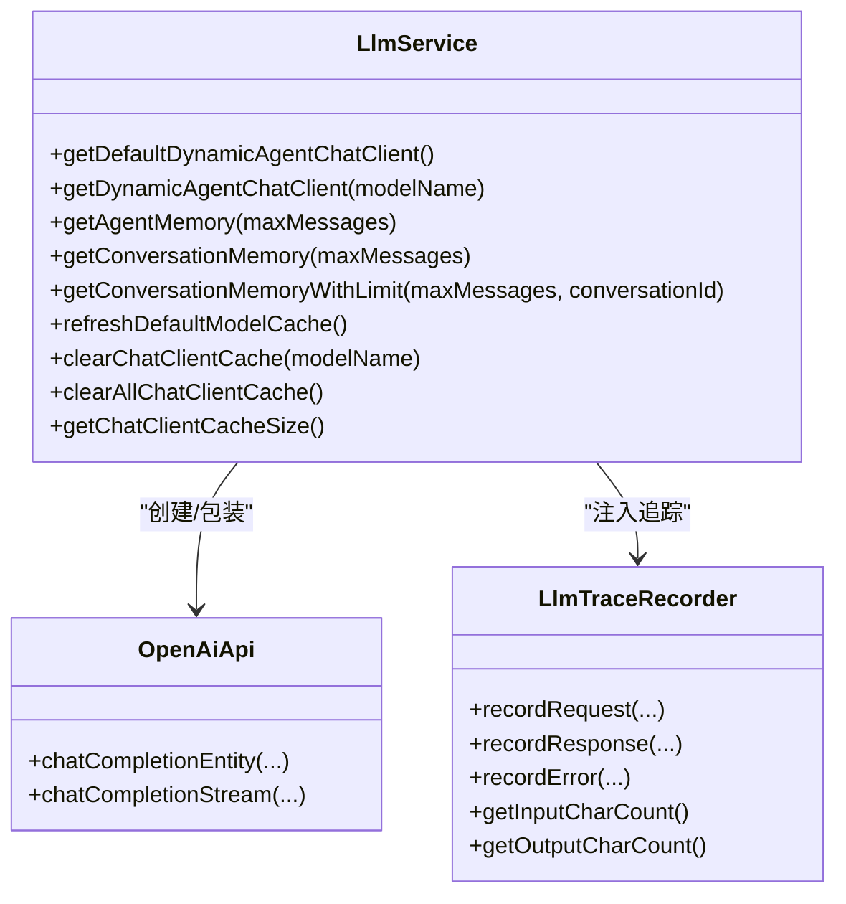
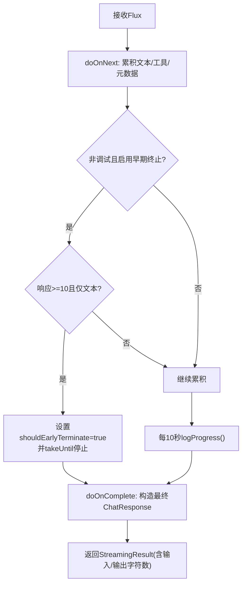
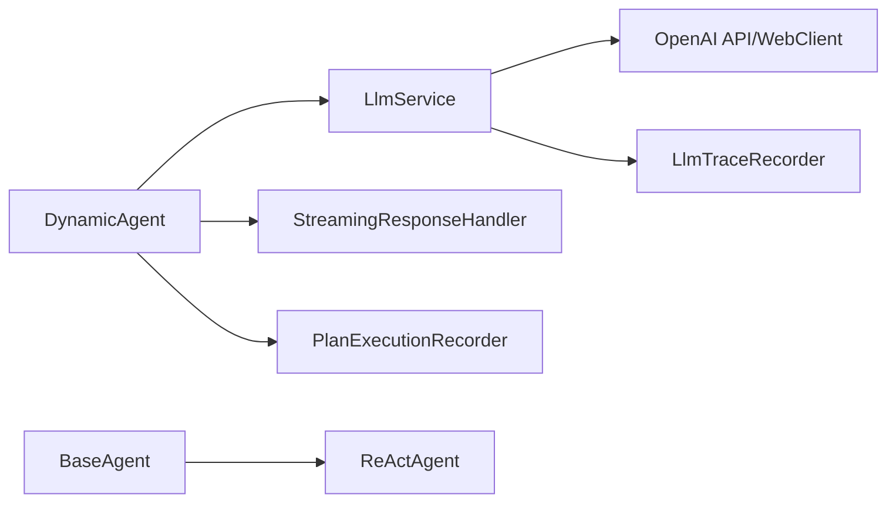

# LLM调用机制

<cite>
**本文引用的文件列表**
- [DynamicAgent.java](file://src/main/java/com/alibaba/cloud/ai/lynxe/agent/DynamicAgent.java)
- [LlmService.java](file://src/main/java/com/alibaba/cloud/ai/lynxe/llm/LlmService.java)
- [StreamingResponseHandler.java](file://src/main/java/com/alibaba/cloud/ai/lynxe/llm/StreamingResponseHandler.java)
- [LlmTraceRecorder.java](file://src/main/java/com/alibaba/cloud/ai/lynxe/llm/LlmTraceRecorder.java)
- [BaseAgent.java](file://src/main/java/com/alibaba/cloud/ai/lynxe/agent/BaseAgent.java)
- [ReActAgent.java](file://src/main/java/com/alibaba/cloud/ai/lynxe/agent/ReActAgent.java)
- [DefaultLlmConfiguration.java](file://src/main/java/com/alibaba/cloud/ai/lynxe/config/DefaultLlmConfiguration.java)
- [ToolCallbackProvider.java](file://src/main/java/com/alibaba/cloud/ai/lynxe/agent/ToolCallbackProvider.java)
- [PlanExecutionRecorder.java](file://src/main/java/com/alibaba/cloud/ai/lynxe/recorder/service/PlanExecutionRecorder.java)
- [ThinkActRecord.java](file://src/main/java/com/alibaba/cloud/ai/lynxe/recorder/entity/vo/ThinkActRecord.java)
</cite>

## 目录
1. [简介](#简介)
2. [项目结构与核心组件](#项目结构与核心组件)
3. [系统架构总览](#系统架构总览)
4. [核心组件详解](#核心组件详解)
5. [依赖关系分析](#依赖关系分析)
6. [性能监控与指标](#性能监控与指标)
7. [调试与故障排查指南](#调试与故障排查指南)
8. [结论](#结论)

## 简介
本文件面向开发者，系统化阐述DynamicAgent如何通过LlmService与ChatClient进行LLM调用，重点覆盖：
- ToolCallingChatOptions的配置与工具调用行为影响
- 流式响应处理机制（StreamingResponseHandler）与分块合并
- 模型选择策略（默认模型与指定模型）
- 性能监控指标（输入/输出字符数、令牌用量等）
- 调试LLM调用问题的方法（响应延迟、错误信息分析）

## 项目结构与核心组件
- 动态代理执行器：DynamicAgent负责思考（think）与行动（act），在思考阶段构建消息、选择工具并调用LLM；在行动阶段执行工具回调。
- LLM服务层：LlmService封装ChatClient构建、模型缓存、对话记忆管理、请求追踪与可观测性。
- 流式响应处理器：StreamingResponseHandler聚合流式分块，支持进度日志、早期终止检测、错误事件发布与计数统计。
- 请求追踪器：LlmTraceRecorder记录请求/响应JSON与字符数，便于审计与性能分析。
- 基类与模式：BaseAgent定义通用状态机与异常兜底；ReActAgent定义“思考-行动”循环。

图表来源
- [DynamicAgent.java](file://src/main/java/com/alibaba/cloud/ai/lynxe/agent/DynamicAgent.java#L320-L420)
- [LlmService.java](file://src/main/java/com/alibaba/cloud/ai/lynxe/llm/LlmService.java#L164-L201)
- [StreamingResponseHandler.java](file://src/main/java/com/alibaba/cloud/ai/lynxe/llm/StreamingResponseHandler.java#L167-L219)
- [LlmTraceRecorder.java](file://src/main/java/com/alibaba/cloud/ai/lynxe/llm/LlmTraceRecorder.java#L56-L100)
- [PlanExecutionRecorder.java](file://src/main/java/com/alibaba/cloud/ai/lynxe/recorder/service/PlanExecutionRecorder.java)

章节来源
- [DynamicAgent.java](file://src/main/java/com/alibaba/cloud/ai/lynxe/agent/DynamicAgent.java#L320-L420)
- [LlmService.java](file://src/main/java/com/alibaba/cloud/ai/lynxe/llm/LlmService.java#L164-L201)
- [StreamingResponseHandler.java](file://src/main/java/com/alibaba/cloud/ai/lynxe/llm/StreamingResponseHandler.java#L167-L219)
- [LlmTraceRecorder.java](file://src/main/java/com/alibaba/cloud/ai/lynxe/llm/LlmTraceRecorder.java#L56-L100)
- [BaseAgent.java](file://src/main/java/com/alibaba/cloud/ai/lynxe/agent/BaseAgent.java#L224-L241)
- [ReActAgent.java](file://src/main/java/com/alibaba/cloud/ai/lynxe/agent/ReActAgent.java#L78-L96)

## 系统架构总览
DynamicAgent在“思考”阶段：
- 构建系统提示、历史记忆与当前环境消息
- 选择模型（默认或指定）
- 使用ChatClient发起流式请求
- 通过StreamingResponseHandler聚合分块，提取有效文本与工具调用
- 记录输入/输出字符数与工具调用信息

在“行动”阶段：
- 执行工具回调，处理表单输入、终止、错误报告等特殊工具
- 更新记忆与执行记录

图表来源
- [DynamicAgent.java](file://src/main/java/com/alibaba/cloud/ai/lynxe/agent/DynamicAgent.java#L331-L420)
- [LlmService.java](file://src/main/java/com/alibaba/cloud/ai/lynxe/llm/LlmService.java#L164-L201)
- [StreamingResponseHandler.java](file://src/main/java/com/alibaba/cloud/ai/lynxe/llm/StreamingResponseHandler.java#L167-L219)
- [LlmTraceRecorder.java](file://src/main/java/com/alibaba/cloud/ai/lynxe/llm/LlmTraceRecorder.java#L56-L100)
- [PlanExecutionRecorder.java](file://src/main/java/com/alibaba/cloud/ai/lynxe/recorder/service/PlanExecutionRecorder.java)

## 核心组件详解

### DynamicAgent：思考与行动的编排
- 思考阶段（think）
  - 收集环境数据，构建系统提示与当前步骤消息
  - 从LlmService获取ChatClient（默认或指定模型名）
  - 计算输入字符数（基于消息文本长度之和）
  - 发起流式请求，交由StreamingResponseHandler处理
  - 解析StreamingResult中的有效文本与工具调用
  - 统计输入/输出字符数，记录到执行记录
  - 若出现“仅思考无工具调用”的早期终止，按阈值失败
- 行动阶段（act）
  - 单工具：直接执行工具回调，处理表单输入、终止、错误报告等
  - 多工具：通过并行执行服务处理（受限工具不支持并行）
- 异常与重试
  - 最多重试3次，指数退避延迟
  - 可重试异常包含网络解析、超时、连接、DNS等
  - 记录所有异常，最终汇总为错误信息

图表来源
- [DynamicAgent.java](file://src/main/java/com/alibaba/cloud/ai/lynxe/agent/DynamicAgent.java#L320-L420)
- [DynamicAgent.java](file://src/main/java/com/alibaba/cloud/ai/lynxe/agent/DynamicAgent.java#L476-L508)

章节来源
- [DynamicAgent.java](file://src/main/java/com/alibaba/cloud/ai/lynxe/agent/DynamicAgent.java#L320-L420)
- [DynamicAgent.java](file://src/main/java/com/alibaba/cloud/ai/lynxe/agent/DynamicAgent.java#L476-L508)

### LlmService：模型与客户端管理
- ChatClient构建
  - 默认模型懒加载初始化
  - 缓存不同模型名的ChatClient实例，避免重复创建
  - 内部工具执行开关：规划场景启用内部工具执行，动态代理场景禁用
- 对话记忆
  - 代理记忆（内存窗口）与会话记忆（持久化仓库）
  - 提供带大小限制的会话记忆与自动清理
- 观测与追踪
  - 注入ObservationRegistry与自定义Convention
  - 通过OpenAiApi包装器注入LlmTraceRecorder，记录请求/响应与字符数
- WebClient增强
  - DNS缓存或超时配置，默认10分钟超时与10MB最大内存

图表来源
- [LlmService.java](file://src/main/java/com/alibaba/cloud/ai/lynxe/llm/LlmService.java#L164-L201)
- [LlmService.java](file://src/main/java/com/alibaba/cloud/ai/lynxe/llm/LlmService.java#L343-L449)
- [LlmTraceRecorder.java](file://src/main/java/com/alibaba/cloud/ai/lynxe/llm/LlmTraceRecorder.java#L56-L100)

章节来源
- [LlmService.java](file://src/main/java/com/alibaba/cloud/ai/lynxe/llm/LlmService.java#L164-L201)
- [LlmService.java](file://src/main/java/com/alibaba/cloud/ai/lynxe/llm/LlmService.java#L343-L449)
- [DefaultLlmConfiguration.java](file://src/main/java/com/alibaba/cloud/ai/lynxe/config/DefaultLlmConfiguration.java#L27-L51)

### StreamingResponseHandler：流式响应聚合与早期终止
- 聚合策略
  - 合并文本内容与工具调用列表
  - 维护生成元数据、使用量、速率限制、请求ID等
- 进度日志
  - 每10秒输出一次进度，包含响应次数、字符数、吞吐（字符/秒）、工具调用详情
- 早期终止
  - 非调试模式下，当累计出现文本但无工具调用时触发（至少10个分块后判定）
  - 取消流并构造最终ChatResponse以保留已累积内容
- 错误处理
  - 捕获WebClientResponseException并记录状态码、响应体、URL
  - 发布PlanExceptionEvent事件
- 字符计数
  - 输入字符数来自外部传入（由调用方计算）
  - 输出字符数来自最终响应JSON长度

图表来源
- [StreamingResponseHandler.java](file://src/main/java/com/alibaba/cloud/ai/lynxe/llm/StreamingResponseHandler.java#L167-L219)
- [StreamingResponseHandler.java](file://src/main/java/com/alibaba/cloud/ai/lynxe/llm/StreamingResponseHandler.java#L232-L347)
- [StreamingResponseHandler.java](file://src/main/java/com/alibaba/cloud/ai/lynxe/llm/StreamingResponseHandler.java#L311-L347)

章节来源
- [StreamingResponseHandler.java](file://src/main/java/com/alibaba/cloud/ai/lynxe/llm/StreamingResponseHandler.java#L167-L219)
- [StreamingResponseHandler.java](file://src/main/java/com/alibaba/cloud/ai/lynxe/llm/StreamingResponseHandler.java#L232-L347)

### ToolCallingChatOptions：工具调用配置与行为
- 关键配置项
  - internalToolExecutionEnabled：禁用内部工具执行（动态代理场景）
  - toolContext：传递工具调用上下文（如toolcallId、计划深度）
- 影响
  - 禁止内部工具执行，确保工具调用由外部回调驱动
  - 工具上下文用于后续记录与追踪

章节来源
- [DynamicAgent.java](file://src/main/java/com/alibaba/cloud/ai/lynxe/agent/DynamicAgent.java#L331-L336)

### 模型选择策略：默认模型与指定模型
- 默认模型
  - 通过懒加载从数据库查询默认模型，构建并缓存ChatClient
  - 若未初始化，抛出异常提示先指定模型
- 指定模型
  - 以模型名为键缓存ChatClient实例，避免重复创建
  - 当默认模型变更时，清空缓存并重建
- 其他
  - 对话摘要场景使用独立的对话ChatClient，允许内部工具执行

章节来源
- [LlmService.java](file://src/main/java/com/alibaba/cloud/ai/lynxe/llm/LlmService.java#L164-L201)
- [LlmService.java](file://src/main/java/com/alibaba/cloud/ai/lynxe/llm/LlmService.java#L343-L348)

### 执行记录与工具回调
- 执行记录
  - ThinkActRecord包含思考输入/输出、工具调用列表、输入/输出字符数等字段
- 工具回调
  - ToolCallbackProvider提供工具回调上下文映射
  - DynamicAgent根据工具名称查找回调实例并执行

章节来源
- [ThinkActRecord.java](file://src/main/java/com/alibaba/cloud/ai/lynxe/recorder/entity/vo/ThinkActRecord.java#L287-L297)
- [ToolCallbackProvider.java](file://src/main/java/com/alibaba/cloud/ai/lynxe/agent/ToolCallbackProvider.java#L22-L26)
- [DynamicAgent.java](file://src/main/java/com/alibaba/cloud/ai/lynxe/agent/DynamicAgent.java#L614-L648)

## 依赖关系分析
- DynamicAgent依赖LlmService获取ChatClient，依赖StreamingResponseHandler处理流式响应，依赖PlanExecutionRecorder记录执行细节
- LlmService依赖OpenAI API与WebClient构建ChatClient，注入LlmTraceRecorder进行请求/响应追踪
- BaseAgent与ReActAgent提供统一的状态机与异常兜底逻辑

图表来源
- [DynamicAgent.java](file://src/main/java/com/alibaba/cloud/ai/lynxe/agent/DynamicAgent.java#L320-L420)
- [LlmService.java](file://src/main/java/com/alibaba/cloud/ai/lynxe/llm/LlmService.java#L164-L201)
- [StreamingResponseHandler.java](file://src/main/java/com/alibaba/cloud/ai/lynxe/llm/StreamingResponseHandler.java#L167-L219)
- [BaseAgent.java](file://src/main/java/com/alibaba/cloud/ai/lynxe/agent/BaseAgent.java#L224-L241)
- [ReActAgent.java](file://src/main/java/com/alibaba/cloud/ai/lynxe/agent/ReActAgent.java#L78-L96)

章节来源
- [DynamicAgent.java](file://src/main/java/com/alibaba/cloud/ai/lynxe/agent/DynamicAgent.java#L320-L420)
- [LlmService.java](file://src/main/java/com/alibaba/cloud/ai/lynxe/llm/LlmService.java#L164-L201)
- [BaseAgent.java](file://src/main/java/com/alibaba/cloud/ai/lynxe/agent/BaseAgent.java#L224-L241)
- [ReActAgent.java](file://src/main/java/com/alibaba/cloud/ai/lynxe/agent/ReActAgent.java#L78-L96)

## 性能监控与指标
- 字符数统计
  - 输入字符数：由调用方在发起请求前计算（消息文本长度之和），传入StreamingResponseHandler
  - 输出字符数：由LlmTraceRecorder记录响应JSON长度，StreamingResponseHandler回填至StreamingResult
- 令牌用量
  - 通过ChatResponseMetadata中的Usage字段获取prompt/completion/total tokens
- 吞吐与延迟
  - StreamingResponseHandler每10秒输出进度日志，包含字符数与字符/秒
  - 完成时输出总耗时、响应次数、工具调用数量与令牌用量
- 记录落盘
  - ThinkActRecord保存输入/输出字符数，便于后续报表与分析

章节来源
- [StreamingResponseHandler.java](file://src/main/java/com/alibaba/cloud/ai/lynxe/llm/StreamingResponseHandler.java#L302-L347)
- [StreamingResponseHandler.java](file://src/main/java/com/alibaba/cloud/ai/lynxe/llm/StreamingResponseHandler.java#L512-L523)
- [LlmTraceRecorder.java](file://src/main/java/com/alibaba/cloud/ai/lynxe/llm/LlmTraceRecorder.java#L89-L100)
- [ThinkActRecord.java](file://src/main/java/com/alibaba/cloud/ai/lynxe/recorder/entity/vo/ThinkActRecord.java#L287-L297)

## 调试与故障排查指南
- 响应延迟分析
  - 查看StreamingResponseHandler的日志进度与完成日志，定位卡顿阶段
  - 关注字符/秒变化，判断是否为网络或模型侧瓶颈
- 错误信息定位
  - LlmTraceRecorder记录请求/响应与错误详情（状态码、响应体、URL）
  - StreamingResponseHandler捕获WebClientResponseException并发布PlanExceptionEvent
- 重试与异常类型
  - DynamicAgent对网络解析、超时、连接、DNS等异常进行可重试判定
  - 指数退避延迟，最多3次重试
- 早期终止排查
  - 非调试模式下若仅出现思考文本而无工具调用，将被早期终止
  - 检查Prompt规则与工具可用性，必要时开启调试模式验证模型输出
- 模型与客户端
  - 确认默认模型已初始化，或明确传入指定模型名
  - 清理ChatClient缓存后重建，避免旧配置残留

章节来源
- [StreamingResponseHandler.java](file://src/main/java/com/alibaba/cloud/ai/lynxe/llm/StreamingResponseHandler.java#L348-L424)
- [DynamicAgent.java](file://src/main/java/com/alibaba/cloud/ai/lynxe/agent/DynamicAgent.java#L487-L508)
- [LlmService.java](file://src/main/java/com/alibaba/cloud/ai/lynxe/llm/LlmService.java#L287-L314)

## 结论
本机制通过DynamicAgent、LlmService与StreamingResponseHandler形成闭环：前者负责思考与行动编排，后者负责模型调用与流式聚合，前者负责记录与观测。ToolCallingChatOptions在动态代理场景中禁用内部工具执行，确保工具调用由外部回调精确控制；StreamingResponseHandler提供早期终止与进度监控，结合LlmTraceRecorder实现端到端的性能与可观测性。开发者可据此优化Prompt、工具可用性与模型配置，提升整体稳定性与用户体验。