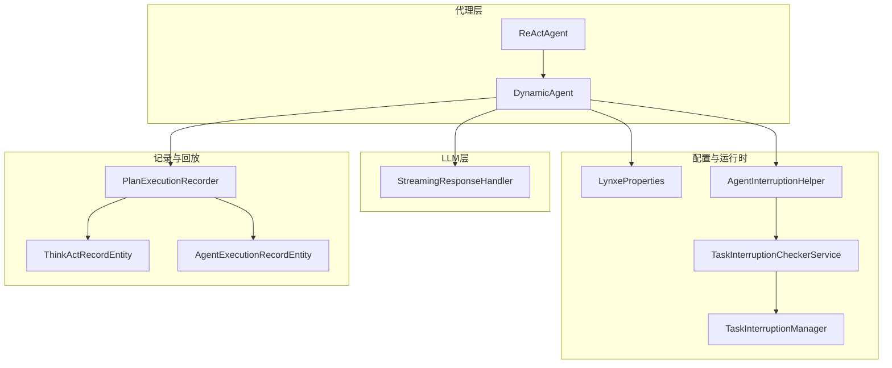
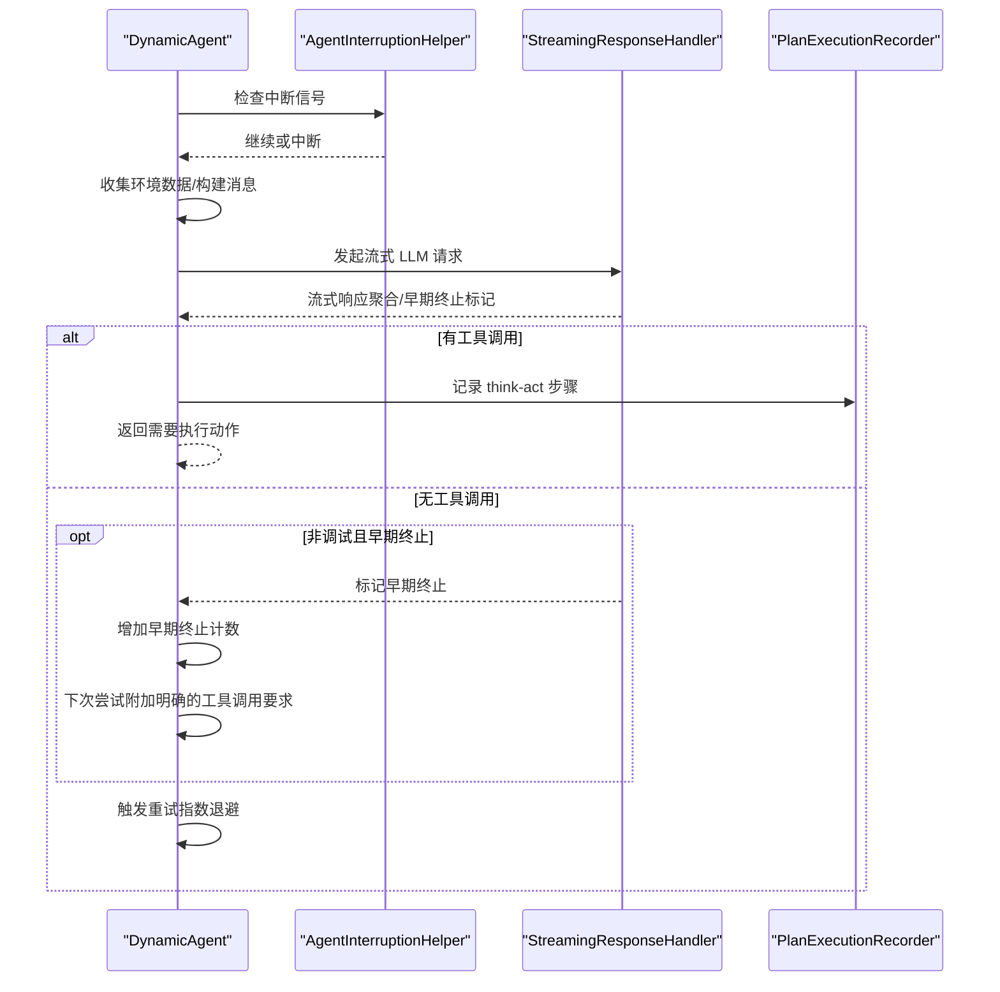
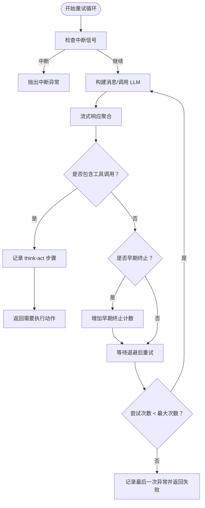
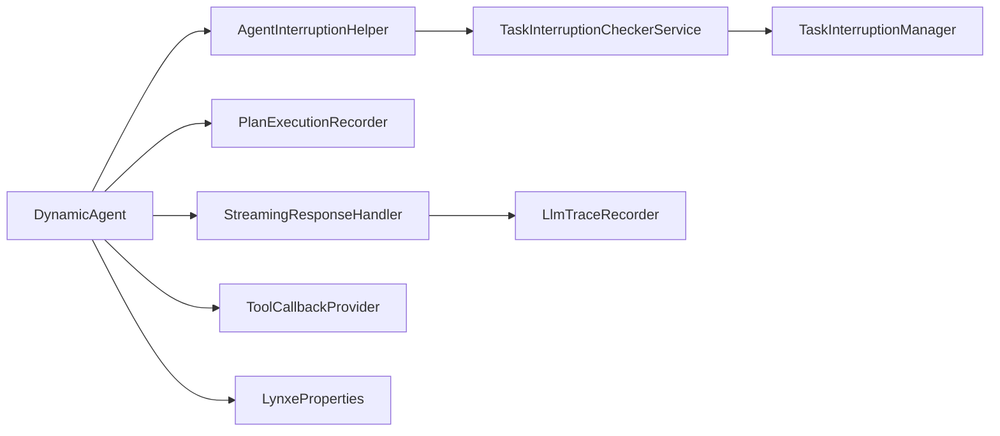

# 思考方法执行流程

<cite>
**本文引用的文件**
- [DynamicAgent.java](file://src/main/java/com/alibaba/cloud/ai/lynxe/agent/DynamicAgent.java)
- [ReActAgent.java](file://src/main/java/com/alibaba/cloud/ai/lynxe/agent/ReActAgent.java)
- [BaseAgent.java](file://src/main/java/com/alibaba/cloud/ai/lynxe/agent/BaseAgent.java)
- [StreamingResponseHandler.java](file://src/main/java/com/alibaba/cloud/ai/lynxe/llm/StreamingResponseHandler.java)
- [LynxeProperties.java](file://src/main/java/com/alibaba/cloud/ai/lynxe/config/LynxeProperties.java)
- [AgentInterruptionHelper.java](file://src/main/java/com/alibaba/cloud/ai/lynxe/runtime/service/AgentInterruptionHelper.java)
- [TaskInterruptionCheckerService.java](file://src/main/java/com/alibaba/cloud/ai/lynxe/runtime/service/TaskInterruptionCheckerService.java)
- [TaskInterruptionManager.java](file://src/main/java/com/alibaba/cloud/ai/lynxe/runtime/service/TaskInterruptionManager.java)
- [PlanExecutionRecorder.java](file://src/main/java/com/alibaba/cloud/ai/lynxe/recorder/service/PlanExecutionRecorder.java)
- [PlanExecutionRecorderImpl.java](file://src/main/java/com/alibaba/cloud/ai/lynxe/recorder/service/impl/PlanExecutionRecorderImpl.java)
- [ThinkActRecordEntity.java](file://src/main/java/com/alibaba/cloud/ai/lynxe/recorder/entity/po/ThinkActRecordEntity.java)
- [AgentExecutionRecordEntity.java](file://src/main/java/com/alibaba/cloud/ai/lynxe/recorder/entity/po/AgentExecutionRecordEntity.java)
- [NewRepoPlanExecutionRecorder.java](file://src/main/java/com/alibaba/cloud/ai/lynxe/recorder/service/NewRepoPlanExecutionRecorder.java)
- [PlanFinalizer.java](file://src/main/java/com/alibaba/cloud/ai/lynxe/planning/service/PlanFinalizer.java)
- [ToolCallbackProvider.java](file://src/main/java/com/alibaba/cloud/ai/lynxe/agent/ToolCallbackProvider.java)
- [useMessageDialog.ts](file://ui-vue3/src/composables/useMessageDialog.ts)
</cite>

## 目录
1. [引言](#引言)
2. [项目结构](#项目结构)
3. [核心组件](#核心组件)
4. [架构总览](#架构总览)
5. [详细组件分析](#详细组件分析)
6. [依赖关系分析](#依赖关系分析)
7. [性能考虑](#性能考虑)
8. [故障排查指南](#故障排查指南)
9. [结论](#结论)
10. [附录](#附录)

## 引言
本文件系统化梳理 AI 代理“思考”方法（think）的完整执行流程，覆盖环境数据收集、消息构建、LLM 调用与流式响应处理、重试与指数退避、早期终止检测、中断处理、异常记录与恢复等关键环节。同时给出可操作的优化建议，帮助开发者在不同场景下平衡吞吐、稳定性与用户体验。

## 项目结构
围绕“思考”流程的关键模块分布如下：
- 代理层：ReActAgent 抽象出“思考-行动”的交替模式；DynamicAgent 实现具体 think/act 流程。
- LLM 层：StreamingResponseHandler 提供流式响应聚合、进度日志与早期终止能力。
- 配置层：LynxeProperties 提供最大步数、对话记忆上限、并行工具调用开关、读超时等参数。
- 中断与状态：AgentInterruptionHelper、TaskInterruptionCheckerService、TaskInterruptionManager 协同实现跨节点的中断检查。
- 记录与回放：PlanExecutionRecorder 及其实体记录 think-act 步骤，便于前端与审计。

图表来源
- [DynamicAgent.java](file://src/main/java/com/alibaba/cloud/ai/lynxe/agent/DynamicAgent.java#L200-L485)
- [StreamingResponseHandler.java](file://src/main/java/com/alibaba/cloud/ai/lynxe/llm/StreamingResponseHandler.java#L167-L449)
- [LynxeProperties.java](file://src/main/java/com/alibaba/cloud/ai/lynxe/config/LynxeProperties.java#L151-L215)
- [AgentInterruptionHelper.java](file://src/main/java/com/alibaba/cloud/ai/lynxe/runtime/service/AgentInterruptionHelper.java#L39-L84)
- [TaskInterruptionCheckerService.java](file://src/main/java/com/alibaba/cloud/ai/lynxe/runtime/service/TaskInterruptionCheckerService.java#L46-L114)
- [TaskInterruptionManager.java](file://src/main/java/com/alibaba/cloud/ai/lynxe/runtime/service/TaskInterruptionManager.java#L49-L67)
- [PlanExecutionRecorder.java](file://src/main/java/com/alibaba/cloud/ai/lynxe/recorder/service/PlanExecutionRecorder.java#L62-L89)
- [ThinkActRecordEntity.java](file://src/main/java/com/alibaba/cloud/ai/lynxe/recorder/entity/po/ThinkActRecordEntity.java#L66-L117)
- [AgentExecutionRecordEntity.java](file://src/main/java/com/alibaba/cloud/ai/lynxe/recorder/entity/po/AgentExecutionRecordEntity.java#L120-L180)

章节来源
- [DynamicAgent.java](file://src/main/java/com/alibaba/cloud/ai/lynxe/agent/DynamicAgent.java#L200-L485)
- [StreamingResponseHandler.java](file://src/main/java/com/alibaba/cloud/ai/lynxe/llm/StreamingResponseHandler.java#L167-L449)
- [LynxeProperties.java](file://src/main/java/com/alibaba/cloud/ai/lynxe/config/LynxeProperties.java#L151-L215)

## 核心组件
- ReActAgent：定义 think()/act() 的抽象，step() 将两者组合为一个 think-act 步。
- DynamicAgent：实现 think() 的完整逻辑，包含环境数据收集、消息构建、LLM 调用、流式响应处理、重试与早期终止、中断检查、结果记录等。
- StreamingResponseHandler：对 LLM 流式响应进行聚合、统计字符数、记录进度、支持非调试模式下的“思考-only”早期终止。
- LynxeProperties：集中管理 agent 最大步数、对话记忆上限、并行工具调用、读超时等配置项。
- 中断服务链路：AgentInterruptionHelper -> TaskInterruptionCheckerService -> TaskInterruptionManager，用于跨节点中断信号检查。
- 记录器：PlanExecutionRecorder 及其实体 ThinkActRecordEntity、AgentExecutionRecordEntity，记录 think-act 步骤与执行摘要。

章节来源
- [ReActAgent.java](file://src/main/java/com/alibaba/cloud/ai/lynxe/agent/ReActAgent.java#L58-L96)
- [DynamicAgent.java](file://src/main/java/com/alibaba/cloud/ai/lynxe/agent/DynamicAgent.java#L200-L485)
- [StreamingResponseHandler.java](file://src/main/java/com/alibaba/cloud/ai/lynxe/llm/StreamingResponseHandler.java#L167-L449)
- [LynxeProperties.java](file://src/main/java/com/alibaba/cloud/ai/lynxe/config/LynxeProperties.java#L151-L215)
- [AgentInterruptionHelper.java](file://src/main/java/com/alibaba/cloud/ai/lynxe/runtime/service/AgentInterruptionHelper.java#L39-L84)
- [TaskInterruptionCheckerService.java](file://src/main/java/com/alibaba/cloud/ai/lynxe/runtime/service/TaskInterruptionCheckerService.java#L46-L114)
- [TaskInterruptionManager.java](file://src/main/java/com/alibaba/cloud/ai/lynxe/runtime/service/TaskInterruptionManager.java#L49-L67)
- [PlanExecutionRecorder.java](file://src/main/java/com/alibaba/cloud/ai/lynxe/recorder/service/PlanExecutionRecorder.java#L62-L89)
- [ThinkActRecordEntity.java](file://src/main/java/com/alibaba/cloud/ai/lynxe/recorder/entity/po/ThinkActRecordEntity.java#L66-L117)
- [AgentExecutionRecordEntity.java](file://src/main/java/com/alibaba/cloud/ai/lynxe/recorder/entity/po/AgentExecutionRecordEntity.java#L120-L180)

## 架构总览
下面的序列图展示了 think() 的端到端执行路径，从“思考-行动”循环到 LLM 流式响应处理与重试机制。

图表来源
- [DynamicAgent.java](file://src/main/java/com/alibaba/cloud/ai/lynxe/agent/DynamicAgent.java#L200-L485)
- [StreamingResponseHandler.java](file://src/main/java/com/alibaba/cloud/ai/lynxe/llm/StreamingResponseHandler.java#L167-L449)
- [PlanExecutionRecorder.java](file://src/main/java/com/alibaba/cloud/ai/lynxe/recorder/service/PlanExecutionRecorder.java#L62-L89)

## 详细组件分析

### think() 执行流程与消息构建
- 环境数据收集
  - 在每次思考前，动态代理会收集各工具当前上下文，写入 envData 并在后续消息模板中注入。
  - 关键路径参考：[collectAndSetEnvDataForTools](file://src/main/java/com/alibaba/cloud/ai/lynxe/agent/DynamicAgent.java#L1451-L1466)、[collectEnvData](file://src/main/java/com/alibaba/cloud/ai/lynxe/agent/DynamicAgent.java#L1424-L1449)。
- 消息构建
  - think() 先生成系统级“思考提示”，再拼接“下一步环境信息”，最终形成 SystemMessage 作为思考输入。
  - 关键路径参考：[getThinkMessage](file://src/main/java/com/alibaba/cloud/ai/lynxe/agent/DynamicAgent.java#L1352-L1365)、[getNextStepWithEnvMessage](file://src/main/java/com/alibaba/cloud/ai/lynxe/agent/DynamicAgent.java#L1335-L1342)、[currentStepEnvMessage](file://src/main/java/com/alibaba/cloud/ai/lynxe/agent/DynamicAgent.java#L1368-L1381)。
- 对话历史与会话记忆
  - 合并 agent 内部记忆与可选的会话记忆（按配置启用），确保上下文连贯。
  - 关键路径参考：[executeWithRetry 构建 messages](file://src/main/java/com/alibaba/cloud/ai/lynxe/agent/DynamicAgent.java#L286-L319)、[saveUserRequestToConversationMemory](file://src/main/java/com/alibaba/cloud/ai/lynxe/agent/DynamicAgent.java#L1487-L1530)。
- 工具回调与可用工具
  - 通过 ToolCallbackProvider 注入可用工具回调列表，用于 LLM 工具调用。
  - 关键路径参考：[getToolCallList](file://src/main/java/com/alibaba/cloud/ai/lynxe/agent/DynamicAgent.java#L1395-L1410)、[ToolCallbackProvider 接口](file://src/main/java/com/alibaba/cloud/ai/lynxe/agent/ToolCallbackProvider.java#L22-L26)。

章节来源
- [DynamicAgent.java](file://src/main/java/com/alibaba/cloud/ai/lynxe/agent/DynamicAgent.java#L1352-L1381)
- [DynamicAgent.java](file://src/main/java/com/alibaba/cloud/ai/lynxe/agent/DynamicAgent.java#L1395-L1410)
- [DynamicAgent.java](file://src/main/java/com/alibaba/cloud/ai/lynxe/agent/DynamicAgent.java#L1424-L1466)
- [DynamicAgent.java](file://src/main/java/com/alibaba/cloud/ai/lynxe/agent/DynamicAgent.java#L286-L319)
- [DynamicAgent.java](file://src/main/java/com/alibaba/cloud/ai/lynxe/agent/DynamicAgent.java#L1487-L1530)
- [ToolCallbackProvider.java](file://src/main/java/com/alibaba/cloud/ai/lynxe/agent/ToolCallbackProvider.java#L22-L26)

### executeWithRetry 重试机制与指数退避
- 重试策略
  - 默认最多 3 次尝试；每次尝试前检查中断信号；若网络相关异常可重试，否则直接抛出。
  - 关键路径参考：[executeWithRetry](file://src/main/java/com/alibaba/cloud/ai/lynxe/agent/DynamicAgent.java#L232-L485)、[isRetryableException](file://src/main/java/com/alibaba/cloud/ai/lynxe/agent/DynamicAgent.java#L488-L509)。
- 指数退避
  - 采用 2^(attempt-1) × 2000ms，上限 60 秒。
  - 关键路径参考：[calculateBackoffDelay](file://src/main/java/com/alibaba/cloud/ai/lynxe/agent/DynamicAgent.java#L501-L509)。
- 早期终止阈值
  - 连续 3 次“仅思考无工具调用”则判定失败，避免无限循环。
  - 关键路径参考：[earlyTerminationCount 与阈值判断](file://src/main/java/com/alibaba/cloud/ai/lynxe/agent/DynamicAgent.java#L232-L400)。
- 中断处理
  - 每次重试前检查中断；若被中断，抛出 TaskInterruptedException，上层 step() 捕获并返回中断状态。
  - 关键路径参考：[checkInterruptionAndContinue](file://src/main/java/com/alibaba/cloud/ai/lynxe/runtime/service/AgentInterruptionHelper.java#L44-L53)、[TaskInterruptedException](file://src/main/java/com/alibaba/cloud/ai/lynxe/runtime/service/TaskInterruptionCheckerService.java#L102-L114)。

图表来源
- [DynamicAgent.java](file://src/main/java/com/alibaba/cloud/ai/lynxe/agent/DynamicAgent.java#L232-L485)
- [AgentInterruptionHelper.java](file://src/main/java/com/alibaba/cloud/ai/lynxe/runtime/service/AgentInterruptionHelper.java#L44-L53)
- [TaskInterruptionCheckerService.java](file://src/main/java/com/alibaba/cloud/ai/lynxe/runtime/service/TaskInterruptionCheckerService.java#L76-L82)

章节来源
- [DynamicAgent.java](file://src/main/java/com/alibaba/cloud/ai/lynxe/agent/DynamicAgent.java#L232-L485)
- [AgentInterruptionHelper.java](file://src/main/java/com/alibaba/cloud/ai/lynxe/runtime/service/AgentInterruptionHelper.java#L44-L53)
- [TaskInterruptionCheckerService.java](file://src/main/java/com/alibaba/cloud/ai/lynxe/runtime/service/TaskInterruptionCheckerService.java#L76-L82)

### LLM 调用与流式响应处理
- 流式聚合与统计
  - StreamingResponseHandler 聚合文本与工具调用，累计输出字符数、令牌用量、速率限制、prompt 元数据等。
  - 关键路径参考：[processStreamingResponse](file://src/main/java/com/alibaba/cloud/ai/lynxe/llm/StreamingResponseHandler.java#L167-L449)、[logProgress/logCompletion](file://src/main/java/com/alibaba/cloud/ai/lynxe/llm/StreamingResponseHandler.java#L469-L523)。
- 非调试模式的早期终止
  - 当累积出现文本但无工具调用时，触发 takeUntil 提前结束流，避免无效等待。
  - 关键路径参考：[takeUntil 与 shouldEarlyTerminate](file://src/main/java/com/alibaba/cloud/ai/lynxe/llm/StreamingResponseHandler.java#L208-L275)。
- 输入字符数统计
  - 在 DynamicAgent 中计算 messages 文本长度，作为输入字符数传入流处理器。
  - 关键路径参考：[inputCharCount 计算](file://src/main/java/com/alibaba/cloud/ai/lynxe/agent/DynamicAgent.java#L346-L354)、[processStreamingResponse 调用](file://src/main/java/com/alibaba/cloud/ai/lynxe/agent/DynamicAgent.java#L364-L366)。

章节来源
- [StreamingResponseHandler.java](file://src/main/java/com/alibaba/cloud/ai/lynxe/llm/StreamingResponseHandler.java#L167-L449)
- [StreamingResponseHandler.java](file://src/main/java/com/alibaba/cloud/ai/lynxe/llm/StreamingResponseHandler.java#L469-L523)
- [DynamicAgent.java](file://src/main/java/com/alibaba/cloud/ai/lynxe/agent/DynamicAgent.java#L346-L366)

### 动作执行（act）与工具回调
- 单工具执行
  - 使用 ToolCallingManager 执行单个工具调用，处理表单输入、可终止工具、错误报告工具等特殊分支。
  - 关键路径参考：[processSingleTool](file://src/main/java/com/alibaba/cloud/ai/lynxe/agent/DynamicAgent.java#L655-L767)。
- 多工具并行执行
  - 通过 ParallelToolExecutionService 并行执行多个工具，不支持可终止与表单输入工具。
  - 关键路径参考：[processMultipleTools](file://src/main/java/com/alibaba/cloud/ai/lynxe/agent/DynamicAgent.java#L776-L875)。
- 结果后处理与内存压缩
  - 执行后统一记录结果；若检测到重复结果，强制压缩 agent 内存以打破循环。
  - 关键路径参考：[executePostToolFlow](file://src/main/java/com/alibaba/cloud/ai/lynxe/agent/DynamicAgent.java#L1083-L1088)、[checkAndHandleRepeatedResult](file://src/main/java/com/alibaba/cloud/ai/lynxe/agent/DynamicAgent.java#L1224-L1270)。

章节来源
- [DynamicAgent.java](file://src/main/java/com/alibaba/cloud/ai/lynxe/agent/DynamicAgent.java#L655-L767)
- [DynamicAgent.java](file://src/main/java/com/alibaba/cloud/ai/lynxe/agent/DynamicAgent.java#L776-L875)
- [DynamicAgent.java](file://src/main/java/com/alibaba/cloud/ai/lynxe/agent/DynamicAgent.java#L1083-L1088)
- [DynamicAgent.java](file://src/main/java/com/alibaba/cloud/ai/lynxe/agent/DynamicAgent.java#L1224-L1270)

### 记录与回放（think-act）
- think-act 记录
  - PlanExecutionRecorder 记录 think 输入、输出、工具调用参数、字符数等；ThinkActRecordEntity 存储具体字段。
  - 关键路径参考：[recordThinkingAndAction](file://src/main/java/com/alibaba/cloud/ai/lynxe/recorder/service/PlanExecutionRecorder.java#L82-L89)、[ThinkActRecordEntity 字段](file://src/main/java/com/alibaba/cloud/ai/lynxe/recorder/entity/po/ThinkActRecordEntity.java#L66-L117)。
- Agent 执行记录
  - AgentExecutionRecordEntity 记录 agent 执行的步骤、时间、状态等，便于前端展示与审计。
  - 关键路径参考：[AgentExecutionRecordEntity](file://src/main/java/com/alibaba/cloud/ai/lynxe/recorder/entity/po/AgentExecutionRecordEntity.java#L120-L180)。
- 前端流式展示
  - 前端使用 useMessageDialog.ts 逐步接收流式片段，更新助手消息内容，支持完成与错误事件。
  - 关键路径参考：[useMessageDialog.ts 流式处理](file://ui-vue3/src/composables/useMessageDialog.ts#L381-L414)。

章节来源
- [PlanExecutionRecorder.java](file://src/main/java/com/alibaba/cloud/ai/lynxe/recorder/service/PlanExecutionRecorder.java#L62-L89)
- [ThinkActRecordEntity.java](file://src/main/java/com/alibaba/cloud/ai/lynxe/recorder/entity/po/ThinkActRecordEntity.java#L66-L117)
- [AgentExecutionRecordEntity.java](file://src/main/java/com/alibaba/cloud/ai/lynxe/recorder/entity/po/AgentExecutionRecordEntity.java#L120-L180)
- [useMessageDialog.ts](file://ui-vue3/src/composables/useMessageDialog.ts#L381-L414)

## 依赖关系分析
- 组件耦合
  - DynamicAgent 依赖 LLM 服务、流式处理器、记录器、中断辅助、工具回调提供者、并行执行服务、内存服务等。
  - StreamingResponseHandler 与 LLM 请求追踪器配合，提供输入/输出字符数统计与错误事件发布。
- 外部依赖
  - LynxeProperties 提供全局配置；TaskInterruptionManager 依赖数据库实体 RootTaskManagerEntity。
- 循环依赖风险
  - 通过接口（ToolCallbackProvider）与服务注入降低直接循环依赖；记录器与实体之间为单向依赖。

图表来源
- [DynamicAgent.java](file://src/main/java/com/alibaba/cloud/ai/lynxe/agent/DynamicAgent.java#L200-L485)
- [StreamingResponseHandler.java](file://src/main/java/com/alibaba/cloud/ai/lynxe/llm/StreamingResponseHandler.java#L167-L449)
- [PlanExecutionRecorder.java](file://src/main/java/com/alibaba/cloud/ai/lynxe/recorder/service/PlanExecutionRecorder.java#L62-L89)
- [AgentInterruptionHelper.java](file://src/main/java/com/alibaba/cloud/ai/lynxe/runtime/service/AgentInterruptionHelper.java#L39-L84)
- [TaskInterruptionCheckerService.java](file://src/main/java/com/alibaba/cloud/ai/lynxe/runtime/service/TaskInterruptionCheckerService.java#L46-L114)
- [TaskInterruptionManager.java](file://src/main/java/com/alibaba/cloud/ai/lynxe/runtime/service/TaskInterruptionManager.java#L49-L67)
- [ToolCallbackProvider.java](file://src/main/java/com/alibaba/cloud/ai/lynxe/agent/ToolCallbackProvider.java#L22-L26)
- [LynxeProperties.java](file://src/main/java/com/alibaba/cloud/ai/lynxe/config/LynxeProperties.java#L151-L215)

章节来源
- [DynamicAgent.java](file://src/main/java/com/alibaba/cloud/ai/lynxe/agent/DynamicAgent.java#L200-L485)
- [StreamingResponseHandler.java](file://src/main/java/com/alibaba/cloud/ai/lynxe/llm/StreamingResponseHandler.java#L167-L449)
- [PlanExecutionRecorder.java](file://src/main/java/com/alibaba/cloud/ai/lynxe/recorder/service/PlanExecutionRecorder.java#L62-L89)
- [AgentInterruptionHelper.java](file://src/main/java/com/alibaba/cloud/ai/lynxe/runtime/service/AgentInterruptionHelper.java#L39-L84)
- [TaskInterruptionCheckerService.java](file://src/main/java/com/alibaba/cloud/ai/lynxe/runtime/service/TaskInterruptionCheckerService.java#L46-L114)
- [TaskInterruptionManager.java](file://src/main/java/com/alibaba/cloud/ai/lynxe/runtime/service/TaskInterruptionManager.java#L49-L67)
- [ToolCallbackProvider.java](file://src/main/java/com/alibaba/cloud/ai/lynxe/agent/ToolCallbackProvider.java#L22-L26)
- [LynxeProperties.java](file://src/main/java/com/alibaba/cloud/ai/lynxe/config/LynxeProperties.java#L151-L215)

## 性能考虑
- 重试次数与退避
  - 默认 3 次重试，指数退避上限 60 秒；可根据网络波动与模型延迟调整。
  - 参考路径：[executeWithRetry](file://src/main/java/com/alibaba/cloud/ai/lynxe/agent/DynamicAgent.java#L232-L485)、[calculateBackoffDelay](file://src/main/java/com/alibaba/cloud/ai/lynxe/agent/DynamicAgent.java#L501-L509)。
- 早期终止阈值
  - 连续 3 次“思考-only”即失败，避免无效等待；如模型确需多轮思考，可适当放宽阈值或在提示词中强调工具调用必要性。
  - 参考路径：[earlyTerminationCount](file://src/main/java/com/alibaba/cloud/ai/lynxe/agent/DynamicAgent.java#L232-L400)。
- 并行工具调用
  - 开启并行工具调用可提升吞吐，但不支持可终止与表单输入工具；请根据业务需求权衡。
  - 参考路径：[getParallelToolCalls](file://src/main/java/com/alibaba/cloud/ai/lynxe/config/LynxeProperties.java#L264-L285)、[processMultipleTools](file://src/main/java/com/alibaba/cloud/ai/lynxe/agent/DynamicAgent.java#L776-L875)。
- 读超时与字符统计
  - 读超时默认 120 秒；输入/输出字符数可用于成本控制与性能监控。
  - 参考路径：[getLlmReadTimeout](file://src/main/java/com/alibaba/cloud/ai/lynxe/config/LynxeProperties.java#L309-L329)、[inputCharCount](file://src/main/java/com/alibaba/cloud/ai/lynxe/agent/DynamicAgent.java#L346-L354)。
- 表单输入等待
  - 用户输入等待超时默认 300 秒；可结合中断检查避免长时间阻塞。
  - 参考路径：[getUserInputTimeout](file://src/main/java/com/alibaba/cloud/ai/lynxe/config/LynxeProperties.java#L171-L190)、[waitForUserInputOrTimeout](file://src/main/java/com/alibaba/cloud/ai/lynxe/agent/DynamicAgent.java#L1532-L1580)。

章节来源
- [DynamicAgent.java](file://src/main/java/com/alibaba/cloud/ai/lynxe/agent/DynamicAgent.java#L232-L485)
- [DynamicAgent.java](file://src/main/java/com/alibaba/cloud/ai/lynxe/agent/DynamicAgent.java#L501-L509)
- [LynxeProperties.java](file://src/main/java/com/alibaba/cloud/ai/lynxe/config/LynxeProperties.java#L171-L190)
- [LynxeProperties.java](file://src/main/java/com/alibaba/cloud/ai/lynxe/config/LynxeProperties.java#L264-L285)
- [LynxeProperties.java](file://src/main/java/com/alibaba/cloud/ai/lynxe/config/LynxeProperties.java#L309-L329)
- [DynamicAgent.java](file://src/main/java/com/alibaba/cloud/ai/lynxe/agent/DynamicAgent.java#L1532-L1580)

## 故障排查指南
- 重试耗尽仍无工具调用
  - 现象：多次重试后仍无工具调用，返回“需要至少调用一个工具”。
  - 处理：检查提示词是否强调工具调用必要性；确认工具回调提供者正确注入。
  - 参考路径：[step 中的处理](file://src/main/java/com/alibaba/cloud/ai/lynxe/agent/DynamicAgent.java#L510-L549)、[getToolCallList](file://src/main/java/com/alibaba/cloud/ai/lynxe/agent/DynamicAgent.java#L1395-L1410)。
- 早期终止频繁
  - 现象：连续多次“思考-only”，最终失败。
  - 处理：放宽阈值或调整提示词；确认模型已启用工具调用。
  - 参考路径：[earlyTerminationCount 判定](file://src/main/java/com/alibaba/cloud/ai/lynxe/agent/DynamicAgent.java#L232-L400)。
- 中断导致提前退出
  - 现象：执行中途抛出 TaskInterruptedException。
  - 处理：检查 TaskInterruptionManager 的 desiredTaskState；确认 AgentInterruptionHelper 的检查点。
  - 参考路径：[checkInterruptionAndContinue](file://src/main/java/com/alibaba/cloud/ai/lynxe/runtime/service/AgentInterruptionHelper.java#L44-L53)、[TaskInterruptionCheckerService](file://src/main/java/com/alibaba/cloud/ai/lynxe/runtime/service/TaskInterruptionCheckerService.java#L76-L82)。
- 流式响应异常
  - 现象：blockLast 或 takeUntil 抛错。
  - 处理：查看 LLM_REQUEST_LOGGER 与 STREAMING_PROGRESS_LOGGER；确认网络与模型可用性。
  - 参考路径：[processStreamingResponse 错误处理](file://src/main/java/com/alibaba/cloud/ai/lynxe/llm/StreamingResponseHandler.java#L348-L448)。
- 记录缺失或不完整
  - 现象：think-act 步骤未记录或字符数不准确。
  - 处理：核对 PlanExecutionRecorder 的实现与实体字段映射；确认输入字符数计算位置。
  - 参考路径：[PlanExecutionRecorder](file://src/main/java/com/alibaba/cloud/ai/lynxe/recorder/service/PlanExecutionRecorder.java#L62-L89)、[ThinkActRecordEntity](file://src/main/java/com/alibaba/cloud/ai/lynxe/recorder/entity/po/ThinkActRecordEntity.java#L66-L117)。

章节来源
- [DynamicAgent.java](file://src/main/java/com/alibaba/cloud/ai/lynxe/agent/DynamicAgent.java#L510-L549)
- [DynamicAgent.java](file://src/main/java/com/alibaba/cloud/ai/lynxe/agent/DynamicAgent.java#L232-L400)
- [AgentInterruptionHelper.java](file://src/main/java/com/alibaba/cloud/ai/lynxe/runtime/service/AgentInterruptionHelper.java#L44-L53)
- [TaskInterruptionCheckerService.java](file://src/main/java/com/alibaba/cloud/ai/lynxe/runtime/service/TaskInterruptionCheckerService.java#L76-L82)
- [StreamingResponseHandler.java](file://src/main/java/com/alibaba/cloud/ai/lynxe/llm/StreamingResponseHandler.java#L348-L448)
- [PlanExecutionRecorder.java](file://src/main/java/com/alibaba/cloud/ai/lynxe/recorder/service/PlanExecutionRecorder.java#L62-L89)
- [ThinkActRecordEntity.java](file://src/main/java/com/alibaba/cloud/ai/lynxe/recorder/entity/po/ThinkActRecordEntity.java#L66-L117)

## 结论
think() 方法通过“环境数据收集-消息构建-流式 LLM 调用-工具调用解析-重试与早期终止-中断检查-记录回放”的闭环，实现了稳定、可观测、可中断的智能体思考过程。开发者应结合业务场景合理配置重试次数、并行策略与超时参数，并利用记录器与前端流式展示提升可观测性与用户体验。

## 附录
- 启动与监控示例（代码路径）
  - 启动代理执行：[BaseAgent.run](file://src/main/java/com/alibaba/cloud/ai/lynxe/agent/BaseAgent.java#L254-L332)
  - think-act 步骤：[ReActAgent.step](file://src/main/java/com/alibaba/cloud/ai/lynxe/agent/ReActAgent.java#L78-L96)
  - think 主流程：[DynamicAgent.think](file://src/main/java/com/alibaba/cloud/ai/lynxe/agent/DynamicAgent.java#L200-L231)
  - LLM 流式处理：[StreamingResponseHandler.processStreamingResponse](file://src/main/java/com/alibaba/cloud/ai/lynxe/llm/StreamingResponseHandler.java#L167-L449)
  - 前端流式展示：[useMessageDialog.ts](file://ui-vue3/src/composables/useMessageDialog.ts#L381-L414)