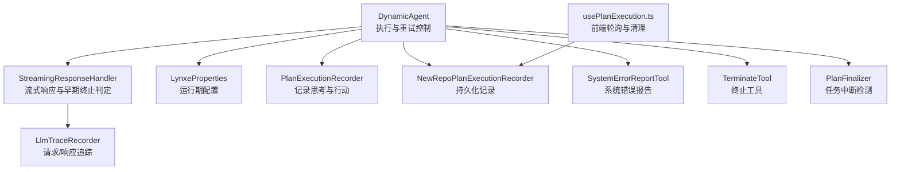
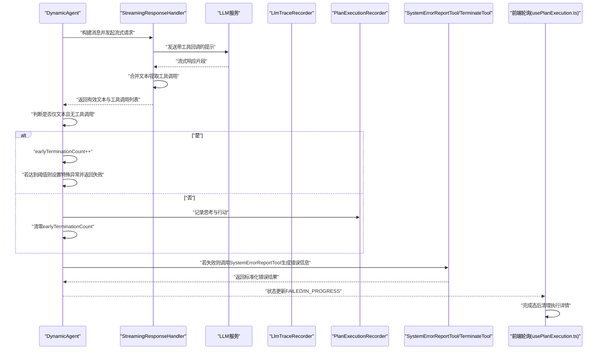
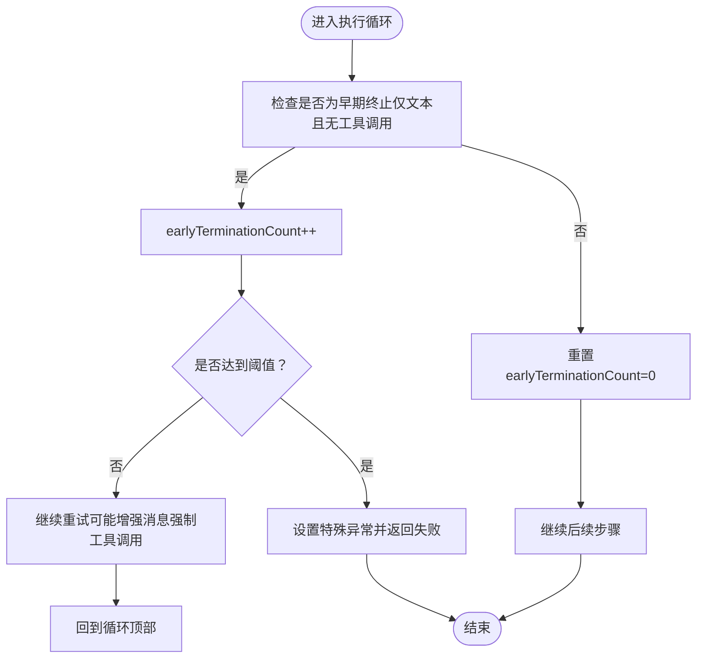
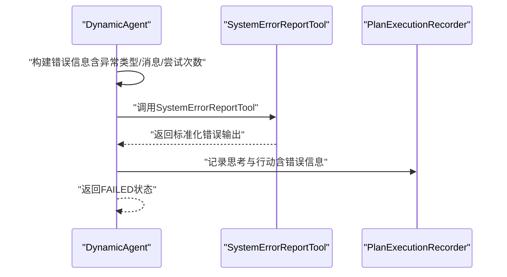
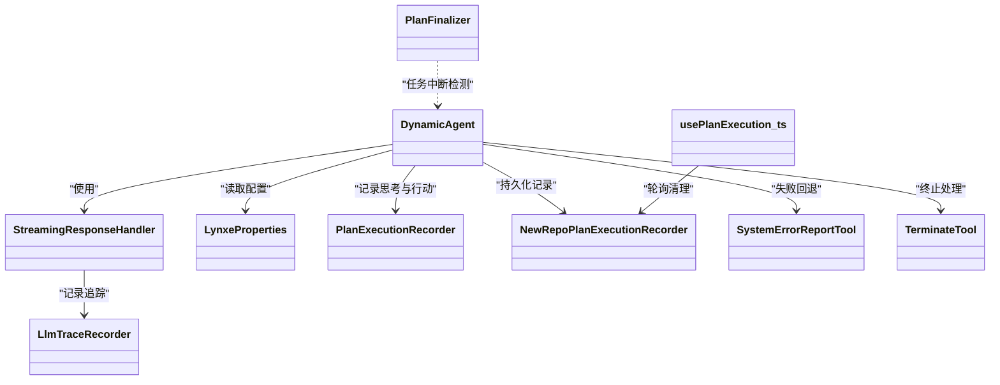

# 早期终止处理

<cite>
**本文引用的文件**
- [DynamicAgent.java](file://src/main/java/com/alibaba/cloud/ai/lynxe/agent/DynamicAgent.java)
- [StreamingResponseHandler.java](file://src/main/java/com/alibaba/cloud/ai/lynxe/llm/StreamingResponseHandler.java)
- [LlmTraceRecorder.java](file://src/main/java/com/alibaba/cloud/ai/lynxe/llm/LlmTraceRecorder.java)
- [LynxeProperties.java](file://src/main/java/com/alibaba/cloud/ai/lynxe/config/LynxeProperties.java)
- [PlanExecutionRecorder.java](file://src/main/java/com/alibaba/cloud/ai/lynxe/recorder/service/PlanExecutionRecorder.java)
- [NewRepoPlanExecutionRecorder.java](file://src/main/java/com/alibaba/cloud/ai/lynxe/recorder/service/NewRepoPlanExecutionRecorder.java)
- [PlanFinalizer.java](file://src/main/java/com/alibaba/cloud/ai/lynxe/planning/service/PlanFinalizer.java)
- [SystemErrorReportTool.java](file://src/main/java/com/alibaba/cloud/ai/lynxe/tool/SystemErrorReportTool.java)
- [TerminateTool.java](file://src/main/java/com/alibaba/cloud/ai/lynxe/tool/TerminateTool.java)
- [usePlanExecution.ts](file://ui-vue3/src/composables/usePlanExecution.ts)
</cite>

## 目录
1. [简介](#简介)
2. [项目结构与定位](#项目结构与定位)
3. [核心组件与职责](#核心组件与职责)
4. [架构总览](#架构总览)
5. [详细组件分析](#详细组件分析)
6. [依赖关系分析](#依赖关系分析)
7. [性能与可扩展性](#性能与可扩展性)
8. [故障排查指南](#故障排查指南)
9. [结论](#结论)
10. [附录：最佳实践与优化建议](#附录最佳实践与优化建议)

## 简介
本文件聚焦于AI代理的“早期终止处理”机制，系统性阐述：
- 如何检测和处理LLM返回的纯思考响应（仅文本、无工具调用）
- earlyTerminationCount计数器的工作原理与EARLY_TERMINATION_THRESHOLD阈值的作用
- 在重试时如何通过增强消息强制要求工具调用
- 达到终止阈值后的失败处理流程，包括特殊异常的生成与错误信息构造
- 早期终止的监控指标与日志记录方式
- 面向开发者的建议：如何优化提示词设计与模型配置以避免早期终止

## 项目结构与定位
该机制主要位于动态代理执行链路中，涉及提示词构建、流式响应处理、重试与失败回退、错误报告工具以及前端轮询清理等模块。

图表来源
- [DynamicAgent.java](file://src/main/java/com/alibaba/cloud/ai/lynxe/agent/DynamicAgent.java#L230-L450)
- [StreamingResponseHandler.java](file://src/main/java/com/alibaba/cloud/ai/lynxe/llm/StreamingResponseHandler.java#L151-L175)
- [LlmTraceRecorder.java](file://src/main/java/com/alibaba/cloud/ai/lynxe/llm/LlmTraceRecorder.java#L37-L156)
- [LynxeProperties.java](file://src/main/java/com/alibaba/cloud/ai/lynxe/config/LynxeProperties.java#L150-L330)
- [PlanExecutionRecorder.java](file://src/main/java/com/alibaba/cloud/ai/lynxe/recorder/service/PlanExecutionRecorder.java#L37-L129)
- [NewRepoPlanExecutionRecorder.java](file://src/main/java/com/alibaba/cloud/ai/lynxe/recorder/service/NewRepoPlanExecutionRecorder.java#L56-L81)
- [SystemErrorReportTool.java](file://src/main/java/com/alibaba/cloud/ai/lynxe/tool/SystemErrorReportTool.java#L68-L107)
- [TerminateTool.java](file://src/main/java/com/alibaba/cloud/ai/lynxe/tool/TerminateTool.java#L178-L215)
- [PlanFinalizer.java](file://src/main/java/com/alibaba/cloud/ai/lynxe/planning/service/PlanFinalizer.java#L291-L325)
- [usePlanExecution.ts](file://ui-vue3/src/composables/usePlanExecution.ts#L205-L233)

章节来源
- [DynamicAgent.java](file://src/main/java/com/alibaba/cloud/ai/lynxe/agent/DynamicAgent.java#L230-L450)
- [StreamingResponseHandler.java](file://src/main/java/com/alibaba/cloud/ai/lynxe/llm/StreamingResponseHandler.java#L151-L175)

## 核心组件与职责
- DynamicAgent：负责思考阶段的执行、重试策略、早期终止计数与阈值控制、失败回退与错误报告工具调用。
- StreamingResponseHandler：负责流式响应合并、早期终止判定（仅文本且无工具调用）、输出字符计数与追踪。
- LlmTraceRecorder：记录请求/响应与错误，提供输入/输出字符计数。
- LynxeProperties：提供运行期配置项，如并行工具调用开关、对话记忆开关、读超时等，间接影响早期终止行为。
- PlanExecutionRecorder/NewRepoPlanExecutionRecorder：记录思考与行动过程，便于可观测与回溯。
- SystemErrorReportTool/TerminateTool：用于在失败或终止场景下生成标准化错误信息或终止状态。
- PlanFinalizer：在最终阶段识别用户中断等模式，避免误判为早期终止。
- usePlanExecution.ts：前端轮询与清理逻辑，确保完成态后释放资源。

章节来源
- [DynamicAgent.java](file://src/main/java/com/alibaba/cloud/ai/lynxe/agent/DynamicAgent.java#L230-L450)
- [StreamingResponseHandler.java](file://src/main/java/com/alibaba/cloud/ai/lynxe/llm/StreamingResponseHandler.java#L151-L175)
- [LlmTraceRecorder.java](file://src/main/java/com/alibaba/cloud/ai/lynxe/llm/LlmTraceRecorder.java#L37-L156)
- [LynxeProperties.java](file://src/main/java/com/alibaba/cloud/ai/lynxe/config/LynxeProperties.java#L150-L330)
- [PlanExecutionRecorder.java](file://src/main/java/com/alibaba/cloud/ai/lynxe/recorder/service/PlanExecutionRecorder.java#L37-L129)
- [NewRepoPlanExecutionRecorder.java](file://src/main/java/com/alibaba/cloud/ai/lynxe/recorder/service/NewRepoPlanExecutionRecorder.java#L56-L81)
- [SystemErrorReportTool.java](file://src/main/java/com/alibaba/cloud/ai/lynxe/tool/SystemErrorReportTool.java#L68-L107)
- [TerminateTool.java](file://src/main/java/com/alibaba/cloud/ai/lynxe/tool/TerminateTool.java#L178-L215)
- [PlanFinalizer.java](file://src/main/java/com/alibaba/cloud/ai/lynxe/planning/service/PlanFinalizer.java#L291-L325)
- [usePlanExecution.ts](file://ui-vue3/src/composables/usePlanExecution.ts#L205-L233)

## 架构总览
下面的序列图展示了从思考阶段到早期终止检测、重试与失败回退的关键流程。

图表来源
- [DynamicAgent.java](file://src/main/java/com/alibaba/cloud/ai/lynxe/agent/DynamicAgent.java#L230-L450)
- [StreamingResponseHandler.java](file://src/main/java/com/alibaba/cloud/ai/lynxe/llm/StreamingResponseHandler.java#L151-L175)
- [SystemErrorReportTool.java](file://src/main/java/com/alibaba/cloud/ai/lynxe/tool/SystemErrorReportTool.java#L68-L107)
- [PlanExecutionRecorder.java](file://src/main/java/com/alibaba/cloud/ai/lynxe/recorder/service/PlanExecutionRecorder.java#L37-L129)
- [usePlanExecution.ts](file://ui-vue3/src/composables/usePlanExecution.ts#L205-L233)

## 详细组件分析

### earlyTerminationCount计数器与EARLY_TERMINATION_THRESHOLD
- 计数器位置与初始化：在每次重试循环开始时初始化，并在每次思考阶段结束后根据是否发生“仅文本无工具调用”的早期终止进行累加。
- 阈值设定：阈值常量定义在执行方法内，达到阈值后不再重试，转而触发失败处理。
- 重置逻辑：一旦出现有效工具调用，计数器清零，避免误判。

图表来源
- [DynamicAgent.java](file://src/main/java/com/alibaba/cloud/ai/lynxe/agent/DynamicAgent.java#L230-L450)

章节来源
- [DynamicAgent.java](file://src/main/java/com/alibaba/cloud/ai/lynxe/agent/DynamicAgent.java#L230-L450)

### 重试时的消息增强与强制工具调用
- 当检测到早期终止计数大于0时，会在当前步环境消息中追加明确的工具调用要求，强调必须至少调用一个工具才能继续。
- 这种增强消息会作为下一步思考的输入，促使模型在后续尝试中选择并调用工具。

章节来源
- [DynamicAgent.java](file://src/main/java/com/alibaba/cloud/ai/lynxe/agent/DynamicAgent.java#L261-L279)

### 早期终止检测与流式响应处理
- 流式响应处理器在合并过程中会判断是否仅包含文本且未携带工具调用，从而标记为“早期终止”。
- 同时统计输出字符数，便于监控与审计。

章节来源
- [StreamingResponseHandler.java](file://src/main/java/com/alibaba/cloud/ai/lynxe/llm/StreamingResponseHandler.java#L151-L175)
- [StreamingResponseHandler.java](file://src/main/java/com/alibaba/cloud/ai/lynxe/llm/StreamingResponseHandler.java#L378-L408)

### 失败处理与错误信息构造
- 当达到阈值或所有重试耗尽后，系统会构造包含最新异常类型、消息与总尝试次数的错误信息。
- 若为网络类可重试异常，按指数退避重试；否则直接失败。
- 失败时调用SystemErrorReportTool生成标准化错误输出，便于前端展示与记录。

图表来源
- [DynamicAgent.java](file://src/main/java/com/alibaba/cloud/ai/lynxe/agent/DynamicAgent.java#L572-L604)
- [SystemErrorReportTool.java](file://src/main/java/com/alibaba/cloud/ai/lynxe/tool/SystemErrorReportTool.java#L68-L107)
- [PlanExecutionRecorder.java](file://src/main/java/com/alibaba/cloud/ai/lynxe/recorder/service/PlanExecutionRecorder.java#L37-L129)

章节来源
- [DynamicAgent.java](file://src/main/java/com/alibaba/cloud/ai/lynxe/agent/DynamicAgent.java#L572-L604)
- [SystemErrorReportTool.java](file://src/main/java/com/alibaba/cloud/ai/lynxe/tool/SystemErrorReportTool.java#L68-L107)
- [PlanExecutionRecorder.java](file://src/main/java/com/alibaba/cloud/ai/lynxe/recorder/service/PlanExecutionRecorder.java#L37-L129)

### 终止工具与特殊状态
- TerminateTool用于在特定场景下显式终止流程，DynamicAgent在单工具执行路径中对TerminateTool进行特殊处理，将其视为COMPLETED状态，避免继续思考。

章节来源
- [TerminateTool.java](file://src/main/java/com/alibaba/cloud/ai/lynxe/tool/TerminateTool.java#L178-L215)
- [DynamicAgent.java](file://src/main/java/com/alibaba/cloud/ai/lynxe/agent/DynamicAgent.java#L700-L730)

### 前端轮询与清理
- 前端在计划完成后会持续轮询以获取摘要，达到最大轮询次数或有摘要后，删除执行详情并取消跟踪，避免资源泄漏。

章节来源
- [usePlanExecution.ts](file://ui-vue3/src/composables/usePlanExecution.ts#L205-L233)

## 依赖关系分析
- DynamicAgent依赖StreamingResponseHandler进行流式响应与早期终止判定；依赖LynxeProperties控制运行期行为；依赖PlanExecutionRecorder记录执行轨迹；在失败时依赖SystemErrorReportTool生成错误信息。
- StreamingResponseHandler依赖LlmTraceRecorder记录请求/响应与错误。
- PlanFinalizer在最终阶段辅助识别用户中断，避免与早期终止混淆。

图表来源
- [DynamicAgent.java](file://src/main/java/com/alibaba/cloud/ai/lynxe/agent/DynamicAgent.java#L230-L450)
- [StreamingResponseHandler.java](file://src/main/java/com/alibaba/cloud/ai/lynxe/llm/StreamingResponseHandler.java#L151-L175)
- [LlmTraceRecorder.java](file://src/main/java/com/alibaba/cloud/ai/lynxe/llm/LlmTraceRecorder.java#L37-L156)
- [LynxeProperties.java](file://src/main/java/com/alibaba/cloud/ai/lynxe/config/LynxeProperties.java#L150-L330)
- [PlanExecutionRecorder.java](file://src/main/java/com/alibaba/cloud/ai/lynxe/recorder/service/PlanExecutionRecorder.java#L37-L129)
- [NewRepoPlanExecutionRecorder.java](file://src/main/java/com/alibaba/cloud/ai/lynxe/recorder/service/NewRepoPlanExecutionRecorder.java#L56-L81)
- [SystemErrorReportTool.java](file://src/main/java/com/alibaba/cloud/ai/lynxe/tool/SystemErrorReportTool.java#L68-L107)
- [TerminateTool.java](file://src/main/java/com/alibaba/cloud/ai/lynxe/tool/TerminateTool.java#L178-L215)
- [PlanFinalizer.java](file://src/main/java/com/alibaba/cloud/ai/lynxe/planning/service/PlanFinalizer.java#L291-L325)
- [usePlanExecution.ts](file://ui-vue3/src/composables/usePlanExecution.ts#L205-L233)

## 性能与可扩展性
- 指数退避重试：在网络相关异常时采用指数退避，避免频繁重试导致资源浪费。
- 字符计数与追踪：通过LlmTraceRecorder记录输入/输出字符数，有助于成本与性能监控。
- 可扩展点：阈值与重试次数可通过配置或参数化扩展；可引入更细粒度的早期终止分类（如“仅思考”、“思考+空工具”）以区分不同场景。

章节来源
- [DynamicAgent.java](file://src/main/java/com/alibaba/cloud/ai/lynxe/agent/DynamicAgent.java#L490-L508)
- [LlmTraceRecorder.java](file://src/main/java/com/alibaba/cloud/ai/lynxe/llm/LlmTraceRecorder.java#L37-L156)

## 故障排查指南
- 现象：反复出现“仅文本无工具调用”，earlyTerminationCount递增并最终失败
  - 排查要点：检查提示词是否明确要求工具调用；确认工具回调已正确注册；查看增强消息是否生效。
  - 参考路径：[DynamicAgent.java](file://src/main/java/com/alibaba/cloud/ai/lynxe/agent/DynamicAgent.java#L261-L279)、[DynamicAgent.java](file://src/main/java/com/alibaba/cloud/ai/lynxe/agent/DynamicAgent.java#L380-L400)
- 现象：达到阈值后直接失败
  - 排查要点：确认阈值设置是否合理；检查是否需要放宽策略或优化提示词。
  - 参考路径：[DynamicAgent.java](file://src/main/java/com/alibaba/cloud/ai/lynxe/agent/DynamicAgent.java#L236-L238)、[DynamicAgent.java](file://src/main/java/com/alibaba/cloud/ai/lynxe/agent/DynamicAgent.java#L387-L398)
- 现象：失败后前端未清理执行详情
  - 排查要点：确认轮询逻辑与清理条件；检查后端是否返回完成态。
  - 参考路径：[usePlanExecution.ts](file://ui-vue3/src/composables/usePlanExecution.ts#L205-L233)
- 现象：错误信息不完整
  - 排查要点：检查SystemErrorReportTool输出；确认异常类型与消息是否被正确拼接。
  - 参考路径：[DynamicAgent.java](file://src/main/java/com/alibaba/cloud/ai/lynxe/agent/DynamicAgent.java#L572-L604)、[SystemErrorReportTool.java](file://src/main/java/com/alibaba/cloud/ai/lynxe/tool/SystemErrorReportTool.java#L68-L107)

章节来源
- [DynamicAgent.java](file://src/main/java/com/alibaba/cloud/ai/lynxe/agent/DynamicAgent.java#L236-L400)
- [usePlanExecution.ts](file://ui-vue3/src/composables/usePlanExecution.ts#L205-L233)
- [SystemErrorReportTool.java](file://src/main/java/com/alibaba/cloud/ai/lynxe/tool/SystemErrorReportTool.java#L68-L107)

## 结论
该机制通过earlyTerminationCount与EARLY_TERMINATION_THRESHOLD实现了对“仅文本无工具调用”场景的稳健处理：在重试中增强消息以强制工具调用，在阈值触发时生成标准化错误并终止，同时配合追踪与记录保障可观测性与可回溯性。前端轮询与清理进一步保证了资源健康。

## 附录：最佳实践与优化建议
- 提示词设计
  - 明确要求“必须先调用工具再给出结论”，并在多轮对话中重复强调。
  - 对工具调用格式与约束进行清晰示例，减少模型“仅思考”倾向。
- 模型配置
  - 调整温度与采样策略，降低过度“思考”倾向；必要时开启工具优先级提示。
  - 控制上下文长度与历史记忆，避免冗长背景干扰工具调用决策。
- 运行期配置
  - 并行工具调用开关与对话记忆开关需结合业务场景权衡，避免过度复杂化导致模型难以稳定输出工具调用。
- 监控与告警
  - 关注earlyTerminationCount趋势与阈值命中率，及时发现提示词或工具回调问题。
  - 利用LlmTraceRecorder的输入/输出字符计数进行成本与性能监控。

章节来源
- [LynxeProperties.java](file://src/main/java/com/alibaba/cloud/ai/lynxe/config/LynxeProperties.java#L150-L330)
- [StreamingResponseHandler.java](file://src/main/java/com/alibaba/cloud/ai/lynxe/llm/StreamingResponseHandler.java#L151-L175)
- [LlmTraceRecorder.java](file://src/main/java/com/alibaba/cloud/ai/lynxe/llm/LlmTraceRecorder.java#L37-L156)