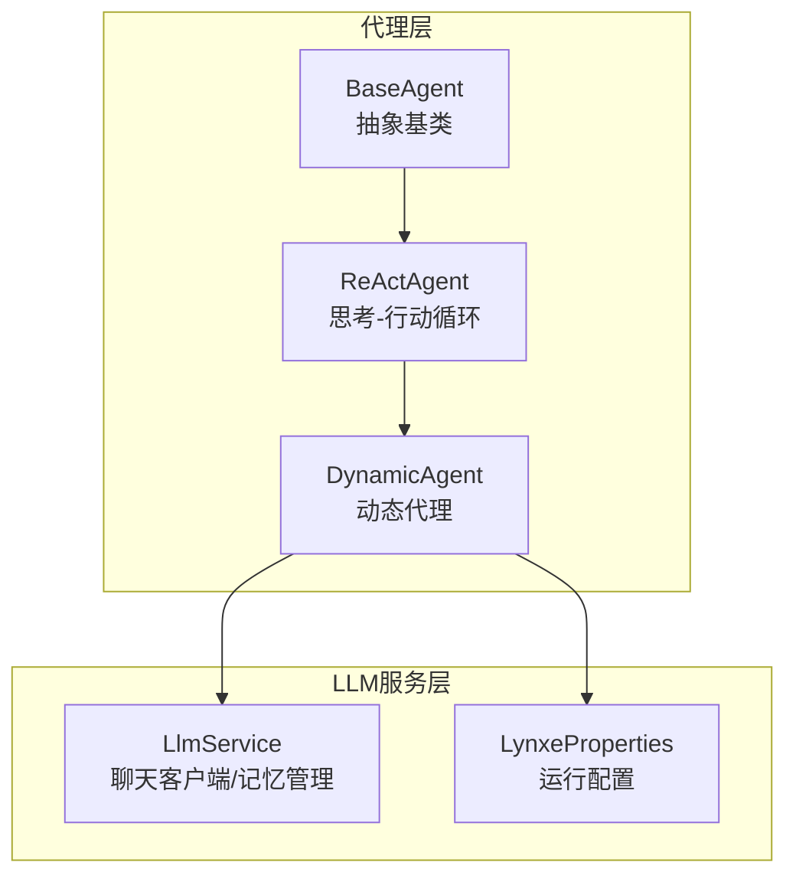
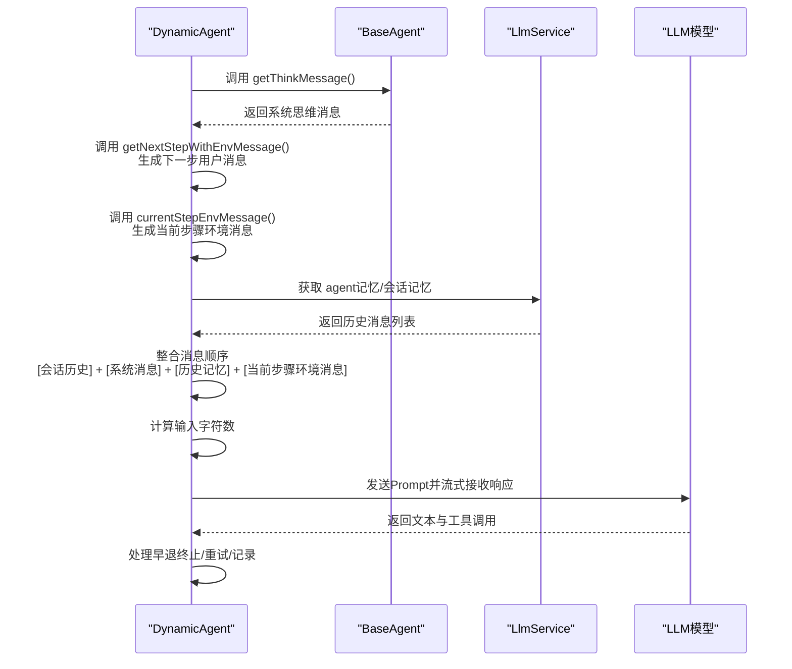
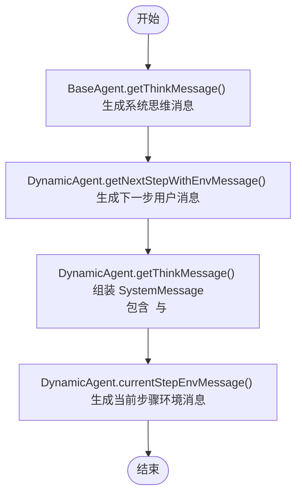
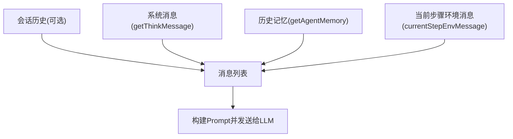
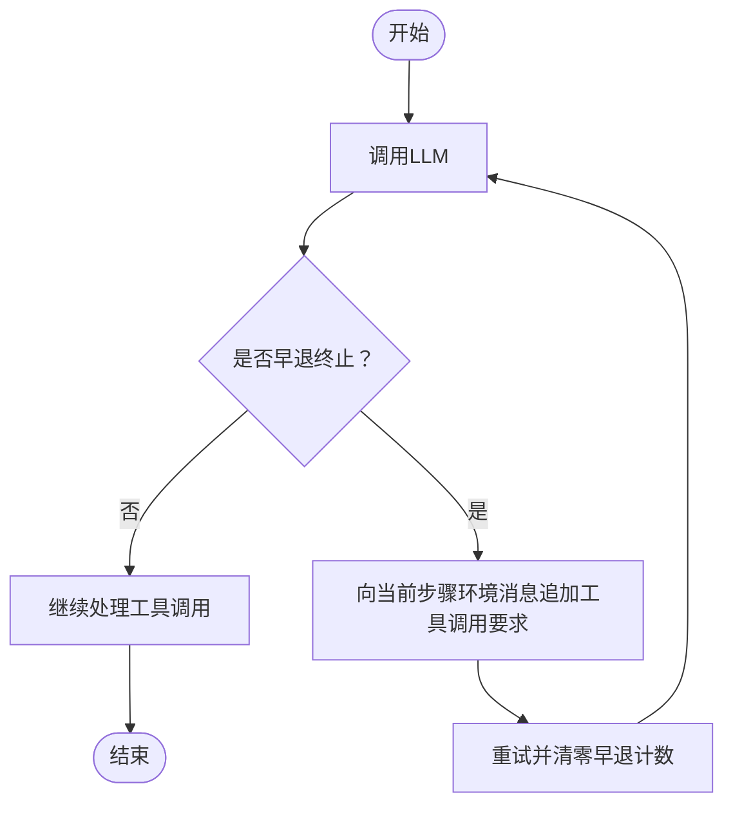
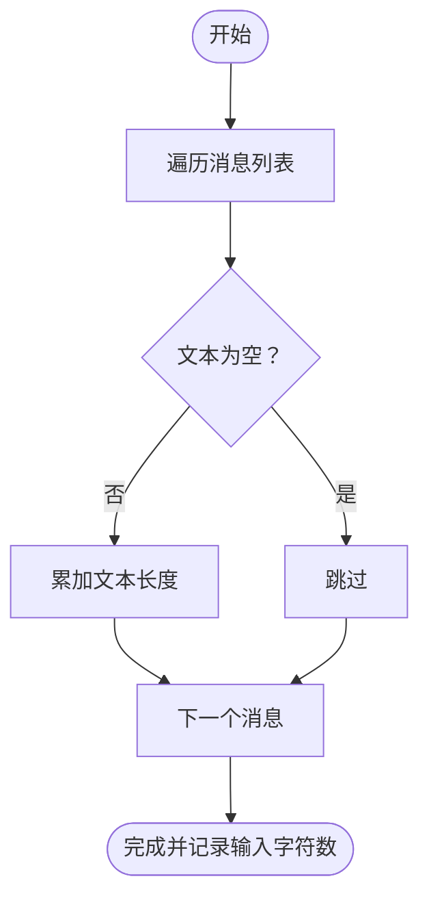
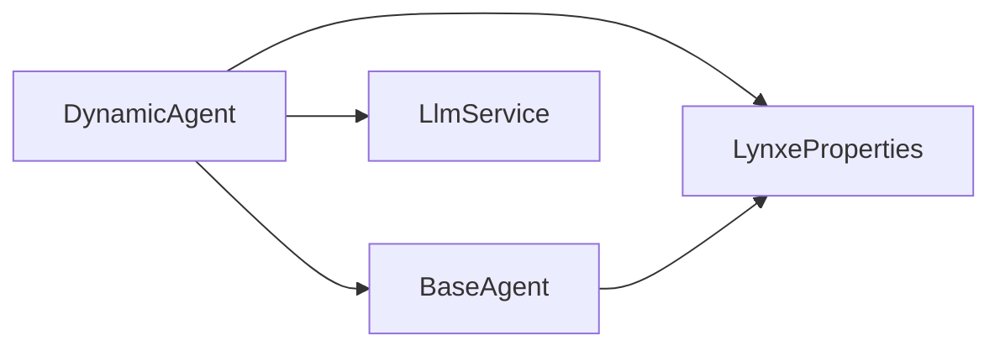

# 消息构建流程

<cite>
**本文引用的文件**
- [DynamicAgent.java](file://src/main/java/com/alibaba/cloud/ai/lynxe/agent/DynamicAgent.java)
- [BaseAgent.java](file://src/main/java/com/alibaba/cloud/ai/lynxe/agent/BaseAgent.java)
- [ReActAgent.java](file://src/main/java/com/alibaba/cloud/ai/lynxe/agent/ReActAgent.java)
- [LlmService.java](file://src/main/java/com/alibaba/cloud/ai/lynxe/llm/LlmService.java)
- [LynxeProperties.java](file://src/main/java/com/alibaba/cloud/ai/lynxe/config/LynxeProperties.java)
</cite>

## 目录
1. [简介](#简介)
2. [项目结构](#项目结构)
3. [核心组件](#核心组件)
4. [架构总览](#架构总览)
5. [详细组件分析](#详细组件分析)
6. [依赖关系分析](#依赖关系分析)
7. [性能考量](#性能考量)
8. [故障排查指南](#故障排查指南)
9. [结论](#结论)

## 简介
本文件聚焦于AI代理的消息构建流程，系统性说明getThinkMessage()与currentStepEnvMessage()方法如何协同工作，以构建面向LLM的请求消息。文档覆盖系统消息、历史记忆、当前环境数据与会话历史的整合方式；解释消息顺序对LLM行为的影响及如何通过消息构造引导代理决策；阐述消息字符数计算机制及其对性能的影响；并提供不同场景下的消息结构变化示例与优化建议。

## 项目结构
- 动态代理（DynamicAgent）继承自ReActAgent，ReActAgent再继承自BaseAgent，形成“思考-行动”循环。
- LlmService负责对话记忆、会话记忆与模型客户端的统一管理。
- LynxeProperties提供运行期配置，如调试模式、并行工具调用、最大步数等。

图表来源
- [BaseAgent.java](file://src/main/java/com/alibaba/cloud/ai/lynxe/agent/BaseAgent.java#L73-L120)
- [ReActAgent.java](file://src/main/java/com/alibaba/cloud/ai/lynxe/agent/ReActAgent.java#L30-L70)
- [DynamicAgent.java](file://src/main/java/com/alibaba/cloud/ai/lynxe/agent/DynamicAgent.java#L78-L120)
- [LlmService.java](file://src/main/java/com/alibaba/cloud/ai/lynxe/llm/LlmService.java#L1-L120)
- [LynxeProperties.java](file://src/main/java/com/alibaba/cloud/ai/lynxe/config/LynxeProperties.java#L81-L88)

章节来源
- [BaseAgent.java](file://src/main/java/com/alibaba/cloud/ai/lynxe/agent/BaseAgent.java#L73-L120)
- [ReActAgent.java](file://src/main/java/com/alibaba/cloud/ai/lynxe/agent/ReActAgent.java#L30-L70)
- [DynamicAgent.java](file://src/main/java/com/alibaba/cloud/ai/lynxe/agent/DynamicAgent.java#L78-L120)
- [LlmService.java](file://src/main/java/com/alibaba/cloud/ai/lynxe/llm/LlmService.java#L1-L120)
- [LynxeProperties.java](file://src/main/java/com/alibaba/cloud/ai/lynxe/config/LynxeProperties.java#L81-L88)

## 核心组件
- BaseAgent.getThinkMessage(): 构建系统级思维提示，包含操作系统信息、日期、计划状态、当前步骤要求、额外参数、响应规则等，并根据配置决定是否输出调试细节与并行工具调用规则。
- DynamicAgent.getThinkMessage(): 在父类基础上，将“下一步带环境信息”的用户消息拼接为AgentInfo，形成完整的SystemMessage。
- DynamicAgent.currentStepEnvMessage(): 基于合并后的上下文数据生成当前步骤的环境信息消息，并标记元数据以便后续识别。
- DynamicAgent.executeWithRetry(): 统一构建消息列表，整合历史记忆、会话历史、系统消息与当前环境消息，计算字符数，调用LLM并处理早退终止与重试逻辑。

章节来源
- [BaseAgent.java](file://src/main/java/com/alibaba/cloud/ai/lynxe/agent/BaseAgent.java#L147-L221)
- [DynamicAgent.java](file://src/main/java/com/alibaba/cloud/ai/lynxe/agent/DynamicAgent.java#L1351-L1365)
- [DynamicAgent.java](file://src/main/java/com/alibaba/cloud/ai/lynxe/agent/DynamicAgent.java#L1371-L1381)
- [DynamicAgent.java](file://src/main/java/com/alibaba/cloud/ai/lynxe/agent/DynamicAgent.java#L231-L430)

## 架构总览
下图展示了消息构建的关键路径：系统消息由BaseAgent生成，DynamicAgent将其与“下一步带环境信息”的用户消息组合；随后在executeWithRetry中整合历史记忆与会话历史，最终形成Prompt提交给LLM。

图表来源
- [DynamicAgent.java](file://src/main/java/com/alibaba/cloud/ai/lynxe/agent/DynamicAgent.java#L231-L430)
- [BaseAgent.java](file://src/main/java/com/alibaba/cloud/ai/lynxe/agent/BaseAgent.java#L147-L221)
- [LlmService.java](file://src/main/java/com/alibaba/cloud/ai/lynxe/llm/LlmService.java#L233-L268)

## 详细组件分析

### getThinkMessage() 与 currentStepEnvMessage() 协同工作机制
- BaseAgent.getThinkMessage():
  - 生成系统信息（OS、时间）、计划状态、当前步骤要求、额外参数、响应规则（调试/并行工具调用）。
  - 将这些变量注入模板后返回SystemMessage。
- DynamicAgent.getThinkMessage():
  - 调用父类getThinkMessage()得到基础系统消息。
  - 同时生成“下一步带环境信息”的用户消息（getNextStepWithEnvMessage），并将其作为AgentInfo拼接到SystemMessage中。
- DynamicAgent.currentStepEnvMessage():
  - 使用PromptTemplate基于合并数据生成当前步骤的环境信息消息，并设置元数据键以标识该消息为“当前步骤环境数据”。

图表来源
- [BaseAgent.java](file://src/main/java/com/alibaba/cloud/ai/lynxe/agent/BaseAgent.java#L147-L221)
- [DynamicAgent.java](file://src/main/java/com/alibaba/cloud/ai/lynxe/agent/DynamicAgent.java#L1333-L1365)
- [DynamicAgent.java](file://src/main/java/com/alibaba/cloud/ai/lynxe/agent/DynamicAgent.java#L1371-L1381)

章节来源
- [BaseAgent.java](file://src/main/java/com/alibaba/cloud/ai/lynxe/agent/BaseAgent.java#L147-L221)
- [DynamicAgent.java](file://src/main/java/com/alibaba/cloud/ai/lynxe/agent/DynamicAgent.java#L1333-L1365)
- [DynamicAgent.java](file://src/main/java/com/alibaba/cloud/ai/lynxe/agent/DynamicAgent.java#L1371-L1381)

### 消息整合与顺序
在executeWithRetry中，消息被按以下顺序组装：
1) 可选的会话历史（conversation history）
2) 系统消息（think message）
3) 历史记忆（agent memory）
4) 当前步骤环境消息（current step env message）

图表来源
- [DynamicAgent.java](file://src/main/java/com/alibaba/cloud/ai/lynxe/agent/DynamicAgent.java#L288-L320)

章节来源
- [DynamicAgent.java](file://src/main/java/com/alibaba/cloud/ai/lynxe/agent/DynamicAgent.java#L288-L320)

### 早退终止与强制工具调用
当LLM仅返回文本而未调用工具时，系统检测到“早退终止”，并在后续尝试中向当前步骤环境消息追加明确的工具调用要求，以强制模型执行工具调用。

图表来源
- [DynamicAgent.java](file://src/main/java/com/alibaba/cloud/ai/lynxe/agent/DynamicAgent.java#L261-L279)
- [DynamicAgent.java](file://src/main/java/com/alibaba/cloud/ai/lynxe/agent/DynamicAgent.java#L380-L409)

章节来源
- [DynamicAgent.java](file://src/main/java/com/alibaba/cloud/ai/lynxe/agent/DynamicAgent.java#L261-L279)
- [DynamicAgent.java](file://src/main/java/com/alibaba/cloud/ai/lynxe/agent/DynamicAgent.java#L380-L409)

### 消息字符数计算与性能影响
在构建Prompt之前，系统会对所有消息进行字符数统计，用于监控输入大小与成本控制。计算逻辑遍历消息列表，累加非空文本长度。

图表来源
- [DynamicAgent.java](file://src/main/java/com/alibaba/cloud/ai/lynxe/agent/DynamicAgent.java#L346-L354)

章节来源
- [DynamicAgent.java](file://src/main/java/com/alibaba/cloud/ai/lynxe/agent/DynamicAgent.java#L346-L354)

### 不同场景下的消息结构变化
- 场景A：首次尝试
  - 消息顺序：[会话历史] + [系统消息] + [历史记忆] + [当前步骤环境消息]
- 场景B：早退终止后重试
  - 在当前步骤环境消息末尾追加“必须调用至少一个工具”的显式要求，以引导模型执行工具调用。
- 场景C：禁用会话记忆
  - 跳过会话历史的加载与插入，仅保留系统消息、历史记忆与当前步骤环境消息。

章节来源
- [DynamicAgent.java](file://src/main/java/com/alibaba/cloud/ai/lynxe/agent/DynamicAgent.java#L292-L320)
- [DynamicAgent.java](file://src/main/java/com/alibaba/cloud/ai/lynxe/agent/DynamicAgent.java#L261-L279)

## 依赖关系分析
- DynamicAgent依赖BaseAgent生成系统思维消息，并通过getNextStepWithEnvMessage()与currentStepEnvMessage()补充下一步与当前步骤环境信息。
- DynamicAgent通过LlmService获取agent记忆与会话记忆，并在必要时将用户请求写入会话记忆。
- LynxeProperties控制调试模式、并行工具调用、最大步数、会话记忆开关等关键行为。

图表来源
- [DynamicAgent.java](file://src/main/java/com/alibaba/cloud/ai/lynxe/agent/DynamicAgent.java#L78-L120)
- [BaseAgent.java](file://src/main/java/com/alibaba/cloud/ai/lynxe/agent/BaseAgent.java#L73-L120)
- [LlmService.java](file://src/main/java/com/alibaba/cloud/ai/lynxe/llm/LlmService.java#L1-L120)
- [LynxeProperties.java](file://src/main/java/com/alibaba/cloud/ai/lynxe/config/LynxeProperties.java#L81-L88)

章节来源
- [DynamicAgent.java](file://src/main/java/com/alibaba/cloud/ai/lynxe/agent/DynamicAgent.java#L78-L120)
- [BaseAgent.java](file://src/main/java/com/alibaba/cloud/ai/lynxe/agent/BaseAgent.java#L73-L120)
- [LlmService.java](file://src/main/java/com/alibaba/cloud/ai/lynxe/llm/LlmService.java#L1-L120)
- [LynxeProperties.java](file://src/main/java/com/alibaba/cloud/ai/lynxe/config/LynxeProperties.java#L81-L88)

## 性能考量
- 输入字符数统计：在调用LLM前对消息进行字符数统计，有助于成本控制与阈值预警。
- 会话历史与历史记忆：启用会话记忆时，需注意消息窗口大小与字符上限，避免超出模型上下文限制。
- 早退终止与重试：系统内置指数回退与早退终止阈值，防止无限重试导致资源浪费。
- 并行工具调用：根据配置决定响应规则，合理设置可提升效率但需确保模型支持相应格式。

章节来源
- [DynamicAgent.java](file://src/main/java/com/alibaba/cloud/ai/lynxe/agent/DynamicAgent.java#L346-L354)
- [DynamicAgent.java](file://src/main/java/com/alibaba/cloud/ai/lynxe/agent/DynamicAgent.java#L490-L508)
- [LynxeProperties.java](file://src/main/java/com/alibaba/cloud/ai/lynxe/config/LynxeProperties.java#L270-L280)

## 故障排查指南
- 早退终止频繁：检查模型是否正确配置为必须调用工具；查看日志中的早退计数与阈值触发。
- 无工具调用：确认在重试时已向当前步骤环境消息追加显式工具调用要求。
- 会话历史缺失：确认已启用会话记忆且conversationId有效；检查异常捕获与降级逻辑。
- 字符数过高：精简历史记忆或会话历史，或调整消息顺序以降低输入规模。

章节来源
- [DynamicAgent.java](file://src/main/java/com/alibaba/cloud/ai/lynxe/agent/DynamicAgent.java#L380-L409)
- [DynamicAgent.java](file://src/main/java/com/alibaba/cloud/ai/lynxe/agent/DynamicAgent.java#L292-L320)
- [DynamicAgent.java](file://src/main/java/com/alibaba/cloud/ai/lynxe/agent/DynamicAgent.java#L346-L354)

## 结论
通过getThinkMessage()与currentStepEnvMessage()的协同，DynamicAgent能够将系统思维、下一步指令、当前环境数据与历史记忆有序整合，形成高质量的LLM请求。消息顺序与元数据标记对LLM行为具有直接影响，配合字符数统计与早退终止策略，可在保证决策质量的同时控制成本与性能风险。开发者应结合实际场景优化消息结构，减少冗余信息，提升上下文相关性与可读性。