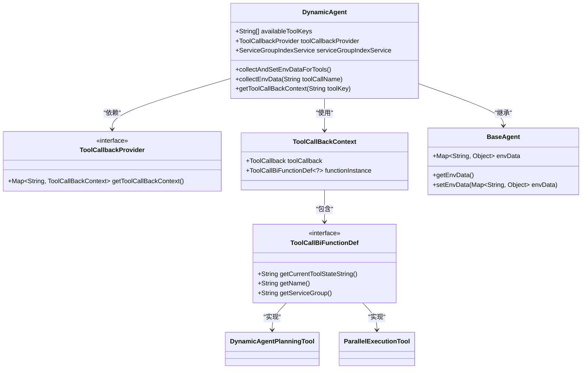
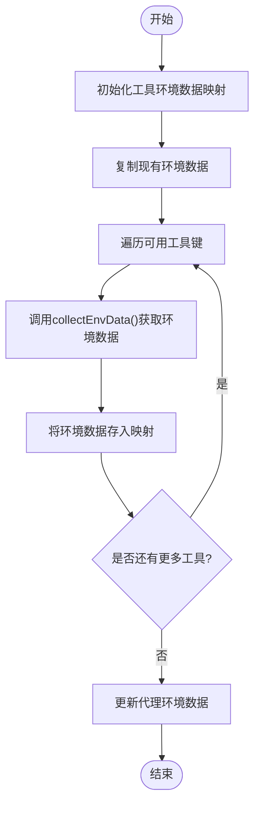
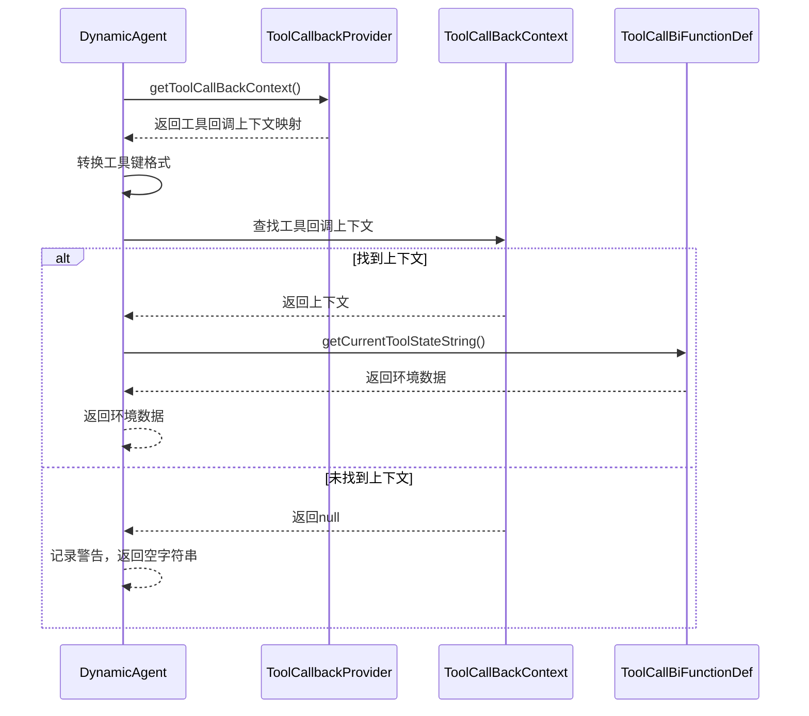
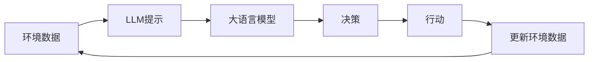
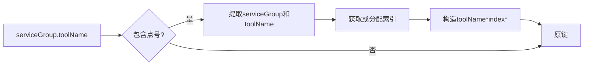

# 环境数据收集

<cite>
**本文档中引用的文件**  
- [DynamicAgent.java](file://src/main/java/com/alibaba/cloud/ai/lynxe/agent/DynamicAgent.java)
- [BaseAgent.java](file://src/main/java/com/alibaba/cloud/ai/lynxe/agent/BaseAgent.java)
- [PlanningFactory.java](file://src/main/java/com/alibaba/cloud/ai/lynxe/planning/PlanningFactory.java)
- [ToolCallbackProvider.java](file://src/main/java/com/alibaba/cloud/ai/lynxe/agent/ToolCallbackProvider.java)
- [ServiceGroupIndexService.java](file://src/main/java/com/alibaba/cloud/ai/lynxe/runtime/service/ServiceGroupIndexService.java)
- [DynamicAgentPlanningTool.java](file://src/main/java/com/alibaba/cloud/ai/lynxe/tool/DynamicAgentPlanningTool.java)
- [ParallelExecutionTool.java](file://src/main/java/com/alibaba/cloud/ai/lynxe/tool/mapreduce/ParallelExecutionTool.java)
</cite>

## 目录
1. [引言](#引言)
2. [核心机制分析](#核心机制分析)
3. [collectAndSetEnvDataForTools() 方法详解](#collectandsetenvdatafortools-方法详解)
4. [环境数据在代理决策中的作用](#环境数据在代理决策中的作用)
5. [环境数据结构与传递方式](#环境数据结构与传递方式)
6. [动态工具调用支持](#动态工具调用支持)
7. [调试指南](#调试指南)
8. [结论](#结论)

## 引言

AI代理环境数据收集机制是确保代理能够基于最新上下文做出智能决策的核心组件。该机制通过`collectAndSetEnvDataForTools()`方法实现，能够从工具回调上下文中获取环境数据并将其注入到当前执行环境中。这种设计使得代理能够感知其执行状态的变化，从而影响后续的LLM调用决策。本文档将深入分析这一机制的实现原理、作用和调试方法。

## 核心机制分析

环境数据收集机制的核心是`DynamicAgent`类中的`collectAndSetEnvDataForTools()`方法。该方法通过`ToolCallbackProvider`获取所有可用工具的回调上下文，并从中提取每个工具的当前状态信息。这些信息被整合到代理的环境数据映射中，供后续的LLM调用使用。



**图表来源**
- [DynamicAgent.java](file://src/main/java/com/alibaba/cloud/ai/lynxe/agent/DynamicAgent.java#L1451-L1466)
- [ToolCallbackProvider.java](file://src/main/java/com/alibaba/cloud/ai/lynxe/agent/ToolCallbackProvider.java#L24)
- [PlanningFactory.java](file://src/main/java/com/alibaba/cloud/ai/lynxe/planning/PlanningFactory.java#L219-L238)
- [BaseAgent.java](file://src/main/java/com/alibaba/cloud/ai/lynxe/agent/BaseAgent.java#L526-L532)

## collectAndSetEnvDataForTools() 方法详解

`collectAndSetEnvDataForTools()`方法是环境数据收集的核心实现。该方法的工作流程如下：

1. 创建一个新的工具环境数据映射
2. 将现有的环境数据复制到新映射中
3. 遍历所有可用的工具键
4. 对每个工具调用`collectEnvData()`方法获取其环境数据
5. 将获取的环境数据存储到映射中
6. 使用新映射更新代理的环境数据



**图表来源**
- [DynamicAgent.java](file://src/main/java/com/alibaba/cloud/ai/lynxe/agent/DynamicAgent.java#L1451-L1466)

**本节来源**
- [DynamicAgent.java](file://src/main/java/com/alibaba/cloud/ai/lynxe/agent/DynamicAgent.java#L1451-L1466)

### collectEnvData() 方法实现

`collectEnvData()`方法负责从特定工具的回调上下文中获取环境数据。其实现包括以下关键步骤：

1. 从`ToolCallbackProvider`获取工具回调上下文映射
2. 将工具调用名称转换为合格的键格式（如果需要）
3. 在上下文映射中查找对应的工具回调上下文
4. 如果找到上下文，则调用工具实例的`getCurrentToolStateString()`方法获取环境数据
5. 如果未找到上下文，则返回空字符串



**图表来源**
- [DynamicAgent.java](file://src/main/java/com/alibaba/cloud/ai/lynxe/agent/DynamicAgent.java#L1424-L1449)

**本节来源**
- [DynamicAgent.java](file://src/main/java/com/alibaba/cloud/ai/lynxe/agent/DynamicAgent.java#L1424-L1449)

## 环境数据在代理决策中的作用

环境数据在代理决策过程中扮演着至关重要的角色。通过`currentStepEnvMessage()`方法，代理能够将当前步骤的环境信息整合到LLM提示中，从而影响后续的决策。



**图表来源**
- [DynamicAgent.java](file://src/main/java/com/alibaba/cloud/ai/lynxe/agent/DynamicAgent.java#L1371-L1380)

环境数据通过以下方式影响LLM调用：

1. **上下文感知**：LLM能够了解代理当前的执行状态和可用工具的状态
2. **决策优化**：基于最新的环境信息，LLM可以做出更合理的工具调用决策
3. **状态跟踪**：代理能够跟踪其执行进度和已完成的步骤
4. **错误恢复**：当出现问题时，LLM可以根据环境数据制定恢复策略

**本节来源**
- [DynamicAgent.java](file://src/main/java/com/alibaba/cloud/ai/lynxe/agent/DynamicAgent.java#L1371-L1380)

## 环境数据结构与传递方式

环境数据以键值对的形式存储在`Map<String, Object>`中。每个工具的环境数据通常包含其当前状态信息，这些信息通过`getCurrentToolStateString()`方法获取。

### 环境数据结构示例

对于`DynamicAgentPlanningTool`，环境数据可能包含：

```json
{
  "dynamic_agent_planning": "Current dynamic agent plan: [plan details]"
}
```

对于`ParallelExecutionTool`，环境数据可能包含：

```json
{
  "parallel_execution": "[planned functions count] functions registered"
}
```

### 数据传递流程

环境数据的传递流程如下：

1. 工具执行时更新其内部状态
2. `collectEnvData()`方法调用工具的`getCurrentToolStateString()`方法
3. 获取的字符串数据被存储在环境数据映射中
4. 环境数据映射被用于构建LLM提示
5. LLM基于环境数据做出决策

```mermaid
flowchart TB
subgraph "工具执行"
A[工具执行] --> B[更新内部状态]
end
subgraph "数据收集"
B --> C[调用getCurrentToolStateString()]
C --> D[获取状态字符串]
end
subgraph "数据整合"
D --> E[存入环境数据映射]
E --> F[更新代理环境数据]
end
subgraph "决策"
F --> G[构建LLM提示]
G --> H[LLM决策]
end
```

**图表来源**
- [DynamicAgentPlanningTool.java](file://src/main/java/com/alibaba/cloud/ai/lynxe/tool/DynamicAgentPlanningTool.java#L340-L345)
- [ParallelExecutionTool.java](file://src/main/java/com/alibaba/cloud/ai/lynxe/tool/mapreduce/ParallelExecutionTool.java#L504-L509)
- [DynamicAgent.java](file://src/main/java/com/alibaba/cloud/ai/lynxe/agent/DynamicAgent.java#L1451-L1466)

**本节来源**
- [DynamicAgentPlanningTool.java](file://src/main/java/com/alibaba/cloud/ai/lynxe/tool/DynamicAgentPlanningTool.java#L340-L345)
- [ParallelExecutionTool.java](file://src/main/java/com/alibaba/cloud/ai/lynxe/tool/mapreduce/ParallelExecutionTool.java#L504-L509)

## 动态工具调用支持

环境数据收集机制为动态工具调用提供了关键支持。通过`ServiceGroupIndexService`，系统能够处理工具键的格式转换，从而支持更灵活的工具调用模式。

### 工具键格式转换

系统支持两种工具键格式：

1. **服务组格式**：`serviceGroup.toolName`
2. **合格键格式**：`toolName*index*`

`ServiceGroupIndexService`负责将服务组格式转换为合格键格式：



**图表来源**
- [ServiceGroupIndexService.java](file://src/main/java/com/alibaba/cloud/ai/lynxe/runtime/service/ServiceGroupIndexService.java#L105-L130)

**本节来源**
- [ServiceGroupIndexService.java](file://src/main/java/com/alibaba/cloud/ai/lynxe/runtime/service/ServiceGroupIndexService.java#L105-L130)

### 上下文感知的代理行为

通过环境数据收集，代理能够实现上下文感知的行为：

1. **状态感知**：代理了解每个工具的当前状态
2. **进度跟踪**：代理能够跟踪任务的完成进度
3. **条件决策**：基于环境数据，代理可以做出条件性的决策
4. **自适应行为**：代理能够根据环境变化调整其行为策略

这种机制使得代理能够更好地适应复杂的任务场景，实现更智能的自动化。

## 调试指南

为了帮助开发者调试环境数据收集问题，以下提供了一些实用的指导。

### 验证数据完整性

1. **检查工具回调上下文**：
   - 确保`ToolCallbackProvider`返回的映射包含所有预期的工具
   - 验证工具键的格式是否正确

2. **验证环境数据收集**：
   - 检查`collectAndSetEnvDataForTools()`方法是否被正确调用
   - 验证环境数据映射是否包含预期的键值对

3. **日志分析**：
   - 查找`collectEnvData called for tool`日志条目
   - 检查`No context found for tool`警告信息

### 常见问题排查

| 问题 | 可能原因 | 解决方案 |
|------|--------|---------|
| 环境数据为空 | 工具回调上下文未正确设置 | 确保`setToolCallbackProvider()`被调用 |
| 工具键不匹配 | 格式转换问题 | 检查`ServiceGroupIndexService`的配置 |
| 状态信息缺失 | `getCurrentToolStateString()`未正确实现 | 验证工具类的实现 |
| 数据未更新 | `setEnvData()`未被调用 | 检查`collectAndSetEnvDataForTools()`的执行流程 |

### 调试代码示例

```java
// 调试环境数据收集
public void debugEnvDataCollection() {
    // 获取当前环境数据
    Map<String, Object> currentEnvData = getEnvData();
    log.info("Current environment data: {}", currentEnvData);
    
    // 检查工具回调提供者
    if (toolCallbackProvider == null) {
        log.error("ToolCallbackProvider is null");
        return;
    }
    
    // 获取工具回调上下文
    Map<String, ToolCallBackContext> contextMap = toolCallbackProvider.getToolCallBackContext();
    log.info("Tool callback context size: {}", contextMap.size());
    
    // 检查每个可用工具
    for (String toolKey : availableToolKeys) {
        ToolCallBackContext context = contextMap.get(toolKey);
        if (context == null) {
            log.warn("No context found for tool: {}", toolKey);
        } else {
            String state = context.getFunctionInstance().getCurrentToolStateString();
            log.info("Tool {} state: {}", toolKey, state);
        }
    }
}
```

**本节来源**
- [DynamicAgent.java](file://src/main/java/com/alibaba/cloud/ai/lynxe/agent/DynamicAgent.java#L1424-L1466)
- [ToolCallbackProvider.java](file://src/main/java/com/alibaba/cloud/ai/lynxe/agent/ToolCallbackProvider.java#L24)

## 结论

环境数据收集机制是AI代理系统中的关键组件，它通过`collectAndSetEnvDataForTools()`方法实现了从工具回调上下文到代理执行环境的数据流动。这一机制不仅支持了动态工具调用，还为上下文感知的代理行为提供了基础。通过理解这一机制的实现原理和调试方法，开发者可以更好地利用和优化AI代理的功能。