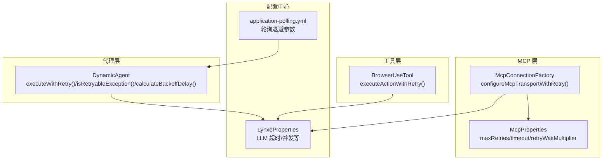
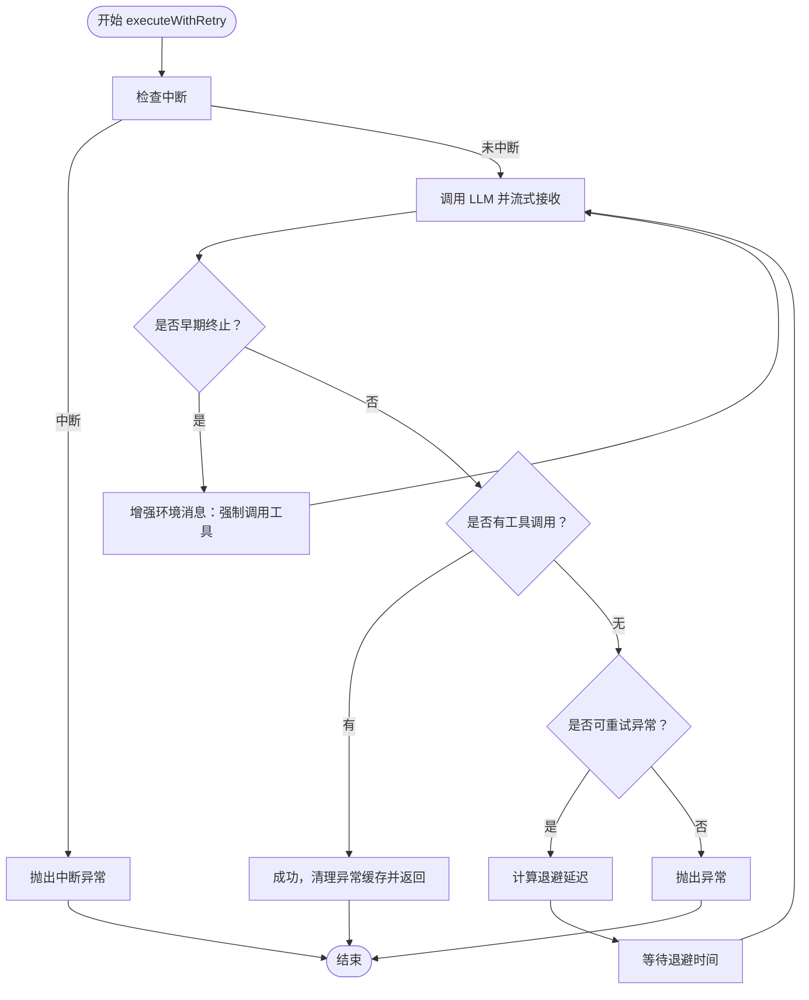
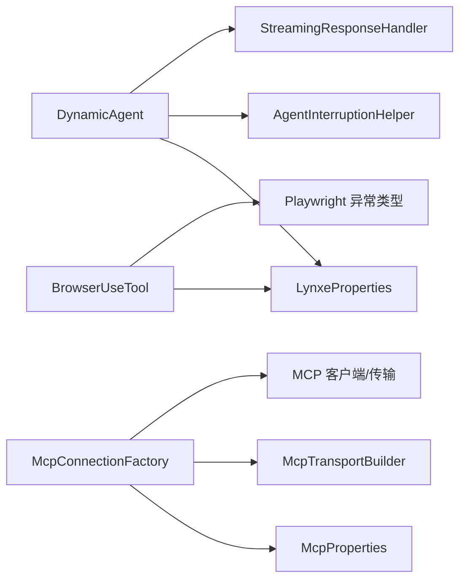

# 重试机制

<cite>
**本文引用的文件列表**
- [DynamicAgent.java](file://src/main/java/com/alibaba/cloud/ai/lynxe/agent/DynamicAgent.java)
- [BrowserUseTool.java](file://src/main/java/com/alibaba/cloud/ai/lynxe/tool/browser/BrowserUseTool.java)
- [McpConnectionFactory.java](file://src/main/java/com/alibaba/cloud/ai/lynxe/mcp/service/McpConnectionFactory.java)
- [McpProperties.java](file://src/main/java/com/alibaba/cloud/ai/lynxe/mcp/config/McpProperties.java)
- [LynxeProperties.java](file://src/main/java/com/alibaba/cloud/ai/lynxe/config/LynxeProperties.java)
- [application-polling.yml](file://src/main/resources/application-polling.yml)
- [NetworkException.java](file://src/main/java/com/alibaba/cloud/ai/lynxe/model/exception/NetworkException.java)
- [RateLimitException.java](file://src/main/java/com/alibaba/cloud/ai/lynxe/model/exception/RateLimitException.java)
- [AgentInterruptionHelper.java](file://src/main/java/com/alibaba/cloud/ai/lynxe/runtime/service/AgentInterruptionHelper.java)
- [TaskInterruptionCheckerService.java](file://src/main/java/com/alibaba/cloud/ai/lynxe/runtime/service/TaskInterruptionCheckerService.java)
- [TaskInterruptionManager.java](file://src/main/java/com/alibaba/cloud/ai/lynxe/runtime/service/TaskInterruptionManager.java)
</cite>

## 目录
1. [简介](#简介)
2. [项目结构与重试相关模块](#项目结构与重试相关模块)
3. [核心组件与职责](#核心组件与职责)
4. [架构总览](#架构总览)
5. [详细组件分析](#详细组件分析)
6. [依赖关系分析](#依赖关系分析)
7. [性能与可靠性考量](#性能与可靠性考量)
8. [故障排查指南](#故障排查指南)
9. [结论](#结论)
10. [附录：配置项与最佳实践](#附录配置项与最佳实践)

## 简介
本文件系统化梳理 JManus 中 AI 代理的重试机制，重点覆盖以下方面：
- executeWithRetry() 的工作原理、重试次数控制与异常处理策略
- 指数退避算法 calculateBackoffDelay() 的实现细节
- isRetryableException() 对网络类异常的识别规则
- 重试过程中的消息增强机制（针对“早期终止”场景）
- 配置项（最大重试次数、超时、退避参数等）
- 优化建议：如何在重试频率与系统负载之间取得平衡

## 项目结构与重试相关模块
- 代理层重试：DynamicAgent 在思考阶段执行带重试的 LLM 调用，包含指数退避、异常识别、早期终止检测与消息增强。
- 工具层重试：BrowserUseTool 对浏览器动作执行提供有限次重试，区分超时与运行时异常，避免对不可重试错误进行无意义重试。
- MCP 连接重试：McpConnectionFactory 对 MCP 客户端初始化提供带 DNS 错误短路判断的重试流程，支持增量等待与资源清理。
- 配置中心：LynxeProperties/McpProperties 提供重试次数、超时、退避等关键参数；application-polling.yml 提供计划轮询相关的退避参数。



图表来源
- [DynamicAgent.java](file://src/main/java/com/alibaba/cloud/ai/lynxe/agent/DynamicAgent.java#L232-L508)
- [BrowserUseTool.java](file://src/main/java/com/alibaba/cloud/ai/lynxe/tool/browser/BrowserUseTool.java#L293-L359)
- [McpConnectionFactory.java](file://src/main/java/com/alibaba/cloud/ai/lynxe/mcp/service/McpConnectionFactory.java#L112-L187)
- [McpProperties.java](file://src/main/java/com/alibaba/cloud/ai/lynxe/mcp/config/McpProperties.java#L33-L48)
- [LynxeProperties.java](file://src/main/java/com/alibaba/cloud/ai/lynxe/config/LynxeProperties.java#L310-L329)
- [application-polling.yml](file://src/main/resources/application-polling.yml#L1-L18)

章节来源
- [DynamicAgent.java](file://src/main/java/com/alibaba/cloud/ai/lynxe/agent/DynamicAgent.java#L232-L508)
- [BrowserUseTool.java](file://src/main/java/com/alibaba/cloud/ai/lynxe/tool/browser/BrowserUseTool.java#L293-L359)
- [McpConnectionFactory.java](file://src/main/java/com/alibaba/cloud/ai/lynxe/mcp/service/McpConnectionFactory.java#L112-L187)
- [McpProperties.java](file://src/main/java/com/alibaba/cloud/ai/lynxe/mcp/config/McpProperties.java#L33-L48)
- [LynxeProperties.java](file://src/main/java/com/alibaba/cloud/ai/lynxe/config/LynxeProperties.java#L310-L329)
- [application-polling.yml](file://src/main/resources/application-polling.yml#L1-L18)

## 核心组件与职责
- DynamicAgent.executeWithRetry(maxRetries)
  - 控制重试次数上限，记录异常链，按指数退避等待后重试
  - 识别网络类可重试异常，非网络类异常直接抛出
  - 检测“早期终止”（仅文本响应，未调用工具），通过增强提示消息强制模型调用工具
  - 支持中断检查，避免在用户请求中断时继续重试
- DynamicAgent.calculateBackoffDelay(attempt)
  - 指数退避：2^(attempt-1) × 基础延迟，上限限制
- DynamicAgent.isRetryableException(e)
  - 基于异常消息关键字识别网络相关错误（解析失败、超时、连接、DNS、WebClient 请求异常等）
- BrowserUseTool.executeActionWithRetry(executor, actionName)
  - 对浏览器动作执行提供有限次重试（默认最多 2 次），区分超时与运行时异常，避免对“浏览器/上下文已关闭”等不可重试错误重试
- McpConnectionFactory.configureMcpTransportWithRetry(...)
  - 对 MCP 初始化提供带 DNS 短路判断的重试，增量等待，失败清理资源，最终返回空或抛出异常

章节来源
- [DynamicAgent.java](file://src/main/java/com/alibaba/cloud/ai/lynxe/agent/DynamicAgent.java#L232-L508)
- [BrowserUseTool.java](file://src/main/java/com/alibaba/cloud/ai/lynxe/tool/browser/BrowserUseTool.java#L293-L359)
- [McpConnectionFactory.java](file://src/main/java/com/alibaba/cloud/ai/lynxe/mcp/service/McpConnectionFactory.java#L112-L187)

## 架构总览
下图展示代理层重试主流程与早期终止增强机制：

```mermaid
sequenceDiagram
participant Agent as "DynamicAgent"
participant LLM as "LLM/流式响应处理器"
participant Interr as "AgentInterruptionHelper"
participant Backoff as "指数退避"
participant Enhance as "消息增强(早期终止)"
Agent->>Interr : 每次尝试前检查中断
alt 未中断
Agent->>LLM : 发送提示词并流式接收
LLM-->>Agent : 返回响应/工具调用/早期终止标记
opt 早期终止
Agent->>Enhance : 追加显式工具调用要求
Enhance-->>Agent : 增强后的环境消息
end
opt 可重试网络异常
Agent->>Backoff : 计算退避延迟
Backoff-->>Agent : 等待指定毫秒
Agent->>LLM : 重试
end
opt 成功
Agent-->>Agent : 清理异常缓存并返回成功
else 失败且达到最大重试
Agent-->>Agent : 记录最新异常并返回失败
end
else 已中断
Agent-->>Agent : 抛出中断异常
end
```

图表来源
- [DynamicAgent.java](file://src/main/java/com/alibaba/cloud/ai/lynxe/agent/DynamicAgent.java#L232-L508)
- [AgentInterruptionHelper.java](file://src/main/java/com/alibaba/cloud/ai/lynxe/runtime/service/AgentInterruptionHelper.java#L44-L64)
- [TaskInterruptionCheckerService.java](file://src/main/java/com/alibaba/cloud/ai/lynxe/runtime/service/TaskInterruptionCheckerService.java#L76-L82)

## 详细组件分析

### DynamicAgent.executeWithRetry() 重试流程
- 重试次数控制
  - 参数 maxRetries 决定最大尝试次数；每次尝试前检查中断信号
  - 达到最大次数仍未成功时，记录最新异常并返回 false，由 step() 统一处理
- 异常处理策略
  - isRetryableException() 识别网络相关异常（解析失败、超时、连接、DNS、WebClient 请求异常等）则重试
  - 其他异常（如运行时异常）直接抛出，不重试
- 指数退避
  - calculateBackoffDelay(attempt) 实现指数增长延迟，上限限制，避免雪崩
- 早期终止增强
  - 若检测到“仅文本响应、未调用工具”的早期终止，增加显式工具调用要求，提升后续尝试成功率
  - 连续多次早期终止后，直接失败并返回明确错误，防止无限循环



图表来源
- [DynamicAgent.java](file://src/main/java/com/alibaba/cloud/ai/lynxe/agent/DynamicAgent.java#L232-L508)

章节来源
- [DynamicAgent.java](file://src/main/java/com/alibaba/cloud/ai/lynxe/agent/DynamicAgent.java#L232-L508)

### 指数退避算法 calculateBackoffDelay()
- 计算逻辑
  - 延迟 = min(2^(attempt-1) × 基础延迟, 最大延迟)
  - 通过上限限制避免过长等待导致系统积压
- 使用场景
  - 代理层网络异常重试等待
  - MCP 层增量等待（乘以 retryWaitMultiplier）

章节来源
- [DynamicAgent.java](file://src/main/java/com/alibaba/cloud/ai/lynxe/agent/DynamicAgent.java#L501-L508)
- [McpConnectionFactory.java](file://src/main/java/com/alibaba/cloud/ai/lynxe/mcp/service/McpConnectionFactory.java#L170-L179)
- [McpProperties.java](file://src/main/java/com/alibaba/cloud/ai/lynxe/mcp/config/McpProperties.java#L47-L48)

### isRetryableException() 可重试异常识别
- 识别规则
  - 基于异常消息中包含“解析失败”、“超时”、“连接”、“DNS”、“WebClient 请求异常”、“DNS 解析超时”等关键字
- 作用
  - 将网络波动类错误纳入重试范围，提高鲁棒性
  - 避免对非网络类错误（如运行时异常）进行无意义重试

章节来源
- [DynamicAgent.java](file://src/main/java/com/alibaba/cloud/ai/lynxe/agent/DynamicAgent.java#L487-L500)

### 早期终止增强机制
- 触发条件
  - 流式响应处理器标记“早期终止”，即仅返回文本而未调用任何工具
- 增强策略
  - 在当前步的环境消息中追加显式要求：必须至少调用一次工具
  - 连续多次早期终止后，直接失败并返回明确错误，避免无限重试循环
- 效果
  - 强制模型输出工具调用，提升任务推进效率与稳定性

章节来源
- [DynamicAgent.java](file://src/main/java/com/alibaba/cloud/ai/lynxe/agent/DynamicAgent.java#L261-L279)
- [DynamicAgent.java](file://src/main/java/com/alibaba/cloud/ai/lynxe/agent/DynamicAgent.java#L380-L399)

### BrowserUseTool 动作级重试
- 重试次数与等待
  - 默认最多 2 次重试，每次等待 1 秒
- 异常分支
  - 超时异常：达到最大重试次数后直接抛出
  - Playwright 异常：若消息包含“目标页面/上下文/浏览器已关闭”，视为不可重试，立即抛出
  - 运行时异常：不重试，直接抛出
  - 其他受检异常：包装为运行时异常后不重试
- 适用场景
  - 浏览器自动化动作（导航、点击、输入、截图等）的可靠性保障

章节来源
- [BrowserUseTool.java](file://src/main/java/com/alibaba/cloud/ai/lynxe/tool/browser/BrowserUseTool.java#L293-L359)

### MCP 连接重试与 DNS 短路
- 重试策略
  - 每次尝试构建全新传输与客户端，避免单播 sink 复用问题
  - 增量等待：attempt × retryWaitMultiplier × 1000ms
  - 失败清理：优雅关闭客户端与传输，确保子进程正确退出
- DNS 短路
  - 若异常消息包含“解析失败”、“DNS 解析超时”、“未知主机”等关键字，直接抛出异常，不再重试
- 适用场景
  - 与外部 MCP 服务建立稳定连接，降低因 DNS 或瞬时网络波动导致的失败

章节来源
- [McpConnectionFactory.java](file://src/main/java/com/alibaba/cloud/ai/lynxe/mcp/service/McpConnectionFactory.java#L112-L187)
- [McpProperties.java](file://src/main/java/com/alibaba/cloud/ai/lynxe/mcp/config/McpProperties.java#L33-L48)

## 依赖关系分析
- 代理层依赖
  - LynxeProperties：提供 LLM 读超时、并发等通用配置
  - AgentInterruptionHelper/TaskInterruptionCheckerService/TaskInterruptionManager：统一的中断检查与状态管理
  - StreamingResponseHandler：流式响应处理，用于早期终止检测
- 工具层依赖
  - LynxeProperties：浏览器超时等工具层配置
  - Playwright：浏览器自动化与异常类型
- MCP 层依赖
  - McpProperties：最大重试次数、超时、增量等待系数
  - McpTransportBuilder：构建传输层
  - McpClient/AsyncMcpToolCallbackProvider：MCP 客户端与回调提供者



图表来源
- [DynamicAgent.java](file://src/main/java/com/alibaba/cloud/ai/lynxe/agent/DynamicAgent.java#L232-L508)
- [BrowserUseTool.java](file://src/main/java/com/alibaba/cloud/ai/lynxe/tool/browser/BrowserUseTool.java#L293-L359)
- [McpConnectionFactory.java](file://src/main/java/com/alibaba/cloud/ai/lynxe/mcp/service/McpConnectionFactory.java#L112-L187)
- [McpProperties.java](file://src/main/java/com/alibaba/cloud/ai/lynxe/mcp/config/McpProperties.java#L33-L48)

章节来源
- [DynamicAgent.java](file://src/main/java/com/alibaba/cloud/ai/lynxe/agent/DynamicAgent.java#L232-L508)
- [BrowserUseTool.java](file://src/main/java/com/alibaba/cloud/ai/lynxe/tool/browser/BrowserUseTool.java#L293-L359)
- [McpConnectionFactory.java](file://src/main/java/com/alibaba/cloud/ai/lynxe/mcp/service/McpConnectionFactory.java#L112-L187)

## 性能与可靠性考量
- 指数退避上限
  - 代理层：延迟上限限制，避免长时间阻塞
  - MCP 层：增量等待乘以 retryWaitMultiplier，结合 DNS 短路，减少无效重试
- 中断优先
  - 每次重试前检查中断，一旦中断立即停止，避免浪费资源
- 早期终止防护
  - 明确的阈值与增强提示，防止模型反复只输出文本而不调用工具
- 资源清理
  - MCP 层失败时进行优雅关闭与传输关闭，避免资源泄漏

章节来源
- [DynamicAgent.java](file://src/main/java/com/alibaba/cloud/ai/lynxe/agent/DynamicAgent.java#L232-L508)
- [McpConnectionFactory.java](file://src/main/java/com/alibaba/cloud/ai/lynxe/mcp/service/McpConnectionFactory.java#L170-L187)

## 故障排查指南
- 代理层重试失败
  - 检查异常消息是否包含网络相关关键字，确认是否被判定为可重试
  - 关注“早期终止”日志，确认是否已追加显式工具调用要求
  - 查看最大重试次数与退避上限配置
- 工具层动作失败
  - 若出现“目标页面/上下文/浏览器已关闭”，属于不可重试错误，需检查浏览器生命周期
  - 超时错误达到最大重试次数后会直接抛出，需检查网络与目标站点响应
- MCP 连接失败
  - 若异常消息包含 DNS 相关关键字，将短路不再重试
  - 检查 McpProperties 的 maxRetries、timeout、retryWaitMultiplier
- 中断相关
  - 若出现中断异常，确认 TaskInterruptionCheckerService 的状态与 desiredTaskState

章节来源
- [DynamicAgent.java](file://src/main/java/com/alibaba/cloud/ai/lynxe/agent/DynamicAgent.java#L452-L474)
- [BrowserUseTool.java](file://src/main/java/com/alibaba/cloud/ai/lynxe/tool/browser/BrowserUseTool.java#L300-L359)
- [McpConnectionFactory.java](file://src/main/java/com/alibaba/cloud/ai/lynxe/mcp/service/McpConnectionFactory.java#L150-L187)
- [TaskInterruptionCheckerService.java](file://src/main/java/com/alibaba/cloud/ai/lynxe/runtime/service/TaskInterruptionCheckerService.java#L76-L82)

## 结论
JManus 的重试机制在不同层次实现了差异化设计：
- 代理层：基于指数退避与异常识别，结合早期终止增强，兼顾稳定性与推进效率
- 工具层：对浏览器动作提供有限重试，明确不可重试边界
- MCP 层：DNS 短路与增量等待，配合资源清理，提升连接健壮性
- 配置中心：通过 LynxeProperties/McpProperties/application-polling.yml 提供灵活可控的重试参数

## 附录：配置项与最佳实践

### 配置项总览
- 代理层相关
  - executeWithRetry 的最大重试次数：在调用处传入（例如 3 次）
  - 指数退避上限：在 calculateBackoffDelay 中设定
  - LLM 读超时：LynxeProperties.llmReadTimeout
- 工具层相关
  - 浏览器动作默认重试次数：BrowserUseTool.executeActionWithRetry 中固定为 2 次
  - 浏览器超时：LynxeProperties.browserRequestTimeout
- MCP 层相关
  - 最大重试次数：McpProperties.maxRetries
  - 连接超时：McpProperties.timeout
  - 增量等待系数：McpProperties.retryWaitMultiplier
- 计划轮询相关
  - base-backoff-delay、max-backoff-delay：application-polling.yml

章节来源
- [DynamicAgent.java](file://src/main/java/com/alibaba/cloud/ai/lynxe/agent/DynamicAgent.java#L232-L508)
- [LynxeProperties.java](file://src/main/java/com/alibaba/cloud/ai/lynxe/config/LynxeProperties.java#L310-L329)
- [BrowserUseTool.java](file://src/main/java/com/alibaba/cloud/ai/lynxe/tool/browser/BrowserUseTool.java#L293-L359)
- [McpProperties.java](file://src/main/java/com/alibaba/cloud/ai/lynxe/mcp/config/McpProperties.java#L33-L48)
- [application-polling.yml](file://src/main/resources/application-polling.yml#L1-L18)

### 最佳实践建议
- 平衡重试频率与系统负载
  - 合理设置最大重试次数与退避上限，避免在瞬时网络抖动时产生大量并发重试
  - 对 MCP 连接使用 DNS 短路与增量等待，减少无效重试
- 明确不可重试边界
  - 对浏览器“上下文/页面已关闭”等错误不进行重试，避免无意义等待
  - 对运行时异常与业务异常直接失败，交由上层处理
- 早期终止治理
  - 通过增强提示强制模型调用工具；连续多次早期终止后直接失败，防止死循环
- 中断优先
  - 在每次重试前检查中断，确保用户中断能够快速生效
- 监控与可观测性
  - 记录异常链与重试次数，便于定位瓶颈与异常模式