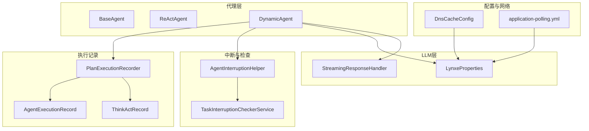
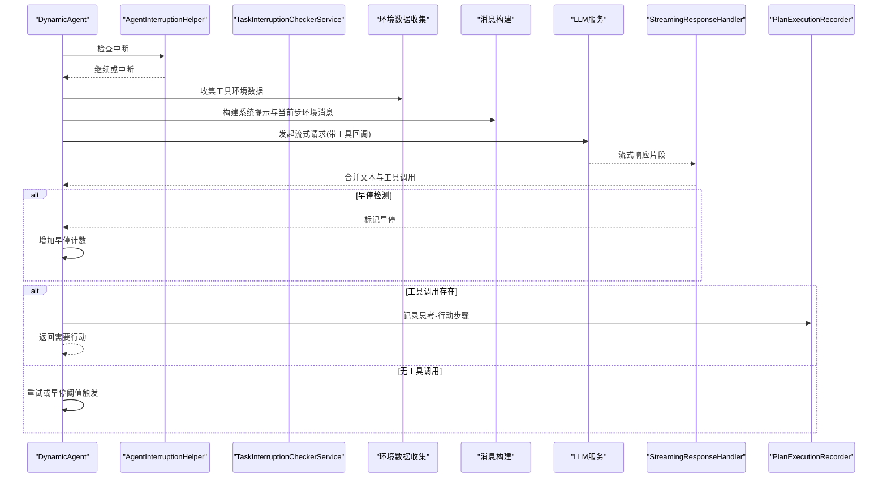
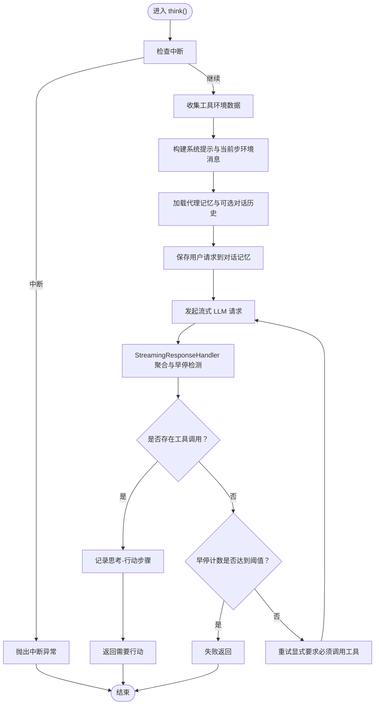
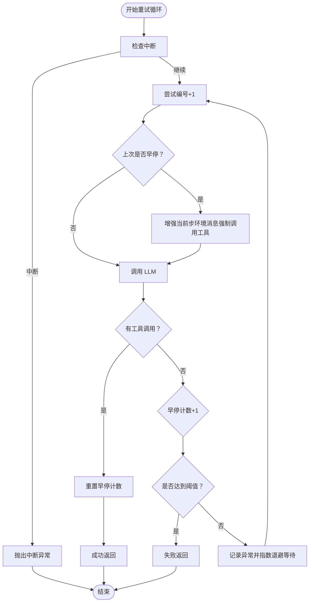
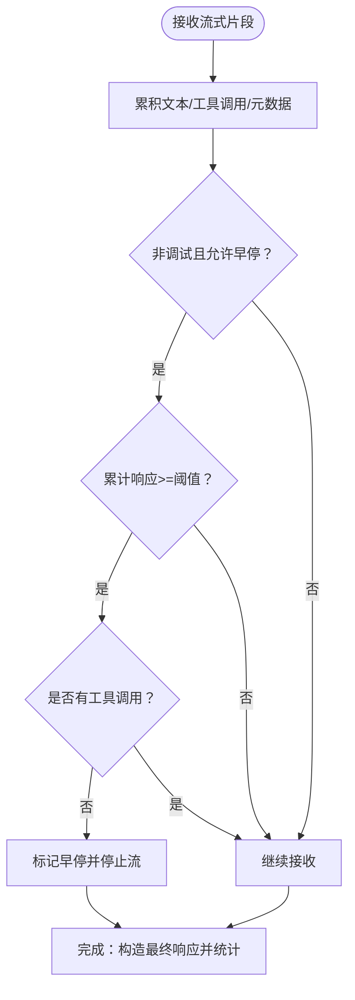
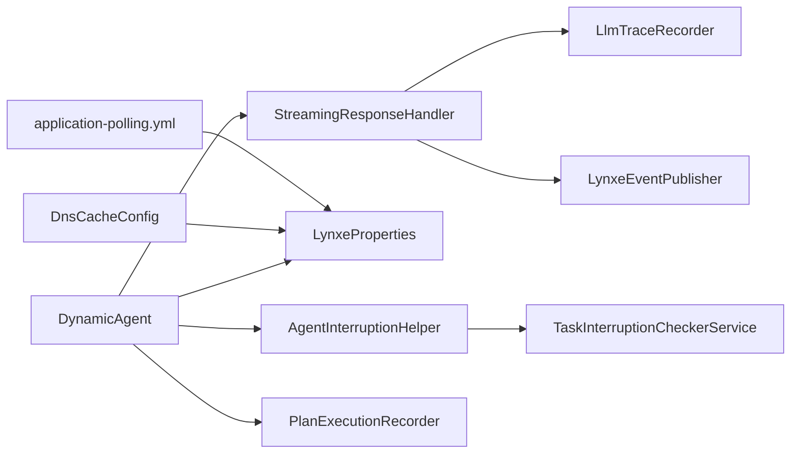

# 思考过程

<cite>
**本文引用的文件**
- [DynamicAgent.java](file://src/main/java/com/alibaba/cloud/ai/lynxe/agent/DynamicAgent.java)
- [ReActAgent.java](file://src/main/java/com/alibaba/cloud/ai/lynxe/agent/ReActAgent.java)
- [BaseAgent.java](file://src/main/java/com/alibaba/cloud/ai/lynxe/agent/BaseAgent.java)
- [StreamingResponseHandler.java](file://src/main/java/com/alibaba/cloud/ai/lynxe/llm/StreamingResponseHandler.java)
- [LynxeProperties.java](file://src/main/java/com/alibaba/cloud/ai/lynxe/config/LynxeProperties.java)
- [AgentInterruptionHelper.java](file://src/main/java/com/alibaba/cloud/ai/lynxe/runtime/service/AgentInterruptionHelper.java)
- [TaskInterruptionCheckerService.java](file://src/main/java/com/alibaba/cloud/ai/lynxe/runtime/service/TaskInterruptionCheckerService.java)
- [PlanExecutionRecorder.java](file://src/main/java/com/alibaba/cloud/ai/lynxe/recorder/service/PlanExecutionRecorder.java)
- [ThinkActRecord.java](file://src/main/java/com/alibaba/cloud/ai/lynxe/recorder/entity/vo/ThinkActRecord.java)
- [AgentExecutionRecord.java](file://src/main/java/com/alibaba/cloud/ai/lynxe/recorder/entity/vo/AgentExecutionRecord.java)
- [DnsCacheConfig.java](file://src/main/java/com/alibaba/cloud/ai/lynxe/config/DnsCacheConfig.java)
- [application-polling.yml](file://src/main/resources/application-polling.yml)
</cite>

## 目录
1. [简介](#简介)
2. [项目结构](#项目结构)
3. [核心组件](#核心组件)
4. [架构总览](#架构总览)
5. [详细组件分析](#详细组件分析)
6. [依赖关系分析](#依赖关系分析)
7. [性能考量](#性能考量)
8. [故障排查指南](#故障排查指南)
9. [结论](#结论)
10. [附录](#附录)

## 简介
本文件系统性梳理 AI 代理“思考过程”的完整实现与运行机制，重点覆盖以下方面：
- think() 方法的执行流程：环境数据收集、消息构建、LLM 调用与流式响应处理
- executeWithRetry 重试机制：重试策略、指数退避、中断处理与早期终止阈值
- 流式响应处理：合并文本内容、工具调用提取、进度日志与早停检测
- 早期终止与失败处理：当模型仅输出思考而未调用工具时的保护机制
- 启动与监控：如何启动代理思考过程、如何监控执行状态与记录结果
- 性能优化建议：重试次数、超时设置、并行执行策略等

## 项目结构
围绕“思考过程”，关键代码分布在如下模块：
- 代理层：DynamicAgent、ReActAgent、BaseAgent
- LLM 层：StreamingResponseHandler、LynxeProperties
- 中断与检查：AgentInterruptionHelper、TaskInterruptionCheckerService
- 执行记录：PlanExecutionRecorder、ThinkActRecord、AgentExecutionRecord
- 配置与网络：LynxeProperties、DnsCacheConfig、application-polling.yml

图表来源
- [DynamicAgent.java](file://src/main/java/com/alibaba/cloud/ai/lynxe/agent/DynamicAgent.java#L199-L229)
- [StreamingResponseHandler.java](file://src/main/java/com/alibaba/cloud/ai/lynxe/llm/StreamingResponseHandler.java#L167-L437)
- [LynxeProperties.java](file://src/main/java/com/alibaba/cloud/ai/lynxe/config/LynxeProperties.java#L151-L215)
- [AgentInterruptionHelper.java](file://src/main/java/com/alibaba/cloud/ai/lynxe/runtime/service/AgentInterruptionHelper.java#L44-L53)
- [TaskInterruptionCheckerService.java](file://src/main/java/com/alibaba/cloud/ai/lynxe/runtime/service/TaskInterruptionCheckerService.java#L46-L82)
- [PlanExecutionRecorder.java](file://src/main/java/com/alibaba/cloud/ai/lynxe/recorder/service/PlanExecutionRecorder.java#L62-L89)
- [ThinkActRecord.java](file://src/main/java/com/alibaba/cloud/ai/lynxe/recorder/entity/vo/ThinkActRecord.java#L18-L59)
- [AgentExecutionRecord.java](file://src/main/java/com/alibaba/cloud/ai/lynxe/recorder/entity/vo/AgentExecutionRecord.java#L302-L317)
- [DnsCacheConfig.java](file://src/main/java/com/alibaba/cloud/ai/lynxe/config/DnsCacheConfig.java#L37-L77)
- [application-polling.yml](file://src/main/resources/application-polling.yml#L1-L18)

章节来源
- [DynamicAgent.java](file://src/main/java/com/alibaba/cloud/ai/lynxe/agent/DynamicAgent.java#L199-L229)
- [StreamingResponseHandler.java](file://src/main/java/com/alibaba/cloud/ai/lynxe/llm/StreamingResponseHandler.java#L167-L437)
- [LynxeProperties.java](file://src/main/java/com/alibaba/cloud/ai/lynxe/config/LynxeProperties.java#L151-L215)

## 核心组件
- DynamicAgent：实现 ReAct 思考-行动循环，负责环境数据收集、消息构建、LLM 调用、流式响应处理、重试与早期终止、工具调用执行与记录。
- ReActAgent：定义 think()/act() 的抽象接口，统一“思考-行动”模式。
- BaseAgent：提供通用的执行框架、状态管理、异常包装与最终总结。
- StreamingResponseHandler：对 LLM 流式响应进行聚合、早停检测、进度日志与统计。
- LynxeProperties：集中配置项，如最大步数、用户输入超时、对话记忆上限、LLM 读超时、并行工具调用开关等。
- AgentInterruptionHelper/TaskInterruptionCheckerService：分布式场景下的任务中断检查与抛出。
- PlanExecutionRecorder/ThinkActRecord/AgentExecutionRecord：记录每次思考-行动步骤与整体执行结果。

章节来源
- [ReActAgent.java](file://src/main/java/com/alibaba/cloud/ai/lynxe/agent/ReActAgent.java#L46-L95)
- [BaseAgent.java](file://src/main/java/com/alibaba/cloud/ai/lynxe/agent/BaseAgent.java#L254-L332)
- [StreamingResponseHandler.java](file://src/main/java/com/alibaba/cloud/ai/lynxe/llm/StreamingResponseHandler.java#L167-L437)
- [LynxeProperties.java](file://src/main/java/com/alibaba/cloud/ai/lynxe/config/LynxeProperties.java#L151-L215)
- [AgentInterruptionHelper.java](file://src/main/java/com/alibaba/cloud/ai/lynxe/runtime/service/AgentInterruptionHelper.java#L44-L53)
- [TaskInterruptionCheckerService.java](file://src/main/java/com/alibaba/cloud/ai/lynxe/runtime/service/TaskInterruptionCheckerService.java#L46-L82)
- [PlanExecutionRecorder.java](file://src/main/java/com/alibaba/cloud/ai/lynxe/recorder/service/PlanExecutionRecorder.java#L62-L89)
- [ThinkActRecord.java](file://src/main/java/com/alibaba/cloud/ai/lynxe/recorder/entity/vo/ThinkActRecord.java#L18-L59)
- [AgentExecutionRecord.java](file://src/main/java/com/alibaba/cloud/ai/lynxe/recorder/entity/vo/AgentExecutionRecord.java#L302-L317)

## 架构总览
下图展示了从 think() 到 act() 的端到端流程，以及重试、早停与记录的关键节点。

图表来源
- [DynamicAgent.java](file://src/main/java/com/alibaba/cloud/ai/lynxe/agent/DynamicAgent.java#L232-L484)
- [StreamingResponseHandler.java](file://src/main/java/com/alibaba/cloud/ai/lynxe/llm/StreamingResponseHandler.java#L167-L437)
- [PlanExecutionRecorder.java](file://src/main/java/com/alibaba/cloud/ai/lynxe/recorder/service/PlanExecutionRecorder.java#L62-L89)
- [AgentInterruptionHelper.java](file://src/main/java/com/alibaba/cloud/ai/lynxe/runtime/service/AgentInterruptionHelper.java#L44-L53)
- [TaskInterruptionCheckerService.java](file://src/main/java/com/alibaba/cloud/ai/lynxe/runtime/service/TaskInterruptionCheckerService.java#L76-L82)

## 详细组件分析

### think() 执行流程
- 中断检查：在每次思考前与重试前检查根计划 ID 的中断状态，若被中断则抛出中断异常。
- 环境数据收集：遍历可用工具键，收集各工具的当前状态字符串，合并为环境上下文。
- 消息构建：
  - 系统提示：由 BaseAgent 的 getThinkMessage() 生成，包含 OS 信息、日期、当前步骤要求、额外参数、响应规则等。
  - 当前步环境消息：由 currentStepEnvMessage() 生成，注入当前步的环境数据元信息。
  - 历史消息：从代理内存与可选的对话历史中拼接，形成完整上下文。
  - 对话记忆：在构建消息后，将用户请求写入对话记忆，避免重复保存。
- LLM 调用：通过 ChatClient.prompt(...) 发起流式请求，注册工具回调，开启工具调用选项。
- 流式响应处理：交由 StreamingResponseHandler 聚合文本与工具调用，支持早停检测与进度日志。
- 早停与重试：若检测到仅文本无工具调用且非调试模式，则增加早停计数；达到阈值后失败返回；否则重试并在重试消息中显式要求必须调用工具。
- 结果记录：若存在工具调用，使用 PlanExecutionRecorder 记录本次思考-行动步骤。

图表来源
- [DynamicAgent.java](file://src/main/java/com/alibaba/cloud/ai/lynxe/agent/DynamicAgent.java#L232-L484)
- [StreamingResponseHandler.java](file://src/main/java/com/alibaba/cloud/ai/lynxe/llm/StreamingResponseHandler.java#L167-L437)
- [PlanExecutionRecorder.java](file://src/main/java/com/alibaba/cloud/ai/lynxe/recorder/service/PlanExecutionRecorder.java#L62-L89)

章节来源
- [DynamicAgent.java](file://src/main/java/com/alibaba/cloud/ai/lynxe/agent/DynamicAgent.java#L232-L484)
- [BaseAgent.java](file://src/main/java/com/alibaba/cloud/ai/lynxe/agent/BaseAgent.java#L148-L222)
- [StreamingResponseHandler.java](file://src/main/java/com/alibaba/cloud/ai/lynxe/llm/StreamingResponseHandler.java#L167-L437)

### executeWithRetry 重试机制
- 重试次数：默认最多 3 次（硬编码于 think() 调用处），可按需调整。
- 早停阈值：连续 3 次仅文本无工具调用即判定为“思考-only”，直接失败，防止无限循环。
- 重试策略：
  - 每次重试前检查中断，若被中断则立即抛出中断异常。
  - 若上一次尝试出现“思考-only”，在当前步环境消息中追加显式要求必须调用工具的提示，促使模型改变行为。
  - 对网络相关异常进行识别并采用指数退避等待后再重试；其他异常直接抛出。
- 指数退避：基于尝试次数计算延迟，上限不超过 60 秒。
- 失败处理：所有重试耗尽后，记录最新异常并返回 false，由 step() 决定后续处理（可能是模拟错误报告工具或提示必须调用工具）。

图表来源
- [DynamicAgent.java](file://src/main/java/com/alibaba/cloud/ai/lynxe/agent/DynamicAgent.java#L232-L484)
- [DynamicAgent.java](file://src/main/java/com/alibaba/cloud/ai/lynxe/agent/DynamicAgent.java#L487-L508)

章节来源
- [DynamicAgent.java](file://src/main/java/com/alibaba/cloud/ai/lynxe/agent/DynamicAgent.java#L232-L484)
- [DynamicAgent.java](file://src/main/java/com/alibaba/cloud/ai/lynxe/agent/DynamicAgent.java#L487-L508)

### 流式响应处理与早停检测
- 合并策略：StreamingResponseHandler 使用原子引用累积文本、工具调用与元数据，最终构造一条包含全部片段的 AssistantMessage。
- 早停检测：在非调试模式且允许早停时，当累计收到足够多响应后，若仅有文本而无工具调用，则触发早停并停止流。
- 进度日志：每 10 秒输出一次进度日志，包含响应次数、字符数、字符速率、工具调用数量与预览。
- 完成统计：记录 prompt/completion/总 token 数量，便于追踪成本与性能。
- 取消处理：当流被取消（例如早停）时，仍会构造最终响应以保证下游逻辑可用。

图表来源
- [StreamingResponseHandler.java](file://src/main/java/com/alibaba/cloud/ai/lynxe/llm/StreamingResponseHandler.java#L167-L437)

章节来源
- [StreamingResponseHandler.java](file://src/main/java/com/alibaba/cloud/ai/lynxe/llm/StreamingResponseHandler.java#L167-L437)

### 消息构建与 LLM 调用
- 系统提示模板：包含操作系统信息、当前日期、步骤要求、额外参数、响应规则（单/并发工具调用）、调试模式差异等。
- 当前步环境消息：注入当前步的环境数据，并标记元信息以便后续过滤。
- 历史与对话记忆：优先从代理记忆中读取，若启用对话记忆且存在 conversationId，则从对话历史中拼接，保持时间顺序。
- LLM 调用：通过 ChatClient.prompt(...).toolCallbacks(...).stream().chatResponse() 获取 Flux<ChatResponse>，并传入 StreamingResponseHandler 进行处理。
- 输入字符统计：在调用前计算消息总长度，用于追踪输入规模与成本。

章节来源
- [BaseAgent.java](file://src/main/java/com/alibaba/cloud/ai/lynxe/agent/BaseAgent.java#L148-L222)
- [DynamicAgent.java](file://src/main/java/com/alibaba/cloud/ai/lynxe/agent/DynamicAgent.java#L286-L366)

### 执行记录与监控
- ThinkActRecord：记录单步思考阶段的输入、输出、工具调用、时间戳与状态；作为 AgentExecutionRecord 的子步骤。
- AgentExecutionRecord：记录整次执行的起止时间、当前步数、最大步数、子计划数量等。
- 记录时机：在 think() 成功选择工具调用后，通过 PlanExecutionRecorder.recordThinkingAndAction(...) 写入数据库或持久化存储。
- 监控点：StreamingResponseHandler 的进度日志与完成日志可用于前端实时反馈；异常事件通过 LynxeEventPublisher 发布。

章节来源
- [ThinkActRecord.java](file://src/main/java/com/alibaba/cloud/ai/lynxe/recorder/entity/vo/ThinkActRecord.java#L18-L59)
- [AgentExecutionRecord.java](file://src/main/java/com/alibaba/cloud/ai/lynxe/recorder/entity/vo/AgentExecutionRecord.java#L302-L317)
- [PlanExecutionRecorder.java](file://src/main/java/com/alibaba/cloud/ai/lynxe/recorder/service/PlanExecutionRecorder.java#L62-L89)
- [StreamingResponseHandler.java](file://src/main/java/com/alibaba/cloud/ai/lynxe/llm/StreamingResponseHandler.java#L469-L523)

## 依赖关系分析
- DynamicAgent 依赖：
  - LLM 服务：构建 Prompt、发起 ChatClient 请求、处理 ToolExecutionResult
  - StreamingResponseHandler：处理流式响应、早停、统计与日志
  - LynxeProperties：读取最大步数、用户输入超时、对话记忆开关、LLM 读超时等
  - AgentInterruptionHelper/TaskInterruptionCheckerService：分布式中断检查
  - PlanExecutionRecorder：记录思考-行动步骤
- StreamingResponseHandler 依赖：
  - LlmTraceRecorder：记录请求与响应统计
  - LynxeEventPublisher：发布异常事件
- 配置与网络：
  - LynxeProperties 提供运行时配置
  - DnsCacheConfig 配置 WebClient 超时与连接池，提升网络稳定性
  - application-polling.yml 提供计划轮询的基础与退避参数

图表来源
- [DynamicAgent.java](file://src/main/java/com/alibaba/cloud/ai/lynxe/agent/DynamicAgent.java#L167-L197)
- [StreamingResponseHandler.java](file://src/main/java/com/alibaba/cloud/ai/lynxe/llm/StreamingResponseHandler.java#L167-L437)
- [LynxeProperties.java](file://src/main/java/com/alibaba/cloud/ai/lynxe/config/LynxeProperties.java#L151-L215)
- [DnsCacheConfig.java](file://src/main/java/com/alibaba/cloud/ai/lynxe/config/DnsCacheConfig.java#L37-L77)
- [application-polling.yml](file://src/main/resources/application-polling.yml#L1-L18)

章节来源
- [DynamicAgent.java](file://src/main/java/com/alibaba/cloud/ai/lynxe/agent/DynamicAgent.java#L167-L197)
- [StreamingResponseHandler.java](file://src/main/java/com/alibaba/cloud/ai/lynxe/llm/StreamingResponseHandler.java#L167-L437)
- [LynxeProperties.java](file://src/main/java/com/alibaba/cloud/ai/lynxe/config/LynxeProperties.java#L151-L215)
- [DnsCacheConfig.java](file://src/main/java/com/alibaba/cloud/ai/lynxe/config/DnsCacheConfig.java#L37-L77)
- [application-polling.yml](file://src/main/resources/application-polling.yml#L1-L18)

## 性能考量
- 重试次数与指数退避
  - 默认重试 3 次，指数退避上限 60 秒；可根据网络波动适当提高重试次数，但需关注总等待时间。
  - 可通过 LynxeProperties 的 llmReadTimeout 调整 LLM 读超时，配合 DnsCacheConfig 的连接池与超时参数提升稳定性。
- 并行工具调用
  - 若开启 LynxeProperties 的 parallelToolCalls，DynamicAgent 在多工具场景下可并行执行，显著缩短总耗时。
  - 注意：部分工具不支持并行（如 TerminableTool/FormInputTool），需在单工具或串行路径中处理。
- 对话记忆与输入统计
  - 合理设置对话记忆上限与启用开关，避免过长的历史导致输入字符过多，影响成本与延迟。
  - 使用输入字符统计与输出字符统计辅助成本控制与性能分析。
- 早停保护
  - 非调试模式下启用早停，可避免模型陷入“思考-only”循环，减少无效请求与资源浪费。
- 轮询与退避
  - application-polling.yml 提供计划轮询的退避参数，适用于外部轮询场景的稳定性保障。

章节来源
- [DynamicAgent.java](file://src/main/java/com/alibaba/cloud/ai/lynxe/agent/DynamicAgent.java#L487-L508)
- [LynxeProperties.java](file://src/main/java/com/alibaba/cloud/ai/lynxe/config/LynxeProperties.java#L264-L285)
- [DnsCacheConfig.java](file://src/main/java/com/alibaba/cloud/ai/lynxe/config/DnsCacheConfig.java#L37-L77)
- [application-polling.yml](file://src/main/resources/application-polling.yml#L1-L18)

## 故障排查指南
- 中断相关
  - 若 think() 抛出中断异常，检查 AgentInterruptionHelper 的 checkInterruptionAndContinue 与 TaskInterruptionCheckerService 的 shouldInterruptExecution。
  - 在分布式环境中，确认 TaskInterruptionManager 的状态更新是否正确。
- 早停失败
  - 若多次重试后仍失败，检查 DynamicAgent 的 earlyTerminationCount 与阈值判断逻辑；必要时在当前步环境消息中显式要求调用工具。
- LLM 调用失败
  - 查看 isRetryableException 的匹配条件（DNS 解析、超时、连接等），对网络异常进行指数退避重试。
  - 若非网络异常，直接抛出并由 step() 进行错误报告工具模拟。
- 流式响应问题
  - 关注 StreamingResponseHandler 的进度日志与完成日志，定位早停触发点与最终响应构造。
  - 检查 LlmTraceRecorder 的输入/输出字符统计，评估成本与性能。
- 记录与监控
  - 确认 PlanExecutionRecorder 的记录接口已正确调用，ThinkActRecord 与 AgentExecutionRecord 字段完整。
  - 异常事件通过 LynxeEventPublisher 发布，可在监控系统中查看。

章节来源
- [AgentInterruptionHelper.java](file://src/main/java/com/alibaba/cloud/ai/lynxe/runtime/service/AgentInterruptionHelper.java#L44-L53)
- [TaskInterruptionCheckerService.java](file://src/main/java/com/alibaba/cloud/ai/lynxe/runtime/service/TaskInterruptionCheckerService.java#L46-L82)
- [DynamicAgent.java](file://src/main/java/com/alibaba/cloud/ai/lynxe/agent/DynamicAgent.java#L487-L508)
- [StreamingResponseHandler.java](file://src/main/java/com/alibaba/cloud/ai/lynxe/llm/StreamingResponseHandler.java#L469-L523)
- [PlanExecutionRecorder.java](file://src/main/java/com/alibaba/cloud/ai/lynxe/recorder/service/PlanExecutionRecorder.java#L62-L89)

## 结论
- think() 是 DynamicAgent 的核心入口，贯穿环境数据收集、消息构建、LLM 调用与流式响应处理。
- executeWithRetry 提供稳健的重试与早停保护，结合指数退避与中断检查，有效提升鲁棒性。
- StreamingResponseHandler 将复杂流式交互简化为可观察、可统计的结果，便于前端与监控系统集成。
- 通过合理配置 LynxeProperties 与网络参数，可在稳定性与性能之间取得平衡。
- 建议在生产环境启用早停保护、适度增加重试次数、开启并行工具调用（在兼容前提下），并完善监控与告警。

## 附录
- 启动与监控示例（代码路径）
  - 启动代理执行：参考 BaseAgent.run() 的主循环与 step() 分发。
    - [BaseAgent.java](file://src/main/java/com/alibaba/cloud/ai/lynxe/agent/BaseAgent.java#L254-L332)
  - 记录思考-行动步骤：参考 PlanExecutionRecorder.recordThinkingAndAction(...)。
    - [PlanExecutionRecorder.java](file://src/main/java/com/alibaba/cloud/ai/lynxe/recorder/service/PlanExecutionRecorder.java#L62-L89)
  - 流式响应进度与完成日志：参考 StreamingResponseHandler 的日志方法。
    - [StreamingResponseHandler.java](file://src/main/java/com/alibaba/cloud/ai/lynxe/llm/StreamingResponseHandler.java#L469-L523)
- 配置要点
  - 最大步数、用户输入超时、对话记忆开关、LLM 读超时、并行工具调用开关等。
    - [LynxeProperties.java](file://src/main/java/com/alibaba/cloud/ai/lynxe/config/LynxeProperties.java#L151-L215)
    - [LynxeProperties.java](file://src/main/java/com/alibaba/cloud/ai/lynxe/config/LynxeProperties.java#L264-L285)
  - 网络稳定性：WebClient 超时与连接池配置。
    - [DnsCacheConfig.java](file://src/main/java/com/alibaba/cloud/ai/lynxe/config/DnsCacheConfig.java#L37-L77)
  - 轮询退避参数（计划轮询）。
    - [application-polling.yml](file://src/main/resources/application-polling.yml#L1-L18)