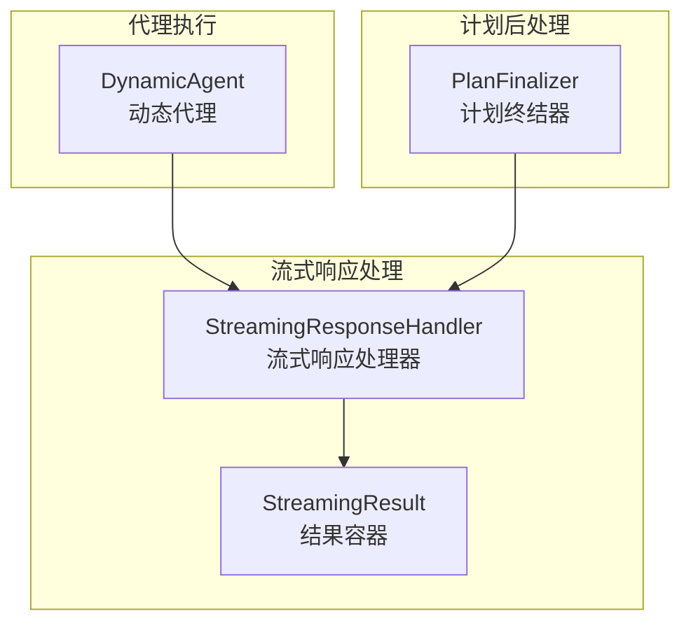
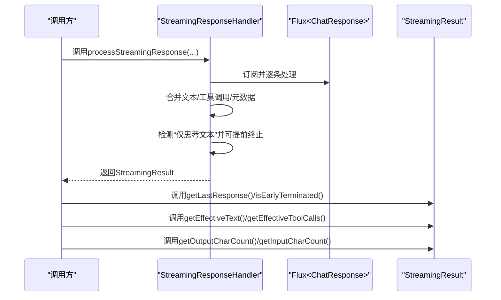
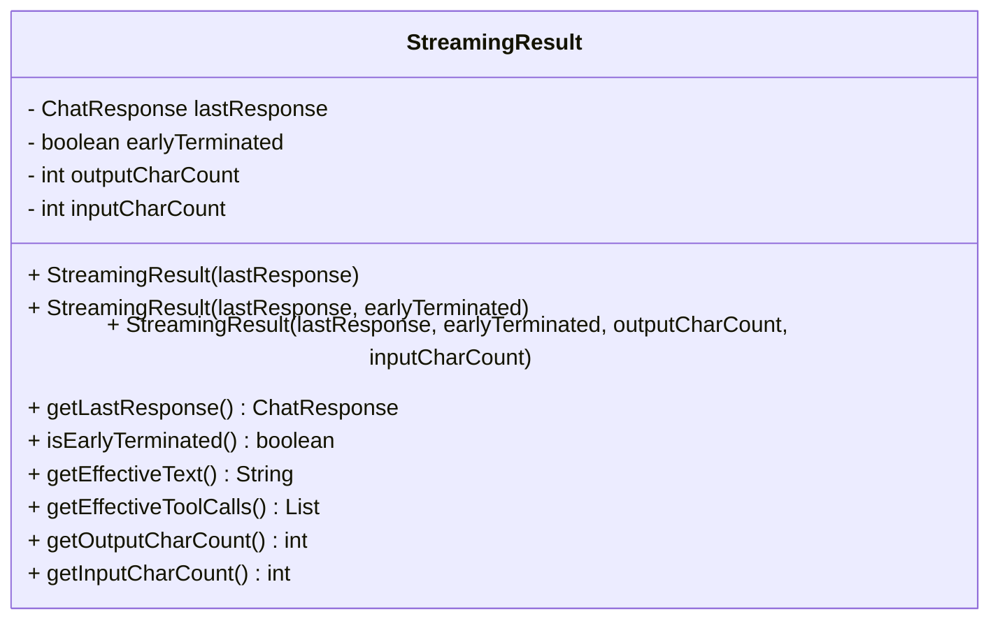
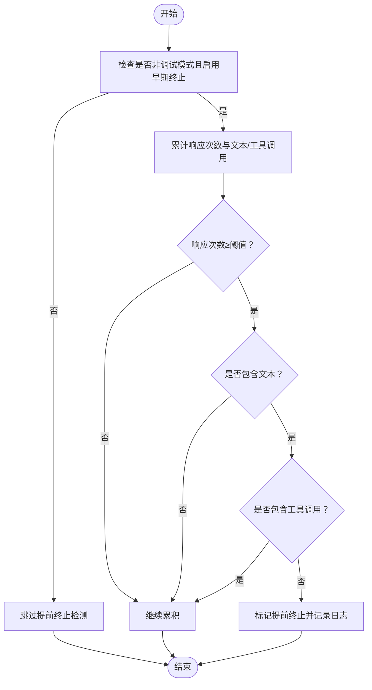
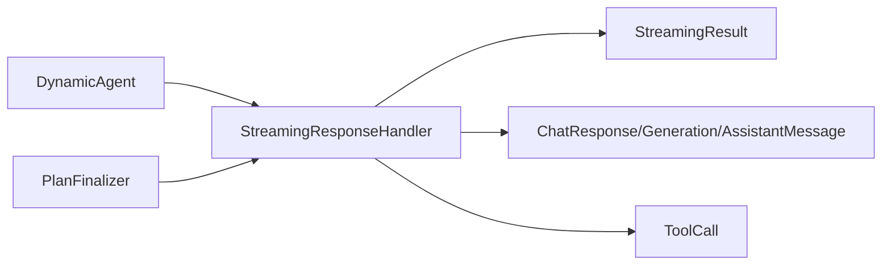

# StreamingResult类详解

<cite>
**本文引用的文件列表**
- [StreamingResponseHandler.java](file://src/main/java/com/alibaba/cloud/ai/lynxe/llm/StreamingResponseHandler.java)
- [DynamicAgent.java](file://src/main/java/com/alibaba/cloud/ai/lynxe/agent/DynamicAgent.java)
- [PlanFinalizer.java](file://src/main/java/com/alibaba/cloud/ai/lynxe/planning/service/PlanFinalizer.java)
</cite>

## 目录
1. [简介](#简介)
2. [项目结构与定位](#项目结构与定位)
3. [核心组件概览](#核心组件概览)
4. [架构总览](#架构总览)
5. [详细组件分析](#详细组件分析)
6. [依赖关系分析](#依赖关系分析)
7. [性能与计费考量](#性能与计费考量)
8. [故障排查指南](#故障排查指南)
9. [结论](#结论)

## 简介
StreamingResult是流式响应处理的结果容器，用于封装一次流式对话或计划生成过程中的最终合并结果、早期终止状态以及输入/输出字符计数。它由StreamingResponseHandler负责构建，并在代理（Agent）思考阶段与计划（Plan）后处理阶段被广泛使用，以支持：
- 获取最终合并后的ChatResponse
- 判断是否因“仅思考文本”而提前终止
- 获取有效文本与工具调用列表（自动处理空值）
- 在性能监控与计费场景下提供输入/输出字符统计

## 项目结构与定位
StreamingResult位于流式响应处理模块中，作为StreamingResponseHandler的内部静态类存在，同时在代理执行与计划后处理中被消费。

图表来源
- [StreamingResponseHandler.java](file://src/main/java/com/alibaba/cloud/ai/lynxe/llm/StreamingResponseHandler.java#L70-L150)
- [DynamicAgent.java](file://src/main/java/com/alibaba/cloud/ai/lynxe/agent/DynamicAgent.java#L363-L400)
- [PlanFinalizer.java](file://src/main/java/com/alibaba/cloud/ai/lynxe/planning/service/PlanFinalizer.java#L133-L140)

章节来源
- [StreamingResponseHandler.java](file://src/main/java/com/alibaba/cloud/ai/lynxe/llm/StreamingResponseHandler.java#L70-L150)
- [DynamicAgent.java](file://src/main/java/com/alibaba/cloud/ai/lynxe/agent/DynamicAgent.java#L363-L400)
- [PlanFinalizer.java](file://src/main/java/com/alibaba/cloud/ai/lynxe/planning/service/PlanFinalizer.java#L133-L140)

## 核心组件概览
- StreamingResult字段
  - 最终响应：lastResponse（ChatResponse）
  - 是否早期终止：earlyTerminated（boolean）
  - 输出字符计数：outputCharCount（int）
  - 输入字符计数：inputCharCount（int）

- 构造函数重载
  - 仅包含最终响应
  - 包含早期终止状态
  - 包含输入/输出字符计数

- 关键方法
  - getLastResponse()：返回最终合并的ChatResponse
  - isEarlyTerminated()：判断是否因“仅思考文本”提前终止
  - getEffectiveText()：返回有效文本（自动处理空值）
  - getEffectiveToolCalls()：返回有效工具调用列表（自动处理空值）
  - getOutputCharCount()/getInputCharCount()：用于性能监控与计费

章节来源
- [StreamingResponseHandler.java](file://src/main/java/com/alibaba/cloud/ai/lynxe/llm/StreamingResponseHandler.java#L70-L150)

## 架构总览
StreamingResponseHandler在处理流式响应时，会：
- 合并多段文本与工具调用
- 计算输出字符数与输入字符数
- 在非调试模式且允许早期终止时，检测“仅思考文本”并提前停止
- 返回StreamingResult，其中包含最终响应、早期终止标志与计数

图表来源
- [StreamingResponseHandler.java](file://src/main/java/com/alibaba/cloud/ai/lynxe/llm/StreamingResponseHandler.java#L153-L448)

## 详细组件分析

### 类定义与字段
StreamingResult是一个不可变的结果容器，包含以下字段：
- lastResponse：最终合并的ChatResponse
- earlyTerminated：是否因“仅思考文本”提前终止
- outputCharCount：输出字符总数
- inputCharCount：输入字符总数

图表来源
- [StreamingResponseHandler.java](file://src/main/java/com/alibaba/cloud/ai/lynxe/llm/StreamingResponseHandler.java#L70-L150)

章节来源
- [StreamingResponseHandler.java](file://src/main/java/com/alibaba/cloud/ai/lynxe/llm/StreamingResponseHandler.java#L70-L150)

### 构造函数重载与使用场景
- 仅包含最终响应
  - 场景：当不需要早期终止标志与计数时，例如某些简单文本生成流程
  - 使用路径参考：[StreamingResponseHandler.java](file://src/main/java/com/alibaba/cloud/ai/lynxe/llm/StreamingResponseHandler.java#L80-L85)

- 包含早期终止状态
  - 场景：需要感知“仅思考文本”提前终止，便于策略调整（如重试或提示用户）
  - 使用路径参考：[StreamingResponseHandler.java](file://src/main/java/com/alibaba/cloud/ai/lynxe/llm/StreamingResponseHandler.java#L87-L92)

- 包含输入/输出字符计数
  - 场景：性能监控、计费统计、审计日志等
  - 使用路径参考：[StreamingResponseHandler.java](file://src/main/java/com/alibaba/cloud/ai/lynxe/llm/StreamingResponseHandler.java#L94-L100)

章节来源
- [StreamingResponseHandler.java](file://src/main/java/com/alibaba/cloud/ai/lynxe/llm/StreamingResponseHandler.java#L80-L100)

### getLastResponse()：获取最终合并的ChatResponse
- 作用：返回经过合并的最终ChatResponse，包含合并后的文本、工具调用与元数据
- 使用路径参考：[DynamicAgent.java](file://src/main/java/com/alibaba/cloud/ai/lynxe/agent/DynamicAgent.java#L363-L370)

章节来源
- [StreamingResponseHandler.java](file://src/main/java/com/alibaba/cloud/ai/lynxe/llm/StreamingResponseHandler.java#L102-L104)
- [DynamicAgent.java](file://src/main/java/com/alibaba/cloud/ai/lynxe/agent/DynamicAgent.java#L363-L370)

### isEarlyTerminated()：检测“仅思考文本”提前终止
- 判断逻辑（非调试模式且启用早期终止时）：
  - 当累积收到至少若干次响应后，若文本非空但未出现任何工具调用，则判定为“仅思考文本”，触发提前终止
  - 提前终止标志将随StreamingResult返回给调用方
- 使用路径参考：
  - 判定逻辑：[StreamingResponseHandler.java](file://src/main/java/com/alibaba/cloud/ai/lynxe/llm/StreamingResponseHandler.java#L247-L274)
  - 结果返回：[StreamingResponseHandler.java](file://src/main/java/com/alibaba/cloud/ai/lynxe/llm/StreamingResponseHandler.java#L433-L436)
  - 代理侧使用：[DynamicAgent.java](file://src/main/java/com/alibaba/cloud/ai/lynxe/agent/DynamicAgent.java#L380-L399)

图表来源
- [StreamingResponseHandler.java](file://src/main/java/com/alibaba/cloud/ai/lynxe/llm/StreamingResponseHandler.java#L247-L274)
- [StreamingResponseHandler.java](file://src/main/java/com/alibaba/cloud/ai/lynxe/llm/StreamingResponseHandler.java#L433-L436)

章节来源
- [StreamingResponseHandler.java](file://src/main/java/com/alibaba/cloud/ai/lynxe/llm/StreamingResponseHandler.java#L247-L274)
- [StreamingResponseHandler.java](file://src/main/java/com/alibaba/cloud/ai/lynxe/llm/StreamingResponseHandler.java#L433-L436)
- [DynamicAgent.java](file://src/main/java/com/alibaba/cloud/ai/lynxe/agent/DynamicAgent.java#L380-L399)

### getEffectiveText()：获取有效文本
- 机制：
  - 优先从最后合并的ChatResponse中提取文本
  - 若为空则返回空字符串，避免调用方做空值判断
- 使用路径参考：[StreamingResponseHandler.java](file://src/main/java/com/alibaba/cloud/ai/lynxe/llm/StreamingResponseHandler.java#L128-L133)
- 代理侧使用：[DynamicAgent.java](file://src/main/java/com/alibaba/cloud/ai/lynxe/agent/DynamicAgent.java#L363-L371)

章节来源
- [StreamingResponseHandler.java](file://src/main/java/com/alibaba/cloud/ai/lynxe/llm/StreamingResponseHandler.java#L128-L133)
- [DynamicAgent.java](file://src/main/java/com/alibaba/cloud/ai/lynxe/agent/DynamicAgent.java#L363-L371)

### getEffectiveToolCalls()：获取有效工具调用
- 机制：
  - 优先从最后合并的ChatResponse中提取工具调用列表
  - 若为空则返回空集合，避免调用方做空值判断
- 使用路径参考：[StreamingResponseHandler.java](file://src/main/java/com/alibaba/cloud/ai/lynxe/llm/StreamingResponseHandler.java#L118-L123)
- 代理侧使用：[DynamicAgent.java](file://src/main/java/com/alibaba/cloud/ai/lynxe/agent/DynamicAgent.java#L363-L371)

章节来源
- [StreamingResponseHandler.java](file://src/main/java/com/alibaba/cloud/ai/lynxe/llm/StreamingResponseHandler.java#L118-L123)
- [DynamicAgent.java](file://src/main/java/com/alibaba/cloud/ai/lynxe/agent/DynamicAgent.java#L363-L371)

### getOutputCharCount()/getInputCharCount()：性能监控与计费
- 用途：
  - 输出字符数：用于统计模型输出长度，辅助性能监控与计费
  - 输入字符数：用于统计请求消息长度，辅助成本核算
- 计算与传递：
  - 输出字符数在流式聚合完成后计算并保存
  - 输入字符数在调用端预先计算并通过参数传入
  - 两者均通过StreamingResult返回
- 使用路径参考：
  - 输出字符数计算与返回：[StreamingResponseHandler.java](file://src/main/java/com/alibaba/cloud/ai/lynxe/llm/StreamingResponseHandler.java#L322-L327)
  - 输入字符数传入与返回：[StreamingResponseHandler.java](file://src/main/java/com/alibaba/cloud/ai/lynxe/llm/StreamingResponseHandler.java#L163-L165)
  - 代理侧使用：[DynamicAgent.java](file://src/main/java/com/alibaba/cloud/ai/lynxe/agent/DynamicAgent.java#L373-L378)
  - 计划后处理文本生成使用：[PlanFinalizer.java](file://src/main/java/com/alibaba/cloud/ai/lynxe/planning/service/PlanFinalizer.java#L133-L140)

章节来源
- [StreamingResponseHandler.java](file://src/main/java/com/alibaba/cloud/ai/lynxe/llm/StreamingResponseHandler.java#L322-L327)
- [StreamingResponseHandler.java](file://src/main/java/com/alibaba/cloud/ai/lynxe/llm/StreamingResponseHandler.java#L163-L165)
- [DynamicAgent.java](file://src/main/java/com/alibaba/cloud/ai/lynxe/agent/DynamicAgent.java#L373-L378)
- [PlanFinalizer.java](file://src/main/java/com/alibaba/cloud/ai/lynxe/planning/service/PlanFinalizer.java#L133-L140)

### 实际使用示例：代理执行与计划创建

- 代理思考阶段（DynamicAgent）
  - 步骤：
    1) 构建消息并计算输入字符数
    2) 调用StreamingResponseHandler.processStreamingResponse(...)获取StreamingResult
    3) 从StreamingResult中读取最终响应、有效文本、工具调用与计数
    4) 判断是否早期终止并按策略处理（如重试或失败）
  - 关键路径参考：
    - 调用流式处理：[DynamicAgent.java](file://src/main/java/com/alibaba/cloud/ai/lynxe/agent/DynamicAgent.java#L363-L366)
    - 读取最终响应与计数：[DynamicAgent.java](file://src/main/java/com/alibaba/cloud/ai/lynxe/agent/DynamicAgent.java#L367-L378)
    - 早期终止判断与重试策略：[DynamicAgent.java](file://src/main/java/com/alibaba/cloud/ai/lynxe/agent/DynamicAgent.java#L380-L399)

- 计划后处理（PlanFinalizer）
  - 步骤：
    1) 针对直接响应或摘要生成，调用processStreamingTextResponse(...)
    2) 该方法内部仍使用StreamingResponseHandler，但禁用早期终止（因为文本生成无需工具调用）
    3) 返回合并后的文本
  - 关键路径参考：
    - 文本生成调用：[PlanFinalizer.java](file://src/main/java/com/alibaba/cloud/ai/lynxe/planning/service/PlanFinalizer.java#L133-L140)
    - 流式文本处理实现：[StreamingResponseHandler.java](file://src/main/java/com/alibaba/cloud/ai/lynxe/llm/StreamingResponseHandler.java#L461-L467)

章节来源
- [DynamicAgent.java](file://src/main/java/com/alibaba/cloud/ai/lynxe/agent/DynamicAgent.java#L363-L400)
- [PlanFinalizer.java](file://src/main/java/com/alibaba/cloud/ai/lynxe/planning/service/PlanFinalizer.java#L133-L140)
- [StreamingResponseHandler.java](file://src/main/java/com/alibaba/cloud/ai/lynxe/llm/StreamingResponseHandler.java#L461-L467)

## 依赖关系分析
- 内部依赖
  - StreamingResult依赖于Spring AI的ChatResponse、Generation、AssistantMessage等类型
  - 依赖工具调用类型ToolCall
- 外部依赖
  - Reactor Flux用于流式处理
  - 日志与事件发布（LynxeEventPublisher）用于异常与中断事件上报
- 调用链
  - DynamicAgent -> StreamingResponseHandler.processStreamingResponse -> StreamingResult
  - PlanFinalizer -> StreamingResponseHandler.processStreamingTextResponse -> StreamingResult

图表来源
- [StreamingResponseHandler.java](file://src/main/java/com/alibaba/cloud/ai/lynxe/llm/StreamingResponseHandler.java#L70-L150)
- [DynamicAgent.java](file://src/main/java/com/alibaba/cloud/ai/lynxe/agent/DynamicAgent.java#L363-L378)
- [PlanFinalizer.java](file://src/main/java/com/alibaba/cloud/ai/lynxe/planning/service/PlanFinalizer.java#L133-L140)

章节来源
- [StreamingResponseHandler.java](file://src/main/java/com/alibaba/cloud/ai/lynxe/llm/StreamingResponseHandler.java#L70-L150)
- [DynamicAgent.java](file://src/main/java/com/alibaba/cloud/ai/lynxe/agent/DynamicAgent.java#L363-L378)
- [PlanFinalizer.java](file://src/main/java/com/alibaba/cloud/ai/lynxe/planning/service/PlanFinalizer.java#L133-L140)

## 性能与计费考量
- 输出字符数（getOutputCharCount）可用于：
  - 统计模型输出长度，评估生成质量与成本
  - 作为限速或配额控制的依据
- 输入字符数（getInputCharCount）可用于：
  - 计算请求侧成本（如按字符计费）
  - 识别长上下文带来的潜在开销
- 建议实践：
  - 在调用端尽早计算输入字符数并传入
  - 在代理与计划后处理中统一使用StreamingResult提供的计数，避免重复计算
  - 将计数写入审计日志，便于追踪与复盘

章节来源
- [StreamingResponseHandler.java](file://src/main/java/com/alibaba/cloud/ai/lynxe/llm/StreamingResponseHandler.java#L322-L327)
- [StreamingResponseHandler.java](file://src/main/java/com/alibaba/cloud/ai/lynxe/llm/StreamingResponseHandler.java#L163-L165)
- [DynamicAgent.java](file://src/main/java/com/alibaba/cloud/ai/lynxe/agent/DynamicAgent.java#L373-L378)
- [PlanFinalizer.java](file://src/main/java/com/alibaba/cloud/ai/lynxe/planning/service/PlanFinalizer.java#L133-L140)

## 故障排查指南
- 早期终止频繁发生
  - 现象：isEarlyTerminated()持续返回true，代理多次重试
  - 排查要点：
    - 确认非调试模式且启用了早期终止
    - 检查累积文本与工具调用是否符合预期
    - 参考：[StreamingResponseHandler.java](file://src/main/java/com/alibaba/cloud/ai/lynxe/llm/StreamingResponseHandler.java#L247-L274)
  - 应对建议：
    - 在代理层增加显式工具调用要求，减少“仅思考文本”概率
    - 参考：[DynamicAgent.java](file://src/main/java/com/alibaba/cloud/ai/lynxe/agent/DynamicAgent.java#L261-L279)

- 文本为空或工具调用为空
  - 现象：getEffectiveText()返回空串；getEffectiveToolCalls()返回空集合
  - 排查要点：
    - 确认流式响应确实未产生文本或工具调用
    - 检查早期终止是否导致提前结束
    - 参考：[StreamingResponseHandler.java](file://src/main/java/com/alibaba/cloud/ai/lynxe/llm/StreamingResponseHandler.java#L118-L133)

- 计数异常
  - 现象：输入/输出计数与预期不符
  - 排查要点：
    - 确认输入字符数在调用端正确计算
    - 确认输出字符数在聚合完成时已计算并返回
    - 参考：[StreamingResponseHandler.java](file://src/main/java/com/alibaba/cloud/ai/lynxe/llm/StreamingResponseHandler.java#L322-L327)

章节来源
- [StreamingResponseHandler.java](file://src/main/java/com/alibaba/cloud/ai/lynxe/llm/StreamingResponseHandler.java#L247-L274)
- [StreamingResponseHandler.java](file://src/main/java/com/alibaba/cloud/ai/lynxe/llm/StreamingResponseHandler.java#L118-L133)
- [StreamingResponseHandler.java](file://src/main/java/com/alibaba/cloud/ai/lynxe/llm/StreamingResponseHandler.java#L322-L327)
- [DynamicAgent.java](file://src/main/java/com/alibaba/cloud/ai/lynxe/agent/DynamicAgent.java#L261-L279)

## 结论
StreamingResult作为流式响应处理的核心结果容器，提供了：
- 对最终合并结果的统一访问接口
- 对“仅思考文本”提前终止的明确信号
- 对文本与工具调用的健壮访问（自动处理空值）
- 对输入/输出字符计数的支持，满足性能监控与计费需求

在代理执行与计划后处理中，通过StreamingResult可以实现更稳定、可观测、可控的流式交互体验。