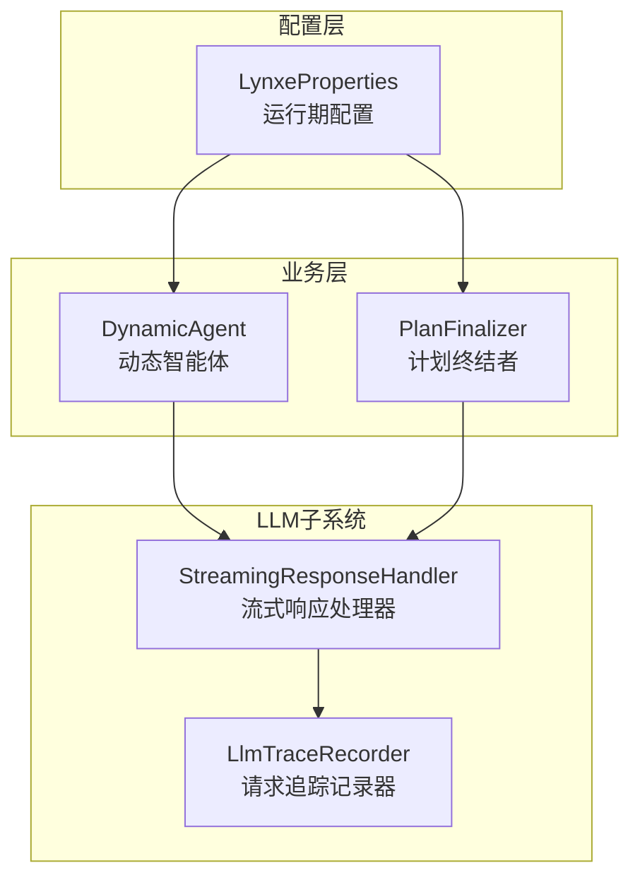
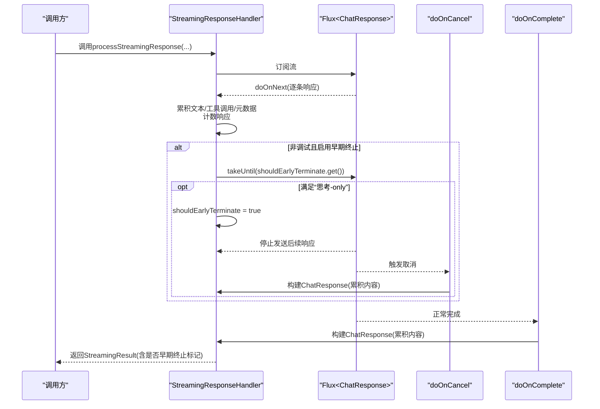
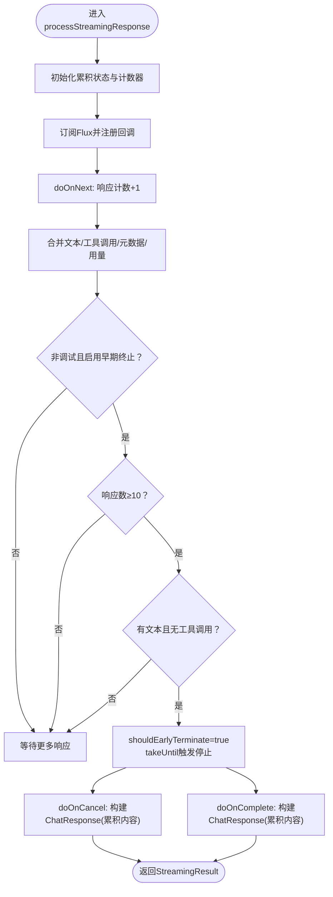
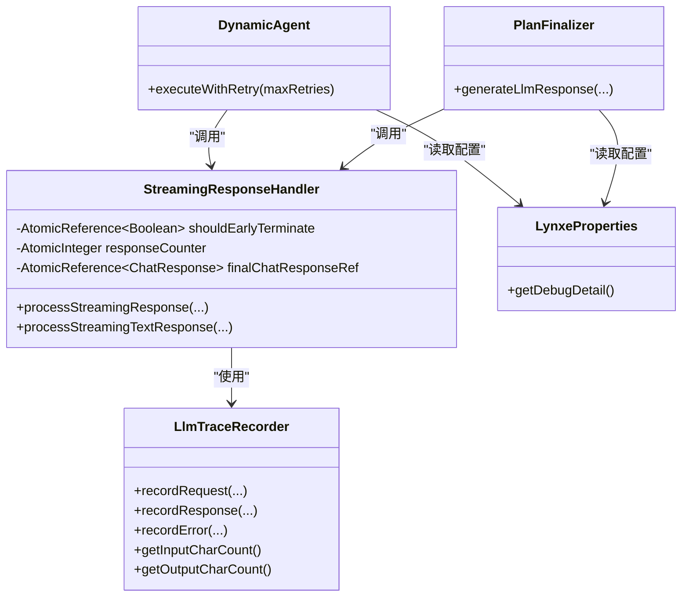

# 早期终止机制

<cite>
**本文引用的文件列表**
- [StreamingResponseHandler.java](file://src/main/java/com/alibaba/cloud/ai/lynxe/llm/StreamingResponseHandler.java)
- [LlmTraceRecorder.java](file://src/main/java/com/alibaba/cloud/ai/lynxe/llm/LlmTraceRecorder.java)
- [LynxeProperties.java](file://src/main/java/com/alibaba/cloud/ai/lynxe/config/LynxeProperties.java)
- [DynamicAgent.java](file://src/main/java/com/alibaba/cloud/ai/lynxe/agent/DynamicAgent.java)
- [PlanFinalizer.java](file://src/main/java/com/alibaba/cloud/ai/lynxe/planning/service/PlanFinalizer.java)
- [application.yml](file://src/main/resources/application.yml)
</cite>

## 目录
1. [引言](#引言)
2. [项目结构与定位](#项目结构与定位)
3. [核心组件](#核心组件)
4. [架构总览](#架构总览)
5. [详细组件分析](#详细组件分析)
6. [依赖关系分析](#依赖关系分析)
7. [性能考量](#性能考量)
8. [故障排查指南](#故障排查指南)
9. [结论](#结论)
10. [附录](#附录)

## 引言
本文件系统性阐述“早期终止机制”的设计与实现，聚焦于非调试模式下对“仅思考文本、无工具调用”响应的快速终止能力，以提升流式响应效率与用户体验。文档围绕以下目标展开：
- 设计原理：在非调试模式下，当检测到模型仅输出思考文本而未生成工具调用时，通过takeUntil与AtomicReference实现线程安全的终止逻辑。
- 处理流程：processStreamingResponse()中doOnNext累积状态、doOnComplete与doOnCancel分别在正常完成与取消时构建最终ChatResponse。
- 防误判策略：响应计数器至少10个响应，避免模型初期输出导致的误判。
- 线程安全：shouldEarlyTerminate标志位采用AtomicReference，确保并发安全。
- 取消处理：doOnCancel中对早期终止场景进行特殊处理，保证即使流被取消也能正确产出ChatResponse。
- 参数策略：enableEarlyTermination在不同场景（如摘要生成）下的配置建议。
- 性能对比：提供启用/禁用早期终止前后的响应时间与资源消耗对比思路与落地方法。

## 项目结构与定位
早期终止机制位于后端LLM子系统，核心类为StreamingResponseHandler，负责合并流式响应、统计进度、记录追踪，并在满足条件时提前终止流。相关配置由LynxeProperties提供，典型使用场景包括智能体思考阶段（需要工具调用）与纯文本生成（如摘要，不启用早期终止）。

图表来源
- [StreamingResponseHandler.java](file://src/main/java/com/alibaba/cloud/ai/lynxe/llm/StreamingResponseHandler.java#L154-L448)
- [LlmTraceRecorder.java](file://src/main/java/com/alibaba/cloud/ai/lynxe/llm/LlmTraceRecorder.java#L1-L156)
- [LynxeProperties.java](file://src/main/java/com/alibaba/cloud/ai/lynxe/config/LynxeProperties.java#L1-L552)
- [DynamicAgent.java](file://src/main/java/com/alibaba/cloud/ai/lynxe/agent/DynamicAgent.java#L231-L484)
- [PlanFinalizer.java](file://src/main/java/com/alibaba/cloud/ai/lynxe/planning/service/PlanFinalizer.java#L120-L139)

章节来源
- [StreamingResponseHandler.java](file://src/main/java/com/alibaba/cloud/ai/lynxe/llm/StreamingResponseHandler.java#L154-L448)
- [LynxeProperties.java](file://src/main/java/com/alibaba/cloud/ai/lynxe/config/LynxeProperties.java#L1-L552)
- [DynamicAgent.java](file://src/main/java/com/alibaba/cloud/ai/lynxe/agent/DynamicAgent.java#L231-L484)
- [PlanFinalizer.java](file://src/main/java/com/alibaba/cloud/ai/lynxe/planning/service/PlanFinalizer.java#L120-L139)

## 核心组件
- 流式响应处理器（StreamingResponseHandler）
  - 提供processStreamingResponse()与processStreamingTextResponse()两类入口，前者支持早期终止，后者强制禁用早期终止用于纯文本任务。
  - 内部通过AtomicReference维护多份共享状态（文本累积、工具调用列表、元数据、用量等），并通过AtomicInteger计数响应数量。
  - 使用Reactor Flux的takeUntil与doOnNext/doOnComplete/doOnCancel组合实现“思考-only”检测与终止。
- 请求追踪记录器（LlmTraceRecorder）
  - 记录请求/响应与错误，统计输入/输出字符数，便于性能对比与问题定位。
- 运行期配置（LynxeProperties）
  - 提供debugDetail等开关，影响isDebugModel判断；同时提供其他运行参数（如并行工具调用、内存限制等）。
- 业务使用方
  - 动态智能体（DynamicAgent）在“思考”阶段启用早期终止，以确保必须产生工具调用。
  - 计划终结者（PlanFinalizer）在纯文本生成场景（如摘要）禁用早期终止。

章节来源
- [StreamingResponseHandler.java](file://src/main/java/com/alibaba/cloud/ai/lynxe/llm/StreamingResponseHandler.java#L154-L448)
- [LlmTraceRecorder.java](file://src/main/java/com/alibaba/cloud/ai/lynxe/llm/LlmTraceRecorder.java#L1-L156)
- [LynxeProperties.java](file://src/main/java/com/alibaba/cloud/ai/lynxe/config/LynxeProperties.java#L1-L552)
- [DynamicAgent.java](file://src/main/java/com/alibaba/cloud/ai/lynxe/agent/DynamicAgent.java#L231-L484)
- [PlanFinalizer.java](file://src/main/java/com/alibaba/cloud/ai/lynxe/planning/service/PlanFinalizer.java#L120-L139)

## 架构总览
早期终止机制在“流式响应聚合”阶段生效，核心流程如下：

图表来源
- [StreamingResponseHandler.java](file://src/main/java/com/alibaba/cloud/ai/lynxe/llm/StreamingResponseHandler.java#L211-L401)

## 详细组件分析

### 流式响应处理器（StreamingResponseHandler）
- 早期终止触发条件
  - 非调试模式（isDebugModel=false）且enableEarlyTermination=true。
  - 累积响应数≥10，且已累积文本但无工具调用。
- 线程安全与状态管理
  - shouldEarlyTerminate采用AtomicReference，避免竞态。
  - 累积文本、工具调用、元数据、用量等均通过AtomicReference或同步集合维护。
- 终止逻辑实现
  - 使用takeUntil(chatResponse -> shouldEarlyTerminate.get())在predicate为true时停止流。
  - doOnNext中更新累积状态并在满足条件时设置shouldEarlyTerminate。
  - doOnComplete与doOnCancel均会构建最终ChatResponse，确保异常/取消场景也能产出有效结果。
- 文本/工具调用/元数据合并
  - doOnNext阶段将每条响应的文本增量追加至StringBuilder，工具调用合并入列表，元数据合并入Map。
  - doOnComplete与doOnCancel在构建ChatResponse前计算输出字符数，避免StringBuilder被清空导致丢失统计。
- 进度日志与追踪
  - 每10秒输出一次进度日志，包含响应次数、字符数、工具调用数与字符速率。
  - LlmTraceRecorder记录请求/响应与错误，统计输入/输出字符数，便于性能对比。

图表来源
- [StreamingResponseHandler.java](file://src/main/java/com/alibaba/cloud/ai/lynxe/llm/StreamingResponseHandler.java#L211-L401)

章节来源
- [StreamingResponseHandler.java](file://src/main/java/com/alibaba/cloud/ai/lynxe/llm/StreamingResponseHandler.java#L154-L448)

### 请求追踪记录器（LlmTraceRecorder）
- 职责
  - 记录请求与响应JSON，统计输入/输出字符数，记录错误详情。
- 在早期终止中的作用
  - 在processStreamingResponse完成后，从追踪器获取输出/输入字符数，作为性能对比依据之一。
- 输出字段
  - 输入字符数、输出字符数、请求ID、错误详情等。

章节来源
- [LlmTraceRecorder.java](file://src/main/java/com/alibaba/cloud/ai/lynxe/llm/LlmTraceRecorder.java#L1-L156)

### 运行期配置（LynxeProperties）
- 关键开关
  - debugDetail：影响isDebugModel判断，从而间接决定是否启用早期终止。
- 其他相关参数
  - parallelToolCalls、maxMemory、executorPoolSize等，影响整体执行效率与资源占用，间接影响早期终止收益。

章节来源
- [LynxeProperties.java](file://src/main/java/com/alibaba/cloud/ai/lynxe/config/LynxeProperties.java#L1-L552)

### 业务使用方

#### 动态智能体（DynamicAgent）
- 场景：智能体“思考”阶段必须产生工具调用，否则视为无效思考。
- 实现要点
  - isDebugModel由LynxeProperties.debugDetail决定。
  - 显式传入enableEarlyTermination=true，启用早期终止。
  - 若连续多次出现“思考-only”，会增强提示要求必须调用工具，防止循环无效思考。

章节来源
- [DynamicAgent.java](file://src/main/java/com/alibaba/cloud/ai/lynxe/agent/DynamicAgent.java#L231-L484)

#### 计划终结者（PlanFinalizer）
- 场景：生成摘要等纯文本任务，不需要工具调用。
- 实现要点
  - 调用processStreamingTextResponse，内部强制禁用早期终止（enableEarlyTermination=false）。

章节来源
- [PlanFinalizer.java](file://src/main/java/com/alibaba/cloud/ai/lynxe/planning/service/PlanFinalizer.java#L120-L139)

## 依赖关系分析
- 组件耦合
  - StreamingResponseHandler依赖LlmTraceRecorder进行请求/响应追踪与字符数统计。
  - DynamicAgent与PlanFinalizer作为上层调用方，通过布尔参数控制是否启用早期终止。
  - LynxeProperties提供运行期配置，影响isDebugModel与行为策略。
- 外部依赖
  - Reactor Flux链路（takeUntil、doOnNext、doOnComplete、doOnCancel）。
  - Spring AI ChatResponse/AssistantMessage等模型类型。

图表来源
- [StreamingResponseHandler.java](file://src/main/java/com/alibaba/cloud/ai/lynxe/llm/StreamingResponseHandler.java#L154-L448)
- [LlmTraceRecorder.java](file://src/main/java/com/alibaba/cloud/ai/lynxe/llm/LlmTraceRecorder.java#L1-L156)
- [LynxeProperties.java](file://src/main/java/com/alibaba/cloud/ai/lynxe/config/LynxeProperties.java#L1-L552)
- [DynamicAgent.java](file://src/main/java/com/alibaba/cloud/ai/lynxe/agent/DynamicAgent.java#L231-L484)
- [PlanFinalizer.java](file://src/main/java/com/alibaba/cloud/ai/lynxe/planning/service/PlanFinalizer.java#L120-L139)

## 性能考量
- 何时启用早期终止
  - 推荐在需要工具调用的交互场景启用（如智能体思考），以避免无效思考浪费资源。
  - 不推荐在纯文本生成场景启用（如摘要），因为这类任务天然无需工具调用。
- 性能对比方法
  - 使用LlmTraceRecorder记录输入/输出字符数与错误详情，结合应用日志中的进度与完成日志，统计响应耗时。
  - 对比同一任务在启用/禁用早期终止两种配置下的：
    - 平均响应时间（从订阅到blockLast完成）
    - 平均字符速率（字符数/耗时）
    - 平均token用量（prompt/completion/total）
    - CPU/内存占用（可通过系统监控与日志指标采集）
- 防误判设计的价值
  - 至少10个响应的阈值可显著降低模型初期输出导致的误判概率，避免将正常思考过程过早中断。
- 线程安全与并发
  - AtomicReference与AtomicInteger确保多线程环境下状态一致性，减少锁竞争带来的额外开销。

[本节为通用性能指导，不直接分析具体文件，故无章节来源]

## 故障排查指南
- 现象：流被提前终止但最终响应为空或工具调用为空
  - 检查是否处于非调试模式且启用了早期终止。
  - 查看doOnCancel分支是否被触发，确认其在shouldEarlyTerminate=true时构建了ChatResponse。
- 现象：早期终止频繁发生
  - 检查智能体提示是否明确要求必须调用工具，必要时增强提示词。
  - 观察连续多次“思考-only”时，DynamicAgent是否已增强提示要求工具调用。
- 现象：性能对比数据缺失
  - 确认LlmTraceRecorder是否记录了请求/响应与错误。
  - 检查应用日志中进度与完成日志是否输出，以便统计耗时与字符速率。

章节来源
- [StreamingResponseHandler.java](file://src/main/java/com/alibaba/cloud/ai/lynxe/llm/StreamingResponseHandler.java#L367-L401)
- [LlmTraceRecorder.java](file://src/main/java/com/alibaba/cloud/ai/lynxe/llm/LlmTraceRecorder.java#L1-L156)
- [DynamicAgent.java](file://src/main/java/com/alibaba/cloud/ai/lynxe/agent/DynamicAgent.java#L231-L484)

## 结论
早期终止机制通过“非调试+启用早期终止+响应计数≥10+思考-only”四要素，在保障准确性的前提下显著缩短无效思考的响应时间，降低资源消耗。其核心在于：
- 基于takeUntil的流级终止与AtomicReference的线程安全标志位。
- doOnComplete与doOnCancel双通道构建最终ChatResponse，确保健壮性。
- 防误判阈值与明确的场景化参数策略，使机制既高效又可靠。

[本节为总结性内容，不直接分析具体文件，故无章节来源]

## 附录

### 参数与配置策略
- enableEarlyTermination
  - 建议：在需要工具调用的交互场景（如智能体思考）启用；在纯文本生成（如摘要）禁用。
- isDebugModel
  - 来源：LynxeProperties.debugDetail。
  - 影响：非调试模式下才可能启用早期终止。
- 其他相关配置
  - LynxeProperties.parallelToolCalls、maxMemory、executorPoolSize等会影响整体执行效率，间接影响早期终止收益。

章节来源
- [StreamingResponseHandler.java](file://src/main/java/com/alibaba/cloud/ai/lynxe/llm/StreamingResponseHandler.java#L154-L175)
- [LynxeProperties.java](file://src/main/java/com/alibaba/cloud/ai/lynxe/config/LynxeProperties.java#L1-L552)
- [DynamicAgent.java](file://src/main/java/com/alibaba/cloud/ai/lynxe/agent/DynamicAgent.java#L231-L484)
- [PlanFinalizer.java](file://src/main/java/com/alibaba/cloud/ai/lynxe/planning/service/PlanFinalizer.java#L120-L139)

### 性能对比落地建议
- 数据采集
  - 使用LlmTraceRecorder记录输入/输出字符数与错误详情。
  - 应用日志中记录进度与完成日志，提取平均响应时间、字符速率、token用量。
- 实验设计
  - 同一任务在启用/禁用早期终止两种配置下各运行若干次，取均值与标准差。
  - 控制变量：模型、提示词、并发度一致。
- 结果解读
  - 重点关注：平均响应时间下降、字符速率稳定或提升、token用量下降。
  - 若出现误判导致提前终止，需调整阈值或提示词，而非关闭早期终止。

章节来源
- [LlmTraceRecorder.java](file://src/main/java/com/alibaba/cloud/ai/lynxe/llm/LlmTraceRecorder.java#L1-L156)
- [StreamingResponseHandler.java](file://src/main/java/com/alibaba/cloud/ai/lynxe/llm/StreamingResponseHandler.java#L451-L519)