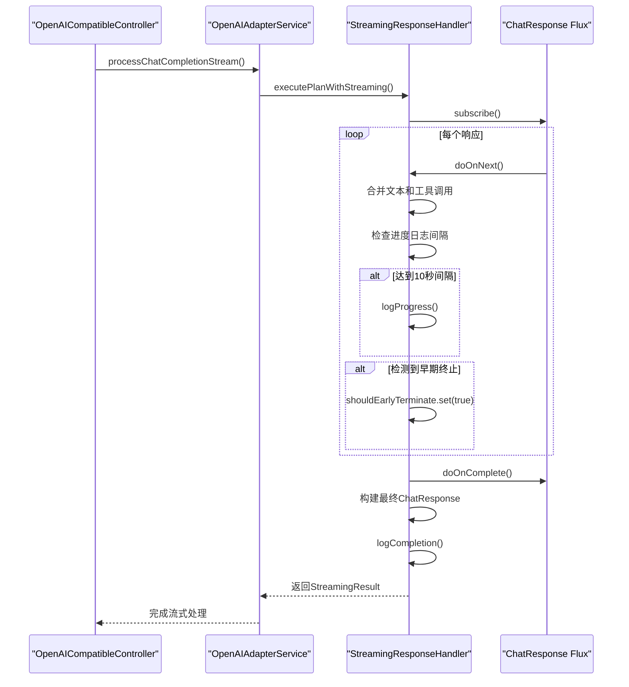
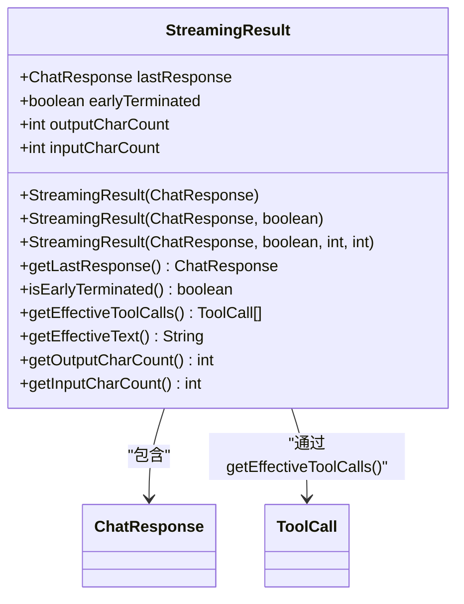
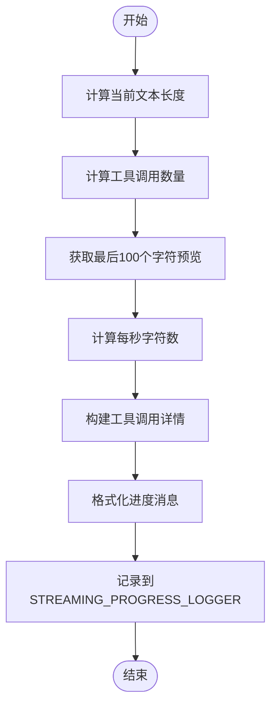
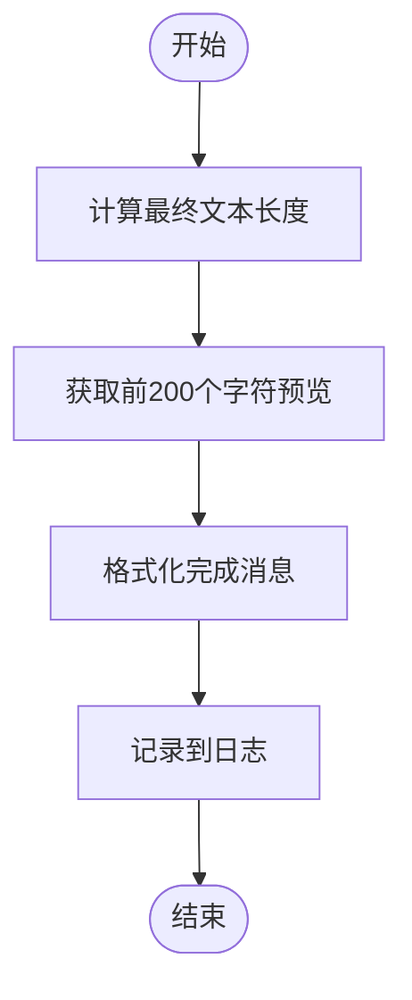
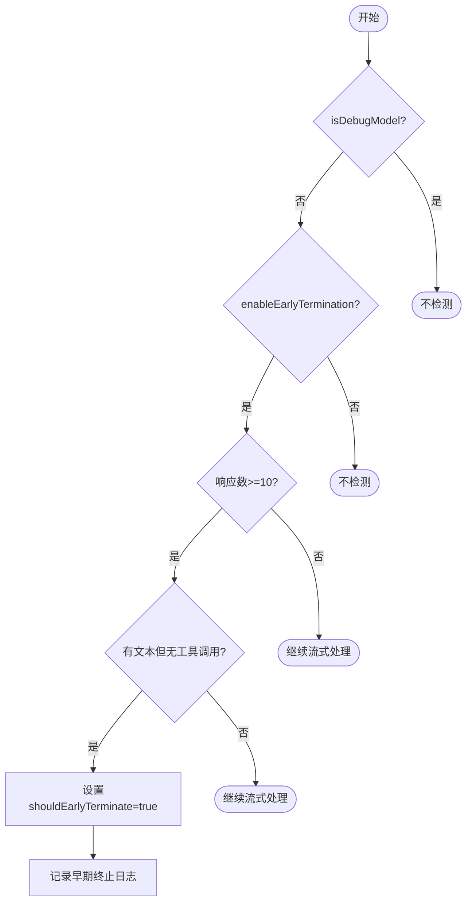
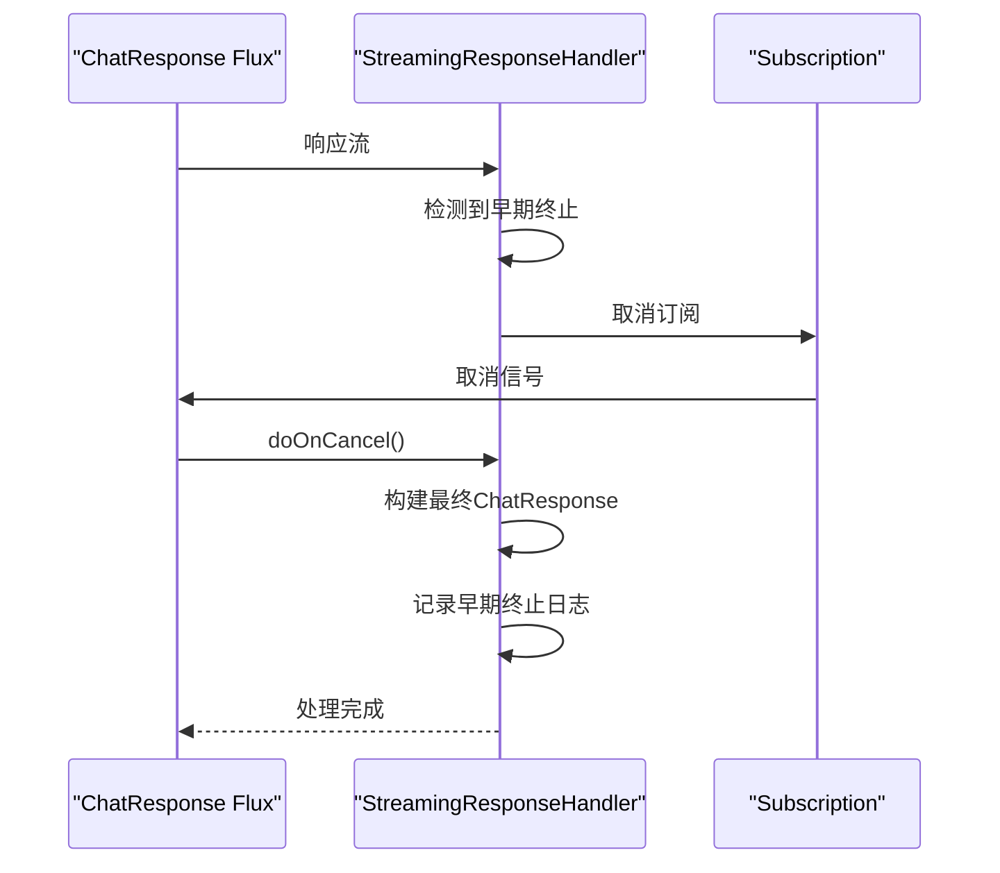
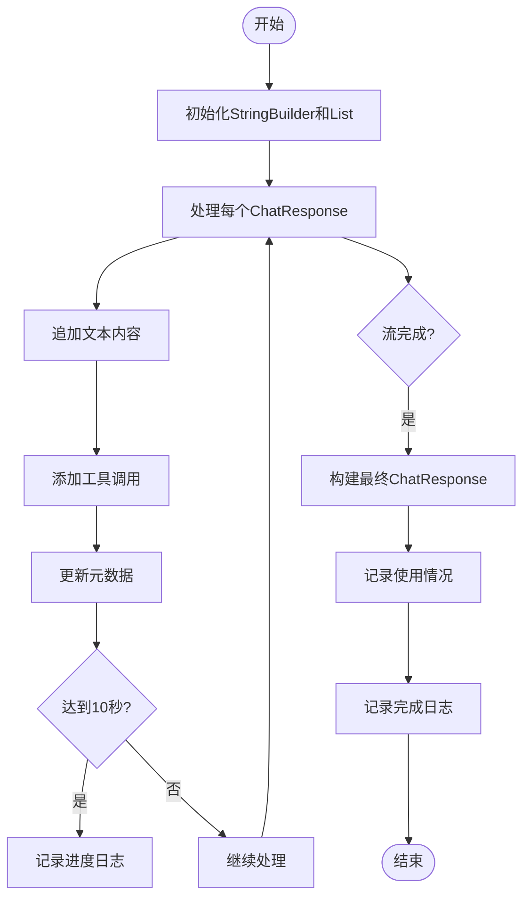
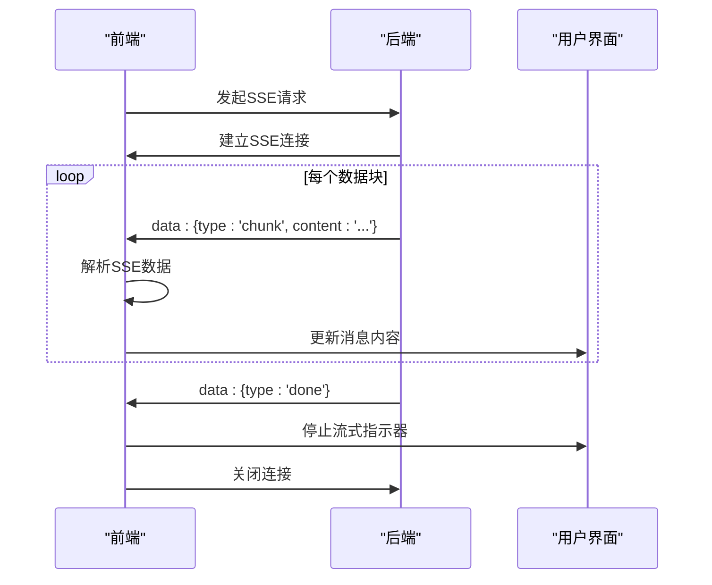
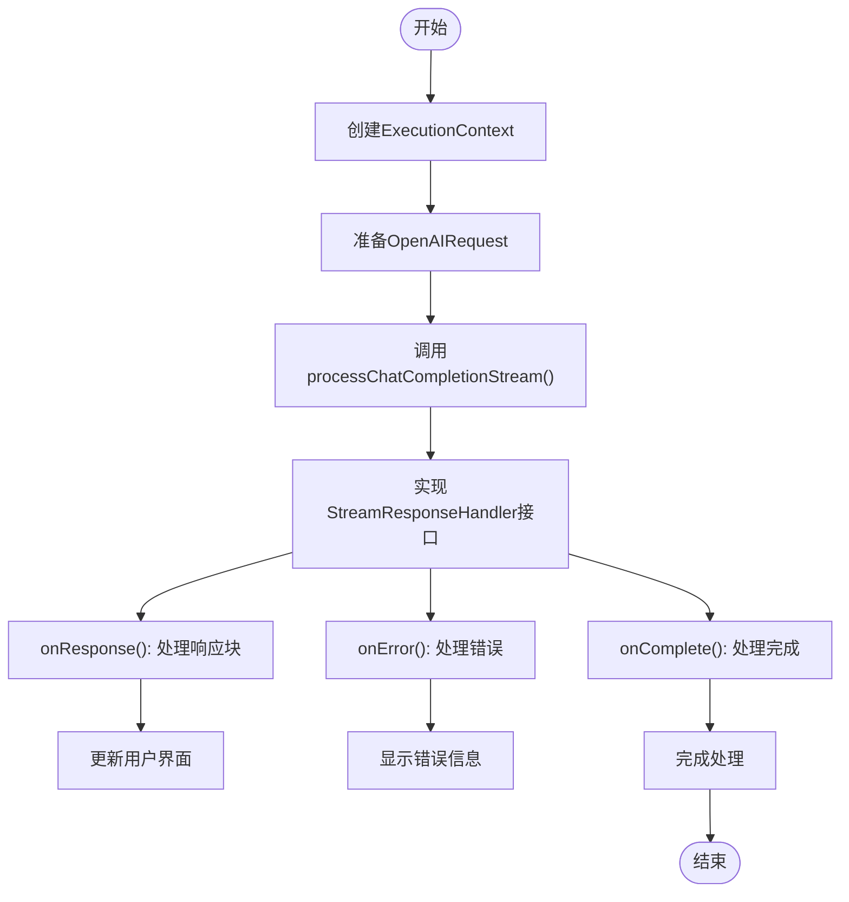

# 流式响应处理

<cite>
**本文档引用的文件**   
- [StreamingResponseHandler.java](file://src/main/java/com/alibaba/cloud/ai/lynxe/llm/StreamingResponseHandler.java)
- [OpenAIAdapterService.java](file://src/main/java/com/alibaba/cloud/ai/lynxe/adapter/service/OpenAIAdapterService.java)
- [OpenAICompatibleController.java](file://src/main/java/com/alibaba/cloud/ai/lynxe/adapter/controller/OpenAICompatibleController.java)
- [LlmTraceRecorder.java](file://src/main/java/com/alibaba/cloud/ai/lynxe/llm/LlmTraceRecorder.java)
</cite>

## 目录
1. [简介](#简介)
2. [核心组件](#核心组件)
3. [流式响应处理流程](#流式响应处理流程)
4. [StreamingResult类详解](#streamingresult类详解)
5. [日志记录机制](#日志记录机制)
6. [早期终止处理](#早期终止处理)
7. [流式响应合并](#流式响应合并)
8. [前端流式处理](#前端流式处理)
9. [性能优化建议](#性能优化建议)
10. [代码示例](#代码示例)

## 简介
本文档详细介绍了流式响应处理的实现机制，重点分析了`processStreamingResponse()`方法的执行流程、`StreamingResult`类的工作原理以及日志记录机制。文档涵盖了从后端到前端的完整流式响应处理链路，包括响应处理、进度监控、早期终止检测和性能优化策略。

## 核心组件

流式响应处理系统由多个核心组件构成，这些组件协同工作以实现高效的流式响应处理。主要组件包括`StreamingResponseHandler`、`OpenAIAdapterService`和`OpenAICompatibleController`，它们分别负责流式响应的处理、适配和控制器层面的协调。

**Section sources**
- [StreamingResponseHandler.java](file://src/main/java/com/alibaba/cloud/ai/lynxe/llm/StreamingResponseHandler.java#L54-L55)
- [OpenAIAdapterService.java](file://src/main/java/com/alibaba/cloud/ai/lynxe/adapter/service/OpenAIAdapterService.java#L36-L37)
- [OpenAICompatibleController.java](file://src/main/java/com/alibaba/cloud/ai/lynxe/adapter/controller/OpenAICompatibleController.java#L50-L53)

## 流式响应处理流程

流式响应处理的核心是`processStreamingResponse()`方法，该方法接收一个`Flux<ChatResponse>`流，并对其进行处理和聚合。处理流程包括响应流的订阅、进度日志记录、早期终止检测和最终结果的合并。

**Diagram sources **
- [StreamingResponseHandler.java](file://src/main/java/com/alibaba/cloud/ai/lynxe/llm/StreamingResponseHandler.java#L167-L437)
- [OpenAIAdapterService.java](file://src/main/java/com/alibaba/cloud/ai/lynxe/adapter/service/OpenAIAdapterService.java#L274-L345)
- [OpenAICompatibleController.java](file://src/main/java/com/alibaba/cloud/ai/lynxe/adapter/controller/OpenAICompatibleController.java#L131-L152)

**Section sources**
- [StreamingResponseHandler.java](file://src/main/java/com/alibaba/cloud/ai/lynxe/llm/StreamingResponseHandler.java#L167-L437)

## StreamingResult类详解

`StreamingResult`类是流式响应处理的结果容器，它封装了流式响应的最终结果和相关元数据。该类提供了多种构造函数以适应不同的使用场景，并提供了丰富的访问方法来获取处理结果。

**Diagram sources **
- [StreamingResponseHandler.java](file://src/main/java/com/alibaba/cloud/ai/lynxe/llm/StreamingResponseHandler.java#L71-L151)

**Section sources**
- [StreamingResponseHandler.java](file://src/main/java/com/alibaba/cloud/ai/lynxe/llm/StreamingResponseHandler.java#L71-L151)

## 日志记录机制

流式响应处理系统实现了详细的日志记录机制，包括进度日志和完成日志。进度日志每10秒输出一次，提供实时的处理进度信息；完成日志在流式处理结束后输出，记录完整的处理结果。

### logProgress()方法实现

`logProgress()`方法负责记录流式响应的处理进度。该方法计算并记录当前已接收的响应数量、字符数、工具调用数以及处理速度等信息。

**Diagram sources **
- [StreamingResponseHandler.java](file://src/main/java/com/alibaba/cloud/ai/lynxe/llm/StreamingResponseHandler.java#L469-L510)

### logCompletion()方法实现

`logCompletion()`方法在流式处理完成后被调用，记录完整的处理结果和统计信息。

**Diagram sources **
- [StreamingResponseHandler.java](file://src/main/java/com/alibaba/cloud/ai/lynxe/llm/StreamingResponseHandler.java#L512-L523)

**Section sources**
- [StreamingResponseHandler.java](file://src/main/java/com/alibaba/cloud/ai/lynxe/llm/StreamingResponseHandler.java#L469-L523)

## 早期终止处理

流式响应处理系统实现了智能的早期终止机制，当检测到模型仅输出思考内容而没有实际工具调用时，系统会自动终止流式响应，以避免不必要的等待和资源消耗。

### 早期终止检测逻辑

**Diagram sources **
- [StreamingResponseHandler.java](file://src/main/java/com/alibaba/cloud/ai/lynxe/llm/StreamingResponseHandler.java#L206-L275)

### 早期终止处理流程

当检测到早期终止条件时，系统会通过`takeUntil()`操作符终止响应流，并在`doOnCancel()`回调中构建最终的`ChatResponse`对象。

**Diagram sources **
- [StreamingResponseHandler.java](file://src/main/java/com/alibaba/cloud/ai/lynxe/llm/StreamingResponseHandler.java#L212-L218)
- [StreamingResponseHandler.java](file://src/main/java/com/alibaba/cloud/ai/lynxe/llm/StreamingResponseHandler.java#L367-L400)

**Section sources**
- [StreamingResponseHandler.java](file://src/main/java/com/alibaba/cloud/ai/lynxe/llm/StreamingResponseHandler.java#L206-L400)

## 流式响应合并

流式响应处理系统实现了高效的响应合并机制，将多个流式响应片段合并为完整的响应内容。合并过程包括文本内容的拼接、工具调用的收集和元数据的聚合。

### 响应合并流程

**Diagram sources **
- [StreamingResponseHandler.java](file://src/main/java/com/alibaba/cloud/ai/lynxe/llm/StreamingResponseHandler.java#L232-L346)

**Section sources**
- [StreamingResponseHandler.java](file://src/main/java/com/alibaba/cloud/ai/lynxe/llm/StreamingResponseHandler.java#L232-L346)

## 前端流式处理

前端系统通过SSE（Server-Sent Events）接收后端的流式响应，并实时更新用户界面。前端处理包括SSE连接的建立、响应流的解析和UI的实时更新。

### 前端流式处理流程

**Section sources**
- [direct-api-service.ts](file://ui-vue3/src/api/direct-api-service.ts#L113-L211)
- [useMessageDialog.ts](file://ui-vue3/src/composables/useMessageDialog.ts#L381-L414)

## 性能优化建议

为了优化流式响应处理的性能，开发者可以考虑以下建议：

### 日志记录频率调整
- **降低日志频率**：如果日志记录过于频繁影响性能，可以将`logProgress()`的调用间隔从10秒增加到15-20秒
- **条件性日志**：根据响应内容的复杂度动态调整日志频率，简单响应减少日志，复杂响应保持详细日志

### 响应处理策略优化
- **并行处理**：对于独立的工具调用，可以考虑并行处理以提高效率
- **缓存机制**：对于重复的请求模式，实现适当的缓存机制以减少LLM调用
- **超时设置**：合理设置流式处理的超时时间，避免长时间等待

### 资源管理
- **连接池**：使用连接池管理后端服务连接，减少连接建立的开销
- **内存优化**：及时清理不再需要的流式响应数据，避免内存泄漏

**Section sources**
- [StreamingResponseHandler.java](file://src/main/java/com/alibaba/cloud/ai/lynxe/llm/StreamingResponseHandler.java#L305-L308)
- [OpenAICompatibleController.java](file://src/main/java/com/alibaba/cloud/ai/lynxe/adapter/controller/OpenAICompatibleController.java#L57-L58)

## 代码示例

以下代码示例展示了如何启动和监控流式响应处理过程：

**Diagram sources **
- [OpenAIAdapterService.java](file://src/main/java/com/alibaba/cloud/ai/lynxe/adapter/service/OpenAIAdapterService.java#L102-L135)
- [OpenAICompatibleController.java](file://src/main/java/com/alibaba/cloud/ai/lynxe/adapter/controller/OpenAICompatibleController.java#L131-L152)

**Section sources**
- [OpenAIAdapterService.java](file://src/main/java/com/alibaba/cloud/ai/lynxe/adapter/service/OpenAIAdapterService.java#L102-L135)