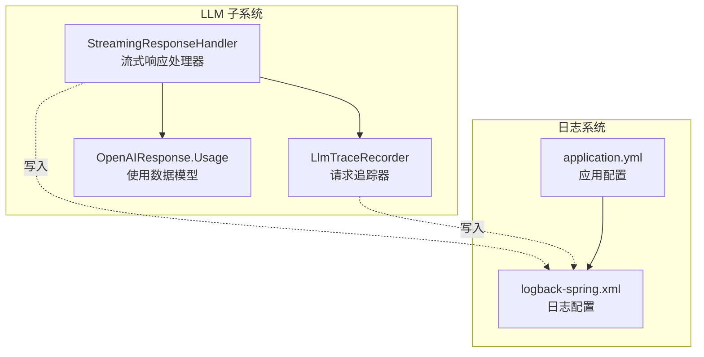
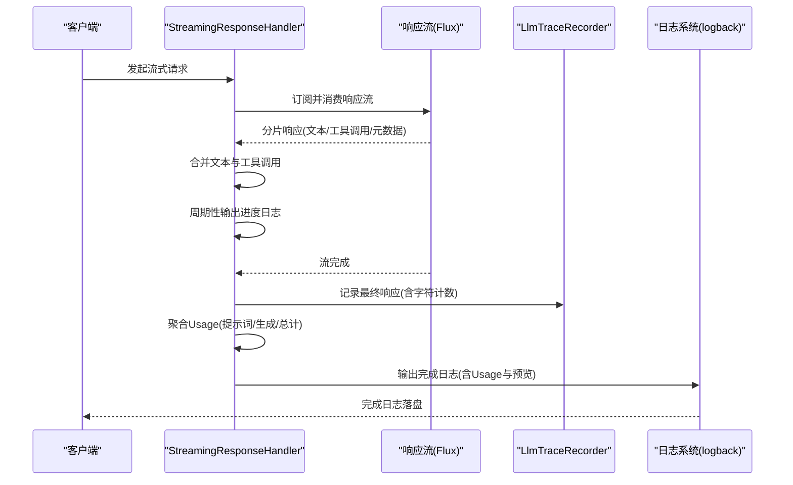
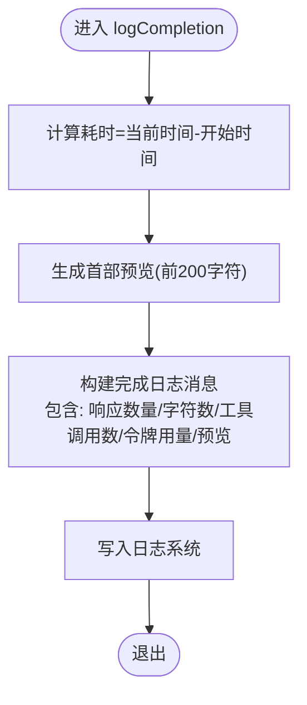
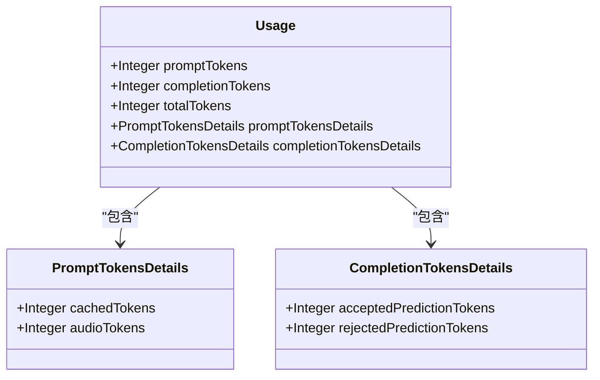
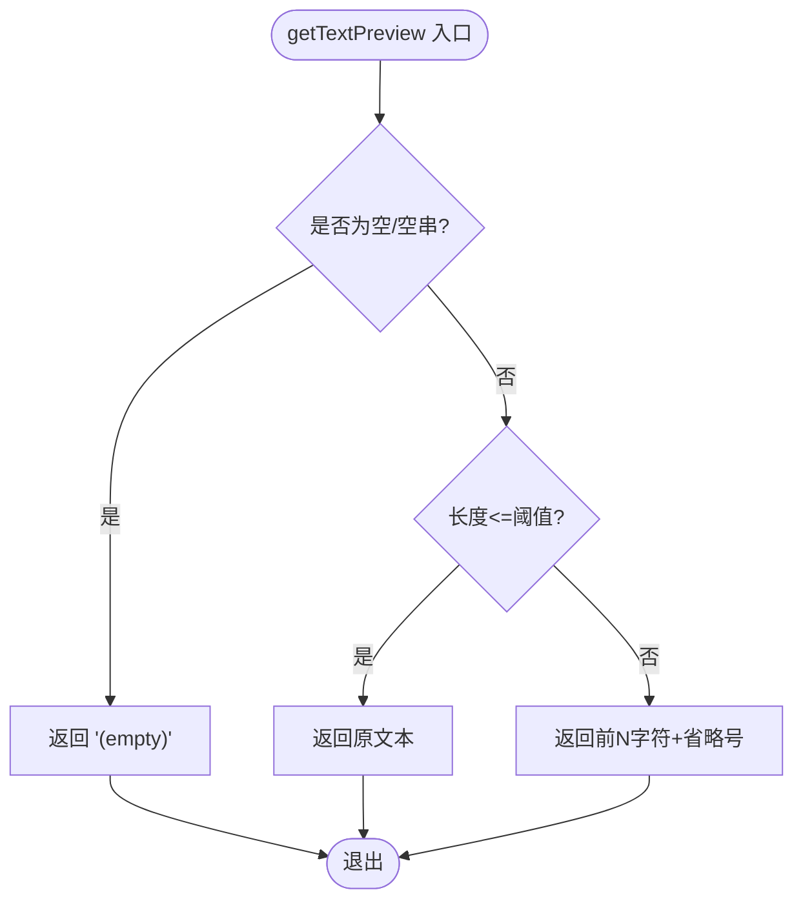
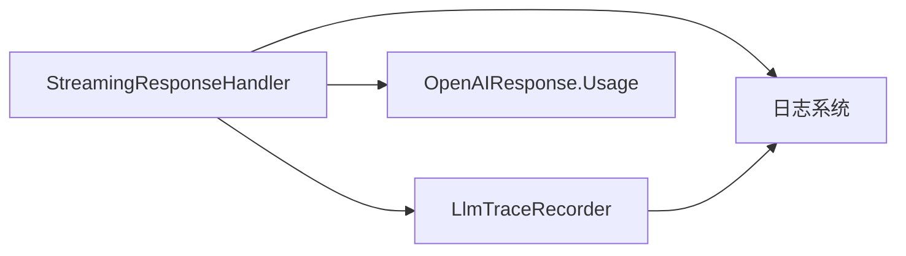

# 流式完成日志记录

<cite>
**本文引用的文件**
- [StreamingResponseHandler.java](file://src/main/java/com/alibaba/cloud/ai/lynxe/llm/StreamingResponseHandler.java)
- [LlmTraceRecorder.java](file://src/main/java/com/alibaba/cloud/ai/lynxe/llm/LlmTraceRecorder.java)
- [OpenAIResponse.java](file://src/main/java/com/alibaba/cloud/ai/lynxe/adapter/model/OpenAIResponse.java)
- [logback-spring.xml](file://src/main/resources/logback-spring.xml)
- [application.yml](file://src/main/resources/application.yml)
</cite>

## 目录
1. [引言](#引言)
2. [项目结构](#项目结构)
3. [核心组件](#核心组件)
4. [架构总览](#架构总览)
5. [详细组件分析](#详细组件分析)
6. [依赖关系分析](#依赖关系分析)
7. [性能考量](#性能考量)
8. [故障排查指南](#故障排查指南)
9. [结论](#结论)
10. [附录](#附录)

## 引言
本文件聚焦于“流式完成日志记录”的完整流程与实现细节，围绕以下目标展开：
- 全面介绍 logCompletion() 方法的功能与作用，该方法在流式响应完成后输出最终统计信息。
- 解释该方法如何整合来自 ChatResponseMetadata 的使用数据（Usage），包括提示词令牌数、生成令牌数与总令牌数。
- 说明 getTextPreview() 方法如何生成响应内容的首部预览（前200字符），用于快速验证结果质量。
- 阐述完成日志中各项关键指标的意义，如处理耗时、响应数量、字符总数、工具调用数量与令牌用量。
- 对比分析与进度日志的差异，强调完成日志在性能分析、成本核算与问题排查中的重要作用。
- 提供实际日志示例与解读，指导如何基于这些信息优化模型调用策略与系统性能。

## 项目结构
与流式完成日志记录直接相关的模块位于后端 Java 工程中，核心类与日志配置如下：
- 流式响应处理器：StreamingResponseHandler.java
- 请求追踪器：LlmTraceRecorder.java
- 使用数据模型：OpenAIResponse.java 中的 Usage 类
- 日志配置：logback-spring.xml（定义了 LLM_REQUEST_LOGGER 与 STREAMING_PROGRESS_LOGGER 的输出位置）
- 应用配置：application.yml（控制日志级别等）

图表来源
- [StreamingResponseHandler.java](file://src/main/java/com/alibaba/cloud/ai/lynxe/llm/StreamingResponseHandler.java#L153-L349)
- [LlmTraceRecorder.java](file://src/main/java/com/alibaba/cloud/ai/lynxe/llm/LlmTraceRecorder.java#L30-L154)
- [OpenAIResponse.java](file://src/main/java/com/alibaba/cloud/ai/lynxe/adapter/model/OpenAIResponse.java#L290-L350)
- [logback-spring.xml](file://src/main/resources/logback-spring.xml#L114-L159)
- [application.yml](file://src/main/resources/application.yml#L48-L59)

章节来源
- [StreamingResponseHandler.java](file://src/main/java/com/alibaba/cloud/ai/lynxe/llm/StreamingResponseHandler.java#L153-L349)
- [LlmTraceRecorder.java](file://src/main/java/com/alibaba/cloud/ai/lynxe/llm/LlmTraceRecorder.java#L30-L154)
- [OpenAIResponse.java](file://src/main/java/com/alibaba/cloud/ai/lynxe/adapter/model/OpenAIResponse.java#L290-L350)
- [logback-spring.xml](file://src/main/resources/logback-spring.xml#L114-L159)
- [application.yml](file://src/main/resources/application.yml#L48-L59)

## 核心组件
- 流式响应处理器（StreamingResponseHandler）
  - 负责合并流式响应片段、周期性输出进度日志、在流结束时输出完成日志，并聚合 Usage 数据。
  - 关键方法：processStreamingResponse(...)、logCompletion(...)、logProgress(...)、getTextPreview(...)。
- 请求追踪器（LlmTraceRecorder）
  - 记录请求与响应的 JSON 字符串，统计输入/输出字符数，便于后续审计与成本分析。
- 使用数据模型（OpenAIResponse.Usage）
  - 定义 promptTokens、completionTokens、totalTokens 及其详情字段，作为完成日志中的关键指标来源。

章节来源
- [StreamingResponseHandler.java](file://src/main/java/com/alibaba/cloud/ai/lynxe/llm/StreamingResponseHandler.java#L153-L349)
- [LlmTraceRecorder.java](file://src/main/java/com/alibaba/cloud/ai/lynxe/llm/LlmTraceRecorder.java#L30-L154)
- [OpenAIResponse.java](file://src/main/java/com/alibaba/cloud/ai/lynxe/adapter/model/OpenAIResponse.java#L290-L350)

## 架构总览
下图展示了从流式响应到完成日志输出的端到端流程，以及与日志系统的交互。

图表来源
- [StreamingResponseHandler.java](file://src/main/java/com/alibaba/cloud/ai/lynxe/llm/StreamingResponseHandler.java#L153-L349)
- [LlmTraceRecorder.java](file://src/main/java/com/alibaba/cloud/ai/lynxe/llm/LlmTraceRecorder.java#L88-L100)
- [logback-spring.xml](file://src/main/resources/logback-spring.xml#L114-L159)

## 详细组件分析

### logCompletion() 方法详解
- 功能定位
  - 在流式响应完成后输出最终统计信息，包含处理耗时、响应数量、字符总数、工具调用数量与令牌用量，并附带首部预览。
- 输入参数
  - contextName：上下文名称，用于标识本次处理场景（例如“Agent 思考”、“计划创建”）。
  - finalText：最终合并的文本内容。
  - toolCallCount：工具调用数量。
  - responseCount：响应分片数量。
  - startTime：开始时间戳。
  - usage：Usage 对象，包含 promptTokens、completionTokens、totalTokens。
- 输出行为
  - 使用日志系统输出一条完成日志，包含上述指标与首部预览。
- 预览策略
  - 使用 getTextPreview(finalText, 200) 生成首部预览，避免一次性打印过长文本导致日志膨胀。

图表来源
- [StreamingResponseHandler.java](file://src/main/java/com/alibaba/cloud/ai/lynxe/llm/StreamingResponseHandler.java#L511-L523)
- [StreamingResponseHandler.java](file://src/main/java/com/alibaba/cloud/ai/lynxe/llm/StreamingResponseHandler.java#L524-L533)

章节来源
- [StreamingResponseHandler.java](file://src/main/java/com/alibaba/cloud/ai/lynxe/llm/StreamingResponseHandler.java#L511-L523)
- [StreamingResponseHandler.java](file://src/main/java/com/alibaba/cloud/ai/lynxe/llm/StreamingResponseHandler.java#L524-L533)

### Usage 数据整合与完成日志指标
- Usage 来源
  - 在流式处理过程中，StreamingResponseHandler 会持续从 ChatResponseMetadata 中提取 Usage 并进行累加或覆盖更新，最终在流完成时汇总为 MessageAggregator.DefaultUsage。
- 完成日志中的关键指标
  - 处理耗时：完成时刻减去开始时刻。
  - 响应数量：累计的响应分片数量。
  - 字符总数：最终文本长度。
  - 工具调用数量：最终工具调用列表长度。
  - 令牌用量：promptTokens、completionTokens、totalTokens。
- Usage 模型
  - OpenAIResponse.Usage 定义了 promptTokens、completionTokens、totalTokens 及其详情字段，作为完成日志的直接来源。

图表来源
- [OpenAIResponse.java](file://src/main/java/com/alibaba/cloud/ai/lynxe/adapter/model/OpenAIResponse.java#L290-L350)

章节来源
- [OpenAIResponse.java](file://src/main/java/com/alibaba/cloud/ai/lynxe/adapter/model/OpenAIResponse.java#L290-L350)
- [StreamingResponseHandler.java](file://src/main/java/com/alibaba/cloud/ai/lynxe/llm/StreamingResponseHandler.java#L276-L300)
- [StreamingResponseHandler.java](file://src/main/java/com/alibaba/cloud/ai/lynxe/llm/StreamingResponseHandler.java#L312-L321)

### getTextPreview() 预览机制
- 设计目的
  - 通过截取首部预览（前200字符）快速验证结果质量，避免日志过大影响可读性与性能。
- 实现要点
  - 当文本为空或 null 时返回占位字符串。
  - 当文本长度超过阈值时截断并在末尾添加省略号。
- 其他预览方法
  - getLastTextPreview()：用于进度日志，展示最后 N 字符。
  - getTextPreviewWithHeadAndTail()：在早期终止场景中展示首尾各若干字符并省略中间内容，便于快速定位问题。

图表来源
- [StreamingResponseHandler.java](file://src/main/java/com/alibaba/cloud/ai/lynxe/llm/StreamingResponseHandler.java#L524-L533)
- [StreamingResponseHandler.java](file://src/main/java/com/alibaba/cloud/ai/lynxe/llm/StreamingResponseHandler.java#L535-L546)
- [StreamingResponseHandler.java](file://src/main/java/com/alibaba/cloud/ai/lynxe/llm/StreamingResponseHandler.java#L548-L563)

章节来源
- [StreamingResponseHandler.java](file://src/main/java/com/alibaba/cloud/ai/lynxe/llm/StreamingResponseHandler.java#L524-L533)
- [StreamingResponseHandler.java](file://src/main/java/com/alibaba/cloud/ai/lynxe/llm/StreamingResponseHandler.java#L535-L546)
- [StreamingResponseHandler.java](file://src/main/java/com/alibaba/cloud/ai/lynxe/llm/StreamingResponseHandler.java#L548-L563)

### 进度日志与完成日志的差异
- 进度日志（每10秒一次）
  - 内容：累计响应数量、累计字符数、字符速率、工具调用数量、工具调用详情、最后100字符预览。
  - 目的：防止用户误以为服务无响应，提供实时反馈。
- 完成日志（流结束时）
  - 内容：处理耗时、响应数量、字符总数、工具调用数量、令牌用量、首部预览。
  - 目的：提供最终统计与成本核算依据，便于问题排查与性能分析。

章节来源
- [StreamingResponseHandler.java](file://src/main/java/com/alibaba/cloud/ai/lynxe/llm/StreamingResponseHandler.java#L469-L510)
- [StreamingResponseHandler.java](file://src/main/java/com/alibaba/cloud/ai/lynxe/llm/StreamingResponseHandler.java#L511-L523)

### 日志输出与配置
- 日志分类
  - LLM_REQUEST_LOGGER：记录请求与响应的 JSON，便于审计与重放。
  - STREAMING_PROGRESS_LOGGER：记录流式进度日志，独立文件滚动。
- 日志落盘
  - logback-spring.xml 定义了 LLM_REQUEST 与 STREAMING_PROGRESS 的滚动策略与保留策略，确保长期运行下的可维护性。
- 日志级别
  - application.yml 控制根日志级别与包级日志级别，确保完成日志与进度日志按需输出。

章节来源
- [logback-spring.xml](file://src/main/resources/logback-spring.xml#L114-L159)
- [application.yml](file://src/main/resources/application.yml#L48-L59)

## 依赖关系分析
- 组件耦合
  - StreamingResponseHandler 依赖 LlmTraceRecorder 进行响应记录与字符计数；依赖 ChatResponseMetadata/Usage 获取令牌用量；依赖日志系统输出进度与完成日志。
- 外部依赖
  - Spring AI 的 ChatResponse、ChatResponseMetadata、Usage、MessageAggregator。
  - Jackson ObjectMapper 用于序列化请求/响应以便记录。

图表来源
- [StreamingResponseHandler.java](file://src/main/java/com/alibaba/cloud/ai/lynxe/llm/StreamingResponseHandler.java#L153-L349)
- [LlmTraceRecorder.java](file://src/main/java/com/alibaba/cloud/ai/lynxe/llm/LlmTraceRecorder.java#L88-L100)
- [OpenAIResponse.java](file://src/main/java/com/alibaba/cloud/ai/lynxe/adapter/model/OpenAIResponse.java#L290-L350)
- [logback-spring.xml](file://src/main/resources/logback-spring.xml#L114-L159)

章节来源
- [StreamingResponseHandler.java](file://src/main/java/com/alibaba/cloud/ai/lynxe/llm/StreamingResponseHandler.java#L153-L349)
- [LlmTraceRecorder.java](file://src/main/java/com/alibaba/cloud/ai/lynxe/llm/LlmTraceRecorder.java#L88-L100)
- [OpenAIResponse.java](file://src/main/java/com/alibaba/cloud/ai/lynxe/adapter/model/OpenAIResponse.java#L290-L350)
- [logback-spring.xml](file://src/main/resources/logback-spring.xml#L114-L159)

## 性能考量
- 日志频率与开销
  - 进度日志每10秒一次，避免频繁 IO；完成日志仅在流结束时输出，降低峰值日志量。
- 文本预览策略
  - 完成日志采用首部预览（200字符），进度日志采用尾部预览（100字符），兼顾可观测性与日志体积。
- 令牌用量聚合
  - 在流过程中持续更新 Usage，最终一次性输出，减少重复计算与日志噪声。
- 字符计数
  - LlmTraceRecorder 通过序列化响应 JSON 计算输出字符数，便于统一口径的成本统计。

章节来源
- [StreamingResponseHandler.java](file://src/main/java/com/alibaba/cloud/ai/lynxe/llm/StreamingResponseHandler.java#L469-L510)
- [StreamingResponseHandler.java](file://src/main/java/com/alibaba/cloud/ai/lynxe/llm/StreamingResponseHandler.java#L511-L523)
- [LlmTraceRecorder.java](file://src/main/java/com/alibaba/cloud/ai/lynxe/llm/LlmTraceRecorder.java#L88-L100)

## 故障排查指南
- 完成日志缺失
  - 检查日志级别与 appender 配置，确认 LLM_REQUEST_LOGGER 与 STREAMING_PROGRESS_LOGGER 的输出路径与滚动策略。
- 令牌用量异常
  - 核对 Usage 字段是否在响应元数据中存在，确认流式处理中是否正确更新 promptTokens、completionTokens、totalTokens。
- 预览不完整
  - 若需要更全面的预览，可在早期终止场景使用首尾预览方法，或调整预览长度。
- 错误日志
  - LlmTraceRecorder 会在异常时记录错误详情，结合完成日志可快速定位问题。

章节来源
- [logback-spring.xml](file://src/main/resources/logback-spring.xml#L114-L159)
- [StreamingResponseHandler.java](file://src/main/java/com/alibaba/cloud/ai/lynxe/llm/StreamingResponseHandler.java#L347-L401)
- [LlmTraceRecorder.java](file://src/main/java/com/alibaba/cloud/ai/lynxe/llm/LlmTraceRecorder.java#L101-L121)

## 结论
- 流式完成日志记录通过 logCompletion() 将处理耗时、响应数量、字符总数、工具调用数量与令牌用量等关键指标集中呈现，是性能分析、成本核算与问题排查的重要依据。
- 与进度日志相比，完成日志更关注最终统计与可审计性，预览策略则兼顾可读性与性能。
- 建议在生产环境中开启完成日志与 LLM_REQUEST_LOGGER，并结合日志滚动策略与保留策略，确保长期可维护性。

## 附录

### 实际日志示例与解读
- 完成日志示例
  - 示例格式（示意）：  
    “✅ 上下文名称 - Completed[耗时ms]: 响应数量个, 字符数个, 工具调用数量个, 提示词令牌数, 生成令牌数, 总令牌数. 预览: ‘首部预览’”
  - 解读要点：
    - 耗时：衡量整体吞吐与延迟。
    - 响应数量：反映流式分片规模。
    - 字符总数：衡量输出体量。
    - 工具调用数量：衡量推理链复杂度。
    - 令牌用量：用于成本核算与配额管理。
- 进度日志示例
  - 示例格式（示意）：  
    “🔄 上下文名称 - Progress[耗时ms]: 收到响应数量个, 累计字符数(字符/秒), 工具调用数量个. 工具调用详情. 最后100字符: ‘尾部预览’”
  - 解读要点：
    - 字符/秒：评估生成速率与网络状况。
    - 工具调用详情：辅助定位推理链问题。

章节来源
- [StreamingResponseHandler.java](file://src/main/java/com/alibaba/cloud/ai/lynxe/llm/StreamingResponseHandler.java#L469-L510)
- [StreamingResponseHandler.java](file://src/main/java/com/alibaba/cloud/ai/lynxe/llm/StreamingResponseHandler.java#L511-L523)

### 优化建议
- 调整预览长度
  - 根据业务需求适当调整完成日志预览长度，平衡可观测性与日志体积。
- 合理设置日志级别
  - 在高并发场景下，适度降低 INFO 级别以外的日志输出，减少磁盘 IO 压力。
- 使用 Usage 进行成本控制
  - 将 Usage 与预算/配额联动，触发告警或短路策略，避免超支。
- 早期终止策略
  - 在非调试模式下启用早期终止，避免无效思考-only 响应带来的资源浪费。

章节来源
- [StreamingResponseHandler.java](file://src/main/java/com/alibaba/cloud/ai/lynxe/llm/StreamingResponseHandler.java#L248-L275)
- [application.yml](file://src/main/resources/application.yml#L48-L59)