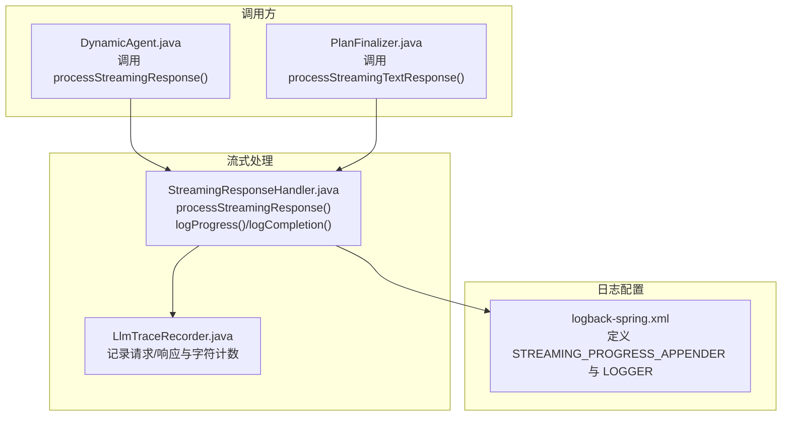
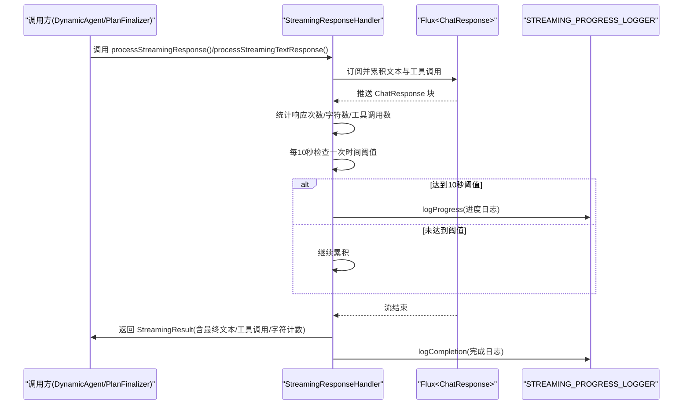
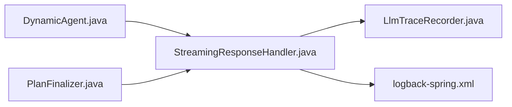

# 流式进度日志记录

<cite>
**本文引用的文件**
- [StreamingResponseHandler.java](file://src/main/java/com/alibaba/cloud/ai/lynxe/llm/StreamingResponseHandler.java)
- [logback-spring.xml](file://src/main/resources/logback-spring.xml)
- [LlmTraceRecorder.java](file://src/main/java/com/alibaba/cloud/ai/lynxe/llm/LlmTraceRecorder.java)
- [DynamicAgent.java](file://src/main/java/com/alibaba/cloud/ai/lynxe/agent/DynamicAgent.java)
- [PlanFinalizer.java](file://src/main/java/com/alibaba/cloud/ai/lynxe/planning/service/PlanFinalizer.java)
</cite>

## 目录
1. [简介](#简介)
2. [项目结构](#项目结构)
3. [核心组件](#核心组件)
4. [架构总览](#架构总览)
5. [详细组件分析](#详细组件分析)
6. [依赖关系分析](#依赖关系分析)
7. [性能考量](#性能考量)
8. [故障排查指南](#故障排查指南)
9. [结论](#结论)
10. [附录](#附录)

## 简介
本文件围绕“流式进度日志记录”功能展开，重点解析 StreamingResponseHandler 中的 logProgress() 方法实现细节，包括：
- 定时机制：每10秒触发一次的进度日志输出
- 性能指标：字符生成速率（chars/sec）的计算与展示
- 文本预览策略：getLastTextPreview() 如何截取最后100个字符提供上下文
- 工具调用详情格式化：工具ID、名称与参数的展示方式
- 日志消息指标含义：响应次数、字符数、工具调用数等
- 设计决策：使用独立的 STREAMING_PROGRESS_LOGGER 的优势
- 配置建议：如何调整日志级别与输出格式以适配不同环境

## 项目结构
与流式进度日志直接相关的模块与文件如下：
- 流式处理与进度日志：StreamingResponseHandler.java
- 日志配置：logback-spring.xml
- 请求追踪与字符计数：LlmTraceRecorder.java
- 使用示例（调用方）：DynamicAgent.java、PlanFinalizer.java

图表来源
- [StreamingResponseHandler.java](file://src/main/java/com/alibaba/cloud/ai/lynxe/llm/StreamingResponseHandler.java#L153-L565)
- [logback-spring.xml](file://src/main/resources/logback-spring.xml#L114-L159)
- [LlmTraceRecorder.java](file://src/main/java/com/alibaba/cloud/ai/lynxe/llm/LlmTraceRecorder.java#L1-L156)
- [DynamicAgent.java](file://src/main/java/com/alibaba/cloud/ai/lynxe/agent/DynamicAgent.java#L360-L440)
- [PlanFinalizer.java](file://src/main/java/com/alibaba/cloud/ai/lynxe/planning/service/PlanFinalizer.java#L130-L140)

章节来源
- [StreamingResponseHandler.java](file://src/main/java/com/alibaba/cloud/ai/lynxe/llm/StreamingResponseHandler.java#L153-L565)
- [logback-spring.xml](file://src/main/resources/logback-spring.xml#L114-L159)

## 核心组件
- StreamingResponseHandler：负责合并流式响应、周期性输出进度日志、完成时汇总统计，并提供文本预览与工具调用详情格式化。
- LlmTraceRecorder：记录请求/响应与字符计数，供最终结果统计使用。
- 日志配置：通过 logback-spring.xml 定义独立的 STREAMING_PROGRESS_APPENDER 与 LOGGER，确保进度日志单独落盘与滚动策略。

章节来源
- [StreamingResponseHandler.java](file://src/main/java/com/alibaba/cloud/ai/lynxe/llm/StreamingResponseHandler.java#L153-L565)
- [LlmTraceRecorder.java](file://src/main/java/com/alibaba/cloud/ai/lynxe/llm/LlmTraceRecorder.java#L1-L156)
- [logback-spring.xml](file://src/main/resources/logback-spring.xml#L114-L159)

## 架构总览
下图展示了从调用方到流式处理再到日志输出的整体流程。

图表来源
- [StreamingResponseHandler.java](file://src/main/java/com/alibaba/cloud/ai/lynxe/llm/StreamingResponseHandler.java#L153-L565)
- [DynamicAgent.java](file://src/main/java/com/alibaba/cloud/ai/lynxe/agent/DynamicAgent.java#L360-L440)
- [PlanFinalizer.java](file://src/main/java/com/alibaba/cloud/ai/lynxe/planning/service/PlanFinalizer.java#L130-L140)

## 详细组件分析

### logProgress() 方法实现细节
- 触发条件：在 doOnNext 回调中，每10秒检查一次自上次日志输出以来的时间差，若达到或超过10000毫秒，则调用 logProgress() 输出进度日志。
- 进度指标：
  - 响应次数：累计收到的 ChatResponse 数量
  - 字符数：当前已累积文本长度
  - 字符生成速率：基于“当前字符数 / 已耗时毫秒数 × 1000”计算，单位为 chars/sec
  - 工具调用数：当前已累积的工具调用列表长度
  - 工具调用详情：格式化为“[id]name(args)”的形式；若无参数则省略括号
  - 文本预览：getLastTextPreview() 截取最后100个字符，便于快速定位上下文
- 输出位置：仅写入 STREAMING_PROGRESS_LOGGER，避免污染主 LLM 请求日志

章节来源
- [StreamingResponseHandler.java](file://src/main/java/com/alibaba/cloud/ai/lynxe/llm/StreamingResponseHandler.java#L302-L309)
- [StreamingResponseHandler.java](file://src/main/java/com/alibaba/cloud/ai/lynxe/llm/StreamingResponseHandler.java#L469-L510)
- [StreamingResponseHandler.java](file://src/main/java/com/alibaba/cloud/ai/lynxe/llm/StreamingResponseHandler.java#L535-L546)

### 文本预览生成策略
- getLastTextPreview()：当文本长度超过阈值时，返回“... + 尾部N个字符”，便于观察最新内容
- getTextPreview()：用于完成日志的首部预览（默认200字符），便于快速概览
- getTextPreviewWithHeadAndTail()：用于早期终止检测时的首尾拼接预览（各取200字符）

章节来源
- [StreamingResponseHandler.java](file://src/main/java/com/alibaba/cloud/ai/lynxe/llm/StreamingResponseHandler.java#L525-L562)

### 工具调用详情格式化
- 格式规则：
  - 若存在参数：形如 “[id]name(args)”
  - 若不存在参数：形如 “[id]name”
- 多工具调用以逗号分隔，便于快速识别本次流中出现的所有工具

章节来源
- [StreamingResponseHandler.java](file://src/main/java/com/alibaba/cloud/ai/lynxe/llm/StreamingResponseHandler.java#L479-L501)

### 日志消息指标含义
- 响应数量：累计收到的 ChatResponse 数量
- 字符数：当前已累积文本长度
- 字符生成速率：chars/sec，反映实时吞吐
- 工具调用数：当前已累积的工具调用数量
- 工具调用详情：按格式展示工具ID、名称与参数
- 文本预览：最后100个字符，便于快速定位最新内容

章节来源
- [StreamingResponseHandler.java](file://src/main/java/com/alibaba/cloud/ai/lynxe/llm/StreamingResponseHandler.java#L469-L510)

### 定时机制与性能考量
- 定时逻辑：在 doOnNext 中记录上次日志时间，每次收到新块时计算与当前时间的差值，达到10秒阈值即输出进度日志
- 性能影响：
  - 10秒间隔频率适中，既能及时反馈进度，又不会频繁写盘造成IO压力
  - chars/sec 计算采用“当前字符数/耗时秒数”的近似，避免每块都进行昂贵的字符串操作
  - 文本预览截断为固定长度，降低日志体积与序列化成本

章节来源
- [StreamingResponseHandler.java](file://src/main/java/com/alibaba/cloud/ai/lynxe/llm/StreamingResponseHandler.java#L302-L309)
- [StreamingResponseHandler.java](file://src/main/java/com/alibaba/cloud/ai/lynxe/llm/StreamingResponseHandler.java#L475-L478)

### 独立日志器设计决策与优势
- 独立日志器：STREAMING_PROGRESS_LOGGER 与 LLM_REQUEST_LOGGER 分离
- 优势：
  - 便于按需滚动策略与保留周期管理（进度日志更短保留期）
  - 便于在生产环境将进度日志定向到独立文件，减少噪声
  - 便于在不同环境（开发/测试/生产）分别调整级别与输出格式

章节来源
- [logback-spring.xml](file://src/main/resources/logback-spring.xml#L114-L159)
- [StreamingResponseHandler.java](file://src/main/java/com/alibaba/cloud/ai/lynxe/llm/StreamingResponseHandler.java#L59-L61)

### 使用示例与调用链
- DynamicAgent 在“思考阶段”启用早停（enableEarlyTermination=true），调用 processStreamingResponse() 并读取 StreamingResult 的最终文本与工具调用
- PlanFinalizer 在纯文本摘要场景禁用早停，调用 processStreamingTextResponse() 获取合并后的文本

章节来源
- [DynamicAgent.java](file://src/main/java/com/alibaba/cloud/ai/lynxe/agent/DynamicAgent.java#L360-L440)
- [PlanFinalizer.java](file://src/main/java/com/alibaba/cloud/ai/lynxe/planning/service/PlanFinalizer.java#L130-L140)

## 依赖关系分析
- StreamingResponseHandler 依赖：
  - LlmTraceRecorder：用于记录请求/响应与字符计数，最终汇总到 StreamingResult
  - 日志配置：通过 logback-spring.xml 定义 STREAMING_PROGRESS_LOGGER 与 APPENDER
- 调用方：
  - DynamicAgent：在思考阶段启用早停，关注工具调用与早期终止
  - PlanFinalizer：在文本摘要场景禁用早停，关注纯文本生成

图表来源
- [DynamicAgent.java](file://src/main/java/com/alibaba/cloud/ai/lynxe/agent/DynamicAgent.java#L360-L440)
- [PlanFinalizer.java](file://src/main/java/com/alibaba/cloud/ai/lynxe/planning/service/PlanFinalizer.java#L130-L140)
- [StreamingResponseHandler.java](file://src/main/java/com/alibaba/cloud/ai/lynxe/llm/StreamingResponseHandler.java#L153-L565)
- [LlmTraceRecorder.java](file://src/main/java/com/alibaba/cloud/ai/lynxe/llm/LlmTraceRecorder.java#L1-L156)
- [logback-spring.xml](file://src/main/resources/logback-spring.xml#L114-L159)

## 性能考量
- 进度日志频率：每10秒一次，兼顾可观测性与IO开销
- 字符生成速率：基于累计字符数与耗时计算，避免每块重复昂贵运算
- 文本预览：固定长度截断，降低日志体积与序列化成本
- 日志分离：进度日志独立落盘，避免与主请求日志相互干扰

[本节为通用性能讨论，不直接分析具体文件]

## 故障排查指南
- 进度日志未输出
  - 检查是否达到10秒阈值；确认 doOnNext 中时间戳更新逻辑正常
  - 检查 STREAMING_PROGRESS_LOGGER 是否正确配置且级别为 INFO
- 工具调用详情为空
  - 确认流中确实包含工具调用；检查工具调用列表是否被正确累积
- 字符生成速率异常
  - 检查 startTime 是否正确初始化；确认 elapsed 时间计算无误
- 完成日志缺失
  - 确认流正常结束；检查 doOnComplete 中 finalChatResponse 构造与 logCompletion 调用

章节来源
- [StreamingResponseHandler.java](file://src/main/java/com/alibaba/cloud/ai/lynxe/llm/StreamingResponseHandler.java#L302-L309)
- [StreamingResponseHandler.java](file://src/main/java/com/alibaba/cloud/ai/lynxe/llm/StreamingResponseHandler.java#L469-L510)
- [logback-spring.xml](file://src/main/resources/logback-spring.xml#L114-L159)

## 结论
- logProgress() 通过每10秒的定时机制与字符生成速率计算，提供了高性价比的流式可观测性
- 文本预览与工具调用详情格式化增强了日志的可读性与诊断价值
- 独立的日志器设计提升了运维灵活性与可维护性
- 建议在不同环境按需调整日志级别与滚动策略，以平衡可观测性与存储成本

[本节为总结性内容，不直接分析具体文件]

## 附录

### 日志配置建议
- 日志级别
  - 开发环境：INFO 或 DEBUG，便于调试
  - 生产环境：INFO，避免过度日志
- 输出格式
  - 可根据团队规范调整 logback-spring.xml 中 encoder 的 pattern
- 滚动策略
  - STREAMING_PROGRESS：较小单文件大小与较短保留天数，适合高频进度日志
  - LLM_REQUEST：较大单文件大小与较长保留天数，适合完整请求/响应追踪

章节来源
- [logback-spring.xml](file://src/main/resources/logback-spring.xml#L114-L159)