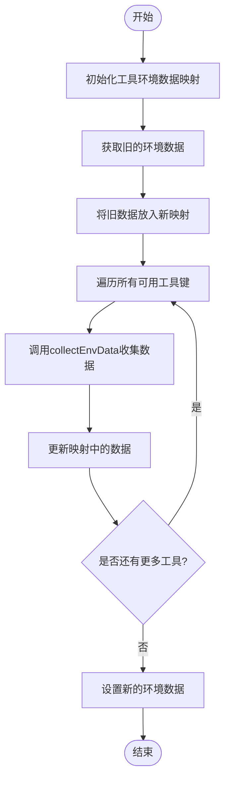
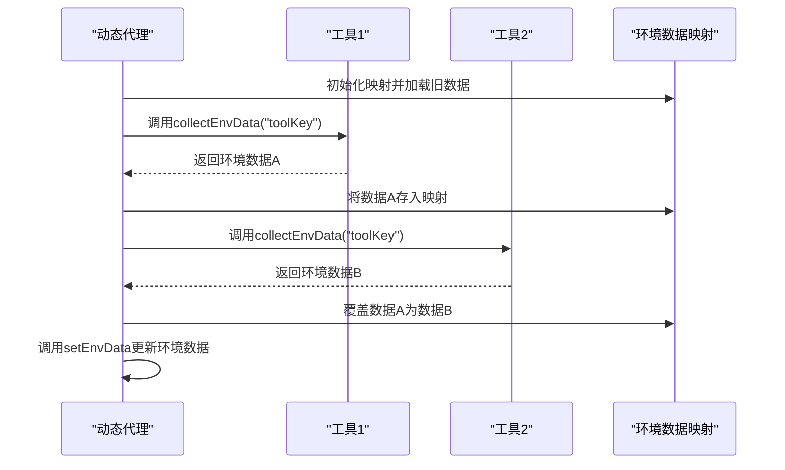

# 环境数据合并与覆盖

<cite>
**本文档引用的文件**   
- [DynamicAgent.java](file://src/main/java/com/alibaba/cloud/ai/lynxe/agent/DynamicAgent.java)
- [BaseAgent.java](file://src/main/java/com/alibaba/cloud/ai/lynxe/agent/BaseAgent.java)
- [ToolCallBiFunctionDef.java](file://src/main/java/com/alibaba/cloud/ai/lynxe/tool/ToolCallBiFunctionDef.java)
- [PlanningFactory.java](file://src/main/java/com/alibaba/cloud/ai/lynxe/planning/PlanningFactory.java)
</cite>

## 目录
1. [简介](#简介)
2. [环境数据合并流程](#环境数据合并流程)
3. [冲突解决策略](#冲突解决策略)
4. [对AI代理决策的影响](#对ai代理决策的影响)
5. [开发者配置与扩展点](#开发者配置与扩展点)
6. [总结](#总结)

## 简介
本文档详细阐述了在`collectAndSetEnvDataForTools()`流程中，当多个工具提供相同环境数据键时的合并逻辑和覆盖规则。系统通过优先级策略解决冲突，确保最关键或最新的环境信息被保留，从而影响AI代理的决策过程。

## 环境数据合并流程
`collectAndSetEnvDataForTools()`方法负责收集并设置工具的环境数据。该方法首先从现有环境数据中创建一个映射，然后遍历所有可用的工具键，调用`collectEnvData()`方法获取每个工具的环境数据，并将其放入映射中。最后，使用`setEnvData()`方法更新环境数据。

**Diagram sources**
- [DynamicAgent.java](file://src/main/java/com/alibaba/cloud/ai/lynxe/agent/DynamicAgent.java#L1451-L1465)

**Section sources**
- [DynamicAgent.java](file://src/main/java/com/alibaba/cloud/ai/lynxe/agent/DynamicAgent.java#L1451-L1465)

## 冲突解决策略
当多个工具提供相同环境数据键时，系统采用覆盖策略来解决冲突。具体来说，在`collectAndSetEnvDataForTools()`方法中，新收集的数据会直接覆盖旧的数据。这意味着后处理的工具的数据将优先于先处理的工具的数据。

**Diagram sources**
- [DynamicAgent.java](file://src/main/java/com/alibaba/cloud/ai/lynxe/agent/DynamicAgent.java#L1451-L1465)

**Section sources**
- [DynamicAgent.java](file://src/main/java/com/alibaba/cloud/ai/lynxe/agent/DynamicAgent.java#L1451-L1465)

## 对AI代理决策的影响
环境数据的合并行为直接影响AI代理的决策过程。通过确保最新或最关键的环境信息被保留，系统能够使AI代理基于最准确的信息做出决策。例如，如果一个工具提供了更新的文件状态，而另一个工具提供了过时的状态，系统会选择最新的状态，从而避免基于错误信息进行决策。

## 开发者配置与扩展点
开发者可以通过实现`ToolCallBiFunctionDef`接口来自定义工具的行为，包括如何生成环境数据。此外，通过重写`getCurrentToolStateString()`方法，可以控制每个工具提供的环境数据内容。这为开发者提供了灵活的扩展点，以适应不同的应用场景。

**Section sources**
- [ToolCallBiFunctionDef.java](file://src/main/java/com/alibaba/cloud/ai/lynxe/tool/ToolCallBiFunctionDef.java#L95)
- [DynamicAgent.java](file://src/main/java/com/alibaba/cloud/ai/lynxe/agent/DynamicAgent.java#L1424-L1448)

## 总结
本文档详细介绍了环境数据合并与覆盖策略，解释了在`collectAndSetEnvDataForTools()`流程中如何处理多个工具提供的相同环境数据键。通过覆盖策略，系统确保了最关键或最新的环境信息被保留，从而支持AI代理做出更准确的决策。开发者可以通过自定义工具行为来进一步扩展此功能。