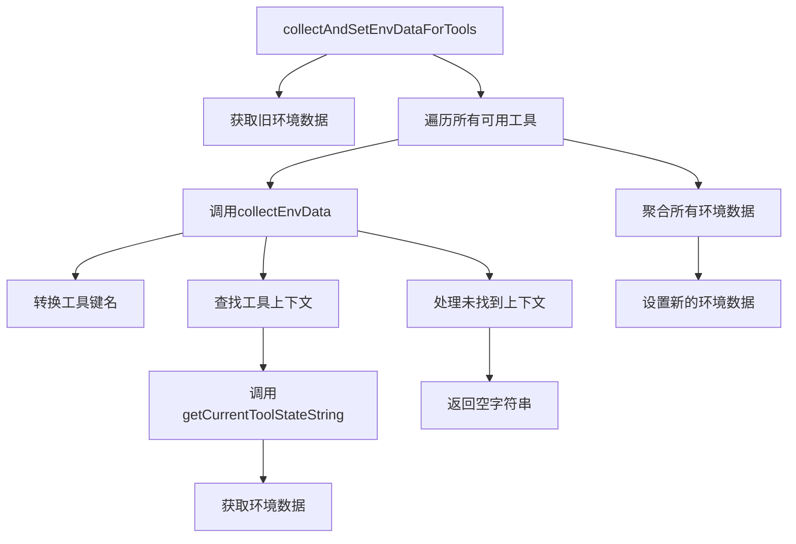
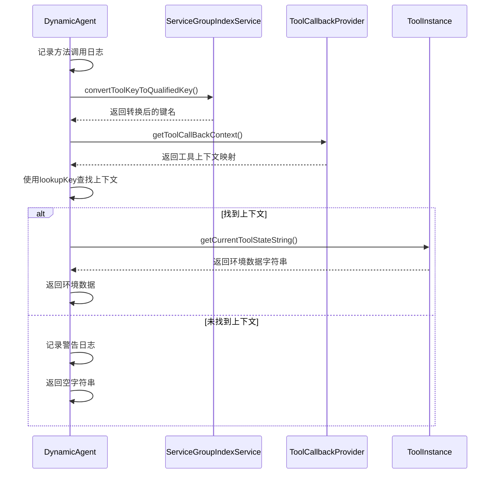
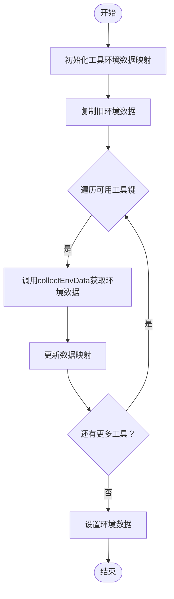
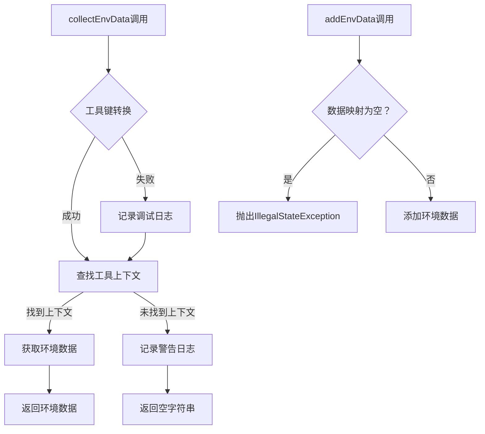
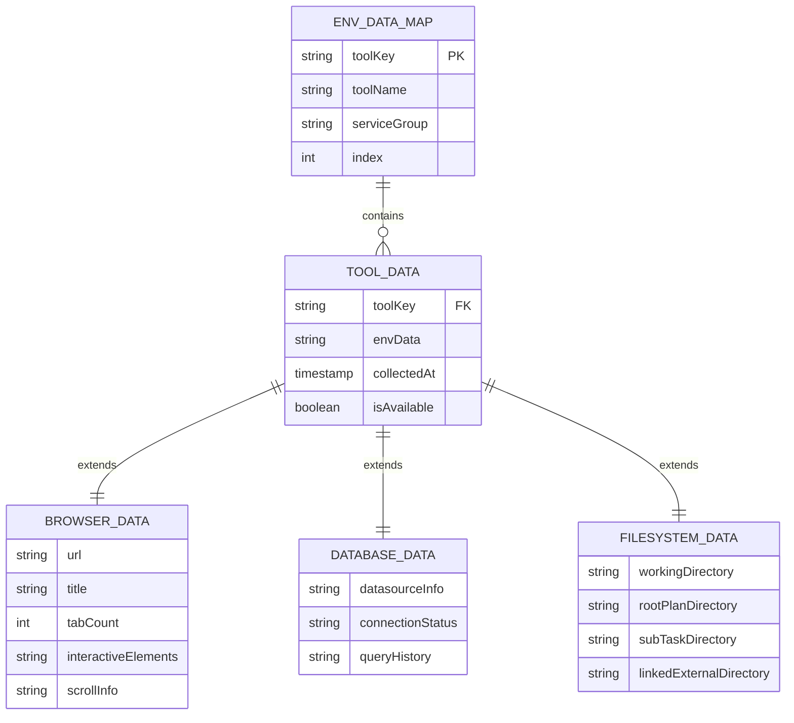

# 环境数据收集

<cite>
**本文档引用的文件**  
- [DynamicAgent.java](file://src/main/java/com/alibaba/cloud/ai/lynxe/agent/DynamicAgent.java)
- [AbstractBaseTool.java](file://src/main/java/com/alibaba/cloud/ai/lynxe/tool/AbstractBaseTool.java)
- [ToolCallbackProvider.java](file://src/main/java/com/alibaba/cloud/ai/lynxe/agent/ToolCallbackProvider.java)
- [BrowserUseTool.java](file://src/main/java/com/alibaba/cloud/ai/lynxe/tool/browser/BrowserUseTool.java)
- [DatabaseReadTool.java](file://src/main/java/com/alibaba/cloud/ai/lynxe/tool/database/DatabaseReadTool.java)
- [PlanningFactory.java](file://src/main/java/com/alibaba/cloud/ai/lynxe/planning/PlanningFactory.java)
- [UnifiedDirectoryManager.java](file://src/main/java/com/alibaba/cloud/ai/lynxe/tool/filesystem/UnifiedDirectoryManager.java)
</cite>

## 目录
1. [引言](#引言)
2. [核心机制分析](#核心机制分析)
3. [collectEnvData() 方法工作原理](#collectenvdata-方法工作原理)
4. [环境数据聚合机制](#环境数据聚合机制)
5. [错误处理与降级策略](#错误处理与降级策略)
6. [原始数据结构与后续处理](#原始数据结构与后续处理)
7. [自定义工具扩展指南](#自定义工具扩展指南)
8. [结论](#结论)

## 引言

环境数据收集机制是系统智能代理（Agent）获取当前执行上下文状态的核心功能。该机制通过`collectEnvData()`方法定期收集各个工具的运行时状态，为智能代理的决策过程提供必要的环境信息。本文档将深入解析该机制的内部工作原理，包括数据收集、聚合、错误处理以及扩展方法。

## 核心机制分析

环境数据收集机制的核心是`DynamicAgent`类中的`collectAndSetEnvDataForTools()`方法，该方法负责协调所有可用工具的环境数据收集。机制的关键组件包括：

- **ToolCallbackProvider**: 提供所有工具回调上下文的接口，是获取工具实例的入口
- **availableToolKeys**: 当前代理可用的工具键列表，决定了需要收集哪些工具的环境数据
- **ServiceGroupIndexService**: 用于处理工具键的转换，支持服务组和索引的复杂键名

该机制通过调用每个工具的`getCurrentToolStateString()`方法来获取其当前状态，并将这些状态聚合到一个统一的数据结构中，供后续的决策过程使用。



**Diagram sources**
- [DynamicAgent.java](file://src/main/java/com/alibaba/cloud/ai/lynxe/agent/DynamicAgent.java#L1451-L1466)

**Section sources**
- [DynamicAgent.java](file://src/main/java/com/alibaba/cloud/ai/lynxe/agent/DynamicAgent.java#L1451-L1466)
- [PlanningFactory.java](file://src/main/java/com/alibaba/cloud/ai/lynxe/planning/PlanningFactory.java#L240-L408)

## collectEnvData() 方法工作原理

`collectEnvData()`方法是环境数据收集的核心，其工作流程如下：

1. **日志记录**: 首先记录方法调用信息，便于调试和监控
2. **工具键转换**: 使用`ServiceGroupIndexService`将可能的服务组格式工具键（如`serviceGroup.toolName`）转换为带索引的限定键格式（如`toolName*index*`）
3. **上下文查找**: 在`ToolCallbackProvider`提供的上下文中查找对应工具的`ToolCallBackContext`
4. **状态获取**: 如果找到上下文，则调用工具实例的`getCurrentToolStateString()`方法获取环境数据
5. **降级处理**: 如果未找到上下文，则记录警告并返回空字符串

该方法的关键特性是其健壮性设计，即使某个工具的上下文不存在，也不会中断整个数据收集过程，而是优雅地降级并继续处理其他工具。



**Diagram sources**
- [DynamicAgent.java](file://src/main/java/com/alibaba/cloud/ai/lynxe/agent/DynamicAgent.java#L1424-L1449)

**Section sources**
- [DynamicAgent.java](file://src/main/java/com/alibaba/cloud/ai/lynxe/agent/DynamicAgent.java#L1424-L1449)

## 环境数据聚合机制

环境数据聚合机制通过`collectAndSetEnvDataForTools()`方法实现，其工作流程如下：

1. **初始化数据映射**: 创建一个新的`HashMap`用于存储聚合后的环境数据
2. **保留旧数据**: 将之前收集的环境数据复制到新的数据映射中，确保历史信息不丢失
3. **遍历工具**: 遍历`availableToolKeys`列表中的每个工具键
4. **收集数据**: 对每个工具键调用`collectEnvData()`方法获取其环境数据
5. **更新映射**: 将收集到的环境数据以工具键为键存储到数据映射中
6. **设置数据**: 调用`setEnvData()`方法将聚合后的数据设置为当前环境数据

这种聚合机制支持异构环境信息的整合，不同工具（如数据库、浏览器、文件系统）可以提供格式各异的环境数据，这些数据最终都被统一存储在`Map<String, Object>`结构中，实现了数据的标准化和统一管理。



**Diagram sources**
- [DynamicAgent.java](file://src/main/java/com/alibaba/cloud/ai/lynxe/agent/DynamicAgent.java#L1451-L1466)

**Section sources**
- [DynamicAgent.java](file://src/main/java/com/alibaba/cloud/ai/lynxe/agent/DynamicAgent.java#L1451-L1466)

## 错误处理与降级策略

环境数据收集机制实现了多层次的错误处理和降级策略，确保系统的稳定性和可靠性：

1. **工具上下文缺失处理**: 当`collectEnvData()`方法无法找到指定工具的上下文时，不会抛出异常，而是记录警告日志并返回空字符串，避免中断整个数据收集过程。

2. **工具键转换异常处理**: 在转换工具键名时，如果发生异常，方法会捕获异常并记录调试日志，然后继续使用原始键名进行查找。

3. **空数据映射处理**: `addEnvData()`方法在添加环境数据时会检查数据映射是否为空，如果为空则抛出`IllegalStateException`，防止空指针异常。

4. **工具注册异常处理**: 在`PlanningFactory`中注册工具时，使用try-catch块捕获可能的异常，确保即使某个工具注册失败，其他工具仍能正常注册。

这些错误处理策略体现了系统的健壮性设计，通过优雅降级而非失败停止的方式，确保了环境数据收集过程的连续性和可靠性。



**Diagram sources**
- [DynamicAgent.java](file://src/main/java/com/alibaba/cloud/ai/lynxe/agent/DynamicAgent.java#L1424-L1449)
- [DynamicAgent.java](file://src/main/java/com/alibaba/cloud/ai/lynxe/agent/DynamicAgent.java#L1412-L1418)

**Section sources**
- [DynamicAgent.java](file://src/main/java/com/alibaba/cloud/ai/lynxe/agent/DynamicAgent.java#L1424-L1449)
- [DynamicAgent.java](file://src/main/java/com/alibaba/cloud/ai/lynxe/agent/DynamicAgent.java#L1412-L1418)

## 原始数据结构与后续处理

环境数据的原始数据结构是一个`Map<String, Object>`，其中键为工具键名，值为工具状态字符串。这种结构设计具有以下特点：

1. **灵活性**: 支持存储任意类型的值，适应不同工具的异构数据需求
2. **可扩展性**: 可以轻松添加新的工具数据，无需修改数据结构
3. **兼容性**: 与Spring AI框架的`ToolContext`等组件兼容

收集到的环境数据主要用于后续的决策过程，具体作用包括：

- **上下文感知**: 为智能代理提供当前执行环境的完整视图
- **决策支持**: 基于环境数据做出更明智的工具选择和执行决策
- **状态跟踪**: 跟踪各个工具的运行状态，避免重复操作或冲突操作
- **错误诊断**: 提供调试信息，帮助诊断执行过程中的问题

例如，浏览器工具的环境数据包含当前URL、页面标题、标签页信息和交互元素等，这些信息对于决定下一步的浏览器操作至关重要。



**Diagram sources**
- [DynamicAgent.java](file://src/main/java/com/alibaba/cloud/ai/lynxe/agent/DynamicAgent.java#L1453-L1465)
- [BrowserUseTool.java](file://src/main/java/com/alibaba/cloud/ai/lynxe/tool/browser/BrowserUseTool.java#L566-L632)
- [DatabaseReadTool.java](file://src/main/java/com/alibaba/cloud/ai/lynxe/tool/database/DatabaseReadTool.java#L135-L158)

**Section sources**
- [DynamicAgent.java](file://src/main/java/com/alibaba/cloud/ai/lynxe/agent/DynamicAgent.java#L1453-L1465)
- [BrowserUseTool.java](file://src/main/java/com/alibaba/cloud/ai/lynxe/tool/browser/BrowserUseTool.java#L566-L632)
- [DatabaseReadTool.java](file://src/main/java/com/alibaba/cloud/ai/lynxe/tool/database/DatabaseReadTool.java#L135-L158)

## 自定义工具扩展指南

为自定义工具扩展环境数据收集功能，需要遵循以下步骤：

1. **继承AbstractBaseTool**: 创建自定义工具类，继承`AbstractBaseTool`抽象基类。

2. **实现getCurrentToolStateString()方法**: 重写此方法以提供工具的环境数据，返回格式化的字符串描述当前状态。

3. **确保工具注册**: 在`PlanningFactory`中确保自定义工具被正确注册到`toolCallbackMap`中。

4. **处理工具键名**: 确保工具的`getName()`和`getServiceGroup()`方法返回正确的值，以便`ServiceGroupIndexService`能正确处理工具键名。

5. **实现cleanup()方法**: 提供资源清理逻辑，在工具使用结束后释放相关资源。

以下是一个自定义工具扩展的示例结构：

```java
public class CustomTool extends AbstractBaseTool<CustomInput> {
    
    private final CustomService customService;
    private final ObjectMapper objectMapper;
    private final ToolI18nService toolI18nService;
    
    public CustomTool(CustomService customService, ObjectMapper objectMapper, 
                     ToolI18nService toolI18nService) {
        this.customService = customService;
        this.objectMapper = objectMapper;
        this.toolI18nService = toolI18nService;
    }
    
    @Override
    public String getName() {
        return "custom_tool";
    }
    
    @Override
    public String getServiceGroup() {
        return "custom-service-group";
    }
    
    @Override
    public String getDescription() {
        return toolI18nService.getDescription("custom-tool");
    }
    
    @Override
    public String getParameters() {
        return toolI18nService.getParameters("custom-tool");
    }
    
    @Override
    public Class<CustomInput> getInputType() {
        return CustomInput.class;
    }
    
    @Override
    public ToolExecuteResult run(CustomInput input) {
        // 实现工具执行逻辑
        return new ToolExecuteResult("Custom tool executed successfully");
    }
    
    @Override
    public String getCurrentToolStateString() {
        try {
            StringBuilder stateBuilder = new StringBuilder();
            stateBuilder.append("\n=== Custom Tool Current State ===\n");
            
            // 添加自定义状态信息
            stateBuilder.append("Current operation: ").append(customService.getCurrentOperation()).append("\n");
            stateBuilder.append("Processing status: ").append(customService.getProcessingStatus()).append("\n");
            stateBuilder.append("Queue size: ").append(customService.getQueueSize()).append("\n");
            
            stateBuilder.append("\n=== End Custom Tool State ===\n");
            return stateBuilder.toString();
        } catch (Exception e) {
            return String.format("Custom tool state error: %s", e.getMessage());
        }
    }
    
    @Override
    public void cleanup(String planId) {
        if (planId != null) {
            log.info("Cleaning up custom tool resources for plan: {}", planId);
            customService.cleanupResources(planId);
        }
    }
    
    @Override
    public boolean isSelectable() {
        return true;
    }
}
```

**Section sources**
- [AbstractBaseTool.java](file://src/main/java/com/alibaba/cloud/ai/lynxe/tool/AbstractBaseTool.java#L28-L112)
- [BrowserUseTool.java](file://src/main/java/com/alibaba/cloud/ai/lynxe/tool/browser/BrowserUseTool.java#L566-L632)
- [DatabaseReadTool.java](file://src/main/java/com/alibaba/cloud/ai/lynxe/tool/database/DatabaseReadTool.java#L135-L158)

## 结论

环境数据收集机制是系统智能代理的核心功能之一，通过`collectEnvData()`和`collectAndSetEnvDataForTools()`方法实现了对各种工具环境信息的高效收集和聚合。该机制具有以下特点：

1. **健壮性**: 通过完善的错误处理和降级策略，确保在部分工具失效时仍能正常工作
2. **灵活性**: 支持异构环境信息的整合，适应不同工具的数据格式
3. **可扩展性**: 通过继承`AbstractBaseTool`基类，可以轻松添加新的自定义工具
4. **标准化**: 将各种工具的状态统一为字符串格式，便于后续处理和分析

开发者在扩展自定义工具时，应重点关注`getCurrentToolStateString()`方法的实现，确保提供有意义的环境数据，同时遵循工具注册和资源管理的最佳实践。