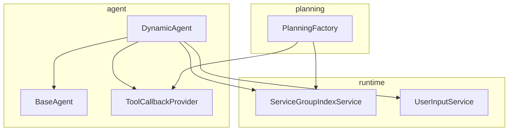
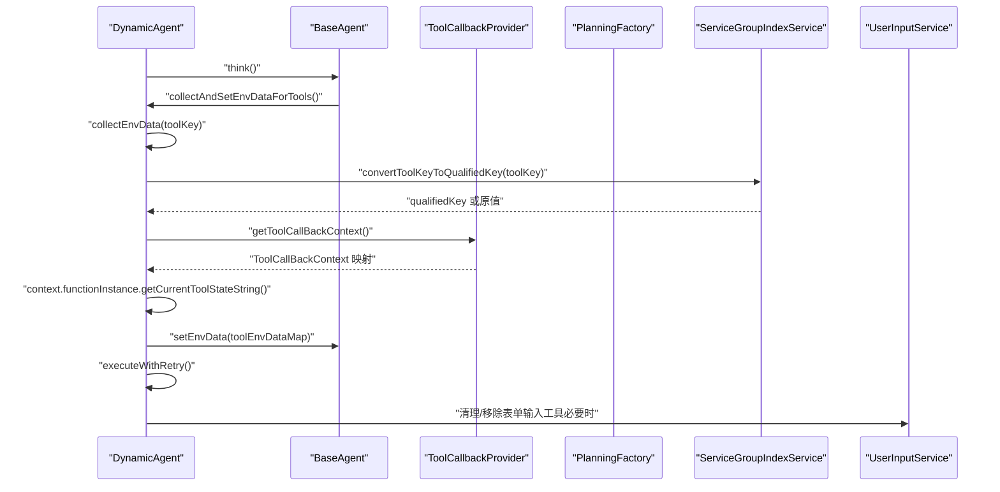
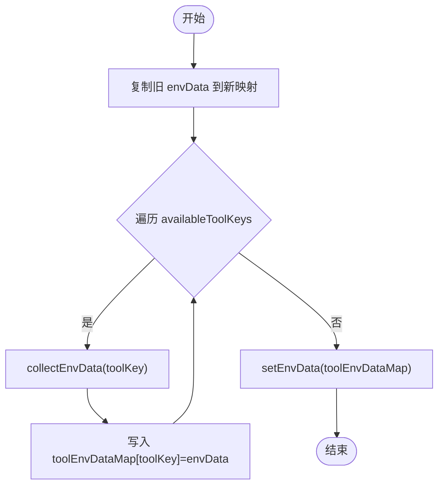
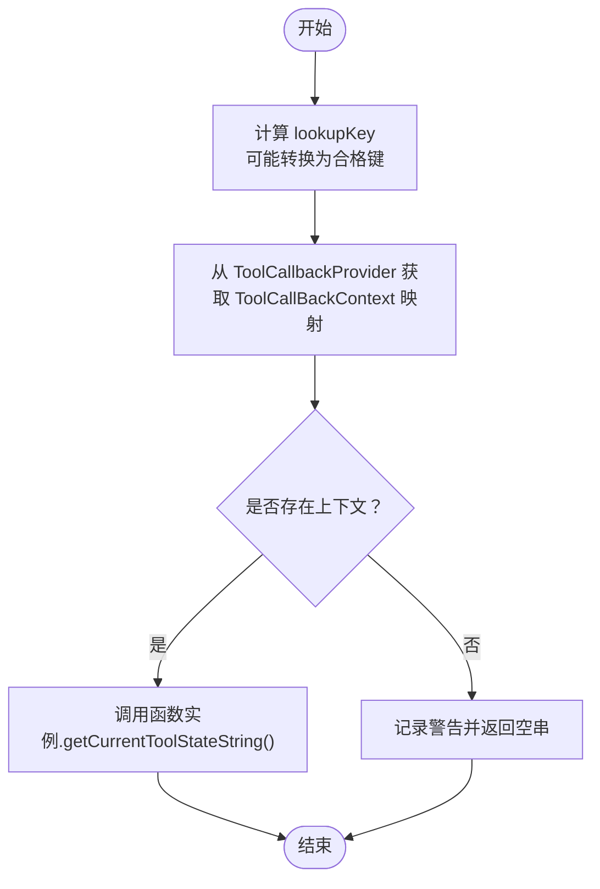
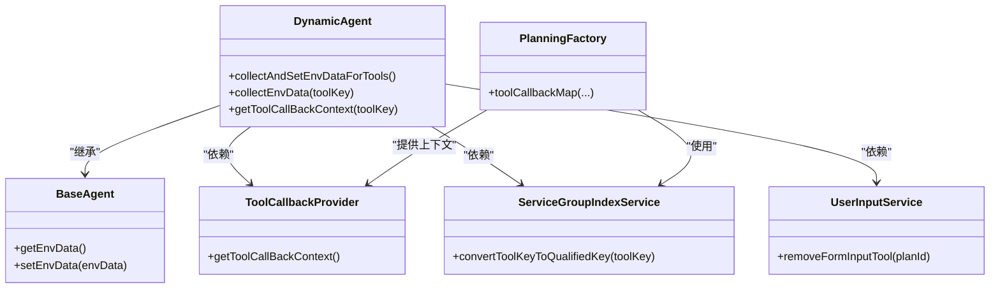

# 环境数据收集与设置

<cite>
**本文引用的文件**
- [DynamicAgent.java](file://src/main/java/com/alibaba/cloud/ai/lynxe/agent/DynamicAgent.java)
- [BaseAgent.java](file://src/main/java/com/alibaba/cloud/ai/lynxe/agent/BaseAgent.java)
- [ToolCallbackProvider.java](file://src/main/java/com/alibaba/cloud/ai/lynxe/agent/ToolCallbackProvider.java)
- [PlanningFactory.java](file://src/main/java/com/alibaba/cloud/ai/lynxe/planning/PlanningFactory.java)
- [ServiceGroupIndexService.java](file://src/main/java/com/alibaba/cloud/ai/lynxe/runtime/service/ServiceGroupIndexService.java)
- [UserInputService.java](file://src/main/java/com/alibaba/cloud/ai/lynxe/runtime/service/UserInputService.java)
</cite>

## 目录
1. [简介](#简介)
2. [项目结构](#项目结构)
3. [核心组件](#核心组件)
4. [架构总览](#架构总览)
5. [详细组件分析](#详细组件分析)
6. [依赖关系分析](#依赖关系分析)
7. [性能考量](#性能考量)
8. [故障排查指南](#故障排查指南)
9. [结论](#结论)

## 简介
本文件围绕“环境数据收集与设置”展开，聚焦于 DynamicAgent 中的 collectAndSetEnvDataForTools() 方法，系统性说明其执行流程、与 collectEnvData() 的协作、与 convertEnvDataToString() 的关系、以及与 ToolCallbackProvider、UserInputService 等核心服务的交互。同时给出该方法在 AI 代理思考流程中的调用时机与上下文，帮助读者从整体到细节全面理解环境数据在执行步骤中的注入与使用。

## 项目结构
- 本仓库为多模块工程，涉及 agent、runtime、planning、tool 等包。与本文相关的关键类位于 agent 包（DynamicAgent、BaseAgent、ToolCallbackProvider）、planning 包（PlanningFactory）与 runtime 包（ServiceGroupIndexService、UserInputService）。

图表来源
- [DynamicAgent.java](file://src/main/java/com/alibaba/cloud/ai/lynxe/agent/DynamicAgent.java#L1-L120)
- [BaseAgent.java](file://src/main/java/com/alibaba/cloud/ai/lynxe/agent/BaseAgent.java#L1-L120)
- [ToolCallbackProvider.java](file://src/main/java/com/alibaba/cloud/ai/lynxe/agent/ToolCallbackProvider.java#L1-L27)
- [PlanningFactory.java](file://src/main/java/com/alibaba/cloud/ai/lynxe/planning/PlanningFactory.java#L1-L120)
- [ServiceGroupIndexService.java](file://src/main/java/com/alibaba/cloud/ai/lynxe/runtime/service/ServiceGroupIndexService.java#L1-L60)
- [UserInputService.java](file://src/main/java/com/alibaba/cloud/ai/lynxe/runtime/service/UserInputService.java#L1-L60)

章节来源
- [DynamicAgent.java](file://src/main/java/com/alibaba/cloud/ai/lynxe/agent/DynamicAgent.java#L1-L120)
- [BaseAgent.java](file://src/main/java/com/alibaba/cloud/ai/lynxe/agent/BaseAgent.java#L1-L120)

## 核心组件
- DynamicAgent：负责代理思考与行动的主流程，包含环境数据收集与设置、工具回调列表构建、单/多工具执行等。
- BaseAgent：抽象基类，提供环境数据容器 envData 的存取、初始化设置、运行循环等通用能力。
- ToolCallbackProvider：提供工具回调上下文映射，供 DynamicAgent 查询工具实例与状态。
- PlanningFactory：注册工具并生成工具回调上下文映射，同时负责将工具名转换为带索引的合格键。
- ServiceGroupIndexService：维护 serviceGroup 到索引的映射，并将 serviceGroup.toolName 转换为 toolName*index* 的合格键。
- UserInputService：管理表单输入工具的存储与等待状态，用于与用户交互。

章节来源
- [DynamicAgent.java](file://src/main/java/com/alibaba/cloud/ai/lynxe/agent/DynamicAgent.java#L1-L120)
- [BaseAgent.java](file://src/main/java/com/alibaba/cloud/ai/lynxe/agent/BaseAgent.java#L520-L560)
- [ToolCallbackProvider.java](file://src/main/java/com/alibaba/cloud/ai/lynxe/agent/ToolCallbackProvider.java#L1-L27)
- [PlanningFactory.java](file://src/main/java/com/alibaba/cloud/ai/lynxe/planning/PlanningFactory.java#L219-L241)
- [ServiceGroupIndexService.java](file://src/main/java/com/alibaba/cloud/ai/lynxe/runtime/service/ServiceGroupIndexService.java#L97-L132)
- [UserInputService.java](file://src/main/java/com/alibaba/cloud/ai/lynxe/runtime/service/UserInputService.java#L1-L60)

## 架构总览
下图展示了 collectAndSetEnvDataForTools() 在代理思考流程中的位置与关键交互点。

图表来源
- [DynamicAgent.java](file://src/main/java/com/alibaba/cloud/ai/lynxe/agent/DynamicAgent.java#L200-L230)
- [DynamicAgent.java](file://src/main/java/com/alibaba/cloud/ai/lynxe/agent/DynamicAgent.java#L1424-L1466)
- [BaseAgent.java](file://src/main/java/com/alibaba/cloud/ai/lynxe/agent/BaseAgent.java#L526-L533)
- [ToolCallbackProvider.java](file://src/main/java/com/alibaba/cloud/ai/lynxe/agent/ToolCallbackProvider.java#L22-L26)
- [PlanningFactory.java](file://src/main/java/com/alibaba/cloud/ai/lynxe/planning/PlanningFactory.java#L219-L241)
- [ServiceGroupIndexService.java](file://src/main/java/com/alibaba/cloud/ai/lynxe/runtime/service/ServiceGroupIndexService.java#L97-L132)
- [UserInputService.java](file://src/main/java/com/alibaba/cloud/ai/lynxe/runtime/service/UserInputService.java#L145-L151)

## 详细组件分析

### collectAndSetEnvDataForTools() 执行流程
- 调用时机：在 DynamicAgent.think() 开始阶段，先收集并设置当前步骤的环境数据，再进入 LLM 推理与工具选择。
- 主要步骤：
  1) 复制旧的 envData 到新映射；
  2) 遍历可用工具键 availableToolKeys，逐个调用 collectEnvData() 获取对应工具的当前状态字符串；
  3) 将每个工具键与其状态字符串写入映射；
  4) 调用 setEnvData() 将最终映射设回 BaseAgent 的 envData 容器。

图表来源
- [DynamicAgent.java](file://src/main/java/com/alibaba/cloud/ai/lynxe/agent/DynamicAgent.java#L1451-L1466)
- [BaseAgent.java](file://src/main/java/com/alibaba/cloud/ai/lynxe/agent/BaseAgent.java#L526-L533)

章节来源
- [DynamicAgent.java](file://src/main/java/com/alibaba/cloud/ai/lynxe/agent/DynamicAgent.java#L200-L230)
- [DynamicAgent.java](file://src/main/java/com/alibaba/cloud/ai/lynxe/agent/DynamicAgent.java#L1451-L1466)
- [BaseAgent.java](file://src/main/java/com/alibaba/cloud/ai/lynxe/agent/BaseAgent.java#L526-L533)

### collectEnvData() 与工具回调上下文
- 功能：根据工具键查找对应的 ToolCallBackContext，若存在则调用其函数实例的 getCurrentToolStateString() 获取当前状态字符串；否则返回空串。
- 关键点：
  - 支持 serviceGroup.toolName 到 toolName*index* 的键转换，确保与后端注册的合格键一致；
  - 若未找到上下文，记录警告日志并返回空串，避免中断后续流程。

图表来源
- [DynamicAgent.java](file://src/main/java/com/alibaba/cloud/ai/lynxe/agent/DynamicAgent.java#L1424-L1449)
- [PlanningFactory.java](file://src/main/java/com/alibaba/cloud/ai/lynxe/planning/PlanningFactory.java#L219-L241)
- [ServiceGroupIndexService.java](file://src/main/java/com/alibaba/cloud/ai/lynxe/runtime/service/ServiceGroupIndexService.java#L97-L132)

章节来源
- [DynamicAgent.java](file://src/main/java/com/alibaba/cloud/ai/lynxe/agent/DynamicAgent.java#L1424-L1449)
- [PlanningFactory.java](file://src/main/java/com/alibaba/cloud/ai/lynxe/planning/PlanningFactory.java#L219-L241)
- [ServiceGroupIndexService.java](file://src/main/java/com/alibaba/cloud/ai/lynxe/runtime/service/ServiceGroupIndexService.java#L97-L132)

### 与 ToolCallbackProvider 的交互
- ToolCallbackProvider 提供 Map<String, ToolCallBackContext>，DynamicAgent 通过它查询工具回调上下文；
- PlanningFactory 负责构建该映射，注册工具并生成合格键，保证前后端键一致。

章节来源
- [ToolCallbackProvider.java](file://src/main/java/com/alibaba/cloud/ai/lynxe/agent/ToolCallbackProvider.java#L22-L26)
- [PlanningFactory.java](file://src/main/java/com/alibaba/cloud/ai/lynxe/planning/PlanningFactory.java#L320-L374)

### 与 UserInputService 的交互
- 在异常或中断场景下，DynamicAgent 会调用 UserInputService.removeFormInputTool(rootPlanId) 清理挂起的表单输入工具，避免资源泄漏；
- UserInputService 提供表单存储、等待状态查询与提交等能力，支撑用户输入闭环。

章节来源
- [DynamicAgent.java](file://src/main/java/com/alibaba/cloud/ai/lynxe/agent/DynamicAgent.java#L148-L165)
- [UserInputService.java](file://src/main/java/com/alibaba/cloud/ai/lynxe/runtime/service/UserInputService.java#L145-L151)

### 与 convertEnvDataToString() 的关系
- 文档目标中提到 convertEnvDataToString()，但当前代码库中未发现该方法的具体实现。结合现有实现：
  - collectEnvData() 返回的是工具实例的当前状态字符串；
  - collectAndSetEnvDataForTools() 将各工具的状态字符串以工具键为键写入 envData 映射；
  - BaseAgent.getEnvData() 与 setEnvData() 提供统一的数据容器；
  - 因此，若存在 convertEnvDataToString()，其职责很可能是将上述映射转换为最终的提示词字符串，供当前步骤消息模板使用（见 currentStepEnvMessage()）。

章节来源
- [DynamicAgent.java](file://src/main/java/com/alibaba/cloud/ai/lynxe/agent/DynamicAgent.java#L1424-L1466)
- [BaseAgent.java](file://src/main/java/com/alibaba/cloud/ai/lynxe/agent/BaseAgent.java#L526-L533)
- [DynamicAgent.java](file://src/main/java/com/alibaba/cloud/ai/lynxe/agent/DynamicAgent.java#L1367-L1381)

### 在 AI 代理思考流程中的调用时机与上下文
- 调用时机：DynamicAgent.think() 开始阶段，确保在构建思考消息与对话历史之前，已将最新环境数据注入到 envData；
- 上下文影响：
  - envData 会被 currentStepEnvMessage() 合并进提示词模板，作为当前步骤的环境信息；
  - 思考阶段的消息列表包含系统消息、历史记忆与当前步骤环境信息，LLM 基于此进行工具选择。

章节来源
- [DynamicAgent.java](file://src/main/java/com/alibaba/cloud/ai/lynxe/agent/DynamicAgent.java#L200-L230)
- [DynamicAgent.java](file://src/main/java/com/alibaba/cloud/ai/lynxe/agent/DynamicAgent.java#L1367-L1381)
- [BaseAgent.java](file://src/main/java/com/alibaba/cloud/ai/lynxe/agent/BaseAgent.java#L148-L222)

## 依赖关系分析
- DynamicAgent 依赖：
  - ToolCallbackProvider：获取工具回调上下文；
  - ServiceGroupIndexService：将前端 serviceGroup.toolName 转换为后端合格键；
  - UserInputService：清理表单输入工具；
  - BaseAgent：持有 envData 并提供存取接口。
- PlanningFactory 依赖 ServiceGroupIndexService，负责工具注册与合格键生成。

图表来源
- [DynamicAgent.java](file://src/main/java/com/alibaba/cloud/ai/lynxe/agent/DynamicAgent.java#L1-L120)
- [BaseAgent.java](file://src/main/java/com/alibaba/cloud/ai/lynxe/agent/BaseAgent.java#L526-L533)
- [ToolCallbackProvider.java](file://src/main/java/com/alibaba/cloud/ai/lynxe/agent/ToolCallbackProvider.java#L22-L26)
- [PlanningFactory.java](file://src/main/java/com/alibaba/cloud/ai/lynxe/planning/PlanningFactory.java#L320-L374)
- [ServiceGroupIndexService.java](file://src/main/java/com/alibaba/cloud/ai/lynxe/runtime/service/ServiceGroupIndexService.java#L97-L132)
- [UserInputService.java](file://src/main/java/com/alibaba/cloud/ai/lynxe/runtime/service/UserInputService.java#L145-L151)

章节来源
- [DynamicAgent.java](file://src/main/java/com/alibaba/cloud/ai/lynxe/agent/DynamicAgent.java#L1-L120)
- [PlanningFactory.java](file://src/main/java/com/alibaba/cloud/ai/lynxe/planning/PlanningFactory.java#L320-L374)

## 性能考量
- 键转换开销：ServiceGroupIndexService 使用并发映射与原子计数器，线程安全且缓存命中快，转换成本低；
- 工具遍历：collectAndSetEnvDataForTools() 对 availableToolKeys 进行一次遍历，复杂度 O(N)，N 为可用工具数量；
- 日志与异常：在键转换失败或上下文缺失时记录日志，避免阻塞主流程；
- 与 UserInputService 的交互：仅在异常或中断时清理表单，正常路径不产生额外开销。

[本节为通用指导，无需列出具体文件来源]

## 故障排查指南
- 工具状态为空：
  - 现象：collectEnvData() 返回空串；
  - 可能原因：工具键未匹配到 ToolCallBackContext，或函数实例未实现状态字符串；
  - 处理建议：检查工具键格式（是否需要合格键），确认工具已正确注册。
- 键转换失败：
  - 现象：serviceGroup.toolName 未成功转换为 toolName*index*；
  - 可能原因：serviceGroup 为空或转换逻辑异常；
  - 处理建议：检查 ServiceGroupIndexService 的缓存与索引分配。
- 表单输入未清理：
  - 现象：异常或中断后仍有挂起表单；
  - 处理建议：确认 DynamicAgent 在异常路径调用了 UserInputService.removeFormInputTool(rootPlanId)。

章节来源
- [DynamicAgent.java](file://src/main/java/com/alibaba/cloud/ai/lynxe/agent/DynamicAgent.java#L1424-L1466)
- [ServiceGroupIndexService.java](file://src/main/java/com/alibaba/cloud/ai/lynxe/runtime/service/ServiceGroupIndexService.java#L97-L132)
- [UserInputService.java](file://src/main/java/com/alibaba/cloud/ai/lynxe/runtime/service/UserInputService.java#L145-L151)

## 结论
- collectAndSetEnvDataForTools() 是 DynamicAgent 在每次思考前对环境数据进行“收集—合并—设置”的关键步骤；
- 其通过 collectEnvData() 与 ToolCallbackProvider 协作，借助 ServiceGroupIndexService 实现键的一致性；
- 设置后的 envData 会在 currentStepEnvMessage() 中被注入到提示词模板，直接影响 LLM 的工具选择与推理；
- 在异常或中断场景下，DynamicAgent 会调用 UserInputService 清理表单输入工具，保障资源一致性。