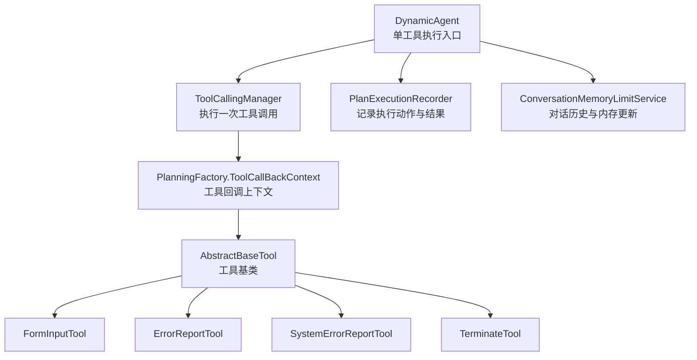
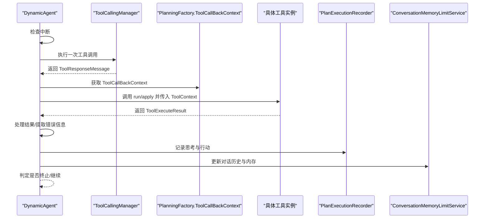
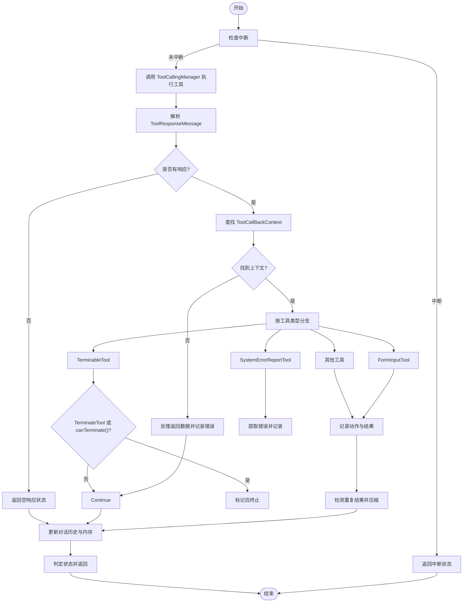
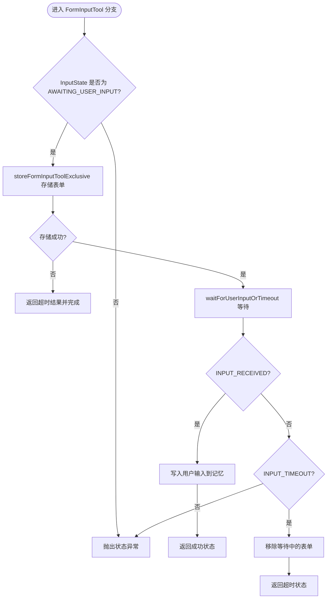
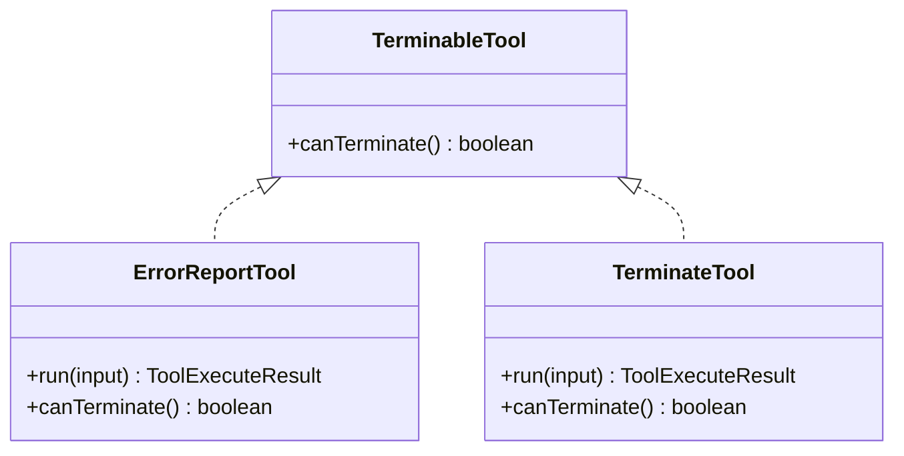
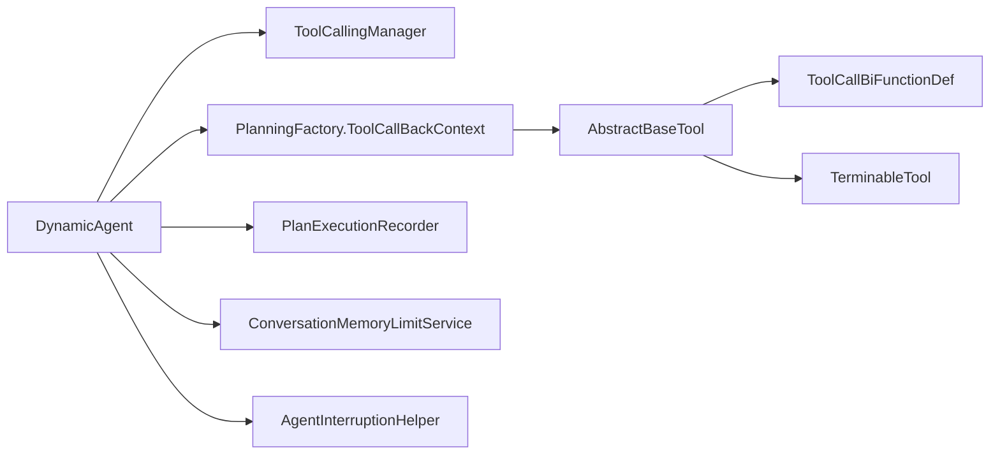

# 单工具执行

<cite>
**本文引用的文件列表**
- [DynamicAgent.java](file://src/main/java/com/alibaba/cloud/ai/lynxe/agent/DynamicAgent.java)
- [FormInputTool.java](file://src/main/java/com/alibaba/cloud/ai/lynxe/tool/FormInputTool.java)
- [ErrorReportTool.java](file://src/main/java/com/alibaba/cloud/ai/lynxe/tool/ErrorReportTool.java)
- [SystemErrorReportTool.java](file://src/main/java/com/alibaba/cloud/ai/lynxe/tool/SystemErrorReportTool.java)
- [TerminableTool.java](file://src/main/java/com/alibaba/cloud/ai/lynxe/tool/TerminableTool.java)
- [AbstractBaseTool.java](file://src/main/java/com/alibaba/cloud/ai/lynxe/tool/AbstractBaseTool.java)
- [PlanningFactory.java](file://src/main/java/com/alibaba/cloud/ai/lynxe/planning/PlanningFactory.java)
- [ParallelToolExecutionService.java](file://src/main/java/com/alibaba/cloud/ai/lynxe/runtime/service/ParallelToolExecutionService.java)
- [ParallelExecutionService.java](file://src/main/java/com/alibaba/cloud/ai/lynxe/tool/mapreduce/ParallelExecutionService.java)
- [ToolCallBiFunctionDef.java](file://src/main/java/com/alibaba/cloud/ai/lynxe/tool/ToolCallBiFunctionDef.java)
- [AgentInterruptionHelper.java](file://src/main/java/com/alibaba/cloud/ai/lynxe/runtime/service/AgentInterruptionHelper.java)
- [PlanExecutionRecorder.java](file://src/main/java/com/alibaba/cloud/ai/lynxe/recorder/service/PlanExecutionRecorder.java)
- [ConversationMemoryLimitService.java](file://src/main/java/com/alibaba/cloud/ai/lynxe/llm/ConversationMemoryLimitService.java)
</cite>

## 目录
1. [简介](#简介)
2. [项目结构与定位](#项目结构与定位)
3. [核心组件](#核心组件)
4. [架构总览](#架构总览)
5. [详细组件分析](#详细组件分析)
6. [依赖关系分析](#依赖关系分析)
7. [性能考量](#性能考量)
8. [故障排查指南](#故障排查指南)
9. [结论](#结论)

## 简介
本文件聚焦于“单工具执行”的完整流程，围绕 DynamicAgent 的 processSingleTool 方法展开，系统性解析工具调用、结果处理、状态管理、错误处理与异常恢复机制，并对 FormInputTool、TerminableTool、ErrorReportTool、SystemErrorReportTool 等关键类型进行分类说明。同时给出内存更新流程、工具回调上下文配置要点以及性能优化建议，帮助开发者正确使用并优化单工具执行。

## 项目结构与定位
- 单工具执行由智能体层 DynamicAgent 驱动，通过 ToolCallingManager 执行一次工具调用，随后根据工具类型进行差异化处理。
- 工具定义与回调注册由 PlanningFactory 完成，形成 ToolCallbackProvider 中的 ToolCallBackContext 映射。
- 结果记录与内存更新由 PlanExecutionRecorder 和 ConversationMemoryLimitService 参与，确保执行轨迹可追踪且内存可控。

图表来源
- [DynamicAgent.java](file://src/main/java/com/alibaba/cloud/ai/lynxe/agent/DynamicAgent.java#L655-L767)
- [PlanningFactory.java](file://src/main/java/com/alibaba/cloud/ai/lynxe/planning/PlanningFactory.java#L218-L374)
- [AbstractBaseTool.java](file://src/main/java/com/alibaba/cloud/ai/lynxe/tool/AbstractBaseTool.java#L28-L112)
- [PlanExecutionRecorder.java](file://src/main/java/com/alibaba/cloud/ai/lynxe/recorder/service/PlanExecutionRecorder.java#L187-L238)
- [ConversationMemoryLimitService.java](file://src/main/java/com/alibaba/cloud/ai/lynxe/llm/ConversationMemoryLimitService.java#L132-L172)

章节来源
- [DynamicAgent.java](file://src/main/java/com/alibaba/cloud/ai/lynxe/agent/DynamicAgent.java#L655-L767)
- [PlanningFactory.java](file://src/main/java/com/alibaba/cloud/ai/lynxe/planning/PlanningFactory.java#L218-L374)

## 核心组件
- DynamicAgent.processSingleTool：单工具执行的主流程，负责中断检查、工具调用、结果处理、状态判定、错误包装与内存更新。
- ToolCallBiFunctionDef：工具函数接口，统一了同步/异步工具的调用方式。
- AbstractBaseTool：工具抽象基类，提供计划ID、服务组、输入类型等通用能力。
- FormInputTool：交互式表单收集工具，支持等待用户输入、超时处理与状态回传。
- TerminableTool：可终止工具接口，用于判断是否允许提前结束当前步骤。
- ErrorReportTool：报告错误并终止执行的工具。
- SystemErrorReportTool：系统内部错误报告工具，不终止执行，仅记录错误信息。
- ParallelToolExecutionService：并行工具执行服务（多工具场景），单工具执行不直接使用。
- PlanExecutionRecorder：记录思考与行动、动作参数与结果。
- ConversationMemoryLimitService：对话历史与内存更新，限制内容长度并提取工具调用/响应摘要。

章节来源
- [DynamicAgent.java](file://src/main/java/com/alibaba/cloud/ai/lynxe/agent/DynamicAgent.java#L655-L767)
- [ToolCallBiFunctionDef.java](file://src/main/java/com/alibaba/cloud/ai/lynxe/tool/ToolCallBiFunctionDef.java#L28-L103)
- [AbstractBaseTool.java](file://src/main/java/com/alibaba/cloud/ai/lynxe/tool/AbstractBaseTool.java#L28-L112)
- [FormInputTool.java](file://src/main/java/com/alibaba/cloud/ai/lynxe/tool/FormInputTool.java#L38-L581)
- [TerminableTool.java](file://src/main/java/com/alibaba/cloud/ai/lynxe/tool/TerminableTool.java#L1-L31)
- [ErrorReportTool.java](file://src/main/java/com/alibaba/cloud/ai/lynxe/tool/ErrorReportTool.java#L1-L184)
- [SystemErrorReportTool.java](file://src/main/java/com/alibaba/cloud/ai/lynxe/tool/SystemErrorReportTool.java#L1-L178)
- [PlanExecutionRecorder.java](file://src/main/java/com/alibaba/cloud/ai/lynxe/recorder/service/PlanExecutionRecorder.java#L187-L238)
- [ConversationMemoryLimitService.java](file://src/main/java/com/alibaba/cloud/ai/lynxe/llm/ConversationMemoryLimitService.java#L132-L172)

## 架构总览
下图展示了单工具执行的关键调用链路与数据流。

图表来源
- [DynamicAgent.java](file://src/main/java/com/alibaba/cloud/ai/lynxe/agent/DynamicAgent.java#L655-L767)
- [PlanningFactory.java](file://src/main/java/com/alibaba/cloud/ai/lynxe/planning/PlanningFactory.java#L218-L374)
- [PlanExecutionRecorder.java](file://src/main/java/com/alibaba/cloud/ai/lynxe/recorder/service/PlanExecutionRecorder.java#L187-L238)
- [ConversationMemoryLimitService.java](file://src/main/java/com/alibaba/cloud/ai/lynxe/llm/ConversationMemoryLimitService.java#L132-L172)

## 详细组件分析

### 单工具执行主流程：processSingleTool
- 中断检查：在执行前检查任务是否被中断，若中断则返回中断状态。
- 工具调用：通过 ToolCallingManager 执行一次工具调用，得到 ToolResponseMessage。
- 响应解析：从 ToolResponseMessage 中取出首个 ToolResponse，获取工具名与返回数据。
- 回调上下文：根据工具名查找 ToolCallBackContext；若缺失则记录错误但仍尝试处理返回数据。
- 工具类型分支：
  - FormInputTool：进入表单等待/接收/超时处理流程，必要时存储到用户输入服务并等待。
  - TerminableTool：常规处理返回数据；若为 TerminateTool 或 canTerminate() 为真，则标记应终止；ErrorReportTool 提取错误信息并记录。
  - SystemErrorReportTool：提取错误信息并记录，但不终止执行。
  - 其他工具：常规处理返回数据并记录。
- 后置流程：记录动作与结果，检查重复结果并压缩。
- 内存更新：无论成功或失败，均调用 processMemory 将对话历史写入内存（排除系统消息与环境数据）。
- 异常处理：捕获异常后，使用 SystemErrorReportTool 包装异常并返回。

图表来源
- [DynamicAgent.java](file://src/main/java/com/alibaba/cloud/ai/lynxe/agent/DynamicAgent.java#L655-L767)
- [DynamicAgent.java](file://src/main/java/com/alibaba/cloud/ai/lynxe/agent/DynamicAgent.java#L879-L935)
- [DynamicAgent.java](file://src/main/java/com/alibaba/cloud/ai/lynxe/agent/DynamicAgent.java#L975-L1065)
- [DynamicAgent.java](file://src/main/java/com/alibaba/cloud/ai/lynxe/agent/DynamicAgent.java#L1094-L1112)
- [DynamicAgent.java](file://src/main/java/com/alibaba/cloud/ai/lynxe/agent/DynamicAgent.java#L1285-L1309)

章节来源
- [DynamicAgent.java](file://src/main/java/com/alibaba/cloud/ai/lynxe/agent/DynamicAgent.java#L655-L767)
- [DynamicAgent.java](file://src/main/java/com/alibaba/cloud/ai/lynxe/agent/DynamicAgent.java#L879-L935)
- [DynamicAgent.java](file://src/main/java/com/alibaba/cloud/ai/lynxe/agent/DynamicAgent.java#L975-L1065)
- [DynamicAgent.java](file://src/main/java/com/alibaba/cloud/ai/lynxe/agent/DynamicAgent.java#L1094-L1112)
- [DynamicAgent.java](file://src/main/java/com/alibaba/cloud/ai/lynxe/agent/DynamicAgent.java#L1285-L1309)

### 表单工具 FormInputTool 的特殊处理
- 状态机：AWAITING_USER_INPUT、INPUT_RECEIVED、INPUT_TIMEOUT 三种状态，分别对应等待、收到输入、超时。
- 存储与等待：当处于 AWAITING_USER_INPUT 时，通过用户输入服务进行独占存储与排队，等待用户提交或超时。
- 输入接收：收到用户输入后，更新当前表单值并写入记忆，返回当前工具状态字符串作为结果。
- 超时清理：超时后清空表单定义并移除等待中的表单，返回超时提示。

图表来源
- [DynamicAgent.java](file://src/main/java/com/alibaba/cloud/ai/lynxe/agent/DynamicAgent.java#L879-L935)
- [FormInputTool.java](file://src/main/java/com/alibaba/cloud/ai/lynxe/tool/FormInputTool.java#L38-L581)

章节来源
- [DynamicAgent.java](file://src/main/java/com/alibaba/cloud/ai/lynxe/agent/DynamicAgent.java#L879-L935)
- [FormInputTool.java](file://src/main/java/com/alibaba/cloud/ai/lynxe/tool/FormInputTool.java#L38-L581)

### 可终止工具 TerminableTool 的处理
- ErrorReportTool：提取返回数据中的 errorMessage 字段，设置到步骤错误信息中，并记录思考与行动。
- TerminateTool：显式标记应终止当前步骤。
- canTerminate()：若返回 true，表示该工具已满足终止条件，清除等待中的表单并标记应终止。

图表来源
- [TerminableTool.java](file://src/main/java/com/alibaba/cloud/ai/lynxe/tool/TerminableTool.java#L1-L31)
- [ErrorReportTool.java](file://src/main/java/com/alibaba/cloud/ai/lynxe/tool/ErrorReportTool.java#L1-L184)
- [SystemErrorReportTool.java](file://src/main/java/com/alibaba/cloud/ai/lynxe/tool/SystemErrorReportTool.java#L1-L178)

章节来源
- [TerminableTool.java](file://src/main/java/com/alibaba/cloud/ai/lynxe/tool/TerminableTool.java#L1-L31)
- [ErrorReportTool.java](file://src/main/java/com/alibaba/cloud/ai/lynxe/tool/ErrorReportTool.java#L1-L184)
- [SystemErrorReportTool.java](file://src/main/java/com/alibaba/cloud/ai/lynxe/tool/SystemErrorReportTool.java#L1-L178)

### 系统错误报告工具 SystemErrorReportTool
- 作用：在异常发生时包装异常为工具结果，记录错误信息但不终止执行，便于继续流程。
- 数据格式：返回包含 errorMessage 与时间戳的 JSON，便于前端展示与审计。
- 可选性：不可被用户选择，仅用于系统内部错误上报。

章节来源
- [SystemErrorReportTool.java](file://src/main/java/com/alibaba/cloud/ai/lynxe/tool/SystemErrorReportTool.java#L1-L178)
- [DynamicAgent.java](file://src/main/java/com/alibaba/cloud/ai/lynxe/agent/DynamicAgent.java#L374-L423)

### 工具回调上下文与工具注册
- PlanningFactory 构建 ToolCallBackContext 映射，将工具名映射到 FunctionToolCallback 与具体工具实例。
- 支持服务组索引与工具名修饰，保证 LLM 能以唯一键调用工具。
- 动态注册多种内置工具，包括 FormInputTool、TerminateTool、ErrorReportTool、SystemErrorReportTool 等。

章节来源
- [PlanningFactory.java](file://src/main/java/com/alibaba/cloud/ai/lynxe/planning/PlanningFactory.java#L218-L374)

### 工具执行结果记录与内存更新
- 结果记录：executePostToolFlow 调用 recordActionResult，将 ActToolParam 的结果写入执行记录。
- 内存更新：processMemory 清空当前计划内存，过滤系统消息与环境数据，仅保留助手消息与工具调用消息，写入最大容量限制的记忆。
- 对话摘要：ConversationMemoryLimitService 在生成摘要时，会提取工具调用与响应摘要，避免过长内容影响性能。

章节来源
- [DynamicAgent.java](file://src/main/java/com/alibaba/cloud/ai/lynxe/agent/DynamicAgent.java#L1082-L1086)
- [DynamicAgent.java](file://src/main/java/com/alibaba/cloud/ai/lynxe/agent/DynamicAgent.java#L1285-L1309)
- [PlanExecutionRecorder.java](file://src/main/java/com/alibaba/cloud/ai/lynxe/recorder/service/PlanExecutionRecorder.java#L187-L238)
- [ConversationMemoryLimitService.java](file://src/main/java/com/alibaba/cloud/ai/lynxe/llm/ConversationMemoryLimitService.java#L132-L172)

### 错误处理与异常恢复
- 工具执行异常：捕获异常后，调用 handleExceptionWithSystemErrorReport 使用 SystemErrorReportTool 包装异常并返回。
- 错误信息提取：extractAndSetErrorMessage 优先从返回数据解析 errorMessage，否则回退为返回文本。
- 记录错误：recordErrorToolThinkingAndAction 将错误信息写入思考与行动记录，便于审计与回溯。

章节来源
- [DynamicAgent.java](file://src/main/java/com/alibaba/cloud/ai/lynxe/agent/DynamicAgent.java#L1094-L1112)
- [DynamicAgent.java](file://src/main/java/com/alibaba/cloud/ai/lynxe/agent/DynamicAgent.java#L1122-L1137)
- [DynamicAgent.java](file://src/main/java/com/alibaba/cloud/ai/lynxe/agent/DynamicAgent.java#L374-L423)

## 依赖关系分析
- DynamicAgent 依赖 ToolCallingManager 进行工具调用，依赖 ToolCallbackProvider/PlanningFactory 的 ToolCallBackContext 获取工具实例。
- 工具实例统一实现 ToolCallBiFunctionDef，部分工具扩展 AbstractBaseTool 并实现 TerminableTool。
- 执行结果经 PlanExecutionRecorder 记录，ConversationMemoryLimitService 控制内存大小与摘要生成。
- AgentInterruptionHelper 提供中断检查能力，贯穿思考与执行阶段。

图表来源
- [DynamicAgent.java](file://src/main/java/com/alibaba/cloud/ai/lynxe/agent/DynamicAgent.java#L655-L767)
- [PlanningFactory.java](file://src/main/java/com/alibaba/cloud/ai/lynxe/planning/PlanningFactory.java#L218-L374)
- [ToolCallBiFunctionDef.java](file://src/main/java/com/alibaba/cloud/ai/lynxe/tool/ToolCallBiFunctionDef.java#L28-L103)
- [TerminableTool.java](file://src/main/java/com/alibaba/cloud/ai/lynxe/tool/TerminableTool.java#L1-L31)
- [PlanExecutionRecorder.java](file://src/main/java/com/alibaba/cloud/ai/lynxe/recorder/service/PlanExecutionRecorder.java#L187-L238)
- [ConversationMemoryLimitService.java](file://src/main/java/com/alibaba/cloud/ai/lynxe/llm/ConversationMemoryLimitService.java#L132-L172)
- [AgentInterruptionHelper.java](file://src/main/java/com/alibaba/cloud/ai/lynxe/runtime/service/AgentInterruptionHelper.java#L43-L52)

章节来源
- [DynamicAgent.java](file://src/main/java/com/alibaba/cloud/ai/lynxe/agent/DynamicAgent.java#L655-L767)
- [PlanningFactory.java](file://src/main/java/com/alibaba/cloud/ai/lynxe/planning/PlanningFactory.java#L218-L374)

## 性能考量
- 中断早检：在执行前检查中断，避免无效计算。
- 结果去重与压缩：检测重复结果并强制压缩，减少冗余输出。
- 内存控制：processMemory 清空当前计划内存并仅保留必要消息，ConversationMemoryLimitService 限制摘要长度，降低上下文开销。
- 并行策略：单工具执行不走并行路径；多工具执行时使用 ParallelToolExecutionService 并行执行，但单工具场景无需并发。
- 上下文传播：通过 ToolContext 传递 toolcallId 与 planDepth，便于追踪与限流。

章节来源
- [DynamicAgent.java](file://src/main/java/com/alibaba/cloud/ai/lynxe/agent/DynamicAgent.java#L1228-L1269)
- [DynamicAgent.java](file://src/main/java/com/alibaba/cloud/ai/lynxe/agent/DynamicAgent.java#L1285-L1309)
- [ParallelToolExecutionService.java](file://src/main/java/com/alibaba/cloud/ai/lynxe/runtime/service/ParallelToolExecutionService.java#L65-L183)

## 故障排查指南
- 工具回调上下文缺失
  - 现象：日志出现“工具回调上下文未找到”，但仍尝试处理返回数据。
  - 排查：确认 PlanningFactory 是否正确注册该工具，工具名是否与 LLM 调用一致（含服务组修饰）。
  - 参考路径：[DynamicAgent.java](file://src/main/java/com/alibaba/cloud/ai/lynxe/agent/DynamicAgent.java#L682-L691)
- 表单等待超时
  - 现象：FormInputTool 处于 INPUT_TIMEOUT 状态。
  - 排查：检查用户输入服务的存储/等待逻辑与超时配置，确认表单定义与字段是否正确。
  - 参考路径：[FormInputTool.java](file://src/main/java/com/alibaba/cloud/ai/lynxe/tool/FormInputTool.java#L447-L452)
- 错误信息提取失败
  - 现象：无法从返回数据解析 errorMessage。
  - 排查：确认工具返回数据结构是否符合预期，或回退为返回文本。
  - 参考路径：[DynamicAgent.java](file://src/main/java/com/alibaba/cloud/ai/lynxe/agent/DynamicAgent.java#L1094-L1112)
- 异常包装与返回
  - 现象：捕获异常后使用 SystemErrorReportTool 包装并返回。
  - 排查：检查 handleExceptionWithSystemErrorReport 的调用链与日志。
  - 参考路径：[DynamicAgent.java](file://src/main/java/com/alibaba/cloud/ai/lynxe/agent/DynamicAgent.java#L374-L423)

章节来源
- [DynamicAgent.java](file://src/main/java/com/alibaba/cloud/ai/lynxe/agent/DynamicAgent.java#L682-L691)
- [DynamicAgent.java](file://src/main/java/com/alibaba/cloud/ai/lynxe/agent/DynamicAgent.java#L1094-L1112)
- [DynamicAgent.java](file://src/main/java/com/alibaba/cloud/ai/lynxe/agent/DynamicAgent.java#L374-L423)
- [FormInputTool.java](file://src/main/java/com/alibaba/cloud/ai/lynxe/tool/FormInputTool.java#L447-L452)

## 结论
单工具执行在 DynamicAgent 中实现了清晰的分支处理与稳健的错误恢复机制。通过 ToolCallBackContext 统一工具回调，结合 TerminableTool 与 SystemErrorReportTool 的差异化行为，既能满足业务终止需求，也能在异常情况下保持流程可控。配合结果记录与内存更新，确保执行过程可审计、可回放。开发者在使用时应重点关注工具回调上下文的正确配置、表单工具的状态流转与超时处理、错误信息的提取与记录，以及内存与摘要的性能控制。