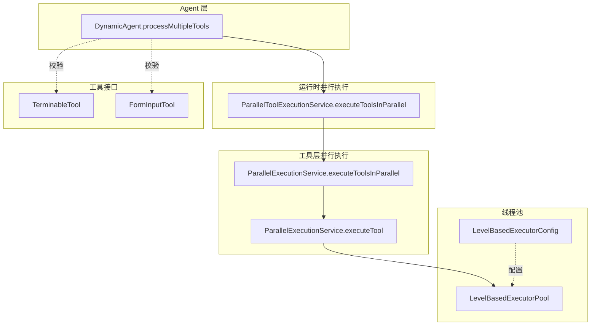
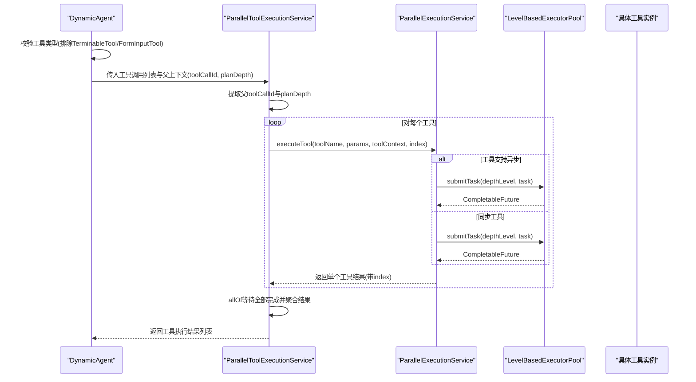
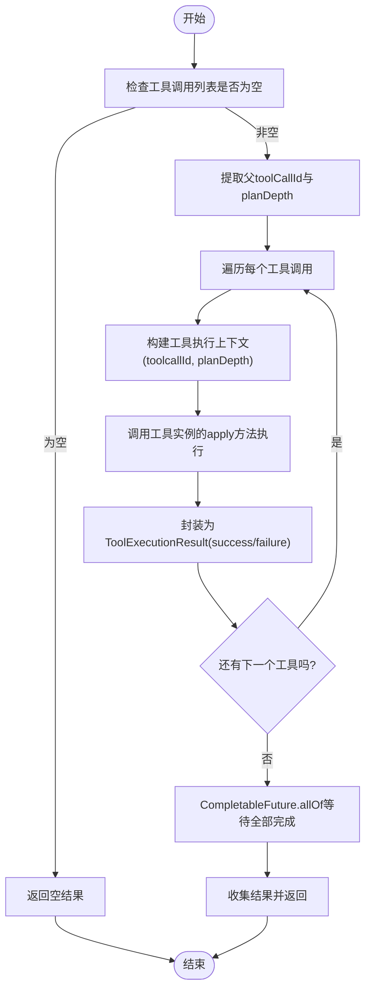
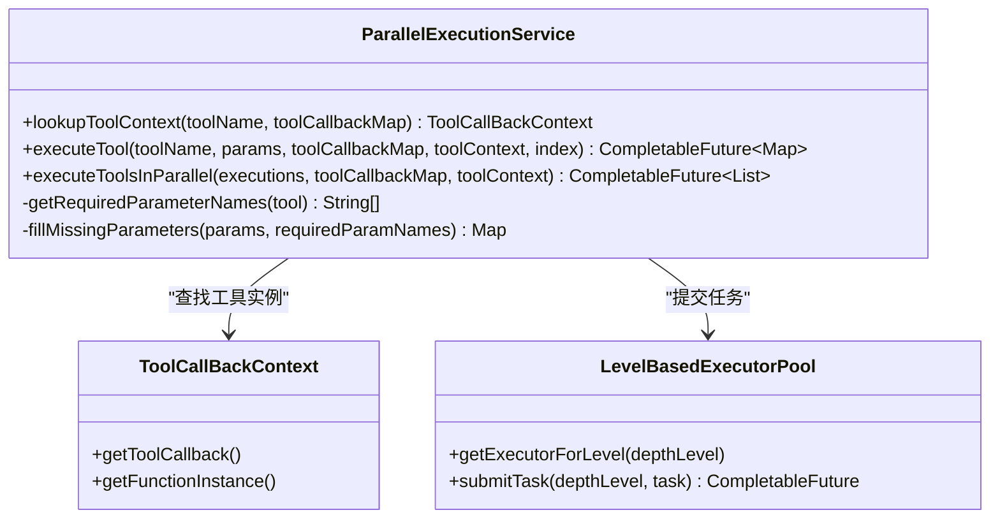
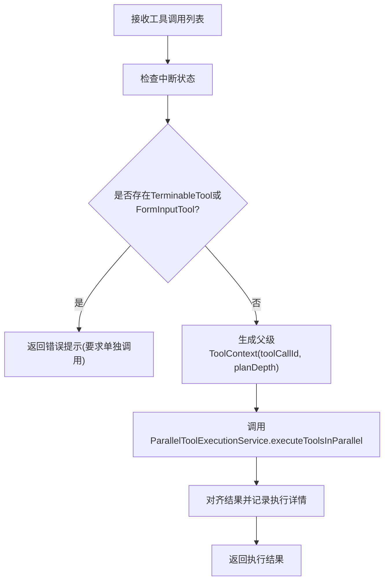
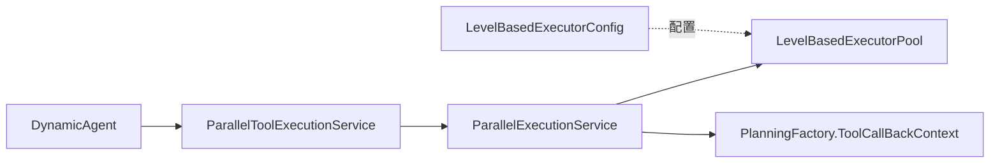

# 多工具并行执行

<cite>
**本文引用的文件**
- [ParallelToolExecutionService.java](file://src/main/java/com/alibaba/cloud/ai/lynxe/runtime/service/ParallelToolExecutionService.java)
- [ParallelExecutionService.java](file://src/main/java/com/alibaba/cloud/ai/lynxe/tool/mapreduce/ParallelExecutionService.java)
- [DynamicAgent.java](file://src/main/java/com/alibaba/cloud/ai/lynxe/agent/DynamicAgent.java)
- [TerminableTool.java](file://src/main/java/com/alibaba/cloud/ai/lynxe/tool/TerminableTool.java)
- [FormInputTool.java](file://src/main/java/com/alibaba/cloud/ai/lynxe/tool/FormInputTool.java)
- [LevelBasedExecutorPool.java](file://src/main/java/com/alibaba/cloud/ai/lynxe/runtime/executor/LevelBasedExecutorPool.java)
- [LevelBasedExecutorConfig.java](file://src/main/java/com/alibaba/cloud/ai/lynxe/runtime/executor/LevelBasedExecutorConfig.java)
- [PlanningFactory.java](file://src/main/java/com/alibaba/cloud/ai/lynxe/planning/PlanningFactory.java)
- [SubplanToolWrapper.java](file://src/main/java/com/alibaba/cloud/ai/lynxe/subplan/model/vo/SubplanToolWrapper.java)
- [ParallelExecutionTool.java](file://src/main/java/com/alibaba/cloud/ai/lynxe/tool/mapreduce/ParallelExecutionTool.java)
- [FileBasedParallelExecutionTool.java](file://src/main/java/com/alibaba/cloud/ai/lynxe/tool/mapreduce/FileBasedParallelExecutionTool.java)
</cite>

## 目录
1. [引言](#引言)
2. [项目结构](#项目结构)
3. [核心组件](#核心组件)
4. [架构总览](#架构总览)
5. [详细组件分析](#详细组件分析)
6. [依赖关系分析](#依赖关系分析)
7. [性能考量](#性能考量)
8. [故障排查指南](#故障排查指南)
9. [结论](#结论)
10. [附录](#附录)

## 引言
本文件系统性梳理多工具并行执行的实现与运行机制，重点围绕 processMultipleTools 方法、ParallelToolExecutionService 的工作原理（含 CompletableFuture 使用、线程池管理与异常处理）、对 TerminableTool 与 FormInputTool 的限制及原因、上下文传播（toolCallId 与 planDepth）以及性能优化策略展开。同时给出从工具调用分发到结果收集的完整流程图示与参考路径，帮助读者快速理解并正确使用该能力。

## 项目结构
多工具并行执行涉及以下关键模块：
- 运行时并行执行服务：负责并发调度、上下文传播与结果聚合
- 工具层并行执行服务：面向具体工具的执行封装，支持同步/异步与层级线程池
- 动态代理执行器：在 Agent 层拦截多工具调用，进行限制校验与上下文注入
- 线程池与配置：按层级深度隔离线程池，动态调整容量
- 工具接口：定义可终止工具与表单输入工具的约束

图表来源
- [ParallelToolExecutionService.java](file://src/main/java/com/alibaba/cloud/ai/lynxe/runtime/service/ParallelToolExecutionService.java#L84-L165)
- [ParallelExecutionService.java](file://src/main/java/com/alibaba/cloud/ai/lynxe/tool/mapreduce/ParallelExecutionService.java#L298-L346)
- [DynamicAgent.java](file://src/main/java/com/alibaba/cloud/ai/lynxe/agent/DynamicAgent.java#L776-L875)
- [LevelBasedExecutorPool.java](file://src/main/java/com/alibaba/cloud/ai/lynxe/runtime/executor/LevelBasedExecutorPool.java#L77-L142)
- [LevelBasedExecutorConfig.java](file://src/main/java/com/alibaba/cloud/ai/lynxe/runtime/executor/LevelBasedExecutorConfig.java#L1-L188)
- [TerminableTool.java](file://src/main/java/com/alibaba/cloud/ai/lynxe/tool/TerminableTool.java#L1-L31)
- [FormInputTool.java](file://src/main/java/com/alibaba/cloud/ai/lynxe/tool/FormInputTool.java#L1-L120)

章节来源
- [ParallelToolExecutionService.java](file://src/main/java/com/alibaba/cloud/ai/lynxe/runtime/service/ParallelToolExecutionService.java#L84-L165)
- [ParallelExecutionService.java](file://src/main/java/com/alibaba/cloud/ai/lynxe/tool/mapreduce/ParallelExecutionService.java#L298-L346)
- [DynamicAgent.java](file://src/main/java/com/alibaba/cloud/ai/lynxe/agent/DynamicAgent.java#L776-L875)

## 核心组件
- ParallelToolExecutionService：在 Agent 层发起的多工具并行执行入口，负责提取父级上下文（toolCallId、planDepth），为每个工具构造执行上下文并收集结果。
- ParallelExecutionService：在工具层实现通用并行执行逻辑，支持同步/异步工具、参数填充、层级线程池与结果排序。
- LevelBasedExecutorPool：按层级深度管理线程池，统一核心与最大线程数，支持动态调整与统计。
- DynamicAgent.processMultipleTools：多工具执行的业务入口，进行 TerminableTool/FormInputTool 限制校验与上下文注入。
- 工具接口：TerminableTool、FormInputTool 定义了两类受限工具，不支持在多工具并行场景中直接并行执行。

章节来源
- [ParallelToolExecutionService.java](file://src/main/java/com/alibaba/cloud/ai/lynxe/runtime/service/ParallelToolExecutionService.java#L84-L165)
- [ParallelExecutionService.java](file://src/main/java/com/alibaba/cloud/ai/lynxe/tool/mapreduce/ParallelExecutionService.java#L103-L296)
- [LevelBasedExecutorPool.java](file://src/main/java/com/alibaba/cloud/ai/lynxe/runtime/executor/LevelBasedExecutorPool.java#L77-L142)
- [DynamicAgent.java](file://src/main/java/com/alibaba/cloud/ai/lynxe/agent/DynamicAgent.java#L776-L875)
- [TerminableTool.java](file://src/main/java/com/alibaba/cloud/ai/lynxe/tool/TerminableTool.java#L1-L31)
- [FormInputTool.java](file://src/main/java/com/alibaba/cloud/ai/lynxe/tool/FormInputTool.java#L1-L120)

## 架构总览
下图展示了从 Agent 层到工具层再到线程池的完整调用链路，以及上下文传播与结果聚合的关键节点。

图表来源
- [DynamicAgent.java](file://src/main/java/com/alibaba/cloud/ai/lynxe/agent/DynamicAgent.java#L776-L875)
- [ParallelToolExecutionService.java](file://src/main/java/com/alibaba/cloud/ai/lynxe/runtime/service/ParallelToolExecutionService.java#L84-L165)
- [ParallelExecutionService.java](file://src/main/java/com/alibaba/cloud/ai/lynxe/tool/mapreduce/ParallelExecutionService.java#L103-L296)
- [LevelBasedExecutorPool.java](file://src/main/java/com/alibaba/cloud/ai/lynxe/runtime/executor/LevelBasedExecutorPool.java#L105-L142)

## 详细组件分析

### ParallelToolExecutionService 并行执行服务
- 上下文传播：从父 ToolContext 中提取 toolCallId 与 planDepth，若父上下文为空则由 PlanIdDispatcher 生成新的 toolCallId；随后为每个工具构建独立的 ToolContext 并传入。
- 执行模型：对每个工具创建 CompletableFuture，内部通过抽象工具的 apply 方法执行，捕获异常并包装为 ToolExecutionResult。
- 结果聚合：使用 CompletableFuture.allOf 等待所有任务完成，再逐一获取结果，最终返回 List<ToolExecutionResult>。
- 参数解析：将 ToolCall.arguments 解析为 Map，兼容非 Map 输入并兜底为包含 "value" 键的对象。

图表来源
- [ParallelToolExecutionService.java](file://src/main/java/com/alibaba/cloud/ai/lynxe/runtime/service/ParallelToolExecutionService.java#L84-L165)

章节来源
- [ParallelToolExecutionService.java](file://src/main/java/com/alibaba/cloud/ai/lynxe/runtime/service/ParallelToolExecutionService.java#L84-L165)

### ParallelExecutionService 工具层并行执行
- 工具查找：根据工具名在回调映射中查找 ToolCallBackContext，支持服务组索引转换后的回退查找。
- 参数填充：基于工具参数 Schema 提取必填字段，缺失参数以空字符串填充，保证工具输入完整性。
- 执行策略：若工具实现 AsyncToolCallBiFunctionDef，则使用异步执行；否则通过 LevelBasedExecutorPool 提交到对应层级的线程池执行。
- 结果格式化：统一输出 Map<String,Object>，包含 index、status、output 或 error 字段，并按 index 排序返回。
- 上下文传播：从父 ToolContext 提取 toolCallId 与 planDepth，若存在则透传；否则生成新的 toolCallId。

图表来源
- [ParallelExecutionService.java](file://src/main/java/com/alibaba/cloud/ai/lynxe/tool/mapreduce/ParallelExecutionService.java#L103-L296)
- [PlanningFactory.java](file://src/main/java/com/alibaba/cloud/ai/lynxe/planning/PlanningFactory.java#L219-L241)
- [LevelBasedExecutorPool.java](file://src/main/java/com/alibaba/cloud/ai/lynxe/runtime/executor/LevelBasedExecutorPool.java#L77-L142)

章节来源
- [ParallelExecutionService.java](file://src/main/java/com/alibaba/cloud/ai/lynxe/tool/mapreduce/ParallelExecutionService.java#L103-L296)
- [PlanningFactory.java](file://src/main/java/com/alibaba/cloud/ai/lynxe/planning/PlanningFactory.java#L219-L241)
- [LevelBasedExecutorPool.java](file://src/main/java/com/alibaba/cloud/ai/lynxe/runtime/executor/LevelBasedExecutorPool.java#L77-L142)

### DynamicAgent.processMultipleTools 多工具执行入口
- 限制校验：扫描工具调用列表，若发现 TerminableTool 或 FormInputTool，立即返回错误提示，要求单独调用。
- 上下文注入：生成父级 ToolContext，包含 toolCallId 与 planDepth，并传递给并行执行服务。
- 结果处理：将并行执行结果与原始工具调用顺序对齐，记录执行详情并更新记忆。

图表来源
- [DynamicAgent.java](file://src/main/java/com/alibaba/cloud/ai/lynxe/agent/DynamicAgent.java#L776-L875)

章节来源
- [DynamicAgent.java](file://src/main/java/com/alibaba/cloud/ai/lynxe/agent/DynamicAgent.java#L776-L875)

### TerminableTool 与 FormInputTool 的限制
- TerminableTool：具备可终止能力的工具，其终止条件可能与并行执行的全局状态相关，不适合在多工具并行场景中被统一终止。
- FormInputTool：需要等待用户输入并维护特定状态机，不适合在并行执行中与其他工具共享输入队列与锁资源。
- 处理逻辑：在 DynamicAgent.processMultipleTools 中进行显式校验，一旦检测到上述工具，直接拒绝并行执行，提示用户改为逐个调用。

章节来源
- [TerminableTool.java](file://src/main/java/com/alibaba/cloud/ai/lynxe/tool/TerminableTool.java#L1-L31)
- [FormInputTool.java](file://src/main/java/com/alibaba/cloud/ai/lynxe/tool/FormInputTool.java#L1-L120)
- [DynamicAgent.java](file://src/main/java/com/alibaba/cloud/ai/lynxe/agent/DynamicAgent.java#L776-L807)

### 上下文传播机制（toolCallId 与 planDepth）
- toolCallId：优先使用父级传入的 toolCallId，若不存在则由 PlanIdDispatcher 生成；用于串联一次多工具调用的唯一标识。
- planDepth：用于指示当前执行层级，便于 LevelBasedExecutorPool 按层级隔离线程池与资源；若未传入则默认为 0。
- 子计划/子工具包装：在子计划执行中会复用相同的 toolCallId 与 planDepth，确保跨层级的一致性。

章节来源
- [ParallelToolExecutionService.java](file://src/main/java/com/alibaba/cloud/ai/lynxe/runtime/service/ParallelToolExecutionService.java#L94-L131)
- [ParallelExecutionService.java](file://src/main/java/com/alibaba/cloud/ai/lynxe/tool/mapreduce/ParallelExecutionService.java#L136-L163)
- [SubplanToolWrapper.java](file://src/main/java/com/alibaba/cloud/ai/lynxe/subplan/model/vo/SubplanToolWrapper.java#L250-L350)

### 典型工具并行执行流程（示例路径）
- 从工具注册到并行执行：ParallelExecutionTool 与 FileBasedParallelExecutionTool 均委托 ParallelExecutionService 完成实际执行。
- 关键路径参考：
  - [ParallelExecutionTool.startExecutionAsync(...)](file://src/main/java/com/alibaba/cloud/ai/lynxe/tool/mapreduce/ParallelExecutionTool.java#L317-L432)
  - [FileBasedParallelExecutionTool.applyAsync(...)](file://src/main/java/com/alibaba/cloud/ai/lynxe/tool/mapreduce/FileBasedParallelExecutionTool.java#L147-L180)
  - [ParallelExecutionService.executeToolsInParallel(...)](file://src/main/java/com/alibaba/cloud/ai/lynxe/tool/mapreduce/ParallelExecutionService.java#L298-L346)

章节来源
- [ParallelExecutionTool.java](file://src/main/java/com/alibaba/cloud/ai/lynxe/tool/mapreduce/ParallelExecutionTool.java#L317-L432)
- [FileBasedParallelExecutionTool.java](file://src/main/java/com/alibaba/cloud/ai/lynxe/tool/mapreduce/FileBasedParallelExecutionTool.java#L147-L180)
- [ParallelExecutionService.java](file://src/main/java/com/alibaba/cloud/ai/lynxe/tool/mapreduce/ParallelExecutionService.java#L298-L346)

## 依赖关系分析
- 组件耦合
  - ParallelToolExecutionService 依赖 ToolContext 与 PlanIdDispatcher，负责上下文传播与结果聚合。
  - ParallelExecutionService 依赖 ToolCallBackContext、LevelBasedExecutorPool 与 ObjectMapper，负责工具查找、参数填充与执行。
  - LevelBasedExecutorPool 通过层级深度隔离线程池，避免不同层级任务互相影响。
- 可能的循环依赖
  - 工具回调映射由 PlanningFactory 提供，DynamicAgent 通过 ToolCallBackContext 获取函数实例，形成“工具定义—执行—上下文”的单向依赖链。
- 外部集成点
  - 线程池配置可通过 LevelBasedExecutorConfig 注入，支持按层级定制核心/最大线程数与队列容量。

图表来源
- [DynamicAgent.java](file://src/main/java/com/alibaba/cloud/ai/lynxe/agent/DynamicAgent.java#L776-L875)
- [ParallelToolExecutionService.java](file://src/main/java/com/alibaba/cloud/ai/lynxe/runtime/service/ParallelToolExecutionService.java#L84-L165)
- [ParallelExecutionService.java](file://src/main/java/com/alibaba/cloud/ai/lynxe/tool/mapreduce/ParallelExecutionService.java#L103-L296)
- [PlanningFactory.java](file://src/main/java/com/alibaba/cloud/ai/lynxe/planning/PlanningFactory.java#L219-L241)
- [LevelBasedExecutorPool.java](file://src/main/java/com/alibaba/cloud/ai/lynxe/runtime/executor/LevelBasedExecutorPool.java#L77-L142)
- [LevelBasedExecutorConfig.java](file://src/main/java/com/alibaba/cloud/ai/lynxe/runtime/executor/LevelBasedExecutorConfig.java#L1-L188)

章节来源
- [PlanningFactory.java](file://src/main/java/com/alibaba/cloud/ai/lynxe/planning/PlanningFactory.java#L219-L241)
- [LevelBasedExecutorConfig.java](file://src/main/java/com/alibaba/cloud/ai/lynxe/runtime/executor/LevelBasedExecutorConfig.java#L1-L188)

## 性能考量
- 并行度控制
  - 使用 LevelBasedExecutorPool 按层级隔离线程池，避免深层级任务阻塞根层级任务。
  - 通过 LevelBasedExecutorConfig 调整每层的核心/最大线程数与队列容量，建议根据 CPU 核心数与 IO 密集程度设置。
- CompletableFuture 使用
  - 在 ParallelToolExecutionService 中使用 allOf 等待全部完成，适合短任务批量执行；对于长任务建议拆分批次并设置超时策略。
- 参数填充与序列化
  - ParallelExecutionService 会对缺失参数进行填充，减少工具层因参数不全导致的失败重试。
- 结果排序与稳定性
  - 工具层执行结果按 index 排序，保证输出顺序与输入一致，便于上层聚合。

章节来源
- [LevelBasedExecutorPool.java](file://src/main/java/com/alibaba/cloud/ai/lynxe/runtime/executor/LevelBasedExecutorPool.java#L77-L142)
- [LevelBasedExecutorConfig.java](file://src/main/java/com/alibaba/cloud/ai/lynxe/runtime/executor/LevelBasedExecutorConfig.java#L1-L188)
- [ParallelToolExecutionService.java](file://src/main/java/com/alibaba/cloud/ai/lynxe/runtime/service/ParallelToolExecutionService.java#L149-L165)
- [ParallelExecutionService.java](file://src/main/java/com/alibaba/cloud/ai/lynxe/tool/mapreduce/ParallelExecutionService.java#L315-L346)

## 故障排查指南
- 常见问题
  - 工具未找到：检查工具名称与服务组索引转换是否正确，确认 ToolCallBackContext 是否存在。
  - 参数解析失败：确认 ToolCall.arguments 是否为合法 JSON，必要时检查参数 Schema。
  - 线程池耗尽：检查 LevelBasedExecutorPool 的线程数与队列容量配置，适当增大或拆分层级。
  - 结果顺序错乱：确认工具层是否正确设置 index 并参与排序。
- 日志定位
  - ParallelToolExecutionService 与 ParallelExecutionService 在执行过程中均输出详细日志，可用于定位异常工具与参数问题。
- 限制触发
  - 若出现“不支持多工具并行”的提示，请移除 TerminableTool/FormInputTool，改为逐个调用。

章节来源
- [ParallelToolExecutionService.java](file://src/main/java/com/alibaba/cloud/ai/lynxe/runtime/service/ParallelToolExecutionService.java#L105-L145)
- [ParallelExecutionService.java](file://src/main/java/com/alibaba/cloud/ai/lynxe/tool/mapreduce/ParallelExecutionService.java#L112-L163)
- [DynamicAgent.java](file://src/main/java/com/alibaba/cloud/ai/lynxe/agent/DynamicAgent.java#L776-L807)

## 结论
多工具并行执行通过“Agent 层限制校验 + 运行时并行聚合 + 工具层通用执行 + 层级线程池隔离”的架构实现了高吞吐与强可控的工具批处理能力。其核心优势在于：
- 明确的限制边界（排除 TerminableTool/FormInputTool），保障执行一致性与可终止性
- 清晰的上下文传播（toolCallId、planDepth），便于追踪与审计
- 可扩展的线程池配置，满足不同层级与负载场景
建议在生产环境中结合业务特征合理设置并行度与线程池参数，并对工具参数 Schema 进行完善以提升成功率与稳定性。

## 附录
- 相关工具类与入口
  - [ParallelExecutionTool.java](file://src/main/java/com/alibaba/cloud/ai/lynxe/tool/mapreduce/ParallelExecutionTool.java#L317-L432)
  - [FileBasedParallelExecutionTool.java](file://src/main/java/com/alibaba/cloud/ai/lynxe/tool/mapreduce/FileBasedParallelExecutionTool.java#L147-L180)
  - [ParallelExecutionService.java](file://src/main/java/com/alibaba/cloud/ai/lynxe/tool/mapreduce/ParallelExecutionService.java#L298-L346)
  - [ParallelToolExecutionService.java](file://src/main/java/com/alibaba/cloud/ai/lynxe/runtime/service/ParallelToolExecutionService.java#L84-L165)
  - [LevelBasedExecutorPool.java](file://src/main/java/com/alibaba/cloud/ai/lynxe/runtime/executor/LevelBasedExecutorPool.java#L77-L142)
  - [LevelBasedExecutorConfig.java](file://src/main/java/com/alibaba/cloud/ai/lynxe/runtime/executor/LevelBasedExecutorConfig.java#L1-L188)
  - [DynamicAgent.java](file://src/main/java/com/alibaba/cloud/ai/lynxe/agent/DynamicAgent.java#L776-L875)