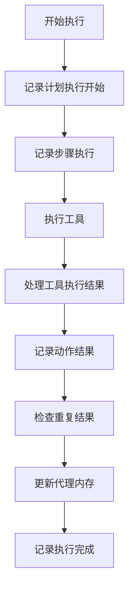
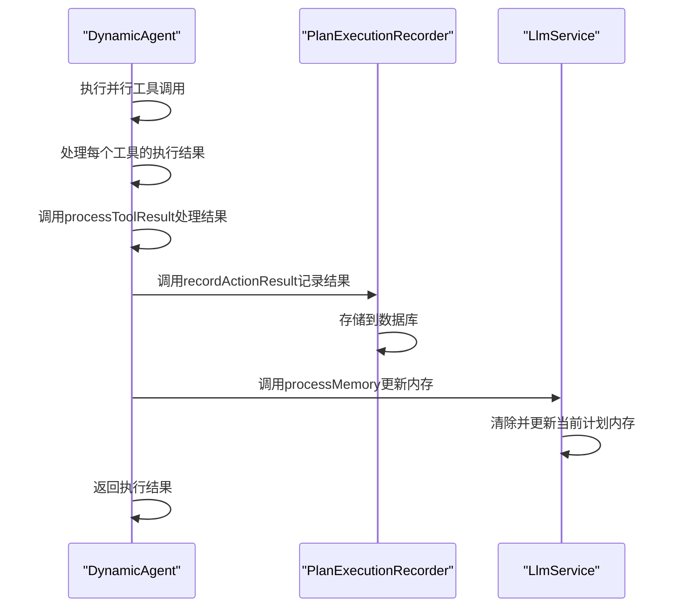
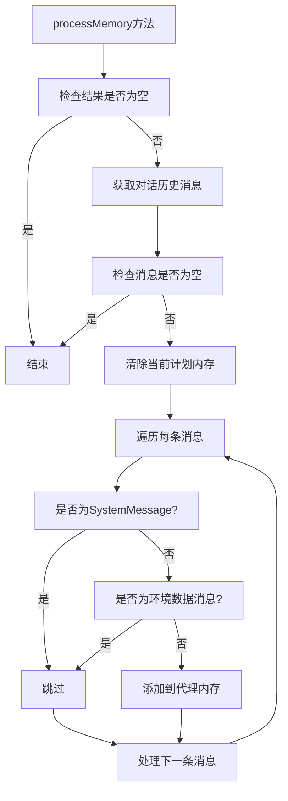
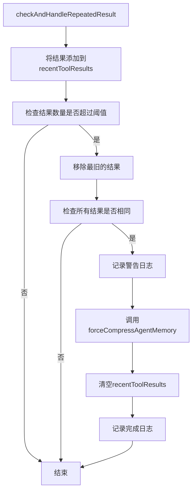
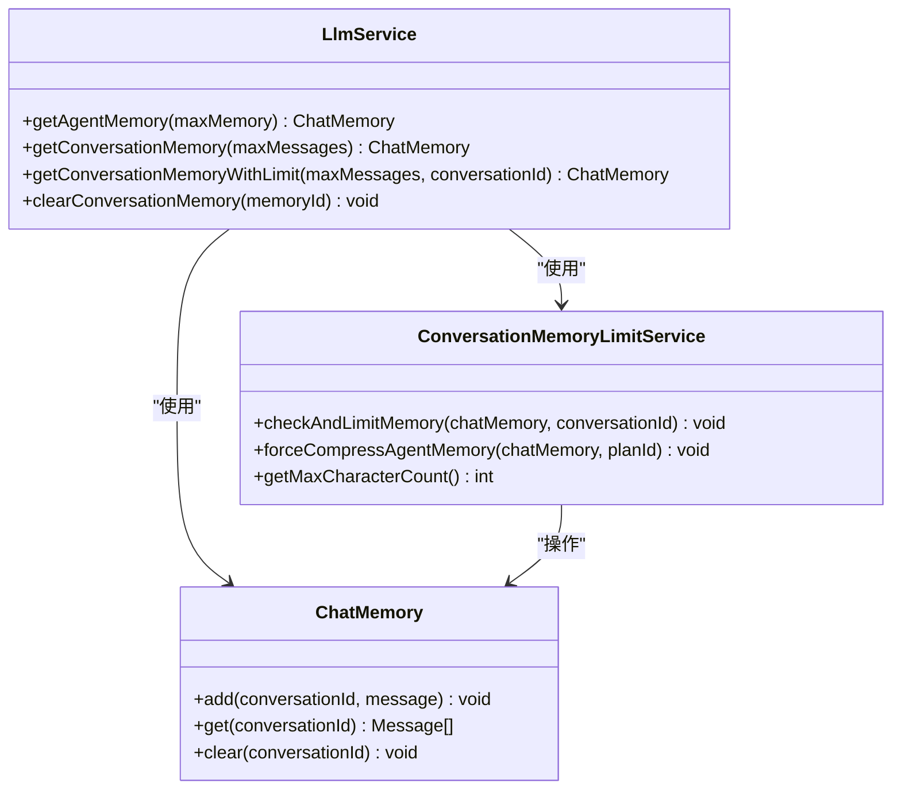
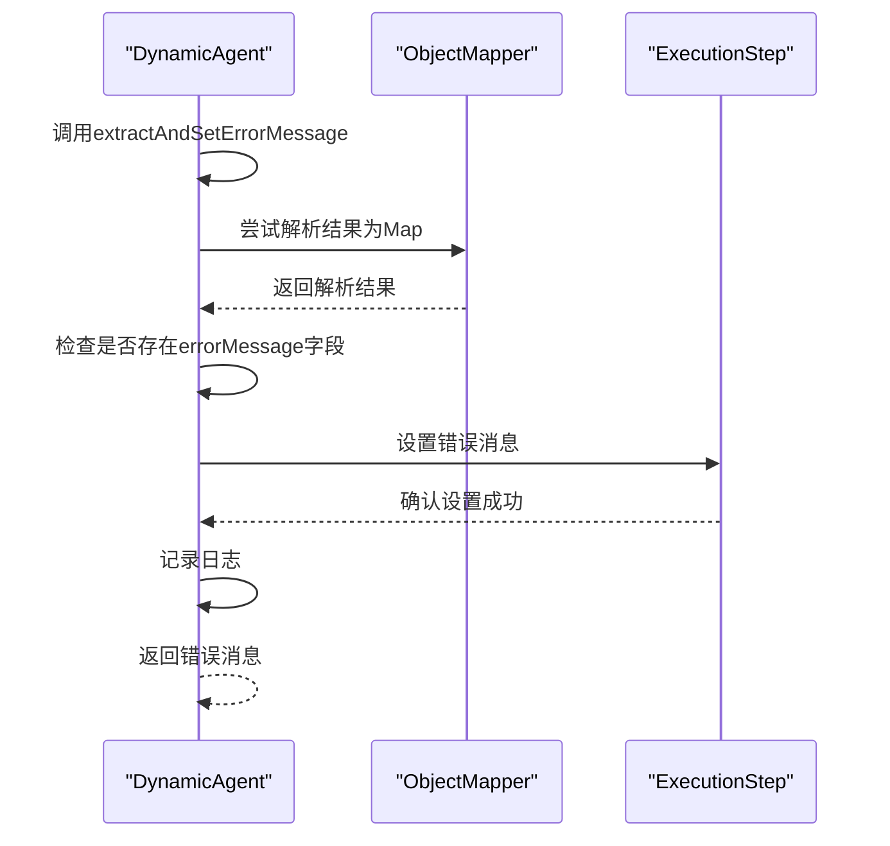

# 执行结果处理

<cite>
**本文档引用的文件**
- [DynamicAgent.java](file://src/main/java/com/alibaba/cloud/ai/lynxe/agent/DynamicAgent.java)
- [PlanExecutionRecorder.java](file://src/main/java/com/alibaba/cloud/ai/lynxe/recorder/service/PlanExecutionRecorder.java)
- [NewRepoPlanExecutionRecorder.java](file://src/main/java/com/alibaba/cloud/ai/lynxe/recorder/service/NewRepoPlanExecutionRecorder.java)
- [ToolCallbackProvider.java](file://src/main/java/com/alibaba/cloud/ai/lynxe/agent/ToolCallbackProvider.java)
- [ConversationMemoryLimitService.java](file://src/main/java/com/alibaba/cloud/ai/lynxe/llm/ConversationMemoryLimitService.java)
- [LlmService.java](file://src/main/java/com/alibaba/cloud/ai/lynxe/llm/LlmService.java)
- [Memory.java](file://src/main/java/com/alibaba/cloud/ai/lynxe/workspace/conversation/entity/vo/Memory.java)
- [memory.ts](file://ui-vue3/src/stores/memory.ts)
- [memory-api-service.ts](file://ui-vue3/src/api/memory-api-service.ts)
</cite>

## 目录
1. [简介](#简介)
2. [执行结果记录机制](#执行结果记录机制)
3. [工具执行结果处理流程](#工具执行结果处理流程)
4. [内存状态更新机制](#内存状态更新机制)
5. [重复结果检测与循环防止](#重复结果检测与循环防止)
6. [会话内存同步机制](#会话内存同步机制)
7. [错误结果处理流程](#错误结果处理流程)
8. [最佳实践建议](#最佳实践建议)

## 简介
本文档详细阐述了JManus系统中执行结果处理的完整机制。系统通过一套复杂的流程来处理工具执行结果，包括结果记录、内存状态更新、重复检测、错误处理等多个方面。核心组件包括执行记录器、内存服务、代理执行器等，它们协同工作以确保执行过程的可追溯性和稳定性。

## 执行结果记录机制
系统通过`PlanExecutionRecorder`接口及其具体实现`NewRepoPlanExecutionRecorder`来管理执行记录的存储和检索。执行记录包括计划执行的开始、步骤执行、动作结果和最终完成等关键节点。

**图表来源**
- [PlanExecutionRecorder.java](file://src/main/java/com/alibaba/cloud/ai/lynxe/recorder/service/PlanExecutionRecorder.java#L26-L242)
- [NewRepoPlanExecutionRecorder.java](file://src/main/java/com/alibaba/cloud/ai/lynxe/recorder/service/NewRepoPlanExecutionRecorder.java#L516-L557)

**本节来源**
- [PlanExecutionRecorder.java](file://src/main/java/com/alibaba/cloud/ai/lynxe/recorder/service/PlanExecutionRecorder.java#L26-L242)
- [NewRepoPlanExecutionRecorder.java](file://src/main/java/com/alibaba/cloud/ai/lynxe/recorder/service/NewRepoPlanExecutionRecorder.java#L516-L557)

## 工具执行结果处理流程
当工具执行完成后，系统会通过`DynamicAgent`类中的`processMultipleTools`方法处理并记录执行结果。该流程包括结果处理、错误检测和记录存储。

**图表来源**
- [DynamicAgent.java](file://src/main/java/com/alibaba/cloud/ai/lynxe/agent/DynamicAgent.java#L825-L857)
- [PlanExecutionRecorder.java](file://src/main/java/com/alibaba/cloud/ai/lynxe/recorder/service/PlanExecutionRecorder.java#L107-L241)

**本节来源**
- [DynamicAgent.java](file://src/main/java/com/alibaba/cloud/ai/lynxe/agent/DynamicAgent.java#L825-L857)
- [PlanExecutionRecorder.java](file://src/main/java/com/alibaba/cloud/ai/lynxe/recorder/service/PlanExecutionRecorder.java#L107-L241)

## 内存状态更新机制
`processMemory`方法负责更新代理的内存状态，它会处理工具调用管理器返回的执行结果，并将相关信息同步到代理内存中。

**图表来源**
- [DynamicAgent.java](file://src/main/java/com/alibaba/cloud/ai/lynxe/agent/DynamicAgent.java#L1285-L1309)

**本节来源**
- [DynamicAgent.java](file://src/main/java/com/alibaba/cloud/ai/lynxe/agent/DynamicAgent.java#L1285-L1309)

## 重复结果检测与循环防止
系统实现了重复结果检测机制，当检测到连续多次相同的工具执行结果时，会强制压缩内存以防止代理陷入无限循环。

**图表来源**
- [DynamicAgent.java](file://src/main/java/com/alibaba/cloud/ai/lynxe/agent/DynamicAgent.java#L1229-L1268)
- [ConversationMemoryLimitService.java](file://src/main/java/com/alibaba/cloud/ai/lynxe/llm/ConversationMemoryLimitService.java#L454-L529)

**本节来源**
- [DynamicAgent.java](file://src/main/java/com/alibaba/cloud/ai/lynxe/agent/DynamicAgent.java#L1229-L1268)
- [ConversationMemoryLimitService.java](file://src/main/java/com/alibaba/cloud/ai/lynxe/llm/ConversationMemoryLimitService.java#L454-L529)

## 会话内存同步机制
系统通过`LlmService`和`ConversationMemoryLimitService`协同工作，确保执行结果能够正确地同步到会话内存中，并在必要时进行内存限制和压缩。

**图表来源**
- [LlmService.java](file://src/main/java/com/alibaba/cloud/ai/lynxe/llm/LlmService.java#L233-L268)
- [ConversationMemoryLimitService.java](file://src/main/java/com/alibaba/cloud/ai/lynxe/llm/ConversationMemoryLimitService.java#L70-L539)

**本节来源**
- [LlmService.java](file://src/main/java/com/alibaba/cloud/ai/lynxe/llm/LlmService.java#L233-L268)
- [ConversationMemoryLimitService.java](file://src/main/java/com/alibaba/cloud/ai/lynxe/llm/ConversationMemoryLimitService.java#L70-L539)

## 错误结果处理流程
当工具执行出现错误时，系统会通过`extractAndSetErrorMessage`方法提取错误信息，并将其设置到执行步骤中，确保错误能够被正确记录和处理。

**图表来源**
- [DynamicAgent.java](file://src/main/java/com/alibaba/cloud/ai/lynxe/agent/DynamicAgent.java#L1095-L1113)

**本节来源**
- [DynamicAgent.java](file://src/main/java/com/alibaba/cloud/ai/lynxe/agent/DynamicAgent.java#L1095-L1113)

## 最佳实践建议
基于对系统执行结果处理机制的分析，以下是设计有效结果处理逻辑的最佳实践建议：

1. **确保结果处理的完整性**：在处理工具执行结果时，应确保所有必要的信息都被正确记录和处理，包括成功结果和错误情况。

2. **避免无限循环**：实现适当的重复结果检测机制，当检测到连续相同的执行结果时，应采取措施打破循环，如强制压缩内存。

3. **正确处理内存同步**：在更新代理内存时，应清除旧的内存内容并只保留必要的消息类型（如助手消息和工具调用消息），避免系统消息和环境数据消息的干扰。

4. **错误处理的健壮性**：在提取和设置错误信息时，应包含适当的异常处理机制，确保即使在解析错误消息失败的情况下也能提供有意义的错误信息。

5. **性能考虑**：在处理大量执行结果时，应注意内存使用和性能影响，避免不必要的对象创建和内存占用。

6. **日志记录**：在关键处理步骤中添加详细的日志记录，便于调试和问题排查。

7. **异步处理**：对于耗时的操作，考虑使用异步处理机制，避免阻塞主线程。

**本节来源**
- [DynamicAgent.java](file://src/main/java/com/alibaba/cloud/ai/lynxe/agent/DynamicAgent.java)
- [PlanExecutionRecorder.java](file://src/main/java/com/alibaba/cloud/ai/lynxe/recorder/service/PlanExecutionRecorder.java)
- [ConversationMemoryLimitService.java](file://src/main/java/com/alibaba/cloud/ai/lynxe/llm/ConversationMemoryLimitService.java)