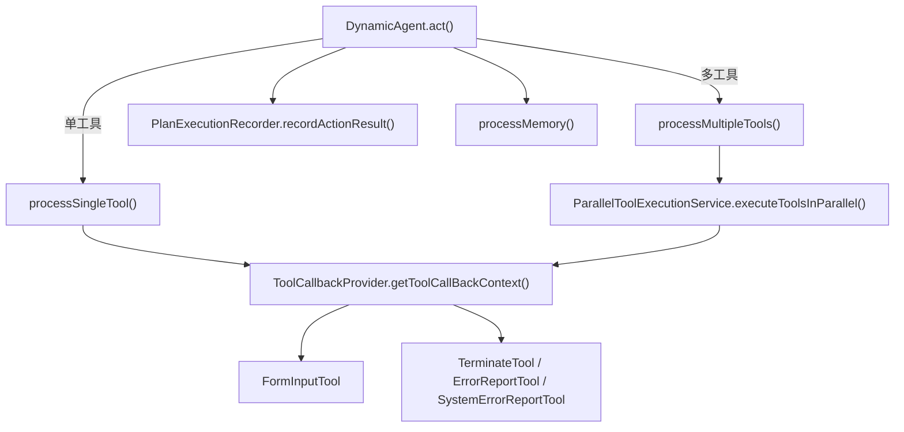
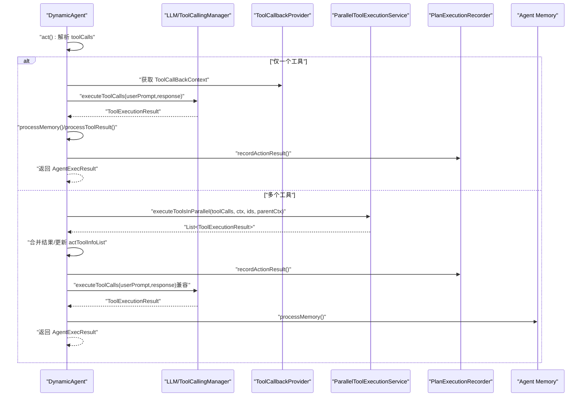
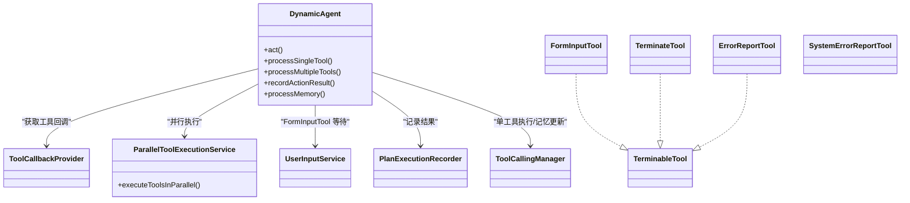

# 执行过程

<cite>
**本文引用的文件列表**
- [DynamicAgent.java](file://src/main/java/com/alibaba/cloud/ai/lynxe/agent/DynamicAgent.java)
- [ParallelToolExecutionService.java](file://src/main/java/com/alibaba/cloud/ai/lynxe/runtime/service/ParallelToolExecutionService.java)
- [FormInputTool.java](file://src/main/java/com/alibaba/cloud/ai/lynxe/tool/FormInputTool.java)
- [TerminableTool.java](file://src/main/java/com/alibaba/cloud/ai/lynxe/tool/TerminableTool.java)
- [ErrorReportTool.java](file://src/main/java/com/alibaba/cloud/ai/lynxe/tool/ErrorReportTool.java)
- [SystemErrorReportTool.java](file://src/main/java/com/alibaba/cloud/ai/lynxe/tool/SystemErrorReportTool.java)
- [TerminateTool.java](file://src/main/java/com/alibaba/cloud/ai/lynxe/tool/TerminateTool.java)
- [UserInputService.java](file://src/main/java/com/alibaba/cloud/ai/lynxe/runtime/service/UserInputService.java)
- [PlanExecutionRecorder.java](file://src/main/java/com/alibaba/cloud/ai/lynxe/recorder/service/PlanExecutionRecorder.java)
- [ThinkActRecord.java](file://src/main/java/com/alibaba/cloud/ai/lynxe/recorder/entity/vo/ThinkActRecord.java)
- [LynxeController.java](file://src/main/java/com/alibaba/cloud/ai/lynxe/runtime/controller/LynxeController.java)
</cite>

## 目录
1. [简介](#简介)
2. [项目结构与入口](#项目结构与入口)
3. [核心组件](#核心组件)
4. [架构总览](#架构总览)
5. [详细组件分析](#详细组件分析)
6. [依赖关系分析](#依赖关系分析)
7. [性能考量与优化建议](#性能考量与优化建议)
8. [故障排查指南](#故障排查指南)
9. [结论](#结论)
10. [附录：启动与监控示例](#附录启动与监控示例)

## 简介
本文件系统性梳理 JManus 中 AI 代理的执行过程，重点围绕 DynamicAgent 的 act() 方法展开，覆盖：
- 单工具与多工具执行路径的差异与实现细节
- 并行执行服务 ParallelToolExecutionService 的使用方式与返回结果处理
- 不同类型工具（FormInputTool、TerminableTool 及其子类、ErrorReportTool、SystemErrorReportTool、TerminateTool）的处理逻辑与状态流转
- 执行结果记录与记忆体更新流程
- 启动与监控代理执行过程的方法与要点
- 面向开发者的性能优化建议（并行策略、错误处理）

## 项目结构与入口
- 动作阶段入口位于 DynamicAgent.act()，根据 LLM 返回的工具调用数量选择单工具或并行多工具执行路径。
- 并行执行由 ParallelToolExecutionService 统一调度，返回每项工具的执行结果。
- 工具回调上下文通过 ToolCallbackProvider 获取，支持 FormInputTool、TerminableTool、TerminateTool、ErrorReportTool、SystemErrorReportTool 等。
- 执行结果通过 PlanExecutionRecorder 记录到 ThinkActRecord，并在必要时更新对话记忆体。

图表来源
- [DynamicAgent.java](file://src/main/java/com/alibaba/cloud/ai/lynxe/agent/DynamicAgent.java#L606-L875)
- [ParallelToolExecutionService.java](file://src/main/java/com/alibaba/cloud/ai/lynxe/runtime/service/ParallelToolExecutionService.java#L84-L165)
- [PlanExecutionRecorder.java](file://src/main/java/com/alibaba/cloud/ai/lynxe/recorder/service/PlanExecutionRecorder.java#L82-L108)

章节来源
- [DynamicAgent.java](file://src/main/java/com/alibaba/cloud/ai/lynxe/agent/DynamicAgent.java#L606-L875)

## 核心组件
- DynamicAgent：负责思考与行动阶段的编排，act() 是行动阶段的核心入口；内部包含单工具与多工具执行分支，以及对特殊工具类型的处理。
- ParallelToolExecutionService：提供多工具并行执行能力，统一收集各工具执行结果并进行后处理。
- FormInputTool：用于等待用户输入，支持表单定义、输入值绑定与超时处理。
- TerminableTool 接口及其实现：提供可终止条件检查，典型实现包括 TerminateTool、ErrorReportTool。
- ErrorReportTool/SystemErrorReportTool：用于报告错误并记录到执行记录中，前者可终止，后者不可终止。
- UserInputService：管理 FormInputTool 的存储、等待与提交，支撑用户交互。
- PlanExecutionRecorder/ThinkActRecord：记录思考与动作阶段的执行详情，便于前端展示与回溯。

章节来源
- [DynamicAgent.java](file://src/main/java/com/alibaba/cloud/ai/lynxe/agent/DynamicAgent.java#L1-L120)
- [ParallelToolExecutionService.java](file://src/main/java/com/alibaba/cloud/ai/lynxe/runtime/service/ParallelToolExecutionService.java#L1-L83)
- [FormInputTool.java](file://src/main/java/com/alibaba/cloud/ai/lynxe/tool/FormInputTool.java#L1-L120)
- [TerminableTool.java](file://src/main/java/com/alibaba/cloud/ai/lynxe/tool/TerminableTool.java#L1-L31)
- [ErrorReportTool.java](file://src/main/java/com/alibaba/cloud/ai/lynxe/tool/ErrorReportTool.java#L1-L60)
- [SystemErrorReportTool.java](file://src/main/java/com/alibaba/cloud/ai/lynxe/tool/SystemErrorReportTool.java#L1-L60)
- [TerminateTool.java](file://src/main/java/com/alibaba/cloud/ai/lynxe/tool/TerminateTool.java#L1-L60)
- [UserInputService.java](file://src/main/java/com/alibaba/cloud/ai/lynxe/runtime/service/UserInputService.java#L153-L245)
- [PlanExecutionRecorder.java](file://src/main/java/com/alibaba/cloud/ai/lynxe/recorder/service/PlanExecutionRecorder.java#L37-L129)
- [ThinkActRecord.java](file://src/main/java/com/alibaba/cloud/ai/lynxe/recorder/entity/vo/ThinkActRecord.java#L106-L157)

## 架构总览
下图展示了从 act() 到工具执行、结果记录与记忆体更新的整体流程。

图表来源
- [DynamicAgent.java](file://src/main/java/com/alibaba/cloud/ai/lynxe/agent/DynamicAgent.java#L606-L875)
- [ParallelToolExecutionService.java](file://src/main/java/com/alibaba/cloud/ai/lynxe/runtime/service/ParallelToolExecutionService.java#L84-L165)
- [PlanExecutionRecorder.java](file://src/main/java/com/alibaba/cloud/ai/lynxe/recorder/service/PlanExecutionRecorder.java#L82-L108)

## 详细组件分析

### act() 执行流程与分支
- 入口：DynamicAgent.act() 从流式响应中提取有效工具调用列表。
- 分支：
  - 无工具调用：返回 IN_PROGRESS，提示重试。
  - 单工具：进入 processSingleTool()，直接通过 ToolCallingManager 执行工具，处理 FormInputTool/TerminableTool 等特殊类型，记录结果并返回。
  - 多工具：进入 processMultipleTools()，先校验是否包含受限工具（FormInputTool、TerminableTool），若存在则提示分次调用；否则通过 ParallelToolExecutionService 并行执行，汇总结果并记录。

章节来源
- [DynamicAgent.java](file://src/main/java/com/alibaba/cloud/ai/lynxe/agent/DynamicAgent.java#L606-L875)

### 单工具执行：processSingleTool()
- 关键点：
  - 检查中断标志，避免在执行前被中断。
  - 通过 ToolCallingManager 执行工具调用，获取 ToolExecutionResult。
  - 从回调上下文中解析工具实例，区分 FormInputTool、TerminableTool、TerminateTool、ErrorReportTool、SystemErrorReportTool 等类型，分别处理：
    - FormInputTool：设置当前计划 ID 与根计划 ID，使用 UserInputService 存储并等待用户输入，支持超时与中断检测；收到输入后写入记忆体并返回 IN_PROGRESS。
    - TerminableTool：若 canTerminate() 为真，则标记应终止；TerminateTool 特判直接置 COMPLETED；ErrorReportTool 提取 errorMessage 并记录错误思考与动作。
    - SystemErrorReportTool：记录错误但不终止。
    - 其他常规工具：统一处理结果字符串，执行共享后处理（记录结果）。
  - 对结果进行 processToolResult() 处理（去除转义 JSON、保持字段顺序等），并检查重复结果触发记忆压缩。
  - 返回 AgentExecResult，状态依据是否终止而定。

章节来源
- [DynamicAgent.java](file://src/main/java/com/alibaba/cloud/ai/lynxe/agent/DynamicAgent.java#L655-L767)
- [FormInputTool.java](file://src/main/java/com/alibaba/cloud/ai/lynxe/tool/FormInputTool.java#L375-L477)
- [ErrorReportTool.java](file://src/main/java/com/alibaba/cloud/ai/lynxe/tool/ErrorReportTool.java#L100-L183)
- [SystemErrorReportTool.java](file://src/main/java/com/alibaba/cloud/ai/lynxe/tool/SystemErrorReportTool.java#L101-L177)
- [TerminateTool.java](file://src/main/java/com/alibaba/cloud/ai/lynxe/tool/TerminateTool.java#L210-L454)
- [UserInputService.java](file://src/main/java/com/alibaba/cloud/ai/lynxe/runtime/service/UserInputService.java#L153-L245)

### 多工具执行：processMultipleTools()
- 关键点：
  - 校验工具集合中是否包含受限工具（FormInputTool、TerminableTool）。若存在，返回 IN_PROGRESS 并提示分次调用。
  - 若可用并行服务，构造父级 ToolContext（携带 toolcallId 与 planDepth），调用 ParallelToolExecutionService.executeToolsInParallel() 并行执行所有工具。
  - 收集并行结果，按工具名映射到 actToolInfoList，统一处理输出（processToolResult），更新参数结果列表。
  - 调用 recordActionResult() 记录结果；随后兼容性地再次执行 ToolCallingManager 的工具调用以更新记忆体。
  - 返回 IN_PROGRESS，表示继续下一步。

章节来源
- [DynamicAgent.java](file://src/main/java/com/alibaba/cloud/ai/lynxe/agent/DynamicAgent.java#L776-L875)
- [ParallelToolExecutionService.java](file://src/main/java/com/alibaba/cloud/ai/lynxe/runtime/service/ParallelToolExecutionService.java#L84-L165)

### 并行执行服务：ParallelToolExecutionService
- 并行策略：
  - 使用 CompletableFuture 将每个工具封装为独立任务，统一 join() 等待全部完成。
  - 从 parentToolContext 提取 toolcallId 与 planDepth，注入到每个工具执行上下文中，保证链路追踪一致。
  - 对每个工具执行时，解析参数 JSON，生成 ToolContext 并调用工具实例的 apply() 执行。
  - 异常捕获并包装为 ToolExecutionResult(success=false)，确保整体并行不会因个别失败而中断。
- 结果聚合：
  - 收集所有任务结果，按工具名匹配回原始工具调用顺序，填充 actToolInfoList 的结果字段。

章节来源
- [ParallelToolExecutionService.java](file://src/main/java/com/alibaba/cloud/ai/lynxe/runtime/service/ParallelToolExecutionService.java#L84-L165)

### 特殊工具类型处理
- FormInputTool
  - 运行时将自身状态设为 AWAITING_USER_INPUT，并通过 UserInputService.exclusive 存储与等待。
  - 用户提交后，更新表单项值并标记 INPUT_RECEIVED；超时则标记 INPUT_TIMEOUT 并清理。
  - 在单工具路径中，会阻塞直到输入到达或超时，期间持续轮询中断检查。
- TerminableTool 及其实现
  - ErrorReportTool：可终止，用于报告错误并记录；当其被调用时，会提取 errorMessage 并记录错误思考与动作。
  - TerminateTool：可终止，用于结束当前步骤并返回结构化摘要；调用后标记 COMPLETED。
  - SystemErrorReportTool：不可终止，用于系统内部错误报告，不影响执行继续。
- 结果处理与记录
  - 所有工具执行后，DynamicAgent 会统一调用 recordActionResult() 记录动作结果；同时在单工具路径中，还会调用 ToolCallingManager 的工具执行以兼容性更新记忆体。

章节来源
- [FormInputTool.java](file://src/main/java/com/alibaba/cloud/ai/lynxe/tool/FormInputTool.java#L375-L477)
- [ErrorReportTool.java](file://src/main/java/com/alibaba/cloud/ai/lynxe/tool/ErrorReportTool.java#L100-L183)
- [SystemErrorReportTool.java](file://src/main/java/com/alibaba/cloud/ai/lynxe/tool/SystemErrorReportTool.java#L101-L177)
- [TerminateTool.java](file://src/main/java/com/alibaba/cloud/ai/lynxe/tool/TerminateTool.java#L210-L454)
- [PlanExecutionRecorder.java](file://src/main/java/com/alibaba/cloud/ai/lynxe/recorder/service/PlanExecutionRecorder.java#L82-L108)
- [DynamicAgent.java](file://src/main/java/com/alibaba/cloud/ai/lynxe/agent/DynamicAgent.java#L749-L758)

### 执行结果记录与记忆更新
- 记录：recordActionResult() 将 actToolInfoList 写入 ThinkActRecord，便于前端查看与回放。
- 记忆更新：processMemory() 会清理当前计划的记忆，仅保留必要的消息（排除系统消息与环境数据消息），并将工具调用历史写入记忆体。
- 重复结果保护：checkAndHandleRepeatedResult() 检测连续重复结果，触发强制压缩以打破潜在循环。

章节来源
- [PlanExecutionRecorder.java](file://src/main/java/com/alibaba/cloud/ai/lynxe/recorder/service/PlanExecutionRecorder.java#L82-L108)
- [ThinkActRecord.java](file://src/main/java/com/alibaba/cloud/ai/lynxe/recorder/entity/vo/ThinkActRecord.java#L106-L157)
- [DynamicAgent.java](file://src/main/java/com/alibaba/cloud/ai/lynxe/agent/DynamicAgent.java#L1286-L1310)
- [DynamicAgent.java](file://src/main/java/com/alibaba/cloud/ai/lynxe/agent/DynamicAgent.java#L1229-L1270)

## 依赖关系分析
- DynamicAgent 依赖：
  - ToolCallbackProvider：提供工具回调上下文，是工具实例与名称之间的桥梁。
  - ParallelToolExecutionService：多工具并行执行的核心服务。
  - UserInputService：FormInputTool 的存储、等待与提交。
  - PlanExecutionRecorder：记录思考与动作阶段的执行详情。
  - ToolCallingManager：单工具执行与记忆体兼容更新。
- 工具接口与实现：
  - TerminableTool：统一可终止能力，具体由 TerminateTool、ErrorReportTool 实现。
  - FormInputTool：用户输入等待与状态管理。
  - SystemErrorReportTool：系统错误报告，不终止执行。

图表来源
- [DynamicAgent.java](file://src/main/java/com/alibaba/cloud/ai/lynxe/agent/DynamicAgent.java#L606-L875)
- [ParallelToolExecutionService.java](file://src/main/java/com/alibaba/cloud/ai/lynxe/runtime/service/ParallelToolExecutionService.java#L84-L165)
- [FormInputTool.java](file://src/main/java/com/alibaba/cloud/ai/lynxe/tool/FormInputTool.java#L375-L477)
- [TerminableTool.java](file://src/main/java/com/alibaba/cloud/ai/lynxe/tool/TerminableTool.java#L1-L31)
- [ErrorReportTool.java](file://src/main/java/com/alibaba/cloud/ai/lynxe/tool/ErrorReportTool.java#L100-L183)
- [SystemErrorReportTool.java](file://src/main/java/com/alibaba/cloud/ai/lynxe/tool/SystemErrorReportTool.java#L101-L177)
- [TerminateTool.java](file://src/main/java/com/alibaba/cloud/ai/lynxe/tool/TerminateTool.java#L210-L454)

## 性能考量与优化建议
- 并行策略
  - 合理控制并发度：ParallelToolExecutionService 使用 CompletableFuture 并发执行，建议结合业务场景评估工具数量与资源限制，避免过度并发导致线程池压力。
  - 参数解析与序列化：processToolResult() 对输出进行 JSON 解析与重序列化，注意避免大对象频繁转换带来的开销。
- 错误处理
  - 单工具异常：processSingleTool() 捕获异常并使用 SystemErrorReportTool 包装错误，确保执行继续或明确失败。
  - 多工具异常：ParallelToolExecutionService 对每个工具单独捕获异常并返回 ToolExecutionResult(success=false)，保证整体并行稳定性。
- 记忆体与循环保护
  - 重复结果检测：checkAndHandleRepeatedResult() 在检测到连续重复时触发强制压缩，有助于打破潜在循环，减少无效计算。
- 中断与超时
  - 在等待用户输入时，周期性检查中断标志，避免长时间阻塞；超时自动清理 FormInputTool 状态。

章节来源
- [ParallelToolExecutionService.java](file://src/main/java/com/alibaba/cloud/ai/lynxe/runtime/service/ParallelToolExecutionService.java#L84-L165)
- [DynamicAgent.java](file://src/main/java/com/alibaba/cloud/ai/lynxe/agent/DynamicAgent.java#L1229-L1270)
- [DynamicAgent.java](file://src/main/java/com/alibaba/cloud/ai/lynxe/agent/DynamicAgent.java#L1532-L1580)

## 故障排查指南
- 常见问题
  - 多工具执行被拒绝：当包含 FormInputTool 或 TerminableTool 时，processMultipleTools() 会返回 IN_PROGRESS 并提示分次调用。请将受限工具拆分为单工具调用。
  - 并行服务不可用：若 ParallelToolExecutionService 为空，act() 将返回 COMPLETED 并提示服务不可用。
  - 回调上下文缺失：若 ToolCallbackProvider 中找不到对应工具回调，processSingleTool() 仍会尝试处理结果，但会记录错误并返回 IN_PROGRESS。
  - 记忆体未更新：单工具路径会通过 ToolCallingManager 再次执行工具调用来更新记忆体；多工具路径会在记录后做兼容性更新。
- 定位手段
  - 查看最后 ThinkAct 步骤与 ActToolInfo 列表，确认工具调用与结果是否正确记录。
  - 检查 LynxeController 中获取的 AgentExecutionDetail 是否包含最新 thinkActSteps。

章节来源
- [DynamicAgent.java](file://src/main/java/com/alibaba/cloud/ai/lynxe/agent/DynamicAgent.java#L776-L875)
- [LynxeController.java](file://src/main/java/com/alibaba/cloud/ai/lynxe/runtime/controller/LynxeController.java#L734-L771)

## 结论
DynamicAgent 的 act() 方法通过清晰的分支策略与工具类型识别，实现了从单工具到多工具的平滑过渡。并行执行服务提供了稳定的并发执行能力，配合特殊的工具类型（FormInputTool、TerminableTool 系列）与完善的记录与记忆体更新机制，确保了执行过程的可观测性与可控性。开发者在扩展新工具或优化执行性能时，应关注工具回调上下文、并行策略与错误处理的一致性，以及对重复结果与中断的敏感性。

## 附录：启动与监控示例
- 启动与监控要点
  - 启动后，前端可通过获取 AgentExecutionDetail 的 thinkActSteps 与 ActToolInfo 列表，实时查看最近一次执行的思考与动作详情。
  - 当工具为 FormInputTool 时，前端会显示等待状态与表单输入界面；用户提交后，后端会标记 INPUT_RECEIVED 并写入记忆体，随后继续执行。
  - 若出现错误，ErrorReportTool/SystemErrorReportTool 会将错误信息写入执行记录，便于定位问题。

章节来源
- [LynxeController.java](file://src/main/java/com/alibaba/cloud/ai/lynxe/runtime/controller/LynxeController.java#L734-L771)
- [ThinkActRecord.java](file://src/main/java/com/alibaba/cloud/ai/lynxe/recorder/entity/vo/ThinkActRecord.java#L106-L157)
- [DynamicAgent.java](file://src/main/java/com/alibaba/cloud/ai/lynxe/agent/DynamicAgent.java#L877-L936)