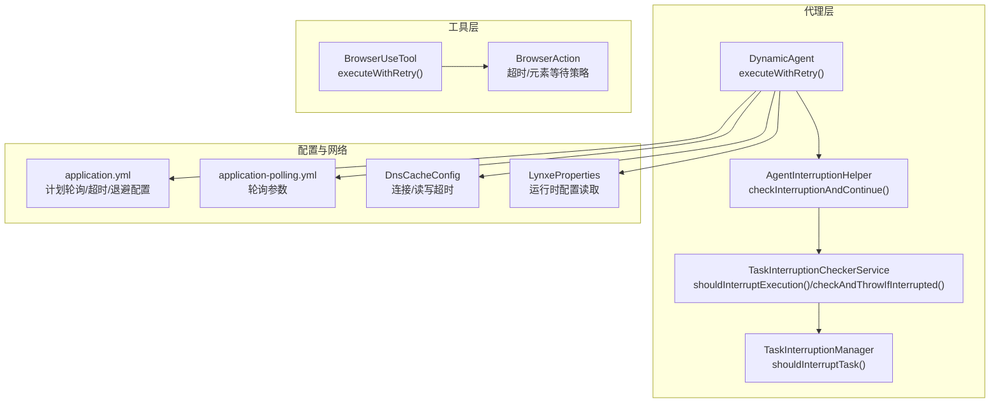
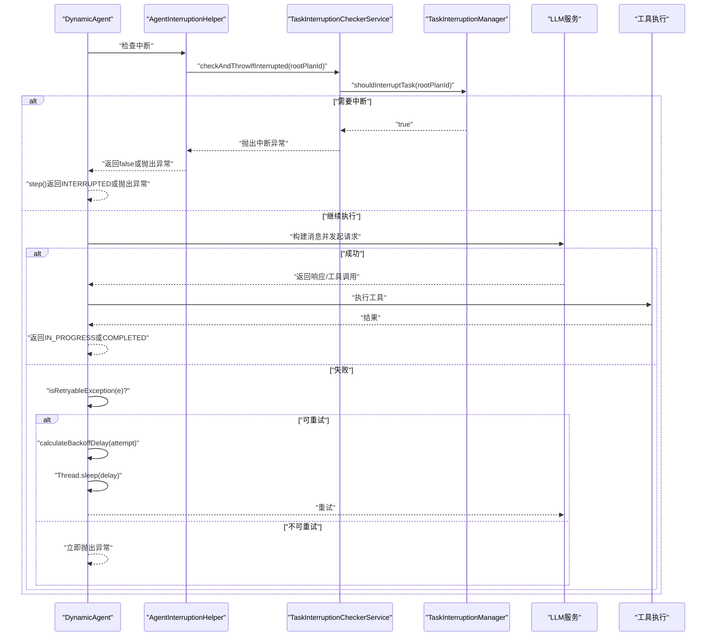
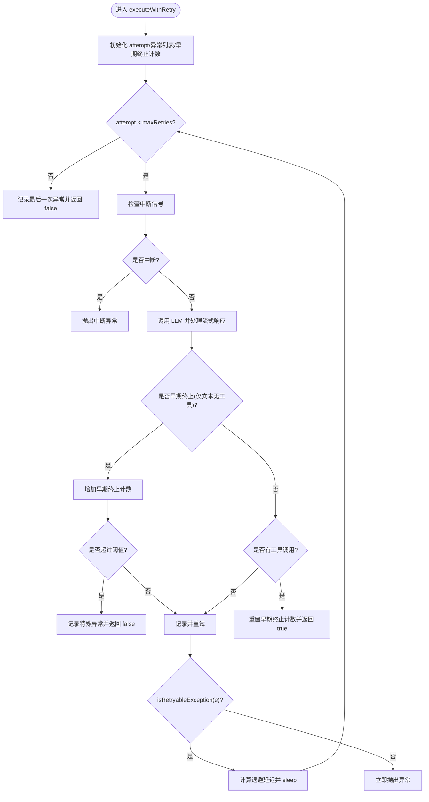
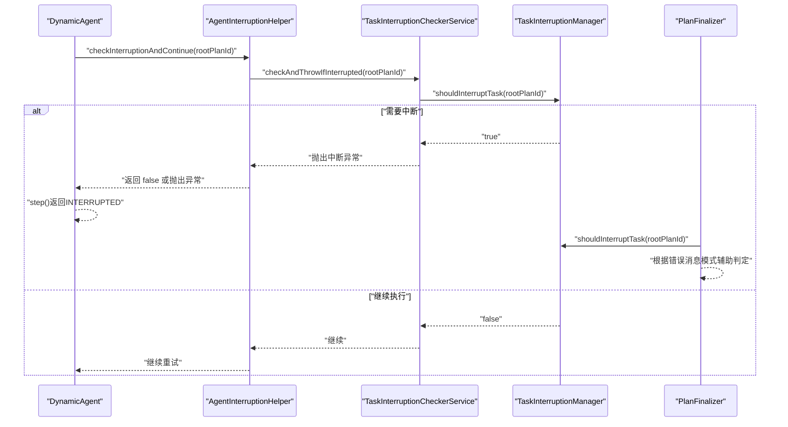
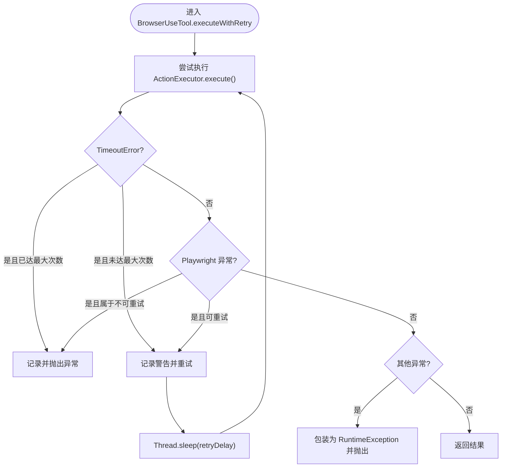
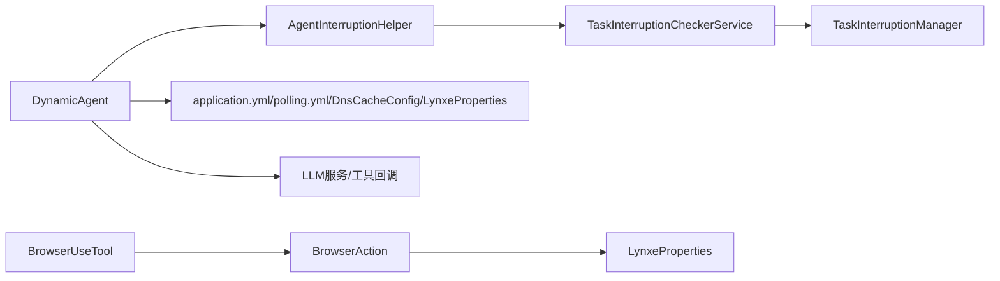

# 执行重试机制

<cite>
**本文引用的文件**
- [DynamicAgent.java](file://src/main/java/com/alibaba/cloud/ai/lynxe/agent/DynamicAgent.java)
- [AgentInterruptionHelper.java](file://src/main/java/com/alibaba/cloud/ai/lynxe/runtime/service/AgentInterruptionHelper.java)
- [TaskInterruptionCheckerService.java](file://src/main/java/com/alibaba/cloud/ai/lynxe/runtime/service/TaskInterruptionCheckerService.java)
- [TaskInterruptionManager.java](file://src/main/java/com/alibaba/cloud/ai/lynxe/runtime/service/TaskInterruptionManager.java)
- [PlanFinalizer.java](file://src/main/java/com/alibaba/cloud/ai/lynxe/planning/service/PlanFinalizer.java)
- [application.yml](file://src/main/resources/application.yml)
- [application-polling.yml](file://src/main/resources/application-polling.yml)
- [DnsCacheConfig.java](file://src/main/java/com/alibaba/cloud/ai/lynxe/config/DnsCacheConfig.java)
- [LynxeProperties.java](file://src/main/java/com/alibaba/cloud/ai/lynxe/config/LynxeProperties.java)
- [BrowserUseTool.java](file://src/main/java/com/alibaba/cloud/ai/lynxe/tool/browser/BrowserUseTool.java)
- [BrowserAction.java](file://src/main/java/com/alibaba/cloud/ai/lynxe/tool/browser/actions/BrowserAction.java)
</cite>

## 目录
1. [简介](#简介)
2. [项目结构与定位](#项目结构与定位)
3. [核心组件与职责](#核心组件与职责)
4. [架构总览](#架构总览)
5. [详细组件分析](#详细组件分析)
6. [依赖关系分析](#依赖关系分析)
7. [性能与优化建议](#性能与优化建议)
8. [故障排查指南](#故障排查指南)
9. [结论](#结论)

## 简介
本文件系统化梳理并说明 AI 代理在执行过程中所采用的“执行重试机制”。重点围绕 DynamicAgent 中的 executeWithRetry 方法展开，解释其工作原理、重试策略、指数退避算法、中断处理以及在代理执行流程中的作用与重要性。同时提供配置参考、使用示例路径与优化建议，帮助开发者正确配置与调优重试行为，提升系统的稳定性与用户体验。

## 项目结构与定位
- 重试机制主要实现在 DynamicAgent 的思考阶段（think）与执行阶段（step/act），通过 executeWithRetry 实现对 LLM 调用失败的自动重试，并结合指数退避与中断检查，避免无限循环与资源浪费。
- 中断处理由 AgentInterruptionHelper、TaskInterruptionCheckerService、TaskInterruptionManager 协同完成，确保在外部触发中断时能及时停止重试循环。
- 工具层（如浏览器工具）也实现了独立的重试逻辑，用于处理网络/超时等可重试异常，体现“分层重试”的设计思想。

图表来源
- [DynamicAgent.java](file://src/main/java/com/alibaba/cloud/ai/lynxe/agent/DynamicAgent.java#L232-L508)
- [AgentInterruptionHelper.java](file://src/main/java/com/alibaba/cloud/ai/lynxe/runtime/service/AgentInterruptionHelper.java#L35-L84)
- [TaskInterruptionCheckerService.java](file://src/main/java/com/alibaba/cloud/ai/lynxe/runtime/service/TaskInterruptionCheckerService.java#L37-L114)
- [TaskInterruptionManager.java](file://src/main/java/com/alibaba/cloud/ai/lynxe/runtime/service/TaskInterruptionManager.java#L45-L67)
- [application.yml](file://src/main/resources/application.yml#L60-L78)
- [application-polling.yml](file://src/main/resources/application-polling.yml#L1-L18)
- [DnsCacheConfig.java](file://src/main/java/com/alibaba/cloud/ai/lynxe/config/DnsCacheConfig.java#L79-L97)
- [LynxeProperties.java](file://src/main/java/com/alibaba/cloud/ai/lynxe/config/LynxeProperties.java#L310-L329)
- [BrowserUseTool.java](file://src/main/java/com/alibaba/cloud/ai/lynxe/tool/browser/BrowserUseTool.java#L300-L349)
- [BrowserAction.java](file://src/main/java/com/alibaba/cloud/ai/lynxe/tool/browser/actions/BrowserAction.java#L56-L78)

章节来源
- [DynamicAgent.java](file://src/main/java/com/alibaba/cloud/ai/lynxe/agent/DynamicAgent.java#L232-L508)
- [application.yml](file://src/main/resources/application.yml#L60-L78)
- [application-polling.yml](file://src/main/resources/application-polling.yml#L1-L18)
- [DnsCacheConfig.java](file://src/main/java/com/alibaba/cloud/ai/lynxe/config/DnsCacheConfig.java#L79-L97)
- [LynxeProperties.java](file://src/main/java/com/alibaba/cloud/ai/lynxe/config/LynxeProperties.java#L310-L329)
- [BrowserUseTool.java](file://src/main/java/com/alibaba/cloud/ai/lynxe/tool/browser/BrowserUseTool.java#L300-L349)
- [BrowserAction.java](file://src/main/java/com/alibaba/cloud/ai/lynxe/tool/browser/actions/BrowserAction.java#L56-L78)

## 核心组件与职责
- DynamicAgent.executeWithRetry：代理思考阶段的重试主控，负责：
  - 可重试异常识别（网络/超时/连接问题等）
  - 指数退避延迟计算与等待
  - 中断检查与快速退出
  - 早期终止阈值控制（避免模型只输出文本不调用工具）
  - 异常记录与最终失败处理
- AgentInterruptionHelper：封装中断检查，便于在关键节点进行中断判断。
- TaskInterruptionCheckerService/TaskInterruptionManager：基于数据库状态的分布式中断判定，支持 STOP/CANCEL/PAUSE 状态。
- BrowserUseTool.executeWithRetry：浏览器工具的独立重试，针对 Playwright/超时等异常进行分类处理。
- 配置层：application.yml 与 application-polling.yml 提供轮询、超时、退避等参数；DnsCacheConfig 设置底层 HTTP 客户端超时；LynxeProperties 提供运行时配置读取。

章节来源
- [DynamicAgent.java](file://src/main/java/com/alibaba/cloud/ai/lynxe/agent/DynamicAgent.java#L232-L508)
- [AgentInterruptionHelper.java](file://src/main/java/com/alibaba/cloud/ai/lynxe/runtime/service/AgentInterruptionHelper.java#L35-L84)
- [TaskInterruptionCheckerService.java](file://src/main/java/com/alibaba/cloud/ai/lynxe/runtime/service/TaskInterruptionCheckerService.java#L37-L114)
- [TaskInterruptionManager.java](file://src/main/java/com/alibaba/cloud/ai/lynxe/runtime/service/TaskInterruptionManager.java#L45-L67)
- [BrowserUseTool.java](file://src/main/java/com/alibaba/cloud/ai/lynxe/tool/browser/BrowserUseTool.java#L300-L349)
- [application.yml](file://src/main/resources/application.yml#L60-L78)
- [application-polling.yml](file://src/main/resources/application-polling.yml#L1-L18)
- [DnsCacheConfig.java](file://src/main/java/com/alibaba/cloud/ai/lynxe/config/DnsCacheConfig.java#L79-L97)
- [LynxeProperties.java](file://src/main/java/com/alibaba/cloud/ai/lynxe/config/LynxeProperties.java#L310-L329)

## 架构总览
下图展示了代理执行重试的整体流程：从 think 到 step/act，贯穿中断检查、异常识别、指数退避与早期终止阈值控制。

图表来源
- [DynamicAgent.java](file://src/main/java/com/alibaba/cloud/ai/lynxe/agent/DynamicAgent.java#L232-L508)
- [AgentInterruptionHelper.java](file://src/main/java/com/alibaba/cloud/ai/lynxe/runtime/service/AgentInterruptionHelper.java#L35-L84)
- [TaskInterruptionCheckerService.java](file://src/main/java/com/alibaba/cloud/ai/lynxe/runtime/service/TaskInterruptionCheckerService.java#L37-L114)
- [TaskInterruptionManager.java](file://src/main/java/com/alibaba/cloud/ai/lynxe/runtime/service/TaskInterruptionManager.java#L45-L67)

## 详细组件分析

### DynamicAgent.executeWithRetry 方法详解
- 可重试异常识别：通过异常消息关键字匹配网络相关错误（如解析失败、超时、连接、DNS、WebClientRequestException、DnsNameResolverTimeoutException 等）。
- 指数退避延迟：按 2^attempt × 基础延迟计算，上限不超过最大退避延迟。
- 中断检查：每次重试前检查中断信号，若被中断则抛出中断异常，避免无效重试。
- 早期终止阈值：若多次仅返回文本而未调用工具，会增强提示并限制阈值，超过阈值直接失败，防止死循环。
- 异常记录：所有尝试的异常都会记录到列表中，便于后续错误报告与诊断。
- 失败处理：达到最大重试次数后，返回 false，由 step() 决定下一步（可能是模拟系统错误报告或要求再次调用工具）。

图表来源
- [DynamicAgent.java](file://src/main/java/com/alibaba/cloud/ai/lynxe/agent/DynamicAgent.java#L232-L508)

章节来源
- [DynamicAgent.java](file://src/main/java/com/alibaba/cloud/ai/lynxe/agent/DynamicAgent.java#L232-L508)

### 中断处理链路
- AgentInterruptionHelper 在关键点调用 TaskInterruptionCheckerService 的检查方法，若检测到中断则返回 false 或抛出 TaskInterruptedException。
- TaskInterruptionCheckerService 基于 TaskInterruptionManager 的数据库状态判断是否应中断（STOP/CANCEL/PAUSE）。
- PlanFinalizer 在收尾阶段也会回查数据库状态与特定错误消息模式，以确认是否为中断导致的失败。

图表来源
- [AgentInterruptionHelper.java](file://src/main/java/com/alibaba/cloud/ai/lynxe/runtime/service/AgentInterruptionHelper.java#L35-L84)
- [TaskInterruptionCheckerService.java](file://src/main/java/com/alibaba/cloud/ai/lynxe/runtime/service/TaskInterruptionCheckerService.java#L37-L114)
- [TaskInterruptionManager.java](file://src/main/java/com/alibaba/cloud/ai/lynxe/runtime/service/TaskInterruptionManager.java#L45-L67)
- [PlanFinalizer.java](file://src/main/java/com/alibaba/cloud/ai/lynxe/planning/service/PlanFinalizer.java#L291-L325)

章节来源
- [AgentInterruptionHelper.java](file://src/main/java/com/alibaba/cloud/ai/lynxe/runtime/service/AgentInterruptionHelper.java#L35-L84)
- [TaskInterruptionCheckerService.java](file://src/main/java/com/alibaba/cloud/ai/lynxe/runtime/service/TaskInterruptionCheckerService.java#L37-L114)
- [TaskInterruptionManager.java](file://src/main/java/com/alibaba/cloud/ai/lynxe/runtime/service/TaskInterruptionManager.java#L45-L67)
- [PlanFinalizer.java](file://src/main/java/com/alibaba/cloud/ai/lynxe/planning/service/PlanFinalizer.java#L291-L325)

### 浏览器工具的重试机制
- 对超时（TimeoutError）、Playwright 异常（如目标页面/上下文/浏览器已关闭）进行分类处理。
- 对非可重试异常直接抛出；对可重试异常在达到最大重试次数前进行等待后重试。
- 重试前会记录日志并区分最后一次尝试失败的情况。

图表来源
- [BrowserUseTool.java](file://src/main/java/com/alibaba/cloud/ai/lynxe/tool/browser/BrowserUseTool.java#L300-L349)

章节来源
- [BrowserUseTool.java](file://src/main/java/com/alibaba/cloud/ai/lynxe/tool/browser/BrowserUseTool.java#L300-L349)

### 配置与超时设置
- 计划轮询配置（application.yml）：包含最大轮询次数、轮询间隔、连接/读取超时、指数退避基础延迟与最大退避延迟。
- 轮询专用配置（application-polling.yml）：提供 max-attempts、poll-interval、connect-timeout、read-timeout、base-backoff-delay、max-backoff-delay。
- DNS 缓存与超时（DnsCacheConfig）：设置连接超时、读/写超时，启用 TCP keep-alive 与 TCP_NODELAY。
- LLM 读超时（LynxeProperties）：提供 llmReadTimeout 默认值与运行时读取逻辑。

章节来源
- [application.yml](file://src/main/resources/application.yml#L60-L78)
- [application-polling.yml](file://src/main/resources/application-polling.yml#L1-L18)
- [DnsCacheConfig.java](file://src/main/java/com/alibaba/cloud/ai/lynxe/config/DnsCacheConfig.java#L79-L97)
- [LynxeProperties.java](file://src/main/java/com/alibaba/cloud/ai/lynxe/config/LynxeProperties.java#L310-L329)

## 依赖关系分析
- DynamicAgent 依赖：
  - AgentInterruptionHelper：用于周期性中断检查。
  - TaskInterruptionCheckerService/TaskInterruptionManager：用于分布式中断判定。
  - LLM 服务与工具回调：用于生成消息、流式响应处理与工具调用。
  - 配置：application.yml、application-polling.yml、DnsCacheConfig、LynxeProperties。
- BrowserUseTool 依赖：
  - BrowserAction：提供超时与元素等待策略。
  - LynxeProperties：读取浏览器请求超时等配置。

图表来源
- [DynamicAgent.java](file://src/main/java/com/alibaba/cloud/ai/lynxe/agent/DynamicAgent.java#L232-L508)
- [AgentInterruptionHelper.java](file://src/main/java/com/alibaba/cloud/ai/lynxe/runtime/service/AgentInterruptionHelper.java#L35-L84)
- [TaskInterruptionCheckerService.java](file://src/main/java/com/alibaba/cloud/ai/lynxe/runtime/service/TaskInterruptionCheckerService.java#L37-L114)
- [TaskInterruptionManager.java](file://src/main/java/com/alibaba/cloud/ai/lynxe/runtime/service/TaskInterruptionManager.java#L45-L67)
- [BrowserUseTool.java](file://src/main/java/com/alibaba/cloud/ai/lynxe/tool/browser/BrowserUseTool.java#L300-L349)
- [BrowserAction.java](file://src/main/java/com/alibaba/cloud/ai/lynxe/tool/browser/actions/BrowserAction.java#L56-L78)
- [application.yml](file://src/main/resources/application.yml#L60-L78)
- [application-polling.yml](file://src/main/resources/application-polling.yml#L1-L18)
- [DnsCacheConfig.java](file://src/main/java/com/alibaba/cloud/ai/lynxe/config/DnsCacheConfig.java#L79-L97)
- [LynxeProperties.java](file://src/main/java/com/alibaba/cloud/ai/lynxe/config/LynxeProperties.java#L310-L329)

## 性能与优化建议
- 合理设置最大重试次数：过多重试会放大延迟与资源消耗，过少可能导致误判失败。建议结合业务 SLA 与 LLM 响应特性权衡。
- 指数退避参数：
  - 基础延迟与最大延迟需与上游服务限流策略匹配，避免叠加抖动。
  - 结合应用层超时设置（连接/读取/写入），确保整体超时不会被退避覆盖。
- 早期终止阈值：当模型频繁只输出文本不调用工具时，适当降低阈值可更快止损，避免无效重试。
- 中断优先级：在高并发场景下，中断检查应尽量轻量且短路，避免阻塞重试循环。
- 网络与 DNS：
  - 使用 DnsCacheConfig 的连接/读写超时与 keep-alive，减少网络抖动带来的重试压力。
  - 对 DNS 解析失败的异常进行快速判定，避免不必要的重试。
- 工具层重试：
  - 浏览器工具的重试应与页面生命周期管理配合，避免在页面/上下文关闭后仍重试。
  - 元素等待与超时策略要与页面动态加载节奏一致，避免过长等待导致的假超时。

[本节为通用指导，无需列出具体文件来源]

## 故障排查指南
- 重试无效或频繁重试：
  - 检查 isRetryableException 的匹配条件是否覆盖了实际异常类型。
  - 查看 calculateBackoffDelay 的参数与最大延迟是否合理。
- 中断未生效：
  - 确认 TaskInterruptionManager 的数据库状态是否正确更新为 STOP/CANCEL/PAUSE。
  - 检查 AgentInterruptionHelper 的 checkInterruptionAndContinue 调用位置是否足够频繁。
- 早期终止导致失败：
  - 观察 earlyTerminationCount 与阈值设置，必要时增强提示以促使模型调用工具。
- 超时与网络问题：
  - 检查 application.yml 与 DnsCacheConfig 的超时配置是否与上游服务一致。
  - 对 DNS 类异常进行快速判定，避免重试。
- 工具层超时：
  - 浏览器工具的 executeWithRetry 应区分 TimeoutError 与不可重试异常，避免无意义重试。

章节来源
- [DynamicAgent.java](file://src/main/java/com/alibaba/cloud/ai/lynxe/agent/DynamicAgent.java#L232-L508)
- [AgentInterruptionHelper.java](file://src/main/java/com/alibaba/cloud/ai/lynxe/runtime/service/AgentInterruptionHelper.java#L35-L84)
- [TaskInterruptionCheckerService.java](file://src/main/java/com/alibaba/cloud/ai/lynxe/runtime/service/TaskInterruptionCheckerService.java#L37-L114)
- [TaskInterruptionManager.java](file://src/main/java/com/alibaba/cloud/ai/lynxe/runtime/service/TaskInterruptionManager.java#L45-L67)
- [BrowserUseTool.java](file://src/main/java/com/alibaba/cloud/ai/lynxe/tool/browser/BrowserUseTool.java#L300-L349)
- [application.yml](file://src/main/resources/application.yml#L60-L78)
- [DnsCacheConfig.java](file://src/main/java/com/alibaba/cloud/ai/lynxe/config/DnsCacheConfig.java#L79-L97)

## 结论
DynamicAgent 的 executeWithRetry 将“可重试异常识别 + 指数退避 + 中断检查 + 早期终止阈值”有机结合，既提升了代理在不稳定环境下的鲁棒性，又避免了无效重试与资源浪费。配合工具层的独立重试与完善的配置体系，能够满足复杂场景下的稳定性需求。建议在生产环境中结合业务特征与上游服务限流策略，持续优化重试次数、退避参数与超时设置，并完善中断与异常监控，以获得更佳的用户体验与系统表现。