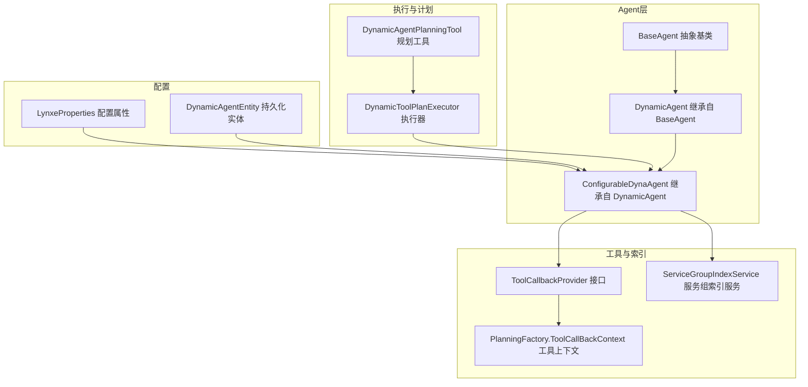
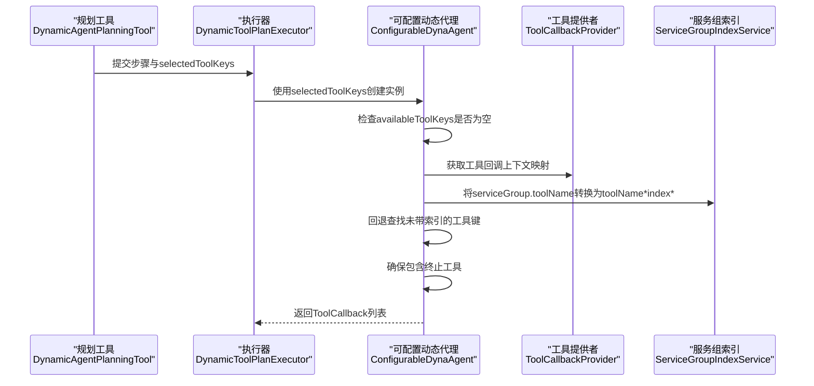
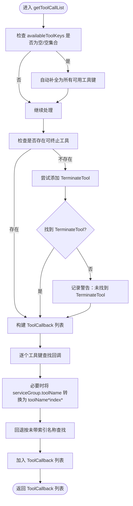
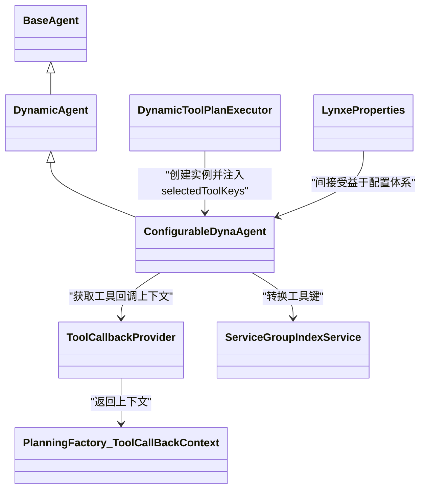

# ConfigurableDynaAgent配置

<cite>
**本文引用的文件列表**
- [ConfigurableDynaAgent.java](file://src/main/java/com/alibaba/cloud/ai/lynxe/agent/ConfigurableDynaAgent.java)
- [DynamicAgent.java](file://src/main/java/com/alibaba/cloud/ai/lynxe/agent/DynamicAgent.java)
- [BaseAgent.java](file://src/main/java/com/alibaba/cloud/ai/lynxe/agent/BaseAgent.java)
- [ToolCallbackProvider.java](file://src/main/java/com/alibaba/cloud/ai/lynxe/agent/ToolCallbackProvider.java)
- [PlanningFactory.java](file://src/main/java/com/alibaba/cloud/ai/lynxe/planning/PlanningFactory.java)
- [ServiceGroupIndexService.java](file://src/main/java/com/alibaba/cloud/ai/lynxe/runtime/service/ServiceGroupIndexService.java)
- [DynamicToolPlanExecutor.java](file://src/main/java/com/alibaba/cloud/ai/lynxe/runtime/executor/DynamicToolPlanExecutor.java)
- [DynamicAgentPlanningTool.java](file://src/main/java/com/alibaba/cloud/ai/lynxe/tool/DynamicAgentPlanningTool.java)
- [LynxeProperties.java](file://src/main/java/com/alibaba/cloud/ai/lynxe/config/LynxeProperties.java)
- [DynamicAgentEntity.java](file://src/main/java/com/alibaba/cloud/ai/lynxe/agent/entity/DynamicAgentEntity.java)
</cite>

## 目录
1. [简介](#简介)
2. [项目结构与定位](#项目结构与定位)
3. [核心组件与职责](#核心组件与职责)
4. [架构总览](#架构总览)
5. [详细组件分析](#详细组件分析)
6. [依赖关系分析](#依赖关系分析)
7. [性能与可扩展性](#性能与可扩展性)
8. [故障排查与错误处理](#故障排查与错误处理)
9. [结论](#结论)
10. [附录：配置示例与最佳实践](#附录配置示例与最佳实践)

## 简介
本文件系统化梳理 ConfigurableDynaAgent 的配置特性与扩展能力，重点说明其作为 DynamicAgent 子类在“可用工具集”（availableToolKeys）上的继承与覆盖规则，并给出如何通过外部配置源加载参数、如何进行配置验证与错误处理、以及如何扩展配置选项与自定义配置逻辑的指导。同时，提供面向开发者的可操作示例路径与最佳实践建议。

## 项目结构与定位
- ConfigurableDynaAgent 位于 agent 包中，是 DynamicAgent 的子类，负责在运行时按需选择工具集合，支持服务组索引转换与回退查找，确保工具调用的稳定性与兼容性。
- 工具回调上下文由 ToolCallbackProvider 提供，ConfigurableDynaAgent 在 getToolCallList 中基于 availableToolKeys 构建 ToolCallback 列表。
- 动态执行器 DynamicToolPlanExecutor 根据计划步骤中的 selectedToolKeys 创建 ConfigurableDynaAgent 实例，从而实现“按计划选择工具”的动态行为。
- LynxeProperties 提供统一的配置读取入口，支持从外部配置源（如数据库或配置中心）加载键值并缓存，ConfigurableDynaAgent 可间接受益于该配置体系。

图表来源
- [ConfigurableDynaAgent.java](file://src/main/java/com/alibaba/cloud/ai/lynxe/agent/ConfigurableDynaAgent.java#L1-L342)
- [DynamicAgent.java](file://src/main/java/com/alibaba/cloud/ai/lynxe/agent/DynamicAgent.java#L1-L800)
- [BaseAgent.java](file://src/main/java/com/alibaba/cloud/ai/lynxe/agent/BaseAgent.java#L1-L603)
- [ToolCallbackProvider.java](file://src/main/java/com/alibaba/cloud/ai/lynxe/agent/ToolCallbackProvider.java#L1-L27)
- [PlanningFactory.java](file://src/main/java/com/alibaba/cloud/ai/lynxe/planning/PlanningFactory.java#L219-L241)
- [ServiceGroupIndexService.java](file://src/main/java/com/alibaba/cloud/ai/lynxe/runtime/service/ServiceGroupIndexService.java#L1-L133)
- [DynamicToolPlanExecutor.java](file://src/main/java/com/alibaba/cloud/ai/lynxe/runtime/executor/DynamicToolPlanExecutor.java#L111-L162)
- [DynamicAgentPlanningTool.java](file://src/main/java/com/alibaba/cloud/ai/lynxe/tool/DynamicAgentPlanningTool.java#L34-L374)
- [LynxeProperties.java](file://src/main/java/com/alibaba/cloud/ai/lynxe/config/LynxeProperties.java#L1-L552)
- [DynamicAgentEntity.java](file://src/main/java/com/alibaba/cloud/ai/lynxe/agent/entity/DynamicAgentEntity.java#L1-L132)

章节来源
- [ConfigurableDynaAgent.java](file://src/main/java/com/alibaba/cloud/ai/lynxe/agent/ConfigurableDynaAgent.java#L1-L342)
- [DynamicAgent.java](file://src/main/java/com/alibaba/cloud/ai/lynxe/agent/DynamicAgent.java#L1-L800)
- [BaseAgent.java](file://src/main/java/com/alibaba/cloud/ai/lynxe/agent/BaseAgent.java#L1-L603)

## 核心组件与职责
- ConfigurableDynaAgent
  - 继承 DynamicAgent 并重写 getToolCallList，实现“按 availableToolKeys 过滤工具”的动态行为；当 availableToolKeys 为空或 null 时自动补全为所有可用工具，并保证存在终止工具（TerminateTool 或可终止工具）。
  - 支持服务组工具名到后端执行格式的转换（serviceGroup.toolName -> toolName*index*），并提供回退查找策略，兼容旧版未带索引的工具键。
- DynamicAgent
  - 提供思考与行动流程、重试与异常处理、内存与对话历史管理等通用能力；维护 availableToolKeys 字段并提供父类构造器。
- BaseAgent
  - 定义 Agent 生命周期、状态机与异常兜底（SystemErrorReportTool）等基础能力。
- ToolCallbackProvider / PlanningFactory.ToolCallBackContext
  - 提供工具回调上下文映射，ConfigurableDynaAgent 通过该映射构建 ToolCallback 列表。
- ServiceGroupIndexService
  - 负责服务组到索引的映射与转换，支持线程安全缓存与一致性索引分配。
- DynamicToolPlanExecutor / DynamicAgentPlanningTool
  - 基于计划步骤中的 selectedToolKeys 创建 ConfigurableDynaAgent，实现“按计划选择工具”的动态行为。
- LynxeProperties / DynamicAgentEntity
  - 提供配置读取与持久化存储，支持从外部配置源加载参数，ConfigurableDynaAgent 可间接受益于该体系。

章节来源
- [ConfigurableDynaAgent.java](file://src/main/java/com/alibaba/cloud/ai/lynxe/agent/ConfigurableDynaAgent.java#L1-L342)
- [DynamicAgent.java](file://src/main/java/com/alibaba/cloud/ai/lynxe/agent/DynamicAgent.java#L1-L800)
- [BaseAgent.java](file://src/main/java/com/alibaba/cloud/ai/lynxe/agent/BaseAgent.java#L1-L603)
- [ToolCallbackProvider.java](file://src/main/java/com/alibaba/cloud/ai/lynxe/agent/ToolCallbackProvider.java#L1-L27)
- [PlanningFactory.java](file://src/main/java/com/alibaba/cloud/ai/lynxe/planning/PlanningFactory.java#L219-L241)
- [ServiceGroupIndexService.java](file://src/main/java/com/alibaba/cloud/ai/lynxe/runtime/service/ServiceGroupIndexService.java#L1-L133)
- [DynamicToolPlanExecutor.java](file://src/main/java/com/alibaba/cloud/ai/lynxe/runtime/executor/DynamicToolPlanExecutor.java#L111-L162)
- [DynamicAgentPlanningTool.java](file://src/main/java/com/alibaba/cloud/ai/lynxe/tool/DynamicAgentPlanningTool.java#L34-L374)
- [LynxeProperties.java](file://src/main/java/com/alibaba/cloud/ai/lynxe/config/LynxeProperties.java#L1-L552)
- [DynamicAgentEntity.java](file://src/main/java/com/alibaba/cloud/ai/lynxe/agent/entity/DynamicAgentEntity.java#L1-L132)

## 架构总览
ConfigurableDynaAgent 的配置与执行链路如下：
- 计划层（DynamicAgentPlanningTool）定义步骤与所选工具键（selectedToolKeys）。
- 执行器（DynamicToolPlanExecutor）根据步骤类型创建 ConfigurableDynaAgent，并传入 selectedToolKeys。
- ConfigurableDynaAgent 在 getToolCallList 中：
  - 若 availableToolKeys 为空/空集合，则自动补全为所有可用工具；
  - 确保至少包含一个终止工具（TerminateTool 或可终止工具）；
  - 将前端格式的 serviceGroup.toolName 转换为后端执行格式 toolName*index*；
  - 回退查找未带索引的工具键，兼容旧版本；
  - 构建 ToolCallback 列表返回给上层执行。

图表来源
- [DynamicAgentPlanningTool.java](file://src/main/java/com/alibaba/cloud/ai/lynxe/tool/DynamicAgentPlanningTool.java#L34-L374)
- [DynamicToolPlanExecutor.java](file://src/main/java/com/alibaba/cloud/ai/lynxe/runtime/executor/DynamicToolPlanExecutor.java#L111-L162)
- [ConfigurableDynaAgent.java](file://src/main/java/com/alibaba/cloud/ai/lynxe/agent/ConfigurableDynaAgent.java#L1-L342)
- [ServiceGroupIndexService.java](file://src/main/java/com/alibaba/cloud/ai/lynxe/runtime/service/ServiceGroupIndexService.java#L1-L133)
- [ToolCallbackProvider.java](file://src/main/java/com/alibaba/cloud/ai/lynxe/agent/ToolCallbackProvider.java#L1-L27)

## 详细组件分析

### ConfigurableDynaAgent 的配置继承与覆盖规则
- 继承自 DynamicAgent 的 availableToolKeys 字段，用于控制当前代理可用的工具集合。
- 当 availableToolKeys 为 null 或空集合时：
  - 自动补全为工具提供者提供的全部可用工具键；
  - 日志记录补全动作，便于审计与调试。
- 工具选择与终止保障：
  - 遍历已配置的工具键，若未发现可终止工具（TerminableTool），则尝试添加 TerminateTool；
  - 若找不到 TerminateTool，记录警告日志，避免无终止工具导致循环执行。
- 服务组工具名转换与回退查找：
  - 将 serviceGroup.toolName 转换为 toolName*index* 的后端执行格式；
  - 若转换失败或无需转换，回退到直接匹配；
  - 优先使用服务组索引服务进行高效查找，失败时再进行手动遍历匹配。
- 最终构建 ToolCallback 列表返回给上层执行。

图表来源
- [ConfigurableDynaAgent.java](file://src/main/java/com/alibaba/cloud/ai/lynxe/agent/ConfigurableDynaAgent.java#L97-L199)
- [ServiceGroupIndexService.java](file://src/main/java/com/alibaba/cloud/ai/lynxe/runtime/service/ServiceGroupIndexService.java#L97-L131)

章节来源
- [ConfigurableDynaAgent.java](file://src/main/java/com/alibaba/cloud/ai/lynxe/agent/ConfigurableDynaAgent.java#L97-L199)
- [ServiceGroupIndexService.java](file://src/main/java/com/alibaba/cloud/ai/lynxe/runtime/service/ServiceGroupIndexService.java#L97-L131)

### ConfigurableDynaAgent 的构造与初始化
- 构造函数接收 LLM 服务、执行记录器、Lynxe 配置、代理名称/描述/下一步提示、可用工具键、工具调用管理器、初始设置、用户输入服务、模型名、流式响应处理器、执行步骤、计划 ID 分发器、事件发布器、中断助手、ObjectMapper、并行工具执行服务、内存服务、对话记忆限制服务、服务组索引服务等。
- 通过 super(...) 将上述参数传递给父类 DynamicAgent，完成基础字段与服务的注入。

章节来源
- [ConfigurableDynaAgent.java](file://src/main/java/com/alibaba/cloud/ai/lynxe/agent/ConfigurableDynaAgent.java#L57-L89)

### 工具回调上下文与服务组索引
- ToolCallbackProvider 提供工具回调上下文映射（Map<String, ToolCallBackContext>），其中 ToolCallBackContext 包含 ToolCallback 与工具函数实例。
- ServiceGroupIndexService 负责：
  - 将 serviceGroup.toolName 转换为 toolName*index*；
  - 为服务组分配唯一索引并缓存，保证跨组件一致；
  - 提供 containsServiceGroup、getCacheSize 等辅助能力。

章节来源
- [ToolCallbackProvider.java](file://src/main/java/com/alibaba/cloud/ai/lynxe/agent/ToolCallbackProvider.java#L1-L27)
- [PlanningFactory.java](file://src/main/java/com/alibaba/cloud/ai/lynxe/planning/PlanningFactory.java#L219-L241)
- [ServiceGroupIndexService.java](file://src/main/java/com/alibaba/cloud/ai/lynxe/runtime/service/ServiceGroupIndexService.java#L1-L133)

### 从外部配置源加载配置参数
- LynxeProperties 通过注解声明配置项（group/subGroup/key/path/defaultValue/inputType/options），并在 getter 中从 IConfigService 获取实际值，支持默认值回退与类型转换。
- DynamicAgentEntity 支持将 agentName、agentDescription、nextStepPrompt、availableToolKeys、className、模型与命名空间等持久化，可用于从数据库加载代理配置。
- DynamicToolPlanExecutor 依据计划步骤中的 selectedToolKeys 创建 ConfigurableDynaAgent，实现“按计划选择工具”的动态行为。

章节来源
- [LynxeProperties.java](file://src/main/java/com/alibaba/cloud/ai/lynxe/config/LynxeProperties.java#L1-L552)
- [DynamicAgentEntity.java](file://src/main/java/com/alibaba/cloud/ai/lynxe/agent/entity/DynamicAgentEntity.java#L1-L132)
- [DynamicToolPlanExecutor.java](file://src/main/java/com/alibaba/cloud/ai/lynxe/runtime/executor/DynamicToolPlanExecutor.java#L111-L162)

### 配置验证与错误处理机制
- 工具缺失与回退：
  - 当工具键无法在工具映射中找到时，记录警告并跳过该工具，避免中断整体流程。
- 终止工具保障：
  - 若未检测到可终止工具，尝试添加 TerminateTool；若仍不可用，记录警告，防止无限循环。
- 异常与重试：
  - DynamicAgent 对 LLM 调用进行重试与异常聚合，支持指数退避与早期终止阈值检测，最终生成统一的错误信息。
- 兜底错误报告：
  - BaseAgent 提供 SystemErrorReportTool 的兜底封装，确保异常场景下仍能输出可读结果并清理中间状态。

章节来源
- [ConfigurableDynaAgent.java](file://src/main/java/com/alibaba/cloud/ai/lynxe/agent/ConfigurableDynaAgent.java#L138-L199)
- [DynamicAgent.java](file://src/main/java/com/alibaba/cloud/ai/lynxe/agent/DynamicAgent.java#L232-L485)
- [BaseAgent.java](file://src/main/java/com/alibaba/cloud/ai/lynxe/agent/BaseAgent.java#L375-L424)

## 依赖关系分析
- ConfigurableDynaAgent 与 DynamicAgent 的继承关系清晰，前者仅在工具选择阶段扩展行为。
- 与 ToolCallbackProvider 的耦合体现在 getToolCallList 的工具筛选与回调构建。
- 与 ServiceGroupIndexService 的耦合体现在工具键转换与回退查找。
- 与 DynamicToolPlanExecutor 的耦合体现在计划驱动的实例化与 selectedToolKeys 注入。
- 与 LynxeProperties 的耦合体现在配置读取与默认值回退。

图表来源
- [ConfigurableDynaAgent.java](file://src/main/java/com/alibaba/cloud/ai/lynxe/agent/ConfigurableDynaAgent.java#L1-L342)
- [DynamicAgent.java](file://src/main/java/com/alibaba/cloud/ai/lynxe/agent/DynamicAgent.java#L1-L800)
- [BaseAgent.java](file://src/main/java/com/alibaba/cloud/ai/lynxe/agent/BaseAgent.java#L1-L603)
- [ToolCallbackProvider.java](file://src/main/java/com/alibaba/cloud/ai/lynxe/agent/ToolCallbackProvider.java#L1-L27)
- [PlanningFactory.java](file://src/main/java/com/alibaba/cloud/ai/lynxe/planning/PlanningFactory.java#L219-L241)
- [ServiceGroupIndexService.java](file://src/main/java/com/alibaba/cloud/ai/lynxe/runtime/service/ServiceGroupIndexService.java#L1-L133)
- [DynamicToolPlanExecutor.java](file://src/main/java/com/alibaba/cloud/ai/lynxe/runtime/executor/DynamicToolPlanExecutor.java#L111-L162)
- [LynxeProperties.java](file://src/main/java/com/alibaba/cloud/ai/lynxe/config/LynxeProperties.java#L1-L552)

## 性能与可扩展性
- 工具键转换与查找：
  - 通过 ServiceGroupIndexService 缓存服务组索引，避免重复计算；
  - 优先使用服务组索引服务进行匹配，失败后再回退到遍历匹配，兼顾性能与兼容性。
- 并行工具执行：
  - DynamicAgent 支持并行工具调用配置（来自 LynxeProperties），可在满足约束的前提下提升吞吐。
- 重试与早期终止：
  - DynamicAgent 内置重试与早期终止阈值，减少无效请求与资源浪费。

章节来源
- [ServiceGroupIndexService.java](file://src/main/java/com/alibaba/cloud/ai/lynxe/runtime/service/ServiceGroupIndexService.java#L1-L133)
- [DynamicAgent.java](file://src/main/java/com/alibaba/cloud/ai/lynxe/agent/DynamicAgent.java#L232-L485)
- [LynxeProperties.java](file://src/main/java/com/alibaba/cloud/ai/lynxe/config/LynxeProperties.java#L264-L285)

## 故障排查与错误处理
- 工具缺失：
  - 现象：工具键在映射中找不到，日志出现警告。
  - 处理：确认 selectedToolKeys 与工具注册是否一致；必要时启用服务组工具名转换。
- 无终止工具：
  - 现象：未检测到可终止工具，日志出现警告。
  - 处理：确保计划中包含 TerminateTool 或可终止工具；或允许自动补全。
- LLM 调用失败：
  - 现象：多次重试后仍失败，记录最新异常。
  - 处理：检查网络、超时与模型配置；必要时降低并发或增大超时。
- 兜底错误报告：
  - 现象：异常被包装为 SystemErrorReportTool 输出。
  - 处理：查看 step 中的错误消息，定位具体环节。

章节来源
- [ConfigurableDynaAgent.java](file://src/main/java/com/alibaba/cloud/ai/lynxe/agent/ConfigurableDynaAgent.java#L138-L199)
- [DynamicAgent.java](file://src/main/java/com/alibaba/cloud/ai/lynxe/agent/DynamicAgent.java#L487-L605)
- [BaseAgent.java](file://src/main/java/com/alibaba/cloud/ai/lynxe/agent/BaseAgent.java#L375-L424)

## 结论
ConfigurableDynaAgent 在继承 DynamicAgent 的基础上，通过 availableToolKeys 的灵活配置实现了“按计划选择工具”的动态行为。其关键特性包括：
- availableToolKeys 为空时自动补全为所有可用工具；
- 强制保障终止工具的存在；
- 支持服务组工具名转换与回退查找；
- 与计划执行器协同，实现“按计划选择工具”的可配置代理。

这些设计使得 ConfigurableDynaAgent 在复杂业务场景中具备良好的可扩展性与稳定性。

## 附录：配置示例与最佳实践

### 如何设置与获取特定配置项（示例路径）
- 设置代理名称/描述/下一步提示：
  - 示例路径：[构造函数参数](file://src/main/java/com/alibaba/cloud/ai/lynxe/agent/ConfigurableDynaAgent.java#L57-L89)
- 设置可用工具键（selectedToolKeys）：
  - 来源：计划步骤中的 selectedToolKeys，执行器创建时注入：
    - [执行器创建实例](file://src/main/java/com/alibaba/cloud/ai/lynxe/runtime/executor/DynamicToolPlanExecutor.java#L150-L162)
    - [规划工具输入结构](file://src/main/java/com/alibaba/cloud/ai/lynxe/tool/DynamicAgentPlanningTool.java#L34-L97)
- 从外部配置源加载参数：
  - 读取配置值（默认值回退与类型转换）：
    - [LynxeProperties 读取与默认值](file://src/main/java/com/alibaba/cloud/ai/lynxe/config/LynxeProperties.java#L154-L211)
  - 持久化代理配置：
    - [DynamicAgentEntity 字段定义](file://src/main/java/com/alibaba/cloud/ai/lynxe/agent/entity/DynamicAgentEntity.java#L27-L100)

章节来源
- [ConfigurableDynaAgent.java](file://src/main/java/com/alibaba/cloud/ai/lynxe/agent/ConfigurableDynaAgent.java#L57-L89)
- [DynamicToolPlanExecutor.java](file://src/main/java/com/alibaba/cloud/ai/lynxe/runtime/executor/DynamicToolPlanExecutor.java#L150-L162)
- [DynamicAgentPlanningTool.java](file://src/main/java/com/alibaba/cloud/ai/lynxe/tool/DynamicAgentPlanningTool.java#L34-L97)
- [LynxeProperties.java](file://src/main/java/com/alibaba/cloud/ai/lynxe/config/LynxeProperties.java#L154-L211)
- [DynamicAgentEntity.java](file://src/main/java/com/alibaba/cloud/ai/lynxe/agent/entity/DynamicAgentEntity.java#L27-L100)

### 配置验证与错误处理最佳实践
- 工具键校验：
  - 在注入 selectedToolKeys 前进行合法性校验（例如非空、格式正确）；
  - 若为空，启用自动补全并记录审计日志。
- 终止工具保障：
  - 明确要求计划中必须包含 TerminateTool 或可终止工具；
  - 若缺失，记录警告并触发告警通知。
- 异常与重试：
  - 合理设置重试次数与退避策略；
  - 对网络类异常进行区分处理，避免无意义重试。
- 兜底错误报告：
  - 使用 SystemErrorReportTool 输出统一错误信息；
  - 清理中间状态，避免脏数据影响后续执行。

章节来源
- [ConfigurableDynaAgent.java](file://src/main/java/com/alibaba/cloud/ai/lynxe/agent/ConfigurableDynaAgent.java#L138-L199)
- [DynamicAgent.java](file://src/main/java/com/alibaba/cloud/ai/lynxe/agent/DynamicAgent.java#L232-L485)
- [BaseAgent.java](file://src/main/java/com/alibaba/cloud/ai/lynxe/agent/BaseAgent.java#L375-L424)

### 自定义扩展指导
- 扩展配置选项：
  - 在 LynxeProperties 中新增 @ConfigProperty 注解的配置项，并提供默认值与输入类型；
  - 在 ConfigurableDynaAgent 中通过父类字段或构造注入使用新配置。
- 自定义工具键解析：
  - 若需要更复杂的工具键映射规则，可在 ConfigurableDynaAgent 的工具查找逻辑中扩展；
  - 保持与 ServiceGroupIndexService 的协作，避免重复转换。
- 自定义终止策略：
  - 可在计划层面强制要求终止工具的存在，或在代理层增加额外的终止条件判断。

章节来源
- [LynxeProperties.java](file://src/main/java/com/alibaba/cloud/ai/lynxe/config/LynxeProperties.java#L1-L552)
- [ConfigurableDynaAgent.java](file://src/main/java/com/alibaba/cloud/ai/lynxe/agent/ConfigurableDynaAgent.java#L138-L199)