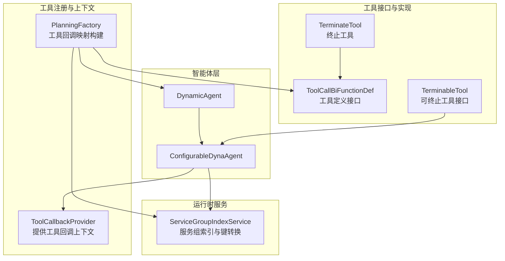
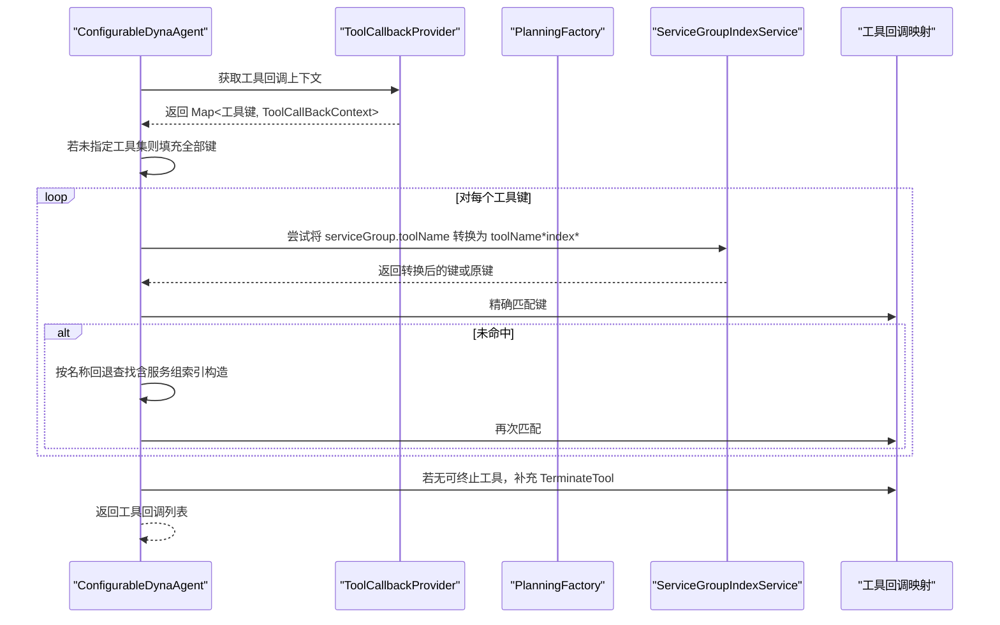
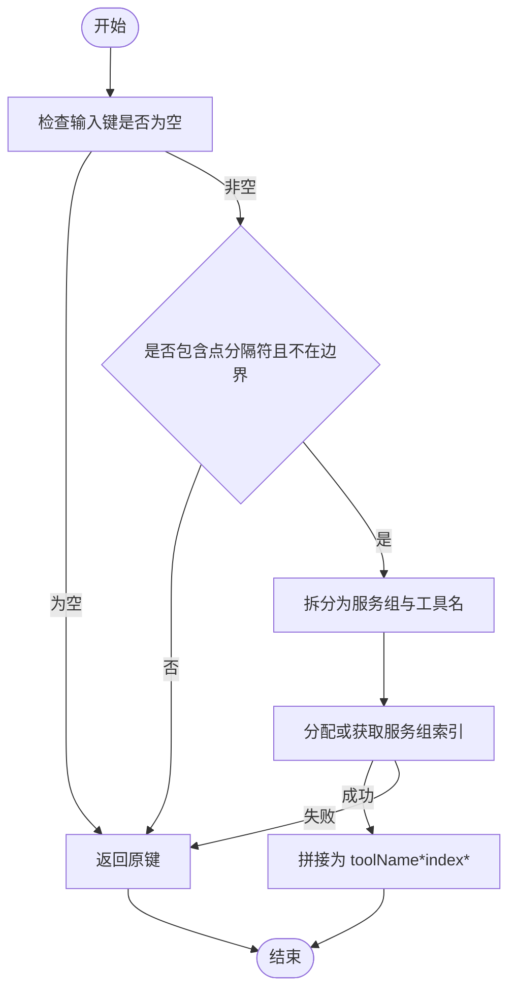
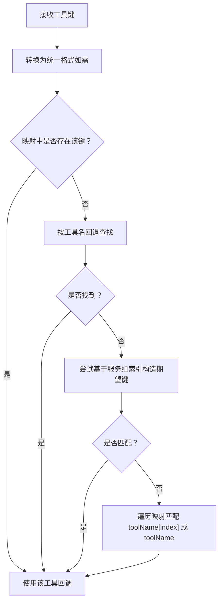
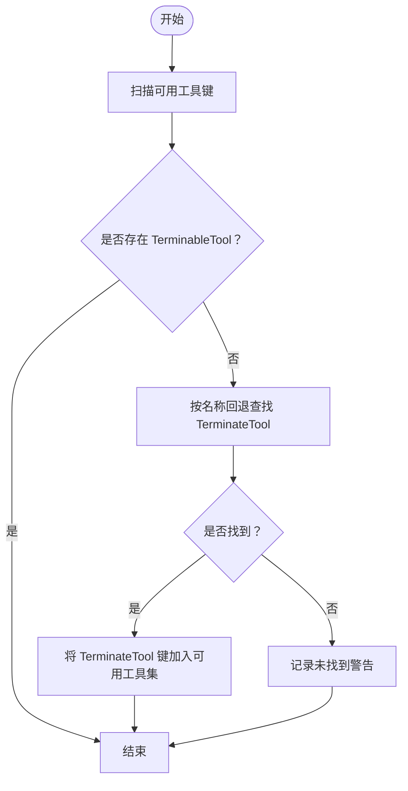
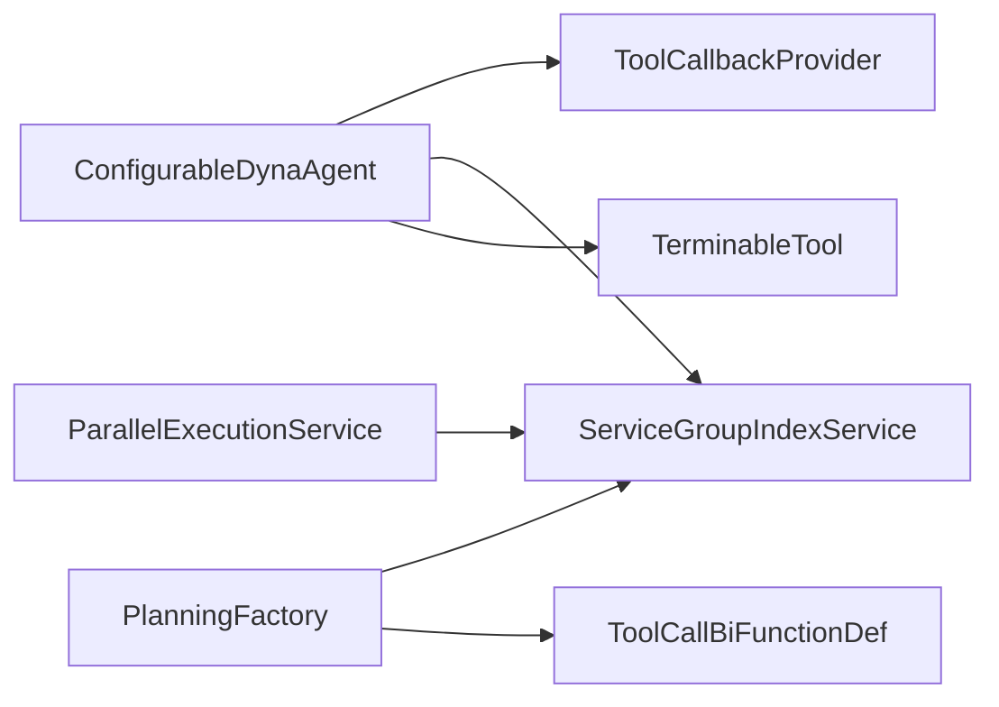

# 工具管理机制

<cite>
**本文引用的文件**
- [ConfigurableDynaAgent.java](file://src/main/java/com/alibaba/cloud/ai/lynxe/agent/ConfigurableDynaAgent.java)
- [ToolCallbackProvider.java](file://src/main/java/com/alibaba/cloud/ai/lynxe/agent/ToolCallbackProvider.java)
- [DynamicAgent.java](file://src/main/java/com/alibaba/cloud/ai/lynxe/agent/DynamicAgent.java)
- [PlanningFactory.java](file://src/main/java/com/alibaba/cloud/ai/lynxe/planning/PlanningFactory.java)
- [ServiceGroupIndexService.java](file://src/main/java/com/alibaba/cloud/ai/lynxe/runtime/service/ServiceGroupIndexService.java)
- [TerminateTool.java](file://src/main/java/com/alibaba/cloud/ai/lynxe/tool/TerminateTool.java)
- [TerminableTool.java](file://src/main/java/com/alibaba/cloud/ai/lynxe/tool/TerminableTool.java)
- [ToolCallBiFunctionDef.java](file://src/main/java/com/alibaba/cloud/ai/lynxe/tool/ToolCallBiFunctionDef.java)
- [ParallelExecutionService.java](file://src/main/java/com/alibaba/cloud/ai/lynxe/tool/mapreduce/ParallelExecutionService.java)
</cite>

## 目录
1. [简介](#简介)
2. [项目结构与定位](#项目结构与定位)
3. [核心组件](#核心组件)
4. [架构总览](#架构总览)
5. [详细组件分析](#详细组件分析)
6. [依赖关系分析](#依赖关系分析)
7. [性能考量](#性能考量)
8. [故障排查指南](#故障排查指南)
9. [结论](#结论)
10. [附录：最佳实践与示例路径](#附录最佳实践与示例路径)

## 简介
本文件系统化梳理 ConfigurableDynaAgent 的工具管理机制，重点覆盖：
- 工具回调列表的管理与来源（从 ToolCallbackProvider 获取可用工具）
- 工具键的转换逻辑（serviceGroup.toolName 到 toolName*index* 的转换）
- 工具查找的兼容策略（精确匹配与向后兼容查找）
- TerminateTool 的特殊处理与“始终包含”保障
- 工具注册、查找与调用的完整流程示例路径
- 高效工具查找算法与工具依赖关系处理的最佳实践

## 项目结构与定位
该能力位于智能体与工具体系的交汇处，ConfigurableDynaAgent 在 DynamicAgent 基础上扩展了可配置工具集，并通过 PlanningFactory 统一注册工具回调，借助 ServiceGroupIndexService 实现服务组索引与工具键的统一格式化，最终由 ToolCallbackProvider 提供可用工具上下文集合。

图表来源
- [ConfigurableDynaAgent.java](file://src/main/java/com/alibaba/cloud/ai/lynxe/agent/ConfigurableDynaAgent.java#L91-L199)
- [PlanningFactory.java](file://src/main/java/com/alibaba/cloud/ai/lynxe/planning/PlanningFactory.java#L240-L358)
- [ServiceGroupIndexService.java](file://src/main/java/com/alibaba/cloud/ai/lynxe/runtime/service/ServiceGroupIndexService.java#L97-L132)
- [ToolCallBiFunctionDef.java](file://src/main/java/com/alibaba/cloud/ai/lynxe/tool/ToolCallBiFunctionDef.java#L1-L105)
- [TerminateTool.java](file://src/main/java/com/alibaba/cloud/ai/lynxe/tool/TerminateTool.java#L35-L455)
- [TerminableTool.java](file://src/main/java/com/alibaba/cloud/ai/lynxe/tool/TerminableTool.java#L1-L31)

章节来源
- [ConfigurableDynaAgent.java](file://src/main/java/com/alibaba/cloud/ai/lynxe/agent/ConfigurableDynaAgent.java#L91-L199)
- [PlanningFactory.java](file://src/main/java/com/alibaba/cloud/ai/lynxe/planning/PlanningFactory.java#L240-L358)

## 核心组件
- ConfigurableDynaAgent：动态可配置工具集的智能体，负责从 ToolCallbackProvider 获取工具回调上下文，按需转换工具键，进行兼容性查找，并确保 TerminateTool 总是可用。
- ToolCallbackProvider：提供当前可用工具的回调上下文映射（键为工具唯一标识，值为工具回调与函数实例）。
- PlanningFactory：负责将工具定义注册为回调上下文，生成带服务组索引的工具键（toolName*index*），并构建 FunctionToolCallback。
- ServiceGroupIndexService：维护 serviceGroup 到整数索引的映射，支持将 serviceGroup.toolName 转换为 toolName*index* 的统一格式。
- ToolCallBiFunctionDef：工具定义接口，提供名称、描述、参数模式、输入类型、是否直接返回、是否可选择等元信息。
- TerminateTool / TerminableTool：终止类工具及其接口，用于在工具链路中安全结束执行。

章节来源
- [ConfigurableDynaAgent.java](file://src/main/java/com/alibaba/cloud/ai/lynxe/agent/ConfigurableDynaAgent.java#L91-L199)
- [ToolCallbackProvider.java](file://src/main/java/com/alibaba/cloud/ai/lynxe/agent/ToolCallbackProvider.java#L18-L26)
- [PlanningFactory.java](file://src/main/java/com/alibaba/cloud/ai/lynxe/planning/PlanningFactory.java#L240-L358)
- [ServiceGroupIndexService.java](file://src/main/java/com/alibaba/cloud/ai/lynxe/runtime/service/ServiceGroupIndexService.java#L97-L132)
- [ToolCallBiFunctionDef.java](file://src/main/java/com/alibaba/cloud/ai/lynxe/tool/ToolCallBiFunctionDef.java#L1-L105)
- [TerminateTool.java](file://src/main/java/com/alibaba/cloud/ai/lynxe/tool/TerminateTool.java#L35-L455)
- [TerminableTool.java](file://src/main/java/com/alibaba/cloud/ai/lynxe/tool/TerminableTool.java#L1-L31)

## 架构总览
ConfigurableDynaAgent 的工具管理遵循“注册—转换—查找—包含”的闭环：
- 注册阶段：PlanningFactory 将工具定义注册为 ToolCallBackContext，并以“toolName*index*”或“toolName”作为键存入映射。
- 转换阶段：ServiceGroupIndexService 将前端传入的“serviceGroup.toolName”转换为“toolName*index*”，保证键格式一致。
- 查找阶段：ConfigurableDynaAgent 先尝试精确匹配，再回退到按名称匹配；若存在服务组，优先使用服务组索引构造期望键。
- 包含阶段：若未发现任何可终止工具，则自动补充 TerminateTool，确保执行链路可被安全终止。

图表来源
- [ConfigurableDynaAgent.java](file://src/main/java/com/alibaba/cloud/ai/lynxe/agent/ConfigurableDynaAgent.java#L91-L199)
- [PlanningFactory.java](file://src/main/java/com/alibaba/cloud/ai/lynxe/planning/PlanningFactory.java#L240-L358)
- [ServiceGroupIndexService.java](file://src/main/java/com/alibaba/cloud/ai/lynxe/runtime/service/ServiceGroupIndexService.java#L97-L132)

## 详细组件分析

### 工具回调列表管理与 ToolCallbackProvider
- ConfigurableDynaAgent 通过 ToolCallbackProvider 获取当前可用工具的回调上下文映射。当未显式指定工具集时，会将映射中的所有键加入可用工具集，从而实现“全量工具”模式。
- DynamicAgent 同样依赖 ToolCallbackProvider 进行工具回调列表的默认实现，但 ConfigurableDynaAgent 在此基础上增加了键转换、兼容查找与终止工具保障。

章节来源
- [ConfigurableDynaAgent.java](file://src/main/java/com/alibaba/cloud/ai/lynxe/agent/ConfigurableDynaAgent.java#L91-L199)
- [ToolCallbackProvider.java](file://src/main/java/com/alibaba/cloud/ai/lynxe/agent/ToolCallbackProvider.java#L18-L26)
- [DynamicAgent.java](file://src/main/java/com/alibaba/cloud/ai/lynxe/agent/DynamicAgent.java#L1394-L1410)

### 工具键转换逻辑：serviceGroup.toolName → toolName*index*
- 转换入口：ConfigurableDynaAgent 内部委托 ServiceGroupIndexService 完成转换。
- 转换规则：
  - 输入为“serviceGroup.toolName”且包含点分隔符时，提取服务组与工具名；
  - 通过 ServiceGroupIndexService 分配或获取服务组索引；
  - 输出为“toolName*index*”格式，便于统一匹配与 LLM 调用。
- 若输入已是“toolName*index*”或无需转换，直接返回原键。

图表来源
- [ServiceGroupIndexService.java](file://src/main/java/com/alibaba/cloud/ai/lynxe/runtime/service/ServiceGroupIndexService.java#L97-L132)
- [ConfigurableDynaAgent.java](file://src/main/java/com/alibaba/cloud/ai/lynxe/agent/ConfigurableDynaAgent.java#L201-L227)

章节来源
- [ServiceGroupIndexService.java](file://src/main/java/com/alibaba/cloud/ai/lynxe/runtime/service/ServiceGroupIndexService.java#L97-L132)
- [ConfigurableDynaAgent.java](file://src/main/java/com/alibaba/cloud/ai/lynxe/agent/ConfigurableDynaAgent.java#L201-L227)

### 工具查找的兼容策略：精确匹配与向后兼容
- 精确匹配：先尝试使用转换后的键进行精确查找。
- 向后兼容：
  - 若未找到，尝试按“工具名”进行查找；
  - 若工具具备服务组，优先使用服务组索引构造期望键（toolName*index*）后再匹配；
  - 最终回退到遍历映射，匹配“toolName[index]”或“toolName”形式。
- 该策略兼顾新旧键格式，避免因键格式差异导致工具不可用。

图表来源
- [ConfigurableDynaAgent.java](file://src/main/java/com/alibaba/cloud/ai/lynxe/agent/ConfigurableDynaAgent.java#L167-L199)
- [ConfigurableDynaAgent.java](file://src/main/java/com/alibaba/cloud/ai/lynxe/agent/ConfigurableDynaAgent.java#L230-L341)

章节来源
- [ConfigurableDynaAgent.java](file://src/main/java/com/alibaba/cloud/ai/lynxe/agent/ConfigurableDynaAgent.java#L167-L199)
- [ConfigurableDynaAgent.java](file://src/main/java/com/alibaba/cloud/ai/lynxe/agent/ConfigurableDynaAgent.java#L230-L341)

### TerminateTool 的特殊处理与“始终包含”
- 检测：遍历已配置工具键，判断是否存在实现 TerminableTool 的工具。
- 补充：若不存在可终止工具，则通过名称回退查找 TerminateTool，并将其键加入可用工具集。
- 保障：即使工具回调映射中未显式包含 TerminateTool，也会通过名称匹配或已存在的“toolName*index*”键进行补充，确保执行链路可被终止。

图表来源
- [ConfigurableDynaAgent.java](file://src/main/java/com/alibaba/cloud/ai/lynxe/agent/ConfigurableDynaAgent.java#L109-L165)
- [TerminateTool.java](file://src/main/java/com/alibaba/cloud/ai/lynxe/tool/TerminateTool.java#L35-L455)
- [TerminableTool.java](file://src/main/java/com/alibaba/cloud/ai/lynxe/tool/TerminableTool.java#L1-L31)

章节来源
- [ConfigurableDynaAgent.java](file://src/main/java/com/alibaba/cloud/ai/lynxe/agent/ConfigurableDynaAgent.java#L109-L165)
- [TerminateTool.java](file://src/main/java/com/alibaba/cloud/ai/lynxe/tool/TerminateTool.java#L35-L455)
- [TerminableTool.java](file://src/main/java/com/alibaba/cloud/ai/lynxe/tool/TerminableTool.java#L1-L31)

### 工具注册、查找与调用的完整流程（示例路径）
- 工具注册（PlanningFactory）：将工具定义注册为 ToolCallBackContext，并以“toolName*index*”或“toolName”作为键放入映射。
- 工具键转换（ServiceGroupIndexService）：将“serviceGroup.toolName”转换为“toolName*index*”。
- 工具查找（ConfigurableDynaAgent）：先精确匹配，再回退按名称匹配，必要时基于服务组索引构造期望键。
- 工具调用（DynamicAgent）：根据工具名获取 ToolCallBackContext，执行工具并处理结果。

章节来源
- [PlanningFactory.java](file://src/main/java/com/alibaba/cloud/ai/lynxe/planning/PlanningFactory.java#L240-L358)
- [ServiceGroupIndexService.java](file://src/main/java/com/alibaba/cloud/ai/lynxe/runtime/service/ServiceGroupIndexService.java#L97-L132)
- [ConfigurableDynaAgent.java](file://src/main/java/com/alibaba/cloud/ai/lynxe/agent/ConfigurableDynaAgent.java#L167-L199)
- [DynamicAgent.java](file://src/main/java/com/alibaba/cloud/ai/lynxe/agent/DynamicAgent.java#L673-L700)

## 依赖关系分析
- ConfigurableDynaAgent 依赖 ToolCallbackProvider 提供工具回调上下文；依赖 ServiceGroupIndexService 进行键转换；依赖 TerminableTool 接口识别可终止工具。
- PlanningFactory 依赖 ServiceGroupIndexService 生成“toolName*index*”键，并将工具定义注册为 ToolCallBackContext。
- ParallelExecutionService 在并行执行场景下也采用相同的键转换与查找策略，确保与 ConfigurableDynaAgent 保持一致。

图表来源
- [ConfigurableDynaAgent.java](file://src/main/java/com/alibaba/cloud/ai/lynxe/agent/ConfigurableDynaAgent.java#L91-L199)
- [PlanningFactory.java](file://src/main/java/com/alibaba/cloud/ai/lynxe/planning/PlanningFactory.java#L240-L358)
- [ServiceGroupIndexService.java](file://src/main/java/com/alibaba/cloud/ai/lynxe/runtime/service/ServiceGroupIndexService.java#L97-L132)
- [ParallelExecutionService.java](file://src/main/java/com/alibaba/cloud/ai/lynxe/tool/mapreduce/ParallelExecutionService.java#L63-L87)

章节来源
- [ConfigurableDynaAgent.java](file://src/main/java/com/alibaba/cloud/ai/lynxe/agent/ConfigurableDynaAgent.java#L91-L199)
- [PlanningFactory.java](file://src/main/java/com/alibaba/cloud/ai/lynxe/planning/PlanningFactory.java#L240-L358)
- [ParallelExecutionService.java](file://src/main/java/com/alibaba/cloud/ai/lynxe/tool/mapreduce/ParallelExecutionService.java#L63-L87)

## 性能考量
- 键转换与查找：
  - 使用 ServiceGroupIndexService 的缓存映射与原子计数器，保证服务组到索引的一致性与线程安全。
  - 在按名称回退查找时，优先尝试基于服务组索引构造期望键，减少不必要的全量遍历。
- 并行执行：
  - ParallelExecutionService 在并行场景下同样进行键转换与查找，建议在工具注册阶段尽量使用“toolName*index*”键，降低查找成本。
- 日志与可观测性：
  - 关键路径均包含调试日志，便于定位键转换失败、工具未找到等问题。

[本节为通用指导，不直接分析具体文件]

## 故障排查指南
- 工具未找到：
  - 检查工具键格式是否为“toolName*index*”或“toolName”；若仅提供“serviceGroup.toolName”，需确认转换逻辑是否生效。
  - 使用名称回退查找仍失败时，确认工具是否正确注册到 PlanningFactory 的回调映射中。
- 未包含 TerminateTool：
  - 确认是否存在实现 TerminableTool 的工具；若不存在，系统会尝试按名称查找并补充 TerminateTool。
- 键转换失败：
  - 检查 ServiceGroupIndexService 的服务组缓存状态；确认服务组名称非空且未被清空。

章节来源
- [ConfigurableDynaAgent.java](file://src/main/java/com/alibaba/cloud/ai/lynxe/agent/ConfigurableDynaAgent.java#L109-L165)
- [ServiceGroupIndexService.java](file://src/main/java/com/alibaba/cloud/ai/lynxe/runtime/service/ServiceGroupIndexService.java#L69-L78)

## 结论
ConfigurableDynaAgent 通过 ToolCallbackProvider 提供的工具回调上下文，结合 ServiceGroupIndexService 的键转换与兼容查找策略，实现了灵活、健壮的工具管理。其核心价值在于：
- 统一键格式（toolName*index*）提升匹配效率与一致性；
- 向后兼容查找保障历史工具可用；
- 自动补充 TerminateTool，确保执行链路可终止；
- 与 PlanningFactory、ParallelExecutionService 协同，形成完整的工具生命周期闭环。

[本节为总结，不直接分析具体文件]

## 附录：最佳实践与示例路径
- 设计高效的工具查找算法：
  - 优先使用“toolName*index*”键进行精确匹配；
  - 仅在需要时进行名称回退查找；
  - 对于有服务组的工具，优先基于服务组索引构造期望键，减少全量遍历。
- 处理工具依赖关系：
  - 在注册阶段明确工具的服务组与名称，确保键唯一且可预测；
  - 对可能被终止的执行链路，确保至少存在一个 TerminableTool 或 TerminateTool。
- 示例路径（不展示代码内容，仅给出定位）：
  - 工具回调上下文提供：[ToolCallbackProvider.java](file://src/main/java/com/alibaba/cloud/ai/lynxe/agent/ToolCallbackProvider.java#L18-L26)
  - 工具注册与键生成：[PlanningFactory.java](file://src/main/java/com/alibaba/cloud/ai/lynxe/planning/PlanningFactory.java#L240-L358)
  - 键转换实现：[ServiceGroupIndexService.java](file://src/main/java/com/alibaba/cloud/ai/lynxe/runtime/service/ServiceGroupIndexService.java#L97-L132)
  - 可终止工具接口：[TerminableTool.java](file://src/main/java/com/alibaba/cloud/ai/lynxe/tool/TerminableTool.java#L1-L31)
  - 终止工具实现：[TerminateTool.java](file://src/main/java/com/alibaba/cloud/ai/lynxe/tool/TerminateTool.java#L35-L455)
  - 工具定义接口：[ToolCallBiFunctionDef.java](file://src/main/java/com/alibaba/cloud/ai/lynxe/tool/ToolCallBiFunctionDef.java#L1-L105)
  - 并行执行中的键转换：[ParallelExecutionService.java](file://src/main/java/com/alibaba/cloud/ai/lynxe/tool/mapreduce/ParallelExecutionService.java#L63-L87)
  - 工具回调列表构建（默认实现）：[DynamicAgent.java](file://src/main/java/com/alibaba/cloud/ai/lynxe/agent/DynamicAgent.java#L1394-L1410)