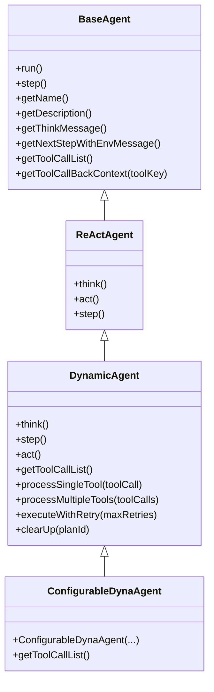
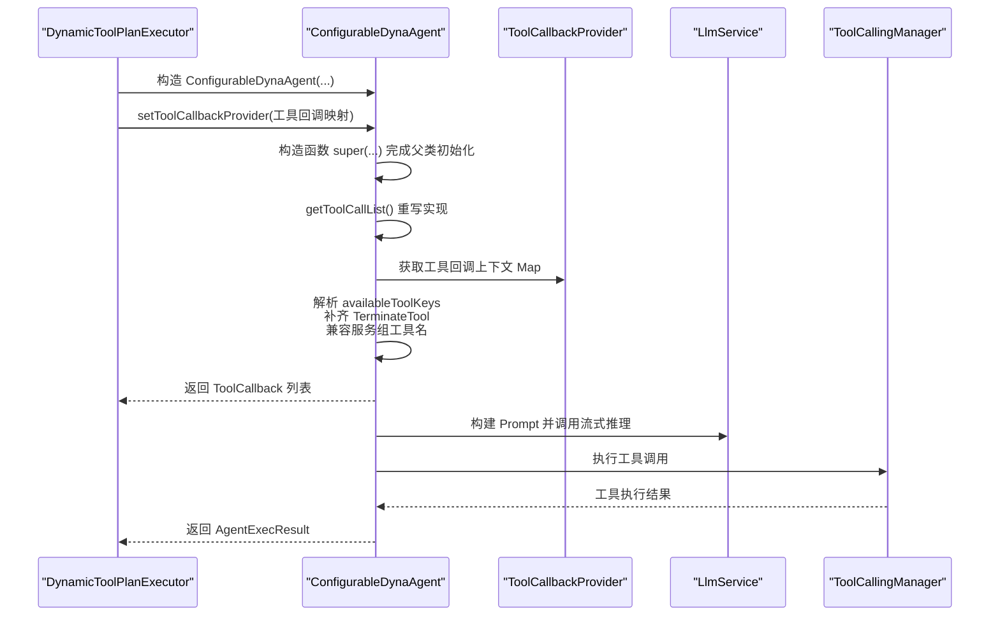
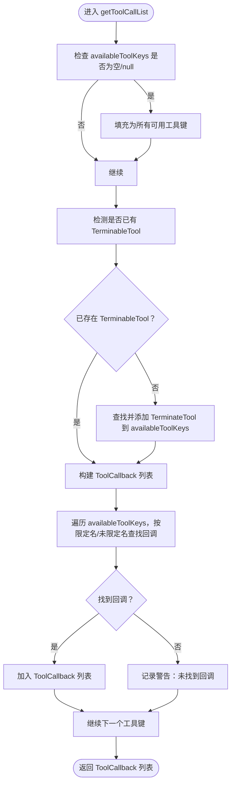
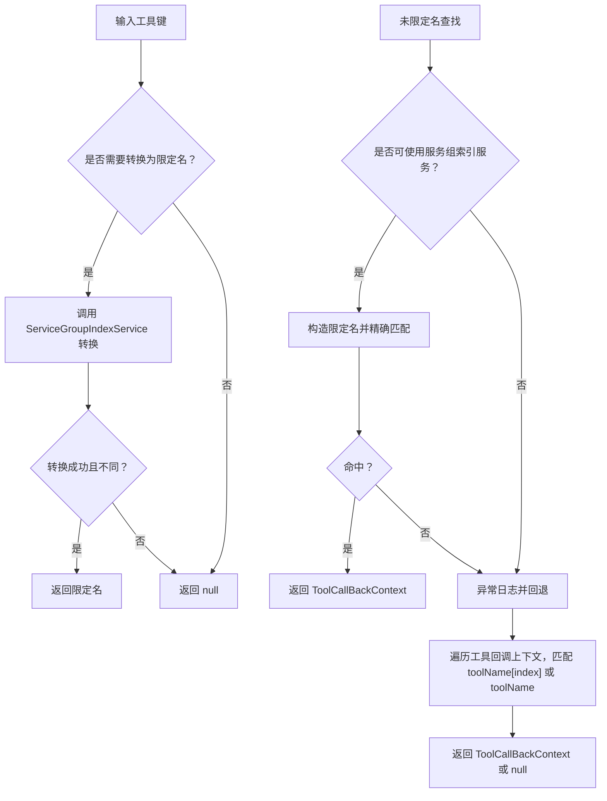
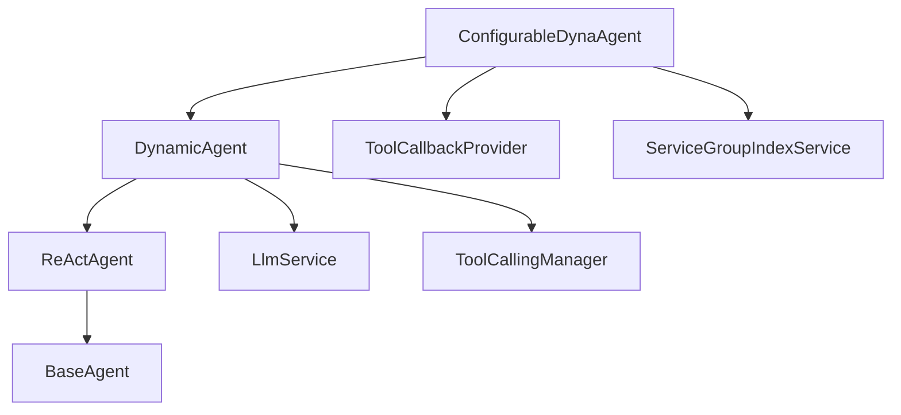

# 继承机制

<cite>
**本文引用的文件列表**
- [ConfigurableDynaAgent.java](file://src/main/java/com/alibaba/cloud/ai/lynxe/agent/ConfigurableDynaAgent.java)
- [DynamicAgent.java](file://src/main/java/com/alibaba/cloud/ai/lynxe/agent/DynamicAgent.java)
- [ReActAgent.java](file://src/main/java/com/alibaba/cloud/ai/lynxe/agent/ReActAgent.java)
- [BaseAgent.java](file://src/main/java/com/alibaba/cloud/ai/lynxe/agent/BaseAgent.java)
- [DynamicToolPlanExecutor.java](file://src/main/java/com/alibaba/cloud/ai/lynxe/runtime/executor/DynamicToolPlanExecutor.java)
</cite>

## 目录
1. [引言](#引言)
2. [项目结构与继承层次](#项目结构与继承层次)
3. [核心组件与职责](#核心组件与职责)
4. [架构总览](#架构总览)
5. [详细组件分析](#详细组件分析)
6. [依赖关系分析](#依赖关系分析)
7. [性能与可维护性考量](#性能与可维护性考量)
8. [故障排查指南](#故障排查指南)
9. [结论](#结论)

## 引言
本文件围绕 ConfigurableDynaAgent 的继承机制展开，系统阐述其如何继承 DynamicAgent 的全部核心能力，并通过重写关键方法（尤其是工具回调列表生成）实现“按需配置”的动态工具集管理。文档同时给出类关系图、方法调用时序图与算法流程图，帮助开发者快速理解继承链路、重写策略、关键注意事项与最佳实践。

## 项目结构与继承层次
ConfigurableDynaAgent 位于 agent 包中，直接继承自 DynamicAgent；DynamicAgent 继承自 ReActAgent；ReActAgent 继承自抽象基类 BaseAgent。该三层继承链提供了从通用智能体框架到具体动态推理执行器再到可配置工具集的完整能力拼装。

图表来源
- [BaseAgent.java](file://src/main/java/com/alibaba/cloud/ai/lynxe/agent/BaseAgent.java#L73-L120)
- [ReActAgent.java](file://src/main/java/com/alibaba/cloud/ai/lynxe/agent/ReActAgent.java#L29-L95)
- [DynamicAgent.java](file://src/main/java/com/alibaba/cloud/ai/lynxe/agent/DynamicAgent.java#L78-L1581)
- [ConfigurableDynaAgent.java](file://src/main/java/com/alibaba/cloud/ai/lynxe/agent/ConfigurableDynaAgent.java#L50-L120)

章节来源
- [BaseAgent.java](file://src/main/java/com/alibaba/cloud/ai/lynxe/agent/BaseAgent.java#L73-L120)
- [ReActAgent.java](file://src/main/java/com/alibaba/cloud/ai/lynxe/agent/ReActAgent.java#L29-L95)
- [DynamicAgent.java](file://src/main/java/com/alibaba/cloud/ai/lynxe/agent/DynamicAgent.java#L78-L1581)
- [ConfigurableDynaAgent.java](file://src/main/java/com/alibaba/cloud/ai/lynxe/agent/ConfigurableDynaAgent.java#L50-L120)

## 核心组件与职责
- BaseAgent：定义智能体生命周期、状态机与基础运行框架，提供 run()/step() 的主循环与异常兜底处理。
- ReActAgent：在 BaseAgent 基础上引入“思考-行动”交替模式，要求子类实现 think()/act()。
- DynamicAgent：实现 ReActAgent 的 think()/act()，内置 LLM 推理、工具选择、重试与错误恢复逻辑，并提供 getToolCallList() 的默认实现。
- ConfigurableDynaAgent：在继承 DynamicAgent 的基础上，重写 getToolCallList()，以支持运行时按需传入工具键集合，自动补齐 TerminateTool 并兼容服务组工具名格式。

章节来源
- [BaseAgent.java](file://src/main/java/com/alibaba/cloud/ai/lynxe/agent/BaseAgent.java#L241-L331)
- [ReActAgent.java](file://src/main/java/com/alibaba/cloud/ai/lynxe/agent/ReActAgent.java#L57-L95)
- [DynamicAgent.java](file://src/main/java/com/alibaba/cloud/ai/lynxe/agent/DynamicAgent.java#L1393-L1409)
- [ConfigurableDynaAgent.java](file://src/main/java/com/alibaba/cloud/ai/lynxe/agent/ConfigurableDynaAgent.java#L96-L198)

## 架构总览
下图展示了从计划执行器到可配置动态代理人的调用链，以及 ConfigurableDynaAgent 在运行期如何注入工具回调上下文与工具键集合。

图表来源
- [DynamicToolPlanExecutor.java](file://src/main/java/com/alibaba/cloud/ai/lynxe/runtime/executor/DynamicToolPlanExecutor.java#L149-L179)
- [ConfigurableDynaAgent.java](file://src/main/java/com/alibaba/cloud/ai/lynxe/agent/ConfigurableDynaAgent.java#L74-L88)
- [ConfigurableDynaAgent.java](file://src/main/java/com/alibaba/cloud/ai/lynxe/agent/ConfigurableDynaAgent.java#L96-L198)
- [DynamicAgent.java](file://src/main/java/com/alibaba/cloud/ai/lynxe/agent/DynamicAgent.java#L337-L366)

章节来源
- [DynamicToolPlanExecutor.java](file://src/main/java/com/alibaba/cloud/ai/lynxe/runtime/executor/DynamicToolPlanExecutor.java#L149-L179)
- [ConfigurableDynaAgent.java](file://src/main/java/com/alibaba/cloud/ai/lynxe/agent/ConfigurableDynaAgent.java#L74-L88)
- [ConfigurableDynaAgent.java](file://src/main/java/com/alibaba/cloud/ai/lynxe/agent/ConfigurableDynaAgent.java#L96-L198)
- [DynamicAgent.java](file://src/main/java/com/alibaba/cloud/ai/lynxe/agent/DynamicAgent.java#L337-L366)

## 详细组件分析

### ConfigurableDynaAgent 继承与构造
- 继承关系：ConfigurableDynaAgent extends DynamicAgent，从而获得完整的推理-行动循环、工具调用、重试与错误恢复等能力。
- 构造函数参数传递：
  - 调用父类 DynamicAgent 的构造函数，完成 LLM、记录器、属性、模型名、流式处理器、执行步骤、分发器、事件发布器、中断助手、对象映射、并行工具执行、内存服务、对话记忆限制、服务组索引等依赖的注入。
  - 同时保存 ServiceGroupIndexService 实例，用于工具名格式转换与服务组匹配。
- 关键注意点：
  - 必须先调用 super(...) 完成父类初始化，再设置自身字段（如 serviceGroupIndexService），避免父类依赖未就绪导致空指针或行为异常。
  - availableToolKeys 可为空，表示“全量可用工具”，后续在 getToolCallList() 中补齐。

章节来源
- [ConfigurableDynaAgent.java](file://src/main/java/com/alibaba/cloud/ai/lynxe/agent/ConfigurableDynaAgent.java#L74-L88)
- [DynamicAgent.java](file://src/main/java/com/alibaba/cloud/ai/lynxe/agent/DynamicAgent.java#L166-L197)

### 方法重写策略：getToolCallList
ConfigurableDynaAgent 对 DynamicAgent 的 getToolCallList 进行了重写，以满足“按需工具集”的需求。重写目标与实现要点如下：

- 目标
  - 当 availableToolKeys 为空或 null 时，自动填充所有可用工具键。
  - 确保至少包含一个可终止工具（优先识别 TerminableTool，否则补齐 TerminateTool）。
  - 兼容服务组工具名格式（serviceGroup.toolName → toolName*index*），并回退到未限定名称匹配。

- 实现流程
  1) 若 availableToolKeys 为空，则将其设为工具回调上下文中所有键的集合。
  2) 遍历 availableToolKeys，尝试解析为“限定名”（含服务组索引），若失败则按“未限定名”查找。
  3) 检测是否存在 TerminableTool；若不存在，则在工具回调上下文中查找 TerminateTool 并加入 availableToolKeys。
  4) 逐个构建 ToolCallback 列表，若找不到对应回调则记录警告。
  5) 返回最终 ToolCallback 列表。

图表来源
- [ConfigurableDynaAgent.java](file://src/main/java/com/alibaba/cloud/ai/lynxe/agent/ConfigurableDynaAgent.java#L96-L198)

章节来源
- [ConfigurableDynaAgent.java](file://src/main/java/com/alibaba/cloud/ai/lynxe/agent/ConfigurableDynaAgent.java#L96-L198)

### 工具名解析与兼容性辅助方法
为实现服务组工具名的兼容解析，ConfigurableDynaAgent 提供了两个辅助方法：

- convertServiceGroupToolNameToQualifiedKey
  - 将 serviceGroup.toolName 转换为 toolName*index* 的限定名格式；若无需转换或转换失败则返回 null。
- findToolByUnqualifiedName
  - 支持两种查找路径：
    - 通过 ServiceGroupIndexService 构造限定名后精确匹配；
    - 回退到遍历工具回调上下文，匹配“toolName[index]”或“toolName”格式。

图表来源
- [ConfigurableDynaAgent.java](file://src/main/java/com/alibaba/cloud/ai/lynxe/agent/ConfigurableDynaAgent.java#L207-L226)
- [ConfigurableDynaAgent.java](file://src/main/java/com/alibaba/cloud/ai/lynxe/agent/ConfigurableDynaAgent.java#L236-L282)
- [ConfigurableDynaAgent.java](file://src/main/java/com/alibaba/cloud/ai/lynxe/agent/ConfigurableDynaAgent.java#L285-L339)

章节来源
- [ConfigurableDynaAgent.java](file://src/main/java/com/alibaba/cloud/ai/lynxe/agent/ConfigurableDynaAgent.java#L207-L226)
- [ConfigurableDynaAgent.java](file://src/main/java/com/alibaba/cloud/ai/lynxe/agent/ConfigurableDynaAgent.java#L236-L282)
- [ConfigurableDynaAgent.java](file://src/main/java/com/alibaba/cloud/ai/lynxe/agent/ConfigurableDynaAgent.java#L285-L339)

### 继承带来的优势
- 代码复用：ConfigurableDynaAgent 复用 DynamicAgent 的推理循环、重试机制、工具执行与错误恢复逻辑，无需重复实现。
- 功能扩展：通过重写 getToolCallList，实现“按需工具集”与“自动补齐终止工具”的增强能力。
- 维护性提升：变更集中在 ConfigurableDynaAgent 的重写方法中，不影响父类核心行为；新增兼容性解析方法保持低耦合。

章节来源
- [DynamicAgent.java](file://src/main/java/com/alibaba/cloud/ai/lynxe/agent/DynamicAgent.java#L199-L484)
- [DynamicAgent.java](file://src/main/java/com/alibaba/cloud/ai/lynxe/agent/DynamicAgent.java#L605-L766)
- [ConfigurableDynaAgent.java](file://src/main/java/com/alibaba/cloud/ai/lynxe/agent/ConfigurableDynaAgent.java#L96-L198)

### 关键注意事项
- super() 调用顺序：必须在设置自身字段之前完成父类构造，确保父类依赖（如 objectMapper、工具回调提供者、服务组索引服务等）已就绪。
- 字段访问权限：availableToolKeys 在父类中为受保护字段，ConfigurableDynaAgent 可直接读写；但应遵循“只在必要时修改”的原则，避免破坏父类一致性。
- 方法覆盖规则：重写 getToolCallList 时，需保证返回值与父类约定一致（ToolCallback 列表），并维持工具回调上下文的一致性。
- 兼容性与健壮性：当工具回调缺失或工具名不匹配时，应记录日志并返回合理提示，避免中断执行流程。

章节来源
- [ConfigurableDynaAgent.java](file://src/main/java/com/alibaba/cloud/ai/lynxe/agent/ConfigurableDynaAgent.java#L74-L88)
- [ConfigurableDynaAgent.java](file://src/main/java/com/alibaba/cloud/ai/lynxe/agent/ConfigurableDynaAgent.java#L96-L198)
- [DynamicAgent.java](file://src/main/java/com/alibaba/cloud/ai/lynxe/agent/DynamicAgent.java#L1393-L1409)

### 最佳实践建议
- 扩展优于修改：若仅需改变工具集选择策略，优先重写 getToolCallList，而非复制父类实现。
- 明确边界：在重写方法中明确区分“空工具集”“未指定工具集”“指定工具集”的处理差异。
- 兼容优先：保留对旧版工具名格式的支持，逐步迁移至限定名格式。
- 渐进增强：先实现基本工具集过滤，再逐步增加服务组索引与回退查找逻辑，确保每一步都可测试与验证。

章节来源
- [ConfigurableDynaAgent.java](file://src/main/java/com/alibaba/cloud/ai/lynxe/agent/ConfigurableDynaAgent.java#L96-L198)
- [DynamicToolPlanExecutor.java](file://src/main/java/com/alibaba/cloud/ai/lynxe/runtime/executor/DynamicToolPlanExecutor.java#L149-L179)

## 依赖关系分析
ConfigurableDynaAgent 的关键依赖包括：
- 父类 DynamicAgent：提供推理-行动循环、工具执行、重试与错误恢复。
- 工具回调提供者：通过 ToolCallbackProvider 注入工具回调上下文。
- 服务组索引服务：用于工具名限定化与服务组匹配。
- LLM 与工具调用管理器：用于推理与工具执行。

图表来源
- [ConfigurableDynaAgent.java](file://src/main/java/com/alibaba/cloud/ai/lynxe/agent/ConfigurableDynaAgent.java#L50-L120)
- [DynamicAgent.java](file://src/main/java/com/alibaba/cloud/ai/lynxe/agent/DynamicAgent.java#L78-L1581)
- [ReActAgent.java](file://src/main/java/com/alibaba/cloud/ai/lynxe/agent/ReActAgent.java#L29-L95)
- [BaseAgent.java](file://src/main/java/com/alibaba/cloud/ai/lynxe/agent/BaseAgent.java#L73-L120)

章节来源
- [ConfigurableDynaAgent.java](file://src/main/java/com/alibaba/cloud/ai/lynxe/agent/ConfigurableDynaAgent.java#L50-L120)
- [DynamicAgent.java](file://src/main/java/com/alibaba/cloud/ai/lynxe/agent/DynamicAgent.java#L78-L1581)
- [ReActAgent.java](file://src/main/java/com/alibaba/cloud/ai/lynxe/agent/ReActAgent.java#L29-L95)
- [BaseAgent.java](file://src/main/java/com/alibaba/cloud/ai/lynxe/agent/BaseAgent.java#L73-L120)

## 性能与可维护性考量
- 性能
  - 工具回调查找采用“限定名优先 + 服务组索引 + 回退遍历”的策略，减少不必要的全量扫描。
  - 流式响应与工具执行分离，避免阻塞主线程。
- 可维护性
  - 将工具名解析逻辑拆分为独立方法，便于单元测试与演进。
  - 通过接口注入 ToolCallbackProvider，降低耦合并提升可替换性。

[本节为通用指导，无需列出具体文件来源]

## 故障排查指南
- 工具回调缺失
  - 现象：日志出现“未找到回调”的警告。
  - 排查：确认工具键是否正确（限定名 vs 未限定名）、服务组索引是否生效、工具回调上下文是否正确注入。
- 无工具被选中
  - 现象：多次重试后仍无工具调用。
  - 排查：检查 availableToolKeys 是否为空或为空集合；确认是否自动补齐了 TerminateTool；查看早停阈值与重试策略。
- 终止逻辑异常
  - 现象：无法正常结束执行。
  - 排查：确认 TerminableTool/TerminateTool 是否存在于工具集中；检查 canTerminate 与 terminate 流程。

章节来源
- [ConfigurableDynaAgent.java](file://src/main/java/com/alibaba/cloud/ai/lynxe/agent/ConfigurableDynaAgent.java#L96-L198)
- [DynamicAgent.java](file://src/main/java/com/alibaba/cloud/ai/lynxe/agent/DynamicAgent.java#L199-L484)
- [DynamicAgent.java](file://src/main/java/com/alibaba/cloud/ai/lynxe/agent/DynamicAgent.java#L605-L766)

## 结论
ConfigurableDynaAgent 通过继承 DynamicAgent 的核心能力，结合对 getToolCallList 的精准重写，实现了“按需工具集”的灵活配置与自动终止保障。配合服务组工具名解析与兼容查找，既保证了向后兼容，又提升了工具选择的灵活性与可维护性。遵循“扩展优于修改”的原则，开发者可在不破坏父类稳定性的前提下，持续增强工具集管理策略。