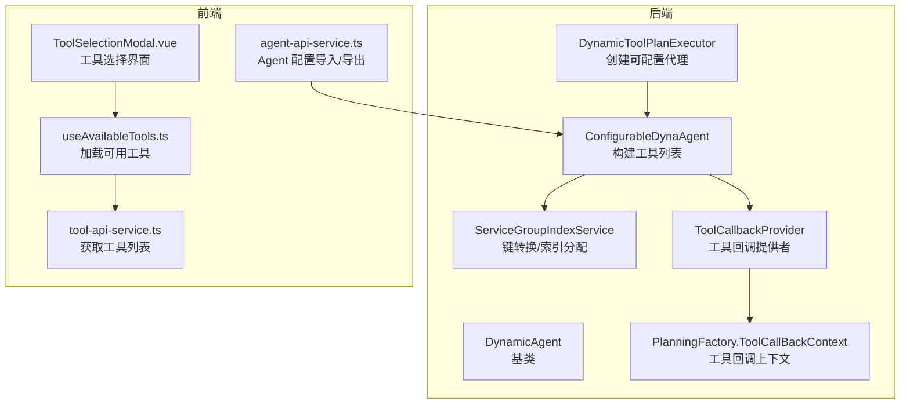
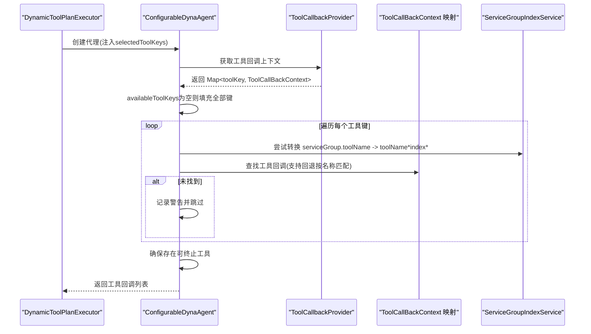
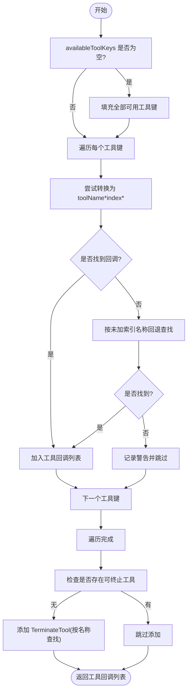
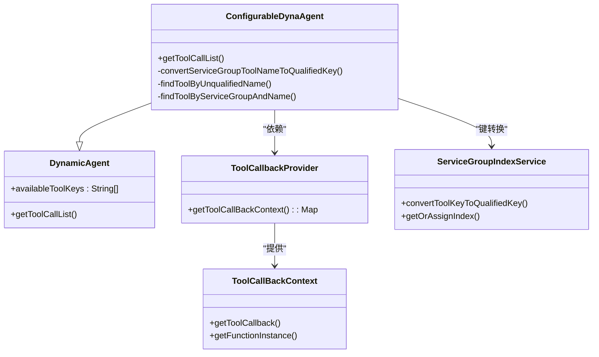

# 配置覆盖规则

<cite>
**本文引用的文件**
- [ConfigurableDynaAgent.java](file://src/main/java/com/alibaba/cloud/ai/lynxe/agent/ConfigurableDynaAgent.java)
- [DynamicAgent.java](file://src/main/java/com/alibaba/cloud/ai/lynxe/agent/DynamicAgent.java)
- [ServiceGroupIndexService.java](file://src/main/java/com/alibaba/cloud/ai/lynxe/runtime/service/ServiceGroupIndexService.java)
- [PlanningFactory.java](file://src/main/java/com/alibaba/cloud/ai/lynxe/planning/PlanningFactory.java)
- [ToolCallbackProvider.java](file://src/main/java/com/alibaba/cloud/ai/lynxe/agent/ToolCallbackProvider.java)
- [DynamicToolPlanExecutor.java](file://src/main/java/com/alibaba/cloud/ai/lynxe/runtime/executor/DynamicToolPlanExecutor.java)
- [application.yml](file://src/main/resources/application.yml)
- [useAvailableTools.ts](file://ui-vue3/src/composables/useAvailableTools.ts)
- [ToolSelectionModal.vue](file://ui-vue3/src/components/tool-selection-modal/ToolSelectionModal.vue)
- [tool-api-service.ts](file://ui-vue3/src/api/tool-api-service.ts)
- [agent-api-service.ts](file://ui-vue3/src/api/agent-api-service.ts)
</cite>

## 目录
1. [简介](#简介)
2. [项目结构与定位](#项目结构与定位)
3. [核心组件](#核心组件)
4. [架构总览](#架构总览)
5. [详细组件分析](#详细组件分析)
6. [依赖关系分析](#依赖关系分析)
7. [性能与可扩展性](#性能与可扩展性)
8. [故障排查指南](#故障排查指南)
9. [结论](#结论)
10. [附录：配置覆盖最佳实践](#附录配置覆盖最佳实践)

## 简介
本文件系统化阐述 ConfigurableDynaAgent 的“可用工具键”配置覆盖规则，重点覆盖以下主题：
- availableToolKeys 为 null 或空列表时的默认行为
- 工具列表构建流程、工具键转换与匹配策略
- 配置覆盖优先级与动态行为调整
- 配置验证与错误处理机制（日志与异常）
- 前后端协同的配置示例与常见问题规避

## 项目结构与定位
- 后端核心：ConfigurableDynaAgent 继承自 DynamicAgent，负责在运行期根据 availableToolKeys 构建工具回调集合，并确保终止工具的存在性。
- 关键服务：ServiceGroupIndexService 提供服务组到索引的映射与工具键格式转换，支持前端传入的 serviceGroup.toolName 到后端执行格式 toolName*index* 的转换。
- 执行器：DynamicToolPlanExecutor 在计划步骤中创建 ConfigurableDynaAgent 并注入 selectedToolKeys。
- 前端：UI 提供工具选择与导出导入能力，便于用户在界面层进行配置覆盖。

图表来源
- [ConfigurableDynaAgent.java](file://src/main/java/com/alibaba/cloud/ai/lynxe/agent/ConfigurableDynaAgent.java#L91-L199)
- [DynamicAgent.java](file://src/main/java/com/alibaba/cloud/ai/lynxe/agent/DynamicAgent.java#L167-L198)
- [ServiceGroupIndexService.java](file://src/main/java/com/alibaba/cloud/ai/lynxe/runtime/service/ServiceGroupIndexService.java#L105-L130)
- [PlanningFactory.java](file://src/main/java/com/alibaba/cloud/ai/lynxe/planning/PlanningFactory.java#L219-L241)
- [ToolCallbackProvider.java](file://src/main/java/com/alibaba/cloud/ai/lynxe/agent/ToolCallbackProvider.java#L22-L26)
- [DynamicToolPlanExecutor.java](file://src/main/java/com/alibaba/cloud/ai/lynxe/runtime/executor/DynamicToolPlanExecutor.java#L150-L162)
- [useAvailableTools.ts](file://ui-vue3/src/composables/useAvailableTools.ts#L1-L104)
- [ToolSelectionModal.vue](file://ui-vue3/src/components/tool-selection-modal/ToolSelectionModal.vue#L1-L41)
- [tool-api-service.ts](file://ui-vue3/src/api/tool-api-service.ts#L1-L52)
- [agent-api-service.ts](file://ui-vue3/src/api/agent-api-service.ts#L104-L142)

章节来源
- [ConfigurableDynaAgent.java](file://src/main/java/com/alibaba/cloud/ai/lynxe/agent/ConfigurableDynaAgent.java#L91-L199)
- [DynamicToolPlanExecutor.java](file://src/main/java/com/alibaba/cloud/ai/lynxe/runtime/executor/DynamicToolPlanExecutor.java#L150-L162)

## 核心组件
- ConfigurableDynaAgent：重写工具回调列表构建逻辑，支持 availableToolKeys 为空时回退到全部可用工具；保证至少存在一个可终止工具；支持服务组工具键转换与回退查找。
- ServiceGroupIndexService：负责将 serviceGroup.toolName 转换为后端执行所需的 toolName*index* 格式，并维护服务组索引缓存。
- DynamicAgent：基类，保存 availableToolKeys 并在构造时处理 null/空列表；提供通用工具调用流程。
- PlanningFactory.ToolCallBackContext：封装工具回调与函数实例，作为工具映射的核心载体。
- DynamicToolPlanExecutor：在执行计划中创建 ConfigurableDynaAgent，并将 selectedToolKeys 注入。

章节来源
- [ConfigurableDynaAgent.java](file://src/main/java/com/alibaba/cloud/ai/lynxe/agent/ConfigurableDynaAgent.java#L91-L199)
- [ServiceGroupIndexService.java](file://src/main/java/com/alibaba/cloud/ai/lynxe/runtime/service/ServiceGroupIndexService.java#L105-L130)
- [DynamicAgent.java](file://src/main/java/com/alibaba/cloud/ai/lynxe/agent/DynamicAgent.java#L167-L198)
- [PlanningFactory.java](file://src/main/java/com/alibaba/cloud/ai/lynxe/planning/PlanningFactory.java#L219-L241)
- [DynamicToolPlanExecutor.java](file://src/main/java/com/alibaba/cloud/ai/lynxe/runtime/executor/DynamicToolPlanExecutor.java#L150-L162)

## 架构总览
ConfigurableDynaAgent 的工具选择链路如下：
- 输入：availableToolKeys（可为 null/空列表）
- 处理：
  - 若为空，则回填为全部可用工具键
  - 对每个键尝试转换为后端执行键（toolName*index*）
  - 支持按未加索引名称回退匹配
  - 确保存在可终止工具（TerminateTool）
- 输出：工具回调列表

图表来源
- [DynamicToolPlanExecutor.java](file://src/main/java/com/alibaba/cloud/ai/lynxe/runtime/executor/DynamicToolPlanExecutor.java#L150-L162)
- [ConfigurableDynaAgent.java](file://src/main/java/com/alibaba/cloud/ai/lynxe/agent/ConfigurableDynaAgent.java#L91-L199)
- [ServiceGroupIndexService.java](file://src/main/java/com/alibaba/cloud/ai/lynxe/runtime/service/ServiceGroupIndexService.java#L105-L130)
- [PlanningFactory.java](file://src/main/java/com/alibaba/cloud/ai/lynxe/planning/PlanningFactory.java#L219-L241)

## 详细组件分析

### availableToolKeys 的继承与覆盖机制
- 继承：DynamicAgent 在构造时对 availableToolKeys 进行空值处理，确保内部持有非空列表。
- 覆盖：ConfigurableDynaAgent 在 getToolCallList 中：
  - 当 availableToolKeys 为 null 或空时，回填为全部可用工具键
  - 逐个处理工具键，支持服务组键转换与回退匹配
  - 确保至少包含一个可终止工具（TerminateTool）

章节来源
- [DynamicAgent.java](file://src/main/java/com/alibaba/cloud/ai/lynxe/agent/DynamicAgent.java#L167-L198)
- [ConfigurableDynaAgent.java](file://src/main/java/com/alibaba/cloud/ai/lynxe/agent/ConfigurableDynaAgent.java#L91-L199)

### 工具列表构建流程与键转换
- 键转换：
  - 将 serviceGroup.toolName 转换为 toolName*index*，使用 ServiceGroupIndexService 分配/获取索引
  - 若转换失败或无需转换，保留原键
- 匹配策略：
  - 先尝试精确匹配（含索引的 qualified key）
  - 若失败，按未加索引名称回退匹配（支持 "toolName" 或 "toolName[index]" 形式）
  - 通过 ServiceGroupIndexService 辅助构造期望的 qualified key 再比对
- 可终止工具保障：
  - 若未发现任何可终止工具，尝试按未加索引名称查找并添加 TerminateTool
  - 若仍找不到，记录警告但不影响其他工具的加载

图表来源
- [ConfigurableDynaAgent.java](file://src/main/java/com/alibaba/cloud/ai/lynxe/agent/ConfigurableDynaAgent.java#L91-L199)
- [ServiceGroupIndexService.java](file://src/main/java/com/alibaba/cloud/ai/lynxe/runtime/service/ServiceGroupIndexService.java#L105-L130)

章节来源
- [ConfigurableDynaAgent.java](file://src/main/java/com/alibaba/cloud/ai/lynxe/agent/ConfigurableDynaAgent.java#L91-L199)
- [ServiceGroupIndexService.java](file://src/main/java/com/alibaba/cloud/ai/lynxe/runtime/service/ServiceGroupIndexService.java#L105-L130)

### 配置覆盖优先级与动态行为
- 优先级顺序（从高到低）：
  1) 运行期注入的 selectedToolKeys（来自计划执行器）
  2) ConfigurableDynaAgent 的 availableToolKeys（若为空则回填全部）
  3) 工具注册表中的全部可用工具（仅在 availableToolKeys 为空时生效）
- 动态行为：
  - 通过前端工具选择界面导出/导入 Agent 配置，可直接覆盖 availableToolKeys
  - 前端以 serviceGroup.toolName 形式提交，后端通过 ServiceGroupIndexService 转换为执行键

章节来源
- [DynamicToolPlanExecutor.java](file://src/main/java/com/alibaba/cloud/ai/lynxe/runtime/executor/DynamicToolPlanExecutor.java#L150-L162)
- [ConfigurableDynaAgent.java](file://src/main/java/com/alibaba/cloud/ai/lynxe/agent/ConfigurableDynaAgent.java#L91-L199)
- [agent-api-service.ts](file://ui-vue3/src/api/agent-api-service.ts#L104-L142)

### 配置验证与错误处理
- 日志策略：
  - 成功加载工具时输出信息级别日志
  - 无法找到工具回调时输出警告
  - TerminateTool 缺失时输出警告
  - 键转换失败时输出调试级别日志
- 异常处理：
  - 工具回调上下文缺失时，记录错误并继续执行后续步骤
  - ServiceGroupIndexService 转换异常时捕获并回退到原键

章节来源
- [ConfigurableDynaAgent.java](file://src/main/java/com/alibaba/cloud/ai/lynxe/agent/ConfigurableDynaAgent.java#L138-L199)
- [DynamicAgent.java](file://src/main/java/com/alibaba/cloud/ai/lynxe/agent/DynamicAgent.java#L673-L697)
- [application.yml](file://src/main/resources/application.yml#L48-L59)

### 前后端协同与配置示例
- 前端工具选择：
  - 使用 useAvailableTools.ts 加载可用工具，ToolSelectionModal.vue 提供搜索与排序
  - tool-api-service.ts 用于拉取工具清单
- Agent 配置导入/导出：
  - agent-api-service.ts 支持导出 Agent 配置为 JSON，parseAgentFromJson 进行基本校验
- 示例场景（路径引用，不展示具体代码内容）：
  - 场景一：availableToolKeys 为空
    - 触发路径：[ConfigurableDynaAgent.java](file://src/main/java/com/alibaba/cloud/ai/lynxe/agent/ConfigurableDynaAgent.java#L91-L110)
  - 场景二：工具键为 serviceGroup.toolName
    - 触发路径：[ServiceGroupIndexService.java](file://src/main/java/com/alibaba/cloud/ai/lynxe/runtime/service/ServiceGroupIndexService.java#L105-L130)
  - 场景三：工具键为未加索引名称
    - 触发路径：[ConfigurableDynaAgent.java](file://src/main/java/com/alibaba/cloud/ai/lynxe/agent/ConfigurableDynaAgent.java#L237-L283)
  - 场景四：缺少可终止工具
    - 触发路径：[ConfigurableDynaAgent.java](file://src/main/java/com/alibaba/cloud/ai/lynxe/agent/ConfigurableDynaAgent.java#L138-L161)

章节来源
- [useAvailableTools.ts](file://ui-vue3/src/composables/useAvailableTools.ts#L1-L104)
- [ToolSelectionModal.vue](file://ui-vue3/src/components/tool-selection-modal/ToolSelectionModal.vue#L1-L41)
- [tool-api-service.ts](file://ui-vue3/src/api/tool-api-service.ts#L1-L52)
- [agent-api-service.ts](file://ui-vue3/src/api/agent-api-service.ts#L104-L142)
- [ConfigurableDynaAgent.java](file://src/main/java/com/alibaba/cloud/ai/lynxe/agent/ConfigurableDynaAgent.java#L91-L199)
- [ServiceGroupIndexService.java](file://src/main/java/com/alibaba/cloud/ai/lynxe/runtime/service/ServiceGroupIndexService.java#L105-L130)

## 依赖关系分析
- ConfigurableDynaAgent 依赖：
  - ToolCallbackProvider：提供工具回调上下文映射
  - ServiceGroupIndexService：键转换与索引分配
  - PlanningFactory.ToolCallBackContext：工具回调与函数实例封装
- DynamicToolPlanExecutor 依赖：
  - 将 selectedToolKeys 注入 ConfigurableDynaAgent，形成“运行期覆盖”

图表来源
- [DynamicAgent.java](file://src/main/java/com/alibaba/cloud/ai/lynxe/agent/DynamicAgent.java#L167-L198)
- [ConfigurableDynaAgent.java](file://src/main/java/com/alibaba/cloud/ai/lynxe/agent/ConfigurableDynaAgent.java#L91-L199)
- [ToolCallbackProvider.java](file://src/main/java/com/alibaba/cloud/ai/lynxe/agent/ToolCallbackProvider.java#L22-L26)
- [PlanningFactory.java](file://src/main/java/com/alibaba/cloud/ai/lynxe/planning/PlanningFactory.java#L219-L241)
- [ServiceGroupIndexService.java](file://src/main/java/com/alibaba/cloud/ai/lynxe/runtime/service/ServiceGroupIndexService.java#L105-L130)

章节来源
- [DynamicAgent.java](file://src/main/java/com/alibaba/cloud/ai/lynxe/agent/DynamicAgent.java#L167-L198)
- [ConfigurableDynaAgent.java](file://src/main/java/com/alibaba/cloud/ai/lynxe/agent/ConfigurableDynaAgent.java#L91-L199)
- [ToolCallbackProvider.java](file://src/main/java/com/alibaba/cloud/ai/lynxe/agent/ToolCallbackProvider.java#L22-L26)
- [PlanningFactory.java](file://src/main/java/com/alibaba/cloud/ai/lynxe/planning/PlanningFactory.java#L219-L241)
- [ServiceGroupIndexService.java](file://src/main/java/com/alibaba/cloud/ai/lynxe/runtime/service/ServiceGroupIndexService.java#L105-L130)

## 性能与可扩展性
- 键转换与匹配：
  - 优先使用 ServiceGroupIndexService 的索引映射，减少全量扫描
  - 回退匹配采用“名称前缀 + 索引括号”判断，复杂度与工具数量线性相关
- 缓存与并发：
  - ServiceGroupIndexService 使用并发安全的映射与原子计数，适合多线程环境
- 建议：
  - 控制 availableToolKeys 数量，避免过多工具导致匹配开销增大
  - 合理命名工具键，减少回退匹配概率

[本节为通用建议，不涉及具体文件分析]

## 故障排查指南
- 症状：工具回调缺失
  - 排查要点：确认工具键是否正确（含服务组）、是否已转换为后端执行键
  - 参考路径：[ConfigurableDynaAgent.java](file://src/main/java/com/alibaba/cloud/ai/lynxe/agent/ConfigurableDynaAgent.java#L189-L195)
- 症状：Agent 无法终止
  - 排查要点：确认是否存在可终止工具；若不存在，检查 TerminateTool 是否注册
  - 参考路径：[ConfigurableDynaAgent.java](file://src/main/java/com/alibaba/cloud/ai/lynxe/agent/ConfigurableDynaAgent.java#L138-L161)
- 症状：日志频繁出现警告
  - 排查要点：检查 availableToolKeys 是否包含无效键；核对工具注册状态
  - 参考路径：[application.yml](file://src/main/resources/application.yml#L48-L59)

章节来源
- [ConfigurableDynaAgent.java](file://src/main/java/com/alibaba/cloud/ai/lynxe/agent/ConfigurableDynaAgent.java#L138-L195)
- [application.yml](file://src/main/resources/application.yml#L48-L59)

## 结论
ConfigurableDynaAgent 通过 availableToolKeys 实现灵活的工具集覆盖，结合 ServiceGroupIndexService 的键转换与回退匹配，既保证了向后兼容，又支持运行期动态调整。遵循本文提供的优先级与最佳实践，可有效提升系统的可配置性与稳定性。

[本节为总结性内容，不涉及具体文件分析]

## 附录：配置覆盖最佳实践
- 设计原则
  - 明确覆盖层级：运行期 selectedToolKeys > 配置 availableToolKeys > 默认全部工具
  - 命名规范：优先使用 serviceGroup.toolName，便于后端统一转换
  - 安全兜底：始终确保存在可终止工具，避免无限循环
- 常见错误与规避
  - 键格式错误：确保工具键与注册一致，必要时通过回退匹配辅助定位
  - 工具缺失：在导入配置前检查工具注册状态，避免运行时报错
  - 过多工具：控制工具集规模，降低匹配与初始化成本
- 前端操作建议
  - 使用工具选择界面进行筛选与排序，导出配置后再导入，确保键格式正确
  - 导入前先校验关键字段（如名称、描述），避免格式错误导致解析失败

[本节为通用建议，不涉及具体文件分析]