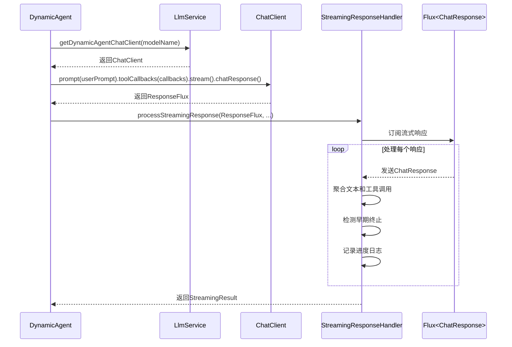

# DynamicAgent构造函数

<cite>
**本文档引用的文件**   
- [DynamicAgent.java](file://src/main/java/com/alibaba/cloud/ai/lynxe/agent/DynamicAgent.java)
- [BaseAgent.java](file://src/main/java/com/alibaba/cloud/ai/lynxe/agent/BaseAgent.java)
- [ReActAgent.java](file://src/main/java/com/alibaba/cloud/ai/lynxe/agent/ReActAgent.java)
- [LynxeProperties.java](file://src/main/java/com/alibaba/cloud/ai/lynxe/config/LynxeProperties.java)
- [UserInputService.java](file://src/main/java/com/alibaba/cloud/ai/lynxe/runtime/service/UserInputService.java)
- [StreamingResponseHandler.java](file://src/main/java/com/alibaba/cloud/ai/lynxe/llm/StreamingResponseHandler.java)
- [ToolCallingManagerConfiguration.java](file://src/main/java/com/alibaba/cloud/ai/lynxe/config/ToolCallingManagerConfiguration.java)
- [ConfigurableDynaAgent.java](file://src/main/java/com/alibaba/cloud/ai/lynxe/agent/ConfigurableDynaAgent.java)
</cite>

## 目录
1. [DynamicAgent构造函数](#dynamicagent构造函数)
2. [核心依赖注入](#核心依赖注入)
3. [代理元数据参数](#代理元数据参数)
4. [工具权限与服务协作](#工具权限与服务协作)
5. [模型选择与流式响应](#模型选择与流式响应)
6. [参数验证与异常处理](#参数验证与异常处理)
7. [最佳实践](#最佳实践)

## DynamicAgent构造函数

`DynamicAgent`类的构造函数是创建动态代理实例的核心入口，它通过依赖注入的方式接收多个关键服务和配置参数。该构造函数定义在`DynamicAgent.java`文件中，继承自`ReActAgent`基类，实现了`think-act`（思考-行动）的执行模式。构造函数的主要职责是初始化代理实例所需的所有依赖项和配置，确保代理能够正确地与大语言模型（LLM）、工具系统和执行环境进行交互。

构造函数的参数列表设计体现了依赖倒置原则，将具体实现与高层逻辑分离，使得`DynamicAgent`能够灵活地适应不同的运行环境和配置。通过将`LlmService`、`PlanExecutionRecorder`等核心服务作为参数传入，构造函数实现了松耦合的设计，便于单元测试和依赖管理。

**Section sources**
- [DynamicAgent.java](file://src/main/java/com/alibaba/cloud/ai/lynxe/agent/DynamicAgent.java#L167-L198)

## 核心依赖注入

### LlmService
`LlmService`是与大语言模型交互的核心服务，负责管理LLM客户端、会话记忆和模型调用。在`DynamicAgent`构造函数中，`LlmService`被注入以提供与LLM通信的能力。该服务通过`getDefaultDynamicAgentChatClient()`或`getDynamicAgentChatClient(modelName)`方法获取特定的聊天客户端，支持根据`modelName`参数动态选择不同的模型。

### PlanExecutionRecorder
`PlanExecutionRecorder`服务负责记录代理执行过程中的所有关键事件和状态，包括思考过程、工具调用和执行结果。它实现了`PlanExecutionRecorder`接口，将执行数据持久化到数据库中，为后续的分析和调试提供支持。在构造函数中，该服务被直接注入，确保代理在执行过程中能够实时记录其行为。

### LynxeProperties
`LynxeProperties`类封装了系统的所有配置属性，通过`@ConfigurationProperties`注解从配置文件中加载。它包含了代理执行所需的各种参数，如最大步骤数、内存限制、调试模式等。在`DynamicAgent`构造函数中，`LynxeProperties`被注入以获取这些配置值，使得代理的行为可以根据外部配置动态调整。

**Section sources**
- [DynamicAgent.java](file://src/main/java/com/alibaba/cloud/ai/lynxe/agent/DynamicAgent.java#L167-L198)
- [LynxeProperties.java](file://src/main/java/com/alibaba/cloud/ai/lynxe/config/LynxeProperties.java#L28-L552)

## 代理元数据参数

### name与description
`name`和`description`参数用于定义代理的标识和描述信息。`name`是代理的唯一标识符，用于在日志和监控中识别特定的代理实例。`description`提供了代理功能的详细说明，帮助开发者理解代理的用途和行为。这些元数据在代理执行过程中被用作上下文信息，增强LLM对代理角色的理解。

### nextStepPrompt
`nextStepPrompt`参数定义了代理在执行下一步操作时使用的提示模板。该提示模板指导LLM如何生成下一步的行动方案，是控制代理行为的关键配置。通过定制`nextStepPrompt`，可以精确地控制代理的决策逻辑和输出格式，使其适应不同的应用场景。

**Section sources**
- [DynamicAgent.java](file://src/main/java/com/alibaba/cloud/ai/lynxe/agent/DynamicAgent.java#L167-L198)

## 工具权限与服务协作

### availableToolKeys
`availableToolKeys`列表定义了代理可以访问的工具集合，实现了工具权限的控制。该列表中的每个元素都是一个工具的唯一标识符，代理只能调用列表中指定的工具。这种设计确保了代理的操作范围受到严格限制，提高了系统的安全性和可控性。在`ConfigurableDynaAgent`中，该列表还支持动态配置，允许在运行时修改可用工具集。

### toolCallingManager
`ToolCallingManager`是工具调用的核心管理器，负责解析LLM生成的工具调用请求并执行相应的工具。它通过`executeToolCalls`方法处理工具调用，支持同步和异步执行模式。在`DynamicAgent`中，`toolCallingManager`与`userInputService`协同工作，当需要用户输入时，`userInputService`会暂停执行并等待用户响应，确保交互式任务的正确处理。

### userInputService
`UserInputService`服务管理用户输入的流程，特别是在需要表单输入的场景下。它通过`storeFormInputToolExclusive`方法确保同一根计划ID下只有一个表单处于等待状态，避免了并发冲突。当代理需要用户输入时，`userInputService`会创建一个`FormInputTool`并将其存储，直到用户提交输入后才继续执行。

**Section sources**
- [DynamicAgent.java](file://src/main/java/com/alibaba/cloud/ai/lynxe/agent/DynamicAgent.java#L167-L198)
- [UserInputService.java](file://src/main/java/com/alibaba/cloud/ai/lynxe/runtime/service/UserInputService.java#L34-L246)

## 模型选择与流式响应

### modelName
`modelName`参数决定了代理使用的具体LLM模型。在构造函数中，如果`modelName`为空，则使用默认的动态代理聊天客户端；否则，根据指定的模型名称获取相应的客户端。这种设计支持多模型部署，允许不同代理实例使用最适合其任务的模型，提高了系统的灵活性和性能。

### streamingResponseHandler
`StreamingResponseHandler`在流式响应处理中扮演着关键角色。它通过`processStreamingResponse`方法处理来自LLM的流式响应，提供实时的进度日志和内容聚合。该处理器能够检测早期终止（early termination）情况，即LLM返回纯文本而未调用工具，从而防止无限循环。此外，它还负责计算输入和输出字符数，为性能监控和计费提供数据支持。



**Diagram sources **
- [DynamicAgent.java](file://src/main/java/com/alibaba/cloud/ai/lynxe/agent/DynamicAgent.java#L340-L365)
- [StreamingResponseHandler.java](file://src/main/java/com/alibaba/cloud/ai/lynxe/llm/StreamingResponseHandler.java#L167-L437)

## 参数验证与异常处理

`DynamicAgent`构造函数在初始化过程中实施了严格的参数验证机制。对于`availableToolKeys`参数，如果传入`null`，则会初始化为空列表，确保后续操作不会因空指针异常而失败。构造函数还通过调用父类`BaseAgent`的构造函数来验证`llmService`、`planExecutionRecorder`等核心依赖项，确保所有必需的服务都已正确注入。

在异常处理方面，`DynamicAgent`采用了多层次的策略。在`think()`方法中，通过`executeWithRetry`机制实现了自动重试，对于网络相关的可重试异常（如超时、连接失败）会进行指数退避重试。同时，通过`lynxeEventPublisher`发布`PlanExceptionEvent`事件，实现了异常的集中监控和处理。当达到最大重试次数后，系统会使用`SystemErrorReportTool`模拟完整的工具流，确保执行流程不会中断。

**Section sources**
- [DynamicAgent.java](file://src/main/java/com/alibaba/cloud/ai/lynxe/agent/DynamicAgent.java#L182-L187)
- [DynamicAgent.java](file://src/main/java/com/alibaba/cloud/ai/lynxe/agent/DynamicAgent.java#L232-L485)

## 最佳实践

### 构造函数调用示例
```java
DynamicAgent agent = new DynamicAgent(
    llmService,
    planExecutionRecorder,
    lynxeProperties,
    "DataAnalyzer",
    "A data analysis agent that can process and visualize data",
    "Analyze the provided dataset and generate insights",
    Arrays.asList("dataProcessor", "chartGenerator", "reportWriter"),
    toolCallingManager,
    initialSettings,
    userInputService,
    "qwen-vl-ocr-latest",
    streamingResponseHandler,
    executionStep,
    planIdDispatcher,
    lynxeEventPublisher,
    agentInterruptionHelper,
    objectMapper,
    parallelToolExecutionService,
    memoryService,
    conversationMemoryLimitService,
    serviceGroupIndexService
);
```

### 使用建议
1. **依赖注入**：确保所有核心服务（如`LlmService`、`PlanExecutionRecorder`）已通过Spring容器正确配置和注入。
2. **工具权限**：合理配置`availableToolKeys`列表，遵循最小权限原则，只授予代理完成任务所需的工具。
3. **模型选择**：根据任务需求选择合适的`modelName`，对于复杂任务优先选择功能更强的模型。
4. **错误恢复**：利用内置的重试机制和异常处理策略，确保代理在遇到临时故障时能够自动恢复。
5. **性能监控**：通过`StreamingResponseHandler`提供的输入/输出字符数统计，监控代理的性能和成本。

**Section sources**
- [DynamicAgent.java](file://src/main/java/com/alibaba/cloud/ai/lynxe/agent/DynamicAgent.java#L167-L198)
- [ConfigurableDynaAgent.java](file://src/main/java/com/alibaba/cloud/ai/lynxe/agent/ConfigurableDynaAgent.java#L75-L87)