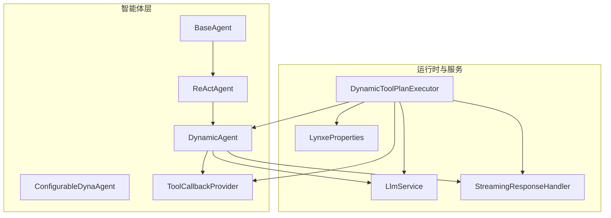
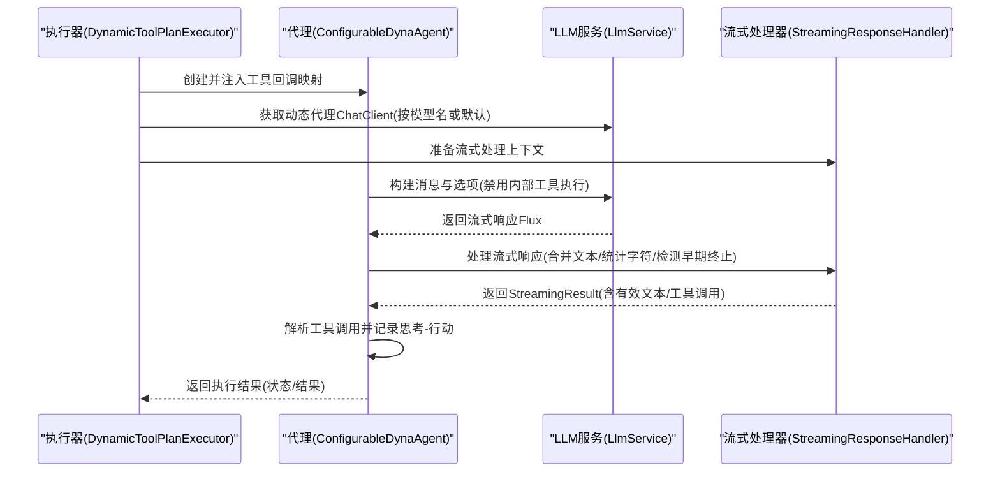
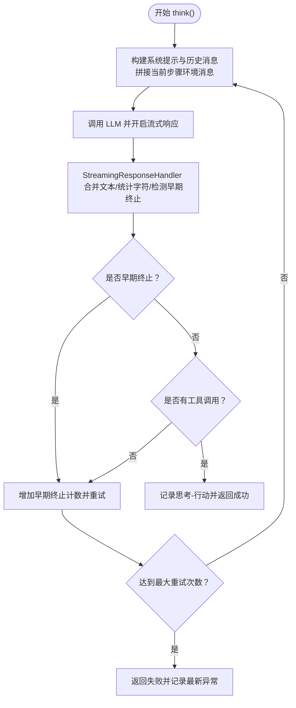
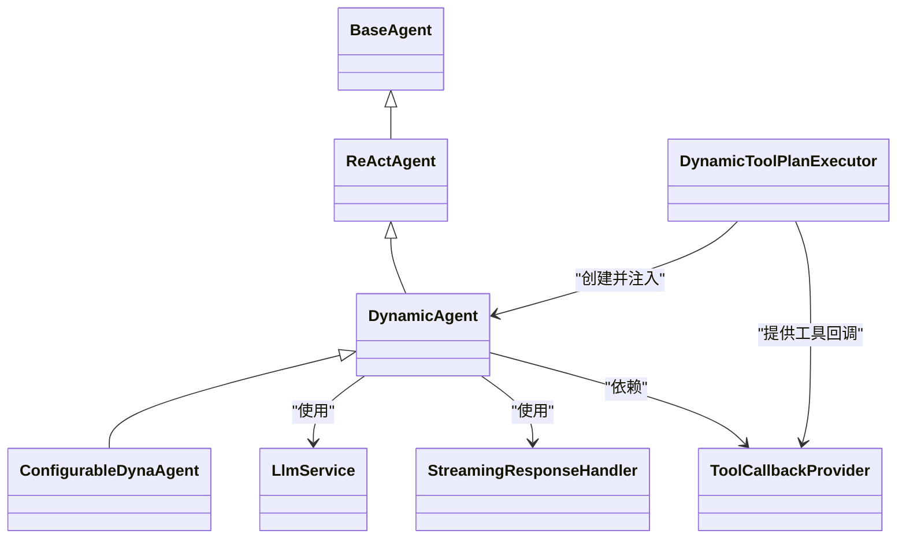

# DynamicAgent配置

<cite>
**本文引用的文件**
- [DynamicAgent.java](file://src/main/java/com/alibaba/cloud/ai/lynxe/agent/DynamicAgent.java)
- [BaseAgent.java](file://src/main/java/com/alibaba/cloud/ai/lynxe/agent/BaseAgent.java)
- [ReActAgent.java](file://src/main/java/com/alibaba/cloud/ai/lynxe/agent/ReActAgent.java)
- [ConfigurableDynaAgent.java](file://src/main/java/com/alibaba/cloud/ai/lynxe/agent/ConfigurableDynaAgent.java)
- [ToolCallbackProvider.java](file://src/main/java/com/alibaba/cloud/ai/lynxe/agent/ToolCallbackProvider.java)
- [DynamicToolPlanExecutor.java](file://src/main/java/com/alibaba/cloud/ai/lynxe/runtime/executor/DynamicToolPlanExecutor.java)
- [LlmService.java](file://src/main/java/com/alibaba/cloud/ai/lynxe/llm/LlmService.java)
- [StreamingResponseHandler.java](file://src/main/java/com/alibaba/cloud/ai/lynxe/llm/StreamingResponseHandler.java)
- [LynxeProperties.java](file://src/main/java/com/alibaba/cloud/ai/lynxe/config/LynxeProperties.java)
- [DynamicAgentEntity.java](file://src/main/java/com/alibaba/cloud/ai/lynxe/agent/entity/DynamicAgentEntity.java)
- [OpenAICompatibleController.java](file://src/main/java/com/alibaba/cloud/ai/lynxe/adapter/controller/OpenAICompatibleController.java)
</cite>

## 目录
1. [简介](#简介)
2. [项目结构](#项目结构)
3. [核心组件](#核心组件)
4. [架构总览](#架构总览)
5. [详细组件分析](#详细组件分析)
6. [依赖关系分析](#依赖关系分析)
7. [性能与可靠性](#性能与可靠性)
8. [故障排查指南](#故障排查指南)
9. [结论](#结论)
10. [附录：配置示例与最佳实践](#附录配置示例与最佳实践)

## 简介
本文件系统性梳理 DynamicAgent 的配置机制与运行流程，重点覆盖：
- 构造函数参数的作用与配置方式
- availableToolKeys 列表的初始化与管理策略
- toolCallingManager、userInputService 等核心服务的注入与使用
- initSettingData 与 envData 在代理配置与执行中的角色
- DynamicAgent 如何通过 LlmService 和 StreamingResponseHandler 进行模型调用与流式响应处理
- 配置过程中的错误处理与异常恢复
- 扩展 DynamicAgent 的方法（新增工具、参数配置）

## 项目结构
DynamicAgent 属于“智能体”层，位于 agent 包；其运行时由 LLM 服务与流式处理器支撑，并通过执行器装配到计划执行流程中。

图表来源
- [DynamicAgent.java](file://src/main/java/com/alibaba/cloud/ai/lynxe/agent/DynamicAgent.java#L167-L198)
- [ConfigurableDynaAgent.java](file://src/main/java/com/alibaba/cloud/ai/lynxe/agent/ConfigurableDynaAgent.java#L57-L89)
- [BaseAgent.java](file://src/main/java/com/alibaba/cloud/ai/lynxe/agent/BaseAgent.java#L242-L252)
- [ReActAgent.java](file://src/main/java/com/alibaba/cloud/ai/lynxe/agent/ReActAgent.java#L40-L45)
- [DynamicToolPlanExecutor.java](file://src/main/java/com/alibaba/cloud/ai/lynxe/runtime/executor/DynamicToolPlanExecutor.java#L119-L181)
- [LlmService.java](file://src/main/java/com/alibaba/cloud/ai/lynxe/llm/LlmService.java#L164-L201)
- [StreamingResponseHandler.java](file://src/main/java/com/alibaba/cloud/ai/lynxe/llm/StreamingResponseHandler.java#L57-L120)
- [LynxeProperties.java](file://src/main/java/com/alibaba/cloud/ai/lynxe/config/LynxeProperties.java#L196-L215)

章节来源
- [DynamicAgent.java](file://src/main/java/com/alibaba/cloud/ai/lynxe/agent/DynamicAgent.java#L167-L198)
- [DynamicToolPlanExecutor.java](file://src/main/java/com/alibaba/cloud/ai/lynxe/runtime/executor/DynamicToolPlanExecutor.java#L119-L181)

## 核心组件
- DynamicAgent：基于 ReAct 思维-行动循环的动态代理，负责思考（推理）与行动（工具调用），并具备重试、早期终止检测、异常聚合与回退能力。
- BaseAgent：抽象基类，提供通用状态管理、步骤执行框架、异常包装为工具输出的能力。
- ReActAgent：继承 BaseAgent，定义 think()/act() 的 ReAct 模式骨架。
- ConfigurableDynaAgent：在 DynamicAgent 基础上支持运行时可配置工具集，自动补齐终止工具并兼容服务组工具键格式。
- ToolCallbackProvider：提供工具回调上下文映射，供代理按工具键选择可用工具。
- LlmService：统一构建 ChatClient，管理对话记忆、默认模型缓存与变更事件。
- StreamingResponseHandler：对流式响应进行合并、统计字符数、检测早期终止并返回结构化结果。
- LynxeProperties：全局配置读取入口，如最大记忆条数、用户输入超时、并行工具调用开关等。
- DynamicToolPlanExecutor：计划执行器，根据执行步骤动态创建 ConfigurableDynaAgent 并注入工具回调。

章节来源
- [BaseAgent.java](file://src/main/java/com/alibaba/cloud/ai/lynxe/agent/BaseAgent.java#L1-L120)
- [ReActAgent.java](file://src/main/java/com/alibaba/cloud/ai/lynxe/agent/ReActAgent.java#L1-L97)
- [DynamicAgent.java](file://src/main/java/com/alibaba/cloud/ai/lynxe/agent/DynamicAgent.java#L1-L120)
- [ConfigurableDynaAgent.java](file://src/main/java/com/alibaba/cloud/ai/lynxe/agent/ConfigurableDynaAgent.java#L1-L90)
- [ToolCallbackProvider.java](file://src/main/java/com/alibaba/cloud/ai/lynxe/agent/ToolCallbackProvider.java#L1-L27)
- [LlmService.java](file://src/main/java/com/alibaba/cloud/ai/lynxe/llm/LlmService.java#L1-L120)
- [StreamingResponseHandler.java](file://src/main/java/com/alibaba/cloud/ai/lynxe/llm/StreamingResponseHandler.java#L57-L120)
- [LynxeProperties.java](file://src/main/java/com/alibaba/cloud/ai/lynxe/config/LynxeProperties.java#L176-L215)
- [DynamicToolPlanExecutor.java](file://src/main/java/com/alibaba/cloud/ai/lynxe/runtime/executor/DynamicToolPlanExecutor.java#L119-L181)

## 架构总览
DynamicAgent 的配置与执行链路如下：

图表来源
- [DynamicToolPlanExecutor.java](file://src/main/java/com/alibaba/cloud/ai/lynxe/runtime/executor/DynamicToolPlanExecutor.java#L149-L181)
- [DynamicAgent.java](file://src/main/java/com/alibaba/cloud/ai/lynxe/agent/DynamicAgent.java#L326-L378)
- [LlmService.java](file://src/main/java/com/alibaba/cloud/ai/lynxe/llm/LlmService.java#L164-L201)
- [StreamingResponseHandler.java](file://src/main/java/com/alibaba/cloud/ai/lynxe/llm/StreamingResponseHandler.java#L451-L477)

## 详细组件分析

### DynamicAgent 构造函数与参数解析
DynamicAgent 的构造函数接收大量依赖，用于支撑其思考与行动逻辑。关键参数说明如下：
- llmService：LLM 服务，提供 ChatClient、对话记忆、默认模型缓存与变更事件监听。
- planExecutionRecorder：计划执行记录器，记录思考-行动与最终执行结果。
- lynxeProperties：全局配置读取器，影响最大记忆条数、调试模式、并行工具调用等。
- name/description/nextStepPrompt：代理名称、描述与下一步提示模板，用于生成系统提示。
- availableToolKeys：可用工具键集合，为空时由 ConfigurableDynaAgent 自动补齐。
- toolCallingManager：工具调用管理器，负责实际执行工具调用。
- initialAgentSetting：初始设置数据，作为模板变量注入到系统提示中。
- userInputService：用户输入服务，用于表单输入工具的等待与清理。
- modelName：模型名，决定使用的 ChatClient；为空则使用默认模型。
- streamingResponseHandler：流式响应处理器，负责合并增量文本、统计字符数、检测早期终止。
- step/planIdDispatcher/lynxeEventPublisher/agentInterruptionHelper/objectMapper/parallelToolExecutionService/memoryService/conversationMemoryLimitService/serviceGroupIndexService：分别用于计划ID分发、事件发布、中断检查、对象序列化、并行工具执行、内存与会话记忆限制、服务组索引转换等。

章节来源
- [DynamicAgent.java](file://src/main/java/com/alibaba/cloud/ai/lynxe/agent/DynamicAgent.java#L167-L198)
- [BaseAgent.java](file://src/main/java/com/alibaba/cloud/ai/lynxe/agent/BaseAgent.java#L242-L252)
- [LynxeProperties.java](file://src/main/java/com/alibaba/cloud/ai/lynxe/config/LynxeProperties.java#L196-L215)

### availableToolKeys 初始化与管理
- 若传入的 availableToolKeys 为 null 或空，则 ConfigurableDynaAgent 会在 getToolCallList 中自动收集所有可用工具键并注入。
- 为保证代理能正常结束，若未发现可终止工具（TerminableTool），将自动补齐 TerminateTool（按合格键或非合格键查找）。
- 支持服务组工具键格式转换，兼容 serviceGroup.toolName 与 toolName[index] 等多种键形式，确保工具查找的向后兼容性。

章节来源
- [ConfigurableDynaAgent.java](file://src/main/java/com/alibaba/cloud/ai/lynxe/agent/ConfigurableDynaAgent.java#L91-L168)
- [ConfigurableDynaAgent.java](file://src/main/java/com/alibaba/cloud/ai/lynxe/agent/ConfigurableDynaAgent.java#L201-L341)

### initSettingData 与 envData 的使用
- initSettingData：来自 BaseAgent 的不可变初始化设置，包含计划状态、当前步骤索引、步骤文本、额外参数等，作为系统提示模板变量注入。
- envData：运行时环境数据，通过 setEnvData 设置，供工具回调与后续步骤使用。DynamicAgent 在思考前会收集并设置环境数据，确保工具调用上下文完整。

章节来源
- [BaseAgent.java](file://src/main/java/com/alibaba/cloud/ai/lynxe/agent/BaseAgent.java#L484-L533)
- [DynamicAgent.java](file://src/main/java/com/alibaba/cloud/ai/lynxe/agent/DynamicAgent.java#L200-L230)

### 工具回调注入与工具选择
- ToolCallbackProvider 提供工具回调上下文映射，DynamicAgent 通过 getToolCallList 获取工具回调列表。
- ConfigurableDynaAgent 在 availableToolKeys 为空时自动补齐工具，并确保存在可终止工具；同时支持服务组工具键转换与向后兼容查找。

章节来源
- [ToolCallbackProvider.java](file://src/main/java/com/alibaba/cloud/ai/lynxe/agent/ToolCallbackProvider.java#L1-L27)
- [ConfigurableDynaAgent.java](file://src/main/java/com/alibaba/cloud/ai/lynxe/agent/ConfigurableDynaAgent.java#L91-L168)

### LlmService 与 StreamingResponseHandler 的协作
- LlmService 负责：
  - 构建 ChatClient（默认与动态代理两种客户端）
  - 维护对话记忆与会话记忆（含大小限制）
  - 监听模型变更事件，刷新缓存
- StreamingResponseHandler 负责：
  - 对流式响应进行合并与统计（输入/输出字符数）
  - 检测“早期终止”（仅文本无工具调用）
  - 返回结构化 StreamingResult，供 DynamicAgent 使用

章节来源
- [LlmService.java](file://src/main/java/com/alibaba/cloud/ai/lynxe/llm/LlmService.java#L164-L201)
- [LlmService.java](file://src/main/java/com/alibaba/cloud/ai/lynxe/llm/LlmService.java#L244-L286)
- [StreamingResponseHandler.java](file://src/main/java/com/alibaba/cloud/ai/lynxe/llm/StreamingResponseHandler.java#L57-L120)
- [StreamingResponseHandler.java](file://src/main/java/com/alibaba/cloud/ai/lynxe/llm/StreamingResponseHandler.java#L451-L477)

### 执行流程与重试、早期终止与异常处理
- think()：构建系统提示与当前步骤环境消息，调用 LLM 并通过 StreamingResponseHandler 流式处理；支持重试（指数退避）、早期终止阈值控制；记录 LLM 异常并聚合。
- step()：根据 think() 结果决定是否进入 act()；若失败则通过 SystemErrorReportTool 包装异常并模拟工具后流程。
- act()：单工具与多工具执行路径分离；对 FormInputTool/TerminableTool/SystemErrorReportTool 等特殊工具进行专门处理；异常时清理表单输入并回退。

图表来源
- [DynamicAgent.java](file://src/main/java/com/alibaba/cloud/ai/lynxe/agent/DynamicAgent.java#L232-L485)
- [StreamingResponseHandler.java](file://src/main/java/com/alibaba/cloud/ai/lynxe/llm/StreamingResponseHandler.java#L451-L477)

章节来源
- [DynamicAgent.java](file://src/main/java/com/alibaba/cloud/ai/lynxe/agent/DynamicAgent.java#L200-L230)
- [DynamicAgent.java](file://src/main/java/com/alibaba/cloud/ai/lynxe/agent/DynamicAgent.java#L326-L485)

### 配置持久化与实体映射
- DynamicAgentEntity：持久化代理配置，包含代理名称、描述、下一步提示、可用工具键集合、绑定模型、命名空间、内置标记等字段。
- 该实体与前端配置页面配合，支持导出/导入代理配置。

章节来源
- [DynamicAgentEntity.java](file://src/main/java/com/alibaba/cloud/ai/lynxe/agent/entity/DynamicAgentEntity.java#L1-L132)

## 依赖关系分析
- DynamicAgent 依赖 BaseAgent/ReActAgent 的执行框架，依赖 LlmService 提供 ChatClient 与记忆，依赖 StreamingResponseHandler 处理流式响应。
- ConfigurableDynaAgent 依赖 PlanningFactory 的工具回调映射，依赖 ServiceGroupIndexService 进行工具键转换。
- DynamicToolPlanExecutor 负责装配代理、注入工具回调与上下文，并将代理纳入计划执行流程。

图表来源
- [BaseAgent.java](file://src/main/java/com/alibaba/cloud/ai/lynxe/agent/BaseAgent.java#L1-L120)
- [ReActAgent.java](file://src/main/java/com/alibaba/cloud/ai/lynxe/agent/ReActAgent.java#L1-L97)
- [DynamicAgent.java](file://src/main/java/com/alibaba/cloud/ai/lynxe/agent/DynamicAgent.java#L1-L120)
- [ConfigurableDynaAgent.java](file://src/main/java/com/alibaba/cloud/ai/lynxe/agent/ConfigurableDynaAgent.java#L1-L90)
- [DynamicToolPlanExecutor.java](file://src/main/java/com/alibaba/cloud/ai/lynxe/runtime/executor/DynamicToolPlanExecutor.java#L119-L181)

## 性能与可靠性
- 流式处理：通过 StreamingResponseHandler 合并增量文本并统计字符数，有助于前端体验与资源控制。
- 早期终止检测：当模型仅输出文本而无工具调用时，自动增强提示并重试，避免无效循环。
- 重试策略：指数退避（上限 60 秒），在网络相关异常时自动重试，提升鲁棒性。
- 记忆与会话：LlmService 提供会话记忆与大小限制，避免历史过长导致性能问题。
- 中断与清理：支持任务中断检查与清理（表单输入工具、工具回调上下文），防止资源泄漏。

章节来源
- [DynamicAgent.java](file://src/main/java/com/alibaba/cloud/ai/lynxe/agent/DynamicAgent.java#L487-L509)
- [LlmService.java](file://src/main/java/com/alibaba/cloud/ai/lynxe/llm/LlmService.java#L244-L286)
- [StreamingResponseHandler.java](file://src/main/java/com/alibaba/cloud/ai/lynxe/llm/StreamingResponseHandler.java#L451-L477)

## 故障排查指南
- LLM 调用失败：检查 LlmService 默认模型是否初始化、ChatClient 缓存是否正确；确认网络与超时配置。
- 早期终止：若模型反复仅输出文本，请在 nextStepPrompt 中强调必须调用工具；适当提高重试次数与早期终止阈值。
- 工具缺失：确认 ToolCallbackProvider 是否正确提供工具回调映射；若 availableToolKeys 为空，检查 ConfigurableDynaAgent 是否已补齐 TerminateTool。
- 异常聚合：DynamicAgent 会聚合多次重试的异常并在 step() 中通过 SystemErrorReportTool 包装，便于前端展示与定位。

章节来源
- [DynamicAgent.java](file://src/main/java/com/alibaba/cloud/ai/lynxe/agent/DynamicAgent.java#L510-L553)
- [DynamicAgent.java](file://src/main/java/com/alibaba/cloud/ai/lynxe/agent/DynamicAgent.java#L555-L604)
- [BaseAgent.java](file://src/main/java/com/alibaba/cloud/ai/lynxe/agent/BaseAgent.java#L368-L424)

## 结论
DynamicAgent 通过清晰的构造参数设计、灵活的工具集配置、稳健的流式响应处理与完善的异常恢复机制，实现了可配置、可扩展、可观察的智能体执行框架。结合 DynamicToolPlanExecutor 与 PlanningFactory 的工具回调映射，开发者可以快速构建与迭代不同场景下的动态代理。

## 附录：配置示例与最佳实践

### 构建与初始化 DynamicAgent 的步骤
- 通过 DynamicToolPlanExecutor 在执行步骤中创建 ConfigurableDynaAgent，并注入：
  - 工具回调映射（ToolCallbackProvider）
  - LlmService、StreamingResponseHandler、UserInputService、PlanIdDispatcher、LynxeEventPublisher、AgentInterruptionHelper、ObjectMapper、ParallelToolExecutionService、MemoryService、ConversationMemoryLimitService、ServiceGroupIndexService
  - 代理名称、描述、下一步提示、可用工具键集合、模型名、初始设置数据、执行步骤、会话ID、计划深度
- 在 ConfigurableDynaAgent 中，若 availableToolKeys 为空，将自动补齐工具并确保存在可终止工具。

章节来源
- [DynamicToolPlanExecutor.java](file://src/main/java/com/alibaba/cloud/ai/lynxe/runtime/executor/DynamicToolPlanExecutor.java#L149-L181)
- [ConfigurableDynaAgent.java](file://src/main/java/com/alibaba/cloud/ai/lynxe/agent/ConfigurableDynaAgent.java#L91-L168)

### 配置参数清单与建议
- 代理基本信息
  - name：代理名称（建议唯一且易识别）
  - description：代理职责与能力描述
  - nextStepPrompt：下一步决策提示模板
- 工具配置
  - availableToolKeys：可选；为空时自动补齐工具并确保 TerminateTool 存在
  - toolCallingManager：工具调用管理器（由执行器注入）
- LLM 与流式处理
  - modelName：模型名；为空使用默认模型
  - LlmService：统一 ChatClient 构建与缓存
  - StreamingResponseHandler：流式响应合并与早期终止检测
- 运行时服务
  - userInputService：表单输入工具等待与清理
  - planIdDispatcher、lynxeEventPublisher、agentInterruptionHelper：计划ID分发、事件发布、中断检查
  - parallelToolExecutionService、memoryService、conversationMemoryLimitService：并行工具执行、内存与会话记忆
  - serviceGroupIndexService：服务组工具键转换
- 全局配置
  - LynxeProperties：最大记忆条数、调试模式、并行工具调用开关、用户输入超时等

章节来源
- [DynamicAgent.java](file://src/main/java/com/alibaba/cloud/ai/lynxe/agent/DynamicAgent.java#L167-L198)
- [LynxeProperties.java](file://src/main/java/com/alibaba/cloud/ai/lynxe/config/LynxeProperties.java#L176-L215)

### 错误处理与异常情况
- 网络/超时等可重试异常：指数退避重试，最多达到阈值后聚合异常并返回失败
- 早期终止：连续多次仅文本输出，增强提示并重试，超过阈值后失败
- 工具执行异常：清理表单输入工具，回退为工具后流程并记录错误信息
- SystemErrorReportTool：将异常包装为工具输出，保持执行流程一致性

章节来源
- [DynamicAgent.java](file://src/main/java/com/alibaba/cloud/ai/lynxe/agent/DynamicAgent.java#L487-L509)
- [DynamicAgent.java](file://src/main/java/com/alibaba/cloud/ai/lynxe/agent/DynamicAgent.java#L606-L767)
- [BaseAgent.java](file://src/main/java/com/alibaba/cloud/ai/lynxe/agent/BaseAgent.java#L368-L424)

### 扩展 DynamicAgent 的指导
- 新增工具
  - 实现工具接口并注册到 PlanningFactory 的工具回调映射中
  - 若工具可终止，确保实现 TerminableTool 接口；否则 ConfigurableDynaAgent 将自动补齐 TerminateTool
  - 若工具属于服务组，使用 ServiceGroupIndexService 进行键转换
- 新增配置参数
  - 在 LynxeProperties 中新增配置项并提供默认值
  - 在 DynamicAgentEntity 中新增持久化字段（如需要）
  - 在前端配置页面中暴露对应控件，并通过 AgentApiService 导入/导出配置
- 适配不同模型
  - 通过 LlmService 的模型变更事件刷新缓存
  - 在 OpenAI 兼容控制器中校验请求并返回标准流式响应

章节来源
- [ConfigurableDynaAgent.java](file://src/main/java/com/alibaba/cloud/ai/lynxe/agent/ConfigurableDynaAgent.java#L138-L168)
- [LynxeProperties.java](file://src/main/java/com/alibaba/cloud/ai/lynxe/config/LynxeProperties.java#L176-L215)
- [DynamicAgentEntity.java](file://src/main/java/com/alibaba/cloud/ai/lynxe/agent/entity/DynamicAgentEntity.java#L1-L132)
- [OpenAICompatibleController.java](file://src/main/java/com/alibaba/cloud/ai/lynxe/adapter/controller/OpenAICompatibleController.java#L154-L184)