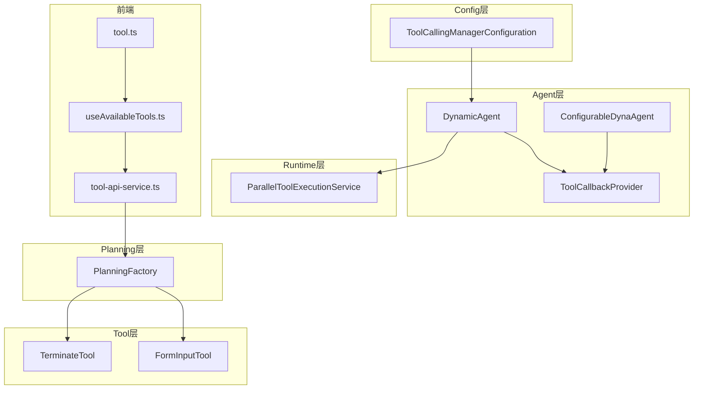
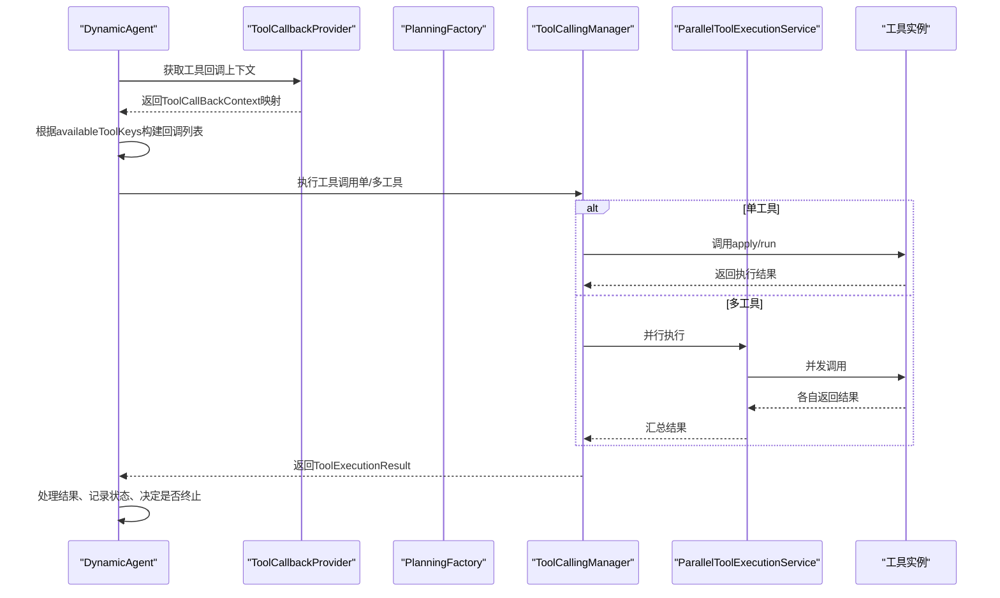
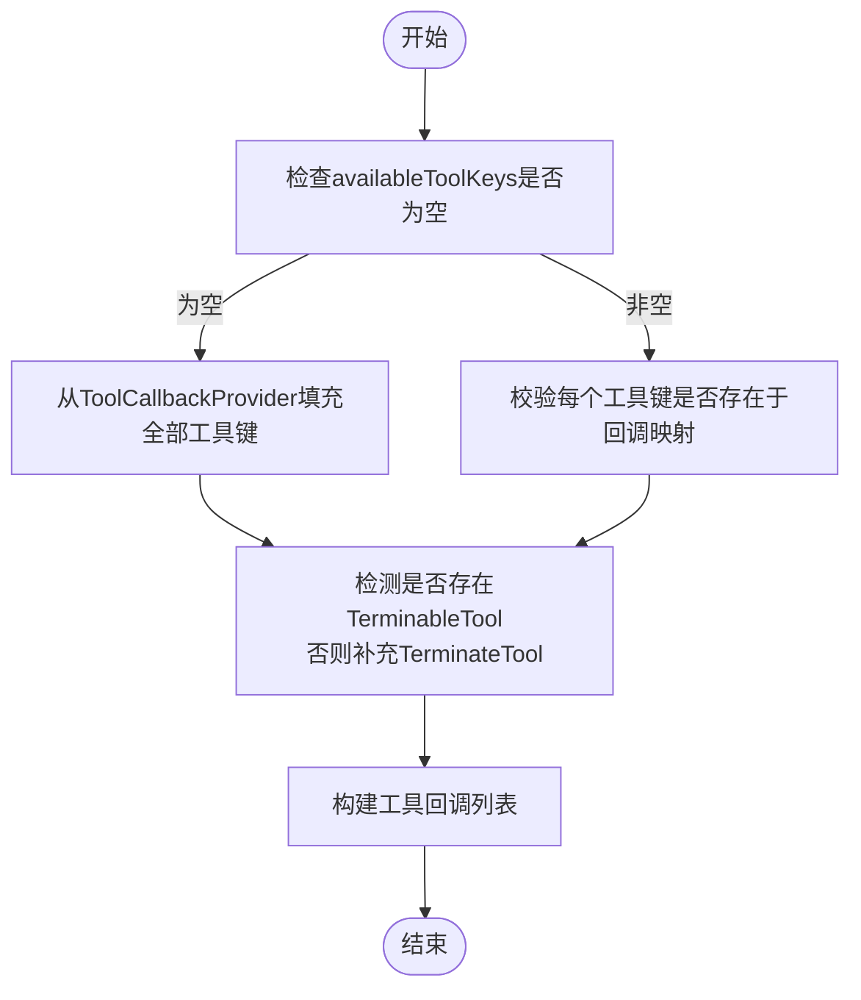
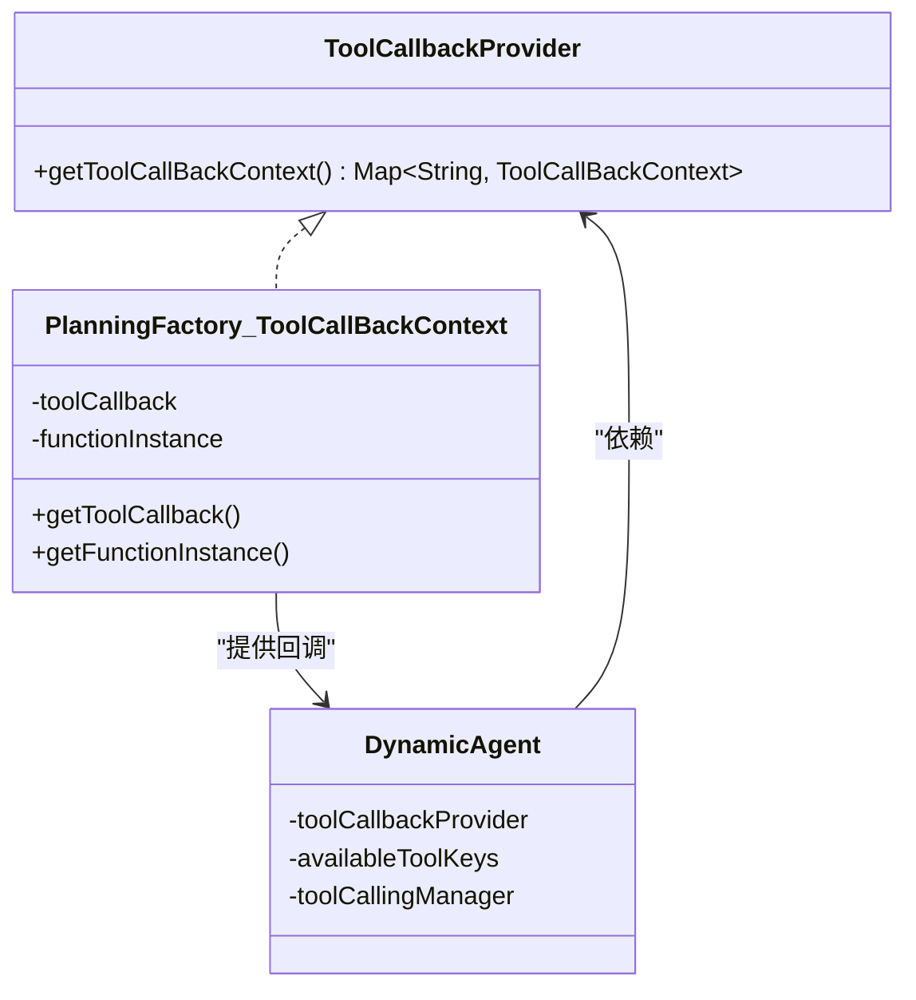
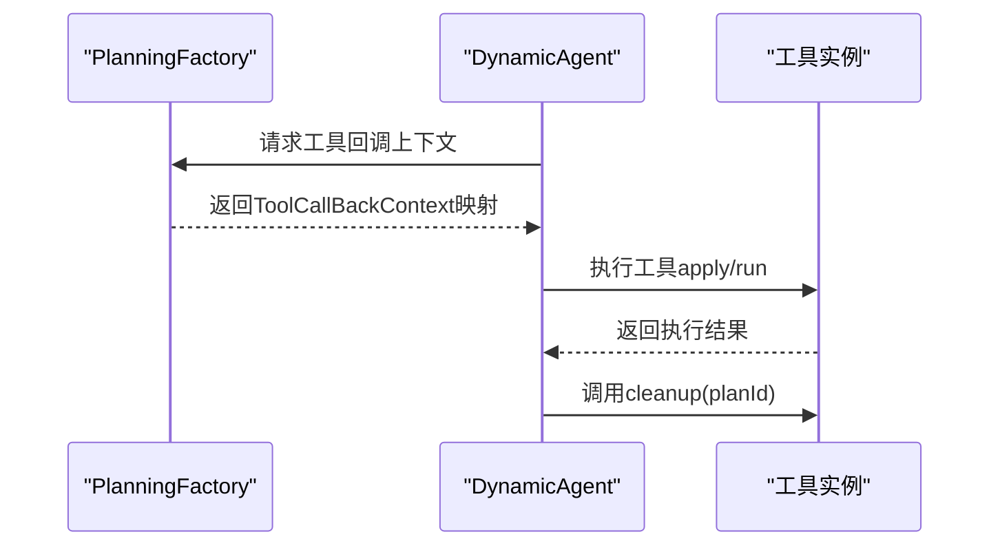
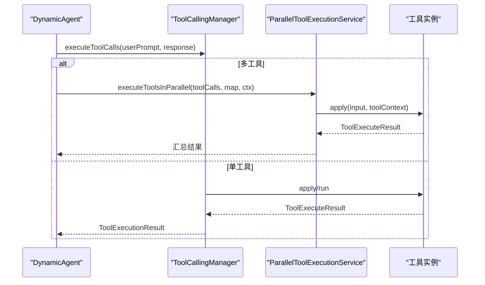
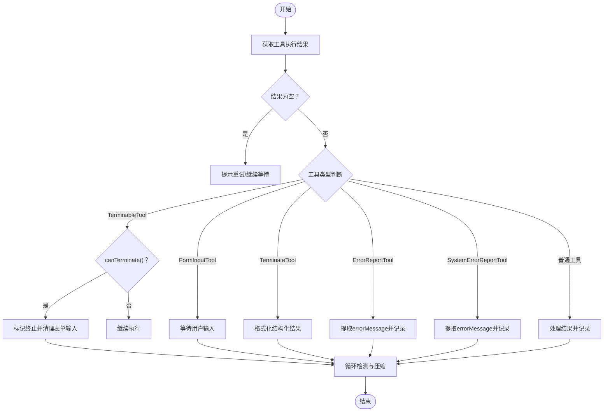
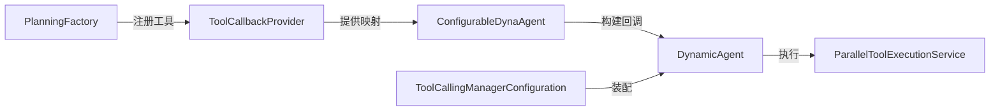

# 工具管理配置

<cite>
**本文引用的文件**
- [DynamicAgent.java](file://src/main/java/com/alibaba/cloud/ai/lynxe/agent/DynamicAgent.java)
- [ToolCallbackProvider.java](file://src/main/java/com/alibaba/cloud/ai/lynxe/agent/ToolCallbackProvider.java)
- [PlanningFactory.java](file://src/main/java/com/alibaba/cloud/ai/lynxe/planning/PlanningFactory.java)
- [ConfigurableDynaAgent.java](file://src/main/java/com/alibaba/cloud/ai/lynxe/agent/ConfigurableDynaAgent.java)
- [ToolCallingManagerConfiguration.java](file://src/main/java/com/alibaba/cloud/ai/lynxe/config/ToolCallingManagerConfiguration.java)
- [ParallelToolExecutionService.java](file://src/main/java/com/alibaba/cloud/ai/lynxe/runtime/service/ParallelToolExecutionService.java)
- [TerminateTool.java](file://src/main/java/com/alibaba/cloud/ai/lynxe/tool/TerminateTool.java)
- [FormInputTool.java](file://src/main/java/com/alibaba/cloud/ai/lynxe/tool/FormInputTool.java)
- [Tool.java](file://src/main/java/com/alibaba/cloud/ai/lynxe/agent/model/Tool.java)
- [tool-api-service.ts](file://ui-vue3/src/api/tool-api-service.ts)
- [useAvailableTools.ts](file://ui-vue3/src/composables/useAvailableTools.ts)
- [tool.ts](file://ui-vue3/src/types/tool.ts)
</cite>

## 目录
1. [简介](#简介)
2. [项目结构](#项目结构)
3. [核心组件](#核心组件)
4. [架构总览](#架构总览)
5. [详细组件分析](#详细组件分析)
6. [依赖关系分析](#依赖关系分析)
7. [性能考量](#性能考量)
8. [故障排查指南](#故障排查指南)
9. [结论](#结论)
10. [附录：工具配置示例与最佳实践](#附录工具配置示例与最佳实践)

## 简介
本文件聚焦于DynamicAgent工具管理配置，系统性阐述以下主题：
- availableToolKeys列表的初始化与管理机制（工具密钥注册、验证与权限控制）
- ToolCallbackProvider如何提供工具回调上下文，以及工具实例的生命周期管理
- toolCallingManager的调度机制与执行流程
- 工具执行结果的处理逻辑（结果收集、错误处理、状态更新）
- 工具配置示例与常见问题、解决方案及扩展最佳实践

## 项目结构
围绕工具管理的关键模块分布如下：
- agent层：DynamicAgent、ConfigurableDynaAgent、ToolCallbackProvider接口
- planning层：PlanningFactory负责工具回调注册、工具上下文构建与工具键命名（含服务组索引）
- config层：ToolCallingManagerConfiguration提供ToolCallingManager Bean配置
- runtime层：ParallelToolExecutionService支持多工具并行执行
- tool层：内置工具如TerminateTool、FormInputTool等
- 前端：UI侧通过tool-api-service.ts、useAvailableTools.ts、tool.ts与后端交互，获取可用工具列表

图表来源
- [DynamicAgent.java](file://src/main/java/com/alibaba/cloud/ai/lynxe/agent/DynamicAgent.java#L1-L200)
- [ConfigurableDynaAgent.java](file://src/main/java/com/alibaba/cloud/ai/lynxe/agent/ConfigurableDynaAgent.java#L90-L200)
- [ToolCallbackProvider.java](file://src/main/java/com/alibaba/cloud/ai/lynxe/agent/ToolCallbackProvider.java#L1-L27)
- [PlanningFactory.java](file://src/main/java/com/alibaba/cloud/ai/lynxe/planning/PlanningFactory.java#L210-L374)
- [ToolCallingManagerConfiguration.java](file://src/main/java/com/alibaba/cloud/ai/lynxe/config/ToolCallingManagerConfiguration.java#L1-L117)
- [ParallelToolExecutionService.java](file://src/main/java/com/alibaba/cloud/ai/lynxe/runtime/service/ParallelToolExecutionService.java#L1-L165)
- [TerminateTool.java](file://src/main/java/com/alibaba/cloud/ai/lynxe/tool/TerminateTool.java#L1-L120)
- [FormInputTool.java](file://src/main/java/com/alibaba/cloud/ai/lynxe/tool/FormInputTool.java#L1-L120)
- [tool-api-service.ts](file://ui-vue3/src/api/tool-api-service.ts#L1-L52)
- [useAvailableTools.ts](file://ui-vue3/src/composables/useAvailableTools.ts#L1-L47)
- [tool.ts](file://ui-vue3/src/types/tool.ts#L1-L24)

章节来源
- [DynamicAgent.java](file://src/main/java/com/alibaba/cloud/ai/lynxe/agent/DynamicAgent.java#L1-L200)
- [PlanningFactory.java](file://src/main/java/com/alibaba/cloud/ai/lynxe/planning/PlanningFactory.java#L210-L374)

## 核心组件
- DynamicAgent：动态代理执行器，负责思考（生成工具调用）、行动（执行工具）与结果处理；维护availableToolKeys、ToolCallbackProvider、ToolCallingManager等。
- ConfigurableDynaAgent：在DynamicAgent基础上，根据availableToolKeys与ToolCallbackProvider构建工具回调列表，并确保TerminableTool或TerminateTool存在。
- ToolCallbackProvider：提供工具回调上下文映射（工具名到回调与函数实例），供Agent选择可用工具。
- PlanningFactory：注册工具回调、构建ToolCallBackContext、生成带服务组索引的工具键（toolName*index*），并支持子计划工具注册。
- ToolCallingManagerConfiguration：装配ToolCallingManager Bean（默认或可观测版本），并注入ToolCallbackResolver与异常处理器。
- ParallelToolExecutionService：并行执行多个工具调用，聚合结果并处理异常。
- 内置工具：TerminateTool（终止）、FormInputTool（表单输入等待）等。

章节来源
- [DynamicAgent.java](file://src/main/java/com/alibaba/cloud/ai/lynxe/agent/DynamicAgent.java#L90-L120)
- [ConfigurableDynaAgent.java](file://src/main/java/com/alibaba/cloud/ai/lynxe/agent/ConfigurableDynaAgent.java#L90-L199)
- [ToolCallbackProvider.java](file://src/main/java/com/alibaba/cloud/ai/lynxe/agent/ToolCallbackProvider.java#L1-L27)
- [PlanningFactory.java](file://src/main/java/com/alibaba/cloud/ai/lynxe/planning/PlanningFactory.java#L240-L374)
- [ToolCallingManagerConfiguration.java](file://src/main/java/com/alibaba/cloud/ai/lynxe/config/ToolCallingManagerConfiguration.java#L40-L117)
- [ParallelToolExecutionService.java](file://src/main/java/com/alibaba/cloud/ai/lynxe/runtime/service/ParallelToolExecutionService.java#L40-L165)
- [TerminateTool.java](file://src/main/java/com/alibaba/cloud/ai/lynxe/tool/TerminateTool.java#L35-L120)
- [FormInputTool.java](file://src/main/java/com/alibaba/cloud/ai/lynxe/tool/FormInputTool.java#L1-L120)

## 架构总览
DynamicAgent通过ToolCallbackProvider获取工具回调上下文，结合availableToolKeys筛选可用工具；使用ToolCallingManager执行工具调用；在单工具与多工具场景分别处理；并借助ParallelToolExecutionService进行并行执行。PlanningFactory负责工具注册与工具键命名策略，保证工具可被LLM以“带服务组索引”的名称调用。

图表来源
- [DynamicAgent.java](file://src/main/java/com/alibaba/cloud/ai/lynxe/agent/DynamicAgent.java#L600-L760)
- [ConfigurableDynaAgent.java](file://src/main/java/com/alibaba/cloud/ai/lynxe/agent/ConfigurableDynaAgent.java#L90-L199)
- [PlanningFactory.java](file://src/main/java/com/alibaba/cloud/ai/lynxe/planning/PlanningFactory.java#L315-L358)
- [ParallelToolExecutionService.java](file://src/main/java/com/alibaba/cloud/ai/lynxe/runtime/service/ParallelToolExecutionService.java#L84-L165)

## 详细组件分析

### availableToolKeys初始化与管理机制
- 初始化来源
  - DynamicAgent构造时接收availableToolKeys参数，若为空则在ConfigurableDynaAgent中回退至ToolCallbackProvider提供的全部工具键。
  - PlanningFactory注册工具时，会为每个工具生成“带服务组索引”的工具键（toolName*index*），并在ToolCallBackContext中登记。
- 可用性与兼容性
  - ConfigurableDynaAgent在availableToolKeys为空时自动填充所有工具键；同时检测是否存在TerminableTool，若无则补充TerminateTool，确保Agent能终止。
  - 支持serviceGroup.toolName格式向qualifiedKey（toolName*index*）转换，兼顾历史命名。
- 权限与选择
  - Tool模型包含enabled、selectable字段，前端可通过这些字段过滤不可用或不可选工具；后端在构建回调列表时仅加入存在于ToolCallbackProvider中的工具键。

图表来源
- [ConfigurableDynaAgent.java](file://src/main/java/com/alibaba/cloud/ai/lynxe/agent/ConfigurableDynaAgent.java#L90-L199)
- [PlanningFactory.java](file://src/main/java/com/alibaba/cloud/ai/lynxe/planning/PlanningFactory.java#L315-L358)
- [Tool.java](file://src/main/java/com/alibaba/cloud/ai/lynxe/agent/model/Tool.java#L1-L82)

章节来源
- [ConfigurableDynaAgent.java](file://src/main/java/com/alibaba/cloud/ai/lynxe/agent/ConfigurableDynaAgent.java#L90-L199)
- [Tool.java](file://src/main/java/com/alibaba/cloud/ai/lynxe/agent/model/Tool.java#L1-L82)

### ToolCallbackProvider与工具回调上下文
- ToolCallbackProvider接口定义了获取工具回调上下文的方法，返回工具名到ToolCallBackContext的映射。
- PlanningFactory.ToolCallBackContext封装了FunctionToolCallback与具体工具实例，便于Agent按工具名查找并执行。
- PlanningFactory在注册工具时，基于工具定义构建FunctionToolCallback，设置描述、参数Schema、输入类型与返回直接模式，并将工具实例作为函数实现注册到回调映射中。

图表来源
- [ToolCallbackProvider.java](file://src/main/java/com/alibaba/cloud/ai/lynxe/agent/ToolCallbackProvider.java#L1-L27)
- [PlanningFactory.java](file://src/main/java/com/alibaba/cloud/ai/lynxe/planning/PlanningFactory.java#L219-L238)
- [DynamicAgent.java](file://src/main/java/com/alibaba/cloud/ai/lynxe/agent/DynamicAgent.java#L90-L120)

章节来源
- [ToolCallbackProvider.java](file://src/main/java/com/alibaba/cloud/ai/lynxe/agent/ToolCallbackProvider.java#L1-L27)
- [PlanningFactory.java](file://src/main/java/com/alibaba/cloud/ai/lynxe/planning/PlanningFactory.java#L219-L238)

### 工具实例生命周期管理
- 注册阶段：PlanningFactory在toolCallbackMap中登记工具，生成qualifiedKey并绑定FunctionToolCallback与工具实例。
- 使用阶段：DynamicAgent根据availableToolKeys与ToolCallbackProvider构建回调列表；执行时通过ToolCallingManager调用工具实例的apply/run方法。
- 清理阶段：DynamicAgent在清理流程中调用工具实例cleanup，释放资源；部分工具（如ParallelExecutionTool）也提供自身清理逻辑。

图表来源
- [PlanningFactory.java](file://src/main/java/com/alibaba/cloud/ai/lynxe/planning/PlanningFactory.java#L315-L358)
- [DynamicAgent.java](file://src/main/java/com/alibaba/cloud/ai/lynxe/agent/DynamicAgent.java#L140-L165)
- [ParallelToolExecutionService.java](file://src/main/java/com/alibaba/cloud/ai/lynxe/runtime/service/ParallelToolExecutionService.java#L466-L509)

章节来源
- [PlanningFactory.java](file://src/main/java/com/alibaba/cloud/ai/lynxe/planning/PlanningFactory.java#L315-L358)
- [DynamicAgent.java](file://src/main/java/com/alibaba/cloud/ai/lynxe/agent/DynamicAgent.java#L140-L165)

### toolCallingManager调度与执行流程
- 单工具执行：DynamicAgent调用toolCallingManager.executeToolCalls(userPrompt, response)，获取ToolExecutionResult，解析ToolResponseMessage并处理结果。
- 多工具执行：DynamicAgent委托ParallelToolExecutionService并行执行，汇总结果后统一处理。
- 上下文传递：ToolContext携带toolcallId与planDepth，用于追踪与日志记录；ParallelToolExecutionService从父上下文中提取并传递给各工具执行。

图表来源
- [DynamicAgent.java](file://src/main/java/com/alibaba/cloud/ai/lynxe/agent/DynamicAgent.java#L649-L760)
- [ParallelToolExecutionService.java](file://src/main/java/com/alibaba/cloud/ai/lynxe/runtime/service/ParallelToolExecutionService.java#L84-L165)

章节来源
- [DynamicAgent.java](file://src/main/java/com/alibaba/cloud/ai/lynxe/agent/DynamicAgent.java#L649-L760)
- [ParallelToolExecutionService.java](file://src/main/java/com/alibaba/cloud/ai/lynxe/runtime/service/ParallelToolExecutionService.java#L84-L165)

### 工具执行结果处理逻辑
- 结果收集：单工具通过ToolResponseMessage获取响应数据；多工具通过ParallelToolExecutionService聚合ToolExecutionResult。
- 错误处理：工具执行异常被捕获并包装为ToolExecuteResult；DynamicAgent在处理过程中记录错误信息，必要时通过SystemErrorReportTool上报。
- 状态更新：根据工具类型（TerminableTool、FormInputTool、TerminateTool、SystemErrorReportTool）更新步骤状态与消息；对TerminateTool返回JSON结构化结果；对ErrorReportTool提取errorMessage并记录。
- 循环检测：对最近多次工具结果进行去重检测，必要时强制压缩。

图表来源
- [DynamicAgent.java](file://src/main/java/com/alibaba/cloud/ai/lynxe/agent/DynamicAgent.java#L722-L760)
- [DynamicAgent.java](file://src/main/java/com/alibaba/cloud/ai/lynxe/agent/DynamicAgent.java#L1089-L1113)
- [TerminateTool.java](file://src/main/java/com/alibaba/cloud/ai/lynxe/tool/TerminateTool.java#L210-L240)
- [FormInputTool.java](file://src/main/java/com/alibaba/cloud/ai/lynxe/tool/FormInputTool.java#L376-L420)

章节来源
- [DynamicAgent.java](file://src/main/java/com/alibaba/cloud/ai/lynxe/agent/DynamicAgent.java#L722-L760)
- [DynamicAgent.java](file://src/main/java/com/alibaba/cloud/ai/lynxe/agent/DynamicAgent.java#L1089-L1113)
- [TerminateTool.java](file://src/main/java/com/alibaba/cloud/ai/lynxe/tool/TerminateTool.java#L210-L240)
- [FormInputTool.java](file://src/main/java/com/alibaba/cloud/ai/lynxe/tool/FormInputTool.java#L376-L420)

### 前端可用工具配置与交互
- 前端通过ToolApiService调用后端“/api/tools”接口获取可用工具列表，工具模型包含key、name、description、enabled、serviceGroup、selectable等字段。
- useAvailableTools组合式函数加载并管理可用工具列表，支持过滤与单例实例化。
- UI组件根据工具的inputSchema与serviceGroup决定显示方式与可选项。

章节来源
- [tool-api-service.ts](file://ui-vue3/src/api/tool-api-service.ts#L1-L52)
- [useAvailableTools.ts](file://ui-vue3/src/composables/useAvailableTools.ts#L1-L47)
- [tool.ts](file://ui-vue3/src/types/tool.ts#L1-L24)

## 依赖关系分析
- DynamicAgent依赖ToolCallbackProvider与ToolCallingManager；ConfigurableDynaAgent在DynamicAgent之上增强工具选择与TerminableTool保障。
- PlanningFactory负责工具注册与工具键命名，提供ToolCallBackContext映射；ToolCallingManagerConfiguration装配ToolCallingManager Bean。
- ParallelToolExecutionService独立于Agent，提供并行执行能力，复用ToolContext传递上下文。

图表来源
- [PlanningFactory.java](file://src/main/java/com/alibaba/cloud/ai/lynxe/planning/PlanningFactory.java#L240-L374)
- [ConfigurableDynaAgent.java](file://src/main/java/com/alibaba/cloud/ai/lynxe/agent/ConfigurableDynaAgent.java#L90-L199)
- [DynamicAgent.java](file://src/main/java/com/alibaba/cloud/ai/lynxe/agent/DynamicAgent.java#L600-L760)
- [ToolCallingManagerConfiguration.java](file://src/main/java/com/alibaba/cloud/ai/lynxe/config/ToolCallingManagerConfiguration.java#L40-L117)
- [ParallelToolExecutionService.java](file://src/main/java/com/alibaba/cloud/ai/lynxe/runtime/service/ParallelToolExecutionService.java#L84-L165)

章节来源
- [PlanningFactory.java](file://src/main/java/com/alibaba/cloud/ai/lynxe/planning/PlanningFactory.java#L240-L374)
- [ConfigurableDynaAgent.java](file://src/main/java/com/alibaba/cloud/ai/lynxe/agent/ConfigurableDynaAgent.java#L90-L199)
- [ToolCallingManagerConfiguration.java](file://src/main/java/com/alibaba/cloud/ai/lynxe/config/ToolCallingManagerConfiguration.java#L40-L117)

## 性能考量
- 并行执行：ParallelToolExecutionService使用CompletableFuture并发执行多个工具，提升吞吐；建议合理设置并发度，避免资源争用。
- 上下文传递：ToolContext中toolcallId与planDepth的提取与传递开销较小，但需确保父上下文正确设置。
- 循环检测：对重复结果进行压缩可减少冗余输出，提高用户体验。
- 异常处理：捕获工具执行异常并快速失败，避免阻塞其他工具执行。

[本节为通用指导，不涉及具体文件分析]

## 故障排查指南
- 工具未出现在可用列表
  - 检查PlanningFactory是否成功注册该工具并生成qualifiedKey；确认ToolCallbackProvider映射中存在对应键。
  - 若使用serviceGroup.toolName格式，确认ConfigurableDynaAgent已正确转换为toolName*index*格式。
- 工具执行报错
  - 查看ParallelToolExecutionService的异常日志；在DynamicAgent中检查ToolExecutionResult与ToolResponseMessage。
  - 对ErrorReportTool/SystemErrorReportTool，检查errorMessage提取逻辑与记录。
- 终止条件未触发
  - 确认TerminableTool或TerminateTool已在availableToolKeys中；检查canTerminate()返回值。
- 表单输入等待
  - 确认FormInputTool处于AWAITING_USER_INPUT状态；检查UserInputService是否正确存储与轮询。

章节来源
- [ConfigurableDynaAgent.java](file://src/main/java/com/alibaba/cloud/ai/lynxe/agent/ConfigurableDynaAgent.java#L90-L199)
- [ParallelToolExecutionService.java](file://src/main/java/com/alibaba/cloud/ai/lynxe/runtime/service/ParallelToolExecutionService.java#L120-L165)
- [DynamicAgent.java](file://src/main/java/com/alibaba/cloud/ai/lynxe/agent/DynamicAgent.java#L722-L760)
- [FormInputTool.java](file://src/main/java/com/alibaba/cloud/ai/lynxe/tool/FormInputTool.java#L376-L420)

## 结论
DynamicAgent的工具管理配置围绕“工具回调上下文映射、工具键命名与选择、执行调度与结果处理”展开。通过PlanningFactory的工具注册与命名策略、ConfigurableDynaAgent的可用工具筛选与TerminableTool保障、ToolCallingManager的执行调度与ParallelToolExecutionService的并行能力，实现了灵活、可控且可扩展的工具体系。前端通过标准API获取可用工具，配合后端工具模型字段实现可视化配置与权限控制。

[本节为总结性内容，不涉及具体文件分析]

## 附录：工具配置示例与最佳实践

### 配置要点
- 工具键命名
  - 优先使用带服务组索引的qualifiedKey（toolName*index*），以区分同名工具的不同实例。
  - 若仅提供serviceGroup.toolName，确保ConfigurableDynaAgent能正确转换。
- 可用工具列表
  - 在DynamicAgent构造时传入availableToolKeys；若为空，将自动使用ToolCallbackProvider中的全部工具键。
  - 确保至少包含一个TerminableTool或TerminateTool，以便Agent能够终止执行。
- 参数Schema与描述
  - 工具参数Schema由工具自身提供；前端可据此渲染表单或提示。
- 并行执行
  - 多工具执行不支持FormInputTool与TerminableTool；若包含此类工具，应提示LLM重新选择。

章节来源
- [PlanningFactory.java](file://src/main/java/com/alibaba/cloud/ai/lynxe/planning/PlanningFactory.java#L315-L358)
- [ConfigurableDynaAgent.java](file://src/main/java/com/alibaba/cloud/ai/lynxe/agent/ConfigurableDynaAgent.java#L90-L199)
- [DynamicAgent.java](file://src/main/java/com/alibaba/cloud/ai/lynxe/agent/DynamicAgent.java#L600-L760)

### 常见问题与解决方案
- 工具键找不到
  - 检查PlanningFactory注册流程与qualifiedKey生成逻辑；确认ToolCallbackProvider映射完整。
- 工具参数不匹配
  - 核对工具参数Schema与实际输入；必要时调整工具实现或前端表单。
- 并行执行超时或阻塞
  - 调整线程池与并发度；监控工具执行时间，优化工具内部逻辑。
- 终止逻辑失效
  - 确认TerminateTool或TerminableTool已加入availableToolKeys；检查canTerminate()实现。

章节来源
- [PlanningFactory.java](file://src/main/java/com/alibaba/cloud/ai/lynxe/planning/PlanningFactory.java#L315-L358)
- [ParallelToolExecutionService.java](file://src/main/java/com/alibaba/cloud/ai/lynxe/runtime/service/ParallelToolExecutionService.java#L84-L165)
- [TerminateTool.java](file://src/main/java/com/alibaba/cloud/ai/lynxe/tool/TerminateTool.java#L440-L455)

### 最佳实践
- 工具扩展
  - 实现ToolCallBiFunctionDef接口，提供getName、getDescription、getParameters、getInputType、run/apply等方法。
  - 在PlanningFactory中注册新工具，确保生成唯一qualifiedKey并绑定FunctionToolCallback。
- 生命周期
  - 在工具类中实现cleanup，释放外部资源；在DynamicAgent.clearUp中统一清理。
- 错误处理
  - 工具内部捕获异常并返回ToolExecuteResult；在Agent层统一记录与上报。
- 前端集成
  - 使用ToolApiService获取可用工具列表；根据enabled与selectable字段控制UI显示与选择。

章节来源
- [PlanningFactory.java](file://src/main/java/com/alibaba/cloud/ai/lynxe/planning/PlanningFactory.java#L240-L374)
- [DynamicAgent.java](file://src/main/java/com/alibaba/cloud/ai/lynxe/agent/DynamicAgent.java#L140-L165)
- [tool-api-service.ts](file://ui-vue3/src/api/tool-api-service.ts#L1-L52)
- [tool.ts](file://ui-vue3/src/types/tool.ts#L1-L24)