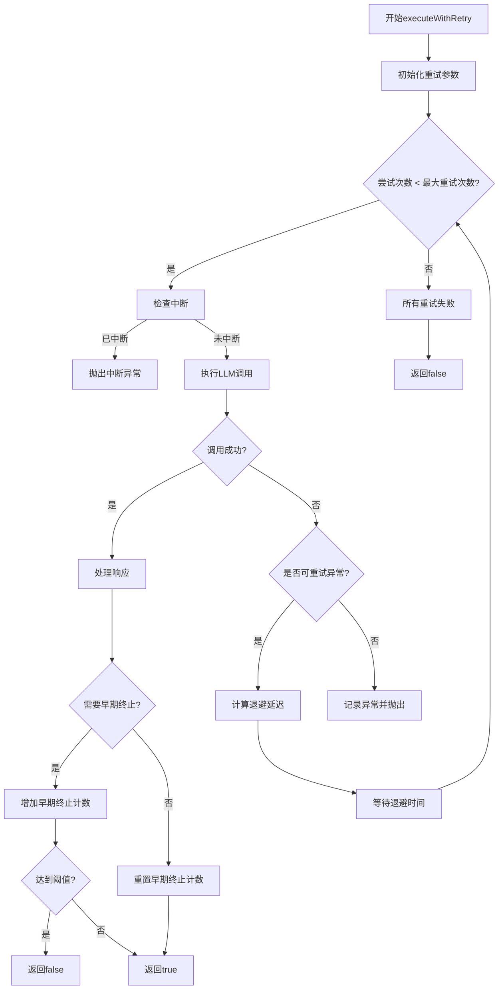
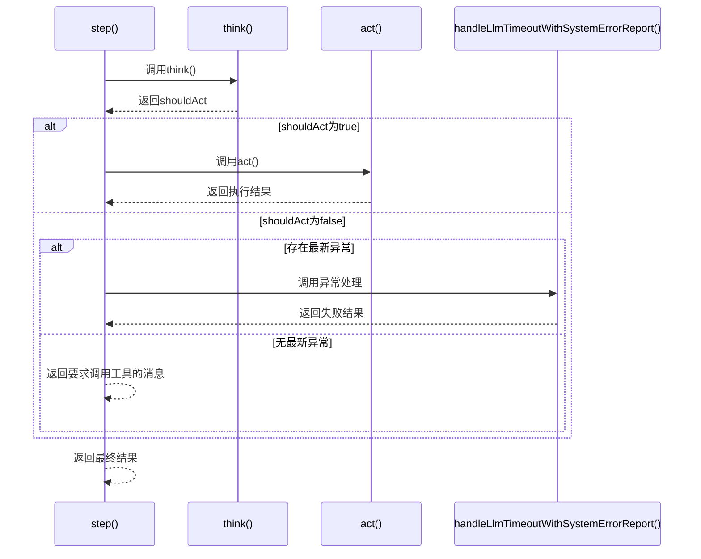
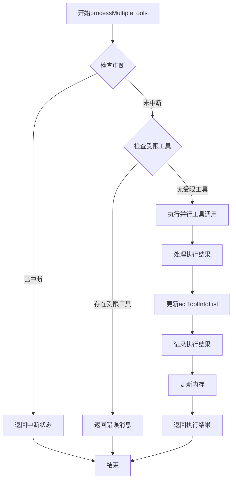
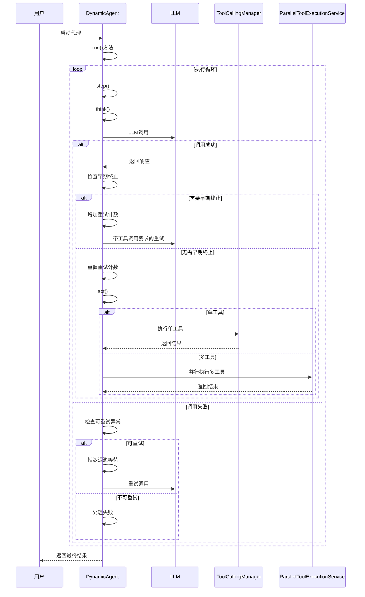
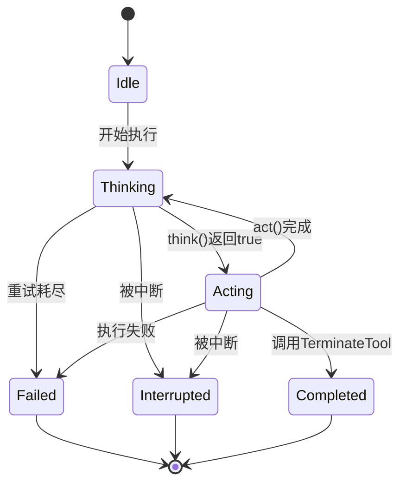

# 执行流程配置

<cite>
**本文档引用的文件**  
- [DynamicAgent.java](file://src/main/java/com/alibaba/cloud/ai/lynxe/agent/DynamicAgent.java)
- [BaseAgent.java](file://src/main/java/com/alibaba/cloud/ai/lynxe/agent/BaseAgent.java)
- [ReActAgent.java](file://src/main/java/com/alibaba/cloud/ai/lynxe/agent/ReActAgent.java)
- [ParallelToolExecutionService.java](file://src/main/java/com/alibaba/cloud/ai/lynxe/runtime/service/ParallelToolExecutionService.java)
- [AgentInterruptionHelper.java](file://src/main/java/com/alibaba/cloud/ai/lynxe/runtime/service/AgentInterruptionHelper.java)
- [ToolCallbackProvider.java](file://src/main/java/com/alibaba/cloud/ai/lynxe/agent/ToolCallbackProvider.java)
</cite>

## 目录
1. [简介](#简介)
2. [核心执行流程](#核心执行流程)
3. [think()方法执行逻辑](#think方法执行逻辑)
4. [executeWithRetry方法重试机制](#executewithretry方法重试机制)
5. [step()方法协调机制](#step方法协调机制)
6. [act()方法分支逻辑](#act方法分支逻辑)
7. [工具执行处理方法](#工具执行处理方法)
8. [执行流程时序图](#执行流程时序图)
9. [状态转换图](#状态转换图)
10. [性能优化建议](#性能优化建议)

## 简介
DynamicAgent是基于ReAct模式的智能代理，实现了思考与执行的交替循环。该代理通过LLM驱动决策过程，协调工具调用以完成复杂任务。本文档详细阐述了DynamicAgent的执行流程配置，包括重试机制、异常处理、早期终止检测等关键特性，为开发者提供全面的执行流程理解。

**Section sources**
- [DynamicAgent.java](file://src/main/java/com/alibaba/cloud/ai/lynxe/agent/DynamicAgent.java#L79-L1583)
- [ReActAgent.java](file://src/main/java/com/alibaba/cloud/ai/lynxe/agent/ReActAgent.java#L30-L97)

## 核心执行流程
DynamicAgent的执行流程遵循ReAct（Reasoning + Acting）模式，通过`run()`方法启动执行循环。该方法在`BaseAgent`类中定义，控制代理的整个生命周期，包括最大步数限制、状态管理和最终结果生成。

```mermaid
graph TD
A[开始] --> B{当前步骤 < 最大步骤?}
B --> |是| C[执行step()]
C --> D{step()状态}
D --> |IN_PROGRESS| E[继续循环]
D --> |COMPLETED| F[生成最终摘要]
D --> |INTERRUPTED| G[处理中断]
D --> |FAILED| H[处理失败]
F --> I[调用TerminateTool]
I --> J[结束]
G --> J
H --> J
E --> B
B --> |否| F
```

**Diagram sources**
- [BaseAgent.java](file://src/main/java/com/alibaba/cloud/ai/lynxe/agent/BaseAgent.java#L254-L332)

## think()方法执行逻辑
`think()`方法是DynamicAgent的核心决策机制，负责与LLM交互以确定下一步行动。该方法实现了重试机制、异常处理和早期终止检测。

```mermaid
flowchart TD
A[开始think()] --> B{检查中断}
B --> |已中断| C[抛出中断异常]
B --> |未中断| D[收集环境数据]
D --> E[执行重试逻辑]
E --> F{重试成功?}
F --> |是| G[返回true]
F --> |否| H[返回false]
C --> I[结束]
G --> I
H --> I
```

**Section sources**
- [DynamicAgent.java](file://src/main/java/com/alibaba/cloud/ai/lynxe/agent/DynamicAgent.java#L201-L230)

## executeWithRetry方法重试机制
`executeWithRetry()`方法实现了指数退避策略和网络异常重试逻辑，确保在临时故障情况下代理能够恢复执行。



**Section sources**
- [DynamicAgent.java](file://src/main/java/com/alibaba/cloud/ai/lynxe/agent/DynamicAgent.java#L232-L485)

### 指数退避策略
`calculateBackoffDelay()`方法实现了指数退避算法，计算重试之间的等待时间：
- 公式：`delay = min(2000 * 2^(attempt-1), 60000)`
- 基础延迟：2000毫秒
- 最大延迟：60000毫秒（60秒）
- 随着重试次数增加，延迟时间呈指数增长

### 网络异常重试逻辑
`isRetryableException()`方法识别可重试的网络异常，包括：
- DNS解析失败
- 连接超时
- 网络连接问题
- DNS错误
- WebClient请求异常
- DNS名称解析超时异常

**Section sources**
- [DynamicAgent.java](file://src/main/java/com/alibaba/cloud/ai/lynxe/agent/DynamicAgent.java#L487-L508)

## step()方法协调机制
`step()`方法协调思考与执行过程，处理LLM调用失败后的恢复策略。



**Section sources**
- [DynamicAgent.java](file://src/main/java/com/alibaba/cloud/ai/lynxe/agent/DynamicAgent.java#L511-L553)

## act()方法分支逻辑
`act()`方法根据工具调用数量决定执行分支，支持单工具和多工具执行，并有并行执行限制。

```mermaid
flowchart TD
A[开始act()] --> B{工具调用为空?}
B --> |是| C[返回进行中状态]
B --> |否| D{工具数量为1?}
D --> |是| E[调用processSingleTool()]
D --> |否| F[调用processMultipleTools()]
E --> G[返回执行结果]
F --> H[返回执行结果]
C --> G
G --> I[结束]
H --> I
```

### 单工具和多工具执行分支逻辑
- **单工具执行**：直接调用`processSingleTool()`处理单个工具调用
- **多工具执行**：调用`processMultipleTools()`处理多个工具调用
- **并行工具执行限制**：多工具执行不支持`TerminableTool`和`FormInputTool`，如果存在这些工具，会返回错误消息要求LLM重试

**Section sources**
- [DynamicAgent.java](file://src/main/java/com/alibaba/cloud/ai/lynxe/agent/DynamicAgent.java#L607-L648)

## 工具执行处理方法
### processSingleTool方法
`processSingleTool()`方法处理单个工具执行，包括工具结果处理和状态更新。

**Section sources**
- [DynamicAgent.java](file://src/main/java/com/alibaba/cloud/ai/lynxe/agent/DynamicAgent.java#L655-L759)

### processMultipleTools方法
`processMultipleTools()`方法处理多个工具的并行执行，利用`ParallelToolExecutionService`实现并发执行。



**Section sources**
- [DynamicAgent.java](file://src/main/java/com/alibaba/cloud/ai/lynxe/agent/DynamicAgent.java#L776-L870)
- [ParallelToolExecutionService.java](file://src/main/java/com/alibaba/cloud/ai/lynxe/runtime/service/ParallelToolExecutionService.java#L40-L165)

## 执行流程时序图


**Diagram sources**
- [DynamicAgent.java](file://src/main/java/com/alibaba/cloud/ai/lynxe/agent/DynamicAgent.java#L1313-L1315)
- [BaseAgent.java](file://src/main/java/com/alibaba/cloud/ai/lynxe/agent/BaseAgent.java#L254-L332)

## 状态转换图


**Diagram sources**
- [DynamicAgent.java](file://src/main/java/com/alibaba/cloud/ai/lynxe/agent/DynamicAgent.java#L511-L553)
- [BaseAgent.java](file://src/main/java/com/alibaba/cloud/ai/lynxe/agent/BaseAgent.java#L268-L270)

## 性能优化建议
1. **合理设置重试次数**：根据实际网络环境调整最大重试次数，避免过度重试影响响应时间
2. **优化工具调用**：尽量减少不必要的工具调用，避免早期终止
3. **监控执行时间**：设置合理的超时时间，防止代理长时间挂起
4. **利用并行执行**：对于独立的工具调用，使用多工具并行执行提高效率
5. **管理内存使用**：定期清理不必要的记忆数据，防止内存泄漏
6. **监控中断状态**：在长时间操作中定期检查中断状态，提高响应性

**Section sources**
- [DynamicAgent.java](file://src/main/java/com/alibaba/cloud/ai/lynxe/agent/DynamicAgent.java#L232-L485)
- [ParallelToolExecutionService.java](file://src/main/java/com/alibaba/cloud/ai/lynxe/runtime/service/ParallelToolExecutionService.java#L40-L165)