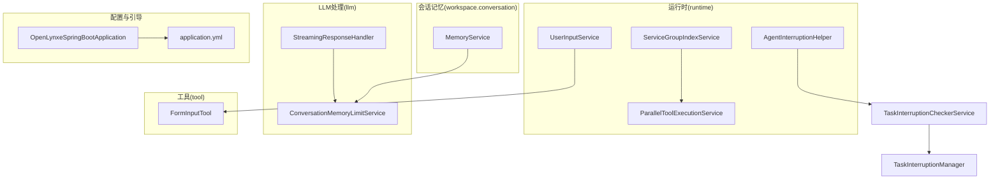
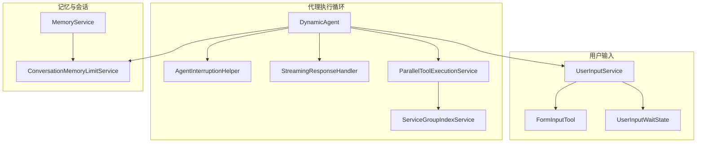
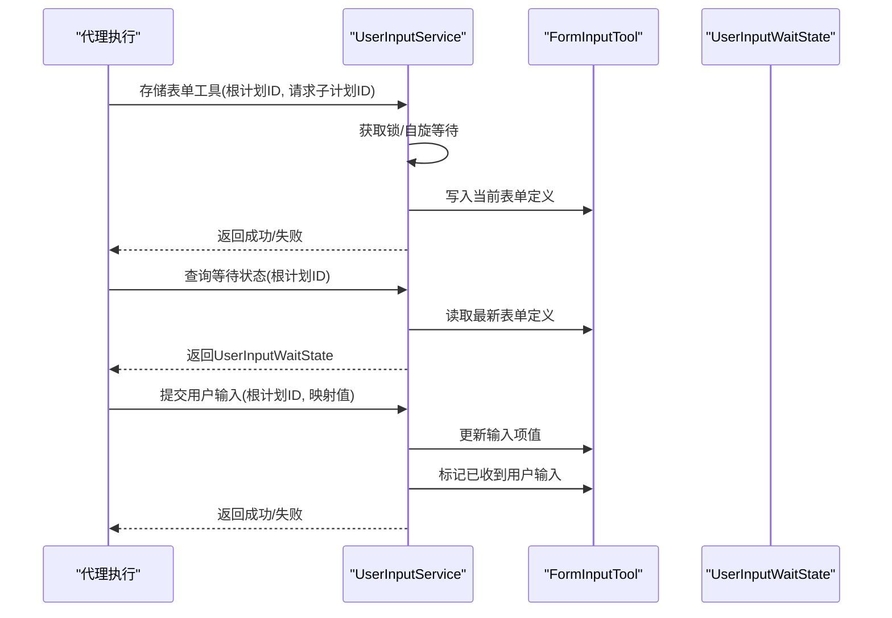
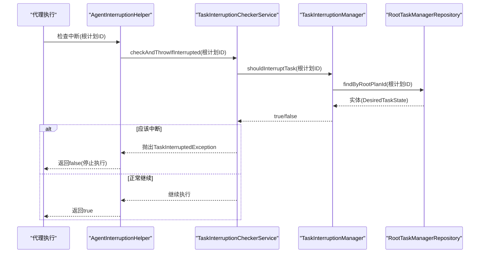
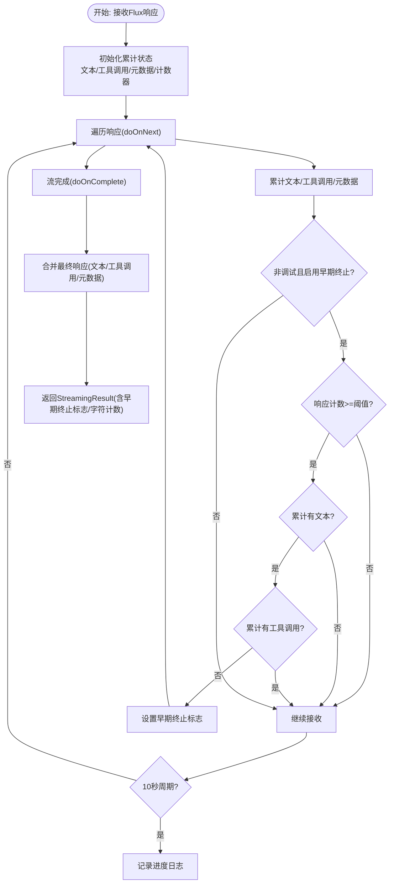
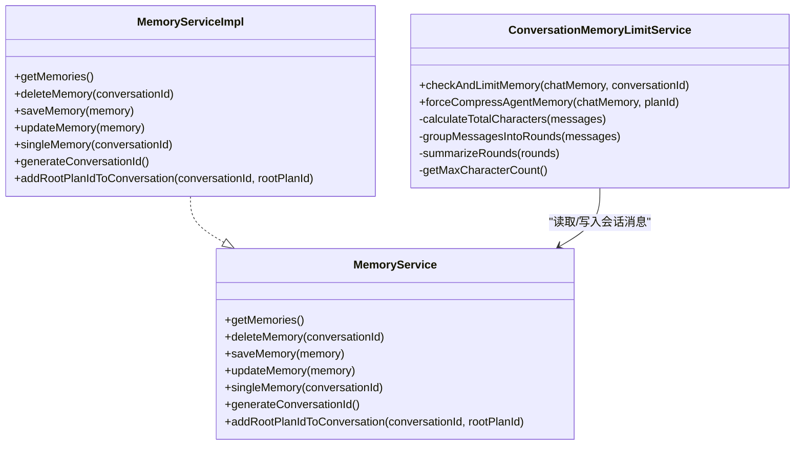
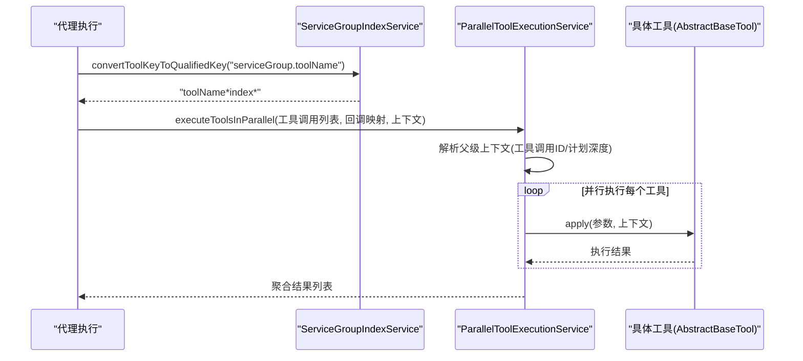
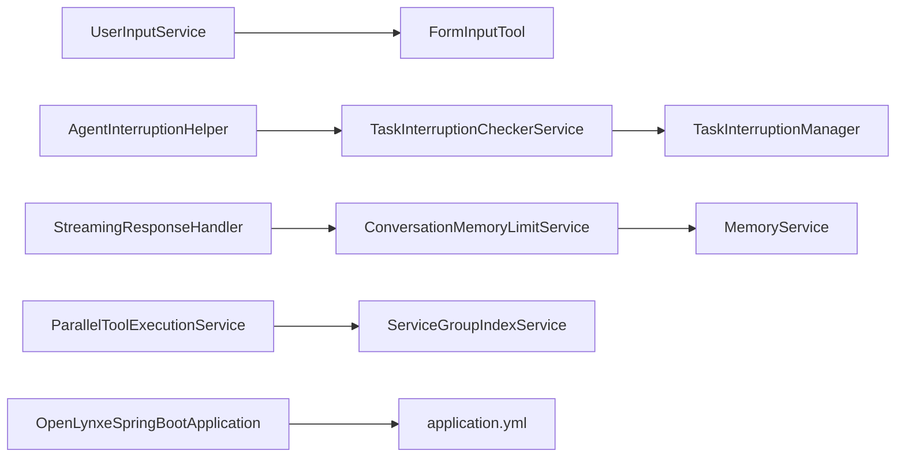

# 核心服务集成

<cite>
**本文引用的文件列表**
- [UserInputService.java](file://src/main/java/com/alibaba/cloud/ai/lynxe/runtime/service/UserInputService.java)
- [IUserInputService.java](file://src/main/java/com/alibaba/cloud/ai/lynxe/runtime/service/IUserInputService.java)
- [FormInputTool.java](file://src/main/java/com/alibaba/cloud/ai/lynxe/tool/FormInputTool.java)
- [UserInputWaitState.java](file://src/main/java/com/alibaba/cloud/ai/lynxe/runtime/entity/vo/UserInputWaitState.java)
- [AgentInterruptionHelper.java](file://src/main/java/com/alibaba/cloud/ai/lynxe/runtime/service/AgentInterruptionHelper.java)
- [TaskInterruptionCheckerService.java](file://src/main/java/com/alibaba/cloud/ai/lynxe/runtime/service/TaskInterruptionCheckerService.java)
- [TaskInterruptionManager.java](file://src/main/java/com/alibaba/cloud/ai/lynxe/runtime/service/TaskInterruptionManager.java)
- [StreamingResponseHandler.java](file://src/main/java/com/alibaba/cloud/ai/lynxe/llm/StreamingResponseHandler.java)
- [ConversationMemoryLimitService.java](file://src/main/java/com/alibaba/cloud/ai/lynxe/llm/ConversationMemoryLimitService.java)
- [ServiceGroupIndexService.java](file://src/main/java/com/alibaba/cloud/ai/lynxe/runtime/service/ServiceGroupIndexService.java)
- [ParallelToolExecutionService.java](file://src/main/java/com/alibaba/cloud/ai/lynxe/runtime/service/ParallelToolExecutionService.java)
- [MemoryService.java](file://src/main/java/com/alibaba/cloud/ai/lynxe/workspace/conversation/service/MemoryService.java)
- [MemoryServiceImpl.java](file://src/main/java/com/alibaba/cloud/ai/lynxe/workspace/conversation/service/MemoryServiceImpl.java)
- [application.yml](file://src/main/resources/application.yml)
- [OpenLynxeSpringBootApplication.java](file://src/main/java/com/alibaba/cloud/ai/lynxe/OpenLynxeSpringBootApplication.java)
</cite>

## 目录
1. [简介](#简介)
2. [项目结构](#项目结构)
3. [核心组件](#核心组件)
4. [架构总览](#架构总览)
5. [详细组件分析](#详细组件分析)
6. [依赖关系分析](#依赖关系分析)
7. [性能考量](#性能考量)
8. [故障排查指南](#故障排查指南)
9. [结论](#结论)
10. [附录](#附录)

## 简介
本文件聚焦于DynamicAgent核心服务的集成与协同，围绕以下关键能力展开：
- 用户输入处理：FormInputTool与UserInputService的协作，表单输入工具的管理、用户响应收集与状态流转。
- 中断检查：AgentInterruptionHelper通过TaskInterruptionCheckerService实现代理执行中断检查与信号传播。
- 流式响应：StreamingResponseHandler对LLM流式输出进行聚合、进度日志与早期终止策略。
- 对话记忆：ConversationMemoryLimitService对对话记忆进行容量控制与压缩；MemoryService负责会话维度的记忆持久化与检索。
- 工具编排：ServiceGroupIndexService为工具分组索引提供一致映射；ParallelToolExecutionService支持并行工具执行。

## 项目结构
动态代理运行时涉及的服务主要分布在runtime、llm、tool、workspace.conversation等包中，配合Spring Boot启动类与全局配置文件共同构成核心执行链路。

图表来源
- [UserInputService.java](file://src/main/java/com/alibaba/cloud/ai/lynxe/runtime/service/UserInputService.java#L1-L246)
- [AgentInterruptionHelper.java](file://src/main/java/com/alibaba/cloud/ai/lynxe/runtime/service/AgentInterruptionHelper.java#L1-L85)
- [TaskInterruptionCheckerService.java](file://src/main/java/com/alibaba/cloud/ai/lynxe/runtime/service/TaskInterruptionCheckerService.java#L1-L114)
- [TaskInterruptionManager.java](file://src/main/java/com/alibaba/cloud/ai/lynxe/runtime/service/TaskInterruptionManager.java#L1-L67)
- [StreamingResponseHandler.java](file://src/main/java/com/alibaba/cloud/ai/lynxe/llm/StreamingResponseHandler.java#L1-L565)
- [ConversationMemoryLimitService.java](file://src/main/java/com/alibaba/cloud/ai/lynxe/llm/ConversationMemoryLimitService.java#L1-L540)
- [ServiceGroupIndexService.java](file://src/main/java/com/alibaba/cloud/ai/lynxe/runtime/service/ServiceGroupIndexService.java#L1-L133)
- [ParallelToolExecutionService.java](file://src/main/java/com/alibaba/cloud/ai/lynxe/runtime/service/ParallelToolExecutionService.java#L1-L236)
- [MemoryService.java](file://src/main/java/com/alibaba/cloud/ai/lynxe/workspace/conversation/service/MemoryService.java#L1-L53)
- [OpenLynxeSpringBootApplication.java](file://src/main/java/com/alibaba/cloud/ai/lynxe/OpenLynxeSpringBootApplication.java#L1-L71)
- [application.yml](file://src/main/resources/application.yml#L1-L98)

章节来源
- [OpenLynxeSpringBootApplication.java](file://src/main/java/com/alibaba/cloud/ai/lynxe/OpenLynxeSpringBootApplication.java#L1-L71)
- [application.yml](file://src/main/resources/application.yml#L1-L98)

## 核心组件
- 用户输入处理：FormInputTool定义表单参数与状态；UserInputService负责表单工具的独占存储、等待状态构建、用户输入提交与完成清理。
- 中断检查：AgentInterruptionHelper封装TaskInterruptionCheckerService，提供“继续/抛异常/查询状态”三类检查方法；TaskInterruptionCheckerService基于TaskInterruptionManager读取数据库状态决定是否中断。
- 流式响应：StreamingResponseHandler聚合流式ChatResponse，周期性记录进度日志，支持调试模式与非调试模式下的“思考-only”早期终止策略，并统计字符计数与用量元数据。
- 对话记忆：ConversationMemoryLimitService按字符上限与最近窗口策略压缩历史，MemoryService提供会话维度的持久化与根计划ID关联。
- 工具编排：ServiceGroupIndexService提供serviceGroup到索引的一致映射与键转换；ParallelToolExecutionService并行执行多个工具调用，传递上下文与工具调用ID。

章节来源
- [UserInputService.java](file://src/main/java/com/alibaba/cloud/ai/lynxe/runtime/service/UserInputService.java#L1-L246)
- [IUserInputService.java](file://src/main/java/com/alibaba/cloud/ai/lynxe/runtime/service/IUserInputService.java#L1-L77)
- [FormInputTool.java](file://src/main/java/com/alibaba/cloud/ai/lynxe/tool/FormInputTool.java#L1-L581)
- [UserInputWaitState.java](file://src/main/java/com/alibaba/cloud/ai/lynxe/runtime/entity/vo/UserInputWaitState.java#L1-L84)
- [AgentInterruptionHelper.java](file://src/main/java/com/alibaba/cloud/ai/lynxe/runtime/service/AgentInterruptionHelper.java#L1-L85)
- [TaskInterruptionCheckerService.java](file://src/main/java/com/alibaba/cloud/ai/lynxe/runtime/service/TaskInterruptionCheckerService.java#L1-L114)
- [TaskInterruptionManager.java](file://src/main/java/com/alibaba/cloud/ai/lynxe/runtime/service/TaskInterruptionManager.java#L1-L67)
- [StreamingResponseHandler.java](file://src/main/java/com/alibaba/cloud/ai/lynxe/llm/StreamingResponseHandler.java#L1-L565)
- [ConversationMemoryLimitService.java](file://src/main/java/com/alibaba/cloud/ai/lynxe/llm/ConversationMemoryLimitService.java#L1-L540)
- [MemoryService.java](file://src/main/java/com/alibaba/cloud/ai/lynxe/workspace/conversation/service/MemoryService.java#L1-L53)
- [MemoryServiceImpl.java](file://src/main/java/com/alibaba/cloud/ai/lynxe/workspace/conversation/service/MemoryServiceImpl.java#L93-L165)
- [ServiceGroupIndexService.java](file://src/main/java/com/alibaba/cloud/ai/lynxe/runtime/service/ServiceGroupIndexService.java#L1-L133)
- [ParallelToolExecutionService.java](file://src/main/java/com/alibaba/cloud/ai/lynxe/runtime/service/ParallelToolExecutionService.java#L1-L236)

## 架构总览
下图展示了DynamicAgent核心服务之间的交互关系与数据流。

图表来源
- [AgentInterruptionHelper.java](file://src/main/java/com/alibaba/cloud/ai/lynxe/runtime/service/AgentInterruptionHelper.java#L1-L85)
- [StreamingResponseHandler.java](file://src/main/java/com/alibaba/cloud/ai/lynxe/llm/StreamingResponseHandler.java#L1-L565)
- [ParallelToolExecutionService.java](file://src/main/java/com/alibaba/cloud/ai/lynxe/runtime/service/ParallelToolExecutionService.java#L1-L236)
- [ServiceGroupIndexService.java](file://src/main/java/com/alibaba/cloud/ai/lynxe/runtime/service/ServiceGroupIndexService.java#L1-L133)
- [UserInputService.java](file://src/main/java/com/alibaba/cloud/ai/lynxe/runtime/service/UserInputService.java#L1-L246)
- [FormInputTool.java](file://src/main/java/com/alibaba/cloud/ai/lynxe/tool/FormInputTool.java#L1-L581)
- [UserInputWaitState.java](file://src/main/java/com/alibaba/cloud/ai/lynxe/runtime/entity/vo/UserInputWaitState.java#L1-L84)
- [ConversationMemoryLimitService.java](file://src/main/java/com/alibaba/cloud/ai/lynxe/llm/ConversationMemoryLimitService.java#L1-L540)
- [MemoryService.java](file://src/main/java/com/alibaba/cloud/ai/lynxe/workspace/conversation/service/MemoryService.java#L1-L53)

## 详细组件分析

### 用户输入处理：FormInputTool与UserInputService
- 表单输入工具管理
  - FormInputTool定义输入项类型、必填、选项等参数结构，并维护当前表单定义与输入状态。其运行时将当前表单定义作为结果返回，进入“等待用户输入”状态。
  - UserInputService以根计划ID为键，使用独占锁与自旋等待机制确保同一根计划仅允许一个表单处于等待状态；当新表单到来时，若已有表单未完成，则等待其完成后再存入新表单。
- 用户响应收集与处理
  - UserInputService根据表单最新定义生成UserInputWaitState，包含标题、描述与输入项清单；前端可据此渲染表单UI。
  - 当用户提交输入后，UserInputService将提交值写入FormInputTool对应输入项，并标记已收到用户输入，结束等待状态。
- 关键流程时序

图表来源
- [UserInputService.java](file://src/main/java/com/alibaba/cloud/ai/lynxe/runtime/service/UserInputService.java#L1-L246)
- [FormInputTool.java](file://src/main/java/com/alibaba/cloud/ai/lynxe/tool/FormInputTool.java#L1-L581)
- [UserInputWaitState.java](file://src/main/java/com/alibaba/cloud/ai/lynxe/runtime/entity/vo/UserInputWaitState.java#L1-L84)

章节来源
- [UserInputService.java](file://src/main/java/com/alibaba/cloud/ai/lynxe/runtime/service/UserInputService.java#L1-L246)
- [IUserInputService.java](file://src/main/java/com/alibaba/cloud/ai/lynxe/runtime/service/IUserInputService.java#L1-L77)
- [FormInputTool.java](file://src/main/java/com/alibaba/cloud/ai/lynxe/tool/FormInputTool.java#L1-L581)
- [UserInputWaitState.java](file://src/main/java/com/alibaba/cloud/ai/lynxe/runtime/entity/vo/UserInputWaitState.java#L1-L84)

### 代理执行中断检查：AgentInterruptionHelper与TaskInterruptionCheckerService
- 中断检查机制
  - AgentInterruptionHelper封装TaskInterruptionCheckerService，提供三种检查方式：
    - 继续/停止：在执行循环关键点调用，若检测到中断则返回false并停止执行。
    - 抛异常：立即抛出TaskInterruptedException，用于需要快速中断的场景。
    - 查询状态：返回DesiredTaskState，便于上层决策。
  - TaskInterruptionCheckerService基于TaskInterruptionManager读取数据库实体，判断目标任务状态是否应停止/取消/暂停。
- 中断信号传播
  - 数据源来自TaskInterruptionManager对RootTaskManagerRepository的查询；当状态满足条件时，抛出异常或返回中断标志，驱动代理执行循环提前退出。

图表来源
- [AgentInterruptionHelper.java](file://src/main/java/com/alibaba/cloud/ai/lynxe/runtime/service/AgentInterruptionHelper.java#L1-L85)
- [TaskInterruptionCheckerService.java](file://src/main/java/com/alibaba/cloud/ai/lynxe/runtime/service/TaskInterruptionCheckerService.java#L1-L114)
- [TaskInterruptionManager.java](file://src/main/java/com/alibaba/cloud/ai/lynxe/runtime/service/TaskInterruptionManager.java#L1-L67)

章节来源
- [AgentInterruptionHelper.java](file://src/main/java/com/alibaba/cloud/ai/lynxe/runtime/service/AgentInterruptionHelper.java#L1-L85)
- [TaskInterruptionCheckerService.java](file://src/main/java/com/alibaba/cloud/ai/lynxe/runtime/service/TaskInterruptionCheckerService.java#L1-L114)
- [TaskInterruptionManager.java](file://src/main/java/com/alibaba/cloud/ai/lynxe/runtime/service/TaskInterruptionManager.java#L1-L67)

### 流式响应处理：StreamingResponseHandler
- 响应流聚合与进度日志
  - 使用Reactor Flux聚合多段响应，累计文本内容、工具调用与元数据；每10秒输出一次进度日志，包含响应数量、字符数、工具调用数与预览。
- 早期终止策略
  - 在非调试模式且启用早期终止时，当累积文本存在而无工具调用达到一定次数阈值，触发“思考-only”早期终止，停止流并构造最终响应。
- 性能与可观测性
  - 统计prompt/completion/total token用量，记录错误与取消事件，支持trace记录器输出完整请求/响应信息。

图表来源
- [StreamingResponseHandler.java](file://src/main/java/com/alibaba/cloud/ai/lynxe/llm/StreamingResponseHandler.java#L1-L565)

章节来源
- [StreamingResponseHandler.java](file://src/main/java/com/alibaba/cloud/ai/lynxe/llm/StreamingResponseHandler.java#L1-L565)

### 对话记忆管理：ConversationMemoryLimitService与MemoryService
- ConversationMemoryLimitService
  - 将消息按对话轮次分组，保留最近约5000字符（至少一整轮），其余旧轮次压缩为3000-4000字符的UserMessage摘要，再重建内存。
  - 支持强制压缩以打破重复工具调用结果导致的循环。
- MemoryService
  - 提供会话维度的增删改查与根计划ID集合管理；MemoryServiceImpl生成唯一会话ID并持久化。

图表来源
- [ConversationMemoryLimitService.java](file://src/main/java/com/alibaba/cloud/ai/lynxe/llm/ConversationMemoryLimitService.java#L1-L540)
- [MemoryService.java](file://src/main/java/com/alibaba/cloud/ai/lynxe/workspace/conversation/service/MemoryService.java#L1-L53)
- [MemoryServiceImpl.java](file://src/main/java/com/alibaba/cloud/ai/lynxe/workspace/conversation/service/MemoryServiceImpl.java#L93-L165)

章节来源
- [ConversationMemoryLimitService.java](file://src/main/java/com/alibaba/cloud/ai/lynxe/llm/ConversationMemoryLimitService.java#L1-L540)
- [MemoryService.java](file://src/main/java/com/alibaba/cloud/ai/lynxe/workspace/conversation/service/MemoryService.java#L1-L53)
- [MemoryServiceImpl.java](file://src/main/java/com/alibaba/cloud/ai/lynxe/workspace/conversation/service/MemoryServiceImpl.java#L93-L165)

### 工具分组索引与并行执行：ServiceGroupIndexService与ParallelToolExecutionService
- ServiceGroupIndexService
  - 为serviceGroup分配唯一索引并缓存；支持将“serviceGroup.toolName”转换为“toolName*index*”格式，保证后端执行一致性。
- ParallelToolExecutionService
  - 并行执行多个工具调用，从父级ToolContext提取工具调用ID与计划深度，统一生成或复用工具调用ID，聚合执行结果。

图表来源
- [ServiceGroupIndexService.java](file://src/main/java/com/alibaba/cloud/ai/lynxe/runtime/service/ServiceGroupIndexService.java#L1-L133)
- [ParallelToolExecutionService.java](file://src/main/java/com/alibaba/cloud/ai/lynxe/runtime/service/ParallelToolExecutionService.java#L1-L236)

章节来源
- [ServiceGroupIndexService.java](file://src/main/java/com/alibaba/cloud/ai/lynxe/runtime/service/ServiceGroupIndexService.java#L1-L133)
- [ParallelToolExecutionService.java](file://src/main/java/com/alibaba/cloud/ai/lynxe/runtime/service/ParallelToolExecutionService.java#L1-L236)

## 依赖关系分析
- 组件耦合与内聚
  - UserInputService与FormInputTool强耦合于表单状态管理；UserInputService通过IUserInputService接口暴露能力，利于替换实现。
  - AgentInterruptionHelper与TaskInterruptionCheckerService/TaskInterruptionManager形成清晰的职责分离：辅助组件负责对外接口，检查器负责业务判定，管理器负责数据访问。
  - StreamingResponseHandler与LlmTraceRecorder、事件发布器协作，增强可观测性与错误处理。
  - ConversationMemoryLimitService依赖LynxeProperties与LlmService，MemoryService提供会话持久化支撑。
  - ParallelToolExecutionService依赖工具回调上下文与PlanIdDispatcher生成工具调用ID，ServiceGroupIndexService提供键转换。
- 外部依赖与集成点
  - Spring AI ChatResponse模型、Reactor Flux、Jackson等外部库被广泛使用。
  - 应用通过application.yml配置计划轮询、文件上传、命名空间与序列化策略等。

图表来源
- [UserInputService.java](file://src/main/java/com/alibaba/cloud/ai/lynxe/runtime/service/UserInputService.java#L1-L246)
- [FormInputTool.java](file://src/main/java/com/alibaba/cloud/ai/lynxe/tool/FormInputTool.java#L1-L581)
- [AgentInterruptionHelper.java](file://src/main/java/com/alibaba/cloud/ai/lynxe/runtime/service/AgentInterruptionHelper.java#L1-L85)
- [TaskInterruptionCheckerService.java](file://src/main/java/com/alibaba/cloud/ai/lynxe/runtime/service/TaskInterruptionCheckerService.java#L1-L114)
- [TaskInterruptionManager.java](file://src/main/java/com/alibaba/cloud/ai/lynxe/runtime/service/TaskInterruptionManager.java#L1-L67)
- [StreamingResponseHandler.java](file://src/main/java/com/alibaba/cloud/ai/lynxe/llm/StreamingResponseHandler.java#L1-L565)
- [ConversationMemoryLimitService.java](file://src/main/java/com/alibaba/cloud/ai/lynxe/llm/ConversationMemoryLimitService.java#L1-L540)
- [MemoryService.java](file://src/main/java/com/alibaba/cloud/ai/lynxe/workspace/conversation/service/MemoryService.java#L1-L53)
- [ServiceGroupIndexService.java](file://src/main/java/com/alibaba/cloud/ai/lynxe/runtime/service/ServiceGroupIndexService.java#L1-L133)
- [ParallelToolExecutionService.java](file://src/main/java/com/alibaba/cloud/ai/lynxe/runtime/service/ParallelToolExecutionService.java#L1-L236)
- [OpenLynxeSpringBootApplication.java](file://src/main/java/com/alibaba/cloud/ai/lynxe/OpenLynxeSpringBootApplication.java#L1-L71)
- [application.yml](file://src/main/resources/application.yml#L1-L98)

章节来源
- [application.yml](file://src/main/resources/application.yml#L1-L98)
- [OpenLynxeSpringBootApplication.java](file://src/main/java/com/alibaba/cloud/ai/lynxe/OpenLynxeSpringBootApplication.java#L1-L71)

## 性能考量
- 流式响应
  - 使用原子引用与同步列表减少并发竞争；10秒周期日志避免频繁IO；早期终止策略在非调试模式下显著降低无效输出。
- 表单等待
  - 自旋等待采用固定检查间隔与超时控制，避免长时间阻塞；独占锁保障同一根计划仅有一个表单等待。
- 工具并行
  - CompletableFuture并行执行工具调用，统一上下文传递；解析JSON参数时容错处理，避免因参数格式问题导致整体失败。
- 记忆压缩
  - 对话轮次分组与字符计数计算，优先保留最近对话，旧轮次摘要长度可控，防止内存膨胀。

[本节为通用指导，不直接分析具体文件]

## 故障排查指南
- 中断相关
  - 若代理执行未按预期中断，检查TaskInterruptionManager是否正确读取数据库状态，确认RootTaskManagerRepository中是否存在对应根计划ID的实体。
  - 使用AgentInterruptionHelper的“查询状态”方法获取DesiredTaskState，定位中断原因。
- 流式响应
  - 出现API错误时，查看StreamingResponseHandler的日志输出与trace记录器，关注WebClientResponseException的响应体与状态码。
  - 非调试模式下出现“思考-only”提前终止，确认是否期望该行为；必要时调整启用早期终止的条件。
- 表单输入
  - 提交用户输入后状态未更新，检查UserInputService的submitUserInputs路径是否被调用，以及FormInputTool的状态切换逻辑。
  - 表单等待超时，确认等待时间配置与自旋等待逻辑。
- 记忆管理
  - 对话记忆过大导致性能下降，确认ConversationMemoryLimitService的字符上限与摘要策略是否生效；检查MemoryService的会话ID生成与持久化。

章节来源
- [TaskInterruptionCheckerService.java](file://src/main/java/com/alibaba/cloud/ai/lynxe/runtime/service/TaskInterruptionCheckerService.java#L1-L114)
- [TaskInterruptionManager.java](file://src/main/java/com/alibaba/cloud/ai/lynxe/runtime/service/TaskInterruptionManager.java#L1-L67)
- [StreamingResponseHandler.java](file://src/main/java/com/alibaba/cloud/ai/lynxe/llm/StreamingResponseHandler.java#L1-L565)
- [UserInputService.java](file://src/main/java/com/alibaba/cloud/ai/lynxe/runtime/service/UserInputService.java#L1-L246)
- [FormInputTool.java](file://src/main/java/com/alibaba/cloud/ai/lynxe/tool/FormInputTool.java#L1-L581)
- [ConversationMemoryLimitService.java](file://src/main/java/com/alibaba/cloud/ai/lynxe/llm/ConversationMemoryLimitService.java#L1-L540)
- [MemoryService.java](file://src/main/java/com/alibaba/cloud/ai/lynxe/workspace/conversation/service/MemoryService.java#L1-L53)

## 结论
DynamicAgent核心服务通过明确的职责划分与稳健的实现策略，实现了从用户输入、中断检查、流式响应到记忆管理与工具编排的全链路协同。UserInputService与FormInputTool确保表单输入的可靠收集；AgentInterruptionHelper与TaskInterruptionCheckerService保障执行安全可控；StreamingResponseHandler在性能与可观测性之间取得平衡；ConversationMemoryLimitService与MemoryService维持对话历史的健康规模；ServiceGroupIndexService与ParallelToolExecutionService提升工具编排的灵活性与效率。

[本节为总结性内容，不直接分析具体文件]

## 附录
- 服务集成配置要点
  - application.yml中包含计划轮询、文件上传、命名空间与序列化等关键配置，建议结合实际部署环境调整。
  - 启动类OpenLynxeSpringBootApplication启用调度、JPA与Feign客户端扫描，确保相关组件可用。

章节来源
- [application.yml](file://src/main/resources/application.yml#L1-L98)
- [OpenLynxeSpringBootApplication.java](file://src/main/java/com/alibaba/cloud/ai/lynxe/OpenLynxeSpringBootApplication.java#L1-L71)