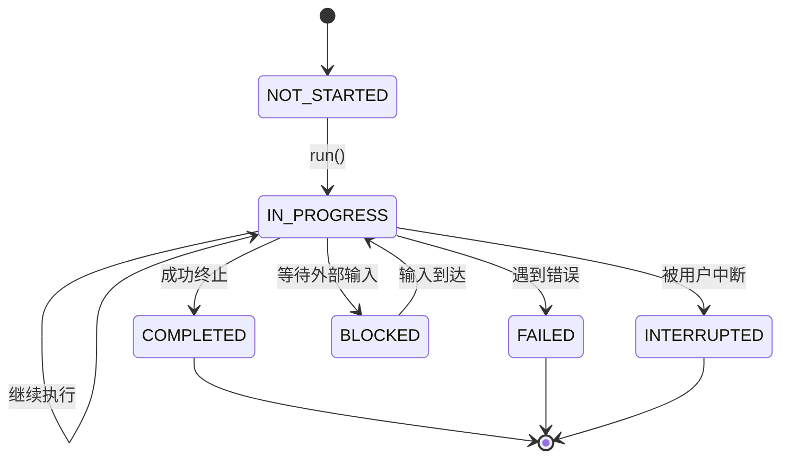

# 代理状态定义

<cite>
**本文档引用的文件**
- [AgentState.java](file://src/main/java/com/alibaba/cloud/ai/lynxe/agent/AgentState.java)
- [BaseAgent.java](file://src/main/java/com/alibaba/cloud/ai/lynxe/agent/BaseAgent.java)
- [DynamicAgent.java](file://src/main/java/com/alibaba/cloud/ai/lynxe/agent/DynamicAgent.java)
- [NewRepoPlanExecutionRecorder.java](file://src/main/java/com/alibaba/cloud/ai/lynxe/recorder/service/NewRepoPlanExecutionRecorder.java)
- [JacksonConfig.java](file://src/main/java/com/alibaba/cloud/ai/lynxe/config/JacksonConfig.java)
- [ExecutionDetails.vue](file://ui-vue3/src/components/chat/ExecutionDetails.vue)
- [RecursiveSubPlan.vue](file://ui-vue3/src/components/chat/RecursiveSubPlan.vue)
</cite>

## 目录
1. [引言](#引言)
2. [代理状态枚举定义](#代理状态枚举定义)
3. [核心状态语义与使用场景](#核心状态语义与使用场景)
4. [状态序列化与反序列化](#状态序列化与反序列化)
5. [状态生命周期与转换](#状态生命周期与转换)
6. [状态访问与比较操作](#状态访问与比较操作)
7. [前端状态可视化](#前端状态可视化)
8. [设计原则与最佳实践](#设计原则与最佳实践)

## 引言

代理状态（AgentState）是AI代理执行过程中的核心状态机，用于精确描述代理在其生命周期中的不同阶段。本文档全面介绍`AgentState`枚举类型中定义的六个核心状态：`NOT_STARTED`（未开始）、`IN_PROGRESS`（进行中）、`COMPLETED`（已完成）、`BLOCKED`（已阻塞）、`FAILED`（失败）和`INTERRUPTED`（已中断）的语义含义、使用场景、序列化方式以及在系统中的具体应用。通过深入分析代码实现和使用模式，为开发者提供正确引用和判断代理状态的最佳实践指导。

## 代理状态枚举定义

`AgentState`是一个Java枚举类型，定义了AI代理在执行过程中可能处于的六种离散状态。每个枚举值都关联一个字符串表示，用于序列化和外部交互。

```java
public enum AgentState {
    NOT_STARTED("not_started"), 
    IN_PROGRESS("in_progress"), 
    COMPLETED("completed"), 
    BLOCKED("blocked"),
    FAILED("failed"), 
    INTERRUPTED("interrupted");

    private final String state;

    AgentState(String state) {
        this.state = state;
    }

    @Override
    public String toString() {
        return state;
    }
}
```

该枚举的设计遵循了清晰的命名约定，使用大写蛇形命名法（SNAKE_CASE）作为枚举常量名，并使用小写蛇形命名法（snake_case）作为其字符串表示，确保了在JSON序列化等场景下的可读性和一致性。

**本节来源**
- [AgentState.java](file://src/main/java/com/alibaba/cloud/ai/lynxe/agent/AgentState.java#L18-L34)

## 核心状态语义与使用场景

### NOT_STARTED (未开始)

**语义含义**: 代理已创建但尚未开始执行任何步骤。这是代理生命周期的初始状态。

**使用场景**: 当一个新的代理实例被初始化，但`run()`方法尚未被调用时，其状态为`NOT_STARTED`。它表示代理已准备好，但执行流程还未启动。

### IN_PROGRESS (进行中)

**语义含义**: 代理正在执行其任务。这是代理在执行单个步骤或整个计划过程中的活动状态。

**使用场景**: 在`DynamicAgent`的`act()`方法中，当工具调用为空时，会返回`IN_PROGRESS`状态，提示需要重试。此状态表示代理仍在处理中，需要继续执行后续步骤。

```java
if (toolCalls == null || toolCalls.isEmpty()) {
    return new AgentExecResult("tool call is empty , please retry", AgentState.IN_PROGRESS);
}
```

**本节来源**
- [DynamicAgent.java](file://src/main/java/com/alibaba/cloud/ai/lynxe/agent/DynamicAgent.java#L619-L620)

### COMPLETED (已完成)

**语义含义**: 代理已成功完成其所有任务，达到了预期目标。

**使用场景**: 当代理执行了`TerminateTool`或任何`TerminableTool`时，会将状态设置为`COMPLETED`，表示任务已成功终止。在`BaseAgent`的主执行循环中，一旦检测到`COMPLETED`状态，就会退出循环并进行最终处理。

```java
if (stepState == AgentState.COMPLETED || stepState == AgentState.INTERRUPTED || stepState == AgentState.FAILED) {
    // ... 退出执行循环
}
```

**本节来源**
- [DynamicAgent.java](file://src/main/java/com/alibaba/cloud/ai/lynxe/agent/DynamicAgent.java#L711-L713)
- [BaseAgent.java](file://src/main/java/com/alibaba/cloud/ai/lynxe/agent/BaseAgent.java#L269-L270)

### BLOCKED (已阻塞)

**语义含义**: 代理的执行被外部条件阻塞，无法继续前进，但并非由于错误。

**使用场景**: 此状态通常用于表示代理正在等待外部输入或资源。在`NewRepoPlanExecutionRecorder`中，`BLOCKED`状态被映射为`FINISHED`，表明该执行阶段已结束，但整体计划可能因等待而暂停。

```java
case BLOCKED:
case FAILED:
    return ExecutionStatusEntity.FINISHED; // Both blocked and failed are considered finished states
```

**本节来源**
- [NewRepoPlanExecutionRecorder.java](file://src/main/java/com/alibaba/cloud/ai/lynxe/recorder/service/NewRepoPlanExecutionRecorder.java#L268-L271)

### FAILED (失败)

**语义含义**: 代理在执行过程中遇到了不可恢复的错误，导致任务无法完成。

**使用场景**: 当工具执行过程中抛出异常，且无法通过`SystemErrorReportTool`等机制恢复时，代理会进入`FAILED`状态。在`BaseAgent`的`run()`方法中，`FAILED`状态会触发`handleFailedExecution()`方法进行错误处理。

```java
else if (stepState == AgentState.FAILED) {
    handleFailedExecution(results);
}
```

**本节来源**
- [BaseAgent.java](file://src/main/java/com/alibaba/cloud/ai/lynxe/agent/BaseAgent.java#L280-L281)

### INTERRUPTED (已中断)

**语义含义**: 代理的执行被外部请求（如用户取消）主动中断。

**使用场景**: 当`agentInterruptionHelper`检测到中断信号时，代理会立即返回`INTERRUPTED`状态。这允许系统优雅地停止执行，而不是让其继续运行。

```java
if (agentInterruptionHelper != null && !agentInterruptionHelper.checkInterruptionAndContinue(getRootPlanId())) {
    log.info("Agent {} action process interrupted for rootPlanId: {}", getName(), getRootPlanId());
    return new AgentExecResult("Action interrupted by user", AgentState.INTERRUPTED);
}
```

**本节来源**
- [DynamicAgent.java](file://src/main/java/com/alibaba/cloud/ai/lynxe/agent/DynamicAgent.java#L609-L611)

## 状态序列化与反序列化

`AgentState`的序列化主要通过其`toString()`方法实现，该方法返回预定义的字符串值（如`"in_progress"`）。这些字符串值在JSON序列化过程中被直接使用。

### Jackson序列化配置

系统使用Jackson作为JSON序列化库。在`JacksonConfig`中，配置了`ObjectMapper`以支持Java 8时间模块和处理未知属性，但没有为`AgentState`提供自定义的序列化器或反序列化器，这意味着它依赖于标准的枚举序列化机制。

```java
@Bean
public ObjectMapper objectMapper() {
    ObjectMapper mapper = new ObjectMapper();
    mapper.registerModule(new JavaTimeModule());
    mapper.configure(DeserializationFeature.FAIL_ON_UNKNOWN_PROPERTIES, false);
    // ... 其他配置
    return mapper;
}
```

### 前端序列化

在前端，代理配置通过`JSON.stringify()`方法导出为JSON字符串，这会自动将JavaScript对象中的状态字符串（如`"in_progress"`）序列化。

```typescript
exportAgent(agent: Agent): string {
    return JSON.stringify(agent, null, 2)
}
```

**本节来源**
- [JacksonConfig.java](file://src/main/java/com/alibaba/cloud/ai/lynxe/config/JacksonConfig.java#L36-L47)
- [agent-api-service.ts](file://ui-vue3/src/api/agent-api-service.ts#L315-L316)

## 状态生命周期与转换

代理的状态遵循一个明确的生命周期，从`NOT_STARTED`开始，经过`IN_PROGRESS`，最终以`COMPLETED`、`FAILED`或`INTERRUPTED`结束。`BLOCKED`状态可以出现在执行过程中的任何等待点。

### 状态转换图



**本节来源**
- [AgentState.java](file://src/main/java/com/alibaba/cloud/ai/lynxe/agent/AgentState.java#L18-L34)
- [BaseAgent.java](file://src/main/java/com/alibaba/cloud/ai/lynxe/agent/BaseAgent.java#L254-L290)
- [DynamicAgent.java](file://src/main/java/com/alibaba/cloud/ai/lynxe/agent/DynamicAgent.java#L607-L624)

## 状态访问与比较操作

开发者通过`AgentExecResult`类来访问代理的当前状态。`AgentExecResult`包含一个`AgentState`类型的`state`字段，可以通过`getState()`方法获取。

### 状态比较

在Java代码中，状态比较使用`==`操作符，这是枚举类型推荐的比较方式，因为它比`equals()`更高效且语义更清晰。

```java
AgentState stepState = stepResult.getState();
if (stepState == AgentState.COMPLETED || stepState == AgentState.INTERRUPTED || stepState == AgentState.FAILED) {
    // 处理终止状态
}
```

### 状态检查

开发者应避免使用字符串比较，而应直接使用枚举常量进行检查，以确保类型安全和避免拼写错误。

**本节来源**
- [BaseAgent.java](file://src/main/java/com/alibaba/cloud/ai/lynxe/agent/BaseAgent.java#L268-L270)

## 前端状态可视化

前端UI根据代理状态渲染不同的视觉样式，以直观地向用户展示执行进度。

### CSS样式映射

在`ExecutionDetails.vue`和`RecursiveSubPlan.vue`等组件中，CSS类名与状态相对应，使用不同的颜色来区分状态：

- **进行中 (IN_PROGRESS)**: 使用蓝色 (`var(--accent-primary, #667eea)`) 表示活跃执行。
- **已完成 (COMPLETED)**: 使用绿色 (`var(--success, #22c55e)`) 表示成功完成。
- **待处理 (NOT_STARTED)**: 使用灰色 (`#9ca3af`) 表示等待开始。

```css
.agent-status-icon {
    &.running {
        color: var(--accent-primary, #667eea);
    }
    &.completed {
        color: var(--success, #22c55e);
    }
    &.pending {
        color: #9ca3af;
    }
}
```

这种视觉反馈机制帮助用户快速理解代理的当前状态。

**本节来源**
- [ExecutionDetails.vue](file://ui-vue3/src/components/chat/ExecutionDetails.vue#L356-L365)
- [RecursiveSubPlan.vue](file://ui-vue3/src/components/chat/RecursiveSubPlan.vue#L606-L634)

## 设计原则与最佳实践

### 命名一致性

枚举常量使用全大写蛇形命名法（`IN_PROGRESS`），而其字符串表示使用全小写蛇形命名法（`"in_progress"`）。这种一致性确保了代码的可读性和序列化输出的规范性。

### 可读性

每个状态的名称都清晰地描述了其语义，如`INTERRUPTED`明确表示是外部中断，而非内部错误。

### 兼容性考虑

通过`toString()`方法返回字符串值，`AgentState`可以无缝地与JSON等文本格式集成，便于在前后端之间传输。

### 最佳实践指导

1. **使用枚举常量进行比较**: 始终使用`AgentState.COMPLETED`等常量，而不是字符串`"completed"`。
2. **处理所有终止状态**: 在检查代理是否完成时，应同时检查`COMPLETED`、`FAILED`和`INTERRUPTED`状态。
3. **避免状态污染**: 不要为枚举添加模糊或重叠的状态，保持状态机的清晰和简洁。
4. **利用`toString()`进行序列化**: 依赖`toString()`方法进行序列化，而不是手动映射。

**本节来源**
- [AgentState.java](file://src/main/java/com/alibaba/cloud/ai/lynxe/agent/AgentState.java#L20-L21)
- [BaseAgent.java](file://src/main/java/com/alibaba/cloud/ai/lynxe/agent/BaseAgent.java#L269-L270)