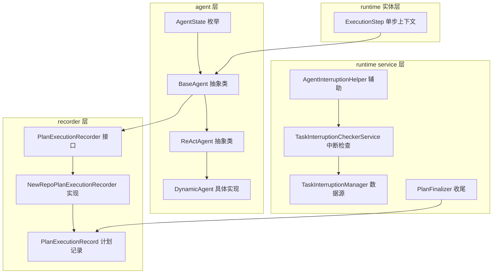
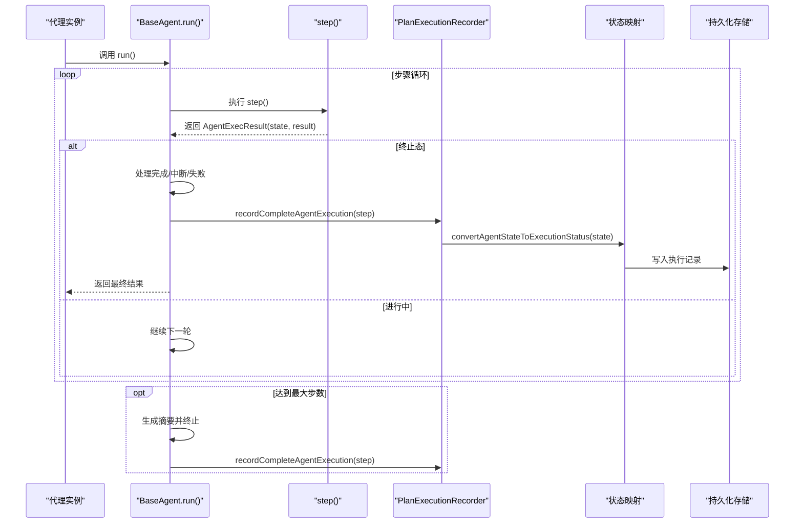
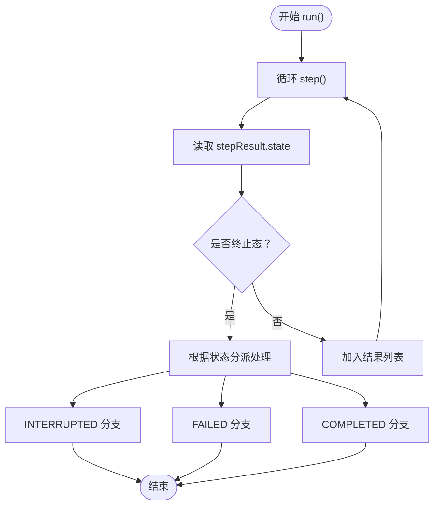
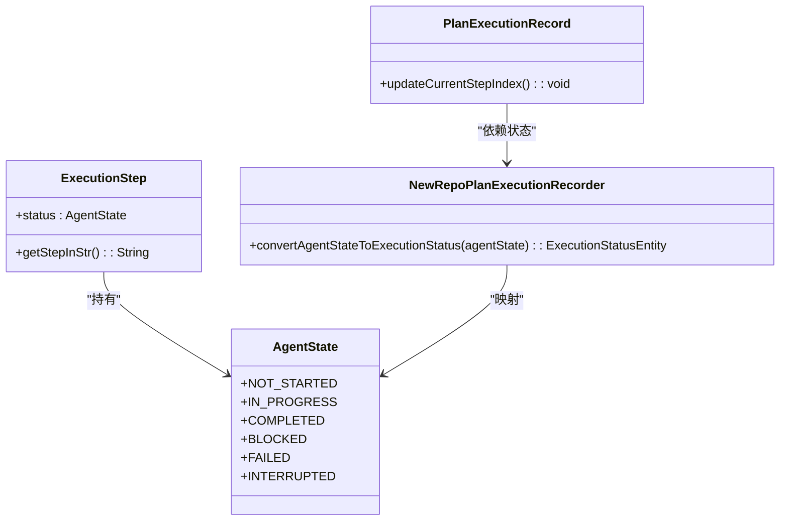
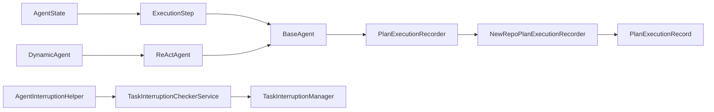

# 代理状态管理

<cite>
**本文引用的文件**
- [AgentState.java](file://src/main/java/com/alibaba/cloud/ai/lynxe/agent/AgentState.java)
- [BaseAgent.java](file://src/main/java/com/alibaba/cloud/ai/lynxe/agent/BaseAgent.java)
- [ReActAgent.java](file://src/main/java/com/alibaba/cloud/ai/lynxe/agent/ReActAgent.java)
- [DynamicAgent.java](file://src/main/java/com/alibaba/cloud/ai/lynxe/agent/DynamicAgent.java)
- [ExecutionStep.java](file://src/main/java/com/alibaba/cloud/ai/lynxe/runtime/entity/vo/ExecutionStep.java)
- [NewRepoPlanExecutionRecorder.java](file://src/main/java/com/alibaba/cloud/ai/lynxe/recorder/service/NewRepoPlanExecutionRecorder.java)
- [PlanExecutionRecorder.java](file://src/main/java/com/alibaba/cloud/ai/lynxe/recorder/service/PlanExecutionRecorder.java)
- [PlanExecutionRecord.java](file://src/main/java/com/alibaba/cloud/ai/lynxe/recorder/entity/vo/PlanExecutionRecord.java)
- [TaskInterruptionCheckerService.java](file://src/main/java/com/alibaba/cloud/ai/lynxe/runtime/service/TaskInterruptionCheckerService.java)
- [AgentInterruptionHelper.java](file://src/main/java/com/alibaba/cloud/ai/lynxe/runtime/service/AgentInterruptionHelper.java)
- [TaskInterruptionManager.java](file://src/main/java/com/alibaba/cloud/ai/lynxe/runtime/service/TaskInterruptionManager.java)
- [PlanFinalizer.java](file://src/main/java/com/alibaba/cloud/ai/lynxe/planning/service/PlanFinalizer.java)
</cite>

## 目录
1. [引言](#引言)
2. [项目结构](#项目结构)
3. [核心组件](#核心组件)
4. [架构总览](#架构总览)
5. [详细组件分析](#详细组件分析)
6. [依赖关系分析](#依赖关系分析)
7. [性能考量](#性能考量)
8. [故障排查指南](#故障排查指南)
9. [结论](#结论)
10. [附录：扩展与最佳实践](#附录扩展与最佳实践)

## 引言
本文件系统性梳理 JManus 项目中“代理状态管理”的设计与实现，围绕 AgentState 枚举及其在代理生命周期中的流转、持久化与监控进行深入解析。重点覆盖以下主题：
- AgentState 各状态的语义与使用场景
- 状态转换规则与触发条件
- 状态变化对代理执行流程的影响
- 状态与执行结果（AgentExecResult）的关系
- 状态管理的持久化与监控映射
- 异常与中断场景下的状态处理
- 扩展状态管理的建议与最佳实践

## 项目结构
与代理状态管理直接相关的核心模块与文件如下：
- agent 层：定义状态枚举、抽象基类与具体代理实现
- runtime 实体层：承载单步执行上下文与状态字段
- recorder 层：将代理状态映射到执行记录状态并持久化
- runtime service 层：提供任务中断检查与辅助工具
- planning 层：终止与收尾逻辑与状态联动

图表来源
- [AgentState.java](file://src/main/java/com/alibaba/cloud/ai/lynxe/agent/AgentState.java#L1-L34)
- [BaseAgent.java](file://src/main/java/com/alibaba/cloud/ai/lynxe/agent/BaseAgent.java#L254-L332)
- [ReActAgent.java](file://src/main/java/com/alibaba/cloud/ai/lynxe/agent/ReActAgent.java#L78-L96)
- [DynamicAgent.java](file://src/main/java/com/alibaba/cloud/ai/lynxe/agent/DynamicAgent.java#L510-L530)
- [ExecutionStep.java](file://src/main/java/com/alibaba/cloud/ai/lynxe/runtime/entity/vo/ExecutionStep.java#L63-L114)
- [PlanExecutionRecorder.java](file://src/main/java/com/alibaba/cloud/ai/lynxe/recorder/service/PlanExecutionRecorder.java#L62-L89)
- [NewRepoPlanExecutionRecorder.java](file://src/main/java/com/alibaba/cloud/ai/lynxe/recorder/service/NewRepoPlanExecutionRecorder.java#L250-L275)
- [PlanExecutionRecord.java](file://src/main/java/com/alibaba/cloud/ai/lynxe/recorder/entity/vo/PlanExecutionRecord.java#L150-L186)
- [TaskInterruptionCheckerService.java](file://src/main/java/com/alibaba/cloud/ai/lynxe/runtime/service/TaskInterruptionCheckerService.java#L40-L88)
- [AgentInterruptionHelper.java](file://src/main/java/com/alibaba/cloud/ai/lynxe/runtime/service/AgentInterruptionHelper.java#L35-L84)
- [TaskInterruptionManager.java](file://src/main/java/com/alibaba/cloud/ai/lynxe/runtime/service/TaskInterruptionManager.java#L49-L67)
- [PlanFinalizer.java](file://src/main/java/com/alibaba/cloud/ai/lynxe/planning/service/PlanFinalizer.java#L291-L325)

章节来源
- [AgentState.java](file://src/main/java/com/alibaba/cloud/ai/lynxe/agent/AgentState.java#L1-L34)
- [BaseAgent.java](file://src/main/java/com/alibaba/cloud/ai/lynxe/agent/BaseAgent.java#L254-L332)
- [ExecutionStep.java](file://src/main/java/com/alibaba/cloud/ai/lynxe/runtime/entity/vo/ExecutionStep.java#L63-L114)

## 核心组件
- AgentState：定义代理生命周期中的离散状态集合，用于表达执行阶段与结果性质。
- BaseAgent：统一的代理执行框架，负责循环执行 step() 并根据 AgentExecResult 的状态决定是否终止、汇总或记录。
- ReActAgent：基于“思考-行动”模式的抽象代理，封装 think()/act() 的交替执行，并在中断时返回 INTERRUPTED。
- DynamicAgent：具体代理实现，包含重试、早期终止检测、用户输入等待等逻辑；在特定失败条件下返回 FAILED。
- ExecutionStep：单步执行上下文，包含当前 AgentState 字段，作为运行期状态载体。
- PlanExecutionRecorder/NewRepoPlanExecutionRecorder：将代理状态映射为执行记录状态并持久化。
- TaskInterruptionCheckerService/AgentInterruptionHelper/TaskInterruptionManager：提供外部中断信号检查与抛出，驱动代理进入 INTERRUPTED。
- PlanFinalizer：在计划收尾阶段识别中断与失败的边界条件，辅助最终状态判定。

章节来源
- [AgentState.java](file://src/main/java/com/alibaba/cloud/ai/lynxe/agent/AgentState.java#L1-L34)
- [BaseAgent.java](file://src/main/java/com/alibaba/cloud/ai/lynxe/agent/BaseAgent.java#L254-L332)
- [ReActAgent.java](file://src/main/java/com/alibaba/cloud/ai/lynxe/agent/ReActAgent.java#L78-L96)
- [DynamicAgent.java](file://src/main/java/com/alibaba/cloud/ai/lynxe/agent/DynamicAgent.java#L510-L530)
- [ExecutionStep.java](file://src/main/java/com/alibaba/cloud/ai/lynxe/runtime/entity/vo/ExecutionStep.java#L63-L114)
- [PlanExecutionRecorder.java](file://src/main/java/com/alibaba/cloud/ai/lynxe/recorder/service/PlanExecutionRecorder.java#L62-L89)
- [NewRepoPlanExecutionRecorder.java](file://src/main/java/com/alibaba/cloud/ai/lynxe/recorder/service/NewRepoPlanExecutionRecorder.java#L250-L275)
- [TaskInterruptionCheckerService.java](file://src/main/java/com/alibaba/cloud/ai/lynxe/runtime/service/TaskInterruptionCheckerService.java#L40-L88)
- [AgentInterruptionHelper.java](file://src/main/java/com/alibaba/cloud/ai/lynxe/runtime/service/AgentInterruptionHelper.java#L35-L84)
- [TaskInterruptionManager.java](file://src/main/java/com/alibaba/cloud/ai/lynxe/runtime/service/TaskInterruptionManager.java#L49-L67)
- [PlanFinalizer.java](file://src/main/java/com/alibaba/cloud/ai/lynxe/planning/service/PlanFinalizer.java#L291-L325)

## 架构总览
下图展示了从代理执行到状态持久化的整体链路，以及中断与失败的触发点。

图表来源
- [BaseAgent.java](file://src/main/java/com/alibaba/cloud/ai/lynxe/agent/BaseAgent.java#L254-L332)
- [PlanExecutionRecorder.java](file://src/main/java/com/alibaba/cloud/ai/lynxe/recorder/service/PlanExecutionRecorder.java#L62-L89)
- [NewRepoPlanExecutionRecorder.java](file://src/main/java/com/alibaba/cloud/ai/lynxe/recorder/service/NewRepoPlanExecutionRecorder.java#L250-L275)

## 详细组件分析

### AgentState 枚举与语义
- NOT_STARTED：初始未启动状态，通常由 ExecutionStep 初始化时采用。
- IN_PROGRESS：执行过程中的中间态，表示代理正在思考或行动。
- COMPLETED：成功完成，通常由正常路径结束或达到目标。
- BLOCKED：阻塞态，当前系统资源或外部条件限制导致无法继续。
- FAILED：失败态，表示执行过程中出现不可恢复的错误或策略性失败。
- INTERRUPTED：被外部中断，通常来自用户或系统控制指令。

这些状态在代理执行流程中作为“信号”，驱动 BaseAgent 的终止逻辑与后续处理分支。

章节来源
- [AgentState.java](file://src/main/java/com/alibaba/cloud/ai/lynxe/agent/AgentState.java#L1-L34)
- [ExecutionStep.java](file://src/main/java/com/alibaba/cloud/ai/lynxe/runtime/entity/vo/ExecutionStep.java#L107-L114)

### BaseAgent 的执行与状态终止逻辑
- 循环执行 step()，累计 AgentExecResult 列表。
- 当 AgentExecResult.getState() 为 COMPLETED、INTERRUPTED 或 FAILED 时，立即停止循环并进入对应分支：
  - INTERRUPTED：调用 handleInterruptedExecution
  - FAILED：调用 handleFailedExecution
  - COMPLETED：调用 handleCompletedExecution（清理错误信息）
- 若达到最大步数仍未终止，则生成摘要并以 COMPLETED 结束。
- 异常捕获后通过 SystemErrorReportTool 包装错误并返回 IN_PROGRESS，以便继续记录与后续处理。

图表来源
- [BaseAgent.java](file://src/main/java/com/alibaba/cloud/ai/lynxe/agent/BaseAgent.java#L254-L332)

章节来源
- [BaseAgent.java](file://src/main/java/com/alibaba/cloud/ai/lynxe/agent/BaseAgent.java#L254-L332)

### ReActAgent 的状态返回与中断传播
- think() 返回布尔值决定是否需要执行 act()。
- 若无需行动，返回 IN_PROGRESS；否则返回 act() 的结果。
- 在 think() 过程中若检测到中断，抛出 TaskInterruptedException，ReActAgent.step() 捕获并返回 INTERRUPTED。

章节来源
- [ReActAgent.java](file://src/main/java/com/alibaba/cloud/ai/lynxe/agent/ReActAgent.java#L78-L96)
- [TaskInterruptionCheckerService.java](file://src/main/java/com/alibaba/cloud/ai/lynxe/runtime/service/TaskInterruptionCheckerService.java#L70-L88)

### DynamicAgent 的失败与中断判定
- think() 阶段会周期性检查中断，必要时抛出 TaskInterruptedException。
- 在多次重试后仍出现“早期终止阈值”（仅思考无工具调用），返回 FAILED，避免无限循环。
- step() 中若检测到 LLM 反复只返回文本而不调用工具，明确返回 FAILED。

章节来源
- [DynamicAgent.java](file://src/main/java/com/alibaba/cloud/ai/lynxe/agent/DynamicAgent.java#L200-L230)
- [DynamicAgent.java](file://src/main/java/com/alibaba/cloud/ai/lynxe/agent/DynamicAgent.java#L510-L530)

### 状态与执行结果（AgentExecResult）的关系
- AgentExecResult 是每一步执行的产物，包含 result、state 与历史 results 列表。
- BaseAgent.run() 将每一步的结果累积，最终返回包含完整历史的 AgentExecResult。
- 通过 AgentExecResult.getState() 判断下一步是否终止，从而影响最终状态。

章节来源
- [BaseAgent.java](file://src/main/java/com/alibaba/cloud/ai/lynxe/agent/BaseAgent.java#L492-L524)

### 状态持久化与监控映射
- ExecutionStep.status 字段承载单步状态，贯穿执行上下文。
- NewRepoPlanExecutionRecorder.convertAgentStateToExecutionStatus() 将 AgentState 映射为执行记录状态：
  - NOT_STARTED → IDLE
  - IN_PROGRESS → RUNNING
  - COMPLETED/INTERRUPTED → FINISHED
  - BLOCKED/FAILED → FINISHED
- PlanExecutionRecord.updateCurrentStepIndex() 基于执行记录状态动态定位当前步骤索引，支持前端轮询与可视化。

图表来源
- [AgentState.java](file://src/main/java/com/alibaba/cloud/ai/lynxe/agent/AgentState.java#L1-L34)
- [ExecutionStep.java](file://src/main/java/com/alibaba/cloud/ai/lynxe/runtime/entity/vo/ExecutionStep.java#L63-L114)
- [NewRepoPlanExecutionRecorder.java](file://src/main/java/com/alibaba/cloud/ai/lynxe/recorder/service/NewRepoPlanExecutionRecorder.java#L250-L275)
- [PlanExecutionRecord.java](file://src/main/java/com/alibaba/cloud/ai/lynxe/recorder/entity/vo/PlanExecutionRecord.java#L150-L186)

章节来源
- [NewRepoPlanExecutionRecorder.java](file://src/main/java/com/alibaba/cloud/ai/lynxe/recorder/service/NewRepoPlanExecutionRecorder.java#L250-L275)
- [PlanExecutionRecord.java](file://src/main/java/com/alibaba/cloud/ai/lynxe/recorder/entity/vo/PlanExecutionRecord.java#L150-L186)

### 中断与失败的触发条件
- 中断（INTERRUPTED）
  - 来源：TaskInterruptionCheckerService.shouldInterruptExecution() 检测到 DesiredTaskState 为 STOP/CANCEL/PAUSE。
  - 触发：AgentInterruptionHelper.checkInterruptionAndContinue() 抛出 TaskInterruptedException，ReActAgent.step() 捕获并返回 INTERRUPTED。
- 失败（FAILED）
  - 来源：DynamicAgent 在多次重试后仍出现“早期终止阈值”（仅思考无工具调用），或显式判定模型配置不当导致无法推进。
  - 触发：DynamicAgent.step() 返回 FAILED，BaseAgent.run() 识别终止并进入 handleFailedExecution。

章节来源
- [TaskInterruptionCheckerService.java](file://src/main/java/com/alibaba/cloud/ai/lynxe/runtime/service/TaskInterruptionCheckerService.java#L40-L88)
- [AgentInterruptionHelper.java](file://src/main/java/com/alibaba/cloud/ai/lynxe/runtime/service/AgentInterruptionHelper.java#L35-L84)
- [TaskInterruptionManager.java](file://src/main/java/com/alibaba/cloud/ai/lynxe/runtime/service/TaskInterruptionManager.java#L49-L67)
- [DynamicAgent.java](file://src/main/java/com/alibaba/cloud/ai/lynxe/agent/DynamicAgent.java#L510-L530)

### 查询与处理不同状态的示例路径
- 查询单步状态：ExecutionStep.getStatus()
- 设置单步状态：ExecutionStep.setStatus(AgentState)
- 获取代理最终状态：AgentExecResult.getState()
- 获取代理历史结果：AgentExecResult.getResults()
- 持久化状态映射：NewRepoPlanExecutionRecorder.convertAgentStateToExecutionStatus()

章节来源
- [ExecutionStep.java](file://src/main/java/com/alibaba/cloud/ai/lynxe/runtime/entity/vo/ExecutionStep.java#L107-L114)
- [BaseAgent.java](file://src/main/java/com/alibaba/cloud/ai/lynxe/agent/BaseAgent.java#L492-L524)
- [NewRepoPlanExecutionRecorder.java](file://src/main/java/com/alibaba/cloud/ai/lynxe/recorder/service/NewRepoPlanExecutionRecorder.java#L250-L275)

## 依赖关系分析
- 低耦合：AgentState 仅作为标识符，不引入复杂行为；BaseAgent 通过组合状态决定流程。
- 中间件依赖：PlanExecutionRecorder 与 NewRepoPlanExecutionRecorder 提供状态持久化能力；TaskInterruptionCheckerService/AgentInterruptionHelper 提供外部中断信号。
- 数据一致性：ExecutionStep.status 与 AgentExecResult.state 保持一致，确保持久化与监控的一致性。

图表来源
- [AgentState.java](file://src/main/java/com/alibaba/cloud/ai/lynxe/agent/AgentState.java#L1-L34)
- [ExecutionStep.java](file://src/main/java/com/alibaba/cloud/ai/lynxe/runtime/entity/vo/ExecutionStep.java#L63-L114)
- [BaseAgent.java](file://src/main/java/com/alibaba/cloud/ai/lynxe/agent/BaseAgent.java#L254-L332)
- [PlanExecutionRecorder.java](file://src/main/java/com/alibaba/cloud/ai/lynxe/recorder/service/PlanExecutionRecorder.java#L62-L89)
- [NewRepoPlanExecutionRecorder.java](file://src/main/java/com/alibaba/cloud/ai/lynxe/recorder/service/NewRepoPlanExecutionRecorder.java#L250-L275)
- [PlanExecutionRecord.java](file://src/main/java/com/alibaba/cloud/ai/lynxe/recorder/entity/vo/PlanExecutionRecord.java#L150-L186)
- [AgentInterruptionHelper.java](file://src/main/java/com/alibaba/cloud/ai/lynxe/runtime/service/AgentInterruptionHelper.java#L35-L84)
- [TaskInterruptionCheckerService.java](file://src/main/java/com/alibaba/cloud/ai/lynxe/runtime/service/TaskInterruptionCheckerService.java#L40-L88)
- [TaskInterruptionManager.java](file://src/main/java/com/alibaba/cloud/ai/lynxe/runtime/service/TaskInterruptionManager.java#L49-L67)
- [ReActAgent.java](file://src/main/java/com/alibaba/cloud/ai/lynxe/agent/ReActAgent.java#L78-L96)
- [DynamicAgent.java](file://src/main/java/com/alibaba/cloud/ai/lynxe/agent/DynamicAgent.java#L510-L530)

## 性能考量
- 最大步数限制：BaseAgent.run() 通过 LynxeProperties.getMaxSteps() 控制循环上限，避免无限执行。
- 中断检查频率：在 think() 与重试循环中定期检查中断，减少无效计算。
- 记忆与摘要：达到最大步数时生成摘要并终止，降低长对话开销。
- 并行工具调用：可选并行工具调用策略，提升吞吐但需注意资源竞争与状态一致性。

[本节为通用性能讨论，不直接分析具体文件]

## 故障排查指南
- 中断未生效
  - 检查 TaskInterruptionManager 是否正确设置 DesiredTaskState。
  - 确认 AgentInterruptionHelper.checkInterruptionAndContinue() 是否被调用。
- 失败频繁
  - 关注 DynamicAgent 的“早期终止阈值”日志与 LLM 反馈，调整提示词或工具调用策略。
- 状态不一致
  - 对比 ExecutionStep.status 与 AgentExecResult.state，确保持久化映射逻辑一致。
- 持久化异常
  - 查看 NewRepoPlanExecutionRecorder 的异常分支与日志，确认状态映射与实体保存流程。

章节来源
- [TaskInterruptionManager.java](file://src/main/java/com/alibaba/cloud/ai/lynxe/runtime/service/TaskInterruptionManager.java#L49-L67)
- [AgentInterruptionHelper.java](file://src/main/java/com/alibaba/cloud/ai/lynxe/runtime/service/AgentInterruptionHelper.java#L35-L84)
- [DynamicAgent.java](file://src/main/java/com/alibaba/cloud/ai/lynxe/agent/DynamicAgent.java#L200-L230)
- [NewRepoPlanExecutionRecorder.java](file://src/main/java/com/alibaba/cloud/ai/lynxe/recorder/service/NewRepoPlanExecutionRecorder.java#L250-L275)

## 结论
本项目通过 AgentState 枚举与 BaseAgent 的统一执行框架，实现了清晰的状态机与可观测的执行流程。状态在运行期（ExecutionStep）、结果（AgentExecResult）与持久化（PlanExecutionRecord）之间形成闭环，配合中断检查与失败判定，确保代理在可控范围内完成任务或优雅退出。通过合理的状态映射与监控索引更新，前端可实时掌握执行进度与结果。

[本节为总结性内容，不直接分析具体文件]

## 附录：扩展与最佳实践

### 如何添加自定义状态
- 新增枚举值：在 AgentState 中添加新状态，并在状态映射处补充映射逻辑。
- 更新映射：在 NewRepoPlanExecutionRecorder 中扩展 convertAgentStateToExecutionStatus()，确保持久化层理解新状态。
- 执行分支：在 BaseAgent.run() 或具体代理的 step() 中增加对新状态的处理分支。
- 监控索引：如需前端显示，可在 PlanExecutionRecord.updateCurrentStepIndex() 中考虑新状态的索引策略。

章节来源
- [AgentState.java](file://src/main/java/com/alibaba/cloud/ai/lynxe/agent/AgentState.java#L1-L34)
- [NewRepoPlanExecutionRecorder.java](file://src/main/java/com/alibaba/cloud/ai/lynxe/recorder/service/NewRepoPlanExecutionRecorder.java#L250-L275)
- [PlanExecutionRecord.java](file://src/main/java/com/alibaba/cloud/ai/lynxe/recorder/entity/vo/PlanExecutionRecord.java#L150-L186)
- [BaseAgent.java](file://src/main/java/com/alibaba/cloud/ai/lynxe/agent/BaseAgent.java#L254-L332)

### 状态转换规则与触发条件清单
- NOT_STARTED → IN_PROGRESS：首次执行 step() 后进入 IN_PROGRESS。
- IN_PROGRESS → COMPLETED/INTERRUPTED/FAILED：由具体代理逻辑在 step() 返回相应状态。
- COMPLETED：正常完成或达到目标。
- INTERRUPTED：外部中断信号触发。
- FAILED：失败条件满足（如早期终止阈值）。
- BLOCKED：系统资源受限或外部依赖阻塞（需在业务侧显式设置）。

章节来源
- [ReActAgent.java](file://src/main/java/com/alibaba/cloud/ai/lynxe/agent/ReActAgent.java#L78-L96)
- [DynamicAgent.java](file://src/main/java/com/alibaba/cloud/ai/lynxe/agent/DynamicAgent.java#L510-L530)
- [TaskInterruptionCheckerService.java](file://src/main/java/com/alibaba/cloud/ai/lynxe/runtime/service/TaskInterruptionCheckerService.java#L40-L88)

### 状态管理中的异常与错误处理
- 异常包装：BaseAgent.handleExceptionWithSystemErrorReport() 使用 SystemErrorReportTool 包装异常，返回 IN_PROGRESS 以继续记录。
- 错误消息：在 COMPLETED 成功路径中清理错误消息，避免残留瞬时错误。
- 失败回退：FAILED 路径中保留失败原因，便于诊断与重试策略制定。

章节来源
- [BaseAgent.java](file://src/main/java/com/alibaba/cloud/ai/lynxe/agent/BaseAgent.java#L375-L424)
- [BaseAgent.java](file://src/main/java/com/alibaba/cloud/ai/lynxe/agent/BaseAgent.java#L353-L366)