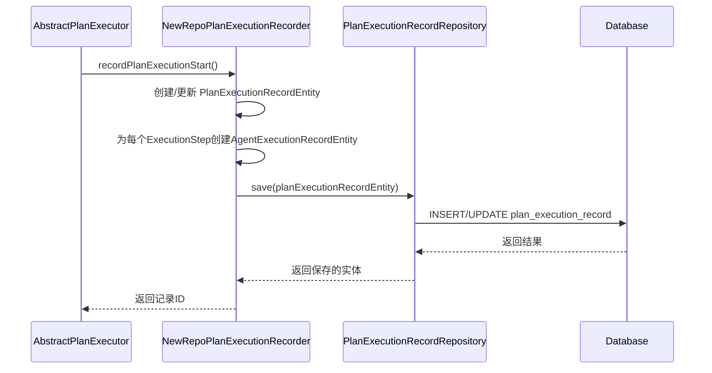
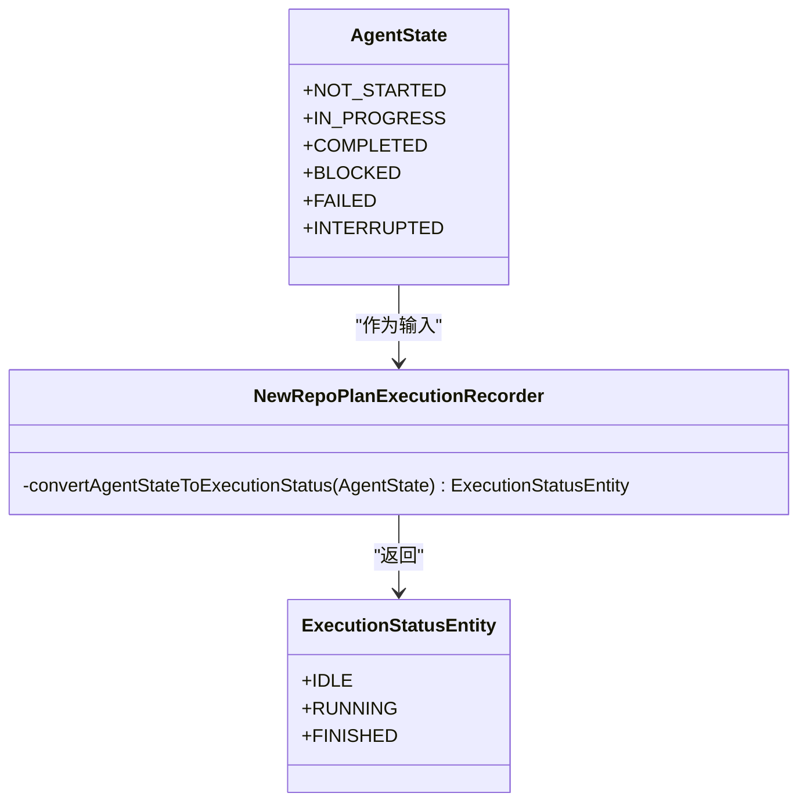
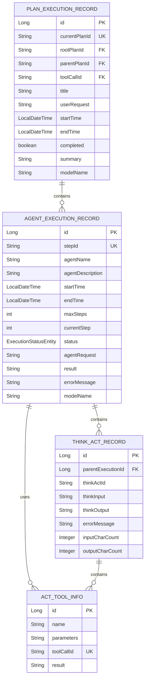
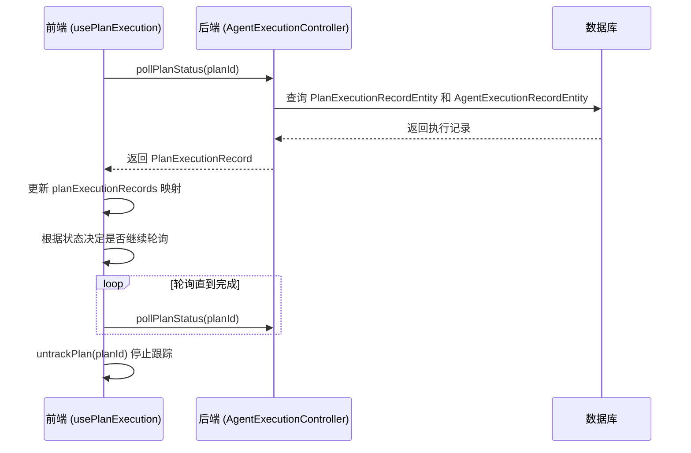

# 状态持久化与监控

<cite>
**本文档引用的文件**   
- [NewRepoPlanExecutionRecorder.java](file://src/main/java/com/alibaba/cloud/ai/lynxe/recorder/service/NewRepoPlanExecutionRecorder.java)
- [AgentState.java](file://src/main/java/com/alibaba/cloud/ai/lynxe/agent/AgentState.java)
- [PlanExecutionRecordEntity.java](file://src/main/java/com/alibaba/cloud/ai/lynxe/recorder/entity/po/PlanExecutionRecordEntity.java)
- [AgentExecutionRecordEntity.java](file://src/main/java/com/alibaba/cloud/ai/lynxe/recorder/entity/po/AgentExecutionRecordEntity.java)
- [ExecutionStatusEntity.java](file://src/main/java/com/alibaba/cloud/ai/lynxe/recorder/entity/po/ExecutionStatusEntity.java)
- [PlanExecutionRecord.java](file://src/main/java/com/alibaba/cloud/ai/lynxe/recorder/entity/vo/PlanExecutionRecord.java)
- [AgentExecutionRecord.java](file://src/main/java/com/alibaba/cloud/ai/lynxe/recorder/entity/vo/AgentExecutionRecord.java)
- [PlanExecutionRecordRepository.java](file://src/main/java/com/alibaba/cloud/ai/lynxe/recorder/repository/PlanExecutionRecordRepository.java)
- [AgentExecutionRecordRepository.java](file://src/main/java/com/alibaba/cloud/ai/lynxe/recorder/repository/AgentExecutionRecordRepository.java)
- [usePlanExecution.ts](file://ui-vue3/src/composables/usePlanExecution.ts)
- [agent-execution.ts](file://ui-vue3/src/api/agent-execution.ts)
</cite>

## 目录
1. [引言](#引言)
2. [状态持久化机制](#状态持久化机制)
3. [状态映射与转换](#状态映射与转换)
4. [记录对象结构与关联](#记录对象结构与关联)
5. [执行过程监控与审计](#执行过程监控与审计)
6. [查询接口与管理功能](#查询接口与管理功能)
7. [数据库表结构](#数据库表结构)
8. [REST API 示例](#rest-api-示例)
9. [性能优化与事务一致性](#性能优化与事务一致性)

## 引言
本系统通过一套完善的持久化与监控机制，实现了对代理执行过程的全面追踪和管理。核心是 `NewRepoPlanExecutionRecorder` 服务，它负责将执行过程中的状态信息持久化到数据库中，并提供查询接口供前端进行监控和审计。系统通过将 `AgentState` 枚举映射为 `ExecutionStatus` 实体来统一状态表示，并在 `PlanExecutionRecord`、`AgentExecutionRecord` 和 `StepResult` 等记录对象中存储详细的执行信息。

## 状态持久化机制

系统通过 `NewRepoPlanExecutionRecorder` 服务实现状态的持久化存储。该服务作为 `PlanExecutionRecorder` 接口的实现，负责记录计划执行的整个生命周期，包括开始、步骤执行、思考-行动记录、工具调用结果以及最终完成。

当一个计划开始执行时，`recordPlanExecutionStart` 方法被调用，它会创建或更新一个 `PlanExecutionRecordEntity` 实体，并将其保存到数据库中。此过程中，会遍历执行步骤并为每个步骤创建或更新相应的 `AgentExecutionRecordEntity`。



**图示来源**
- [NewRepoPlanExecutionRecorder.java](file://src/main/java/com/alibaba/cloud/ai/lynxe/recorder/service/NewRepoPlanExecutionRecorder.java#L75-L156)
- [PlanExecutionRecordEntity.java](file://src/main/java/com/alibaba/cloud/ai/lynxe/recorder/entity/po/PlanExecutionRecordEntity.java#L113-L129)

**本节来源**
- [NewRepoPlanExecutionRecorder.java](file://src/main/java/com/alibaba/cloud/ai/lynxe/recorder/service/NewRepoPlanExecutionRecorder.java#L75-L156)
- [AbstractPlanExecutor.java](file://src/main/java/com/alibaba/cloud/ai/lynxe/runtime/executor/AbstractPlanExecutor.java#L97-L117)

## 状态映射与转换

系统定义了两种状态枚举：`AgentState` 和 `ExecutionStatus`。`AgentState` 是代理在执行过程中的状态，而 `ExecutionStatus` 是持久化记录中的状态。`NewRepoPlanExecutionRecorder` 服务中的 `convertAgentStateToExecutionStatus` 方法负责将 `AgentState` 映射为 `ExecutionStatusEntity`。



**图示来源**
- [AgentState.java](file://src/main/java/com/alibaba/cloud/ai/lynxe/agent/AgentState.java#L18-L21)
- [ExecutionStatusEntity.java](file://src/main/java/com/alibaba/cloud/ai/lynxe/recorder/entity/po/ExecutionStatusEntity.java#L21-L23)
- [NewRepoPlanExecutionRecorder.java](file://src/main/java/com/alibaba/cloud/ai/lynxe/recorder/service/NewRepoPlanExecutionRecorder.java#L255-L274)

**本节来源**
- [NewRepoPlanExecutionRecorder.java](file://src/main/java/com/alibaba/cloud/ai/lynxe/recorder/service/NewRepoPlanExecutionRecorder.java#L255-L274)

## 记录对象结构与关联

系统使用一系列实体和值对象来存储执行记录，它们之间存在明确的关联关系。



**图示来源**
- [PlanExecutionRecordEntity.java](file://src/main/java/com/alibaba/cloud/ai/lynxe/recorder/entity/po/PlanExecutionRecordEntity.java)
- [AgentExecutionRecordEntity.java](file://src/main/java/com/alibaba/cloud/ai/lynxe/recorder/entity/po/AgentExecutionRecordEntity.java)
- [ThinkActRecordEntity.java](file://src/main/java/com/alibaba/cloud/ai/lynxe/recorder/entity/po/ThinkActRecordEntity.java)
- [ActToolInfoEntity.java](file://src/main/java/com/alibaba/cloud/ai/lynxe/recorder/entity/po/ActToolInfoEntity.java)

**本节来源**
- [PlanExecutionRecordEntity.java](file://src/main/java/com/alibaba/cloud/ai/lynxe/recorder/entity/po/PlanExecutionRecordEntity.java)
- [AgentExecutionRecordEntity.java](file://src/main/java/com/alibaba/cloud/ai/lynxe/recorder/entity/po/AgentExecutionRecordEntity.java)

## 执行过程监控与审计

系统通过前端轮询和后端持久化相结合的方式实现执行过程的实时监控。前端使用 `usePlanExecution` 组合式函数，通过 `trackPlan` 方法开始跟踪一个计划的执行状态。



**图示来源**
- [usePlanExecution.ts](file://ui-vue3/src/composables/usePlanExecution.ts#L82-L116)
- [agent-execution.ts](file://ui-vue3/src/api/agent-execution.ts#L11-L26)

**本节来源**
- [usePlanExecution.ts](file://ui-vue3/src/composables/usePlanExecution.ts#L75-L245)
- [agent-execution.ts](file://ui-vue3/src/api/agent-execution.ts#L11-L26)

## 查询接口与管理功能

系统提供了基于状态的查询接口，允许按状态过滤执行任务。`PlanExecutionRecordRepository` 提供了 `findByCurrentPlanId`、`findByParentPlanId` 和 `findByRootPlanId` 等方法，支持按不同维度查询执行记录。

前端通过 `fetchAgentExecutionDetail` API 可以获取特定步骤的详细执行信息，用于可视化执行流程图和展示详细的执行日志。

**本节来源**
- [PlanExecutionRecordRepository.java](file://src/main/java/com/alibaba/cloud/ai/lynxe/recorder/repository/PlanExecutionRecordRepository.java#L32-L42)
- [AgentExecutionRecordRepository.java](file://src/main/java/com/alibaba/cloud/ai/lynxe/recorder/repository/AgentExecutionRecordRepository.java#L31-L36)
- [agent-execution.ts](file://ui-vue3/src/api/agent-execution.ts#L11-L26)

## 数据库表结构

系统的核心持久化数据存储在以下几张表中：

**plan_execution_record 表**
| 字段名 | 类型 | 说明 |
| :--- | :--- | :--- |
| id | BIGINT (PK) | 主键ID |
| current_plan_id | VARCHAR (UK) | 当前计划唯一ID |
| root_plan_id | VARCHAR | 根计划ID |
| parent_plan_id | VARCHAR | 父计划ID |
| tool_call_id | VARCHAR | 触发此计划的工具调用ID |
| title | VARCHAR | 计划标题 |
| user_request | LONGTEXT | 用户原始请求 |
| start_time | DATETIME | 执行开始时间 |
| end_time | DATETIME | 执行结束时间 |
| current_step_index | INT | 当前执行步骤索引 |
| completed | BOOLEAN | 是否完成 |
| summary | LONGTEXT | 执行摘要 |
| model_name | VARCHAR | 调用的模型名称 |

**agent_execution_record 表**
| 字段名 | 类型 | 说明 |
| :--- | :--- | :--- |
| id | BIGINT (PK) | 主键ID |
| step_id | VARCHAR (UK) | 步骤ID |
| agent_name | VARCHAR | 代理名称 |
| agent_description | LONGTEXT | 代理描述 |
| start_time | DATETIME | 执行开始时间 |
| end_time | DATETIME | 执行结束时间 |
| max_steps | INT | 最大步数 |
| current_step | INT | 当前步数 |
| status | VARCHAR | 执行状态 (IDLE, RUNNING, FINISHED) |
| agent_request | LONGTEXT | 代理请求 |
| result | LONGTEXT | 执行结果 |
| error_message | LONGTEXT | 错误信息 |
| model_name | VARCHAR | 调用的模型名称 |

**本节来源**
- [PlanExecutionRecordEntity.java](file://src/main/java/com/alibaba/cloud/ai/lynxe/recorder/entity/po/PlanExecutionRecordEntity.java)
- [AgentExecutionRecordEntity.java](file://src/main/java/com/alibaba/cloud/ai/lynxe/recorder/entity/po/AgentExecutionRecordEntity.java)

## REST API 示例

系统提供了 REST API 用于查询执行状态和详细信息。

**获取计划执行记录**
- **端点**: `GET /api/executor/plan-execution/{currentPlanId}`
- **响应**:
```json
{
  "currentPlanId": "plan-123",
  "rootPlanId": "plan-root",
  "title": "数据分析任务",
  "startTime": "2025-04-05T10:00:00",
  "endTime": "2025-04-05T10:05:00",
  "completed": true,
  "summary": "任务成功完成",
  "agentExecutionSequence": [
    {
      "stepId": "step-001",
      "agentName": "DataAnalyzer",
      "status": "FINISHED",
      "startTime": "2025-04-05T10:00:00",
      "endTime": "2025-04-05T10:02:00",
      "result": "分析完成"
    }
  ]
}
```

**获取代理执行详情**
- **端点**: `GET /api/executor/agent-execution/{stepId}`
- **响应**:
```json
{
  "stepId": "step-001",
  "agentName": "DataAnalyzer",
  "status": "FINISHED",
  "startTime": "2025-04-05T10:00:00",
  "endTime": "2025-04-05T10:02:00",
  "agentRequest": "请分析销售数据...",
  "result": "分析完成",
  "thinkActSteps": [
    {
      "thinkInput": "需要获取销售数据",
      "thinkOutput": "将调用数据库读取工具",
      "actToolInfoList": [
        {
          "name": "database-read-tool",
          "parameters": "{\"query\": \"SELECT * FROM sales\"}",
          "result": "获取到100条销售记录"
        }
      ]
    }
  ]
}
```

**本节来源**
- [usePlanExecution.ts](file://ui-vue3/src/composables/usePlanExecution.ts#L75-L245)
- [agent-execution.ts](file://ui-vue3/src/api/agent-execution.ts#L11-L26)

## 性能优化与事务一致性

状态持久化操作被设计为高效的数据库事务。`NewRepoPlanExecutionRecorder` 中的关键方法（如 `recordPlanExecutionStart` 和 `recordPlanCompletion`）都使用了 `@Transactional` 注解，确保了数据的一致性。

在性能方面，系统通过以下方式优化：
1.  **批量操作**：在创建计划执行记录时，会批量处理所有执行步骤。
2.  **延迟加载**：`AgentExecutionRecordEntity` 中的 `thinkActSteps` 使用 `FetchType.LAZY`，避免一次性加载过多数据。
3.  **索引优化**：在 `step_id` 等常用查询字段上建立了数据库索引。

**本节来源**
- [NewRepoPlanExecutionRecorder.java](file://src/main/java/com/alibaba/cloud/ai/lynxe/recorder/service/NewRepoPlanExecutionRecorder.java#L75-L156)
- [AgentExecutionRecordEntity.java](file://src/main/java/com/alibaba/cloud/ai/lynxe/recorder/entity/po/AgentExecutionRecordEntity.java#L104-L106)