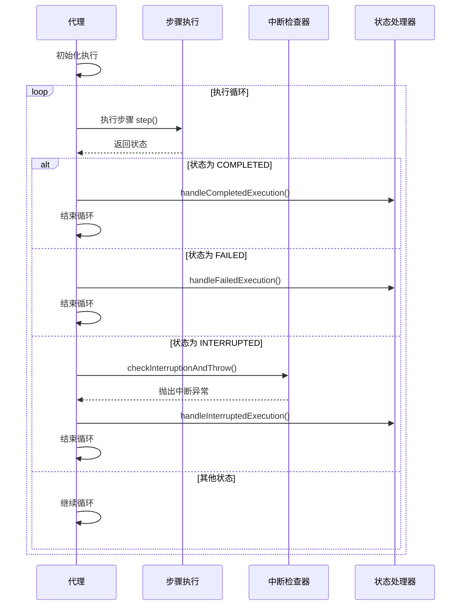

# 状态转换规则

<cite>
**本文档引用的文件**
- [AgentState.java](file://src/main/java/com/alibaba/cloud/ai/lynxe/agent/AgentState.java)
- [BaseAgent.java](file://src/main/java/com/alibaba/cloud/ai/lynxe/agent/BaseAgent.java)
- [TaskInterruptionCheckerService.java](file://src/main/java/com/alibaba/cloud/ai/lynxe/runtime/service/TaskInterruptionCheckerService.java)
- [AgentInterruptionHelper.java](file://src/main/java/com/alibaba/cloud/ai/lynxe/runtime/service/AgentInterruptionHelper.java)
- [PlanFinalizer.java](file://src/main/java/com/alibaba/cloud/ai/lynxe/planning/service/PlanFinalizer.java)
- [NewRepoPlanExecutionRecorder.java](file://src/main/java/com/alibaba/cloud/ai/lynxe/recorder/service/NewRepoPlanExecutionRecorder.java)
</cite>

## 目录
1. [引言](#引言)
2. [核心状态枚举](#核心状态枚举)
3. [状态转换机制](#状态转换机制)
4. [状态转换序列图](#状态转换序列图)
5. [线程安全与数据一致性](#线程安全与数据一致性)
6. [禁止的状态转换](#禁止的状态转换)
7. [结论](#结论)

## 引言
本文档详细描述了JManus项目中代理状态在执行流程中的合法转换路径。文档深入解析了从NOT_STARTED到IN_PROGRESS的启动转换、IN_PROGRESS到COMPLETED的成功结束、IN_PROGRESS到FAILED的异常终止、IN_PROGRESS到INTERRUPTED的外部中断以及IN_PROGRESS到BLOCKED的条件阻塞等核心转换机制。文档还详细描述了触发每种状态变更的具体条件和业务逻辑，包括任务完成回调、异常捕获、用户中断请求或依赖未满足等情况。

## 核心状态枚举
代理状态由`AgentState`枚举类定义，包含六种状态：

- **NOT_STARTED**: 代理尚未开始执行
- **IN_PROGRESS**: 代理正在执行中
- **COMPLETED**: 代理执行成功完成
- **BLOCKED**: 代理因条件不满足而阻塞
- **FAILED**: 代理执行失败
- **INTERRUPTED**: 代理执行被外部中断

这些状态通过`AgentState.java`文件中的枚举定义实现，每个状态都有对应的字符串表示，用于序列化和日志记录。

**Section sources**
- [AgentState.java](file://src/main/java/com/alibaba/cloud/ai/lynxe/agent/AgentState.java#L18-L21)

## 状态转换机制
代理状态的转换主要发生在`BaseAgent`类的`run()`方法中，通过一个循环执行每个步骤并检查状态来实现。

### 启动转换 (NOT_STARTED → IN_PROGRESS)
当代理开始执行时，状态从NOT_STARTED转换为IN_PROGRESS。这个转换是隐式的，发生在执行循环的开始阶段。`run()`方法初始化当前步骤计数器并进入执行循环，标志着执行的开始。

### 成功结束 (IN_PROGRESS → COMPLETED)
当代理执行成功完成时，状态从IN_PROGRESS转换为COMPLETED。这发生在`step()`方法返回的状态为COMPLETED时。系统会记录完成的执行结果并调用`handleCompletedExecution()`方法进行最终处理。

### 异常终止 (IN_PROGRESS → FAILED)
当代理执行过程中发生不可恢复的错误时，状态从IN_PROGRESS转换为FAILED。这通常由`step()`方法在遇到异常情况时返回FAILED状态触发。系统会调用`handleFailedExecution()`方法进行错误处理和资源清理。

### 外部中断 (IN_PROGRESS → INTERRUPTED)
当用户请求中断代理执行时，状态从IN_PROGRESS转换为INTERRUPTED。这个转换通过`TaskInterruptionCheckerService`服务检测中断请求来实现。如果检测到中断请求，会抛出`TaskInterruptedException`，导致状态转换为INTERRUPTED，并调用`handleInterruptedExecution()`方法。

### 条件阻塞 (IN_PROGRESS → BLOCKED)
当代理执行依赖的条件未满足时，状态从IN_PROGRESS转换为BLOCKED。这通常发生在需要等待外部资源或前置条件完成的情况下。BLOCKED状态表示代理暂时无法继续执行，但不是最终状态。

**Section sources**
- [BaseAgent.java](file://src/main/java/com/alibaba/cloud/ai/lynxe/agent/BaseAgent.java#L254-L290)
- [PlanFinalizer.java](file://src/main/java/com/alibaba/cloud/ai/lynxe/planning/service/PlanFinalizer.java#L291-L362)

## 状态转换序列图

**Diagram sources**
- [BaseAgent.java](file://src/main/java/com/alibaba/cloud/ai/lynxe/agent/BaseAgent.java#L254-L290)
- [TaskInterruptionCheckerService.java](file://src/main/java/com/alibaba/cloud/ai/lynxe/runtime/service/TaskInterruptionCheckerService.java#L76-L82)
- [AgentInterruptionHelper.java](file://src/main/java/com/alibaba/cloud/ai/lynxe/runtime/service/AgentInterruptionHelper.java#L44-L53)

## 线程安全与数据一致性
状态转换过程中的线程安全和数据一致性通过多种机制保障：

1. **原子操作**: 使用`AtomicInteger`等原子类确保计数器操作的线程安全
2. **同步锁**: 在关键的资源访问点使用`synchronized`关键字或显式锁
3. **不可变对象**: 尽可能使用不可变对象减少共享状态
4. **事务管理**: 对数据库操作使用Spring的`@Transactional`注解确保数据一致性
5. **volatile关键字**: 使用`volatile`关键字确保多线程环境下的内存可见性

状态转换本身是线程安全的，因为每个代理实例的执行是独立的，状态变更在单个执行线程中串行进行。

**Section sources**
- [ServiceGroupIndexService.java](file://src/main/java/com/alibaba/cloud/ai/lynxe/runtime/service/ServiceGroupIndexService.java#L44-L68)
- [McpCacheManager.java](file://src/main/java/com/alibaba/cloud/ai/lynxe/mcp/service/McpCacheManager.java#L119-L137)

## 禁止的状态转换
系统设计中禁止以下状态转换：

- **COMPLETED → 任何其他状态**: 一旦代理执行完成，不能重新开始或转换到其他状态
- **FAILED → 任何其他状态**: 执行失败后，代理进入最终状态，不能继续执行
- **INTERRUPTED → 任何其他状态**: 中断后代理进入最终状态，不能恢复执行
- **BLOCKED → NOT_STARTED**: 阻塞状态是执行过程中的中间状态，不能回退到未开始状态

这些禁止的转换确保了状态机的单向性和执行流程的完整性，防止了状态混乱和不可预测的行为。

**Section sources**
- [NewRepoPlanExecutionRecorder.java](file://src/main/java/com/alibaba/cloud/ai/lynxe/recorder/service/NewRepoPlanExecutionRecorder.java#L260-L274)

## 结论
JManus项目中的状态转换规则设计合理，通过清晰的状态枚举和严格的转换逻辑确保了代理执行流程的可靠性和可预测性。系统通过`BaseAgent`类的`run()`方法实现了核心的状态转换机制，并通过中断检查服务支持外部中断。线程安全和数据一致性通过原子操作、同步锁和事务管理等多种机制得到保障。禁止的状态转换规则确保了状态机的完整性，防止了非法的状态变更。