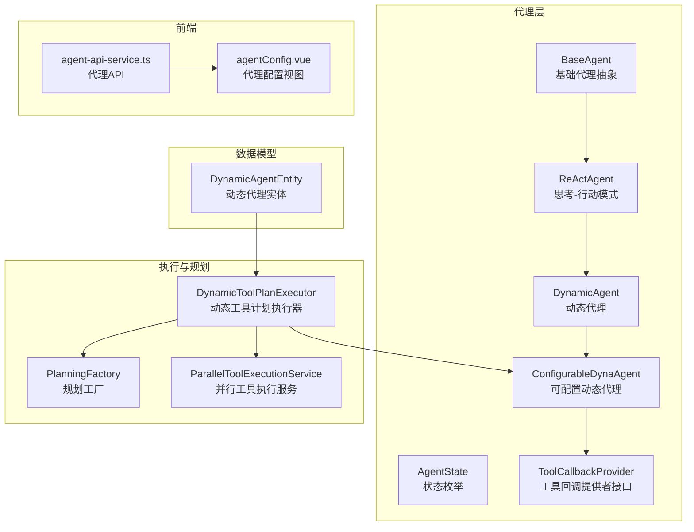
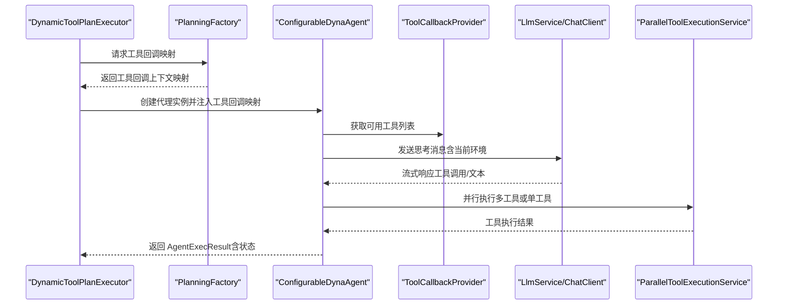
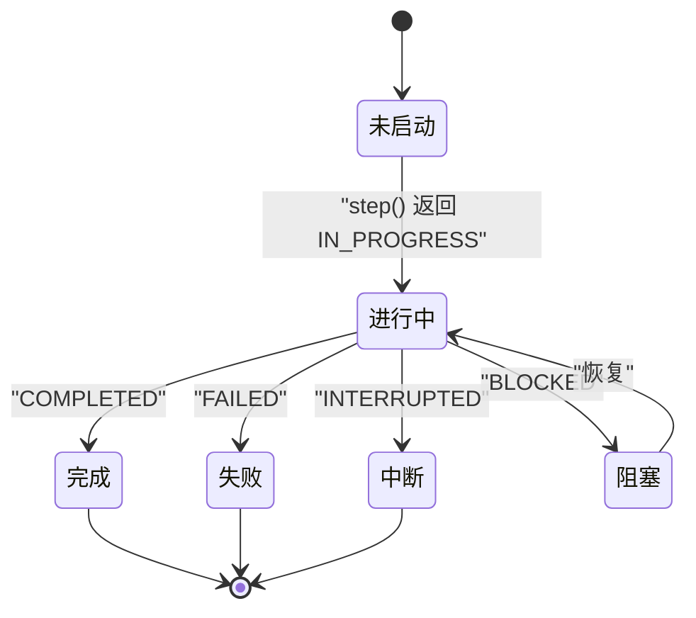
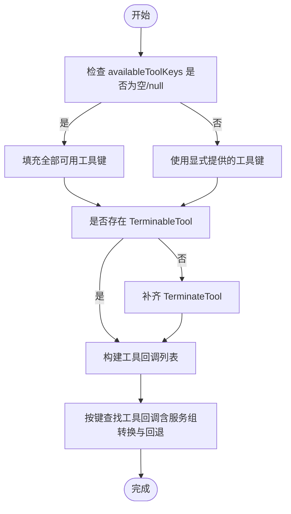
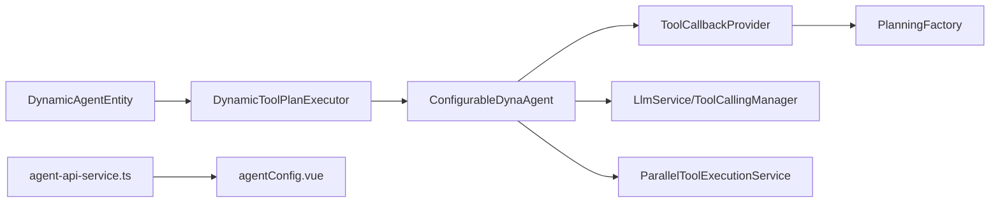

# 代理配置

<cite>
**本文引用的文件**
- [DynamicAgent.java](file://src/main/java/com/alibaba/cloud/ai/lynxe/agent/DynamicAgent.java)
- [ConfigurableDynaAgent.java](file://src/main/java/com/alibaba/cloud/ai/lynxe/agent/ConfigurableDynaAgent.java)
- [BaseAgent.java](file://src/main/java/com/alibaba/cloud/ai/lynxe/agent/BaseAgent.java)
- [ReActAgent.java](file://src/main/java/com/alibaba/cloud/ai/lynxe/agent/ReActAgent.java)
- [AgentState.java](file://src/main/java/com/alibaba/cloud/ai/lynxe/agent/AgentState.java)
- [ToolCallbackProvider.java](file://src/main/java/com/alibaba/cloud/ai/lynxe/agent/ToolCallbackProvider.java)
- [DynamicAgentEntity.java](file://src/main/java/com/alibaba/cloud/ai/lynxe/agent/entity/DynamicAgentEntity.java)
- [DynamicToolPlanExecutor.java](file://src/main/java/com/alibaba/cloud/ai/lynxe/runtime/executor/DynamicToolPlanExecutor.java)
- [PlanningFactory.java](file://src/main/java/com/alibaba/cloud/ai/lynxe/planning/PlanningFactory.java)
- [ParallelToolExecutionService.java](file://src/main/java/com/alibaba/cloud/ai/lynxe/runtime/service/ParallelToolExecutionService.java)
- [agent-api-service.ts](file://ui-vue3/src/api/agent-api-service.ts)
- [agentConfig.vue](file://ui-vue3/src/views/configs/agentConfig.vue)
</cite>

## 目录
1. [简介](#简介)
2. [项目结构](#项目结构)
3. [核心组件](#核心组件)
4. [架构总览](#架构总览)
5. [详细组件分析](#详细组件分析)
6. [依赖关系分析](#依赖关系分析)
7. [性能考量](#性能考量)
8. [故障排查指南](#故障排查指南)
9. [结论](#结论)
10. [附录](#附录)

## 简介
本文件面向开发者与运维人员，系统化梳理 JManus 项目中 AI 代理的配置机制，重点覆盖以下主题：
- DynamicAgent 与 ConfigurableDynaAgent 的配置加载与运行时更新机制
- 代理状态机（AgentState）的工作原理与状态转换规则
- 代理配置参数的存储与管理：initSettingData 与 envData 的使用场景与差异
- 配置继承与覆盖：ConfigurableDynaAgent 中 availableToolKeys 的处理策略
- 配置验证与错误处理流程
- 扩展代理配置能力的实践建议（新增配置项与校验规则）

## 项目结构
围绕“代理配置”的关键模块分布如下：
- agent 层：代理基类、动态代理、可配置动态代理、状态枚举、工具回调提供者接口
- runtime.executor：执行器，负责根据步骤需求创建具体代理实例并注入配置
- planning：规划工厂，提供工具回调上下文映射
- runtime.service：并行工具执行、服务组索引等运行时能力
- ui-vue3：前端配置界面与 API 调用，支撑代理配置的增删改查与导入导出

图表来源
- [DynamicAgent.java](file://src/main/java/com/alibaba/cloud/ai/lynxe/agent/DynamicAgent.java#L1-L120)
- [ConfigurableDynaAgent.java](file://src/main/java/com/alibaba/cloud/ai/lynxe/agent/ConfigurableDynaAgent.java#L1-L120)
- [BaseAgent.java](file://src/main/java/com/alibaba/cloud/ai/lynxe/agent/BaseAgent.java#L1-L120)
- [ReActAgent.java](file://src/main/java/com/alibaba/cloud/ai/lynxe/agent/ReActAgent.java#L1-L97)
- [AgentState.java](file://src/main/java/com/alibaba/cloud/ai/lynxe/agent/AgentState.java#L1-L35)
- [ToolCallbackProvider.java](file://src/main/java/com/alibaba/cloud/ai/lynxe/agent/ToolCallbackProvider.java#L1-L27)
- [DynamicToolPlanExecutor.java](file://src/main/java/com/alibaba/cloud/ai/lynxe/runtime/executor/DynamicToolPlanExecutor.java#L1-L183)
- [PlanningFactory.java](file://src/main/java/com/alibaba/cloud/ai/lynxe/planning/PlanningFactory.java#L1-L200)
- [ParallelToolExecutionService.java](file://src/main/java/com/alibaba/cloud/ai/lynxe/runtime/service/ParallelToolExecutionService.java#L65-L183)
- [DynamicAgentEntity.java](file://src/main/java/com/alibaba/cloud/ai/lynxe/agent/entity/DynamicAgentEntity.java#L1-L133)
- [agent-api-service.ts](file://ui-vue3/src/api/agent-api-service.ts#L104-L338)
- [agentConfig.vue](file://ui-vue3/src/views/configs/agentConfig.vue#L427-L469)

章节来源
- [DynamicAgent.java](file://src/main/java/com/alibaba/cloud/ai/lynxe/agent/DynamicAgent.java#L1-L120)
- [ConfigurableDynaAgent.java](file://src/main/java/com/alibaba/cloud/ai/lynxe/agent/ConfigurableDynaAgent.java#L1-L120)
- [DynamicToolPlanExecutor.java](file://src/main/java/com/alibaba/cloud/ai/lynxe/runtime/executor/DynamicToolPlanExecutor.java#L119-L183)
- [PlanningFactory.java](file://src/main/java/com/alibaba/cloud/ai/lynxe/planning/PlanningFactory.java#L1-L200)

## 核心组件
- BaseAgent：定义代理生命周期、状态管理、执行结果封装、环境数据 envData 与初始设置 initSettingData 的存取接口；提供 run() 主循环与异常兜底处理。
- ReActAgent：在 BaseAgent 基础上引入 think()/act() 思考-行动模式，step() 统一调度。
- DynamicAgent：实现 ReActAgent 的 think()/act()，包含 LLM 推理、工具调用、重试与中断检测、流式响应处理、早期终止阈值控制、工具结果记录与内存写入等。
- ConfigurableDynaAgent：在 DynamicAgent 基础上增强工具集可配置性，支持 availableToolKeys 动态传入与自动补齐 TerminateTool，兼容服务组工具键名格式。
- ToolCallbackProvider：提供工具回调上下文映射，供代理按需筛选可用工具。
- AgentState：统一的状态枚举，驱动执行器的终止条件与 UI 展示。
- DynamicAgentEntity：持久化代理配置（名称、描述、下一步提示、可用工具键、类名、模型、命名空间、内置标记等）。
- DynamicToolPlanExecutor：根据执行上下文创建 ConfigurableDynaAgent 实例，注入工具回调映射、模型名、会话 ID、深度等运行期参数。
- PlanningFactory：构建工具回调映射，提供工具函数实例与回调桥接。
- ParallelToolExecutionService：并行执行多个工具调用，聚合结果并处理异常。

章节来源
- [BaseAgent.java](file://src/main/java/com/alibaba/cloud/ai/lynxe/agent/BaseAgent.java#L1-L200)
- [ReActAgent.java](file://src/main/java/com/alibaba/cloud/ai/lynxe/agent/ReActAgent.java#L1-L97)
- [DynamicAgent.java](file://src/main/java/com/alibaba/cloud/ai/lynxe/agent/DynamicAgent.java#L1-L200)
- [ConfigurableDynaAgent.java](file://src/main/java/com/alibaba/cloud/ai/lynxe/agent/ConfigurableDynaAgent.java#L1-L200)
- [ToolCallbackProvider.java](file://src/main/java/com/alibaba/cloud/ai/lynxe/agent/ToolCallbackProvider.java#L1-L27)
- [AgentState.java](file://src/main/java/com/alibaba/cloud/ai/lynxe/agent/AgentState.java#L1-L35)
- [DynamicAgentEntity.java](file://src/main/java/com/alibaba/cloud/ai/lynxe/agent/entity/DynamicAgentEntity.java#L1-L133)
- [DynamicToolPlanExecutor.java](file://src/main/java/com/alibaba/cloud/ai/lynxe/runtime/executor/DynamicToolPlanExecutor.java#L119-L183)
- [PlanningFactory.java](file://src/main/java/com/alibaba/cloud/ai/lynxe/planning/PlanningFactory.java#L219-L241)
- [ParallelToolExecutionService.java](file://src/main/java/com/alibaba/cloud/ai/lynxe/runtime/service/ParallelToolExecutionService.java#L65-L183)

## 架构总览
下图展示了从执行计划到代理实例创建、工具回调映射、工具执行与状态流转的关键路径。

图表来源
- [DynamicToolPlanExecutor.java](file://src/main/java/com/alibaba/cloud/ai/lynxe/runtime/executor/DynamicToolPlanExecutor.java#L119-L183)
- [PlanningFactory.java](file://src/main/java/com/alibaba/cloud/ai/lynxe/planning/PlanningFactory.java#L219-L241)
- [ConfigurableDynaAgent.java](file://src/main/java/com/alibaba/cloud/ai/lynxe/agent/ConfigurableDynaAgent.java#L91-L200)
- [ParallelToolExecutionService.java](file://src/main/java/com/alibaba/cloud/ai/lynxe/runtime/service/ParallelToolExecutionService.java#L65-L183)
- [DynamicAgent.java](file://src/main/java/com/alibaba/cloud/ai/lynxe/agent/DynamicAgent.java#L320-L485)

## 详细组件分析

### DynamicAgent 与 ConfigurableDynaAgent 的配置机制
- 初始化参数注入
  - DynamicAgent 构造函数接收 agentName、agentDescription、nextStepPrompt、availableToolKeys、模型名、工具回调管理器、用户输入服务、流式响应处理器、计划 ID 分发器、事件发布器、中断辅助器、并行工具执行服务、记忆服务、对话记忆限制服务、服务组索引服务等。
  - ConfigurableDynaAgent 在父类基础上增加 ServiceGroupIndexService，用于工具键名的“服务组.工具名”到“工具名*索引*”的转换。
- 运行时工具选择
  - ConfigurableDynaAgent 重写 getToolCallList()：若 availableToolKeys 为空，则从 ToolCallbackProvider 的工具映射中补齐所有可用工具；同时确保存在 TerminableTool 或补齐 TerminateTool，以保证代理能正常结束。
  - 支持服务组工具键名格式转换与回退查找，兼容旧版未带索引的工具键。
- 环境数据与初始设置
  - DynamicToolPlanExecutor 将计划状态、步骤索引、步骤文本、额外参数等注入到 initialAgentSetting（initSettingData），作为模板变量参与系统提示生成。
  - BaseAgent 提供 envData 用于运行时环境上下文传递（如当前步环境数据），并在 DynamicAgent 中通过 collectAndSetEnvDataForTools() 注入到工具调用环境。
- 可运行时更新
  - 通过 DynamicToolPlanExecutor 在每一步执行前基于 ExecutionStep 的 selectedToolKeys 动态构造 ConfigurableDynaAgent，从而实现“运行时更新工具集”的效果。
  - 前端 agentConfig.vue 与 agent-api-service.ts 提供代理配置的增删改查、导入导出，后端 DynamicAgentEntity 持久化代理元数据（含 availableToolKeys）。

章节来源
- [DynamicAgent.java](file://src/main/java/com/alibaba/cloud/ai/lynxe/agent/DynamicAgent.java#L167-L210)
- [ConfigurableDynaAgent.java](file://src/main/java/com/alibaba/cloud/ai/lynxe/agent/ConfigurableDynaAgent.java#L75-L199)
- [DynamicToolPlanExecutor.java](file://src/main/java/com/alibaba/cloud/ai/lynxe/runtime/executor/DynamicToolPlanExecutor.java#L131-L183)
- [BaseAgent.java](file://src/main/java/com/alibaba/cloud/ai/lynxe/agent/BaseAgent.java#L484-L533)
- [DynamicAgentEntity.java](file://src/main/java/com/alibaba/cloud/ai/lynxe/agent/entity/DynamicAgentEntity.java#L1-L133)
- [agent-api-service.ts](file://ui-vue3/src/api/agent-api-service.ts#L104-L338)
- [agentConfig.vue](file://ui-vue3/src/views/configs/agentConfig.vue#L427-L469)

### 代理状态机（AgentState）与状态转换
- AgentState 定义了 not_started、in_progress、completed、blocked、failed、interrupted 六种状态。
- BaseAgent.run() 循环中依据 step() 返回的 AgentExecResult.state 决定是否提前终止并进入完成/失败/中断处理分支。
- DynamicAgent.step() 在不同失败场景返回 FAILED、INTERRUPTED 或 IN_PROGRESS，影响上层执行器的后续动作与 UI 展示。

图表来源
- [AgentState.java](file://src/main/java/com/alibaba/cloud/ai/lynxe/agent/AgentState.java#L1-L35)
- [BaseAgent.java](file://src/main/java/com/alibaba/cloud/ai/lynxe/agent/BaseAgent.java#L254-L332)
- [DynamicAgent.java](file://src/main/java/com/alibaba/cloud/ai/lynxe/agent/DynamicAgent.java#L511-L553)

章节来源
- [AgentState.java](file://src/main/java/com/alibaba/cloud/ai/lynxe/agent/AgentState.java#L1-L35)
- [BaseAgent.java](file://src/main/java/com/alibaba/cloud/ai/lynxe/agent/BaseAgent.java#L254-L332)
- [DynamicAgent.java](file://src/main/java/com/alibaba/cloud/ai/lynxe/agent/DynamicAgent.java#L511-L553)

### 配置参数存储与管理：initSettingData 与 envData
- initSettingData（只读快照）
  - BaseAgent 在构造时将 initialAgentSetting 以不可变 Map 存储为 initSettingData，供 getThinkMessage() 等模板变量使用，确保代理思考链的上下文稳定。
  - DynamicToolPlanExecutor 将 PLAN_STATUS、CURRENT_STEP_INDEX、STEP_TEXT、EXTRA_PARAMS 等注入该 Map，形成“计划状态 + 步骤上下文”的思考提示。
- envData（可变运行时环境）
  - BaseAgent 提供 getEnvData()/setEnvData()，DynamicAgent 在 think() 前后通过 collectAndSetEnvDataForTools() 设置当前步环境数据，供工具回调读取与使用。
- 区别与用途
  - initSettingData：静态模板变量，贯穿整个推理过程，不随执行轮次变化。
  - envData：动态环境上下文，每次思考前刷新，承载当前步的外部输入与中间结果。

章节来源
- [BaseAgent.java](file://src/main/java/com/alibaba/cloud/ai/lynxe/agent/BaseAgent.java#L148-L222)
- [BaseAgent.java](file://src/main/java/com/alibaba/cloud/ai/lynxe/agent/BaseAgent.java#L484-L533)
- [DynamicToolPlanExecutor.java](file://src/main/java/com/alibaba/cloud/ai/lynxe/runtime/executor/DynamicToolPlanExecutor.java#L131-L148)
- [DynamicAgent.java](file://src/main/java/com/alibaba/cloud/ai/lynxe/agent/DynamicAgent.java#L200-L230)

### 配置继承与覆盖：availableToolKeys 的处理
- 默认行为
  - 若 availableToolKeys 为空或 null，ConfigurableDynaAgent 自动补齐为全部可用工具键，再进行工具回调映射与 TerminateTool 补齐。
- 覆盖策略
  - 显式提供的 availableToolKeys 优先，仅包含其中列出的工具；若未包含 TerminableTool，则自动补齐 TerminateTool。
- 键名兼容
  - 支持“服务组.工具名”到“工具名*索引*”的转换；若转换失败则回退到按工具名匹配，确保向后兼容。

图表来源
- [ConfigurableDynaAgent.java](file://src/main/java/com/alibaba/cloud/ai/lynxe/agent/ConfigurableDynaAgent.java#L91-L200)
- [PlanningFactory.java](file://src/main/java/com/alibaba/cloud/ai/lynxe/planning/PlanningFactory.java#L219-L241)

章节来源
- [ConfigurableDynaAgent.java](file://src/main/java/com/alibaba/cloud/ai/lynxe/agent/ConfigurableDynaAgent.java#L91-L200)
- [PlanningFactory.java](file://src/main/java/com/alibaba/cloud/ai/lynxe/planning/PlanningFactory.java#L219-L241)

### 配置验证与错误处理
- LLM 调用重试与早期终止
  - DynamicAgent.executeWithRetry() 支持指数退避重试，识别网络/超时等可重试异常；当连续多次仅返回文本而不调用工具（早期终止）达到阈值时，返回 FAILED 状态并终止。
- 工具执行异常
  - 单工具与多工具执行均捕获异常，必要时通过 SystemErrorReportTool 包装错误并模拟后处理流程，避免中断执行。
- 中断检测
  - think()/act() 前后检查中断标志，遇到中断直接返回 INTERRUPTED 状态。
- 前端导入导出校验
  - agent-api-service.ts 对导入 JSON 进行基础字段校验（如 name/description），agentConfig.vue 在导入时同样进行格式校验并提示错误。

章节来源
- [DynamicAgent.java](file://src/main/java/com/alibaba/cloud/ai/lynxe/agent/DynamicAgent.java#L232-L485)
- [BaseAgent.java](file://src/main/java/com/alibaba/cloud/ai/lynxe/agent/BaseAgent.java#L375-L424)
- [agent-api-service.ts](file://ui-vue3/src/api/agent-api-service.ts#L312-L338)
- [agentConfig.vue](file://ui-vue3/src/views/configs/agentConfig.vue#L605-L640)

### 代理配置的代码示例（路径指引）
- 创建可配置动态代理并注入工具回调映射
  - 参考路径：[DynamicToolPlanExecutor.java](file://src/main/java/com/alibaba/cloud/ai/lynxe/runtime/executor/DynamicToolPlanExecutor.java#L149-L183)
- 设置可用工具键（运行时更新）
  - 参考路径：[ConfigurableDynaAgent.java](file://src/main/java/com/alibaba/cloud/ai/lynxe/agent/ConfigurableDynaAgent.java#L91-L199)
- 获取初始设置与环境数据
  - 参考路径：[BaseAgent.java](file://src/main/java/com/alibaba/cloud/ai/lynxe/agent/BaseAgent.java#L484-L533)
- 前端保存/导入/导出代理配置
  - 参考路径：[agent-api-service.ts](file://ui-vue3/src/api/agent-api-service.ts#L104-L338)
  - 参考路径：[agentConfig.vue](file://ui-vue3/src/views/configs/agentConfig.vue#L427-L469)

章节来源
- [DynamicToolPlanExecutor.java](file://src/main/java/com/alibaba/cloud/ai/lynxe/runtime/executor/DynamicToolPlanExecutor.java#L149-L183)
- [ConfigurableDynaAgent.java](file://src/main/java/com/alibaba/cloud/ai/lynxe/agent/ConfigurableDynaAgent.java#L91-L199)
- [BaseAgent.java](file://src/main/java/com/alibaba/cloud/ai/lynxe/agent/BaseAgent.java#L484-L533)
- [agent-api-service.ts](file://ui-vue3/src/api/agent-api-service.ts#L104-L338)
- [agentConfig.vue](file://ui-vue3/src/views/configs/agentConfig.vue#L427-L469)

## 依赖关系分析
- 组件耦合
  - DynamicAgent 依赖 LlmService、ToolCallingManager、StreamingResponseHandler、UserInputService、ParallelToolExecutionService、MemoryService、ConversationMemoryLimitService、ServiceGroupIndexService 等。
  - ConfigurableDynaAgent 通过 ToolCallbackProvider 获取工具回调映射，依赖 PlanningFactory 构建映射。
  - DynamicToolPlanExecutor 负责装配上述依赖并创建代理实例，同时注入 envData 与 initSettingData。
- 外部依赖
  - Spring AI 的 ChatClient、ToolCallingManager、ToolCallback 等工具链组件。
  - 前端通过 agent-api-service.ts 与后端交互，agentConfig.vue 负责 UI 展示与用户操作。

图表来源
- [DynamicToolPlanExecutor.java](file://src/main/java/com/alibaba/cloud/ai/lynxe/runtime/executor/DynamicToolPlanExecutor.java#L119-L183)
- [ConfigurableDynaAgent.java](file://src/main/java/com/alibaba/cloud/ai/lynxe/agent/ConfigurableDynaAgent.java#L91-L199)
- [PlanningFactory.java](file://src/main/java/com/alibaba/cloud/ai/lynxe/planning/PlanningFactory.java#L219-L241)
- [DynamicAgentEntity.java](file://src/main/java/com/alibaba/cloud/ai/lynxe/agent/entity/DynamicAgentEntity.java#L1-L133)
- [agent-api-service.ts](file://ui-vue3/src/api/agent-api-service.ts#L104-L338)
- [agentConfig.vue](file://ui-vue3/src/views/configs/agentConfig.vue#L427-L469)

章节来源
- [DynamicToolPlanExecutor.java](file://src/main/java/com/alibaba/cloud/ai/lynxe/runtime/executor/DynamicToolPlanExecutor.java#L119-L183)
- [ConfigurableDynaAgent.java](file://src/main/java/com/alibaba/cloud/ai/lynxe/agent/ConfigurableDynaAgent.java#L91-L199)
- [PlanningFactory.java](file://src/main/java/com/alibaba/cloud/ai/lynxe/planning/PlanningFactory.java#L219-L241)
- [DynamicAgentEntity.java](file://src/main/java/com/alibaba/cloud/ai/lynxe/agent/entity/DynamicAgentEntity.java#L1-L133)
- [agent-api-service.ts](file://ui-vue3/src/api/agent-api-service.ts#L104-L338)
- [agentConfig.vue](file://ui-vue3/src/views/configs/agentConfig.vue#L427-L469)

## 性能考量
- 流式响应与字符计数
  - DynamicAgent 在推理前统计消息字符数，便于监控与限流；流式响应提升用户体验并支持早期终止检测。
- 重试与退避
  - executeWithRetry() 使用指数退避，避免频繁重试导致资源浪费；早期终止阈值防止模型陷入无效循环。
- 并行工具执行
  - ParallelToolExecutionService 支持多工具并发执行，提高吞吐；异常被隔离并聚合返回，不影响整体流程。
- 记忆与历史长度
  - ConversationMemoryLimitService 与 MemoryService 控制对话历史长度，避免上下文过长影响性能。

章节来源
- [DynamicAgent.java](file://src/main/java/com/alibaba/cloud/ai/lynxe/agent/DynamicAgent.java#L320-L485)
- [ParallelToolExecutionService.java](file://src/main/java/com/alibaba/cloud/ai/lynxe/runtime/service/ParallelToolExecutionService.java#L65-L183)

## 故障排查指南
- LLM 调用失败
  - 观察 executeWithRetry() 的异常类型与累计次数；若达到早期终止阈值，返回 FAILED 并提示模型必须调用工具。
- 工具回调缺失
  - getToolCallBackContext() 未找到工具回调时，DynamicAgent 仍尝试处理工具结果并返回 IN_PROGRESS，避免中断。
- 中断与阻塞
  - 若收到中断信号，step() 返回 INTERRUPTED；阻塞状态需检查上游任务或资源占用。
- 前端导入失败
  - agent-api-service.ts 与 agentConfig.vue 对导入 JSON 进行基础校验，若字段缺失或格式错误，会抛出明确错误信息。

章节来源
- [DynamicAgent.java](file://src/main/java/com/alibaba/cloud/ai/lynxe/agent/DynamicAgent.java#L511-L553)
- [BaseAgent.java](file://src/main/java/com/alibaba/cloud/ai/lynxe/agent/BaseAgent.java#L375-L424)
- [agent-api-service.ts](file://ui-vue3/src/api/agent-api-service.ts#L312-L338)
- [agentConfig.vue](file://ui-vue3/src/views/configs/agentConfig.vue#L605-L640)

## 结论
本项目通过“执行器装配 + 工具回调映射 + 可配置工具集”的组合，实现了代理配置的灵活加载与运行时更新。DynamicAgent 与 ConfigurableDynaAgent 在状态机驱动下，结合重试、中断、早期终止与并行执行等机制，提供了稳健的推理与工具调用体验。initSettingData 与 envData 的职责分离，既保证了思考链的稳定性，又允许运行时注入动态环境。前端配置界面与后端实体共同构成完整的配置闭环，便于团队协作与版本化管理。

## 附录
- 扩展代理配置能力的建议
  - 新增配置项：在 DynamicToolPlanExecutor 的 initialAgentSetting 中加入新键值，或在 BaseAgent 的 envData 中新增运行时字段，确保前后端一致。
  - 新增校验规则：在 ConfigurableDynaAgent 的工具选择逻辑中增加键名合法性校验与工具依赖检查；在前端 agentConfig.vue 中补充表单校验与必填项提示。
  - 新增工具：通过 PlanningFactory 注册新的 ToolCallback 与 ToolCallBiFunctionDef，并在 ConfigurableDynaAgent 中保持兼容查找逻辑。
  - 新增状态：在 AgentState 中扩展状态枚举，并在 BaseAgent.run() 与 DynamicAgent.step() 中完善对应处理分支。

章节来源
- [DynamicToolPlanExecutor.java](file://src/main/java/com/alibaba/cloud/ai/lynxe/runtime/executor/DynamicToolPlanExecutor.java#L131-L183)
- [ConfigurableDynaAgent.java](file://src/main/java/com/alibaba/cloud/ai/lynxe/agent/ConfigurableDynaAgent.java#L91-L200)
- [PlanningFactory.java](file://src/main/java/com/alibaba/cloud/ai/lynxe/planning/PlanningFactory.java#L219-L241)
- [agentConfig.vue](file://ui-vue3/src/views/configs/agentConfig.vue#L427-L469)