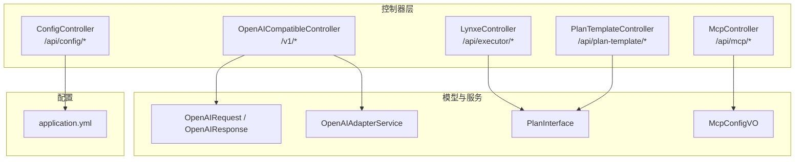
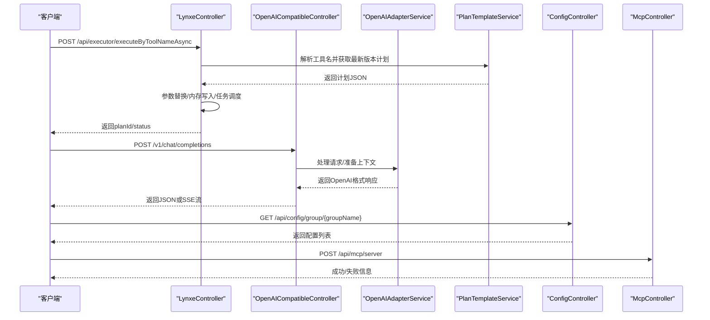
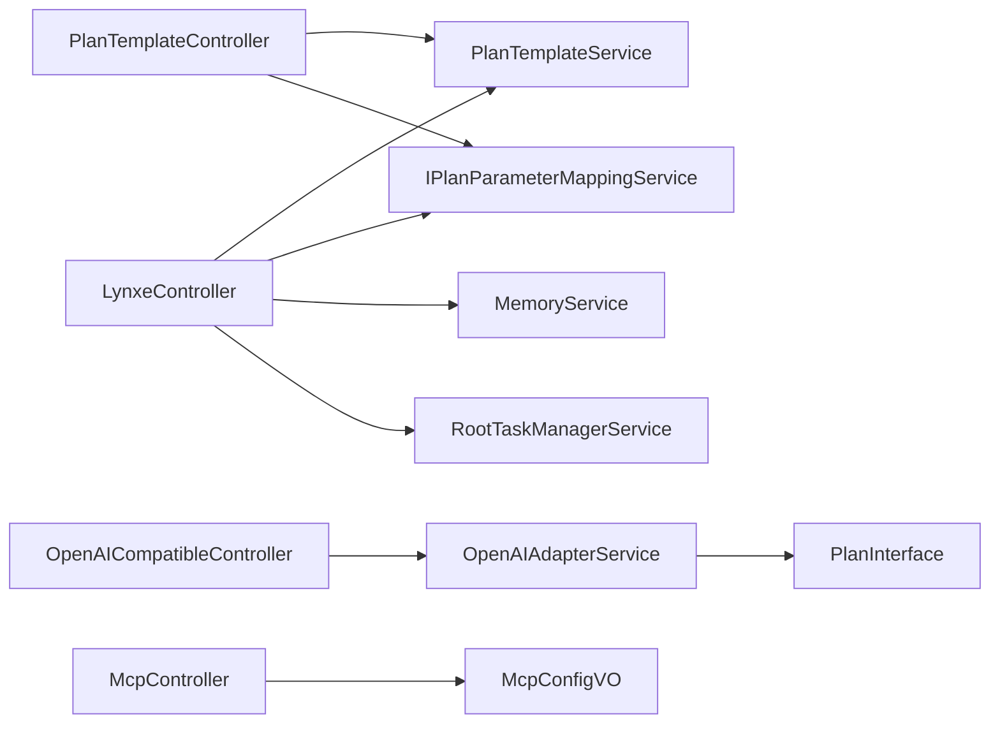

# API参考

<cite>
**本文引用的文件**
- [LynxeController.java](file://src/main/java/com/alibaba/cloud/ai/lynxe/runtime/controller/LynxeController.java)
- [OpenAICompatibleController.java](file://src/main/java/com/alibaba/cloud/ai/lynxe/adapter/controller/OpenAICompatibleController.java)
- [OpenAIRequest.java](file://src/main/java/com/alibaba/cloud/ai/lynxe/adapter/model/OpenAIRequest.java)
- [OpenAIResponse.java](file://src/main/java/com/alibaba/cloud/ai/lynxe/adapter/model/OpenAIResponse.java)
- [OpenAIAdapterService.java](file://src/main/java/com/alibaba/cloud/ai/lynxe/adapter/service/OpenAIAdapterService.java)
- [ConfigController.java](file://src/main/java/com/alibaba/cloud/ai/lynxe/config/ConfigController.java)
- [IConfigService.java](file://src/main/java/com/alibaba/cloud/ai/lynxe/config/IConfigService.java)
- [PlanTemplateController.java](file://src/main/java/com/alibaba/cloud/ai/lynxe/planning/controller/PlanTemplateController.java)
- [IPlanTemplateService.java](file://src/main/java/com/alibaba/cloud/ai/lynxe/planning/service/IPlanTemplateService.java)
- [McpController.java](file://src/main/java/com/alibaba/cloud/ai/lynxe/mcp/controller/McpController.java)
- [McpConfigVO.java](file://src/main/java/com/alibaba/cloud/ai/lynxe/mcp/model/vo/McpConfigVO.java)
- [PlanInterface.java](file://src/main/java/com/alibaba/cloud/ai/lynxe/runtime/entity/vo/PlanInterface.java)
- [application.yml](file://src/main/resources/application.yml)
</cite>

## 目录
1. [简介](#简介)
2. [项目结构](#项目结构)
3. [核心组件](#核心组件)
4. [架构总览](#架构总览)
5. [详细组件分析](#详细组件分析)
6. [依赖分析](#依赖分析)
7. [性能与并发特性](#性能与并发特性)
8. [故障排查指南](#故障排查指南)
9. [结论](#结论)
10. [附录](#附录)

## 简介
本参考文档面向JManus后端服务的公开API，覆盖以下控制器与配套模型：
- LynxeController：核心执行器API，支持按工具名称同步/异步执行、查询执行详情、提交用户输入等。
- OpenAICompatibleController：OpenAI兼容API，提供/v1/chat/completions与/v1/models、/v1/health等端点。
- ConfigController：配置管理API，提供分组查询、批量更新、重置默认值、可用模型列表等。
- PlanTemplateController：计划模板API，提供保存版本、查询版本历史、获取指定版本、列出模板、删除模板、参数需求、注册为工具、导出导入、配置查询等。
- McpController：MCP协议集成API，提供MCP服务器列表、单个/批量导入、增删改启停、按名称移除等。

文档同时给出各端点的请求方法、URL路径、请求参数、请求体结构、响应格式、状态码、错误处理机制、认证方式、版本管理策略、速率限制与安全建议，并提供多语言调用示例与SDK使用指引。

## 项目结构
后端采用Spring Boot，API集中在runtime、adapter、config、planning、mcp等包下的控制器中；数据模型在adapter/model与runtime/entity/vo中定义；配置与运行参数在application.yml中集中管理。

图表来源
- [LynxeController.java](file://src/main/java/com/alibaba/cloud/ai/lynxe/runtime/controller/LynxeController.java#L1-L1205)
- [OpenAICompatibleController.java](file://src/main/java/com/alibaba/cloud/ai/lynxe/adapter/controller/OpenAICompatibleController.java#L1-L357)
- [OpenAIRequest.java](file://src/main/java/com/alibaba/cloud/ai/lynxe/adapter/model/OpenAIRequest.java#L1-L490)
- [OpenAIResponse.java](file://src/main/java/com/alibaba/cloud/ai/lynxe/adapter/model/OpenAIResponse.java#L1-L630)
- [OpenAIAdapterService.java](file://src/main/java/com/alibaba/cloud/ai/lynxe/adapter/service/OpenAIAdapterService.java#L1-L560)
- [PlanInterface.java](file://src/main/java/com/alibaba/cloud/ai/lynxe/runtime/entity/vo/PlanInterface.java#L1-L183)
- [McpConfigVO.java](file://src/main/java/com/alibaba/cloud/ai/lynxe/mcp/model/vo/McpConfigVO.java#L1-L229)
- [application.yml](file://src/main/resources/application.yml#L1-L98)

章节来源
- [LynxeController.java](file://src/main/java/com/alibaba/cloud/ai/lynxe/runtime/controller/LynxeController.java#L1-L1205)
- [OpenAICompatibleController.java](file://src/main/java/com/alibaba/cloud/ai/lynxe/adapter/controller/OpenAICompatibleController.java#L1-L357)
- [ConfigController.java](file://src/main/java/com/alibaba/cloud/ai/lynxe/config/ConfigController.java#L1-L82)
- [PlanTemplateController.java](file://src/main/java/com/alibaba/cloud/ai/lynxe/planning/controller/PlanTemplateController.java#L1-L661)
- [McpController.java](file://src/main/java/com/alibaba/cloud/ai/lynxe/mcp/controller/McpController.java#L1-L196)
- [application.yml](file://src/main/resources/application.yml#L1-L98)

## 核心组件
- LynxeController：统一入口，负责根据工具名解析计划模板ID，支持同步/异步执行、查询执行详情、提交用户输入、代理工具调用等。
- OpenAICompatibleController：适配OpenAI格式，支持流式与非流式聊天补全、模型列表、健康检查。
- ConfigController：提供配置分组查询、批量更新、重置默认值、可用模型枚举等。
- PlanTemplateController：提供计划模板的保存/版本管理、查询版本、导出导入、参数需求、注册为工具等。
- McpController：提供MCP服务器的增删改查、启用/禁用、按名称移除、批量导入等。

章节来源
- [LynxeController.java](file://src/main/java/com/alibaba/cloud/ai/lynxe/runtime/controller/LynxeController.java#L1-L1205)
- [OpenAICompatibleController.java](file://src/main/java/com/alibaba/cloud/ai/lynxe/adapter/controller/OpenAICompatibleController.java#L1-L357)
- [ConfigController.java](file://src/main/java/com/alibaba/cloud/ai/lynxe/config/ConfigController.java#L1-L82)
- [PlanTemplateController.java](file://src/main/java/com/alibaba/cloud/ai/lynxe/planning/controller/PlanTemplateController.java#L1-L661)
- [McpController.java](file://src/main/java/com/alibaba/cloud/ai/lynxe/mcp/controller/McpController.java#L1-L196)

## 架构总览
下图展示API到服务层的调用链路与关键数据模型。

图表来源
- [LynxeController.java](file://src/main/java/com/alibaba/cloud/ai/lynxe/runtime/controller/LynxeController.java#L1-L1205)
- [OpenAICompatibleController.java](file://src/main/java/com/alibaba/cloud/ai/lynxe/adapter/controller/OpenAICompatibleController.java#L1-L357)
- [OpenAIAdapterService.java](file://src/main/java/com/alibaba/cloud/ai/lynxe/adapter/service/OpenAIAdapterService.java#L1-L560)
- [PlanTemplateController.java](file://src/main/java/com/alibaba/cloud/ai/lynxe/planning/controller/PlanTemplateController.java#L1-L661)
- [ConfigController.java](file://src/main/java/com/alibaba/cloud/ai/lynxe/config/ConfigController.java#L1-L82)
- [McpController.java](file://src/main/java/com/alibaba/cloud/ai/lynxe/mcp/controller/McpController.java#L1-L196)

## 详细组件分析

### LynxeController API参考
- 基础路径：/api/executor
- 功能概览：按工具名同步/异步执行计划、查询执行详情、提交用户输入、获取代理执行记录。

端点一览
- GET /executeByToolNameSync/{toolName}
  - 方法：GET
  - 查询参数：
    - allParams：字符串键值对，用于传递替换参数
    - serviceGroup：服务组标识（可选）
  - 行为：根据工具名解析计划模板ID，同步执行并返回结果
  - 响应：成功返回包含状态与结果的对象；失败返回错误信息
  - 状态码：200/400/500

- POST /executeByToolNameAsync
  - 方法：POST
  - 请求体：包含toolName、serviceGroup、conversationId、uploadedFiles、uploadKey、replacementParams等
  - 行为：异步执行计划，返回任务ID与初始状态
  - 响应：包含planId、status、message、conversationId、toolName、planTemplateId
  - 状态码：200/400/500

- POST /executeByToolNameSync
  - 方法：POST
  - 请求体：同上，但同步返回最终结果
  - 响应：包含status、result、conversationId
  - 状态码：200/400/500

- GET /details/{planId}
  - 方法：GET
  - 行为：返回执行树摘要，合并用户等待状态；若缓存异常则抛出业务异常
  - 响应：PlanExecutionRecord序列化后的JSON字符串
  - 状态码：200/404/500

- DELETE /details/{planId}
  - 方法：DELETE
  - 行为：返回“无需删除”提示（数据库已持久化）
  - 响应：消息与planId
  - 状态码：200/404

- POST /submit-input/{planId}
  - 方法：POST
  - 请求体：表单字段映射（Map<String,String>）
  - 行为：提交用户输入，若无等待计划则返回错误
  - 响应：成功消息或错误信息
  - 状态码：200/400/500

- GET /agent-execution/{stepId}
  - 方法：GET
  - 行为：返回步骤级代理执行详情（含ThinkActRecord）
  - 响应：AgentExecutionRecord对象
  - 状态码：200/404/500

认证与安全
- 控制器未内置鉴权注解，但会从HTTP请求头提取Authorization与USERNAME并写入AuthContext，便于后续链路使用。
- 建议在网关或过滤器层统一鉴权。

错误处理
- 参数校验失败返回400
- 执行异常返回500
- 业务异常通过异常缓存触发PlanException

请求/响应示例（路径引用）
- 同步执行请求体结构参考：[LynxeController.java](file://src/main/java/com/alibaba/cloud/ai/lynxe/runtime/controller/LynxeController.java#L318-L369)
- 异步执行请求体结构参考：[LynxeController.java](file://src/main/java/com/alibaba/cloud/ai/lynxe/runtime/controller/LynxeController.java#L220-L305)
- 提交用户输入请求体结构参考：[LynxeController.java](file://src/main/java/com/alibaba/cloud/ai/lynxe/runtime/controller/LynxeController.java#L467-L498)
- 执行详情响应结构参考：[LynxeController.java](file://src/main/java/com/alibaba/cloud/ai/lynxe/runtime/controller/LynxeController.java#L378-L441)

章节来源
- [LynxeController.java](file://src/main/java/com/alibaba/cloud/ai/lynxe/runtime/controller/LynxeController.java#L1-L1205)

### OpenAICompatibleController API参考
- 基础路径：/
- 兼容端点：/v1/chat/completions、/v1/models、/v1/health

端点一览
- POST /v1/chat/completions
  - 方法：POST
  - 请求体：OpenAIRequest（支持messages、temperature、top_p、max_tokens、stream、tools、tool_choice等）
  - 行为：
    - stream=true：返回SSE流，每块为OpenAI chunk格式，以"data: ..."开头，最后以"data: [DONE]"结束
    - stream=false：返回标准OpenAI JSON响应
  - 响应：文本/JSON，Content-Type依据是否流式
  - 状态码：200/400/500

- GET /v1/models
  - 方法：GET
  - 行为：返回单模型信息（固定模型ID与拥有者）
  - 响应：包含对象列表与数据项
  - 状态码：200/500

- GET /v1/health
  - 方法：GET
  - 行为：健康检查
  - 响应：包含状态、服务名、时间戳、模型ID
  - 状态码：200

请求/响应示例（路径引用）
- OpenAIRequest模型定义参考：[OpenAIRequest.java](file://src/main/java/com/alibaba/cloud/ai/lynxe/adapter/model/OpenAIRequest.java#L1-L490)
- OpenAIResponse模型定义参考：[OpenAIResponse.java](file://src/main/java/com/alibaba/cloud/ai/lynxe/adapter/model/OpenAIResponse.java#L1-L630)
- 流式响应构建参考：[OpenAICompatibleController.java](file://src/main/java/com/alibaba/cloud/ai/lynxe/adapter/controller/OpenAICompatibleController.java#L121-L176)
- 非流式响应构建参考：[OpenAICompatibleController.java](file://src/main/java/com/alibaba/cloud/ai/lynxe/adapter/controller/OpenAICompatibleController.java#L246-L261)

章节来源
- [OpenAICompatibleController.java](file://src/main/java/com/alibaba/cloud/ai/lynxe/adapter/controller/OpenAICompatibleController.java#L1-L357)
- [OpenAIRequest.java](file://src/main/java/com/alibaba/cloud/ai/lynxe/adapter/model/OpenAIRequest.java#L1-L490)
- [OpenAIResponse.java](file://src/main/java/com/alibaba/cloud/ai/lynxe/adapter/model/OpenAIResponse.java#L1-L630)

### ConfigController API参考
- 基础路径：/api/config

端点一览
- GET /group/{groupName}
  - 方法：GET
  - 路径参数：groupName
  - 响应：该组下的配置列表
  - 状态码：200/500

- POST /batch-update
  - 方法：POST
  - 请求体：配置数组
  - 响应：200 OK
  - 状态码：200/500

- POST /reset-all-defaults
  - 方法：POST
  - 响应：200 OK
  - 状态码：200/500

- GET /available-models
  - 方法：GET
  - 响应：包含选项数组与总数
  - 状态码：200/500

认证与安全
- 未内置鉴权，建议结合全局拦截器或网关进行鉴权与审计。

请求/响应示例（路径引用）
- 分组查询参考：[ConfigController.java](file://src/main/java/com/alibaba/cloud/ai/lynxe/config/ConfigController.java#L46-L49)
- 批量更新参考：[ConfigController.java](file://src/main/java/com/alibaba/cloud/ai/lynxe/config/ConfigController.java#L51-L55)
- 重置默认值参考：[ConfigController.java](file://src/main/java/com/alibaba/cloud/ai/lynxe/config/ConfigController.java#L57-L61)
- 可用模型参考：[ConfigController.java](file://src/main/java/com/alibaba/cloud/ai/lynxe/config/ConfigController.java#L63-L79)

章节来源
- [ConfigController.java](file://src/main/java/com/alibaba/cloud/ai/lynxe/config/ConfigController.java#L1-L82)
- [IConfigService.java](file://src/main/java/com/alibaba/cloud/ai/lynxe/config/IConfigService.java#L1-L81)

### PlanTemplateController API参考
- 基础路径：/api/plan-template

端点一览
- POST /save
  - 方法：POST
  - 请求体：包含planJson
  - 行为：保存版本历史，必要时生成新计划ID；返回保存结果与版本计数
  - 响应：包含status、planId、versionCount、saved、duplicate、message、versionIndex
  - 状态码：200/400/500

- POST /versions
  - 方法：POST
  - 请求体：包含planId
  - 响应：包含planId、versionCount、versions
  - 状态码：200/400/500

- POST /get-version
  - 方法：POST
  - 请求体：包含planId与versionIndex
  - 响应：包含planId、versionIndex、versionCount、planJson
  - 状态码：200/400/404/500

- GET /list
  - 方法：GET
  - 响应：包含templates数组与count
  - 状态码：200/500

- POST /delete
  - 方法：POST
  - 请求体：包含planId
  - 响应：包含status、message、planId
  - 状态码：200/400/500

- GET /{planTemplateId}/parameters
  - 方法：GET
  - 路径参数：planTemplateId
  - 响应：包含parameters、hasParameters、requirements
  - 状态码：200/404/500

- POST /create-or-update-with-tool
  - 方法：POST
  - 请求体：PlanTemplateConfigVO
  - 响应：包含success、planTemplateId、toolRegistered
  - 状态码：200/400/500

- GET /list-config
  - 方法：GET
  - 响应：PlanTemplateConfigVO列表
  - 状态码：200/500

- GET /export-all
  - 方法：GET
  - 响应：PlanTemplateConfigVO列表
  - 状态码：200/500

- POST /import-all
  - 方法：POST
  - 请求体：PlanTemplateConfigVO数组
  - 响应：导入结果统计
  - 状态码：200/400/500

- GET /{planTemplateId}/config
  - 方法：GET
  - 路径参数：planTemplateId
  - 响应：PlanTemplateConfigVO（含步骤与工具配置）
  - 状态码：200/400/404/500

请求/响应示例（路径引用）
- 保存版本参考：[PlanTemplateController.java](file://src/main/java/com/alibaba/cloud/ai/lynxe/planning/controller/PlanTemplateController.java#L150-L209)
- 获取版本参考：[PlanTemplateController.java](file://src/main/java/com/alibaba/cloud/ai/lynxe/planning/controller/PlanTemplateController.java#L239-L282)
- 列出模板参考：[PlanTemplateController.java](file://src/main/java/com/alibaba/cloud/ai/lynxe/planning/controller/PlanTemplateController.java#L288-L318)
- 参数需求参考：[PlanTemplateController.java](file://src/main/java/com/alibaba/cloud/ai/lynxe/planning/controller/PlanTemplateController.java#L365-L392)
- 注册为工具参考：[PlanTemplateController.java](file://src/main/java/com/alibaba/cloud/ai/lynxe/planning/controller/PlanTemplateController.java#L405-L447)
- 导出导入参考：[PlanTemplateController.java](file://src/main/java/com/alibaba/cloud/ai/lynxe/planning/controller/PlanTemplateController.java#L539-L577)
- 配置查询参考：[PlanTemplateController.java](file://src/main/java/com/alibaba/cloud/ai/lynxe/planning/controller/PlanTemplateController.java#L584-L660)

章节来源
- [PlanTemplateController.java](file://src/main/java/com/alibaba/cloud/ai/lynxe/planning/controller/PlanTemplateController.java#L1-L661)
- [IPlanTemplateService.java](file://src/main/java/com/alibaba/cloud/ai/lynxe/planning/service/IPlanTemplateService.java#L1-L79)
- [PlanInterface.java](file://src/main/java/com/alibaba/cloud/ai/lynxe/runtime/entity/vo/PlanInterface.java#L1-L183)

### McpController API参考
- 基础路径：/api/mcp

端点一览
- GET /list
  - 方法：GET
  - 响应：McpConfigVO列表
  - 状态码：200/500

- POST /batch-import
  - 方法：POST
  - 请求体：McpServersRequestVO（标准化后的JSON）
  - 响应：成功消息
  - 状态码：200/400/500

- POST /server
  - 方法：POST
  - 请求体：McpServerRequestVO（单条MCP服务器配置）
  - 响应：成功/失败消息
  - 状态码：200/400/404/500

- GET /remove
  - 方法：GET
  - 查询参数：id
  - 响应：成功消息
  - 状态码：200/500

- POST /remove/{name}
  - 方法：POST
  - 路径参数：name
  - 响应：成功消息
  - 状态码：200/500

- POST /enable/{id}
  - 方法：POST
  - 路径参数：id
  - 响应：启用成功/失败
  - 状态码：200/404/500

- POST /disable/{id}
  - 方法：POST
  - 路径参数：id
  - 响应：禁用成功/失败
  - 状态码：200/404/500

请求/响应示例（路径引用）
- 列表参考：[McpController.java](file://src/main/java/com/alibaba/cloud/ai/lynxe/mcp/controller/McpController.java#L54-L59)
- 单条保存参考：[McpController.java](file://src/main/java/com/alibaba/cloud/ai/lynxe/mcp/controller/McpController.java#L85-L94)
- 批量导入参考：[McpController.java](file://src/main/java/com/alibaba/cloud/ai/lynxe/mcp/controller/McpController.java#L65-L79)
- 启用/禁用参考：[McpController.java](file://src/main/java/com/alibaba/cloud/ai/lynxe/mcp/controller/McpController.java#L147-L167)

章节来源
- [McpController.java](file://src/main/java/com/alibaba/cloud/ai/lynxe/mcp/controller/McpController.java#L1-L196)
- [McpConfigVO.java](file://src/main/java/com/alibaba/cloud/ai/lynxe/mcp/model/vo/McpConfigVO.java#L1-L229)

## 依赖分析
- LynxeController依赖：
  - 计划模板服务：解析工具名获取计划模板ID，获取最新版本计划
  - 参数映射服务：执行前进行占位符替换
  - 内存服务：基于对话ID写入记忆
  - 任务管理：异步执行完成后完成任务状态
- OpenAICompatibleController依赖：
  - OpenAIAdapterService：将OpenAI请求转为内部执行上下文，输出OpenAI格式响应
- PlanTemplateController依赖：
  - 计划模板服务：保存/查询版本、导出导入
  - 参数映射服务：提取参数占位符与需求
- McpController依赖：
  - MCP服务：保存/删除/启用/禁用MCP服务器

图表来源
- [LynxeController.java](file://src/main/java/com/alibaba/cloud/ai/lynxe/runtime/controller/LynxeController.java#L1-L1205)
- [OpenAICompatibleController.java](file://src/main/java/com/alibaba/cloud/ai/lynxe/adapter/controller/OpenAICompatibleController.java#L1-L357)
- [OpenAIAdapterService.java](file://src/main/java/com/alibaba/cloud/ai/lynxe/adapter/service/OpenAIAdapterService.java#L1-L560)
- [PlanTemplateController.java](file://src/main/java/com/alibaba/cloud/ai/lynxe/planning/controller/PlanTemplateController.java#L1-L661)
- [McpController.java](file://src/main/java/com/alibaba/cloud/ai/lynxe/mcp/controller/McpController.java#L1-L196)
- [PlanInterface.java](file://src/main/java/com/alibaba/cloud/ai/lynxe/runtime/entity/vo/PlanInterface.java#L1-L183)
- [McpConfigVO.java](file://src/main/java/com/alibaba/cloud/ai/lynxe/mcp/model/vo/McpConfigVO.java#L1-L229)

## 性能与并发特性
- 并发与异步：LynxeController支持异步执行，返回任务ID后由后台完成执行并更新任务状态；OpenAICompatibleController在流式模式下阻塞等待完成，非流式直接返回。
- 超时控制：OpenAI兼容控制器设置流式超时与轮询间隔，避免长时间占用线程。
- 数据持久化：执行详情通过数据库持久化，LynxeController删除接口返回“无需删除”，体现以数据库为中心的记录策略。
- 配置与资源：application.yml中配置了文件上传大小、连接池参数、计划轮询策略等，影响整体吞吐与稳定性。

章节来源
- [LynxeController.java](file://src/main/java/com/alibaba/cloud/ai/lynxe/runtime/controller/LynxeController.java#L1-L1205)
- [OpenAICompatibleController.java](file://src/main/java/com/alibaba/cloud/ai/lynxe/adapter/controller/OpenAICompatibleController.java#L1-L357)
- [application.yml](file://src/main/resources/application.yml#L1-L98)

## 故障排查指南
常见问题与定位要点
- OpenAI兼容端点
  - 非法请求：当messages为空或消息内容为空时返回400
  - 流式超时：超过预设超时后返回错误chunk
  - 错误日志：控制器与适配器均记录详细错误堆栈
- Lynxe执行
  - 工具名缺失：返回400错误
  - 执行异常：返回500错误；异常缓存命中时抛出业务异常
  - 用户输入等待：提交时若无等待计划返回400
- 配置管理
  - 批量更新/重置默认值：若发生异常返回500
- 计划模板
  - 版本索引越界：返回400
  - 导入/导出：异常时返回500
- MCP
  - 重复名称/未找到：返回400/404
  - 启用/禁用：异常返回500

章节来源
- [OpenAICompatibleController.java](file://src/main/java/com/alibaba/cloud/ai/lynxe/adapter/controller/OpenAICompatibleController.java#L1-L357)
- [LynxeController.java](file://src/main/java/com/alibaba/cloud/ai/lynxe/runtime/controller/LynxeController.java#L1-L1205)
- [ConfigController.java](file://src/main/java/com/alibaba/cloud/ai/lynxe/config/ConfigController.java#L1-L82)
- [PlanTemplateController.java](file://src/main/java/com/alibaba/cloud/ai/lynxe/planning/controller/PlanTemplateController.java#L1-L661)
- [McpController.java](file://src/main/java/com/alibaba/cloud/ai/lynxe/mcp/controller/McpController.java#L1-L196)

## 结论
本API参考文档系统性梳理了JManus的核心执行器、OpenAI兼容接口、配置管理、计划模板与MCP集成的公开端点，明确了请求/响应结构、状态码、错误处理与安全注意事项。建议在生产环境中配合统一鉴权、限流与审计策略，确保API的安全与稳定。

## 附录

### API版本管理策略
- 当前控制器未显式声明版本号，建议通过基础路径版本化（如/api/v1/executor）或在请求头中携带版本信息，以便未来演进。

### 速率限制与安全建议
- 速率限制：当前未内置限流逻辑，建议在网关层或过滤器层实现基于IP/用户/计划模板维度的限流。
- 安全建议：
  - 统一鉴权：在网关或全局过滤器中校验Authorization与用户名
  - CORS：OpenAICompatibleController已允许跨域，生产环境建议限定来源
  - 输入校验：对请求体进行严格校验与长度限制
  - 审计日志：记录关键操作（执行、导入、启用/禁用MCP等）

### 认证方式
- LynxeController会从请求头读取Authorization与USERNAME并写入AuthContext，具体鉴权策略需在上层实现。

章节来源
- [LynxeController.java](file://src/main/java/com/alibaba/cloud/ai/lynxe/runtime/controller/LynxeController.java#L586-L596)
- [OpenAICompatibleController.java](file://src/main/java/com/alibaba/cloud/ai/lynxe/adapter/controller/OpenAICompatibleController.java#L51-L53)

### 多语言调用示例与SDK使用指引
- Python（requests）
  - OpenAI兼容聊天补全（非流式）
    - 请求：POST /v1/chat/completions
    - 示例：构造OpenAIRequest对象，设置messages与model，发送JSON请求
    - 参考模型：[OpenAIRequest.java](file://src/main/java/com/alibaba/cloud/ai/lynxe/adapter/model/OpenAIRequest.java#L1-L490)
  - OpenAI兼容聊天补全（流式）
    - 请求：POST /v1/chat/completions，设置stream=true
    - 处理：逐块解析"data: ..."行，直到遇到"[DONE]"
    - 参考实现：[OpenAICompatibleController.java](file://src/main/java/com/alibaba/cloud/ai/lynxe/adapter/controller/OpenAICompatibleController.java#L121-L176)
  - Lynxe同步执行
    - 请求：POST /api/executor/executeByToolNameSync
    - 示例：发送包含toolName与可选参数的JSON
    - 参考结构：[LynxeController.java](file://src/main/java/com/alibaba/cloud/ai/lynxe/runtime/controller/LynxeController.java#L323-L369)
  - Lynxe异步执行
    - 请求：POST /api/executor/executeByToolNameAsync
    - 示例：发送包含toolName与可选参数的JSON，随后轮询/details/{planId}获取结果
    - 参考结构：[LynxeController.java](file://src/main/java/com/alibaba/cloud/ai/lynxe/runtime/controller/LynxeController.java#L220-L305)
  - 配置管理
    - 请求：GET /api/config/group/{groupName}
    - 参考实现：[ConfigController.java](file://src/main/java/com/alibaba/cloud/ai/lynxe/config/ConfigController.java#L46-L49)
  - 计划模板
    - 请求：POST /api/plan-template/save
    - 示例：发送包含planJson的JSON
    - 参考实现：[PlanTemplateController.java](file://src/main/java/com/alibaba/cloud/ai/lynxe/planning/controller/PlanTemplateController.java#L150-L209)
  - MCP
    - 请求：POST /api/mcp/server
    - 示例：发送McpServerRequestVO对应的JSON
    - 参考实现：[McpController.java](file://src/main/java/com/alibaba/cloud/ai/lynxe/mcp/controller/McpController.java#L85-L94)

- JavaScript（fetch）
  - OpenAI兼容聊天补全（流式）
    - 使用ReadableStream处理SSE响应，逐块解析"data: ..."行
    - 参考实现：[OpenAICompatibleController.java](file://src/main/java/com/alibaba/cloud/ai/lynxe/adapter/controller/OpenAICompatibleController.java#L121-L176)
  - Lynxe异步执行
    - 发送POST请求至/api/executor/executeByToolNameAsync，轮询/details/{planId}
    - 参考实现：[LynxeController.java](file://src/main/java/com/alibaba/cloud/ai/lynxe/runtime/controller/LynxeController.java#L220-L305)

- Java（OkHttp/RestTemplate）
  - 可参考控制器中的请求体结构与响应格式，构造对应对象并序列化为JSON发送
  - 参考模型与控制器：
    - [OpenAIRequest.java](file://src/main/java/com/alibaba/cloud/ai/lynxe/adapter/model/OpenAIRequest.java#L1-L490)
    - [OpenAIResponse.java](file://src/main/java/com/alibaba/cloud/ai/lynxe/adapter/model/OpenAIResponse.java#L1-L630)
    - [LynxeController.java](file://src/main/java/com/alibaba/cloud/ai/lynxe/runtime/controller/LynxeController.java#L318-L369)
    - [PlanTemplateController.java](file://src/main/java/com/alibaba/cloud/ai/lynxe/planning/controller/PlanTemplateController.java#L150-L209)
    - [McpController.java](file://src/main/java/com/alibaba/cloud/ai/lynxe/mcp/controller/McpController.java#L85-L94)

- SDK使用建议
  - 建议封装OpenAIRequest/Response与各控制器的请求/响应对象，统一处理认证头、超时与重试
  - 对于流式响应，提供回调或事件监听机制，便于前端实时渲染