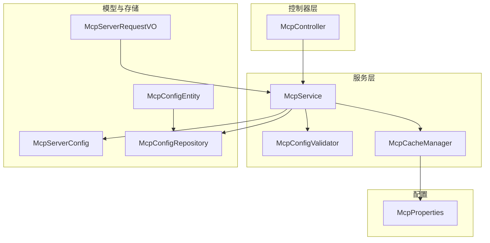
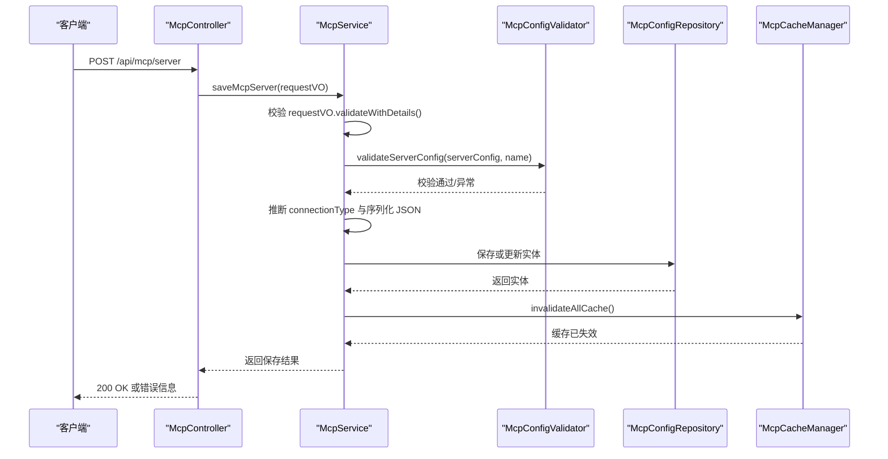
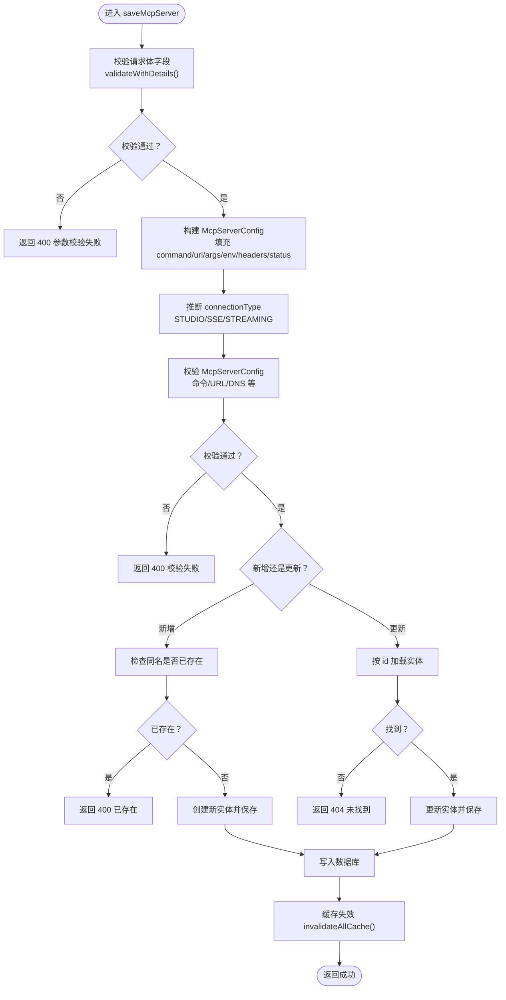
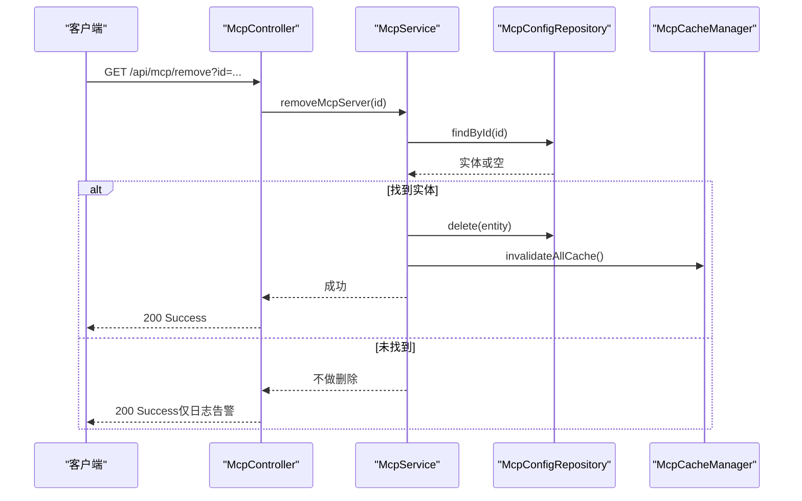
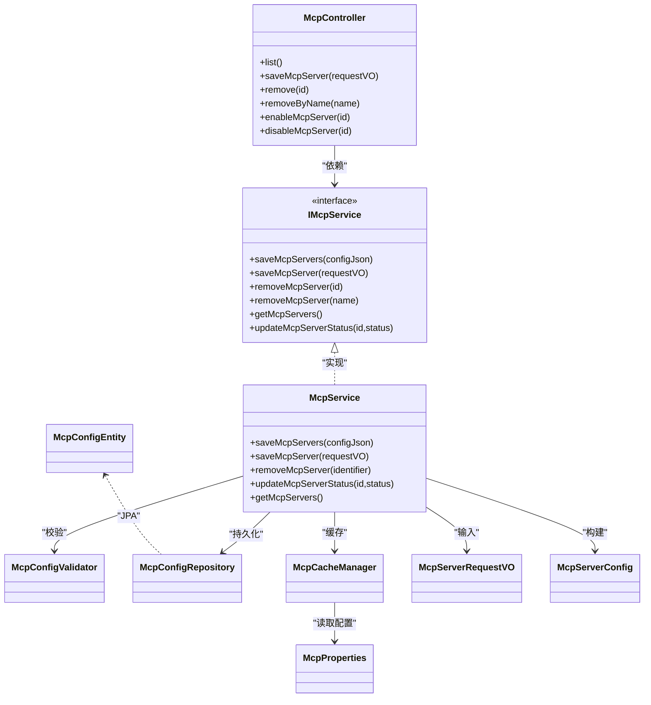

# MCP服务器管理API

<cite>
**本文引用的文件**
- [McpController.java](file://src/main/java/com/alibaba/cloud/ai/lynxe/mcp/controller/McpController.java)
- [McpService.java](file://src/main/java/com/alibaba/cloud/ai/lynxe/mcp/service/McpService.java)
- [IMcpService.java](file://src/main/java/com/alibaba/cloud/ai/lynxe/mcp/service/IMcpService.java)
- [McpServerRequestVO.java](file://src/main/java/com/alibaba/cloud/ai/lynxe/mcp/model/vo/McpServerRequestVO.java)
- [McpServerConfig.java](file://src/main/java/com/alibaba/cloud/ai/lynxe/mcp/model/vo/McpServerConfig.java)
- [McpConfigEntity.java](file://src/main/java/com/alibaba/cloud/ai/lynxe/mcp/model/po/McpConfigEntity.java)
- [McpConfigRepository.java](file://src/main/java/com/alibaba/cloud/ai/lynxe/mcp/repository/McpConfigRepository.java)
- [McpConfigValidator.java](file://src/main/java/com/alibaba/cloud/ai/lynxe/mcp/service/McpConfigValidator.java)
- [McpCacheManager.java](file://src/main/java/com/alibaba/cloud/ai/lynxe/mcp/service/McpCacheManager.java)
- [McpProperties.java](file://src/main/java/com/alibaba/cloud/ai/lynxe/mcp/config/McpProperties.java)
- [McpConfigValidatorTest.java](file://src/test/java/com/alibaba/cloud/ai/lynxe/mcp/service/McpConfigValidatorTest.java)
</cite>

## 目录
1. [简介](#简介)
2. [项目结构](#项目结构)
3. [核心组件](#核心组件)
4. [架构总览](#架构总览)
5. [详细组件分析](#详细组件分析)
6. [依赖关系分析](#依赖关系分析)
7. [性能与可靠性](#性能与可靠性)
8. [故障排查指南](#故障排查指南)
9. [结论](#结论)
10. [附录：请求示例与字段说明](#附录请求示例与字段说明)

## 简介
本文件面向使用 JManus 的 MCP 服务器管理能力的开发者与运维人员，系统性梳理通过 McpController 提供的单个 MCP 服务器增删改查接口，重点说明：
- saveMcpServer 端点如何通过 McpServerRequestVO 接收服务器配置参数（包括 mcpServerName、connectionType、command/url、args、env、headers 等），并实现新增与更新操作；
- remove 与 removeByName 端点的删除逻辑（按 ID 与按名称）；
- 完整请求示例：STUDIO 类型（需 command）、SSE/STREAMING 类型（需 url）；
- 服务层 McpService 如何进行配置有效性校验、数据库持久化与缓存更新；
- 错误处理机制：重复名称校验、参数缺失提示、非法状态处理等。

## 项目结构
围绕 MCP 服务器管理的关键模块如下：
- 控制器层：McpController 提供 REST 接口，负责接收请求、返回响应；
- 服务层：McpService 实现业务逻辑，协调校验、持久化与缓存；
- 模型层：McpServerRequestVO（请求体）、McpServerConfig（内部配置对象）、McpConfigEntity（持久化实体）；
- 存储层：McpConfigRepository 基于 JPA 访问数据库；
- 校验与缓存：McpConfigValidator 负责配置校验；McpCacheManager 负责缓存失效与刷新；
- 配置属性：McpProperties 提供连接超时、重试、SSE 路径后缀等全局配置。

图表来源
- [McpController.java](file://src/main/java/com/alibaba/cloud/ai/lynxe/mcp/controller/McpController.java#L1-L196)
- [McpService.java](file://src/main/java/com/alibaba/cloud/ai/lynxe/mcp/service/McpService.java#L1-L352)
- [McpServerRequestVO.java](file://src/main/java/com/alibaba/cloud/ai/lynxe/mcp/model/vo/McpServerRequestVO.java#L1-L355)
- [McpServerConfig.java](file://src/main/java/com/alibaba/cloud/ai/lynxe/mcp/model/vo/McpServerConfig.java#L1-L251)
- [McpConfigEntity.java](file://src/main/java/com/alibaba/cloud/ai/lynxe/mcp/model/po/McpConfigEntity.java#L1-L107)
- [McpConfigRepository.java](file://src/main/java/com/alibaba/cloud/ai/lynxe/mcp/repository/McpConfigRepository.java#L1-L42)
- [McpConfigValidator.java](file://src/main/java/com/alibaba/cloud/ai/lynxe/mcp/service/McpConfigValidator.java#L1-L391)
- [McpCacheManager.java](file://src/main/java/com/alibaba/cloud/ai/lynxe/mcp/service/McpCacheManager.java#L1-L200)
- [McpProperties.java](file://src/main/java/com/alibaba/cloud/ai/lynxe/mcp/config/McpProperties.java#L1-L110)

章节来源
- [McpController.java](file://src/main/java/com/alibaba/cloud/ai/lynxe/mcp/controller/McpController.java#L1-L196)
- [McpService.java](file://src/main/java/com/alibaba/cloud/ai/lynxe/mcp/service/McpService.java#L1-L352)

## 核心组件
- McpController：暴露 /api/mcp/list、/api/mcp/server、/api/mcp/batch-import、/api/mcp/remove、/api/mcp/remove/{name}、/api/mcp/enable/{id}、/api/mcp/disable/{id} 等端点，统一返回 ResponseEntity。
- McpService：实现保存、删除、查询、启用/禁用、批量导入等核心业务；调用校验器与仓库；在成功后触发缓存失效以刷新服务列表。
- McpServerRequestVO：单条服务器配置请求体，支持新增（id 为空）与更新（id 非空）；内置字段校验逻辑。
- McpServerConfig：内部配置对象，负责根据 command/url 推断连接类型（STUDIO/SSE/STREAMING），并序列化为 JSON 存入数据库。
- McpConfigEntity：JPA 实体，映射 mcp_config 表，包含 mcpServerName、connectionType、connectionConfig、status 等字段。
- McpConfigRepository：JPA 仓库，提供按名称查询与按状态查询等方法。
- McpConfigValidator：集中式校验器，覆盖命令格式、URL 协议与路径、DNS 解析、参数完整性等。
- McpCacheManager：缓存管理器，负责失效与刷新，确保配置变更后服务列表及时生效。
- McpProperties：MCP 连接相关全局配置（重试次数、超时、SSE 路径后缀、User-Agent 等）。

章节来源
- [IMcpService.java](file://src/main/java/com/alibaba/cloud/ai/lynxe/mcp/service/IMcpService.java#L1-L95)
- [McpServerRequestVO.java](file://src/main/java/com/alibaba/cloud/ai/lynxe/mcp/model/vo/McpServerRequestVO.java#L1-L355)
- [McpServerConfig.java](file://src/main/java/com/alibaba/cloud/ai/lynxe/mcp/model/vo/McpServerConfig.java#L1-L251)
- [McpConfigEntity.java](file://src/main/java/com/alibaba/cloud/ai/lynxe/mcp/model/po/McpConfigEntity.java#L1-L107)
- [McpConfigRepository.java](file://src/main/java/com/alibaba/cloud/ai/lynxe/mcp/repository/McpConfigRepository.java#L1-L42)
- [McpConfigValidator.java](file://src/main/java/com/alibaba/cloud/ai/lynxe/mcp/service/McpConfigValidator.java#L1-L391)
- [McpCacheManager.java](file://src/main/java/com/alibaba/cloud/ai/lynxe/mcp/service/McpCacheManager.java#L1-L200)
- [McpProperties.java](file://src/main/java/com/alibaba/cloud/ai/lynxe/mcp/config/McpProperties.java#L1-L110)

## 架构总览
下图展示了从控制器到服务层、校验器、仓库与缓存的整体交互流程。

图表来源
- [McpController.java](file://src/main/java/com/alibaba/cloud/ai/lynxe/mcp/controller/McpController.java#L81-L122)
- [McpService.java](file://src/main/java/com/alibaba/cloud/ai/lynxe/mcp/service/McpService.java#L143-L213)
- [McpConfigValidator.java](file://src/main/java/com/alibaba/cloud/ai/lynxe/mcp/service/McpConfigValidator.java#L80-L107)
- [McpConfigRepository.java](file://src/main/java/com/alibaba/cloud/ai/lynxe/mcp/repository/McpConfigRepository.java#L30-L41)
- [McpCacheManager.java](file://src/main/java/com/alibaba/cloud/ai/lynxe/mcp/service/McpCacheManager.java#L1-L200)

## 详细组件分析

### 保存与更新：saveMcpServer 端点
- 请求体：McpServerRequestVO
  - 关键字段：mcpServerName、connectionType、command（STUDIO 必填）、url（SSE/STREAMING 必填）、args、env、headers、status
  - 判定更新：id 非空视为更新；否则为新增
- 服务层处理：
  - 先对请求体进行字段级校验（非空、类型匹配、URL 合法性、路径包含规则等）
  - 将请求体转换为 McpServerConfig，推断 connectionType（command 非空 → STUDIO；url 包含 sse → SSE；否则 STREAMING）
  - 校验 McpServerConfig（命令合法性、URL 协议与主机、DNS 可达性等）
  - 新增场景：若同名服务器已存在则抛出“已存在”异常
  - 更新场景：若 id 对应记录不存在则抛出“未找到”异常
  - 写入数据库：设置 mcpServerName、connectionConfig（JSON）、connectionType、status
  - 触发缓存失效：invalidateAllCache，以便重新加载服务列表
- 响应：成功返回“添加/更新成功”，失败返回 400 并携带具体错误信息

图表来源
- [McpController.java](file://src/main/java/com/alibaba/cloud/ai/lynxe/mcp/controller/McpController.java#L81-L122)
- [McpService.java](file://src/main/java/com/alibaba/cloud/ai/lynxe/mcp/service/McpService.java#L143-L213)
- [McpServerRequestVO.java](file://src/main/java/com/alibaba/cloud/ai/lynxe/mcp/model/vo/McpServerRequestVO.java#L167-L266)
- [McpServerConfig.java](file://src/main/java/com/alibaba/cloud/ai/lynxe/mcp/model/vo/McpServerConfig.java#L125-L173)
- [McpConfigValidator.java](file://src/main/java/com/alibaba/cloud/ai/lynxe/mcp/service/McpConfigValidator.java#L80-L107)

章节来源
- [McpController.java](file://src/main/java/com/alibaba/cloud/ai/lynxe/mcp/controller/McpController.java#L81-L122)
- [McpService.java](file://src/main/java/com/alibaba/cloud/ai/lynxe/mcp/service/McpService.java#L143-L213)
- [McpServerRequestVO.java](file://src/main/java/com/alibaba/cloud/ai/lynxe/mcp/model/vo/McpServerRequestVO.java#L167-L266)
- [McpServerConfig.java](file://src/main/java/com/alibaba/cloud/ai/lynxe/mcp/model/vo/McpServerConfig.java#L125-L173)
- [McpConfigValidator.java](file://src/main/java/com/alibaba/cloud/ai/lynxe/mcp/service/McpConfigValidator.java#L80-L107)

### 删除：remove 与 removeByName
- remove：按 ID 删除
- removeByName：按名称删除
- 通用逻辑：
  - 根据传入标识（Long 或 String）定位实体
  - 若存在则删除并触发缓存失效；否则记录告警但不报错
- 返回：统一返回“Success”

图表来源
- [McpController.java](file://src/main/java/com/alibaba/cloud/ai/lynxe/mcp/controller/McpController.java#L124-L141)
- [McpService.java](file://src/main/java/com/alibaba/cloud/ai/lynxe/mcp/service/McpService.java#L215-L259)
- [McpConfigRepository.java](file://src/main/java/com/alibaba/cloud/ai/lynxe/mcp/repository/McpConfigRepository.java#L30-L41)
- [McpCacheManager.java](file://src/main/java/com/alibaba/cloud/ai/lynxe/mcp/service/McpCacheManager.java#L1-L200)

章节来源
- [McpController.java](file://src/main/java/com/alibaba/cloud/ai/lynxe/mcp/controller/McpController.java#L124-L141)
- [McpService.java](file://src/main/java/com/alibaba/cloud/ai/lynxe/mcp/service/McpService.java#L215-L259)

### 查询与状态控制
- 列表查询：/api/mcp/list 返回所有 MCP 服务器配置的 VO 列表
- 启用/禁用：/api/mcp/enable/{id} 与 /api/mcp/disable/{id} 支持切换状态；若目标不存在返回 404；其他异常返回 400

章节来源
- [McpController.java](file://src/main/java/com/alibaba/cloud/ai/lynxe/mcp/controller/McpController.java#L50-L79)
- [McpService.java](file://src/main/java/com/alibaba/cloud/ai/lynxe/mcp/service/McpService.java#L298-L350)

### 批量导入（扩展能力）
- /api/mcp/batch-import 接收 McpServersRequestVO，内部标准化 JSON 后调用 saveMcpServers，逐条校验并入库，最后统一失效缓存

章节来源
- [McpController.java](file://src/main/java/com/alibaba/cloud/ai/lynxe/mcp/controller/McpController.java#L61-L79)
- [McpService.java](file://src/main/java/com/alibaba/cloud/ai/lynxe/mcp/service/McpService.java#L70-L141)

## 依赖关系分析
- 控制器依赖服务层；服务层依赖校验器、仓库与缓存管理器；校验器依赖配置属性；缓存管理器依赖仓库与配置属性。
- 数据模型方面，McpConfigEntity 与 McpConfigRepository 形成稳定的持久化契约；McpServerRequestVO 与 McpServerConfig 在服务层之间传递配置。

图表来源
- [McpController.java](file://src/main/java/com/alibaba/cloud/ai/lynxe/mcp/controller/McpController.java#L1-L196)
- [IMcpService.java](file://src/main/java/com/alibaba/cloud/ai/lynxe/mcp/service/IMcpService.java#L1-L95)
- [McpService.java](file://src/main/java/com/alibaba/cloud/ai/lynxe/mcp/service/McpService.java#L1-L352)
- [McpConfigValidator.java](file://src/main/java/com/alibaba/cloud/ai/lynxe/mcp/service/McpConfigValidator.java#L1-L391)
- [McpConfigRepository.java](file://src/main/java/com/alibaba/cloud/ai/lynxe/mcp/repository/McpConfigRepository.java#L1-L42)
- [McpCacheManager.java](file://src/main/java/com/alibaba/cloud/ai/lynxe/mcp/service/McpCacheManager.java#L1-L200)
- [McpServerRequestVO.java](file://src/main/java/com/alibaba/cloud/ai/lynxe/mcp/model/vo/McpServerRequestVO.java#L1-L355)
- [McpServerConfig.java](file://src/main/java/com/alibaba/cloud/ai/lynxe/mcp/model/vo/McpServerConfig.java#L1-L251)
- [McpConfigEntity.java](file://src/main/java/com/alibaba/cloud/ai/lynxe/mcp/model/po/McpConfigEntity.java#L1-L107)
- [McpProperties.java](file://src/main/java/com/alibaba/cloud/ai/lynxe/mcp/config/McpProperties.java#L1-L110)

## 性能与可靠性
- 缓存刷新策略：每次新增/更新/删除均触发缓存失效，确保服务列表即时反映最新配置。
- DNS 预检：URL 校验阶段执行 DNS 解析预检，避免后续连接阶段出现网络问题。
- 连接超时与重试：McpProperties 提供超时与重试配置，便于在不稳定网络环境下提升成功率。
- 并发安全：缓存管理采用双缓存与原子切换，避免资源泄漏与并发竞态。

章节来源
- [McpService.java](file://src/main/java/com/alibaba/cloud/ai/lynxe/mcp/service/McpService.java#L138-L141)
- [McpConfigValidator.java](file://src/main/java/com/alibaba/cloud/ai/lynxe/mcp/service/McpConfigValidator.java#L299-L323)
- [McpProperties.java](file://src/main/java/com/alibaba/cloud/ai/lynxe/mcp/config/McpProperties.java#L1-L110)
- [McpCacheManager.java](file://src/main/java/com/alibaba/cloud/ai/lynxe/mcp/service/McpCacheManager.java#L114-L162)

## 故障排查指南
- 重复名称：新增时若同名服务器已存在，会返回“已存在”的错误信息；请修改 mcpServerName 或使用更新模式。
- 参数缺失：请求体字段校验失败会返回 400，错误信息包含具体缺失项；请补齐 mcpServerName、connectionType、STUDIO 类型的 command 或 SSE/STREAMING 类型的 url。
- URL 格式与路径：SSE 类型要求 URL 路径包含 “sse”，STREAMING 类型不允许包含 “sse”；URL 协议必须为 http/https。
- DNS 解析失败：URL 主机无法解析会触发 DNS 失败异常；请检查域名正确性与网络可达性。
- 未找到：更新时若 id 对应记录不存在，返回 404；删除时若名称或 id 不存在，仅记录告警但返回 200。
- 启用/禁用失败：若目标不存在返回 404；其他异常返回 400。

章节来源
- [McpController.java](file://src/main/java/com/alibaba/cloud/ai/lynxe/mcp/controller/McpController.java#L81-L122)
- [McpService.java](file://src/main/java/com/alibaba/cloud/ai/lynxe/mcp/service/McpService.java#L215-L350)
- [McpServerRequestVO.java](file://src/main/java/com/alibaba/cloud/ai/lynxe/mcp/model/vo/McpServerRequestVO.java#L167-L266)
- [McpConfigValidator.java](file://src/main/java/com/alibaba/cloud/ai/lynxe/mcp/service/McpConfigValidator.java#L299-L323)
- [McpConfigValidatorTest.java](file://src/test/java/com/alibaba/cloud/ai/lynxe/mcp/service/McpConfigValidatorTest.java#L1-L95)

## 结论
本 API 通过清晰的请求体模型与严格的校验机制，实现了 MCP 服务器配置的可靠新增/更新/删除与查询；服务层在持久化后统一触发缓存失效，确保运行时服务列表与配置保持一致。建议在生产环境中：
- 使用 STUDIO 类型时提供简洁可执行的 command，并将参数放入 args；
- 使用 SSE/STREAMING 类型时确保 url 正确且符合路径约定；
- 关注 DNS 与网络连通性，必要时调整 McpProperties 中的超时与重试参数。

## 附录：请求示例与字段说明

### 字段说明（来自 McpServerRequestVO）
- mcpServerName：服务器名称（必填，不可重复）
- connectionType：连接类型，支持 STUDIO、SSE、STREAMING（必填）
- command：当 connectionType=STUDIO 时必填（可执行命令）
- url：当 connectionType=SSE 或 STREAMING 时必填（HTTP/HTTPS）
- args：参数列表（可选，STUDIO 类型常用）
- env：环境变量映射（可选，STUDIO 类型常用）
- headers：HTTP 头映射（可选，SSE/STREAMING 类型常用）
- status：ENABLE/DISABLE（可选，默认 ENABLE）

章节来源
- [McpServerRequestVO.java](file://src/main/java/com/alibaba/cloud/ai/lynxe/mcp/model/vo/McpServerRequestVO.java#L36-L149)

### 示例一：STUDIO 类型（需要 command）
- 适用场景：本地可执行程序作为 MCP 服务器
- 关键点：设置 connectionType=STUDIO，提供 command；args/env 可选
- 注意：command 应为可执行文件或脚本，args 用于传参

章节来源
- [McpServerRequestVO.java](file://src/main/java/com/alibaba/cloud/ai/lynxe/mcp/model/vo/McpServerRequestVO.java#L183-L217)
- [McpServerConfig.java](file://src/main/java/com/alibaba/cloud/ai/lynxe/mcp/model/vo/McpServerConfig.java#L125-L143)

### 示例二：SSE 类型（需要 url，路径需包含 sse）
- 适用场景：基于 HTTP SSE 的流式传输
- 关键点：设置 connectionType=SSE，提供 url；headers 可选
- 注意：url 必须为 http/https，且路径包含 “sse”

章节来源
- [McpServerRequestVO.java](file://src/main/java/com/alibaba/cloud/ai/lynxe/mcp/model/vo/McpServerRequestVO.java#L192-L213)
- [McpConfigValidator.java](file://src/main/java/com/alibaba/cloud/ai/lynxe/mcp/service/McpConfigValidator.java#L305-L323)

### 示例三：STREAMING 类型（需要 url，路径不能包含 sse）
- 适用场景：基于 HTTP 流式传输（非 SSE）
- 关键点：设置 connectionType=STREAMING，提供 url；headers 可选
- 注意：url 必须为 http/https，且路径不得包含 “sse”

章节来源
- [McpServerRequestVO.java](file://src/main/java/com/alibaba/cloud/ai/lynxe/mcp/model/vo/McpServerRequestVO.java#L203-L213)
- [McpConfigValidator.java](file://src/main/java/com/alibaba/cloud/ai/lynxe/mcp/service/McpConfigValidator.java#L265-L297)

### 端点一览与行为
- GET /api/mcp/list：返回所有 MCP 服务器配置
- POST /api/mcp/server：新增或更新单条服务器配置
- POST /api/mcp/batch-import：批量导入（JSON）
- GET /api/mcp/remove?id=...：按 ID 删除
- POST /api/mcp/remove/{name}：按名称删除
- POST /api/mcp/enable/{id}：启用指定服务器
- POST /api/mcp/disable/{id}：禁用指定服务器

章节来源
- [McpController.java](file://src/main/java/com/alibaba/cloud/ai/lynxe/mcp/controller/McpController.java#L50-L193)