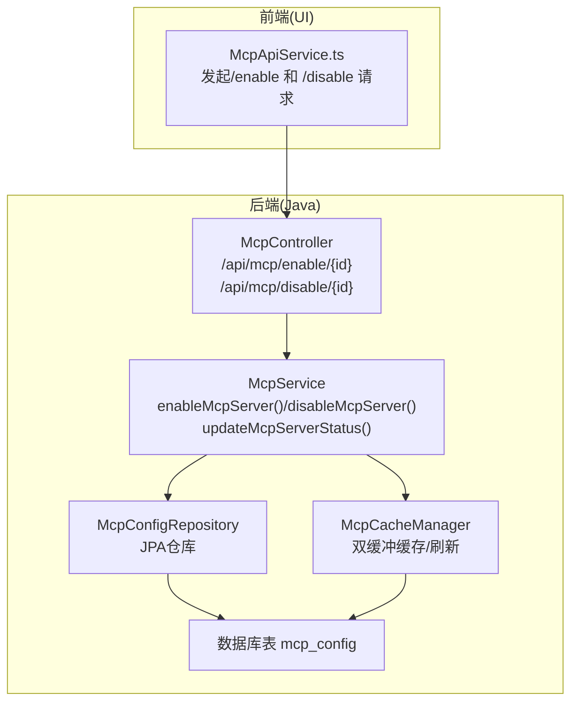
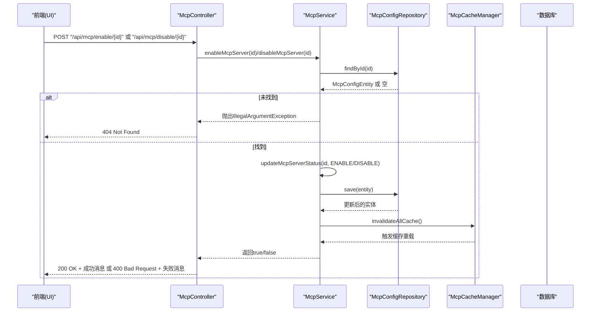
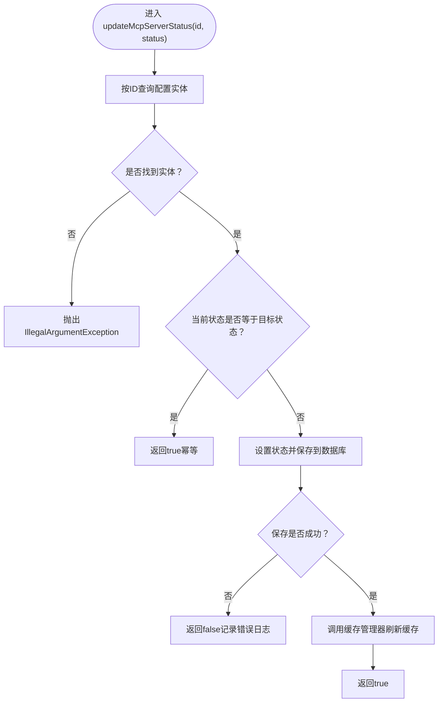
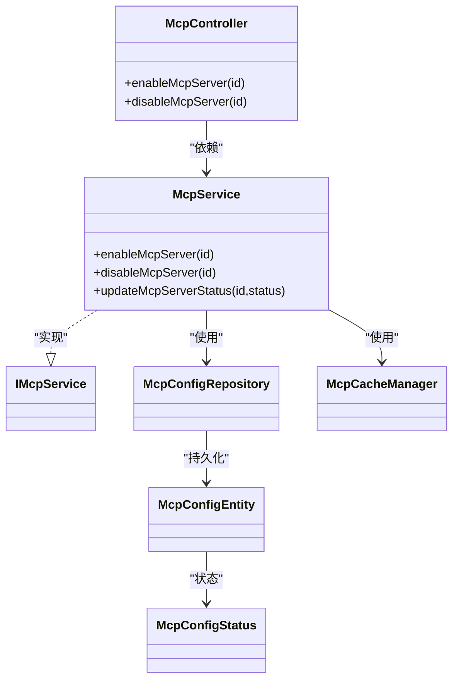

# 状态控制API

<cite>
**本文引用的文件列表**
- [McpController.java](file://src/main/java/com/alibaba/cloud/ai/lynxe/mcp/controller/McpController.java)
- [McpService.java](file://src/main/java/com/alibaba/cloud/ai/lynxe/mcp/service/McpService.java)
- [IMcpService.java](file://src/main/java/com/alibaba/cloud/ai/lynxe/mcp/service/IMcpService.java)
- [McpConfigStatus.java](file://src/main/java/com/alibaba/cloud/ai/lynxe/mcp/model/po/McpConfigStatus.java)
- [McpConfigRepository.java](file://src/main/java/com/alibaba/cloud/ai/lynxe/mcp/repository/McpConfigRepository.java)
- [McpCacheManager.java](file://src/main/java/com/alibaba/cloud/ai/lynxe/mcp/service/McpCacheManager.java)
- [McpConfigEntity.java](file://src/main/java/com/alibaba/cloud/ai/lynxe/mcp/model/po/McpConfigEntity.java)
- [mcp-api-service.ts](file://ui-vue3/src/api/mcp-api-service.ts)
</cite>

## 目录
1. [简介](#简介)
2. [项目结构与入口](#项目结构与入口)
3. [核心组件](#核心组件)
4. [架构总览](#架构总览)
5. [详细组件分析](#详细组件分析)
6. [依赖关系分析](#依赖关系分析)
7. [性能与幂等性](#性能与幂等性)
8. [故障排查指南](#故障排查指南)
9. [结论](#结论)

## 简介
本文件面向JManus MCP服务器状态控制API，聚焦于两个端点：
- POST /api/mcp/enable/{id}：启用指定ID的MCP服务器
- POST /api/mcp/disable/{id}：禁用指定ID的MCP服务器

目标是帮助开发者快速理解：
- 控制器如何接收请求并调用服务层
- 服务层如何通过统一的updateMcpServerStatus完成状态更新
- 数据库与缓存的交互策略
- 幂等性设计与错误处理
- 成功与失败场景的响应行为

## 项目结构与入口
- 控制器位于后端模块的MCP子系统中，负责暴露REST接口
- 服务层封装业务逻辑，协调数据访问与缓存刷新
- 前端通过UI模块的API服务发起请求

图表来源
- [McpController.java](file://src/main/java/com/alibaba/cloud/ai/lynxe/mcp/controller/McpController.java#L146-L192)
- [McpService.java](file://src/main/java/com/alibaba/cloud/ai/lynxe/mcp/service/McpService.java#L302-L348)
- [McpConfigRepository.java](file://src/main/java/com/alibaba/cloud/ai/lynxe/mcp/repository/McpConfigRepository.java#L29-L41)
- [McpCacheManager.java](file://src/main/java/com/alibaba/cloud/ai/lynxe/mcp/service/McpCacheManager.java#L583-L609)
- [McpConfigEntity.java](file://src/main/java/com/alibaba/cloud/ai/lynxe/mcp/model/po/McpConfigEntity.java#L27-L48)

章节来源
- [McpController.java](file://src/main/java/com/alibaba/cloud/ai/lynxe/mcp/controller/McpController.java#L146-L192)
- [mcp-api-service.ts](file://ui-vue3/src/api/mcp-api-service.ts#L192-L234)

## 核心组件
- McpController：暴露状态控制端点，接收ID路径参数，调用McpService执行状态变更，并根据返回值与异常类型返回标准HTTP响应
- McpService：实现enableMcpServer/disableMcpServer，内部委托updateMcpServerStatus完成数据库更新与缓存刷新
- McpConfigStatus：MCP配置状态枚举，包含ENABLE/DISABLE
- McpConfigRepository：JPA仓库，提供按ID查询与按状态查询能力
- McpCacheManager：缓存管理器，负责连接加载、双缓冲切换与失效刷新；在状态变更后触发缓存重载以确保配置生效

章节来源
- [McpController.java](file://src/main/java/com/alibaba/cloud/ai/lynxe/mcp/controller/McpController.java#L146-L192)
- [McpService.java](file://src/main/java/com/alibaba/cloud/ai/lynxe/mcp/service/McpService.java#L302-L348)
- [McpConfigStatus.java](file://src/main/java/com/alibaba/cloud/ai/lynxe/mcp/model/po/McpConfigStatus.java#L18-L26)
- [McpConfigRepository.java](file://src/main/java/com/alibaba/cloud/ai/lynxe/mcp/repository/McpConfigRepository.java#L29-L41)
- [McpCacheManager.java](file://src/main/java/com/alibaba/cloud/ai/lynxe/mcp/service/McpCacheManager.java#L583-L609)

## 架构总览
以下序列图展示了“启用/禁用”端点从请求到状态更新与缓存刷新的完整流程。

图表来源
- [McpController.java](file://src/main/java/com/alibaba/cloud/ai/lynxe/mcp/controller/McpController.java#L146-L192)
- [McpService.java](file://src/main/java/com/alibaba/cloud/ai/lynxe/mcp/service/McpService.java#L302-L348)
- [McpConfigRepository.java](file://src/main/java/com/alibaba/cloud/ai/lynxe/mcp/repository/McpConfigRepository.java#L29-L41)
- [McpCacheManager.java](file://src/main/java/com/alibaba/cloud/ai/lynxe/mcp/service/McpCacheManager.java#L583-L609)

## 详细组件分析

### 控制器：状态控制端点
- 路径参数：{id}为Long类型，表示MCP服务器配置的唯一标识
- 启用端点：POST /api/mcp/enable/{id}
- 禁用端点：POST /api/mcp/disable/{id}
- 错误处理：
  - 服务器不存在：抛出IllegalArgumentException，控制器捕获并返回404
  - 操作失败（如数据库写入异常）：返回400并携带错误信息
  - 成功：返回200与成功提示文本

章节来源
- [McpController.java](file://src/main/java/com/alibaba/cloud/ai/lynxe/mcp/controller/McpController.java#L146-L192)

### 服务层：状态变更与幂等性
- enableMcpServer(id)：委托updateMcpServerStatus(id, ENABLE)
- disableMcpServer(id)：委托updateMcpServerStatus(id, DISABLE)
- updateMcpServerStatus(id, status)：
  - 查询实体：若不存在则抛出IllegalArgumentException
  - 幂等性：若当前状态与目标状态一致，直接返回true，不进行数据库写入
  - 写入数据库：设置新状态并保存
  - 缓存刷新：调用invalidateAllCache()触发缓存重载，确保后续读取到最新状态
  - 异常：写入失败时返回false并记录日志

图表来源
- [McpService.java](file://src/main/java/com/alibaba/cloud/ai/lynxe/mcp/service/McpService.java#L321-L348)
- [McpCacheManager.java](file://src/main/java/com/alibaba/cloud/ai/lynxe/mcp/service/McpCacheManager.java#L583-L609)

章节来源
- [McpService.java](file://src/main/java/com/alibaba/cloud/ai/lynxe/mcp/service/McpService.java#L302-L348)

### 数据模型与状态枚举
- McpConfigStatus：定义ENABLE与DISABLE两种状态
- McpConfigEntity：持久化实体，包含主键、名称、连接类型、连接配置与状态字段，默认状态为ENABLE

章节来源
- [McpConfigStatus.java](file://src/main/java/com/alibaba/cloud/ai/lynxe/mcp/model/po/McpConfigStatus.java#L18-L26)
- [McpConfigEntity.java](file://src/main/java/com/alibaba/cloud/ai/lynxe/mcp/model/po/McpConfigEntity.java#L27-L48)

### 缓存与数据库一致性
- 缓存策略：McpCacheManager采用双缓冲机制，支持自动与手动触发缓存重载
- 刷新时机：状态变更后调用invalidateAllCache()，内部触发triggerCacheReload()，重新加载所有ENABLE状态的服务器连接
- 作用：保证运行时读取到最新的状态，避免脏缓存导致的配置不一致

章节来源
- [McpCacheManager.java](file://src/main/java/com/alibaba/cloud/ai/lynxe/mcp/service/McpCacheManager.java#L551-L609)
- [McpConfigRepository.java](file://src/main/java/com/alibaba/cloud/ai/lynxe/mcp/repository/McpConfigRepository.java#L32-L41)

### 前端调用方式
- 前端通过McpApiService分别调用：
  - enableMcpServer(id)
  - disableMcpServer(id)
- 前端会根据HTTP状态码与响应体决定UI反馈

章节来源
- [mcp-api-service.ts](file://ui-vue3/src/api/mcp-api-service.ts#L192-L234)

## 依赖关系分析
- McpController依赖McpService
- McpService依赖McpConfigRepository与McpCacheManager
- McpConfigRepository继承JPA仓库接口，提供按名称与状态查询能力
- McpConfigEntity映射数据库表mcp_config，包含状态字段

图表来源
- [McpController.java](file://src/main/java/com/alibaba/cloud/ai/lynxe/mcp/controller/McpController.java#L146-L192)
- [McpService.java](file://src/main/java/com/alibaba/cloud/ai/lynxe/mcp/service/McpService.java#L302-L348)
- [IMcpService.java](file://src/main/java/com/alibaba/cloud/ai/lynxe/mcp/service/IMcpService.java#L29-L93)
- [McpConfigRepository.java](file://src/main/java/com/alibaba/cloud/ai/lynxe/mcp/repository/McpConfigRepository.java#L29-L41)
- [McpCacheManager.java](file://src/main/java/com/alibaba/cloud/ai/lynxe/mcp/service/McpCacheManager.java#L583-L609)
- [McpConfigEntity.java](file://src/main/java/com/alibaba/cloud/ai/lynxe/mcp/model/po/McpConfigEntity.java#L27-L48)
- [McpConfigStatus.java](file://src/main/java/com/alibaba/cloud/ai/lynxe/mcp/model/po/McpConfigStatus.java#L18-L26)

## 性能与幂等性
- 幂等性设计：
  - 若目标状态与当前状态相同，updateMcpServerStatus直接返回true，避免不必要的数据库写入与缓存刷新
  - 控制器对返回值进行判断：true返回200，false返回400
- 缓存刷新策略：
  - 使用双缓冲与原子切换，避免资源泄漏
  - 在状态变更后触发缓存重载，确保配置立即生效
- 数据库访问：
  - 仅在状态变化时写入，减少写放大
  - JPA仓库提供按ID与状态查询，便于批量或条件检索

章节来源
- [McpService.java](file://src/main/java/com/alibaba/cloud/ai/lynxe/mcp/service/McpService.java#L321-L348)
- [McpCacheManager.java](file://src/main/java/com/alibaba/cloud/ai/lynxe/mcp/service/McpCacheManager.java#L114-L161)

## 故障排查指南
- 404 Not Found
  - 触发条件：updateMcpServerStatus查询不到对应ID的配置实体
  - 建议：确认ID是否正确，或先调用列表接口获取有效ID
- 400 Bad Request
  - 触发条件：数据库写入失败或业务校验失败
  - 建议：查看服务端日志中的错误信息，确认数据库连通性与权限
- 幂等性验证
  - 对同一状态重复调用应返回200且无副作用
  - 建议：在测试环境中对同一ID连续启用/禁用，观察返回值与日志

章节来源
- [McpController.java](file://src/main/java/com/alibaba/cloud/ai/lynxe/mcp/controller/McpController.java#L146-L192)
- [McpService.java](file://src/main/java/com/alibaba/cloud/ai/lynxe/mcp/service/McpService.java#L321-L348)

## 结论
- enableMcpServer与disableMcpServer通过ID精确控制MCP服务器状态
- 服务层统一由updateMcpServerStatus处理状态变更，具备幂等性与缓存一致性保障
- 控制器对异常进行分类处理，返回标准化的HTTP状态码与消息
- 建议在生产环境关注缓存刷新与数据库写入的可观测性，结合日志定位问题